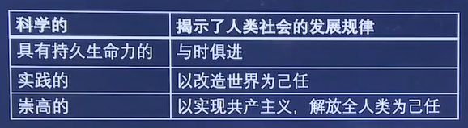
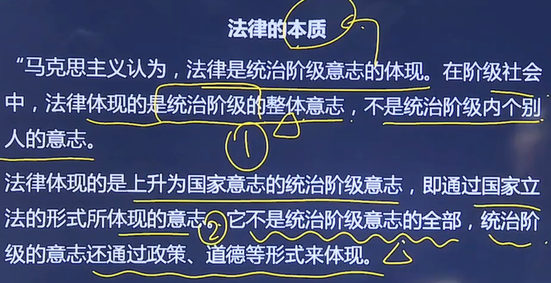
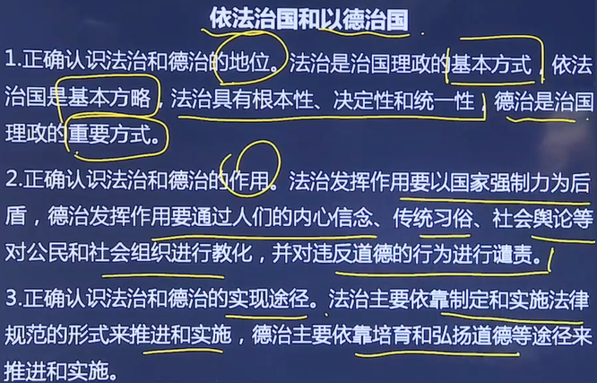

# 思修法基

## 主要框架

1. 思想修养

2. 道德修养

3. 社会主义核心价值观

4. 法律基础

## 思想修养

### 人生价值

1. 自我价值

   即个体对于自身生存和发展的价值，主要表现为对自身物质和精神的满足程度（从社会和他人的索取）。

2. 社会价值（衡量一个人是否有价值看的是社会价值，而不是自我价值）

   即个体对于社会和他人的价值，其衡量标准是个体对于社会和他人的贡献（对社会和他人的给予）。

3. 个人和社会的关系
   - 对立统一：区别、联系
   - 一般不冲突，一旦冲突则社会大于个人

### 理想信念（一些提倡）

马克思主义科学信仰 > 信仰 > 信念 > 理想

为什么信仰马克思主义？

 

### 中国精神

中国精神包括民族精神和时代精神。

1. 民族精神和时代精神的关系：

   ① 民族精神是时代精神的基础

   ② 时代精神是民族精神的时代性体现

   ③ 民族精神曾经也是时代精神，时代精神也将融入民族精神

2. 民族精神的内容：

   - 核心：爱国主义

   - 爱国主义的内涵：爱国主义体现人民群众对祖国的深厚感情，反映个人对祖国的依存关系，是人们对自己故土家园、民族和文化的归属感、认同感、尊严感与荣誉感的统一。它是调节个人与祖国的道德要求、政治原则、法律规范，也是民族精神的核心。

   - 爱国主义的特征：

     ① 历史的、具体的，在不同历史时代和文化背景下产生的爱国主义具有不同的内涵

     ② 随国家产生而产生，随国家发展而发展

     ③ 在阶级社会中，爱国主义具有阶级性，不同阶级的爱国主义具有一致、差异、对立的方面。

3. 时代精神的核心是改革创新。

## 道德修养

包括内容、态度。

### 纵向三德

1. 传统美德（古代）

   - 内容：

     集体大于个人、仁爱、谦敬礼让、言行一致、追求精神境界、重视道德践履

   - 态度：

     - 挖掘中华传统美德
     - 用中华传统美德滋养社会主义道德建设
     - 吸收借鉴有益的道德成果
     - 反对历史虚无主义和全盘复古论

2. 革命道德（近代）：共有5点，基本不考

3. 社会主义道德（现代）*
   - 核心：为人民服务*
   - 原则：集体主义*
   - 重点：诚实守信*
   - 基本要求：社会主义荣辱观

### 横向四德

1. 社会公德：文明礼貌、助人为乐、爱护公物、保护环境、==遵纪守法==（最低要求，公民道德的最低要求是==爱国守法==）
2. 职业道德：==爱岗敬业==（最低要求）、诚实守信、办事公道、服务群众、==奉献社会==（最高要求）
3. 家庭美德：尊老爱幼、男女平等、==夫妻和睦==（核心）、勤俭持家、邻里团结
4. 个人品德：实践性（要去做）、综合性（各个方面都道德）、稳定性（一直都道德）

## 社会主义核心价值观

1. 内容

   ① 建设什么样的国家：富强、民主、文明、和谐

   ② 建设什么样的社会：自由、平等、公正、法治

   ③ 培育什么样的公民：爱国、敬业、诚信、友善

2. 作用：

   ① 坚持和发展中国特色社会主义的价值遵循（以社会主义核心价值观为样子发展中特）

   ② 提高国家文化软实力的迫切要求（以社会主义核心价值观为信仰来提高文化软实力）

   ③ 增进社会团结和谐的最大公约数（以社会主义核心价值观为14亿人的共同认可）

## 法律基础

法律的含义

1. 广义的法律指法律整体，主要包括宪法、全国人民代表大会及其常务委员会制定的法律、国务院制定的行政法规、中央军事委员会制定的军事法规、地方国家权力机关制定的地方性法规、民族自治地方的人民代表大会制定的自治条例和单行条例、国务院部门规章和地方政府规章。

   （法律都由人大和行政机关制定）

2. 狭义的法律仅指全国人民代表大会及其常务委员会制定的法律。

法律的本质

 

法治和德治

 

法治思维和法律权威

1. 法治思维包括法律至上、权力制约（其它任何权利只能在法律下施行）、公正正义、人权保障、正当程序（维权不得乱来）等内容，即遇到问题时用法律的思维解决问题。

2. 法律权威是指法律在社会生活中的作用力、影响力和公信力，是法律应有的尊严和生命，即你怕不怕法、你服不服法。法律权威来源于法律的强制力和说服力。