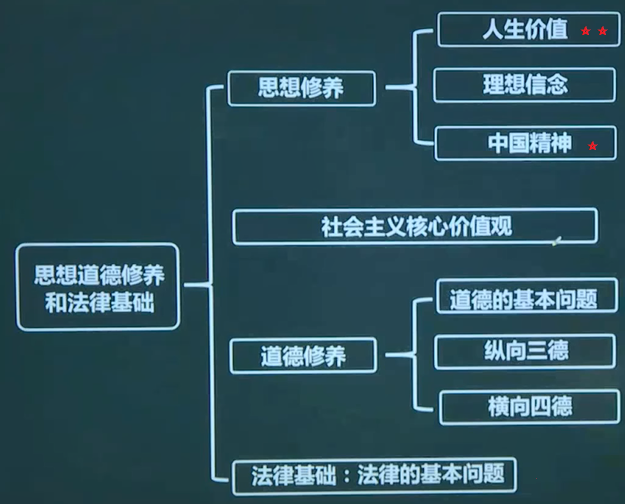
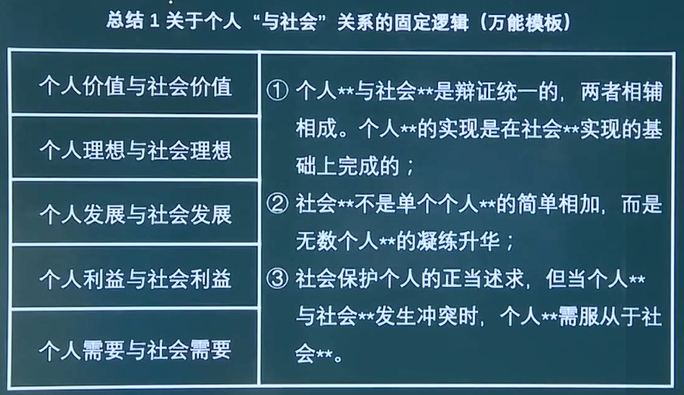
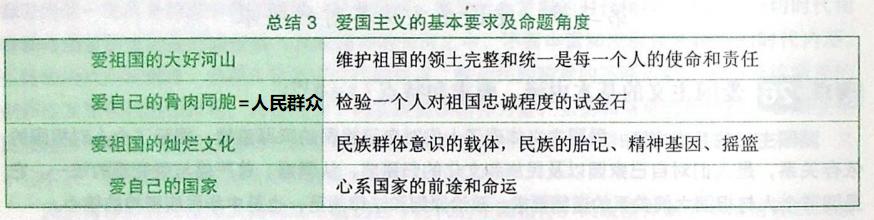
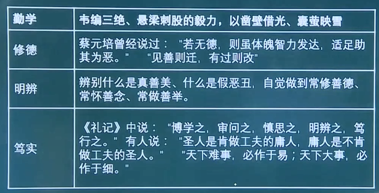
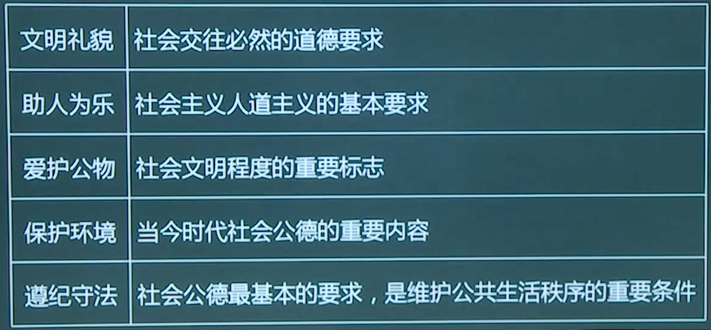
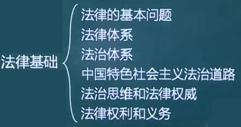
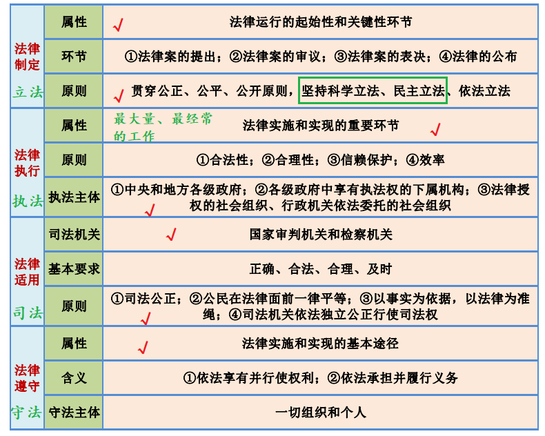
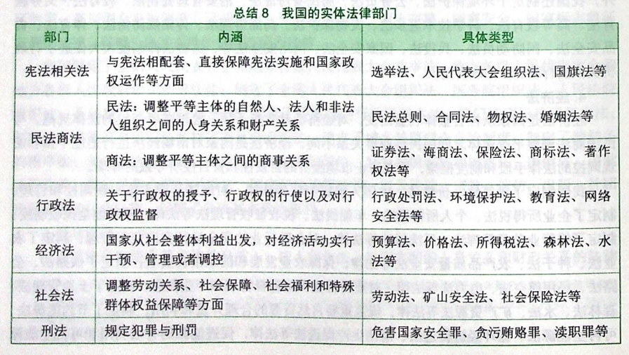
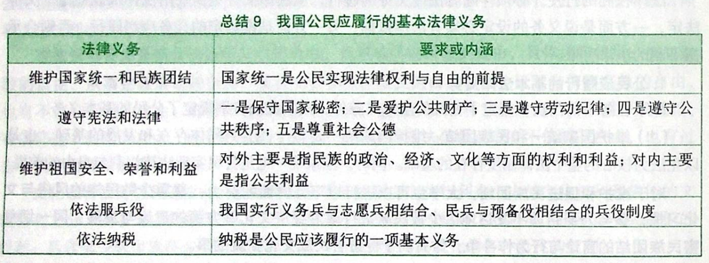

# 思修法基基本框架

# 思想道德和法律的关系

- 思想道德和法律虽然在调节领域、调节方式、调节目标等方面存在很大不同，但是二者都是==上层建筑的重要组成部分==，共同服务于一定的经济基础。

- 思想道德为法律提供思想指引和价值基础。
- 法律为思想道德提供制度保障。

# 思想篇

## 人生价值

### 人生观

人生观的主要内容包括人生目的（第二重要）、人生态度和人生价值（第一重要）。

人生目的回答人为了什么活着，人生态度回答人应当如何活着，人生价值回答什么样的人生才有价值。这三个方面相互联系、 相辅相成，统一为一个有机整体。

#### 人生目的

人生目的是指生活在一定历史条件下的人在人生实践中关于自身行为的根本指向和人生追求。人生目的是对“人为什么活着”这一人生根本问题的认识和回答，是==人生观的核心==，在人生实践中具有重要的作用。人生目的的重要作用：

- 人生目的决定人生道路。

- 人生目的决定人生态度。

- 人生目的决定人生价值选择（评价标准）。

#### 人生态度

人生态度是指人们通过生活实践形成的对人生问题的一种==稳定==的心理倾向和精神状态。人生态度是人生观的重要内容。一个人有什么样的人生观就会有什么样的人生态度。正确的人生态度可以使人在追求有意义的人生中保持积极进取、乐观向上的精神状态。  

#### 人生价值⭐

1. 人生价值的内涵：人生价值是指人的生命及其实践活动对于==社会==和==个人==所具有的作用和意义。

2. 人生价值的层次：人生价值内在地包含了人生的自我价值和社会价值两个方面。
   - 人生的自我价值：是个体的人生活动对自己的生存和发展所具有的价值，主要表现为对自身物质和精神需要的满足程度（从社会索取的东西）。
   - 人生的社会价值：是个体的实践活动对社会、他人所具有的价值（向社会贡献的东西）。

3. 自我价值与社会价值的关系：二者既相互区别，又密切联系、相互依存，共同构成人生价值的矛盾统一体。
   - 人生的自我价值是个体生存和发展的必要条件，人生的自我价值的实现是个体为社会创造更大价值的前提。
   - 人生的社会价值是社会存在和发展的重要条件，人生社会价值的实现是个体自我完善、全面发展的保障。没有社会价值，人生的自我价值就无法存在。

### 世界观

世界观是人们对生活在其中的世界以及人与世界的关系的总体看法和根本观点。

#### 人生观与世界观的关系

世界观决定人生观，有什么样的世界观，就会有什么样的人生观。

同时，人生观又对世界观的巩固、发展和变化起着重要作用。

#### 个人与社会的辩证关系⭐

个人与社会的关系问题是认识和处理人生问题的重要着眼点和出发点。

1. 个人与社会的关系

   个人与社会是对立统一的关系，二者相互依存、相互制约、相互促进。 社会是由一个个具体的人组成的，离开了人就没有社会，社会是人的存在形式。同时，人是社会的人，离开了社会人也无法生活。

2. 个人利益（需要）与社会利益（需要）的关系（重点背）

   （可以将利益改为理想、价值，一样成立）

   个人与社会的关系，最根本的是个人利益与社会利益的关系。社会需要是个人需要的集中体现，是社会全体成员带有根本性、全局性、 长远性需要的反映。个人利益的满足只能是在一定的社会条件下、通过一定的社会方式来实现。

   在社会主义社会中，个人利益与社会利益在根本上是一致的。社会利益离不开个人利益，个人利益也离不开社会利益。社会利益不是个人利益的简单相加，而是所有人利益的有机统一。

   社会利益体现了作为社会成员的个人的根本利益和长远利益，是个人利益得以实现的前提和基础， 同时它也保障着个人利益的实现。

### 正确的人生观

#### 科学高尚的人生追求

1. 什么是科学高尚的人生追求

   “服务人民、奉献社会”的思想以其科学而高尚的品质，代表了人类社会迄今最先进的人生追求。

2. 为什么“服务人民、奉献社会”的人生追求是科学高尚的人生追求

   一个人确立了服务人民、奉献社会的人生追求，才能清楚地把握人的生命历程和奋斗目标，深刻理解人为了什么而活、应走什么样的人生之路等道理。

   一个人确立了服务人民、奉献社会的人生追求，才能以正确的人生态度对待人生、解决实际生活中的各种问题，以人民利益为重，始终对祖国和人民具有高度的责任感，在服务人民、奉献社会中实现自己的人生价值。

   一个人确立了服务人民、奉献社会的人生追求，才能掌握正确的人生价值标准，才能懂得人生的价值首先在于奉献， 自觉用真善美来塑造自己，不断培养高洁的操行和纯朴的情感，努力使自己成为一个高尚的人。

#### 人生价值的评价与实现⭐

1. 评价人生价值的根本尺度（社会价值）

   看一个人的实践活动是否符合社会发展的客观规律，是否促进了历史的进步。在今天，衡量人生价值的标准，最重要的就是看一个人是否用自己的劳动和聪明才智为国家和社会真诚奉献，为人民群众尽心尽力服务。

2. 评价人生价值的方法

   - 坚持能力有大小与贡献须尽力相统一。

   - 坚持物质贡献与精神贡献相统一。
   - 坚持完善自身与贡献社会相统一。

3. 人生价值的实现条件

   - 实现人生价值要从社会客观条件出发（我要当皇帝×）。

   - 实现人生价值要从个体自身条件出发（我腿残但要跑第一×）。

   - 不断增强实现人生价值的能力和本领。

4. 社会实践是实现人生价值的必由之路（根本途径） 

## 理想信念

### 什么是理想

理想是人们在实践中形成的、有实现可能性的、对未来社会和自身发展目标的向往与追求，是人们的世界观、人生观和价值观在奋斗目标上的集中体现（理想是精神现象，属于社会意识）。

#### 理想的分类

理想是多方面和多类型的，根据不同的标准，可分为个人理想和社会理想（按主体分），近期理想和远期理想（按时间分），崇高理想和一般理想（按层次分），生活理想、职业理想、道德理想和政治理想等（按内容分）。

#### 理想的特征

1. 理想具有超越性。理想之所以能够成为一种推动人们创造美好生活的巨大力量，就在于它不仅源于现实，而且超越现实。
2. 理想具有实践性。作为一定的社会实践的产物，理想是处在特定历史条件下的人们对社会实践活动理性认识的结晶。理想在实践中产生，在实践中发展，而且也只有在实践中才能得以实现。
3. 理想具有时代性。理想同任何一种社会意识形式一样，都是一定时代的产物，都带着特定历史时代的烙印。不同时代的生产力发展水平不同，社会历史条件和政治经济关系不同，人们对社会现实状况、社会实践活动及其发展规律认识的深度和广度不同，形成的理想也就会有所不同。

### 什么是信念

信念同理想一样，也是人类特有的精神现象。信念是人们在一定的认识基础上确立的对某种思想或事物坚信不疑并身体力行的精神状态。（信念也是社会意识）

#### 信念的特征

1. 信念具有执着性。
2. 信念具有多样性。一方面，不同的人由于社会环境、思想观念、利益需要、人生经历和性格特征等方面的差异，会形成不同的信念；另一方面，同一个人也会形成不同类型和层次的信念，并由此构成其信念体系。==信仰是最高层次的信念==，具有最大的统摄力。信仰有盲目和科学之分，盲目的信仰就是对虚幻的世界、不切实际的观念、荒谬的理论等的迷信和狂热崇拜，科学的信仰则来自人们对自然界和人类社会发展规律的正确认识。

### 理想和信念的关系

理想和信念总是相互依存，理想是信念所指的对象，信念则是理想实现的保障。

离开理想这个人们确信和追求的目标，信念无从产生；离开信念这种对奋斗目标的执着向往和追求，理想寸步难行。

在此意义上，理想和信念难以分割地紧密联系在一起。也正因如此，人们常将理想与信念合称为理想信念。

### 理想信念的作用

1. 理想指引方向，信念决定成败。
2. 理想信念昭示奋斗目标。
3. 理想信念提供前进动力。
4. 理想信念提高精神境界。

> 马克思主义是信仰
>
> 中国特色社会主义是共同理想
>
> 共产主义是远大理想

### 理想和现实

1. 理想与现实是对立统一的关系

   理想和现实存在着对立的一面，二者的矛盾与冲突，属于“应然”和“实然”的矛盾。假如理想与现实完全等同，那么理想的存在就没有意义。

   理想与现实又是统一的。理想受现实的规定和制约，是在对现实认识的基础上发展起来的。一方面，现实中包含着理想的因素，孕育着理想的发展；另一方面，理想中也包含着现实，既包含着现实中必然发展的因素，又包含着由理想转化为现实的条件，在一定的条件下，理想就可以转化为未来的现实。脱离现实而谈理想，理想就会成为空想。

2. 实现理想的过程具有长期性、艰巨性和曲折性

### 个人理想和社会理想⭐

个人理想：是指处于一定历史条件和社会关系中的个体对于自己未来的物质生活、精神生活所产生的种种向往和追求。

社会理想：是指社会集体乃至社会全体成员的共同理想，即在全社会占主导地位的共同奋斗目标。

#### 个人理想与社会理想的辩证关系

个人理想与社会理想之间相互联系、相互影响、相互制约。

1. 个人理想以社会理想为指引。追求个人理想的实践活动都是在社会中进行的，正确的个人理想不是依个人主观愿望随意确定的，从根本上说它是由正确的社会理想规定的。同时，个人理想的实现，必须以社会理想的实现为前提和基础。因此，在整个理想体系中，社会理想是最根本、最重要的，而个人理想则从属于社会理想。
2. 社会理想是对个人理想的凝练和升华。社会是个人的联合体，社会理想与个人理想密不可分。社会理想不是凭空产生的，也不是由外在力量强加的，而是建立在众人的个人理想基础之上。强调个人理想要符合社会理想，并不是要排斥和抹杀个人理想，而是要摆正个人理想同社会理想的关系。社会理想归根到底要靠全体社会成员的共同努力来实现，并具体体现在每个社会成员为实现个人理想而进行的活生生的实践中。当社会理想同个人理想有矛盾冲突的时候，有志气、有抱负的人可以作出最大的自我牺牲，使个人的理想服从于全社会的共同理想。

## 中国精神

### 重精神

重精神是中华民族的优秀传统，中华民族自古以来重精神的表现：

1. 表现在对物质生活与精神生活相互关系的独到理解上。

   物质生活固然为人所必需，但如果只沉溺于物欲而不能自拔，则无异于禽兽。古人认为“不义而富且贵，于我如浮云”，强调“道德当身，故不以物惑”，崇尚“一箪食，一瓢饮，在陋巷，人不堪其忧，回也不改其乐”的精神追求。基于对精神生活重要性的认识，中国古人在义利观上主张见利思义、以义制利、先义后利，在理欲观上主张导欲、节欲，强调用道德理性和精神品格对欲望进行引导和控制，时刻对私欲、贪欲保持警惕。

2. 表现在中国古人对理想的不懈追求上。

   理想是激励个体的精神内驱力，是凝聚社会整体的精神力量。儒家把仁爱和谐视为最高的道德理想，为实现“仁”的理想即使献出生命也在所不惜，即“志士仁人，无求生以害仁，有杀身以成仁”；墨家把“兼相爱，交相利”作为理想，提倡为兴天下之利、除天下之害而摩顶放题。正是因为有了这种理想主义情怀，无数志士仁人“为天地立心，为生民立命，为往圣继绝学，为万世开太平”，他们心怀天下，利济苍生，为追求道义、实现理想而上下求索。

3. 表现在对道德修养和道德教化的重视上。

   中国传统文化十分强调道德修养和道德教化，将“立德”置于“三不朽” （立德、立功、立言）之首，重视人的精神品格的养成。中国古人认为， “自天子以至于庶人，壹是皆以修身为本”，认为教化的目的是“明人伦”，是培养有道德的人。

4. 表现为对理想人格的推崇。

   孔子讲“知之者不如好之者，好之者不如乐之者”；孟子谓：“可欲之谓善，有诸己之谓信。充实之谓美，充实而有光辉之谓大，大而化之之调圣，圣而不可知之之谓神。”这些思想都反映着对人生境界的看法，对高尚人生境界的尊崇和追求。关于理想人格，儒家把“君子” “圣人”作为自己的理想人格，道家推崇逍遥于天地之间的“真人” “至人”，近代启蒙思想家梁启超呼吁“新民”的理想人格。

5. 中国共产党是中华民族重精神优秀传统的忠实继承者和坚定弘扬者。

   早在革命战争年代，党就提出“全心全意为人民服务”的根本宗旨，始终强调“人是要有一点精神的”，要做“一个高尚的人，一个纯粹的人，一个有道德的人，一个脱离了低级趣味的人，一个有益于人民的人”。中华人民共和国成立以来特别是改革开放以来，党高度重视精神文明建设，通过加强公民道德建设，开展爱国主义教育、理想信念教育，培育和弘扬民族精神，倡导和践行社会主义核心价值观等，大力提高全体人民的思想追求和精神境界。

### 民族精神和时代精神

以爱国主义为核心的民族精神和以改革创新为核心的时代精神，构成了中国精神的基本内容。

#### 以爱国主义为核心的民族精神

民族精神是一个民族在长期共同生活和社会实践中形成的，为本民族大多数成员所认同的价值取向、思维方式、道德规范、精神气质的总和，是一个民族赖以生存和发展的精神支柱。

民族精神的内涵：

- 伟大创造精神（考的第二多的，创新）

  我国产生了老子、孔子、庄子、孟子、墨子、孙子、韩非子等闻名于世的伟大思想巨匠，发明了造纸术、火药、印刷术、指南针等深刻影响人类文明进程的伟大科技成果，创作了诗经、楚辞、汉赋、唐诗、宋词、元曲、明清小说等伟大文艺作品，传承了格萨尔王、玛纳斯、江格尔等震撼人心的伟大史诗，建设了万里长城、都江堰、大运河、故宫、 布达拉宫等伟大工程。 

- 伟大奋斗精神

  中国人民始终革故鼎新、自强不息，开发和建设了祖国辽阔秀丽的大好河山，开拓了波涛万顷的辽阔海疆，开垦了物产丰富的广袤粮田，治理了桀骜不驯的千百条大江大河，战胜了数不清的自然灾害，建设了星罗棋布的城镇乡村，发展了门类齐全的产业， 形成了多姿多彩的生活。 

- 伟大团结精神

  中国人民始终团结一心、同舟共济，建立了统一的多民族国家，发展了56个民族多元一体、交织交融的融洽民族关系，形成了守望相助的中华民族大家庭。特别是近代以后，在外来侵略的严峻形势下，我国各族人民手挽着手、肩并着肩，英勇奋斗，浴血奋战，打败了一切穷凶极恶的侵略者，捍卫了民族独立和自由，共同书写了中华民族保卫祖国、 抵御外侮的壮丽史诗。 

- 伟大梦想精神（考的最多的，神话）

  中国人民始终心怀梦想、不懈追求，我们不仅形成了小康生活的理 念，而且乘持天下为公的情怀，盘古开天、女娲补天、伏羲画卦、神农尝草、夸父追日、精卫填海、愚公移山等我国古代神话深刻反映了中国人民勇于追求和实现梦想的执着精神。 

#### 以改革创新为核心的时代精神

时代精神是一个国家和民族在新的历史条件下形成和发展的，是体现民族特质并顺应时代潮流的思想观念、价值取向、精神风貌和社会风尚的总和，是一种对社会发展具有积极影响和推动作用的集体意识。

时代精神的核心：改革创新。

1. 时代措模（人物相关）

2. 精神脊梁（事件相关）

#### 民族精神与时代精神的辩证统一

一切民族精神都曾经是一定历史阶段中带动潮流、引领风尚、推动社会发展的时代精神。同时，一切时代精神都将随着历史的变迁逐步融入民族精神的长河之中，不断丰富和发展民族精神的时代内涵（民族精神曾经是时代精神，时代精神在以后会变成民族精神）。

民族精神和时代精神共同构成了我们当今时代的中国精神。

民族精神赋予中国精神以民族特征，是中华民族的精神独立性得以保持的重要保证（使得我们和其他民族不一样）；时代精神赋予中国精神以时代内涵，是中国精神引领时代前行、拥有鲜明时代性和强大生命力的重要根源（让我们能够适应当今世界）。

### 中国精神的意义

1. 凝聚中国力量的精神纽带

2. 激发创新创造的精神动力

3. 推进复兴伟业的精神定力

（选项出现“根本保证”不能选。精神属于意识，不能保证，能保证的必须是客观存在的东西，比如制度、党的领导）

### 爱国主义

爱国主义体现了人们对自己==祖国==（不能用国家）的深厚感情，揭示了个人对祖国的依存关系，是人们对自己家园以及民族和文化的归属感、认同感、尊严感与荣誉感的统一。它是调节个人与祖国之间关系的==道德要求、政治原则和法律规范==（不爱国则不道德、不是人民群众、有可能违法，只有爱国主义可以同时满足这三点），也是==中华民族精神的核心==。

#### 爱国主义的要求

即我们要如何爱国：

#### 爱国主义的特点

（诗句中凡是涉及国家和民族的选项都可以选）

1. 爱国主义是历史的（随着历史阶段不一样而不一样）、具体的（一定要对象化，即一定有一个爱的对象），在不同的历史条件和文化背景下所形成的爱国主义，总是具有不同的内涵和特点。
2. 爱国主义随着国家的产生而产生，随着国家的发展而发展（随着国家的消亡而消亡）。（这里的国家指的是国家这个概念）
3. 在阶级社会中，爱国主义具有阶级性，不同的阶级对待祖国的感情，既有一致的方面，也有差异的方面，甚至有对立的方面。
4. 新时代的爱国主义，既承接了中华民族的爱国主义优良传统，又体现了鲜明的时代特征，内涵更加丰富。

#### 新时代的爱国主义基本要求

1. 坚持爱国主义和社会主义相统一（对大陆公民的要求，港澳台和海外同胞可以坚持自己的制度）

2. 维护祖国统一和民族团结（港澳台和海外同胞也必须坚守）

3. 尊重和传承中华民族历史和文化

4. 必须坚持立足民族又面向世界⭐

   （1）必须坚持立足民族，维护国家发展主体性。

   在经济全球化的条件下，国家仍然是民族存在的最高组织形式，是国际社会活动中的独立主体。只要国家继续存在，爱国主义就有坚实的基础。==世界是丰富多彩的==，不能以一个或几个国家的政治制度、价值观念和意识形态来衡量多样性的世界。==用一种政治制度、价值观念和意识形态去统一世界==，不仅是对别国的侵害，而且也==是根本行不通的==，只会危害世界的和平与发展。在参与经济全球化的过程中，我们一定要保持清醒的认识，既充分==利用经济全球化所提供的机遇发展自己==，==又坚决维护国家的主权和尊严==，==按照本国国情坚持、发展自己的政治制度和民族文化==。

   （2）必须面向世界，构建人类命运共同体。

   ==坚持推动构建人类命运共同体==，是新时代坚持和发展中国特色社会主义基本方略的重要内容。构建人类命运共同体的理念，源于中国，属于世界，是中国与世界的交响协奏。当代中国的爱国主义继承并发扬了中华文化协和万邦、热爱和平的优秀传统，==对内积极倡导社会主义的爱国主义==，==对外主张平等互利、和平共处的国际交往原则==，积极维护国际和平与文明和谐。新时代弘扬面向世界的爱国主义精神，意味着我们要有更加宽广的世界胸怀和全球视野，为维护人类共同利益、推动人类文明发展进步提供中国智慧，始终==做世界和平的建设者、全球发展的贡献者、国际秩序的维护者==。

#### 如何爱国

1. 维护和推进祖国统一

2. 促进民族团结

3. 增强国家安全意识

   必须坚持==总体国家安全观==，坚持国家利益至上，==以人民安全为宗旨==，==以政治安全为根本==，==以经济安全为基础==，==以军事、文化、社会安全为保障==，==以促进国际安全为依托==， 走出一条中国特色国家安全道路。

### 改革创新

改革创新是时代要求，是时代精神的核心，它有以下意义（作用）：

1. 创新始终是推动人类社会发展的第一动力。

2. 创新能力是当今国际竞争新优势的集中体现。
3. 改革创新是我国赢得未来的必然要求。==必须把创新作为引领发展的第一动力，把人才作为支撑发展的第一资源==，把创新摆在国家发展全局的核心位置，把创新驱动发展战略作为国家重大战略。
4. 实施创新驱动发展战略。==最根本的是要增强自主创新能力、最紧迫的是要破除体制机制障碍==，最大限度地解放和激发科技作为第一生产力所蕴含的巨大潜能，打通从科技强到产业强、经济强、国家强的通道，让改革释放创新活力，让一切创新源泉充分涌流。

# 社会主义价值观

## 核心价值观

核心价值观是一定社会形态社会性质的集中体现，在一个社会的思想观念体系中处于主导地位，体现着社会制度、社会运行的基本原则和社会发展的基本方向。

核心价值观的意义：

- 积极培育和践行社会主义核心价值观，这与中国特色社会主义发展要求相契合，与中华优秀传统文化和人类文明优秀成果相承接，是中国共产党凝聚全党全社会价值共识作出的重要论断。

- 社会主义核心价值观的提出，鲜明确立了当代中国的核心价值理念，生动展现了中国共产党和中华民族高度的价值自信与价值自觉。

## 社会主义核心价值观

社会主义核心价值观把涉及==国家、社会、公民==的价值要求融为一体，体现了社会主义本质要求，继承了中华优秀传统文化，吸收了世界文明有益成果，体现了时代精神，是对我们要==建设什么样的国家、建设什么样的社会、培育什么样的公民==等重大问题的深刻解答。

（1）富强、民主、文明、和谐。这一价值追求回答了我们要建设什么样的国家的重大问题，揭示了当代中国在经济发展、政治文明、文化繁荣、社会进步等方面的价值目标，从国家层面标注了社会主义核心价值观的时代刻度。

（2）自由、平等、公正、法治。这一价值追求回答了我们要建设什么样的社会的重大问题，与实现国家治理体系和治理能力现代化的要求相契合，揭示了社会主义社会发展的价值取向。

（3）爱国、敬业、诚信、友善。这一价值追求回答了我们要培育什么样的公民的重大问题。

#### 核心价值观和核心价值体系的关系

社会主义核心价值体系主要包括马克思主义指导思想、中国特色社会主义共同理想、以爱国主义为核心的民族精神和以改革创新为核心的时代精神、杜会主义荣辱观。

社会主义核心价值观和社会主义核心价值体系的关系：

1. 社会主义核心价值观是社会主义核心价值体系的==精神内核==。它体现了社会主义核心价值体系的根本性质和基本特征，反映了社会主义核心价值体系的丰富内涵和实践要求，是社会主义核心价值体系的高度凝练和集中表达（一个大一些，一个小一些）。
2. 社会主义核心价值观与社会主义核心价值体系具有内在的一致性。二者都体现了社会主义意识形态的本质要求，体现了社会主义制度在思想和精神层面的质的规定性，是建设中国特色社会主义现代化强国、实现中华民族伟大复兴中国梦的价值引领（但我们都一样）。

#### 社会主义核心价值观的重要性

培育和践行社会主义核心价值观的重要性（必要性）：

社会主义核心价值观是有效整合我国社会意识、凝聚社会价值共识、解决和化解社会矛盾、聚合磅礴之力的重大举措，是保证我国经济社会沿着正确的方向发展、实现中华民族伟大复兴的价值支撑，意义重大而深远。

#### 社会主义核心价值观的作用

1. 坚持和发展中国特色社会主义的价值遵循。
2. 提高国家文化软实力的迫切要求。
3. 增进社会团结和谐的最大公约数（14亿人的共识）。

## 被认可的理由

### 社会主义核心价值观具有历史底蕴

任何一种价值观都不可能凭空产生，总是有其特定的历史底色和精神脉络。社会主义核心价值观不是无源之水、无本之木。深深地根植于==中华优秀传统文化==（这就是历史底蕴），是社会主义核心价值观历史底蕴的集中体现。

1. 中华优秀传统文化是涵养社会主义核心价值观的重要源泉，是中华民族的精神命脉（社会主义核心价值观来自于中华优秀传统文化）。

2. 培育和弘扬社会主义核心价值观，必须立足中华优秀传统文化。

### 社会主义核心价值观具有现实基础

社会主义核心价值观的现实基础：中国特色社会主义建设实践。

1. 中国特色社会主义建设是社会主义核心价值观的实践根据。社会主义核心价值观生成于中国特色社会主义建设实践，同当今中国最鲜明的时代主题相适应，是当代中国精神的集中体现，是中国特色社会主义本质规定的价值表达。（社会主义核心价值观是一个意识，一是来源于实践，这个实践就是中特实践）

2. 中国特色社会主义建设也以无可辩驳的事实生动展示着社会主义核心价值观的生机活力。中国特色社会主义建设的成功经验，是对社会主义核心价值观正确性、可信性的检验。（中特实践也反过来证明社会主义核心价值观是正确的）

### 社会主义核心价值观具有道义力量

为什么社会主义核心价值观具有道义力量：社会主义核心价值观以其==先进性、人民性和真实性==而居于人类社会的价值制高点，具有强大的道义力量。

1. 社会主义核心价值观的先进性

   社会主义核心价值观的先进性，体现在它是社会主义制度所坚持和追求的核心价值理念。作为人类社会最为先进社会制度的本质规定在价值层面的集中反映，社会主义核心价值观代表着当今时代人类社会的价值制高点。

2. 社会主义核心价值观的人民性

   社会主义核心价值观的人民性，体现在它所代表的最广大人民的根本利益，反映的最广大人民的价值诉求，引导着最广大人民为实现美好社会理想而奋斗。鲜明的人民性，使得社会主义核心价值观具有强大的道义感召力。

3. 社会主义核心价值观的真实性

   别人的都是不真实的，所以都是错的。

## 做积极践行者

1. 扣好人生的扣子

   青年的价值取向决定了未来整个社会的价值取向，而青年又处在价值观形成和确立的时期，抓好这一时期的价值观养成十分重要。正如习近平指出的：“这就像穿衣服扣扣子一样，如果第一粒扣子扣错了，剩余的扣子都会扣错。人生的扣子从一开始就要扣好。”

2. 勤学修德明辨驾实

   - 勤学：知识是树立社会主义核心价值观的重要基础。

   - 修德：道德之于个人、之于社会，都具有基础性意义，做人做事第一位的是崇德修身。

   - 明辨：培育和践行社会主义核心价值观，要增强自己的价值判断力和道德责任感，辨别什么是真善美、什么是假恶丑，自觉做到常修善德、常怀善念、常做善举。

   - 笃实：道不可坐论，德不能空谈。

   

# 道德篇

## 什么是道德

### 道德的起源
1. ==劳动==是道德起源的首要前提/决定因素（意识来源于实践）。
2. ==社会关系==是道德赖以产生的客观条件（人与人之间才会产生道德）。
3. ==人的自我意识==是道德产生的主观条件（人要有道德的认知，2、3岁小孩大父母不会认为是不道德的事）。

### 道德的本质

1. 道德是反映社会经济关系的特殊==意识形态==（形态说明道德与阶级有关，建立在一定经济基础之上，属于观念上层建筑）。道德的产生、发展和变化，归根结底根源于==社会经济关系==。
   - 道德的性质和基本原则、规范反映了与之相应的社会经济关系的性质和内容。有什么样的社会经济关系，相应地就有什么样的道德。
   - 道德随着社会经济关系的变化而变化。
   - 道德作为一种社会意识，在阶级社会里总是反映着一定阶级的利益，因而不可避免地具有阶级性（比如社会主义是维护集体利益，封建主义是维护君权）；同时，不同阶级之间的道德或多或少有一些共同之处，反映着道德的普遍性（比如社会主义和封建主义都倡导诚实守信）。
   - 作为社会意识的道德一经产生，便有相对独立性。这种相对独立性既表现为道德的历史继承性（当今社会还保留有封建社会的一些思想），也表现为道德对社会发展具有能动的反作用（如果继承的东西是好的则会推动当今社会，若是不好的则会阻碍）。

2. 道德是==社会利益关系==的特殊调节方式。道德是一种调整人与人、人与社会、人与自然以及人与自身之间关系的特殊的行为规范。这种行为规范与法律规范、政治规范的不同之处在于它是用善恶标准去评价，依靠社会舆论、传统习俗、内心信念来维持的，因此是一种==非制度化的、柔性==的规范。

3. 道德是一种==实践精神==（不能光说不做）。作为实践精神，道德是一种旨在通过把握世界的善恶现象而规范人们的行为并通过人们的实践活动体现出来的社会意识。

### 道德的功能

道德的三个主要功能：

1. 认知功能（行为前）

   道德的认识功能是指道德==反映==社会关系特别是反映社会经济关系的功效与能力。

2. 规范功能（行为中）

   道德的规范功能是指在正确善恶观的指引下，规范社会成员在社会公共领域、职业领域、家庭领域的行为，并规范个人品德的养成，引导并促进人们崇德向善。

3. 调节功能 （行为后）

   道德的调节功能是指道德通过评价等方式，指导和纠正人们的行为和实践活动，协调社会关系和人际关系的功效与能力。道德==评价==是道德调节的主要形式，社会舆论、传统习俗和人们的内心信念是道德调节所赖以发挥作用的力量。==这是道德最突出也是最重要的社会功能。==

### 道德的作用

道德的作用是指道德的认识、规范、调节、激励、导向、教育等功能的发挥和实现所产生的社会影响及实际效果。

道德的作用主要表现在：

1. 道德为==经济基础的形成、巩固和发展==服务，是一种重要的==精神力量==；
2. 道德对其他社会意识形态的存在有着重大的影响（社会中几种不同的意识之间会产生相互的干扰，比如道德会影响法律的修订）；
3. 道德通过调整人们之间的关系维护社会秩序和稳定（不排队就会乱套）；
4. 道德是提高人的精神境界、促进人的自我完善、推动人的全面发展的内在动力（对人的作用）； 
5. 在阶级社会中，道德是调节阶级矛盾和对立阶级之间开展阶级斗争的重要工具（替天行道）。

反对两种错误的观点：

1. 反对道德万能论。这种观点的根本错误在于，颠倒了社会存在和社会意识，经济基础同上层建筑之间的决定与被决定的关系，否定了物质资料的生产方式在社会发展中的决定作用。
2. 反对道德无用论。这种观点的根本错误在于，忽视了道德作为上层建筑的重要组成部分，一方面由经济基础所决定，另一方面对经济基础和生产力发展有一定的反作用。

## 纵向三德

### 中华传统美德

#### 中华传统美德的基本精神

1. 重视整体利益，强调责任奉献。“公义胜私欲”是中华传统美德的根本要求。《诗经》已经提出“夙夜在公”的道德要求，认为日夜为公家办事是一种高尚的道德品质。《尚书》也有“以公灭私，民其允怀”的思想，认为朝廷官员应当以公心灭除自己的私欲，这样就可以得到老百姓的信任和依附。西汉初年的贾谊在他的《治安策》中提出“国而忘家，公而忘私”，清代林则徐提出“苟利国家生死以，岂因祸福避趋之”，都体现了强烈的为国家、为民族献身的精神。正是从国家利益和整体利益的原则出发，中国古代思想家强调在“义”和“利”发生矛盾时，应当义以为上、先义后利、见利思义、见义勇为。
2. 推崇“仁爱”原则，注重以和为贵。孔子强调“己欲立而立人,己欲达而达人”，孟子强调“亲亲而仁民,仁民而爱物"，萄子强调“仁者自爱”，墨子则提出“兼相爱，交相利”的思想。
3. 提倡人伦价值，重视道德义务。早在《尚书·舜典》中就提出了“五教”的思想，即“父义” “母慈”“兄友”“弟恭”“子孝”。到了战国时期，孟子提出了影响深远的“五伦”说，即“父子有亲、君臣有义、夫妇有别、长幼有序、朋友有信”。汉代以后，董仲舒提出了“仁、义、礼、智、信”，宋代的思想家们又提出了所谓“忠、孝、节、义”四大德目等，不断强化在人伦关系中每个人的责任和义务，强调人伦价值的重要意义。
4. 追求精神境界，向往理想人格。孟子说，人之所以异于禽兽的根本点就在于人能够“明于庶物，察于人伦”，即能本着“仁义”行事。从先秦儒家所强调的孔颜之乐，到范仲淹所提出的“先天下之忧而忧，后天下之乐而乐”，这种精神已经凝聚成为中华民族一种特有的价值追求。“富贵不能淫，贫贱不能移，威武不能屈”的“大丈夫”人格，就是这种追求在人生价值观中的体现。
5. 强调道德修养，注重道德践履。儒家的经典《礼记·大学》中明确提出，“修身”是齐家、治国、平天下的前提和基础，孔子提倡“修己” “克己”和“慎独”，提倡“见贤思齐焉，见不贤而内自省"，曾子提出“吾日三省吾身”，孟子更主张“善养吾浩然之气”。墨家也非常重视修身，强调“察色修身”和“以身戴行”。宋明道学家们在修养的“功夫”上更加用力，强调“自省” “存养” “克治” “知耻” “慎独”和“躬行”的重要。

#### 如何对待中华传统美德⭐

==中国传统道德是一个矛盾体，具有鲜明的两重性。==属于精华的部分，表现出积极、革新、进步的一面；属于糟粕的部分，则表现出消极、保守、落后的一面。中华传统美德作为中国传统道德的精华部分，为今天的道德建设提供了丰富的资源，要在去粗取精、去伪存真的基础上坚持古为今用、推陈出新，努力实现中华传统美德的创造性转化和创新性发展。

1. 加强对中华传统美德的挖掘和阐发。（发现美德）
2. 用中华传统美德滋养社会主义道德建设。（把美德拿来用）
3. 在对待传统道德的问题上，要反对两种错误思潮。一种是==复古论==，认为道德建设的最终目标就是要恢复中国“固有文化”，形成以中国传统文化为主体的道德体系。另一种是==虚无论==，认为中国传统道德从整体上来说在今天已经失去了价值和意义，必须从整体上予以全盘否定。这两种规点都是错误的，割断了道德的历史与发展的关系，都不利于社会的发展和道德的进步。

（传统道德有好有坏，对待它的态度应该是要去粗求精。虽然传统美德是传统道德好的方面，但它==不一定适合当今社会==，因此对待它的态度应该是==创造性转化和创新性发展==）

### 中国革命道德

#### 中国革命道德的形成与发展

（革命道德不仅仅在革命（资产阶级革命）中形成，它还包括社会主义建设时期（消除私有制的社会主义革命）和改革开放时期（伟大革命））

中国革命道德，是指中国共产党人、人民军队、一切先进分子和人民群众在中国==革命、建设、改革==中所形成的优秀道德，是马克思主义与中国革命、建设、改革的伟大实践相结合的产物，是中华民族极其宝贵的道德财富。

1. 中国共产党始终高度重视继承和发扬革命道德传统。

2. 中国革命道德作为一种精神力量，从它形成的时候起，就对中国的革命、建设、改革事业发挥着极其重要的作用。

3. 弘扬中国革命道德，要同弘扬中华传统美德相结合。

#### 中国革命道德的主要内容

（1）为实现社会主义和共产主义理想而奋斗。

（2）全心全意为人民服务。

（3）始终把革命利益放在首位。

（4）树立社会新风，建立新型人际关系。

（5）修身自律，保持节操。

#### 中国革命道德的当代价值

1. 有利于加强和巩固社会主义和共产主义的理想信念。
2. 有利于培育和践行社会主义核心价值观。
3. 有利于引导人们树立正确的道德观，积极投入社会主义建设事业。
4. 有利于培育良好的社会道德风尚，抵制腐朽思想的侵蚀。

#### 借鉴人类文明优秀道德成果

一个国家或民族的道德进步，既要注意在文明交流中坚守自身优秀道德传统，也要在文明互鉴中积极吸收其他有益道德成果。

1. 从道德形成和发展的过程来看，道德都是某个民族或国家在特定历史条件下，为回应来自自然环境、社会生活和人际关系的各种矛盾而形成发展起来的，反映了具体的民族或国家的生存方式和生活态度。每一个民族或国家都有自己优良的道德传统，都对促进道德的发展作出过不同程度的贡献。
2. 借鉴和吸收人类文明优秀道德成果，必须秉承正确的态度和科学的方法（辩证的态度）。
3. 要坚持以我为主（不能丢了自己的，要以自己的为主体）、为我所用，批判继承其他国家的道德成果。

### 社会主义道德

- 社会主义道德建设的核心：为人民服务（重点考）
- 社会主义道德建设的原则：集体主义（重点考）
- 社会主义道德建设的重点：诚实守信（次重考）
- 社会主义道德建设的基本要求：社会主义荣辱观

#### 为人民服务

为什么人服务是道德的核心问题，而社会主义道德的核心是“为人民服务”。

为什么社会主义道德的核心是“为人民服务”？

1. 为人民服务是社会主义经济基础和人际关系的客观要求。
2. 为人民服务是社会主义市场经济健康发展的要求。
3. 为人民服务是先进性要求和广泛性要求的统一。

#### 集体主义

集体主义是社会主义道德的原则。

如何理解集体主义原则：

1. 集体主义强调国家利益、社会整体利益和个人利益的辩证统一。
2. 集体主义强调国家利益、社会整体利益高于个人利益。
3. 集体主义重视和保障个人的正当利益。

集体主义三个层次的道德要求：

1. 无私奉献、一心为公，这是集体主义的最高层次，是共产党员、先进分子应努力达到的道德目标；
2. 先公后私、先人后己，这是已经具有较高社会主义道德觉悟的人能够达到的要求；
3. 顾全大局、遵纪守法、热爱祖国、诚实劳动，这是对公民最基本的道德要求。

## 横向四德

### 社会公德

#### 公共生活的特征

1. 活动范围的广泛性。
2. 活动内容的开放性。
3. 交往对象的复杂性。
4. 活动方式的多祥性。

#### 公共秩序的作用

1. 有序的公共生活是社会生产活动的重要基础。
2. 有序的公共生活是提高社会成员生活质量的基本保障。
3. 有序的公共生活是社会文明的重要标志。

#### 社会公德的内容

1. 社会公德的最低要求是遵纪守法；公民道德的最低要求是爱国守法。

2. 助人为乐、爱护公物、遵纪守法：重点考

#### 网络生活的道德要求⭐

网络生活中的道德要求，是人们在网络生活中为了维护正常的网络公共秩序需要共同遵守的基本道德准则，是社会公德在网络空间的运用和扩展。大学生应当遵守网络生活中的道德要求，成为营造清朗网络空间的正能量。

1. 正确使用网络工具。
2. 健康进行网络交往。
3. 自觉避免沉迷网络。
4. 加强网络道德自律。
5. 积极引导网络舆论。

（如果考辨析题，可以写自己的想法）

### 职业道德
1. 爱岗敬业。这是社会主义职业道德的最基本要求。
2. 诚实守信。诚实守信在我国思想道德建设中具有特殊重要的作用，它既是中华民族的传统美德，也是我国公民道德建设的重点，还是社会主义核心价值观的一条重要准则。
3. 办事公道。
4. 服务群众。
5. 奉献社会。这是社会主义职业道德中最高层次的要求。

### 家庭美德

尊老爱幼、男女平等、夫妻和睦、勤俭持家、邻里团结

1. 家庭美德的核心是夫妻和睦。
2. 男女平等不仅是家庭美德，还是法律要求和基本国策。

### 个人品德⭐

个人品德是通过社会道德教育和个人自觉的道德修养所形成的==稳定==的心理状态和行为习惯。

稳定性：长久持续，而不是突然、暂时；综合性：对所有人都有品德；实践性：不能光说不做。

#### 个人品德的作用

无论是社会的和谐有序，还是个人的人格健全，都有赖于个人品德的不断提升。

1. 个人品德对道德和法律作用的发挥具有重要的==推动==作用。（每个人都品德高尚，则法律就是摆设）
2. 个人品德是个体==人格==完善的重要标志。
3. 个人品德是经济社会发展进程中重要的主体精神力量。

#### 掌握道德修养的正确方法

加强道德修养，提升个人品德，应借鉴历史上思想家们所提出的各种积极有效的方法，并结合当今社会发展的需要身体力行。

1. 学思并重。在提升个人品德的过程中，首先要善于学习各种道德理论和知识，尤其是社会主义道德理论和知识。同时要善于思考，并且把善于学习和善于思考有机地统一起来。
2. 省察克治。通过反省检验以发现和找出自己思想与行为中的不良倾向，并及时对它们进行抑制和克服。
3. 慎独自律。在无人知晓、没有外在监督的情况下，坚守自己的道德信念， 自觉按道德要求行事，不因无人监督面恣意妄为。
4. 知行合一。把提高道德认识与躬行道德实践统一起来，以促进道德要求内化为个人的道德品质，外化为实际的道德行为。
5. 积善成德。通过积累善行或美德，使之巩固强化，以逐渐凝结成优良的品德。
6. 与社会实践相联系：根本途径。

#### 锤炼高尚道德品格

1. 形成正确的道德认知和道德判断。
2. 激发正向的道德认同和道德情感。
3. 强化坚定的道德意志和道德信念。

# 法律基础

## 法律体系

### 法律的含义

1. 法律是由国家创制和实施的行为规范。国家创制法律规范的方式主要有两种：==一是国家机关在法定的职权范围内依照法律程序，制定、修改、废止规范性法律文件的活动==；==二是国家机关赋予某些既存社会规范以法律效力，或者赋予先前的判例以法律效力的活动==（如今的案子没有现有的法律可以评判，但之前有个案子和这个案子一样，因此可以拿当年的案子并赋予其法律效力来评判现在的案子）。法律不但由国家==制定和认可==（第一种创制法律规范的方式叫制定，第二种叫认可），而且由国家强制力保证实施。
2. 法律由一定的社会物质生活条件所决定。法律作为上层建筑的重要组成部分，不是凭空出现的，而是产生于特定社会物质生活条件基础之上。其中，==物质资料的生产方式==既是决定社会面貌、性质和发展的根本因素，也是决定法律本质、内容和发展方向的根本因素。物质资料的生产方式包括生产力与生产关系两个方面，对法律产生决定性影响。

3. 法律是==统治阶级意志的体现==。法律所体现的统治阶级意志具有整体性，不是统治阶级内部个别人的意志，也==不是统治者个人意志的简单相加==。统治阶级不仅迫使被统治阶级服从和遵守法律，而且==要求统治阶级的成员也遵守法律==。法律所体现的统治阶级意志，并==不是统治阶级意志的全部==，仅仅是上升为国家意志的那部分意志。除了法律，统治阶级的意志还体现在国家政策、统治阶级的道德、最高统治者的言论等形式中。（考得最多的）

综上所述，可以将法律定义为：法律是由国家制定或认可并以国家强制力保证实施的，反映由特定社会物质生活条件所决定的统治阶级意志的规范体系。

### 我国法律的本质特征

从本质上说，我国社会主义法律是中国特色社会主义制度的重要组成部分，是==党领导人民当家作主的制度保障==。其特征如下：

1. 我国社会主义法律体现了党的主张和人民意志的统一。我国社会主义法律既具有鲜明的阶级性（无产阶级），又具有广泛的人民性（人民群众），体现了==阶级性与人民性==的统一。
2. 我国社会主义法律具有==科学性和先进性==。
3. 我国社会主义法律是中国特色社会主义建设的==重要保障==（党的领导是根本保证）。 

### 我国法律的运行

立法主体

- 人大
  - 全国人大：宪法、法律
  - 地方性人大：地方性法规
- 中央政府（国务院）：行政法规
  - 地方性政府：地方规章
  - 中央部委：部门规章

### 宪法

宪法是国家的==根本法==。

#### 我国宪法的形成和发展

1949年由政治协商会议创立具有临时宪法作用的《中国人民政治协商会议共同纲领》，1954年一届全国人大一次会议通过《中华人民共和国宪法》。

2018年3月，十三届全国人大一次会议根据党的十九届二中全会提出的建议，审议通过了《中华人民共和国宪法修正案》，通过本次宪法修改，党的十九大确定的重大理论观点和重大方针政策，党和国家事业发展的新成就新经验新要求，包括习近平新时代中国特色社会主义思想等载入国家根本法。

回顾党领导的宪法建设史，可以得出这样几点结论：

1. 制定和实施宪法，推进依法治国，建设法治国家，是实现国家富强、民族振兴、社会进步、人民幸福的必然要求。（制定和实施是必要和重要的）
2. 我国现行宪法是在深刻总结我国社会主义革命、建设、改革的成功经验基础上制定和不断完善的，是党领导人民长期奋斗的历史逻辑、理论逻辑、实践逻辑的必然结果。（实践得来的，具有必然性）
3. 只有中国共产党才能坚持立党为公、执政为民，充分发扬民主，领导人民制定出体现人民意志的宪法，领导人民实施宪法。（党的领导才能制定出好的宪法）
4. 党高度重视发挥宪法在治国理政中的重要作用，坚定维护宪法尊严和权威，推动宪法完善和发展，这是我国宪法保持生机活力的根本原因所在（党的重视是宪法保持活力的根本原因）。宪法作为上层建筑，一定要适应经济基础的变化而变化。

#### 我国宪法的地位

1. 我国宪法实现了党的主张和人民意志的高度统一，具有显著优势、坚实基础、强大生命力。（党领导的人民同意的）
2. 我国宪法是国家的==根本法==，是治国安邦的总章程，是党和人民意志的集中体现。
3. 我国宪法是国家各项制度和法律法规的==总依据==。宪法在中国特色社会主义法律体系中居于统帅地位。
4. 我国宪法规定了国家的根本制度。
5. 宪法的生命在于==实施==，宪法的权威也在于实施。

#### 我国宪法的基本原则

1. 党的领导原则。中国共产党是中国特色社会主义事业的领导核心。
2. 人民主权原则。主权是指国家的最高权力。在我国，人民当家作主是社会主义民主政治的本质和核心。我国宪法体现了人民主权原则，强调国家的一切权力属于人民。
3. 尊重和保障人权原则。我国宪法将“国家尊重和保障人权”规定为一项基本原则，对公民的基本权利和自由作出全面规定，依法保障公民的生存权和发展权。
4. 社会主义法治原则。我国宪法明确规定实行依法治国，建设社会主义法治国家。社会主义法治原则要求坚持宪法法律至上，法律面前人人平等，推进国家各项工作法治化，维护社会公平正义，维护社会主义法制的统一、尊严、权威。任何组织和个人都要在宪法和法律范围内活动，一切造农行为部应受到法律的追究。
5. 民主集中制原则。民主集中制是集中全党全国人民集体智慧，实现科学决策、民主决策的基本原则和主要途径，我国宪法规定，中华人民共和国的国家机构实行民主集中制原则。

#### 我国宪法确立的制度

1. 国体和根本政治制度。
2. 基本政治制度。
   - 中国共产党领导的多党合作和政治协商制度。
   - 民族区域自治制度。
   - 基层群众自治制度。

3. 基本经济制度。

### 我国的实体法律部门

国家根据现行法律规范所调整的社会关系及其调整方法不同，将其分为不同的法律部门。这一法律体系是以宪法为统帅，以法律为主干，以行政法规、地方性法规为重要组成部分，由多个法律部门组成的有机统一整体。其中，实体法律部门包括宪法相关法、民法商法、行政法、经济法、社会法、刑法等。

民法商法、刑法的原则：

1. 民法的原则：遵循民事主体地位平等、自愿、公平、诚信、公序良俗、有利于节约资源和保护生态环境等基本原则。
2. 商法的原则：遵循民法的基本原则，同时秉承保障商事交易自由、等价有偿、便捷安全等原则。
3. 我国刑法规定了罪刑法定、法律面前人人平等、罪刑相适应等基本原则。我国刑法规定了犯罪的概念，明确了犯罪构成及其要件，规定了正当防卫、紧急避险等排除社会危害性的行为；规定了刑罚的种类，包括管制、拘役、有期徒刑、无期徒刑、死刑五种主刑以及罚金、剥夺政治权利、没收财产三种附加刑。

### 我国的程序法律部门

（实体法律部门用于判定具体事件的对错；程序法律部门用于判定在事件过程中是否符合法律程序）

我国的程序法律部门包括诉讼法与非诉讼程序法。诉讼法律制度是规范国家司法活动解决社会纠纷的法律规范，非诉讼程序法律制度是规范仲裁机构或者人民调解组织解决社会纠纷的法律规范。

1. 诉讼法

   刑事诉讼法、民事诉讼法（民事纠纷）、行政诉讼法（对行政机关的行政结果不满意）

2. 非诉讼程序法

   仲裁法：明确将自愿、仲裁独立、一裁终局等原则作为仲裁的基本原则，系统规定了仲裁程序。

   调解法：明确规定了在当事人自愿、平等的基础上进行调解；不违背法律、法规和国家政策；尊重当事人的权利，不得因调解而阻止当事人依法通过仲裁、行政、司法等途径维护自己的权利等原则。

## 法治体系

### 中特法治体系的意义

1. 中特法治体系是中国特色社会主义的本质要求和重要保障。中国特色社会主义法治体系本质上是中国特色社会主义制度的法律表现形式。
2. 中特法治体系是推进国家治理体系和治理能力现代化的重要举措。
3. 中特法治体系是全面依法治国的总抓手。

### 中特法治体系的内容

1. 完备的法律规范体系

   完备的法律规范体系，是中国特色社会主义法治体系的==前提==，是法治国家、法治政府、法治社会的==制度基础==。

2. 高效的法治实施体系

   建设高效的法治实施体系，是建设中国特色社会主义法治体系的==重点==。

3. 严密的法治监督体系

   严密的法治监督体系，是指以规范和约束公权力为重点建立的有效的法治化权力监督网络。它以有权必有责、用权受监督、违法必追究，坚决纠正有法不依、执法不严、违法不究行为等为主要任务，是宪法法律有效实施的==重要保障==，是加强对权力运行制约和监督的==迫切要求==。

4. 有力的法治保障体系

   有力的法治保障体系，是全面依法治国的==重要依托==。

5. 完善的党内法规体系

   建设完善的党内法规体系，是中国特色社会主义法治体系的==本质要求==和==重要内容==。

### 全面依法治国的基本格局

“科学立法、严格执法、公正司法、全民守法”十六字方针，展现了全面依法治国的基木格局。

1. 科学立法

   立法是法治的==龙头环节==。

2. 严格执法

   法律的生命力在于实施，法律的权威也在于实施。

3. 公正司法

   公正是法治的生命线，是司法活动最高的价值追求。公正司法是维护社会公平正义的最后道防线。

4. 全民守法

   法律的权威源自人民的内心拥护和真诚信仰。全民守法以增强全民法治观念，推进法治社会建设为目标。

## 法治道路

走好法治道路的5大要求：

1. 坚持中国共产党的领导
2. 坚持人民主体地位
3. 坚持法律面前人人平等
4. 坚持依法治国和以德治国相结合
5. 坚持从中国实际出发

### 坚持中国共产党的领导

#### 为什么坚持党的领导

1. 党的领导是中国特色社会主义最本质的特征，是社会主义法治最根本的保证。==法是党的主张和人民意愿的统一体现，党和法，党的领导和依法治国是高度统一的==。
2. 坚持党的领导，是社会主义法治的根本要求，是全面依法治国的题中应有之义。只有在党的领导下依法治国、厉行法治，人民当家作主才能充分实现，国家和社会生活法治化才能有序推进。

#### 怎样坚持党的领导

坚持党的领导，不是一句空的口号，必须具体体现在党领导立法、保证执法、支持司法、带头守法上。

### 坚持人民主体地位

1. 坚持人民主体地位的重要性

   在社会主义法治国家，人民是依法治国的主体和力量源泉，坚持人民主体地位是依法治国的基本原则。

2. 如何坚持人民主体地位

   必须坚持法治建设为了人民、依靠人民、造福人民、保护人民，以保障人民根本权益为出发点和落脚点，保证人民依法享有广泛的权利和自由、承担应尽的义多，维护社会公平正义，促进共同富裕，为保证人民当家作主提供坚实的法治基础。

### 坚持法律面前人人平等

平等是社会主义法律的==基本属性==，是社会主义法治的==基本要求==。坚持法律面前人人平等，对于坚持走社会主义法治道路具有十分重要的意义。

### 坚持依法治国和以德治国相结合⭐

（前三点都是法治和德治的区别，最后一点是联系）

1. 正确认识法治和德治的地位

   法治的地位：法治是治国理政的==基本方式==，依法治国是==基本方略==，法治具有根本性、决定性和统一性，它强调对任何人都一律平等，任何人都必须遵守法律

   德治的地位：德治是治国理政的==重要方式==，以德治国就是通过在全社会培育、弘扬社会主义核心价值观和社会主义道德，对不同人群提出有针对性的道德要求。

2. 正确认识法治和德治的作用

   法治的作用：法治发挥作用要以==国家强制力==为后盾，主要依靠法律的预测作用、惩罚作用、威慑作用和预防作用对公民和社会组织的行为进行约束，并对违反法律的行为==追究法律责任==。

   德治的作用：德治发挥作用主要通过人们的==内心信念、传统习俗、社会舆论==等进行道德教化，并对违反道德的行为进行==道德谴责==。

3. 正确认识法治和德治的实现途径

   法治的实现途径：法治主要==依靠制定和实施法律规范==形式来推进和实施，国家要保护什么、不保护什么，倡导什么、禁止什么，都得有明确的法律依据，实行法有禁止不得为，体现的是规则之治。

   德治的实现途径：德治主要==依靠培育和弘扬道德==等途径来推进和实施，道德是内心的法律，以价值、精神和理念等形式表现出来，引导人们自觉地在行动上符合道德才可为，违反道德不可为。

4. 推动法治和德治的相互促进

   （道德是法律的支撑、滋养；法律是道德的承载、保障）

   - 强化==道德对法治的支撑作用==。坚持依法治国和以德治国相结合，应重视发挥道德的教化作用；在道德体系中体现法治要求，发挥==道德对法治的滋养作用==；在道德教育中突出法治内涵。
   - 把道德要求贯彻到法治建设中。==以法治承载道德理念==，道德才有可靠制度支撑。
   - 运用法治手段解决道德领域突出问题。法律是底线的道德，也是==道德的保障==。要加强相关立法工作，依法加强对群众反映强烈的失德行为的整治

### 坚持从中国实际出发

中国实际：社会主义初级阶段（1956-21中叶）

当前，中国特色社会主义进入新时代，社会主要矛盾已经转化为人民日益增长的美好生活需要和不平衡不充分的发展之间的矛盾。建设法治中国，必须从我国实际出发，同完善和发展中国特色社会主义制度、推进国家治理体系和治理能力现代化相适应，既不能罔顾国情、超越阶段，也不能因循守旧、墨守成规。

1. 坚持从实际出发，就是要突出法治道路的中国特色、实践特色、时代特色。

2. 从我国实际出发，不等于关起门来搞法治。坚持走中国特色社会主义法治道路，必须学习借鉴世界上优秀的法治文明成果。法治的精髓和要旨对于国家治理和社会治理具有普遍意义。学习借鉴不是简单的拿来主义，不能将某种法治理论或成果当成唯一准则，不能企图用一种法治模式来改造整个世界。

## 法治思维

法治思维就是在利益受到侵害时采取法律方式维权。

### 法治思维的含义

1. 法治思维以法治价值和法治精神为指导，蕴含着公正、平等、民主、人权等法治理念，是一种==正当性思维==。
2. 法治思维以法律原则和法律规则为依据来指导人们的社会行为，是一种==规范性思维==。
3. 法治思维以法律手段与法律方法为依托分析问题、处理问题、解决纠纷，是一种可靠的==逻辑思维==。
4. 法治思维是一种符合规律、尊重事实的==科学思维==。

### 法治思维的特征

培养法治思维，必须抛弃人治思维。法治思维与人治思维的区别集中体现在四个方面：

1. 在依据上，法治思维认为==国家的法律是治国理政的基本依据==，处理法律问题要以事实为根据、以法律为准绳；而人治思维的本质是主张人高于法或权大于法，它片面强调依赖个人的魅力、德性和才智来治国平天下。
2. 在方式上，法治思维以==一般性、普遍性==的平等对待方式调节社会关系，解决矛盾纠纷，坚持法律面前人人平等原则，==具有稳定性和一贯性==；而人治思维漠视规则的普遍适用性，按照个人意志和感情进行治理，治人者以言代法、言出法随、朝令夕改，具有极大的任意性和非理性。
3. 在价值上，法治思维强调集中社会大众的意志来进行决策和判断，是==一种“多数人之治”的思维==，避免陷入无政府主义或以民主之名搞乱社会；而人治思维是个人说了算的专断思维。
4. 在标准上，法治思维与人治思维的分水岭不在于有没有法律或者法律的多寡与好坏，而在于==最高的权威究竟是法律还是个人==。==法治思维以法律为最高权威==，强调“必须使民主制度化、法律化，使这种制度和法律不因领导人的改变而改变，不因领导人的看法和注意力的改变而改变" ；而人治思维则奉个人的意志为最高权威，当法律的权威与个人的权威发生矛盾时，强调服从个人而非服从法律的权威。

### 法治思维的基本内容

1. 法律至上。法律至上具体表现为法律的==普遍适用性、优先适用性和不可违抗性==。
2. 权力制约。权力制约分为==权力由法定、有权必有责、用权受监督、违法受追究==四项要求。
3. 公平正义。公平正义是指社会的政治利益、经济利益和其他利益在全体社会成员之间合理、公平分配和占有。一般来讲，公平正义主要包括==权利公平、机会公平、规则公平和救济公平==。

4. 权利保障。宪法保障是权利保障的==前提和基础==，立法保障是权利保障的==重要条件==，行政保护是权利保障的==关键环节==，司法保障是公民权利保障的==最后防线==。
5. 正当程序。程序的正当，表现在程序的==合法性、中立性、参与性、公开性、时限性==等方面。

## 法律权威

### 法律权威的含义

法律权威是指法律在社会生活中的作用力、影响力和公信力，是法律应有的尊严和生命。法律是否具有权威，取决于四个基本要素：

1. 法律在国家和社会治理体系中的地位和作用，只有法律占主导地位和起决定作用，法律才具有权威。

2. 法律本身的科学程度，只有法律反映客观规律和人类理性，法律才具有权威。

3. 法律在实践中的实施程度，只有法律在实践中得到严格实施和遵循，法律才具有权威。

4. 法律被社会成员尊崇或信仰的程度，只有法律反映人民共同意愿且为人民真诚信仰，法律才具有权威。

   （法律的内在说服力是法律权威的内在基础；法律权威不可能完全建立在外在强制力的基础上）

### 尊重和维护法律权威的意义

全体社会成员尊重社会主义法律权威，不仅是保证法律发挥作用的基本前提和要求，也是保障个人平安幸福的底线和红线。尊重和维护法律权威，对全面依法治国至关重要。

1. 社会主义法治观念的核心要求和建设社会主义法治国家的==前提条件==。
2. 对于推进国家治理体系和治理能力现代化、实现国家的长治久安极为重要。法律权威是国家治理的坚实==基础和关键==。
3. 实现人民意志、维护人民利益、保障人民权利的==基本途径==。从本质上讲，尊重和维护法律权威，就是尊重和维护人民的根本利益和其他合法权益的具体实践，也是尊重和保障人权的具体实践。
4. 继护个人合法权益的根本保障。

### 尊重和维护法律权威的要求

1. 信仰法律。
2. 遵守法律。
3. 服从法律。
4. 维护法律。

## 法律权利和法律义务

### 法律权利的含义

法律权利是指反映一定的社会物质生活条件所制约的行为自由，是法律所允许的权利人为了满足自己的利益而采取的、由其他人的法律义务所保证的法律手段。==权力的产生、发展和实现，都必须以一定的社会经济条件为基础，即“权利决不能超出社会的经济结构以及由经济结构制约的社会文化发展”。==

### 法律权利的特征

1. 法律权利的内容、种类和实现程度受社会物质生活条件的制约。
2. 法律权利的内容分配和实现方式因社会制度和国家法律的不同而存在差异。
3. 法律权利不仅由法律规定或认可，而且受法律维护或保障，具有不可侵犯性。
4. 法律权利必须依法行使，不能不择手段地行使法律权利。

### 法律义务的含义

法律义务是指反映一定的社会物质生活条件所制约的社会责任，是保障法律所规定的义务人应该按照权利人要求从事一定行为或不行为以满足权利人利益的法律手段。法律义务的履行表现为两种形式：

1. 一种是作为，是指义务人实施积极的行为，如子女通过经常看望和提供财物等行为履行赡养父母的义务等；

2. 另一种是不作为，是指义务人不得实施某种行为，如未经许可不得公开他人的隐私等。法律义务==具有法定的强制性==，违反法律义务必须==承担法律责任==。

### 法律义务的特征

1. 法律义务是历史的。
2. 法律义务源于现实需要（计划生育）。
3. 法律义务必须依法设定。
4. 法律义务可能发生变化（要服兵役但腿残了）。

### 法律权利与法律义务的关系

1. 法律权利与法律义务的关系，就像一枚硬币的两面，不可分割，相互依存。

   首先，法律权利和法律义务是相互依存的关系。法律权利的实现必须以相应法律义务的履行为条件；同样，法律义务的设定和履行也必须以法律权利的行使为根据，不存在没有权利根据的法律义务。

   其次，法律权利与法律义务是目的与手段的关系。离开了法律权利，法律义务就失去了履行的价值和动力；离开了法律义务，法律权利也形同虚设。

   最后，有些法律权利和法律义务具有复合性的关系。一个行为可以同时是权利行为和义务行为，如劳动的权利和义务、接受义务教育的权利和义务。

2. 法律权利与法律义务平等，是现代法治的基本原则，是社会公平正义的重要方面。

   首先，法律权利与法律义务平等表现为法律面前人人平等被确立为基本原则。

   其次，在法律权利和法律义务的具体设定上要平等。

   最后，权利与义务的实现要体现平等。

3. 互利互赢。

### 依法行使法律权利

1. 我国宪法法律规定的基本权利

   我国宪法法律规定了公民享有一系列权利，主要包括政治权利、人身权利、财产权利、社会经济权利、宗教信仰及文化权利等。

   - 政治权利主要包括：选举权利、表达权、民主管理权、监督权。

   - 人身权利主要包括：生命健康权（维持生命存在的权力）、人身自由权、人格尊严权、住宅安全权、通信自由权。

   - 财产权主要包括：私有财产权、继承权

   - 社会经济权利主要包括：劳动权、休息权、社会保障权、物质帮助权。

   - 宗教信仰及文化权利：宗教信仰自由是指公民依据内心的信念，自愿地信仰宗教的自由；文化教育权是公民在文化和教育领域享有的权利。

2. 行使法律权利的界限

   - 权利行使的目的。目的要合法。

   - 权利行使的限度。不能随心所欲，不得伤害他人和国家。

   - 权利行使的方式。==委托不得超过3次。==

   - 权利行使的程序。要按程序来。

### 依法行使法律义务

违反法定义务应当承担的法律责任：如果公民未能依法履行义务，根据情节轻重，应当承担相应的法律责任。具体的法律责任主要包括民事责任（欠钱要换）、行政责任（针对行政人员，即行政人员执法时违法了那就要负行政责任）和刑事责任（杀人放火）。