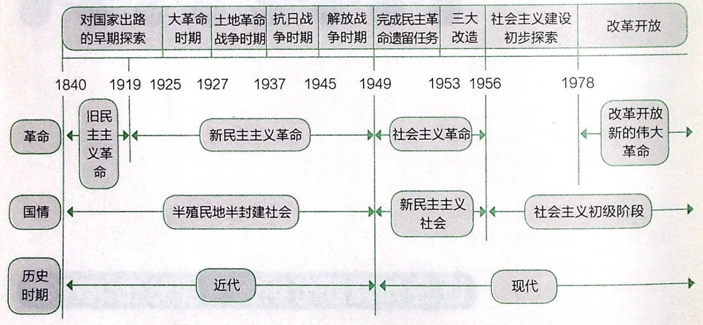
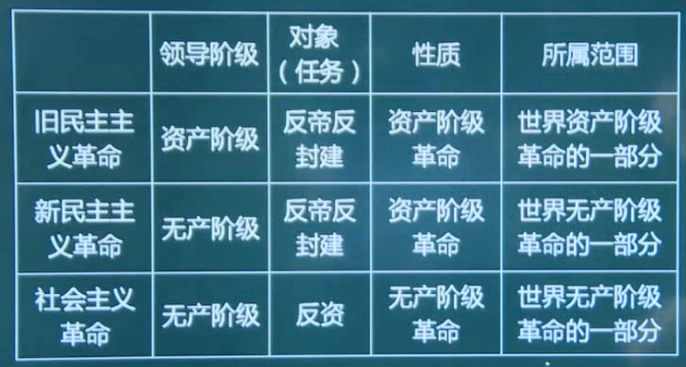

# 史纲基本框架

# 从侵略到觉醒

## 鸦片战争

鸦片战争的结果：

1. 签订了一系列不平等条约：中英南京条约；中英虎门条约；中美望厦条约；中法黄埔条约。
2. 割占香港岛，破坏了中国的主权和领土完整；
3. 外国船舰可在中国领海自由航行，破坏了中国的领海主权；
4. 外国人在华不受中国法律管束，享受领事裁判权，破坏了中国的司法主权；
5. 协定关税，则破坏了中国的关税主权等。

给中国带来的后果：

随着外国资本主义的入侵，中国的社会性质开始发生质的变化。中国==逐步==（八国联军侵华签订辛丑条约使得中国正式沦为两半社会）沦为==半殖民地半封建国家==（国情变化）。随着社会主要矛盾的变化，中国逐渐开始了反帝反封建的资产阶级民主革命。==正因为如此==，鸦片战争成为中国近代史的起点。

## 近代中国三方面

### 两半性质

1. 中国逐步变成半殖民地的原因
   - 为啥是殖民地：中国已经丧失了完全独立的地位，在相当程度上被殖民地化了
   - 为啥是半：近代中国尽管在实际上已经丧失拥有完整主权的独立国家的地位，但仍然维持着独立国家和政府的名义，还有一定的主权。

2. 中国逐步变成半封建社会的原因

   - 外国资本主义列强用武力打开中国的门户，把中国卷入世界资本主义经济体系和世界市场之中（封建制度开始瓦解）。

   - 西方列强并不愿意中国成为独立的资本主义国家。

3. 中国半殖民地半封建社会的基本特征

   - 资本—帝国主义日益成为支配中国的决定性力量。（政治角度）

   - 中国的封建势力成为资本—帝国主义压迫、奴役中国人民的社会基础和统治支柱。（政治角度）

   - 封建地主的土地所有制依然在广大地区内保持着。（经济角度）

   - 中国新兴的民族资本主义经济虽然已经产生，但它的发展很缓慢，力量很软弱。（经济角度）

   - 近代中国各地区经济、政治和文化的发展是极不平衡的。（社会角度）（单选选这个，这个最综合）

   - 中国的广大人民尤其是农民日益贫困化以至大批地破产，过着饥寒交迫和毫无政治权利的生活。（社会角度）

4. 近代中国社会阶级关系的变化

   - 地主阶级：一些转化为资本家。（传统阶级）

   - 农民阶级：一些转化为工人。（传统阶级）

   - 近代中国诞生的工人阶级（即是无产阶级）是中国新生产力的代表，是近代中国最革命的阶级。（新兴阶级）（无产阶级是最早出现的新兴阶级，此时充当资本家的是外国人）

   - 中国资产阶级也是近代中国新产生的阶级。中国资产阶级的来源不同， 构成比较复杂。其中，有一部分是官僚买办资本家（官僚指与封建势力勾结，买办指与帝国主义勾结），另一部分是民族资本家（本土自己成长的）。（新兴阶级）

   - 补充：小资产阶级不是资产阶级，他不剥削人，他自食其力，相当于自己开店自己经营。如果店越开越大，雇佣了人工，那就变成了民族资产阶级。（新兴阶级）

### 主要矛盾

1. 帝国主义和中华民族的矛盾（主要中的主要）
2. 封建主义和人民大众的矛盾

### 近代以来的历史任务

1. 近代任务：争取民族独立（反帝）、人民解放（反封建）
2. 实现国家富强、 人民幸福

> 逻辑：国情->矛盾->任务->道路

## 一些反侵略斗争

1. 人民群众的反侵略斗争

   1841年5月，广州三元里人民的抗英斗争，是中国近代史上中国人民第一次大规模的反侵略武装斗争。

2. 爱国官兵的反侵略斗争

   ==鸦片战争期间==，广东水师提督关天培、江南提督陈化成、副都统海龄（满族）；==第二次鸦片战争中==，提督史荣椿、乐善（蒙古族）；==中日甲午战争时==，致远舰管带（舰长）邓世昌等，都以身殉国。

## 帝国瓜分图谋

帝国主义侵略中国的最终目的是瓜分中国和灭亡中国。英国从印度入侵西藏，又从缅甸入侵云南。法国则从越南侵犯广西。俄国从中亚入侵新疆。日本吞并琉球、 侵犯中国台湾。

帝国主义列强对中国的争夺和瓜分的图谋，在1894年中日甲午战争爆发后达到高潮。中日《马关条约》规定把台湾、澎湖列岛和辽东半岛割让给日本；俄、德、法三国"干涉还辽"。

列强瓜分中国图谋的破产原因：

1. 重要原因：帝国主义列强之所以没有能够实现瓜分中国的图谋，帝国主义列强之间的矛盾和互相制约，是一个重要的原因。
2. 根本原因：帝国主义列强不能灭亡和瓜分中国，其根本原因在于中华民族进行的不屈不挠的反侵略斗争。

义和团运动在粉碎帝国主义列强瓜分中国的斗争中，发挥了重大的历史作用，但存在以下局限性：

1. 由于当时中国人民对帝国主义的认识还停留在感性认识的阶段，义 和团运动存在着笼统的排外主义的错误；
2. 由于不认识帝国主义联合中国封建地主阶级以压迫中国人民的实质，义和团曾经蒙受封建统治者的欺骗；
3. 由于小生产者的局限性，义和团运动中还存在着许多迷信、落后的倾向。

## 反侵的失败原因

历次的反侵略战争，都是以中国失败、中国政府被迫签订丧权辱国的条约而宣告结束的。

1. 根本原因：社会制度的腐败。

2. 重要原因：经济技术的落后。

   （洋务运动学习技术不学习制度，即中体西用。洋务运动失败原因之一就是没有意识到真正落后的根本原因，以为技术落后才是根本原因）

## 民族意识的觉醒

鸦片战争以后，先进的中 国人开始睁眼看世界；中日甲午战争以后，中国人民的民族意识开始普遍觉醒。

- 林则徐是近代中国睁眼看世界的第一人：编成《四洲志》一书。
- 魏源根据《四洲志》编成《海国图志》，提出了 “师夷长技以制夷”的思想，主张学习外国先进的军事和科学技术，以期富国强兵，抵御外国侵略，开创了中国近代向西方学习的新风（只学技术）。
- 王韬、薛福成、马建忠、郑观应等人不仅主张学习西方的科学技术， 同时也要求吸纳西方的政治、经济学说（还学制度，被称为早期的维新派）。

- 严复写了《救亡决论》一文，响亮地喊出了“救亡”的口号。严复翻译了 《天演论》 ，他用“物竞天择”“适者生存”的社会进化论思想，为这种危机意识和民族意识提供了理论根据。

- 孙中山在创立革命团体兴中会时喊出了出了“振兴中华”这个时代的最强音。

# 各阶层的探索

## 农民阶级

1. 太平天国农民战争

2. 天朝田亩制度

   内容及性质： 《天朝田亩制度》是==最能体现==太平天国社会理想和这次农民起义特色的==纲领性文件==。它确立了平均分配土地的方案，即“凡天下田，天下人同耕”。《天朝田亩制 度》实际上是起义农民提出的一个以==解决土地问题==为中心的比较完整的社会改革方案。（这是一个非正确的纲领，正确的只有马思主义）

   评价：

   - 进步性：《天朝田亩制度》的主张，从根本上否定了封建社会的基础即封建地主的土地所有制（但没有废除）。
   - 局限性：没有超出农民小生产者的狭隘眼界；具有不切实际的空想的性质；并未付诸实施。

3. 资政新篇

   内容：开始提倡资本主义的雇佣劳动制了。

   评价：

   - 进步性： 《资政新篇》是一个具有资本主义色彩的方案。 

   - 局限性：限于当时的历史条件，未能付诸实施。

4. 太平天国的结局

   天京事变成为太平天国由盛转衰的分水岭。

5. 太平天国农民战争的意义
   - 太平天国农民战争沉重打击了封建统治阶级，强烈撼动了清政府的统治根基。
   - 太平天国农民战争是中国旧式农民战争的最高峰。
   - 太平天国农民战争还冲击了孔子和儒家经典的正统权威（信自己建立的上帝）。
   - 太平天国农民战争还有力地打击了外国侵略势力。
   - 在19世纪中叶的亚洲民族解放运动中，太平天国农民战争是其中时间最久、规模最大、影响最深的一次。

6. 太平天国农民战争失败的原因（可以作为论述素材）⭐

   - 根本原因在于农民阶级不是新的生产力和生产关系的代表，他们无法克服小生产者所固有的==阶级局限性==。他们的局限性表现在：① 无法从根本上提出完整的、正确的政治纲领和社会改革方案；② 无法制止和克服领导集团自身腐败现象的滋长；③ 也无法长期保持领导集团的团结。
   - 太平天国没有科学思想理论的指导。
   - 太平天国也未能正确地对待儒学。
   - 对于西方资本主义侵略者还缺乏理性的认识（它的纲领是反封不反帝，但它的任务还是反封反帝，从结果上看也是反封反帝）。

   教训：农民不能为中国找到出路。

## 封建地主阶级

### 洋务运动

1. 洋务运动的兴办原因

   ① 为了购买和制造洋枪洋炮以镇压农民起义（根本原因）；

   ② 借此加强海防、边防，并乘机发展本集团的政治、经济、军事实力的意图。

2. 洋务运动的指导思想（纲领）：冯桂芬在《校邻庐抗议》的思想被概括为"中学为体，西学为用"（"中体西用"就是以中国封建伦理纲常所维护的统治秩序为主体，用西方的近代工业和技术为辅助，并以前者来支配后者）

3. 洋务事业

   - 兴办近代企业。

     军用企业：上海江南制造总局、福州船政局、天津机器局、 湖北枪炮厂

     民用企业：轮船招商局、开平矿务局、天津电报局和上海机器织布局（官督商办）

   - 建立新式海陆军：北洋水师是清政府的海军主力。

   1874年， 日本派兵侵犯中国台湾，清政府筹办海防、建设海军之议随之兴起。从19世纪 70年代到90年代，分别建成福建水师、广东水师、南洋水师和北洋水师，共有舰船八九十艘。 其中，北洋水师是清政府的海军主力，拥有舰艇20多艘，这支舰队一直归李鸿章管辖。

   - 创办新式学堂，派遣留学生：翻译学堂；工艺学堂；军事学堂；还先后派遣赴美幼童及官费赴欧留学生200多人。

4. 洋务运动的历史作用
   - 在客观上对中国的早期工业和民族资本主义的发展起了某些促进作用。
   - 给当时的中国带来了新的知识，使人们打开了眼界。
   - 社会风气和价值观念开始变化，工商业者的地位上升。

5. 洋务运动失败的原因（素材）⭐

   中日甲午战争标志着洋务运动的失败。其原因如下：

   - 洋务运动具有封建性（或阶级局限性，也是根本原因）。

   - 洋务运动对外国具有依赖性。

   - 洋务企业的管理具有腐朽性。

     （多选出现"缺钱缺人才"不能选）

   教训：地主不能为中国找到出路。

   （甲午战争的三个标志：① 瓜分高潮到来；② 民族意识普遍觉醒；③ 洋务运动失败）

### 维新运动

1. 维新运动兴起的原因
   - 中国民族资本主义有了初步发展。
   - 在内忧外患的冲击和中西文化的碰撞过程中，人们形成了一个共识：要救国，只有维新，要维新，只有学外国。

2. 维新派宣传维新的活动

   - 向皇帝上书：“公车上书”。
   - 著书立说。康有为《新学伪经考》《孔子改制考》、梁启超《变法通议》、谭嗣同《仁学》、严复《天演论》。
   - 介绍外国变法的经验教训。
   - 办学会。强学会、南学会、保国会。
   - 设学堂。广州万木草堂、长沙时务学堂 。
   - 办报纸。上海《时务报》、天津《国闻报》、湖南《湘报》。

3. 维新派与守旧派（洋务派）的论战（这是第二次大辩论）

   论战主要围绕以下三个问题展开：

   - 要不要变法。
   - 要不要兴民权、设议院，实行君主立宪。
   - 要不要废八股、改科举（不是废科举，废科举在清末新政）和兴西学。

   意义：实质上是资产阶级思想与封建主义思想在中国的第一次正面交锋。它进一步开阔了新型知识分子的眼界，解放了人们长期受到 束缚的思想。通过论战，西方资产阶级社会政治学说在中国得到进一步的传播。

4. 百日维新

   内容：

   - 政治方面：改革行政机构，裁撤闲散、重叠机构。

   - 经济方面：保护、奖励农工商业；提倡开办实业，奖励发明创造。

   - 军事方面：裁减旧式绿营兵，改练新式陆军。

   - 文化教育方面：创设京师大学堂；提倡新学，废除八股，改试策论，开经济特科。

   性质： 

   - 进步性：戊戌维新运动是一场资产阶级性质的改良运动。

   - 局限性：这些政令和措施并未触及封建制度的根本，所要推行的是一种十分温和的改良方案。

   结局：

   - 谭嗣同、刘光第、林旭、杨锐、杨深秀、康广仁6人同遭杀害，史称“戊成六君子"。

   - 除京师大学堂被保留下来以外，其余新政措施大都被废除。

5. 戊成维新运动的历史意义
   - 戊戌维新运动是一次爱国救亡运动。
   - 戊戌维新运动是一场资产阶级性质的==政治改良==运动。
   - 戊戌维新运动更是一场思想启蒙运动。
   - 京师大学堂的创设，更成为中国近代国立高等教育的发端。

6. 戊戌维新运动失败的原因（素材）⭐

   主要是由于维新派自身的局限（根本原因）和以慈禧太后为首的强大的守旧势力的反对。具体如下：

   - 民族资产阶级力量弱小（力量弱小不是阶级局限性，力量弱小是客观原因，局限性是主观原因）。

   - 维新派的局限性：① 不敢否定封建主义；② 对帝国主义抱有幻想；③ 惧怕人民群众。

   教训：资产阶级维新派不能为中国找到出路。

## 资产阶级

### 三民主义学说

同盟会的政治纲领是“驱除鞑虏，恢复中华，创立民国，平均地权”。孙中山将同盟会的纲领概括为三大主义，即民族主 义、民权主义、民生主义，后被称为三民主义。

1. 民族主义：民族革命，包括“驱除鞑虏，恢复中华”两项内容。一是要以革命手段推翻清朝政府，改变它一贯推行的民族歧视和民族压追政策；二是追求独立，建立“民族独立的国家”。

   局限性：没有明确的反帝纲领；放松了对汉族封建势力的警惕，结果保留了大量封建势力，导致辛亥革命后封建势力的反扑（不反帝，反封不彻底）。

2. 民权主义：政治革命，内容是“创立民国”，即推翻封建君主专制制度，建立资产阶级民主 共和国。政治革命的目的是建立民国

   局限性：民权主义归根到底都是建立资产阶级专政的国家， 广大人民群众的民主权利很难得到真正的保证。

3. 民生主义：社会革命，指的是“平均地权”，也就是核定全国土地的地价，其现有之地价， 仍属原主；革命后的增价，则归国家，为国民共享。

   局限性：“平均地权”并非将土地所有权分给农民，没有正面触及封建土地所有制，不能满足广大农民的土地要求，在革命中难以成为发动广大工农群众的理论武器（有地的还是有地，没地的还是没地）。

### 关于革命与改良的辩论

围绕中国究竟是采用革命手段还是改良方式这个问题，革命派与改良派（维新派）分别以《民报》《新民丛报》为主要舆论阵地，展开了一场大论战（这是第二场大辩论）。

双方论战涉及的核心问题主要有三个：

1. 要不要以革命手段推翻清王朝，这是双方论战的焦点；
2. 要不要推翻帝制，实行共和（洋务派坚持君主专制；维新派学习君主立宪制；革命派学的是共和制）；
3. 要不要进行社会革命。

对论战的评价（意义）：划清了革命与改良的界限，传播了民主革命思想， 促进了革命形势的发展，但这场论战也暴露了革命派在思想理论方面的弱点。

### 中华民国的建立

1912年1月1日，孙中山在南京宣誓就职，改国号为中华民国，定1912年为民国元年，并成立中华民国临时政府。

（此时中国并不是资本主义社会，因为清政府还在，而且后面也将革命果实让给了袁世凯，袁世凯代表的是帝国主义和封建主义）

南京临时政府的性质：

- 南京临时政府是一个资产阶级共和国性质的革命政权。
- 从政权的组成人员看，资产阶级革命派在政权中占有领导和主体的地位。
- 从南京临时政府制定的政策看， 各项政策措施集中代表和反映了中国民族资产阶级的愿望和利益，在相当程度上也符合广大中国人民的利益。

《中华民国临时约法》的内容和评价

1. 《临时约法》的内容

   1912年3月，临时参议院（不是临时政府）颁布《中华民国临时约法》，这是中国历史上第一部具有资产阶级共和国宪法性质的法典，它规定了资产阶级共和国的国家、政府组织机构以及人民享有的各项民主权利。《临时约法》规定“中华民国之主权属于国民全体”（也规定中华民国国民一律平等）。

2. 对《临时约法》的评价

   进步性： 《临时约法》是革命的产物，带有鲜朋的革命性、民主性。它不仅具 有现实的进步意义，在中国宪政史上也占有重要的地位。

   局限性：① 企图用承认清政府与列强所签订的一切不平等条约和清政府所欠的一切外债，来换取列强承认中华民国；② 南京临时政府也没有提出任何可以满足农民土地要求的政策和措施，反而以保护私有财产为借口，去维护封建士地制度以及官僚、地主所占有的土地和财产。

### 辛亥革命的历史意义

辛亥革命是资产阶级领导的以反对君主专制制度、建立资产阶级共和国为目的的革命，是 一次比较完全意义上的资产阶级民主革命。

1. 辛亥革命推翻了清王朝的统治，沉重打击了中外反动势力。
2. 辛亥革命结束了统治中国两千多年的封建君主专制制度，建立了中国历史上第一个 资产阶级共和政府，使民主共和的观念开始深入人心。
3. 辛亥革命给人们带来一次思想上的解放。
4. 辛亥革命促使社会经济、思想习惯和社会风俗等方面发生了新的积极变化。
5. 辛亥革命不仅在一定程度上打击了帝国主义的侵略势力，而且推动了亚洲各国民族解放运动的高涨。

### 果实被窃取

（这是不重要的一节）

孙中山被迫表示只要清帝退位、袁世凯宣布拥护共和，就可以把临时大总统的职位让给他。袁世凯窃夺辛亥革命的果实之后，建立了代表大地主和买办资产阶级利益的北洋军阀反动政权。此时中华民国临时政府的"临时"去掉，正式变成中华民国，但由北洋军统治，因此也称北洋政府。

袁世凯死后，中国陷入了军阀割据的局面。北洋政府统治时期是中国近代政治最黑暗的时期之一。

### 挽救共和的努力

1. 中国国民党第一任主席宋教仁被暗杀，孙中山发动武装反衰的“二次革命”，但失败了。
2. 袁世凯复辟帝制，孙中山联合蔡锷等人发动护国运动，但失败了。

3. 段棋瑞接任北洋政府后，拒绝恢复《临时约法》和国会，孙中山发动护法运动，但失败了。

对孙中山本人的评价：孙中山具有顽强的革命精神，他首先喊出“振兴中华”的口号，不 断摸索救国救民的道路，并始终坚持奋斗，是中国民主革命伟大的先行者。但是，孙中山并没有找到中国的真正出路。

旧民主主义革命终结的标志：==护法运动==的失败不仅是孙中山个人的失败，也==标志着整个中国民族资产阶级领导的旧民主主义革命的终结==。

### 辛亥革命失败的原因⭐

辛亥革命失败的客观根本原因：在帝国主义时代，在半殖民地半封建的中国，资本主义的建国方案是行不通的。

辛亥革命失败的主观根本原因：在于它的领导者资产阶级革命派本身存在着许多弱点和错误（阶级局限性）。 （如果选择题没有说主观和客观上的根本原因，那么选择主观上的根本原因）

1. 没有提出彻底的反帝反封建的革命纲领。
2. 不能充分发动和依靠人民群众。
3. 不能建立坚强的革命政党，作为团结一切革命力量的强有力的核心。

资产阶级革命派的这些弱点、错误，根源于中国民族资产阶级的软弱性和妥协性（中国民资具有两面性，一面是软弱性和妥协性，另一面是革命性）。

中国共产党人是孙中山先生开创的革命事业最坚定的支持者、最亲密的合作者、最忠实的继承者。

教训：中国民族资产阶级再也不能领导中国革命前进了。

# 新民主主义革命

## 党诞生前的背景

### 新文化运动

> 革命逻辑：技术 -> 制度 -> 思想文化

1. 新文化运动开始的标志：陈独秀在上海创办《青年杂志》（后改名《新青年》）。爱国民主主义者、教育家蔡元培出任北京大学校长。他聘陈独秀为北大文科学长。《新青年》由陈独秀个人主编的刊物改为同人刊物。

2. 新文化运动的主要阵地：《新青年》杂志和北京大学。
3. 初期新文化运动的基本内容：
   - 提倡民主和科学，反对专制和迷信；
   - 提倡个性解放，反对封建礼教；
   - 提倡新文学，反对旧文学，实行文学革命（白话文）。

4. 新文化运动提出的基本口号：民主和科学，即德先生（Democracy）和赛先生（Science） 。
5. 五四前新文化运动的历史意义：
   - 新文化运动是中国历史上一次前所未有的启蒙运动和空前深刻的思想解放运动。
   - 为马克思主义在中国的广泛传播准备了思想和文化的条件。

6. 五四前新文化运动的局限性：

   - 并不能为人们提供一种思想武器去认识中国，去有效地对中国社会进行改造。

   2. 仅仅依靠少数人的呐喊（精英路线）。
   3. 那时许多领导人物还没有马克思主义的批判精神（辩证法），他们使用的方法一般还是资产阶级的方法（形而上）。

### 十月革命

十月革命对中国的影响：

1. 给中国人启示：经济文化==落后的国家==也可以用社会主义思想指引自己走向解放之路。
2. 十月革命诞生的社会主义俄国==号召==反对帝国主义，并以新的平等态度对待中国，有力推动了社会主义思想在中国的==传播==。
3. 十月革命中俄国工人、农民和士兵群众的广泛发动并由此赢得胜利的事实，给予中国的先进分子以==新的革命方法==（群众路线）的启示，推动他们去研究这个革命所遵循的主义。

在中国大地上率先举起马克思主义旗帜的人：李大钊。 李大钊发表的《我的马克思主义观》明确把马克思主义称为“世界改造原动的学说”，并对马克思的唯物史观、剩余价值学说和阶级斗争理论作了比较系统的介绍。这表明，李大钊已经成为中国的第一个马克思主义者。==值得注意的是，五四前信仰马克思主义的，还只是李大钊这样的个别人物。==

### 五四运动

1. 五四运动爆发的社会历史条件：
   - 新的社会力量（工人）的成长、壮大。
   - 新文化运动掀起的思想解放的潮流。
   - 俄国十月革命对中国的影响。

2. 五四运动的直接导火线：==巴黎和会==上中国外交的失败。

3. 五四运动的过程：学生的爱国行动受到北洋政府镇压。正当学生的爱国运动面临天折时，中国工人阶级开始以独立姿态登上历史舞台。从1919年6月5日起，上海六七万工人为声援学生先后自动举行罢工。工人罢工推动了商人罢市、学生罢课。运动的主力由学生转向了工人，运动的中心由北京转到了上海。

   （==学生受到镇压，工人罢工声援，北京->上海==）

4. 五四运动的结果：中国政府代表没有出席巴黎和约的签字仪式。五四运动的直接斗争目标得到了实现，运动取得了重大胜利。

5. 五四运动的历史特点（重要）

   五四运动是在新的社会历史条件下发生的，具有以辛亥革命为代表的旧民主主义革命所不具备的一些特点。

   - 五四运动表现了==反帝反封建==的彻底性。
   - 五四运动是一次真正的==群众运动==。
   - 五四运动促进了马克思主义在中国的==传播==及其与中国工人运动的==结合==。
   - 五四运动发生在俄国十月革命之后，==发生在无产阶级社会主义革命的新时代==。

6. ==中国的民族民主革命在十月革命后即属于世界无产阶级社会主义革命的一部分。== 

   > 对第6点的解释：
   >
   > 1. 什么是革命：推翻旧制度，建立新制度。而任务对象决定了革命性质。
   > 2. 旧民主主义革命和新民主主义革命的区别和联系：
   >    - 区别：领导者、指导思想、革命前途、所属范围（旧属于世界资产阶级革命的一部分，新属于世界无产阶级革命的一部分）
   >    - 联系：任务对象、革命性质
   >
   > 3. 新民主主义革命和社会主义革命的区别和联系：
   >    - 区别：任务对象、革命性质
   >    - 联系：领导者、指导思想（马克思主义）、革命前途、所属范围（都属于世界无产阶级革命的一部分）
   >
   > 

7. 新民主主义革命开始的标志：==五四运动==具备了上述新的历史特点，成为中国革命的新阶段即新民主主义革命阶段的开端。

## 中国共产党的诞生

### 马克思主义的早期传播

1. 早期马克思主义队伍

   队伍的组成部分：

   - 五四运动以前新文化运动的精神领袖。 其代表除李大钊以外，就是陈独秀。
   - 五四爱国运动的左翼骨干。其代表为毛泽东、周恩来等。
   - 一部分原中国同盟会会员、辛亥革命时期的活动家。如董必武、林祖涵、吴玉章等。 

   早期马克思主义思想运动的特点：

   - 重视对马克思主义基本理论的学习，从一开始就坚持了马克思主义的革命原则和正确方向（暴力革命），明确地同第二国际的社会民主主义（和平改良）划清界限；
   - 注重从中国的实际出发，学习、运用马克思主义的理论去研究和解决中国面临的实际问题；
   - 开始提出知识分子应当同劳动群众相结合的思想。

2. 五四后新文化运动的发展

   如果说，五四运动以前的新文化运动（此时马克思主义没有广泛传播）主要是资产阶级民主主义的新文化反对封建主义的旧文化的斗争，那么，在五四运动以后的新文化运动中，马克思主义开始逐步地在思想文化领域中发挥指导作用。

3. 马克思主义与中国工人运动的结合（即中国共产党的早期组织）

   1920年8月，中国第一个共产党组织在上海建立。中国共产党早期组织的活动：

   - 加强对马克思主义的研究和宣传。
   - 在工人中进行宣传和组织工作。
   - 建立社会主义青年团。
   - 进行有关建党问题的研究和讨论。

### 中国共产党的创建⭐

1. 中国共产党诞生的历史必然性

   近代以来，为改变中华民族的命运，中国人民和无数仁人志士进行了千辛万苦的探索和不屈不挠的斗争。然而不触动封建根基的自强运动和改良主义，旧式的农民战争，资产阶级革命派领导的革命，照搬西方资本主义的其他种种方案，==都不能完成==中华民族救亡图存的民族使命和反帝反封建的历史任务。中国的发展进步，客观上要求==有能够指导==中国人民进行反帝反封建革命的==先进理论==，==有能够领导==中国社会变革的==先进社会力量==。中国共产党的诞生成为历史发展的必然。 

2. 中国共产党第一次全国代表大会

   1921年7月23日，中国共产党第一次全国代表大会在上海举行。大会确定党的名称为中国共产党。

3. 中国共产党创建的历史特点

   - 它成立于俄国十月革命取得胜利，第二国际社会民主主义、修正主义遭到破产之后。

   - 中国工人阶级身受帝国主义者、本国资产阶级和封建势力的三重压迫，具有坚定的革命性。

4. 中国共产党必须要加强自身建设的原因

   - 工人阶级的人数不多，又比较年轻，许多工人不久前还是小生产者。在党内，出身于小资产阶级的党员占有相当大的数量。因此，新生的中国共产党不能不受到小资产阶级思想的严重影响。
   - 它是在一个幅员辽阔、人口众多、情况复杂、经济文化落后的半殖民地半封建社会开始自己的活动的。

5. 中国共产党成立的伟大意义

   中国共产党的成立，是中华民族发展史上一个==开天辟地的大事变==。从此，中国人民有了一 个先进的坚强的政党作为凝聚自己力量的==领导核心==，踏上了争取民族独立、自身解放的==光明的道路==，开启了实现国家富强、人民富裕的==历史征程==。中国共产党的成立，深刻改变了近代以后中华民族发展的方向和进程，深刻改变了中国人民和中华民族的前途和命运，深刻改变了世界发展的趋势和格局。

## 民主革命纲领

中国革命的首要问题：分清敌友。以往斗争之所以成效甚少，一个重要原因就是不能团结真正的朋友，以攻击真正的敌人。中共二大的内容：

1. ==中共二大==第一次提出了==反帝反封建==的民主革命的纲领；党的最高纲领是实现社会主义、共产主义；它在当前阶段的纲领应当是：打倒军阀、推翻国际帝国主义的压迫、统一中国为真正的民主共和国。
2. 开始采取民族资产阶级、小资产阶级的政党和政治派别没有采取过、也不可能采取的革命方法，即==群众路线==的方法。是不是相信群众、依靠群众，是关系革命成败的一个大问题。 

## 工农运动

1. 工人运动：香港海员罢工、京汉铁路工人罢工、安源路矿工人罢工、开滦五矿工人罢工

2. 农民运动：浙江萧山县衙前村成立了中国第一个农民协会

## 国共第一次合作

> 局面分析：北洋军阀在北平，统治全国；中共在上海；国民党在广州。

1. 国共合作形成的条件：
   - “打倒列强，除军阀”己成为全国人民的强烈愿望。
   - 孙中山和苏俄代表越飞联名发表《孙文越飞联合宣言》，标志着孙中山联俄政策的确立。中共三大正式决定全体共产党员以个人名义加入国民党，同孙中山领导的国民党建立统一战线（党内合作、双重党籍）。
2. 国民党一大在广州召开，大会通过的宣言对三民主义作出了新的解释。 新三民主义的内容：
   - 在民族主义中==突出了反帝==的内容。
   - 在民权主义中强调了民主权利应“为一般平民所共有”，不应为“少数人所得而私”。
   - 把民生主义概括为“平均地权”和“节制资本”两大原则（后来又提出了“耕者有其田” 的主张）。

3. 国共合作的政治基础：

   新三民主义的政纲同中国共产党在民主革命阶段的纲领基本一致（共同纲领）， 因而成为国共合作的政治基础。大会实际上确定了==联俄、联共、扶助农工==三大革命政策。这样，==国民党一大的成功召开，标志着第一次国共合作的正式形成==。

## 大革命

1926年7月，以==推翻北洋军阀==统治为目标的北伐战争开始。

国民革命的中心问题： 毛泽东发表《国民革命与农民运动》一文指出 “==农民问题==乃国民革命的中心问题”，“所谓国民革命运动，其大部分即是农民运动”。

对大革命的评价： 1925年至1927年中国反帝反封建的革命，比之以往任何一次革命，包括辛亥革命和五四运动，群众的动员程度更为广泛，斗争的规模更加宏伟，革命的社会内涵更加深刻，因此被称作大革命。

大革命的失败：==四一二==反革命政变和==七一五==反革命政变成为大革命失败的标志。

### 大革命的意义

1. 大革命沉重打击了帝国主义在华势力，基本推翻了北洋军阀统治。
2. 大革命教育和锻炼了各革命阶级。
3. 大革命提高了中国共产党在全国人民中的政治威望。

### 大革命失败的原因

大革命失败的客观原因：反革命力量的强大，大大超过了革命的力量。

大革命失败的主观原因：

1. 由于中国共产党的中央领导机关在大革命的后期犯了以陈独秀为代表的==右倾机会主义的错误==，放弃了无产阶级对于农民群众、城市小资产阶级和民族资产阶级的领导权，尤其是武装力量的领导权（太依赖资产阶级）；

2. 不善于将马克思列宁主义的基本原理和中国革命的实践相结合（根本原因）；

3. 共产国际不了解中国的具体情况，对于中国革命作出了一些不切实际的指导（遵义会议以前都这样）。

   （右倾错误、放弃武装力量领导权、不善于马中结合、共产国际瞎指挥）

### 大革命失败的教训

1. 中国的民主革命必须建立包括工人、农民、小资产阶级和民族资产阶级在内的广泛的革命统一战线。 

2. 在中国民主革命中，无产阶级领导权的==中心问题是农民问题==。

3. 中国革命的主要斗争形式是==武装斗争==，主要组织形式是军队。

4. 领导中国革命的中国共产党必须不断加强思想上、政治上和组织上的建设，善于把马克思主义普遍原理与中国革命具体实践相结合。

   （统一战线、农民问题、武装斗争、马中结合）

## 土地革命

> 局面分析：北洋军阀被消灭；国民党转移到南京，统治全国，但由于此时统治者代表的还是地主阶级和帝国主义，社会性质也不能称为资产阶级社会，依然是两半；共产党转入地下。

### 国民党统治全国

国民党政府的统治依然是地主阶级和买办性的大资产阶级的统治，同北洋军阀的统治没有本质的区别。中国仍是一个处在帝国主义和封建主义统治之下的半殖民地半封建社会，中国革命的对象依然是帝国主义和封建主义，中国革命的性质也依然是反帝反封建的资产阶级民主革命。中国仍然迫切需要一个反帝反封建的资产阶级民主革命。

### 兴起土地革命

1927年7月中旬，中共中央临时政治局常委会决定了三件大事：

1. 将党所掌握和影响的部队向南昌集中，准备起义；
2. 组织洲、鄂、赣、粤四省的农民，在秋收季节举行暴动；
3. 召集中央会议，讨论和决定新时期的方针和政策。

1927年8月7日，中共中央在汉口秘密召开紧急会议（即八七会议）。 其主要内容为：

1. 会议彻底清算了大革命后期的陈独秀右倾机会主义错误（太依赖资产阶级，左倾就是太针对资产阶级）。

2. 确定了土地革命和武装反抗国民党反动统治的总方针。会议明确提出==土地革命是中国资产阶级民主革命的中心问题==。

3. 毛泽东说："党以后要非常注意军事，须知政权是枪杆子中取得的"

   （清算右倾、土地革命、武装力量的领导）

对八七会议的评价：在中国革命处于严重危机情况下，八七会议的及时召开，并制定出正确方针，为挽救党和革命作出巨大贡献（挽救党的会议还有两个：遵义会议和十一届三中全会）。中国革命从此开始了从大革命失败到土地革命战争兴起的转折。

南昌起义打响了武装反抗国民党反动统治的第一枪。这是中国共产党==独立领导革命战争、创建人民军队和武装夺取政权==的开端（建军。国共第一次合作共产党没有军队）。但南昌起义、秋收起义和广州起义，打的都是中心城市，均失败了。

### 探索革命新道路

毛泽东写了《中国的红色政权为什么能够存在？》和《井冈山的斗争》两篇文章，论证了红色政权能够长期存在并发展的主客观条件，提出了==工农武装割据==的思想。

毛泽东在《星星之火，可以燎原》一文中进一步阐明了中国革命只能走与资本主义国家不同的道路。提出了党把工作重心==由城市转移到农村==，在农村开展游击战争，深入==进行土地革命==，建立和发展红色政权，待条件成熟时再夺取全国政权的中国革命新道路的思想。

毛泽东在《反对本本主义》中，阐明了坚持辩证唯物主义的思想路线即坚持理论与实际相结合的原则的极端重要性，提出了“没有调查，没有发言权”和“中国革命斗争的胜利要靠中国同志了解中国情况”的重要思想。

革命新道路理论的提出：==农村包围城市、武装夺取政权道==路理论的提出，指明了中国革命胜利的==唯一正确道路==，标志着中国化的马克思主义即毛泽东思想的==初步形成==。

### 开展土地革命

土地革命的任务：开展土地革命，就是要消灭封建地主的土地私有制，实行==农民的土地私有制==，使广大农民在政治上得到翻身，农村生产力得到解放和发展。

土地革命战争时期的土地政策：

1. 毛泽东在井冈山主持制定中国共产党历史上第一个土地法，以立法的形式，首次肯定了广大农民以革命的手段获得土地的权利。但这个土地法有些许错误。
2. 毛泽东在兴国主持制定第二个土地法，将“没收一切土地”改为“没收一切公共土地及地主阶级的土地”。其中，土地革命中的阶级路线和土地分配方法：坚定地依靠贫农、雇农，联合中农，==限制富农==，保护中小工商业者，消灭地主阶级；以乡为单位， 按人口平分土地（==耕者有其田==），在原耕地的基础上，实行抽多补少、抽肥补瘦。
3. 至此，中国共产党就在中国 历史上制定了第一个可以付诸实施的比较完整的土地革命纲领和路线。

### 农村革命根据地的建设

1. 1931年11月，中华苏维埃第一次全国工农兵代表大会在江西省瑞金县叶坪村举行。（此时中共才有政权，在第一次国共合作时中共没有政权）
2. 大会通过了《中华苏维埃共和国宪法大纲》以及土地法令、劳动法等文件；选举产生了中华苏维埃共和国中央执行委员会；成立了中华苏维埃共和国临时中央政府，毛泽东当选为主席。
3. 中华苏维埃共和国实行==工农兵代表大会制度==。

### 土地革命的挫折

到遵义会议召开前， “左”倾错误先后三次在党中央取得了统治地位：

1. 第一次是“左”倾盲动错误，认为革命形势在不断高涨，盲目要求“创造总暴动的局面”；
2. 第二次是以李立三为代表的“左”倾冒险主义，盲目要求举行全国暴动和集中红军力量攻打中心城市；
3. 第三次是以陈绍禹（王明）为代表的“左”倾教条主义。其错误的主要表现：
   - 在革命性质和统一战线问题上，混淆民主革命与社会主义革命的界限，==将反帝反封建与反资产阶级并列==，将民族资产阶级视为中国革命最危险的敌人。
   - 在革命道路问题上，继续坚持==以城市为中心==。
   - 在土地革命问题上，提出坚决==打击富农==和“地主不分田，富农分坏田”的主张。
   - 在军事斗争问题上，实行进攻中的冒险主义、防御中的保守主义、退却中的逃跑主义。
   - 在党内斗争和组织问题上，推行宗派主义和“残酷斗争，无情打击”的方针。

中共屡次出现“左”倾错误的原因：

1. 八七会议以后党内一直存在着的浓厚的“左”倾情绪始终没有得到认真的清理；

2. 共产国际对中国共产党内部事务的错误干预和瞎指挥；

3. 不善于把马克思列宁主义与中国实际全面地、正确地结合起来（根本原因）。

   （左倾没有清算、共产国际瞎指挥、不善于马中结合）

### 遵义会议

遵义会议集中解决了当时具有决定意义的==军事问题和组织问题==（但没有解决政治问题和思想问题，政治问题在瓦窑堡会议解决，思想问题在延安整风运动解决）。

对遵义会议的评价：遵义会议开始确立以毛泽东为代表的马克思主义的正确路线在中共中央的领导地位，从而在极其危急的情况下挽救了中国共产党、挽救了中国工农红军、挽救了中国革命，遵义会议是党的历史上一个生死攸关的转折点，它标志着中国共产党在政治上开始走向成熟（熟了就可以自己做主了）。

### 总结历史经验

毛泽东作了《论反对日本帝国主义的策略》的报告，阐明党的抗日民族统战线的新政策，批判党内的关门主义和对于革命的急性病，系统地解决了党的政治路线上的问题。

毛泽东写了《中国革命战争的战略问题》这部著作，总结土地革命战争中党内在军事问题上的大争论，系统地说明了有关中国革命战争战略方面的诸问题。

毛泽东讲授《实践论》《矛盾论》，从马克思主义认识论的高度，总结中国共产党的历史经验，揭露和批评党内的主观主义尤其是教条主义错误，深入论证马克思列宁主义基本原理同中国具体实际相结合的原则，科学地阐明了党的马克思主义的思想路线。（重要）

## 抗日战争

### 一二·九运动

在民族危机空前严重的关头，中国共产党发表《为抗日救国告全体同胞书》，即八一宣言，呼吁全国各党派、各阶层、各军队团结起来，停止内战，一致抗日。

一二·九运动： 1935年12月9日，北平学生举行声势浩大的抗日游行。它促进了中华民族的觉醒，标志着中国人民抗日救亡运动新高潮的到来。

瓦密堡会议的部分内容： 中共中央在陕北瓦密堡召开政治局会议，提出了建立抗日民族统一战线的方针，批评了党内长期存在的“左”倾冒险主义、关门主义的错误倾向，制定了抗日民族统一战线的策略方针，为抗日战争的到来作了思想上和理论上的准备。（瓦密堡会议分成多次讲解，但总是围绕抗日民族统一战线）

### 西安事变

西安事变的和平解决成为时局转换的枢纽， 十年内战的局面由此结束，国内和平基本实现。

### 抗日民族统一战线

中共中央政治局在陕北==瓦密堡==召开的政治局会议上，提出了党的抗日民族==统一战线==的新政策（最早提出）。瓦容堡会议的部分内容：

1. 阐明建立抗日民族统一战线的可能性。中国的工人、农民、小资产阶级是要抗日的；民族资产阶级的政治态度是可能变化的；地主买办阶级在斗争矛头指向日本帝国主义时，英美的走狗是有可能遵照其主子叱声的轻重，同日本帝国主义及其走狗暗斗以至明争的。
2. ==批判了“左”倾关门主义错误==，强调共产党在抗日民族统一战线中的领导作用。
3. 规定了建立广泛的抗日民族统一战线的具体政策，决定以“人民共和国”口号代替“工农共和国”。

毛泽东发表的《实践论》和《矛盾论》，从马克思主义认识论的高度，总结中国共产党的历史经验，揭露和批评党内的主观主义尤其是==教条主义错误==（主观主义还有经验主义），深入论证马克思列宁主义基本原理同中国具体实际相结合的原则，科学地闸明了党的马克思主义的思想路线。

### 国共第二次合作

卢沟桥事变爆发，中国抗日战争进入全民族抗战的新时期。

国共第二次合作的形成： 国民党中央通讯社发表《中国共产党为公布国共合作宣言》； 蒋介石发表实际承认共产党合法地位的谈话。这标志着以国共两党第二次合作为基础的抗日民族统一战线正式形成。

第二次次国共合作的特点：

1. 广泛的民族性和复杂的阶级矛盾。它不仅包括工人、农民、小资产阶级、民族资产阶级，还包括以国民党蒋介石为代表的亲英美派==大地主大资产阶级==。（第一次合作的阶级构成：工、农、小资、民资）
2. 国共双方==有政权有军队的合作==。国民党领导全国政权和军队；共产党领导局部政权和军队。（第一次合作共产党没有军队和政权）
3. 没有正式的固定的组织形式和协商一致的具体的共同纲领。国共两党只能采取临时协商的特殊形式解决问题。（==第一次合作有共同纲领，即新三民主义；第二次没有==）

抗日民族统一战线的巩固、发展和壮大，是夺取抗日战争最后胜利的==根本保证==。抗日战争时中华民族全民族的反侵略斗争，是一场正义战争。

### 国民党的正面战场

中国抗日战争分为三个阶段：战略防御阶段（卢沟桥事变到广州、武汉失守）；战略相持阶段（广州、武汉失守开始）；战略反攻阶段。

1. 战略防御阶段的的正面战场

   国民党除了台儿庄战役取得大捷外，其他战役几乎都是以退却、失败而结束。败退的原因：

   - 客观原因：在敌我力量对比上，日军占很大的优势；
   - 主观原因：国民党战略指导方针上的失误。蒋介石集团实行的是片面抗战路线，即不敢放手发动和武装民众，将希望单纯寄托在政府和正规军的抵抗上。

2. 战略相持阶段的正面战场

   - 日本对国民党的态度： 日本对国民党政府采取以政治诱降为主、军事打击为辅的方针。
   - 国民党对共产党的态度：国民党五届五中全会决定成立“防共委员会”，确定了“防共、限共、溶共、反共”的方针。

   - 反法西斯联盟： 1941年12月，日军发动太平洋战争，美、英对日宣战，整个世界格局发生变化。1942年元旦，由美、英、苏、中四国领衔，26个国家签署《联合国家宣言），决心互相合作，结成反法西斯联盟。

### 共产党的敌后战场

#### 抗战路线和战略方针

1. 实行全面的全民族抗战的路线（洛川会议）

   中国共产党主张实行全面抗战的路线，即==人民战争路线==。中国共产党在陕北洛川召开政治局扩大会议，制定了抗日救国十大纲领，强调要打倒日本帝国主义，关键在于使已经发动的抗战成为全面的全民族的抗战。会议强调，必须坚持统一战线中无产阶级的领导权，在敌人后方放手发动独立自主的山地游击战争，在国民党统治区放手发动抗日的群众运动。

2. 采取持久战的战略方针（《论持久战》）

   1. 日本是强国，中国是弱国，强国弱国的对比，决定了抗日战争只能是持久战。
2. 日本是小国，发动的是退步的、野蛮的侵略战争，在国际上失道寡助；而中国是大国，进行的是进步的、正义的反侵略战争，在国际上得道多助。
   
3. 抗日战争的发展阶段：毛泽东科学地预测了抗日战争的发展进程，即抗日战争将经过战略防御、战略相持、战略反攻三个阶段。其中，战略相持阶段，是中国抗日战争取得最后胜利的最关键的阶段。

#### 第一次胜利

敌后战场的==平型关大捷==是全民族抗战以来中国军队取得的第一次重大胜利，粉碎了日军不可战胜的神话。

> 国民党单独打的胜仗：台儿庄战役；共军单独打的胜仗：平型关战役；两者配合打的战役：忻口战役。
>
> 粉碎美军不可战胜的战役是抗美援朝。

#### 游击战

游击战被提到了战略的地位，具有全局性的意义：

- 在战略防御阶段，从全局看，国民党正面战场的正规战是主要的，敌后的游击战是辅助的。
- 在战略相持阶段，敌后游击战争成为主要的抗日作战方式。
- 游击战还为人民军队进行战略反攻准备了条件（游击战不是进攻战，但是大规模的）。

#### 坚持抗战、团结、进步的方针

1. 统一战线中的独立自主原则。实质上就是力争中国共产党对抗日战争的领导权，使自己成为团结全民族抗战的中坚力量。这是把抗日战争引向胜利的中心一环。
2. 坚持抗战、团结、进步，反对妥协、分裂、倒退。
3. 巩固抗日民族统一战线（瓦窑堡会议）的策略总方针。为了抗日民族统一战线的坚持、扩大和巩固，中国共产党制定了“==发展进步势力，争取中间势力，孤立顽固势力==”的策略总方针。
   - 进步势力主要是指工人、农民和城市小资产阶级。他们是统一战线的基础，抗日战争的主要依靠力量。
   - 中间势力主要是指民族资产阶级、开明绅士和地方实力派。争取中间势力需要一定的条件：一是共产党要有充足的力量；二是尊重他们的利益；三是要同顽固派作坚决的斗争，并能一步一步地取得胜利。
   - 顽固势力是指大地主、大资产阶级的抗日派，即以蒋介石集团为代表的国民党亲英美派。共产党必须以革命的两面政策来对付他们，即贯彻又联合又斗争的政策，同顽固派作斗争时，坚持有理、有利、有节的原则。

#### 抗日民主根据地的建设

1. 政治方面：三三制的民主政权建设。三三制是指抗日民主政府在工作人员分配上实行“三三制”原则，即共产党员、非党的左派进步分子和不左不右的中间派各占1/3。
2. 经济方面（最重要）：==减租减息==，发展生产。减租减息是中国共产党在抗日根据地为适当调节各抗日阶层的利益实行的土地政策。一方面，地主要减租减息以改善农民的生活；另一方面，==农民要交租交息以照顾地主、富农的利益==。实行这个政策既调动了广大农民的抗日积极性，又有利于争取地主资产阶级的大多数站在抗日民族统一战线一边（抗日战争时期没有废除封建土地剥削制度，仅仅是削弱）。
3. 文化方面：中国人民抗日军事政治大学、鲁迅艺术学院、延安自然科学院。

#### 大后方的抗日民主运动

全民族抗战开始后，各界人士要求国民党实行抗战民主。

- 宪政运动： 国民参政会中一些党派的代表发起宪政座谈会，批评国民党的一党专政，宪政运动在国民党统治区普遍开展起来。
- 中国民主政团同盟： 中国民主政团同盟成立后，得到中共南方局所属中共驻香港办事处的支持，并于创办了盟报《光明报》。
- 联合政府的主张： 中共参政员林伯渠在国民参政会上提出废除国民党一党专政、召开各党派会议、成立民主联合政府的主张，得到民主党派、民主人士和社会各界的热烈响应。

#### 新民主主义理论的系统闸明

- 在中国共产党召开的==六届六中全会==上，毛泽东明确提出了“马克思主义中国化”这个命题。
- 毛泽东撰写了《《共产党人》发刊词》《中国革命和中国共产党》《新民主主义论》等一批重要的理论著作。
  - 首先，毛泽东揭示了中国半殖民地半封建社会的性质和主要特征，近代中国社会的主要矛盾和中国革命发生和发展的原因。在此基础上，他阐明了中国共产党领导的整个中国革命运动，是包括民主主义革命和社会主义革命两个阶段在内的全部革命运动。
  - 毛泽东阐明了中国共产党在新民主主义革命阶段的基本纲领。
  - 毛泽东总结了中国共产党成立以来的历史经验，指出==统一战线、武装斗争、党的建设==是中国共产党在中国革命中战胜敌人的三个主要的法宝。

毛泽东思想成熟的标志：以毛泽东为主要代表的中国共产党人创立的新民主主义理论，是马克思主义基本原理同中国具体实际相结合的成果。新民主主义理论的系统阐明，标志着毛泽东思想得到多方面展开而==达到成熟==。（初步形成标志是革命道路的提出）

#### 延安整风运动

《改造我们的学习》：针对党高级干部，反对主观主义以整顿学风

《整顿党的作风》：针对全党党员，反对宗派主义以整顿党风

《反对党八股》：针对全党党员，反对党八股以整顿文风

==反对主观主义==是整风运动最主要的任务，主观主义是中国共产党内反复出现"左"、右倾塑像的思想认识根源。

主观主义的==实质是==理论脱离实际，它颠倒了认识和实践的关系，是实际工作中的唯心主义。主观主义的==表现形式是==教条主义（照搬照抄书本内容）和经验主义，尤其教条主义是整风运动的重点。

毛泽东指出，学风问题是领导机关、全体干部、全体党员的思想方法问题，是对待马克思列宁主义的态度问题，是全党同志的工作态度问题，所以是第一个重要的问题。

整风运动是一场伟大的==思想解放运动==。一切从实际出发、理论联系实际、实事求是的马克思主义思想路线，在全党范围确立了起来。

#### 中共七大

中共七大将以毛泽东为主要代表的中国共产党人把马克思列宁主义基本原理同中国具体实际相结合所创造的理论成果，正式命名为毛泽东思想，并将毛泽东思想规定为党的一切工作的指针。（==中共七大是马思和中国实际结合的第一次飞跃，第二次飞跃是改革开放的中特理论==）

### 抗日战争胜利

9月3日成为中国人民抗日战争胜利纪念日。根据《波茨坦公告》，被日本占领50年之久的==台湾以及澎湖列岛==，由中国收回。这成为抗日战争取得完全胜利的重要标志。

中国人民抗日战争在世界反法西斯战争中的地位：

- 中国的抗日战争是世界反法西斯战争的重要组成部分，中国战场是世界反法西斯战争的东方主战场。
- 世界反法西斯力量对中国的援助。

#### 抗日战争胜利的原因及意义⭐

抗日战争取得胜利的原因：

1. ==以爱国主义为核心的民族精神==是中国人民抗日战争胜利的==决定因素==。
2. ==中国共产党的中流砥柱作用==是中国人民抗日战争胜利的关键。
   - 中国共产党倡导和推动国共合作，建立、坚持和发展广泛的抗日民族统一战线。
   - 中国共产党坚持全面抗战路线，制定正确战略策略，开辟广大敌后战场，成为坚持抗战的中坚力量。
   - 中国共产党始终坚持抗战、反对投降，坚持团结、反对分裂，坚持进步、反对倒退，同各爱国党派团体和广大人民一起，共同维护团结抗战大局，引领着夺取战争胜利的正确方向，成为夺取战争胜利的民族先锋。
3. ==全民族抗战==是中国人民抗日战争胜利的重要法宝。
4. 中国人民抗日战争的胜利，同世界所有爱好和平和正义的国家和人民、国际组织以及各种反法西斯力量的同情和支持也是分不开的。

抗日战争胜利的意义：

1. 抗日战争的胜利，为中华民族由近代以来陷入深重危机==走向伟大复兴==确立了历史转折点。
2. 第一，中国人民抗日战争的胜利，彻底粉碎了日本军国主义殖民奴役中国的图谋，捍卫了国家主权和领土完整。
3. 第二，促进了中华民族的大团结，形成了伟大的抗战精神。
4. 第三，对世界各国夺取反法西斯战争的胜利、维护世界和平的事业产生了巨大影响。
5. 第四，开辟了中华民族伟大复兴的光明前景。人民革命力量进一步发展壮大，为中国共产党赢得新民主主义革命的胜利、创建中华人民共和国，奠定了重要基础。

## 解放战争

### 中国共产党争取和平民主的斗争

重庆谈判： 蒋介石连发三电，邀请毛泽东赴重庆谈判。中共中央在对时局的宣言中明确提出“和平、民主、团结”的口号。

重庆谈判的成果：双方签署《政府与中共代表会谈纪要》，即双十协定，确认和平建国的基本方针，同意“长期合作，坚决避免内战”。

重庆政治协商会议： 政治协商会议在重庆开幕，出席会议的有国民党、共产党、民主同盟、青年党和无党派人士的代表38人。会上，共产党与民主党派和无党派人士的代表密切合作，推动政协会议达成了政府组织、国民大会、和平建国纲领、宪法草案、军事问题五项协议。

### 土地改革与农民的广泛发动

中共中央发出《关于清算、减租及土地问题的指示》（史称《五四指示》），其基本内容是要坚决地支持和引导广大农民群众，采取各种适当方法，使地主阶级剥削农民而占有的土地转移到农民手中；用一切方法吸收中农参加运动，绝不可侵犯中农土地；一般不变动富农土地，对富农和地主有所区别；不可将农村中反对封建地主阶级的方法，运用于城市中反对工商业资产阶级的斗争。（不侵犯中农，==一般不变动富农==，反对地主，不动资本家）

> ==土地革命：限制富农；抗日战争：允许地主和富农收租；土地改革：一般不变动富农（或征收富农多余土地）。==

这将党在抗日战争时期实行的减租减息政策改变为“耕者有其田”的政策。这一政策的提出，标志着解放区在农民土地问题上，开始由抗日战争时期的削弱封建剥削向变革封建土地关系、==废除封建剥削制度==的过渡。这是中国共产党土地政策的重要改变。

中国共产党召开全国土地会议，制定和通过了《中国土地法大纲》，明确规定“废除封建性及半封建性剥削的土地制度，实行耕者有其田的土地制度”“乡村中一切地主的土地及公地，由乡村农会接收”，分配给无地或少地的农民。

土地制度改革，是从根本上摧毁中国封建制度根基的社会大变革（指在解放区）。

### 第二条战线的形成和发展

在国民党统治区，以学生运动为先导的人民民主运动也迅速地发展起来，成为配合人民解放战争的第二条战线。其原因在于：

1. 官员们的贪污腐败、大发国难财
2. 执行反人民的内战政策
3. 对人民征收苛重的捐税
4. 恶性通货膨胀引起的物价飞涨，使民族工商业走向破产
5. 农村经济急剧衰退

第二条战线的一些学生运动和人民运动：

1. 一二.一运动
2. 一二.三0运动
3. 五二0运动
4. 下关惨案

### 中国共产党与民主党派的合作

中国各民主党派形成时的社会基础，主要是民族资产阶级、城市小资产阶级以及同这些阶级相联系的知识分子和其他爱国分子。

李济深、沈钧儒等民主党派的领导人和著名的无党派民主人士55人联合发表《对时局的意见》。这个政治声明表明，中国各民主党派和无党派民主人士自愿地接受了中国共产党的领导，决心走人民革命的道路，拥护建立人民民主的新中国。民主党派参加新政协并将在新中国参政，标志着民主党派地位的根本变化。它们不再是旧中国反动政权下的在野党，而成为中国人民民主专政的参加者，在中国共产党的领导下，和共产党一道担负起管理国家和建设国家的历史重任。

### 第三条道路的幻灭⭐

某些民主党派鼓吹“中间路线”（除共产党社会主义和国民党两半之外的第三条道路，即资本主义道路），主张：在政治上， 必须实现英美式的民主政治，但不准地主官僚资本家操纵；在经济上， 应当实行改良的资本主义，但不容官僚买办资本横行。行不通的原因如下：

1. 资产阶级建国方案在中国行不通，而且资产阶级具有两面性（革命性和软弱性）。

2. 从民族资产阶级自身来看，民族资本主义经济的特点决定了民族资产阶级没有勇气和能力去领导人民进行反帝反封建的革命斗争，不能为资产阶级共和国扫清障碍。

3. 从当时中国所处的时代条件来看，帝国主义列强不可能使中国成为一个独立、富强的资本主义国家。
4. 从中国的革命形势来看，国民党当局不允许任何阻止其一党专政的力量存在。

### 人民政协与《共同纲领》

在中国人民革命即将取得全国胜利的前夕，中国共产党在河北省平山县西柏坡村召开了中共七届二中全会。主要内容有：

1. 提出了迅速夺取全国胜利的方针：天津式、北平式、绥远式；
2. 党的工作重心必须==由乡村转移到城市==；
3. 指出了中国==由农业国转变为工业国==、==由新民主主义社会转变为社会主义社会==的总任务和主要途径；
4. 他（毛泽东）提出了“两个务必”的思想，即“务必使同志们继续地保持潇虚、谨慎、不骄、不躁的作风，务必使同志们继续地保持艰苦奋斗的作风”。

习近平说，毛泽东同志当年提出的“两个务必”，包含着对我国几千年历史治乱规律的深刻借鉴，包含着对我们党艰苦卓绝奋斗历程的深刻总结，包含着对胜利了的政党永葆先进性和纯洁性、对即将诞生的人民政权实现长治久安的深刻忧思，思想意义和历史意义十分深远。

1949年6月30日，毛泽东发表了《论人民民主专政》：总结我们的经验，集中到一点，就是==工人阶级（经过共产党）领导的以工农联盟为基础的人民民主专政==。我们还必须利用一切于国计民生有利而不是有害的城乡资本主义因素，团结民族资产阶级。但是民族资产阶级不能充当革命的领导者，也不应当在国家政权中占主要的地位。

完成创建新中国的任务，是由中国人民政治协商会议来承担的。中国人民政治协商会议第一届全体会议在北平中南海怀仁堂隆重开幕。会议通过的《中国人民政治协商会议组织法》《中华人民共和国中央人民政府组织法》和《中国人民政治协商会议共同纲领》，被认为是中华人民共和国奠基的3个历史性文件。

==《共同纲领》在当时是全国人民的大宪章，起着临时宪法的作用。==

### 中国革命胜利的原因⭐

中国革命（指整个新民主主义革命）胜利的原因：

1. 中国革命的发生，有着深刻的==社会根源==和雄厚的==群众基础==。
2. 中国革命之所以能够走上胜利发展的道路，是由于有了中国工人阶级的先锋队——==中国共产党的领导==。
3. 中国革命之所以能赢得胜利，同==国际无产阶级和人民群众的支持==是分不开的。

### 中国革命胜利的基本经验

毛泽东指出：“统一战线，武装斗争，党的建设，是中国共产党在中国革命中战胜敌人的三个法宝，三个主要的法宝”。

统一战线：（存在着两个联盟）主要依靠劳动者的联盟，即==工人、农民和城市小资产阶级==的联盟；建立和扩大劳动者与非劳动者的联盟，主要是劳动者==与民族资产阶级==的联盟。巩固和扩大统一战线的关键，是坚持工人阶级及其政党的领导权。而实现领导权的条件为：

1. 必须率领同盟者向共同的敌人作坚决的斗争并取得胜利；
2. 必须对被领导者给==以物质福利==，至少不损害其利益，同时对被领导者给以政治教育；
3. 必须对同工人阶级争夺领导权的资产阶级采取==又联合、又斗争==的政策。

武装斗争：中国的武装斗争实质上是==工人阶级领导的农民战争==。

党的建设：×

新中国的创建，标志着近代以来中国面临的争取民族独立、人民解放这个==历史任务（反帝反封建）的基本完成==。

# 社会主义改造

## 新中国成立的意义⭐

1. 帝国主义列强压迫中国、奴役中国人民的历史从此结束，中华民族一洗近百年来蒙受的屈辱，开始以崭新的姿态自立于世界民族之林。（反帝成功了）

2. 本国封建主义、官僚资本主义统治的历史从此结束，长期以来受尽压迫和欺凌的广大中国人民在政治上翻了身，第一次成为新社会、新国家的主人。（反封成功了）

3. 军阀割据、战乱频仍、匪患不断的历史从此结束，国家基本统一。

4. 从根本上改变了中国社会的发展方向，为实现由新民主主义向社会主义的过渡，创造了条件。

5. 中国共产党成为全国范围内的执政党。

   （反帝反封成功、国家统一、社会主义发展方向、中国共产党成为执政党）

## 新民主主义社会

中华人民共和国的成立，标志着中国的新民主主义革命取得==基本的胜利==，标志着半殖民地半封建社会的结束和新民主主义社会（仍存在大量资本家，因此不能成为社会主义社会）在全国范围内的建立。

近代以来中国面临的第一项历史任务，即求得民族独立和人民解放的任务基本上完成了。这就为实现第二项历史任务，即实现国家富强和人民幸福，创造了前提，开辟了道路。

1949年中华人民共和国的成立，标志着我国新民主主义革命阶段的基本结束和==社会主义革命阶段（反资反私）==的开始。我国社会进入了由新民主主义到社会主义的过渡时期。这一时期，我国社会的性质是新民主主义社会。新民主主义社会的主要内容如下：

1. 在政治上，实行工人阶级领导的，以工农联盟为基础的，==各革命阶级==联合专政的政治制度；

2. 在经济上，实行==国营经济领导下==的==合作社经济、个体经济、私人资本主义经济和国家资本主义经济==五种经济成分并存的经济制度；

   > 合作社经济和国家资本主义经济仅在过渡时期存在，很快结束，而留下了国营经济、个体经济和私人资本主义经济。
   >
   > 国营经济：社会主义性质，由工人代表
   >
   > 个体经济：无任何性质，由农民、小资代表
   >
   > 私人资本主义经济：资本主义性质，由民资代表

3. 在文化上，发展以马克思主义为指导的新民主主义的文化，即民族的、科学的、大众的文化。

新民主主义社会的主要矛盾：由于个体经济既可以被引导着走向社会主义，也可以自发地走向资本主义。因此，三种基本的经济成分及与之相应的三种基本的阶级力量（工人阶级、农民及其他小资产阶级、资产阶级）之间的矛盾，就集中地表现为无产阶级与资产阶级的矛盾、社会主义与资本主义的矛盾（也就是中国要往社会主义发展，还是往资本主义发展）。

中共七届二中全会决议分析了新民主主义社会的经济状况和基本矛盾，提出中国从农业国转变为工业国并解决了土地问题以后，中国还存在着两种基本的矛盾：国际上是中华人民共和国同帝国主义的矛盾，国内是工人阶级和资产阶级的矛盾。

## 过渡时期的两个阶段

中国在过渡时期（1949-1956）的国情为新民主主义社会，这个时期分为了前三年和后三年两个阶段：

前三年：

1. 完成民主革命遗留任务（前面说过新民主主义革命仅仅是基本胜利，还存在一些没有解放的地方）；
2. 恢复国民经济。

后三年：

1. 工业化（使中国富强）；
2. 社会主义改造（反资反私 -> 社会主义）。

## 前三年

### 前三年面临的困难和问题

中华人民共和国成立初期，面临以下几个困难和问题：

1. 解放全中国的任务还没有完全结束，在广大的新解放区还没有进行封建土地制度的改革。
2. 中国的经济十分落后。
3. 以美国为首的西方资本主义阵营，企图通过实行强硬的对华政策，即政治上孤立、经济上封锁、军事上威胁的政策，从根本上搞垮中华人民共和国。
4. 中国共产党能不能经受住执政的考验，继续保持谦虚、谨慎、不骄、不躁的作风和艰苦奋斗的作风。

以上情况说明，新生的共和国面临着两大任务：一是继续完成新民主主义革命的遗留任务，彻底解决中国人民同三大敌人的矛盾；二是动员人民努力医治战争创伤，恢复破败的国民经济。

### 党和政府的重点工作

1. 完成民主革命的遗留任务
   - 解放后土改：在新解放区进行土地改革。《中华人民共和国土地改革法》规定了这次土地改革的目的，是废除地主阶级封建剥削的土地所有制，实行农民的土地所有制（地主私有变为农民私有），解放农村生产力，发展农业生产，为中华人民共和国的工业化开辟道路。土地改革中对待富农的政策，==由解放战争时期征收富农多余土地财产的政策改变为保存富农经济的政策==。
   - 中央人民政府公布《中华人民共和国婚姻法》，废除封建婚姻制度。

2. 恢复和发展国民经济

3. 维护国家主权和安全

   - 以毛泽东为主要代表的中国共产党人提出了“另起炉灶”“打扫干净屋子再请客”“一边倒”的外交方针；

   - 抗美援朝，打破美国军队不可战胜的神话。

4. 加强党的自身建设。
   - 中国共产党==在党政军机关==开展“三反”运动。这一运动是以反贪污、反浪费、反官僚主义为核心的一场大规模的群众性政治运动，旨在惩治腐败，拒腐防变，保持党的先进性，巩固党的执政地位。
   - 开展打击==不法资本家==的行贿、偷税漏税、盗窃国家财产、偷工减料、盗窃经济情报等不法行为的大规模群众性政治运动，即“五反”运动。

5. 抗美援朝战争

   1950年6月，朝鲜战争爆发，美国宣布武装援助南朝鲜，同时命令其第七舰队开人台湾海峡，公然干涉中国内政。中国政府在美国把朝鲜战争的战火烧到鸭绿江边的时候，毅然做出抗美援朝的决策。彭德怀被任命为中国人民志愿军司令员兼政治委员。1950年10月，志愿军赴朝作战。美国侵略军被打回三八线附近。与此同时，国内开展了轰轰烈烈的抗美援朝、保家卫国运动。中朝两国人民和军队经过近三年艰苦作战和谈判斗争，终于在1953年7月迫使美国代表在停战协定上签字。

   抗美援朝战争胜利的意义：抗美援朝战争是一场抗击美国侵略者的正义战争，打出了中华人民共和国的国威和人民军队的军威，创造了以弱胜强的范例。这场战争的胜利，不仅支援了朝鲜人民、保卫了中国的国家安全，而且为维护亚洲和世界的和平作出了重要贡献。这一胜利极大地增强了中国人民的民族自信心和民族自豪感。全世界对中华人民共和国刮目相看，中华人民共和国的国际威望空前提高。从此，帝国主义不敢轻易做侵犯中华人民共和国的尝试，我国的经济建设和社会改革赢得了一个相对稳定的和平环境。

## 后三年

### 社会主义革命的准备工作

1. 没收官僚资本，确立社会主义国营经济的领导地位。没收官僚资本，具有两重性质：从反对外国帝国主义的附庸——中国的买办资产阶级——的意义上看，它具有民主革命的性质；从反对中国的大资产阶级的意义上看，它又具有社会主义革命的性质。
2. 开始将资本主义纳入国家资本主义轨道。
3. 引导个体农民在土地改革后逐步走上互助合作的道路。

### 过渡时期总路线的提出

总路线：一化（工业化）三改（三大改造）

总路线在建国之初是先化后改 ，到后来变为了边化边改。这种认识上的改变，主要有两方面的原因：

1. 随着民主革命遗留任务的彻底完成国内的阶级关系和主要矛盾发生了深刻的变化。
2. 随着国民经济的恢复和初步发展，中国社会的经济成分（即生产关系）发生了重要变化。

过渡时期的总路线的完整表述：“从中华人民共和国成立，到社会主义改造基本完成，这是一个过渡时期。党在这个时期的总路线和总任务，是要在一个相当长的时期内，逐步实现国家的社会主义工业化，并逐步实现国家对农业、对手工业和对资本主义工商业的社会主义改造。”

### 实行社改的必要性和条件

国民经济恢复任务完成后，之所以要着力进行社改，是因为具备了以下条件：

1. 社会主义性质的国营经济力量相对来说比较强大，它是实现国家工业化的主要基础。
2. 资本主义经济力量弱小，发展困难，不可能成为中国工业起飞的基础。
3. 对个体农业进行社会主义改造，是保证工业发展、实现国家工业化的一个必要条件。
4. 当时的国际环境也促使中国选择社会主义。

### 农业合作化运动

农民走向社会主义的几种过渡性经济组织形式：

1. 互助组，这具有社会主义的萌芽性质；
2. 初级农业生产合作社，这具有半社会主义的性质；
3. 高级农业生产合作社，这具有社会主义的性质。

农业合作化运动的基本原则和方针是，在中国的条件下，可以走先合作化、后机械化的道路。

1. 通过互助组、初级农业生产合作社、高级农业生产合作社这种由低到高的互助合作的组织形式，实行积极发展、稳步前进、逐步过渡的方针；
2. 农业互助合作的发展，要坚持自愿和互利的原则，采取典型示范、逐步推广的方法，发展一批，巩固一批；
3. 要始终把是否增产作为衡量合作社是否办好的标准；
4. 要把社会改造同技术改造相结合。在实现农业合作化以后，国家应努力用先进的技术和装备发展农业经济。

到1956年年底，农业合作化基本完成。

### 手工业合作化运动

在推进手工业合作化的过程中，中国共产党采取的是积极领导、稳步前进的方针。手工业合作化的组织形式，是由手工业生产合作小组（萌芽）、手工业供销合作社（半社）到手工业生产合作社（完社），步骤是从供销入手，由小到大，由低到高，逐步实行社会主义改造和生产改造。到1956年年底，手工业的合作化也基本完成了。

### 对资本主义工商业的改造

对民族资产阶级实行赎买政策。民族资产阶级在社会主义时期仍然具有两面性：他们既有剥削工人取得利润的一面，又有拥护宪法、愿意接受社会主义改造的一面。

中央确定了==经过国家资本主义改造资本主义工商业==的政策。国家资本主义经济是在人民政府管理之下的，用各种形式和国营社会主义经济联系着的，并受工人监督的资本主义经济。它有初级形式和高级形式的区别。初级形式的国家资本主义，有加工订货、统购包销、经销代销等，高级形式的国家资本主义就是公私合营。

- 初级形式：新中国成立初期，着重发展的是加工订货、经销代销等==初级形式的国家资本主义==。（萌芽）
- 高级形式：
  - ==个别企业的公私合营==：1954年1月，高级形式的国家资本主义进一步发展起来。开始时，主要是个别企业的公私合营。企业利润采取“==四马分肥==”的办法，即分为国家所得税、企业公积金、工人福利费、股金红利四个部分。（半社）
  - ==全行业公私合营==：1956年年底，全国私营工业户的99%、私营商业户的82.2%，都走上了全行业公私合营的道路。（完社）

对资本家进行改造的特点：

1. 用赎买和国家资本主义的方法，有偿地而不是无偿地，逐步地而不是突然地改变资产阶级的所有制；
2. 在改造他们的同时，给予他们以必要的工作安排；
3. 不剥夺资产阶级的选举权，并且对于他们中间积极拥护社会主义改造而在这个改造事业中有所贡献的代表人物给以恰当的政治安排。

> 三大改造总结：
>
> |            名称            |                        主要政策                        |                             阶段                             |
> | :------------------------: | :----------------------------------------------------: | :----------------------------------------------------------: |
> |      农业社会主义改造      | 先合作化、后机械化：自愿互利，典型示范，国家帮助(原则) |              互助组；初级农业生产合作社；高级社              |
> |     手工业社会主义改造     |                 手工业合作化(组织形式)                 |    手工业生产合作小组；手工业供销合作社；手工业生产合作社    |
> | 资本主义工商业社会主义改造 |           和平赎买(方法)；国家资本主义(形式)           | 初级形式的国家资本主义；高级形式的国家资本主义(个别企业的公私合营、全行业的公私合营) |

1956年，社会主义改造基本完成，这表明我国已经完成了从新民主主义到社会主义的过渡，社会主义基本制度在中国得到了全面的确立。

# 社会主义初步探索

## 全面建设社会主义的背景

社会主义改造基本结束，社会主义经济制度和政治制度已经建立，==马克思主义在意识形态领域占据了主导地位==。这标志着我国完成了从新民主主义向社会主义的转变，进入了社会主义的初级阶段（国情变了），开始了全面建设社会主义的新时期。

当时中国主要面临两大问题：一个是如何处理好社会主义条件下的阶级斗争问题；另一个是如何处理好社会主义建设中的规模和速度问题。

==“第二次结合”任务的提出==：==毛泽东提出==的关于实行马克思主义同中国实际的“第二次结合”的任务，为探索适合中国情况的社会主义建设道路，提供了基本的指导原则。

> 第一次结合由毛泽东在六届六中全会提出，在中共七大由毛泽东完成，成果就是毛泽东思想。
>
> 第二次结合由毛泽东在《论十大关系》提出，在改革开放后由邓小平完成，成果就是中特理论体系。

## 中共八大路线的制定

中共八大正确分析了社会主义改造完成后中国社会的主要矛盾和主要任务，指出：社会主义制度在我国已经基本上建立起来；我们还必须为解放台湾、为彻底完成社会主义改造、最后消灭剥削制度和继续肃清反革命残余势力而斗争，但是国内主要矛盾已经不再是工人阶级和资产阶级的矛盾，而是人民对于经济文化迅速发展的需要同当前经济文化不能满足人民需要的状况之间的矛盾；全国人民的主要任务是集中力量发展社会生产力，实现国家工业化，逐步满足人民日益增长的物质和文化需要；虽然还有阶级斗争，还要加强人民民主专政，但其根本任务已经是在新的生产关系下保护和发展生产力。

大会坚持既反保守又反冒进即在综合平衡中稳步前进的方针。

陈云提出“三个主体、三个补充”的思想，即国家经营和集体经营是主体，一定数量的个体经营为补充；计划生产是主体，一定范围的自由生产为补充；国家市场是主体，一定范围的自由市场为补充。

中共八大后，毛泽东提出，可以消灭了资本主义，又搞资本主义，并把这称作“新经济政策”。

## 探索的初步成果

### 《论十大关系》

毛毛泽东作《论十大关系》的报告。报告概括提出了十大关系。这十大关系围绕一个基本方针，即调动国内外一切积极因素，为社会主义服务。

《论十大关系》是以毛泽东为主要代表的中国共产党人==开始探索中国自己的社会主义建设道路的标志==，它在新的历史条件下从经济方面（这是主要的）和政治方面提出了新的指导方针，为中共八大的召开作了理论准备。

### 《关于正确处理人民内部矛盾的问题》

1. 关于社会主义社会两类不同性质的社会矛盾。毛泽东指出：在社会主义制度下，人民的根本利益是一致的，但还存在着==敌我矛盾==和==人民内部矛盾==。必须区分社会主义社会两类不同性质的社会矛盾，把正确处理人民内部矛盾作为国家政治生活的==主题==。
   - 在政治思想领域，实行团结——批评——团结的方针；
   - 在物质利益、分配方面，实行统筹兼顾、适当安排的方针；
   - 对科学文化领域里的矛盾，实行“百花齐放，百家争鸣”的方针；
   - 对于共产党和民主党派的矛盾，实行在坚持社会主义道路和党的领导前提下的“长期共存，互相监督”的方针。

2. 关于社会主义社会的基本矛盾。在社会主义社会中，基本的矛盾仍然是生产关系和生产力之间的矛盾、上层建筑和经济基础之间的矛盾。社会主义社会基本矛盾是非对抗性的，可以通过社会主义制度本身的自我调整和自我完善不断得到解决。

《关于正确处理人民内部矛盾的问题》是一篇重要的马克思主义文献。它创造性地阐述了社会主义社会矛盾学说，是对科学社会主义理论的重要发展，对中国社会主义事业具有长远的指导意义。

### 《一九五七年夏季的形势》

要造成一个又有集中又有民主，又有纪律又有自由，又有统一意志又有个人心情舒畅、生动活泼，那样一种政治局面（通称“六又”政治局面）的思想。这是中共八大路线的继续和发展，是党探索社会主义建设道路的新成果。

# 改革开放

1. 真理标准问题的讨论是继五四运动和延安整风运动之后又一场马克思主义思想解放运动。
2. 邓小平《解放思想，实事求是，团结一向前看》：把解放思想、实事求是，坚持实践标准提到党的思想路线的高度，为冲破“两个凡是”禁锢，克服思想僵化状态，重新确立党的思想路线奠定了基础（正真重新确立是在十一届三中全会），因而成为开辟中国特色社会主义新道路、开创中国特色社会主义新理论的宣言书。
3. ==中共十一届三中全会==是中华人民共和国成立以来党的历史上具有深远意义的伟大转折，会议形成了以邓小平为核心的党的中央领导集体，==揭开了==社会主义改革开放的序幕。以这次全会为起点，中国进入了改革开放和社会主义现代化建设的历史新时期。
4. 邓小平南方谈话：① 计划和市场都是经济手段；② 阐明了社会主义本质；③ 提出了“发展才是硬道理”的重要论断；④ 提出判断改革开放和各项工作成败得失的“三个有利于”标准；⑤ 强调加强党的建设；⑥ 关于社会主义初级阶段的长期性和前途。
5. 中国共产党领导人民进行社会主义建设，有改革开放前和改革开放后两个历史时期，这是两个相互联系又有重大区别的时期，但本质上都是中国共产党领导人民进行社会主义建设的实践探索。改革开放前的社会主义实践探索为改革开放后的社会主义实践探索积累了条件，改革开放后的社会主义实践探索是对前一个时期的坚持、改革、发展。不能用改革开放后的历史时期否定改革开放前的历史时期，也不能用改革开放前的历史时期否定改革开放后的历史时期。

# 总结笔记

## 中共和非中国成功与失败的原因

中共成功的原因：懂得把马克思主义和中国相结合（根本原因）

中共失败的原因：当时还不能很好把马克思主义和中国相结合

非中共成功的原因：×

非中共失败的原因：阶级局限性（主观上的根本原因，而且主观比客观更根本）

## 近代土地政策总结

太平天国提出的土地政策

- 天朝田亩制度

孙中山提出的土地政策

- 旧民生主义：“平均地权”

- 新民生主义：“平均地权”和“节制资本”两大原则（后来又提出了“耕者有其田” 的主张）

土地革命战争时期的土地政策

- 毛泽东在井冈山主持制定中国共产党历史上第一个土地法，以立法的形式，首次肯定了广大农民以革命的手段获得土地的权利。但这个土地法有些许错误。于是，毛泽东在兴国主持制定第二个土地法，将“没收一切土地”改为“没收一切公共土地及地主阶级的土地”。其中，土地革命中的阶级路线和土地分配方法：坚定地依靠贫农、雇农，联合中农，==限制富农==，保护中小工商业者，消灭地主阶级；以乡为单位， 按人口平分土地（耕者有其田），在原耕地的基础上，实行抽多补少、抽肥补瘦。至此，中国共产党就在中国 历史上制定了第一个可以付诸实施的比较完整的土地革命纲领和路线。

抗日战争时期的土地政策

- 减租减息（没有耕者有其田）、==允许富农收租==

解放前土改

- 《关于清算、减租及土地问题的指示》（耕者有其田、废除封建剥削制度）、==征收富农多余土地财产==

解放后土改

- 在新解放区进行土地改革。《中华人民共和国土地改革法》规定了这次土地改革的目的，是废除地主阶级封建剥削的土地所有制，实行农民的土地所有制（地主私有变为农民私有），解放农村生产力，发展农业生产，为中华人民共和国的工业化开辟道路。土地改革中对待富农的政策，==由解放战争时期征收富农多余土地财产的政策改变为保存富农经济的政策==。

## 近代宪法总结

第一部宪法：清末新政的《钦定宪法大纲》

第二部宪法：临时参议院颁布的《中华民国临时约法》

第三部宪法：中华苏维埃第一次全国工农兵代表大会的《中华苏维埃共和国宪法大纲》

第四部宪法：《共同纲领》在当时是全国人民的大宪章，起着临时宪法的作用。

## 中国共产党开会记录

1. 中国共产党第一次全国代表大会：1921年7月23日，中国共产党第一次全国代表大会在上海举行。大会确定党的名称为中国共产党。
2. 中共二大的内容：
   - 中共二大第一次提出了==反帝反封建==的民主革命的纲领；党的最高纲领是==实现社会主义、共产主义==；它在当前阶段的纲领应当是：打倒军阀、推翻国际帝国主义的压迫、统一中国为真正的民主共和国。
   - 开始采取民族资产阶级、小资产阶级的政党和政治派别没有采取过、也不可能采取的革命方法，即==群众路线==的方法。是不是相信群众、依靠群众，是关系革命成败的一个大问题。 
3. 中共三大正式决定全体共产党员==以个人名义加入国民党==，同孙中山领导的国民党建立统一战线。
4. 1927年8月7日，中共中央在汉口秘密召开紧急会议（即八七会议）。 八七会议的主要内容：
   1. 会议彻底清算了大革命后期的陈独秀右倾机会主义错误（太依赖资产阶级，左倾就是太针对资产阶级）。
   2. 确定了土地革命和武装反抗国民党反动统治的总方针。会议明确提出土地革命是中国资产阶级民主革命的中心问题。
   3. 毛泽东说："党以后要非常注意军事，须知政权是枪杆子中取得的"
5. 中华苏维埃第一次全国工农兵代表大会，大会通过了《中华苏维埃共和国宪法大纲》以及土地法令、劳动法等文件；选举 产生了中华苏维埃共和国中央执行委员会；成立了中华苏维埃共和国临时中央政府，毛泽东当选为主席。
6. 瓦密堡会议：抗日民族统一战线。
7. 洛川会议：全面抗战路线。
8. 在中国共产党召开的六届六中全会上，毛泽东明确提出了“马克思主义中国化”这个命题。
9. 中共七大将以毛泽东为主要代表的中国共产党人把马克思列宁主义基本原理同中国具体实际相结合所创造的理论成果，正式命名为毛泽东思想，并将毛泽东思想规定为党的一切工作的指针。
10. 中共七届二中全会，主要内容有：
    1. 提出了迅速夺取全国胜利的方针：天津式、北平式、绥远式；
    2. 党的工作重心必须由乡村转移到城市；
    3. 指出了中国由农业国转变为工业国、由新民主主义社会转变为社会主义社会的总任务和主要途径；
    4. 他（毛泽东）提出了“两个务必”的思想，即“务必使同志们继续地保持潇虚、谨慎、不骄、不躁的作风，务必使同志们继续地保持艰苦奋斗的作风”。
11. 中共八大正确分析了社会主义改造完成后中国社会的主要矛盾和主要任务，指出：社会主义制度在我国已经基本上建立起来；我们还必须为解放台湾、为彻底完成社会主义改造、最后消灭剥削制度和继续肃清反革命残余势力而斗争，但是国内主要矛盾已经不再是工人阶级和资产阶级的矛盾，而是人民对于经济文化迅速发展的需要同当前经济文化不能满足人民需要的状况之间的矛盾；全国人民的主要任务是集中力量发展社会生产力，实现国家工业化，逐步满足人民日益增长的物质和文化需要；虽然还有阶级斗争，还要加强人民民主专政，但其根本任务已经是在新的生产关系下保护和发展生产力。
12. ==中共十一届三中全会==是中华人民共和国成立以来党的历史上具有深远意义的伟大转折，会议形成了以邓小平为核心的党的中央领导集体，==揭开了==社会主义改革开放的序幕。以这次全会为起点，中国进入了改革开放和社会主义现代化建设的历史新时期。

## 中国革命的问题

中国革命的首要问题：分清敌友

中国革命的革命方法：群众路线

大革命的中心问题：农民问题（是中国革命的基本问题）

无产阶级的领导权是==中国革命的中心问题== 

土地革命是中国资产阶级民主革命的中心问题。

中国革命道路：农村包围城市，武装夺取政权

## 毛泽东的文章

大革命时期：

- 毛泽东写了《国民革命与农民运动》，指出“农民问题乃国民革命的中心问题”， “所谓国民革命运动，其大部分即是农民运动”。

土地革命时期：

- 毛泽东写了《中国的红色政权为什么能够存在？》和《井冈山的斗 争》两篇文章，论证了红色政权能够长期存在并发展的主客观条件，提出了工农武装割据的思想。
- 毛泽东在《星星之火，可以燎原》一文中进一步阐明了中国革命只能走与资本主义国家不同的道路。提出了党把工作重心由城市转移到农村，在农村开展游击战争，深入进行土地革命，建立和发展红色政权，待条件成熟时再夺取全国政权的中国革命新道路的思想。
- 毛泽东在《反对本本主义》中，阐明了坚持辩证唯物主义的思想路线即坚持 理论与实际相结合的原则的极端重要性，提出了“没有调查，没有发言权”和“中国革命斗争 的胜利要靠中国同志了解中国情况”的重要思想。

- 毛泽东作了《论反对日本帝国主义的策略》的报告，阐明党的抗日民族统战线的新政策，批判党内的关门主义和对于革命的急性病，系统地解决了党的政治路线上的问题。
- 毛泽东写了《中国革命战争的战略问题》这部著作，总结土地革命战争中党内在军事问题上的大争论，系统地说明了有关中国革命战争战略方面的诸问题。
- 毛泽东讲授《实践论》《矛盾论》，从马克思主义认识论的高度，总结中国共产党的历史经验，揭露和批评党内的主观主义尤其是教条主义错误，深入论证马克思列宁主义基本原理同中国具体实际相结合的原则，科学地阐明了党的马克思主义的思想路线。（重要）

抗日时期：

- 《论持久战》
- 毛泽东撰写了《《共产党人》发刊词》《中国革命和中国共产党》《新民主主义论》等一批重要的理论著作。

社会主义初步探索：

- 《论十大关系》
- 《关于正确处理人民内部矛盾的问题》
- 《一九五七年夏季的形势》

## 各个时期的统一战线

|           | 时期             | 标志性事件           | 统一战线                            |
| --------- | ---------------- | -------------------- | ----------------------------------- |
| 1925-1927 | 大革命时期       | 五州运动             | 国民革命统一战线 (国共合作统一战线) |
| 1927-1937 | 土地革命战争时期 | 八七会议             | 工农民主统一战线                    |
| 1937-1945 | 抗日战争时期     | 西安事变             | 抗日民族统一战线                    |
| 1945-1949 | 解放战争时期     | 国民党进攻中原解放区 | 人民民主统一战线                    |