# 马原基本框架

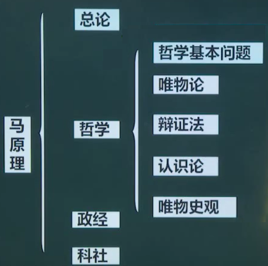

# 总论

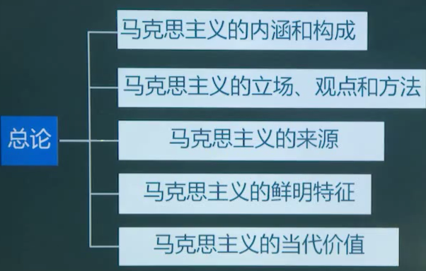

1. 马克思主义理论由马克思主义哲学（方法）、马克思主义政治经济学（主体）和科学社会主义（归宿）构成。

2. 立场、观点、方法

   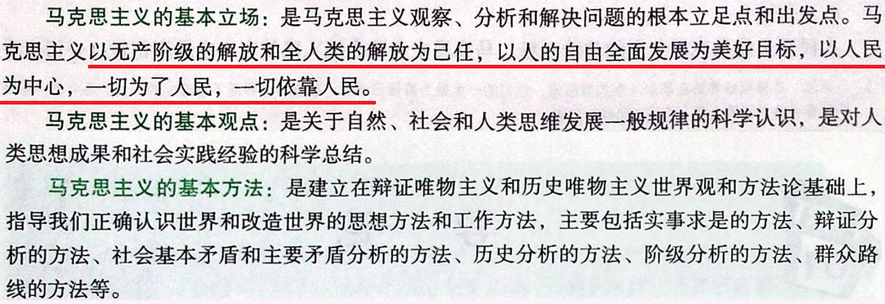

3. 马克思主义的来源

   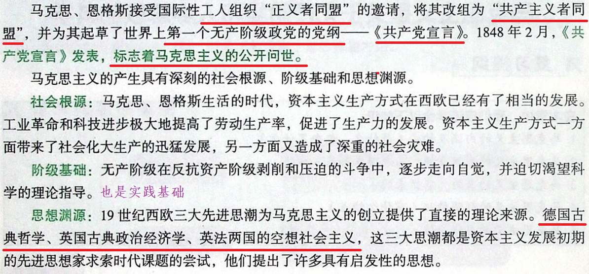

4. 马克思主义的鲜明特征

   

5. 哲学基本问题：思维（意识）和存在（物质）的关系问题

6. 不同的哲学流派

   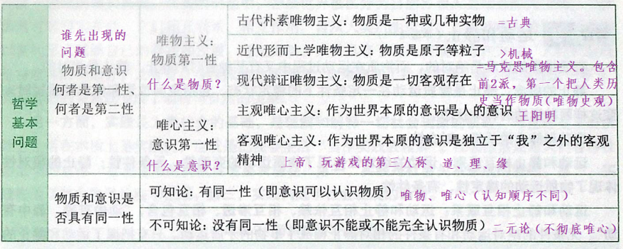

7. 马克思在哲学史上的两大历史贡献

   ① 创立了历史唯物主义（唯物史观）

   ② 将唯物主义和辩证法结合形成了辩证唯物主义

# 哲学

## 唯物论

世界由物质和意识组成，且物质是本原，意识是派生。

### 物质观

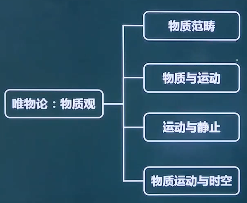

1. 物质的范畴

   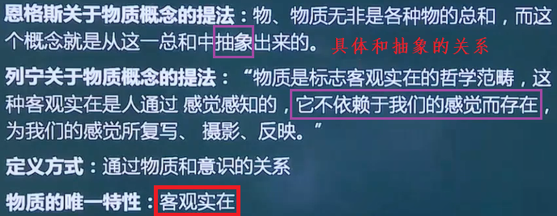

2. 物质和运动（运动等同于变化）

   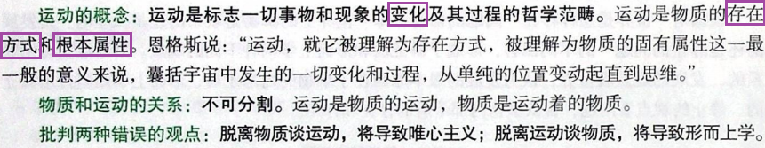

3. 运动和静止

   > ==一切关系均可归纳为不可分割（即我是你的我，你是我的你。词性不同的概念一般是不可分割的关系）和对立统一（即区别和联系。词性相同的概念一般是对立统一的关系）。== 
   >
   > 静止是运动的衡量尺度。

   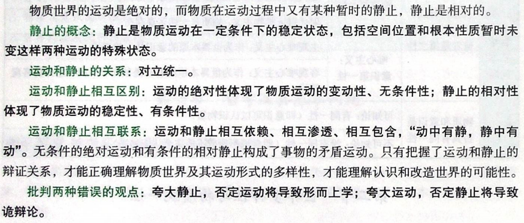

4. 物质运动和时空

   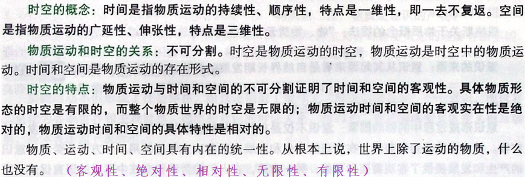

   客观性：时空不以人的意志为转移

   绝对性：时空绝对存在

   相对性：突破速度极限，时空会变化

   无限性：对于整个物质世界来说，时空是无限的

   有限性：对于具体事物来说，时空是有限的

### 横跨物质和意识的桥梁

1. 横跨物质和意识的唯一桥梁是实践。

2. 实践是自然存在和社会存在区分和统一的基础。

3. 从实践出发理解社会生活的本质（即社会生活的本质是实践），要把握两方面：

   ① 实践是使物质世界分化为自然界和人类社会的历史前提，又是使自然界与人类社会统一起来的现实基础；

   ② 实践是人类社会的基础，是理解和解释一切社会现象的钥匙。

4. 社会生活的实践性主要表现（或为什么实践是社会生活的本质）：

   ① 实践是社会关系形成的基础；

   ② 实践形成了社会生活的基本领域；

   ③ 实践构成了社会发展的动力（只是构成了，而不是就是社会发展的动力，社会基本矛盾才是社会发展的动力）。

### 意识观

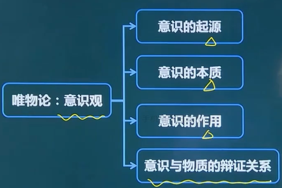

1. 什么是意识？

   意识是自然界长期发展的产物，是人脑的机能和属性，==是客观世界的主观映象==（最标准答案）。

2. 意识咋来的？

   由一切物质所具有的反应特性到低等生物的刺激感应性，再到高等动物的感觉和心理，最终发展为人类的意识（意识是人类独有的）。
   
3. 影响意识形成的因素

   意识不仅是自然界长期发展的产物，而且是社会历史发展的产物。社会实践特别是==劳动==，在意识的产生和发展中起着==决定性的作用==。一方面，劳动为意识的产生和发展提供了客观需要和可能；另一方面，在人们的劳动和交往中形成的==语言==促进了意识的发展，语言是意识的物质外壳（语言本身是物质，但语言所包含的含义是意识）。

4. 意识的本质

   意识是客观世界的主观映象，是客观内容（物质）和主观形式（你脑中对物质的想法）的统一。

5. 意识的作用⭐

   意识的作用即是意识对物质具有==能动作用==，主要表现在：

   （有计划、能创造、瞎指挥、强迫症）

   ① 意识反映世界具有自觉性、目的性和计划性；

   ② ==意识具有创造性==；

   ③ 意识具有指导实践改造客观世界的作用；

   ④ 意识具有调控人的行为和生理活动的作用（困不能睡、饿不能吃）。

6. 物质和意识的辩证关系（即对立统一的关系）：

   相互区别：

   ① 物质是本原，意识是派生；

   ② 物质不是意识，意识不是物质；

   ③ 物质不能代替意识，意识不能代替物质。

   相互联系：

   ① 物质可以转化为(变成)意识，意识可以转化为(变成)物质；

   ② 意识对物质既有依赖性，又有相对独立性；

   ③ 物质决定意识，意识反作用于物质。

7. 正确认识和把握物质与意识的辩证关系，还需要处理好==主观能动性和客观规律性==的关系：

   ① 尊重客观规律是正确发挥主观能动性的前提；

   ② 只有充分发挥主观能动性，才能正确认识和利用客观规律。

8. 正确发挥人的主观能动性，有以下三个方面的前提和条件：

   ① 从实际出发是正确发挥人的主观能动性的前提。

   ② 实践是正确发挥人的主观能动性的基本途径。

   ③ 正确发挥人的主观能动性，还需要依赖于一定的物质条件和物质手段。

9. 在社会历史领域，主观能动性与客观规律性的辩证关系具体表现为社会历史趋向与主体选择的关系。

   ① 社会历史趋向指的是社会历史规律的客观性和必然性，主体选择指的是历史主体在社会发展中的能动性和选择性。

   ② 社会历史规律的客观性和必然性规定了人的活动要受规律性的制约，但与此同时，又不能否定人作为历史主体的能动性和选择性。
   
10. 世界的物质统一性原理（承认该原理独有马哲，用于区分马哲和其它学派）

    ① 世界是统一的，即世界的本原是一个（能批判二元论，不能批判唯心主义）；

    ② 世界的统一性在于它的物质性，即世界统一的基础是物质（能批判唯心主义，不能批判旧唯物主义）；

    ③ 物质世界的统一性是==多样性的统一==，而不是单一的无差别的统一（能批判旧唯物主义）。

11. 马哲与其它学派的区别和联系

    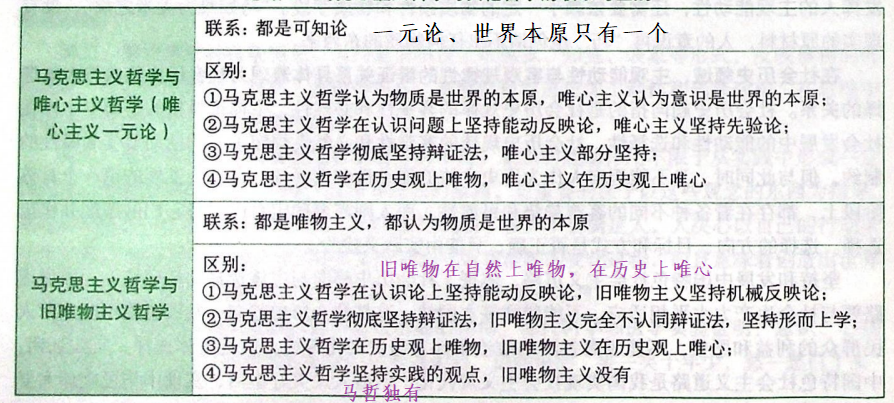

12. 世界的物质统一性原理的具体阐述

    世界统一于物质；世界的物质统一性首先体现在，意识统一于物质；世界的物质统一性还体现在，人类社会也统一于物质。

    人类社会的物质性主要表现在：第一，人类社会是物质世界的组成部分；第二，人类获取生活资料的实践活动是物质性的活动（实践是物质）；第三，人类社会存在和发展的基础是物质资料的生产方式（生产方式是物质）。

13. 世界的物质统一性原理的作用⭐

    世界的物质统一性原理是马克思主义的基石（理论作用）。

    在认识世界和改造世界的过程中，坚持实事求是，一切从实际出发。一切从实际出发，是世界的物质统一性原理在现实生活中和实际工作中的生动体现（实践作用）。

## 辩证法

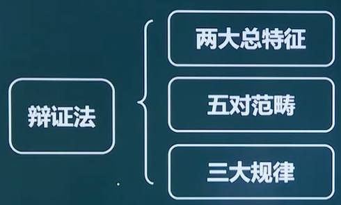

### 两大总特征

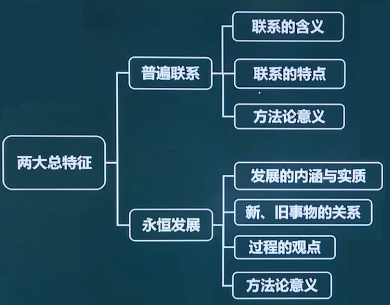

#### 普遍联系

1. 联系的概念（联系是以区别为前提的）

   联系是指事物内部各要素之间和事物之间相互影响、相互制约和相互作用的关系。

2. 联系的特点

   客观性、普遍性、多样性、条件性

#### 永恒发展

1. 发展的概念和实质

   概念：概括一切形式的变化就是运动，运动变化的基本趋势是发展。

   实质：发展是前进上升的运动，发展的实质是新事物的产生和旧事物的灭亡。

   解释：运动=变化>发展（前进的运动或好的变化，发展不是绝对的和无条件的，发展仅仅是永恒的）

2. 新事物和旧事物

   新事物是指合乎历史前进方向、具有远大前途的东西；

   旧事物是指丧失历史必然性、日趋灭亡的东西。

   新事物和旧事物的产生没有先后关系。

   新事物不可战胜的原因：① 新事物具有新结构，能适应新环境；② 新事物是旧事物的改良，吸收了旧的优点，增添了新内容；③ 新事物符合群众利益，受到群众保护。

3. 过程的观点

   ① 世界不是既成事物的集合体，而是过程的集合体；

   ② 一切在历史上产生的都要在历史上灭亡；

   ③ 任何事物都有它的过去、现在和将来。

### 五对范畴

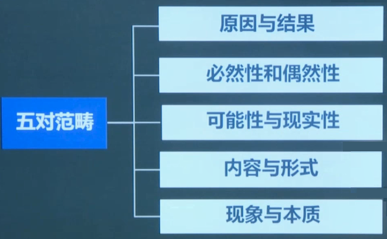

#### 原因和结果

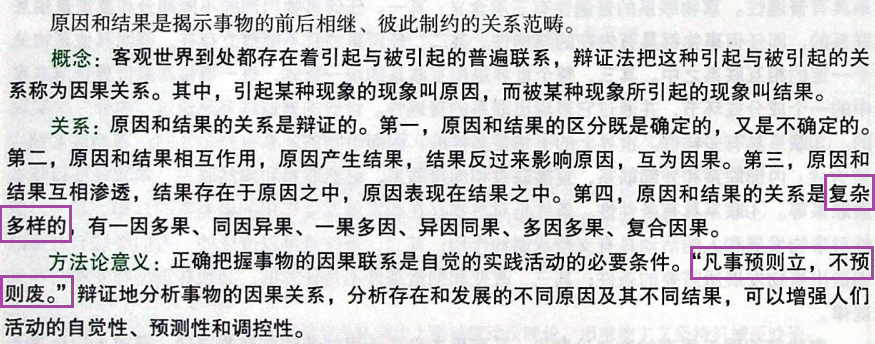

1. 前后相继不一定是原因和结果。
2. 有其因必有其果是错的，有因必有果是对的。

#### 必然性和偶然性

1. 必然和偶然的概念

   必然是指事物联系和发展过程中一定要发生、确定不移的趋势；

   偶然是指事物联系和发展过程中并非确定发生的，可以出现，也可以不出现，可以这样出现，也可以那样出现的不确定的趋势。

2. 任何一个事物的发生既是必然也是偶然。

3. 必然和偶然的关系（对立统一）

   相互区别：

   |                | 必然       | 偶然       |
   | -------------- | ---------- | ---------- |
   | 产生原因不同   | 产生于内部 | 产生于外部 |
   | 表现形式不同   | 稳定的     | 不稳定的   |
   | 地位和作用不同 | 决定性作用 | 影响性作用 |

   相互联系：

   必然存在于偶然之中，通过大量的偶然表现出来，并为自己开辟道路；偶然背后隐藏着必然，受必然的支配，偶然是必然的表现形式和补充；必然和偶然在一定条件下可以互相转化。

#### 可能性和现实性

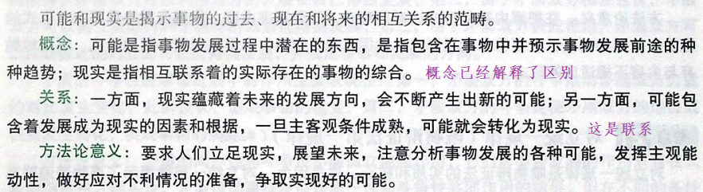

1. 可能和现实的关系简单点说就是既相互包含又相互转化。

2. 一些可能概念的辨别：

   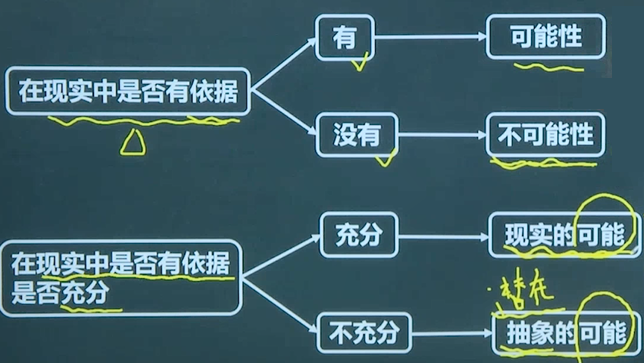 

#### 现象和本质

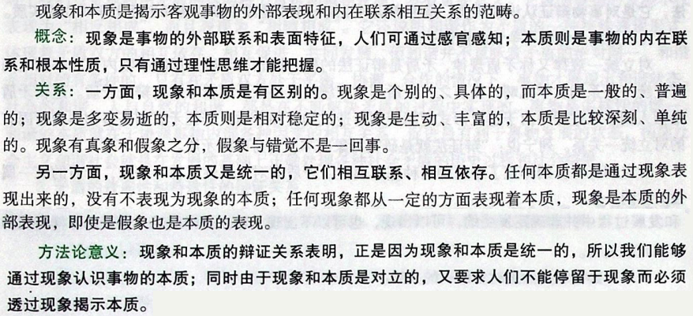

1. 错觉不一定是被假象迷惑导致的。
2. 真象（正面）和假象（侧面）都表示着本质。
3. 真象和假象都是客观存在的，因此真象和假象都不能用对错来形容，比如不能说花开得对不对。但感觉是主观存在的，因此感觉可以用对错来形容，比如错觉都是错误的感觉。
4. 真象和假象都是现象，都只能外露于事物外部，而不会隐藏在事物内部，隐藏在事物内部的是本质。

#### 内容和形式

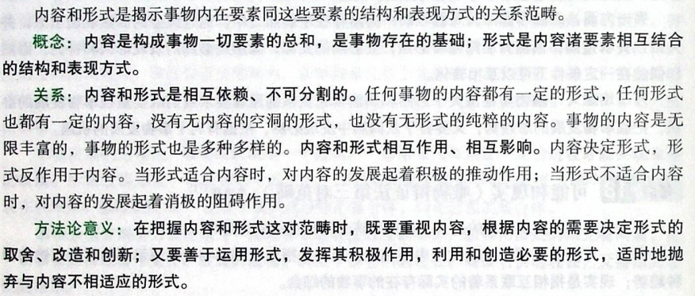

补充：生产力是社会生产的内容，生产关系是社会生产的形式。

### 三大规律

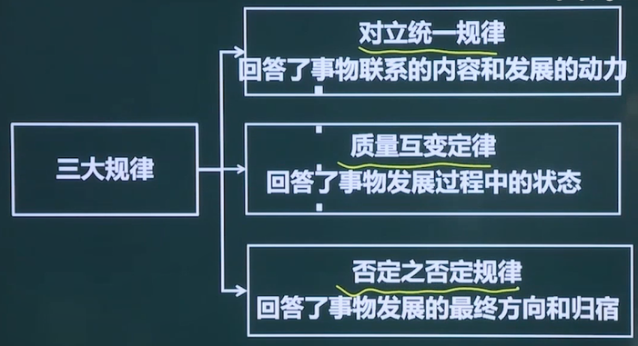

#### 对立统一规律⭐

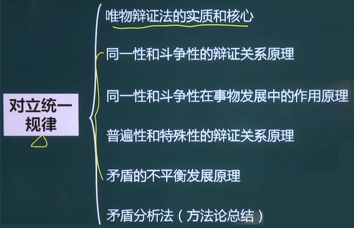

1. **对立统一规律是唯物辩证法的实质和核心**⭐

   为什么对立统一规律是唯物辩证法的实质和核心？

   - 对立统一规律揭示了事物普遍联系的根本内容和永恒发展的内在动力，从根本上回答了事物为什么会发展的问题；
   - 对立统一规律是贯穿量变质变规律、否定之否定规律以及唯物辩证法基本范畴的中心线索；
   - 对立统一规律提供了人们认识世界和改造世界的根本方法（矛盾分析法），它是对事物辩证认识的实质; 
   - 是否承认对立统一学说是唯物辩证法和形而上学对立的实质。

2. **矛盾的同一性和斗争性的辩证关系原理**⭐

   - 这里的矛盾是辩证矛盾，指的是事物内部和事物之间的对立统一，属于中性词。日常所说的矛盾是逻辑矛盾，指的是自相矛盾，属于贬义词。

   - 矛盾的两种基本属性就是对立（斗争性）和统一（同一性）：

     - 同一性：指矛盾双方相互依存（我离不开你，你离不开我）、相互贯通（我可以变成你，你可以变成我）的性质和趋势。
     - 斗争性：指矛盾双方相互排斥、相互分离的性质和趋势。按激烈程度又可分为对抗性斗争（激烈的，对应对抗性矛盾）和非对抗性斗争（缓和的，对应非对抗性矛盾），比如资本主义存在对抗性矛盾=>必将灭亡；社会主义存在非对抗性斗争=>可以解决。
     - 同一和斗争同时存在，而不是时而同一，时而斗争。

   - 同一性和斗争性的对立统一关系：

     ① 相互联系：矛盾的同一性和矛盾的斗争性是相互联结、相辅相成的。同一性不能脱离斗争性而存在，没有斗争性就没有同一性，斗争性寓于同一性之中，没有同一性也就没有斗争性（即同一越多斗争越多，斗争越多同一越多）。

     ② 相互区别：在事物的矛盾中，矛盾的斗争性是无条件的、绝对的，矛盾的同一性是有条件的、相对的。

   - 方法论意义（启示）：

     矛盾的同一性和斗争性是同时存在的，因此事物总是具有两面性, 这要求我们看待事物时要做到“一分为二"；求同存异；批判地继承；事物之间会相互转化。

3. **矛盾的同一性和斗争性在事物发展中的作用原理**⭐

   - 矛盾的同一性在事物发展中的作用：

     ① 由于矛盾双方相互依存、互为存在的条件，矛盾双方可以利用对方的发展使自己得到发展；

     ② 由于矛盾双方相互包含，矛盾双方可以相互吸取有利于自身的因素而得到发展；

     ③ 由于矛盾双方彼此相通，矛盾双方可以向着彼此的对立面转化而得到发展，并规定着事物发展的方向。

   - 矛盾的斗争性在事物发展中的作用：

     ① 矛盾双方的斗争推动矛盾双方力量的对比发生变化，此消彼长，造成事物的量变；

     ② 矛盾双方的斗争促使矛盾双方的地位或性质发生转化，实现事物的质变。

   - 方法论意义（启示）：

     ① 事物的发展不仅表现为相反相成，还表现为相辅相成；

     ② 学会从事物的对立面把握事物的统一，即逆向思考；

     ③ 和谐不是无差别的一致。

4. **矛盾的普遍性和特殊性的辩证关系原理**⭐

   - 普遍性和特殊性的概念

     普遍性：矛盾存在于一 切事物中，存在于一切事物发展过程的始终，旧的矛盾解决了，新的矛盾又产生。简单说就是，矛盾无处不在，无时不有。

     特殊性：指具体事物在其运动中的矛盾及每一矛盾的各个方面都有其特点。具体表现为三种情形：① 不同事物的矛盾各有其特点；② 同一事物的矛盾在不同发展过程和发展阶段各有不同特点；③ 构成事物的诸多矛盾以及每一矛盾的不同方面各有不同的性质、地位和作用。

   - 普遍性和特殊性的对立统一关系

     相互区别：矛盾的共性（即普遍性）是无条件的、绝对的，矛盾的个性（即特殊性）是有条件的、相对的。

     相互联系：任何现实存在的事物都是共性和个性的有机统一，共性寓于个性之中，没有离开个性的共性，也没有离开共性的个性。

   - 方法论意义（启示）：

     具体问题具体分析；对症下药；量体裁衣

5. **矛盾的不平衡发展原理**⭐

   - 何为矛盾的不平衡发展

     矛盾群中的不平衡：在矛盾群中存在着主要矛盾和次要矛盾。主要矛盾是矛盾体系中处于支配地位，对事物发展起决定作用的矛盾。次要矛盾是处于服从地位的矛盾。

     一对矛盾中的不平衡：在每一对矛盾中又有矛盾的主要方面与矛盾的次要方面之分。

   - 原理：矛盾（事物）的性质主要是由主要矛盾的主要方面决定的。

   - 方法论意义：两点论（主次都要抓）与重点论（抓重点）相结合；抓关键，看主流。

6. **矛盾分析法**⭐

   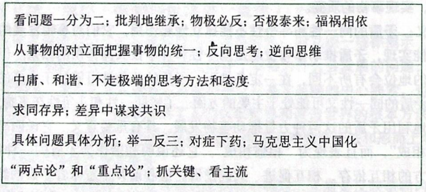

#### 质量互变定律

1. 六个概念

   ① ==质==是一事物成为自身并==区别于其他事物==的内在规定性。

   > 认识质是认识和实践的起点和基础。只有认识质，才能区别事物。 

   ② ==量==是事物的规模、程度、速度等可以用数量关系表示的规定性。

   > 量的意义：
   >
   > (1)认识事物的量是认识的深化和精确化。只有认识量，才能更深刻地把握质；
   >
   > (2)只有正确了解事物的量，才能正确估计事物在实践中的地位和作用，因为同质的事物由于数量不同，在实践中的地位和作用往往不同。

   ③ ==度==是保持事物质的稳定性的数量界限，即事物的限度、幅度和范围。度的两端叫关节点或临界点，==超出度的范围，此物就转化为他物==（度可以看成是区间）。度告诉我们，在认识和处理问题时要适度。

   ④ ==量变==是事物数量的增减和组成要素排列次序的变动，是保持事物的质的相对稳定性的不显著变化，体现了事物发展渐进过程的连续性。

   ⑤ ==质变==是事物性质的根本变化，是事物由一种质态向另一种质态的飞跃，体现了事物渐进过程和连续性的中断。

2. 量变和质变的对立统一关系

   - 相互区别：即概念

   - 相互联系：

     ① 量变是质变的必要准备（质变不需量变：激变论，过分夸大质变）

     ② 质变是量变的必然结果（可以一直量变：庸俗进化论，过分夸大量变）

     ③ 量变和质变是相互渗透的：一方面，在总的量变过程中有阶段性和局部性的部分质变；另一方面，在质变过程中也有旧质在量上的收缩和新质在量上的扩张（同时存在两个质，旧的在收缩，新的在扩张）。

3. 方法论意义

   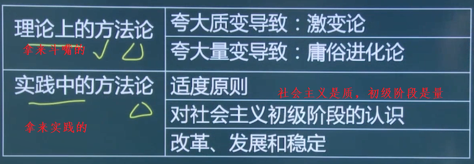

#### 否定之否定规律

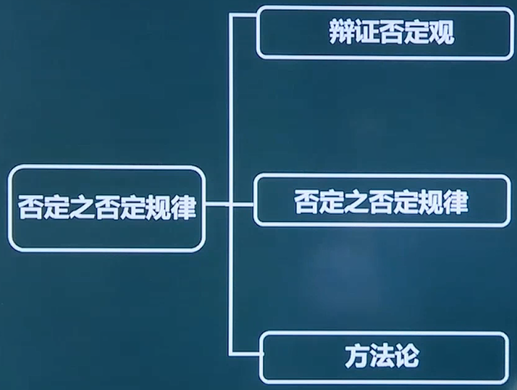

1. 事物内部同时存在着肯定因素和否定因素。肯定因素是维持现存事物存在的因素，否定因素是促使现存事物灭亡的因素。

2. 辩证否定观的基本内容：

   ① 否定是事物的自我否定（即自己否定自己），是事物内部矛盾运动的结果（形而上学：外在力量对事物进行否定和消灭）

   ② 否定是事物发展的环节（即否定自己以往的状态才能前进）

   ③ 否定是新旧事物联系的环节（即新事物通过否定旧事物而产生）

   ④ 辩证否定的实质是 "扬弃"，即新事物对旧事物既批判又继承，既克服其消极因素又保留其积极因素（形而上学：要么肯定一切，要么否定一切）

3. 否定之否定规律：

   ==事物的辩证发展就是经过两次否定，出现三个阶段即“肯定一否定一否定之否定”，形成一个周期。 其中否定之否定阶段仿佛是向原来出发点的“回复”，但这是在更高阶段的“回复”是“扬弃”的结果。==事物的发展呈现出周期性，上一个周期和下一个周期的无限交替，使事物的发展呈现出波浪式前进或螺旋式上升的总趋势。

   > 举例说明：
   >
   > 种子的一个周期：种子 -> 否定 -> 花果 -> 否定（看似是回复）-> 种子'（其实是比一开始的种子更牛逼的种子）
   >
   > 通过不断地经历这样的周期，种子得到升华，基因得到改变。

   否定之否定规律揭示了事物发展的前进性与曲折性的统一。前进性体现在：每一次否定都是质变，都把事物推到新阶段；每一个周期都是开放的，不存在不被否定的终点。曲折性体现在回复性上，其中有暂时的停顿或倒退，但是经过曲折终将为事物的发展开辟道路。这表明事物的发展不是直线式前进而是螺旋式上升。

4. 方法论意义：

   

### 两种辩证法

1. 客观辩证法和主观辩证法的概念

   ① 客观辩证法：指客观事物或客观存在的辩证法（大自然本来存在的辩证法）

   ② 主观辩证法：指人类认识和思维运动的辩证法（即人认识自然从而习得并在头脑中形成的辩证法）

2. 客观辩证法和主观辩证法的关系

   客观辩证法与主观辩证法都是唯物辩证法的一部分，因此它们在本质上是统一的，但在表现形式上却有不同。客观辩证法采取外部必然性的形式（不需要人参与，大自然自己演绎的辩证法）。主观辩证法则采取观念的、逻辑的形式（以人思考和反映而存在的辩证法）。

## 认识论

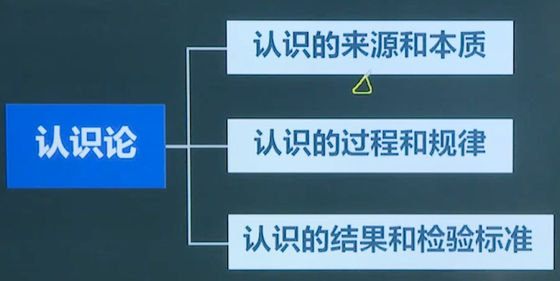

### 实践与认识

实践即是物质，认识即是意识，实践和认识的关系就是物质和意识的关系。

#### 何为实践

1. 错误的实践观和正确的实践观

   - 错误的实践观

     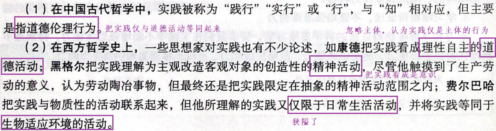

   - 正确的实践观

     实践是感性的（由意识指导、体现主体的意愿）、对象性（仅有主体是不够的，还需要有对象）的物质活动（具有客观性）。

2. 实践的概念

   实践是人类能动地改造世界的客观物质性活动。

   > 实践是人独有的，实践的主体只能是人，比如机器人不能代替人实践

3. 实践的基本特征

   ① 直接现实性（本质特性）：实践具有将"脑中的"变成"现实的"的功能

   ② 自觉能动性（也叫主体能动性）：实践受意识指导，体现主体的目的性（实践可以做任何事情，但只会做一些事情，就是因为实践受头脑的指挥，它具有自觉能动性）

   ③ 社会历史性：不同历史阶段的实践的内涵不同（不同时间可以做到的实践不同）

4. 实践的结构：由主体、客体和中介组成

   - 实践主体：指具有一定的主体能力、从事现实社会实践活动的人（不是所有人都是主体），是实践活动中自主性和能动性的因素，担负着设定实践目的、操作实践中介、改造实践客体的任务。

     实践主体的能力包括自然能力（比如力气）和精神能力，精神能力又包括知识性因素和非知识性因素。其中知识性因素是首要的能力，既包括对理论知识的掌握，也包括对经验知识的掌握；非知识性因素主要指情感和意志因素。

     实践主体有个体主体、群体主体和人类主体三种基本形态。

   - 实践客体：指实践活动所指向的对象（不是所有物都是客体）。实践客体与客观存在的事物不完全等同，客观事物只有在被纳人主体实践活动的范围之内，为主体实践活动所指向并与主体相互作用时才成为现实的实践客体。

   - 实践中介：指各种形式的工具、手段以及运用、操作这些工具、手段的程序和方法。

     实践的中介系统可分为两个子系统：一是作为人的肢体延长、感官延伸、体能放大的物质性工具系统，如各种机器系统和动力能源系统。火车、电脑、雷达分别是对人的腿、 脑、眼功能的延伸和放大。二是语言符号工具系统。语言符号是主体思维活动进行的现实形式，也是人们社会交往得以进行的中介。正是依靠这些中介系统，实践的主体和客体才能够相互作用。

   - 它们的关系：

     实践的主体和客体相互作用的关系，包括实践关系、认识关系和价值关系，其中实践关系是最根本的关系。实践的主体和客体与认识的主体和客体在本质上是一致的。

     > 主体客体化，是人通过实践使自己的本质力量作用于客体，使其按照主体的需要发生结构和功能上的变化，形成了世界上本来不存在的对象物，比如把树变成纸、筷子。
     >
     > 客体主体化，是客体从客观对象的存在形式转化为主体生命结构的因素或主体本质力量的因素，客体失去客体性的形式，变成主体的一部分，比如电脑、汽车、思想。

5. 实践的形式：物质生产实践（劳动，最基本的实践活动）、社会政治实践（搞关系）、科学文化实践（探索）、虚拟实践（数字化中介、主客体均为人，具有交互性、开放性、间接性，是实践活动的派生形式，具有相对独立性，但它还是属于前三种形式中的某一种，前三种形式是基本形式）

   > 人的活动分为本能活动和实践活动，因此不是所有人的活动都是实践活动。

6. 实践决定认识⭐

   - 实践是认识的来源。实践产生了认识的需要，实践为认识的形式提供了可能；
   - 实践是认识的动力；
   - 实践是认识的目的；
   - 实践是检验认识真理性的唯一标准。

   > 1. 认识虽然决定于实践，但还受到天赋（或叫生理因素，使得人对于同一种实践可以有不同的认识）和间接经验（使得人可以间接获得认识，比如听老师的课）等因素影响。
   >
   >    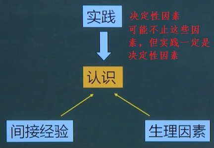 
   >
   > 2. 一些错误观点：
   >
   >    认识总是滞后于实践（实践->认识->实践->认识）
   >
   >    实践是认识的先导（先导指的是指导）
   >
   >    实践与认识是合一的（这是唯心主义，同一才是对的。但现在这是对的，因为习大大说过知行合一，若前提是王阳明说的那就是错的）

#### 何为认识

1. 不同学派对认识的解释

   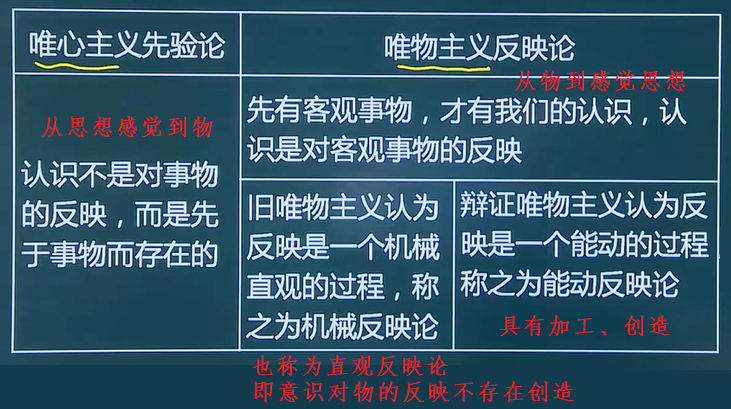

2. 能动反映论对认识的解释

   辩证唯物主义认识论认为，认识的本质是主体在实践基础上对客体的能动反映。

   具体解释：

   这种能动反映不但具有反映客体内容的反映性特征，而且具有实践所要求的主体能动的、创造性的特征。

   一方面，认识的反映特性是人类认识的基本规定性，即人的认识必然要以客观事物为原型和摹本，在思维中再现或摹写客观事物的状态、属性和本质。

   另一方面，认识的能动反映具有创造性。认识是一种在思维中的能动的、创造性的活动，而不是主对客观对象简单、直接的描摹或照镜子式的原物映现。 

   认识的反映特性和创造特性之间的关系：不可分割。

   只坚持认识的反映性，看不到认识能动的创造性，就重复走上了旧唯物主义直观反映论的错误之路；相反，只坚持认识能动的创造性，使创造性脱离反映论的前提，就会把创造变成主观随意，从而滑向唯心主义和不知论。

   能动反映论的两个突出的特点 ( 优点 ) ：一是把实践的观点引入认识论。二是把辩证法用于反映论考察认识的发展过程，把认识看成一个由不知到知、由浅入深的充满矛盾的能动的认识过程，全面地揭示了认识过程的辩证性质。

3. 认识的过程

   - 从感性认识到理想认识（第一次飞跃）⭐

     感性认识是人们在实践基础上，由感觉器官直接感受到的关于==事物的现象==、==事物的外部联系==、==事物的各个方面==的认识，包括==感觉==、==知觉==和==表象==三种形式。感性认识是认识的初级阶段，==直接性==是感性认识的突出特点（还有==具体性==）。

     理性认识是认识的高级阶段，是指人们借助抽象思维，在概括整理大量感性材料的基础上，达到关于==事物的本质==、==全体==、==内部联系==和==事物自身规律性==的认识。理性认识包括==概念==、==判断==、 ==推理==三种形式。理性认识的特点是它的==间接性==和==抽象性==。

     感性认识和理性认识的辩证关系

     ① 感性认识有待于发展和深化为理性认识。

     ② 理性认识依赖于感性认识。

     ③ 感性认识和理性认识相互渗透、相互包含。感性认识和理性认识的辩证统一关系是在实践的基础上形成的，也需要在实践中发展。如果割裂二者的辩证统一关系，就会走向唯理论或经验论，在实际工作中就会犯教条主义错误或经验主义错误。

     （"对于某个格言，由老人和少年说出是不一样的"这强调的是感性认识。感性侧重于多实践、有经验、有触动，理性侧重于多读书、有理论）

     感性认识上升到理性认识的条件

     ① 勇于实践，深入调查，获取十分丰富和合乎实际的感性材料，这是感性认识上升到理性认识的基础。

     ② 必须经过理性思考的作用，将丰富的感性材料加工制作，去粗取精、去伪存真、由此及彼、由表及里，才能将感性认识上升为理性认识。

   - 从理性认识回到实践（第二次飞跃）

     这是认识过程的第二次能动的飞跃，是认识过程中更为重要的一次飞跃。

   - 影响认识过程的理性因素和非理性因素

     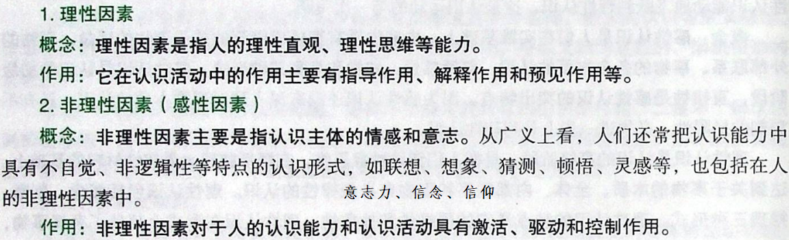

     > 理性认识和感性认识是认识过程已经获得的认识，而理性因素和非理性因素是获得认识的过程中的影响因素，即在获得理性认识的过程中存在理性因素和非理性因素，而在获得感性认识的过程中也存在理性因素和非理性因素。

4. 认识的规律⭐

   - 反复性：指人们对于一个复杂事物的认识往往要经过由感性认识到理性认识、再由理性认识到实践的多次反复才能完成。

     原因：从客观方面看，事物的各个侧面及其本质的暴露有一个过程（事物不会立刻暴露其本质）；从主观方面看，人的认识能力有一个提高的过程。

   - 无限性：指对于事物发展过程的推移来说，人类的认识是永无止境、无限发展的，它表现为“实践一认识一再实践一再认识”的无限循环，由初级阶段向高级阶段不断推移的永无止境的前进运动。这种认识的无限发展过程，在形式上是循环往复，在实质上是前进上升（否定之否定）。

5. 认识和实践的统一

   实践超前于认识：冒进主义（左）

   实践落后于认识：保守主义（右）

   （左/右倾指共产党员，左/右派指党外人士）

### 真理与价值

#### 何为真理⭐

1. 错误的真理观和正确的真理观

   错误的真理观

   ① 马赫主义：认为真理是"思想形式"，是"社会地组织起来的经验"，==凡是多数人承认的便是真理==。

   ② 实用主义：认为“有用即真理”，把真理的有用性与真理本身等同起来。

   正确的真理观

   ① 真理一定是有用的。

   ② 马克思主义：真理是标志主观与客观相符合的哲学范畴，是对客观事物及其规律的正确反映。

2. 真理的特点

   - 真理的客观性

     真理的客观性指真理的内容是对客观事物及其规律的正确反映，真理中包含着不依赖于人和人的意识的客观内容。客观性是真理的本质属性，但是真理的形式又是主观的，真理通过感觉、知觉、表象、概念、判断、推理等主观形式表达出来。

     （真理的客观性体现于真理的内容是客观存在的外部世界，以及检验真理的标准是具有客观性的实践，所以真理是客观的）

     真理的客观性决定了真理的一元性。真理的一元性是指在同一条件下对于特定的认识客体 的真理性认识只有一个，而不可能有多个。（真理只有一个）

   - 真理的绝对性

     真理的绝对性是指真理的内容表明了主客观统一的确定性和发展的无限性。它有两个方面的含义：一是任何真理都必然包含同客观对象相符合的客观内容，都同谬误有原则的界限。否则就不称其为真理，这一点是无条件的、绝对的。二是人类认识按其本性来说，能够正确认识无限发展着的物质世界，认识每前进一步，都是对无限发展着的物质世界的接近，这一点也是无条件的、绝对的。

   - 真理的相对性

     真理的相对性是指人们在一定条件下对事物的客观过程及其发展规律的正确认识总是有限度的。它有两个方面的含义：一是真理所反映的对象是有条件的、有限的（事物本身会发展）；二是真理反映客观对象的正确程度也是有条件的、有限的（成年的我和少年的我对同一事物的见解是不同的）。

   - 真理的绝对性和相对性的辩证统一关系

     二者相互依存。所谓相互依存，是说人们对于客观事物及其本质和规律的每一个正确认识，都是在一定范围内、一定程度上、一定条件下的认识，因而必然是相对的和有局限性的；但是在这一定范围内、一定程度上、一定条件下，它又是对客观对象的正确反映，因而它又是无条件的、绝对的。 

     二者相互包含。所谓相互包含，一是说真理的绝对性寓于真理的相对性之中；二是说真理的相对性必然包含并表现着真理的绝对性。所以，绝对真理和相对真理是不可分的，没有离开绝对真理的相对真理，也没有离开相对真理的绝对真理。无数相对的真理之总和，就是绝对的真理。 （对于真理的总体来说，整个内容都是相对的，但里面总有部分内容是绝对正确的）

     在二者的辩证关系中，还要明确，真理永远处在由相对向绝对的转化和发展中，是从真理的相对性走向绝对性、接近绝对性的过程。任何真理性的认识都是由真理的相对性向绝对性转化过程中的一个环节，这是真理发展的规律。（只能无限接近终极真理）

     真理的绝对性与相对性，根源于人的认识能力、思维能力的矛盾本性，是人的思维的至上性（人一定有认识真理的能力=>绝对性）和非至上性（但此时还没有这个能力=>相对性）或人的认识能力的无限性和有限性的矛盾。

     （绝对性：我对它的认知至少现在是对的；相对性：我对它的认知虽然现在是对的，但在未来可能是错的，可我认识到它的错误了，所以我对它的认知又是对的（同时又体现了绝对性））

3. 方法论

   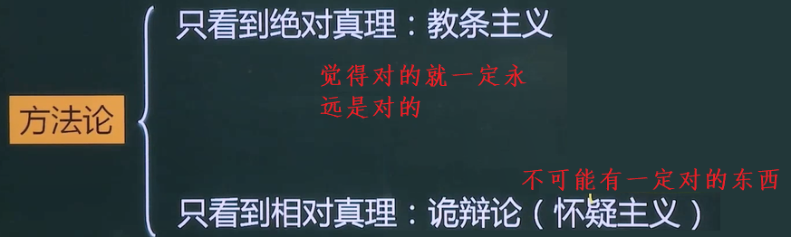

4. 真理和谬误的对立统一关系

   相互区别：由于真理和谬误决定于认识的内容是否如实地反映了客观事物，因此真理和谬误是性质不同的两种认识，它们是对立的。

   相互联系：真理和谬误是统一的，它们相互依存、相互转化。真理和谬误相比较而存在，没有真理也无所谓谬误，没有谬误也无所谓真理；真理中包含着某种以后会暴露出来的错误的方面或因素，谬误中也隐藏着以后会显露出来的真理的成分或萌芽。

   > 真理和谬误都是对于某一范围来说的，在这个范围内真理是对的而谬误是错的，因此在这个范围内真理和谬误是不可以转化的，对的就是对的，错的就是错的。但若超出这个范围了真理就不适用了，就转变为谬误，而谬误回归它的适用范围就会变得正确，从而变成真理（比如牛顿定律和相对论）
   >
   > 真理的相对性指出真理在未来有可能被推翻，有可能会变得不正确，但它现在肯定是对的，而谬误现在就是错的。

5. 真理的检验标准（👎不重要，可以不看）

   实践是检验真理的唯一标准，这是由真理的本性和实践的特点决定的。

   ① 真理的本性是主观和客观的一致、符合。这就是说只有横跨主观和客观（即意识和物质）的东西才能检验真理，而唯一横跨主观和客观的桥梁只有实践。

   ② 实践的本质特点是直接现实性。

   注意，实践是检验真理的唯一标准，并不排斥逻辑证明的作用（但逻辑证明不能作为标准）。

   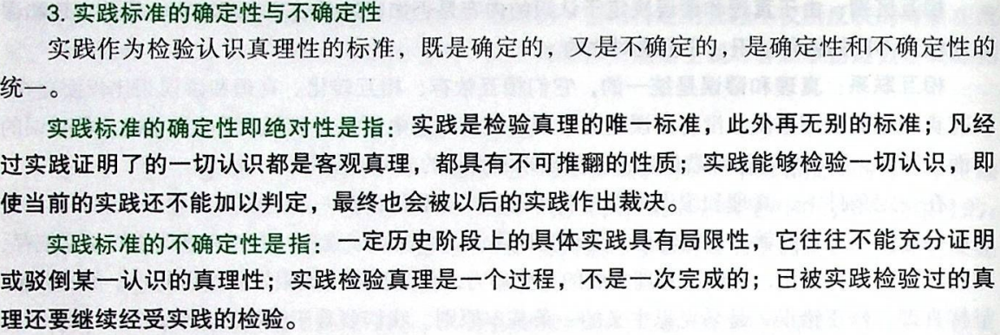

#### 何为价值

1. 价值的概念

   在实践基础上形成的主体和客体之间的意义关系，是客体对个人、 群体乃至整个社会的生活和活动所具有的积极意义。

2. 价值的特点

   主体性（非主观性）：主体不同，价值不同。

   客观性：不以人的意志为转移。

   多维性：维度不同，价值不同。

   社会历史性：历史时期不同，价值不同。

3. 价值评价的特点及其标准

   价值评价是一种关于价值现象的评价性的认识活动，是主体对客体价值以及价值大小所作的评判或判断，因而也被称作价值判断。

   > 认识分为知识性认识和评价性认识。知识性认识以客体为对象，评价性认识以主客体之间的关系为对象。这里的价值评价就是评价性认识。

   价值评价的特点：

   ① 评价以主客体的价值关系为认识对象。

   ② 评价结果与评价主体直接相关。

   ③ 评价结果的正确与否依赖于对客体状况和主体需要的认识（即依赖于知识性认识，比如鉴宝专家和普通人对于某颗钻石的评价）。

   价值评价的特点表明，评价并不是一种主观随意性的认识活动，而是具有客观性的认识活动。由于人民群众的要求和利益从根本上代表着人类整体的要求和利益，是与历史发展的基本要求或趋势相一致的，因此对于任何价值评价的主体而言，其价值评价只有与人类整体的要求或利益相一致，才是正确的价值评价。

4. 真理与价值的辩证统一关系

   在实践中，真理既是制约实践的客观尺度，又是实践追求的价值目标之一，即通过实践获取外部世界的科学认识；而价值则是实践追求的根本目标，同时又是制约实践的主体尺度，真理和价值在实践基础上是辩证统一的。（这是说，实践有两把尺子，一把是真理，一把是价值，成功的实践必须符合真理并能够创造价值）

   真理和价值在实践中的辩证统一关系，主要体现在：首先，成功的实践必然是以真理和价值的辩证统一为前提的。其次，价值的形成和实现必须以坚持真理为前提，而真理又必然是具有价值的。最后，真理和价值在实践和认识活动中是相互制约、相互引导、相互促进的。

### 必然与自由
1. 自由的概念：哲学上的自由是标示人的活动状态的范畴，是指人在活动中通过认识和利用必然所表现出的一种自觉自主的状态。（我想咋地，能动性）

2. 必然的概念：必然性即规律性，是指不依赖于人的意识而存在的自然和社会发展所固有的客观规律。自由是对必然的认识和对客观世界的改造。（我该怎么样，规律性）

3. 认识必然和争取自由，是人类认识世界和改造世界的根本目标，是一个历史性的过程。由必然到自由表现为人类不断地从必然王国走向自由王国的过程。（人类历史就是从必然走向自由的历史，但必然不会消失）

4. 自由是历史发展的产物， 自由是有条件的：一是认识条件（认知越多，越自由）；二是实践条件（自由以必然为限度；自由以不牺牲别人的自由为限度）。

## 唯物史观

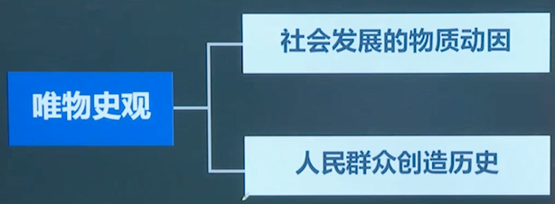

### 批判唯心史观

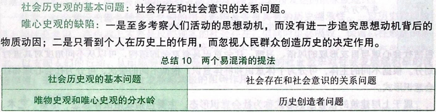

### 社会存在和社会意识

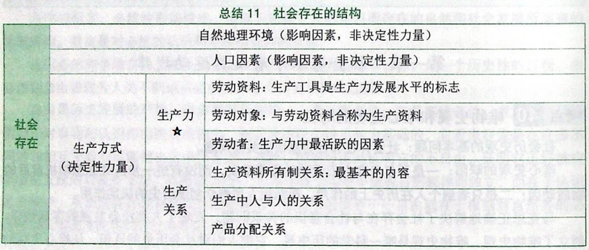

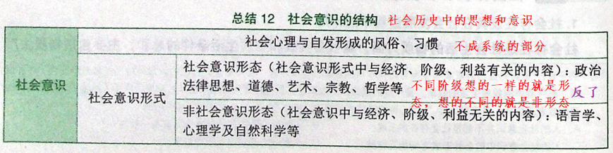

社会存在和社会意识的辩证关系

1. 社会存在决定社会意识：

   ① 社会存在是社会意识内容的客观来源，社会意识是社会物质生活过程及其条件的主观反映。

   ② 社会意识是人们进行社会物质交往的产物。

   ③ 随着社会存在的发展，社会意识也==相应地或迟或早地==发生变化和发展。

2. 社会意识是社会存在的反映，并反作用于社会存在（相对独立性）：

   ① 社会意识与社会存在发展的不完全同步性和不平衡性。

   ② 社会意识内部各种形式之间的相互影响及各自具有的历史继承性（父母的想法会影响孩子，下一代的思想继承于老一代的思想）。

   ③ 社会意识对社会存在的能动的反作用（双向：先进思想推动社会存在，落后思想阻碍社会存在）。

### 生产力和生产关系

生产力和生产关系之间的矛盾运动是第一对社会基本矛盾。

#### 什么是生产力

生产力是人类在生产实践中形成的改造和影响自然以使其适应社会需要的物质力量（生产力是物质）。它表示==人与自然的关系==。它包括：

1. 劳动资料，即劳动手段。其中最重要的是==生产工具==，它是生产力发展水平的客观尺度，是区分==社会经济时代==的客观依据。

2. 劳动对象。劳动资料和劳动对象合称为生产资料。

3. 劳动者。劳动者是生产力中最活跃的因素。

> 科技属于生产力的一个要素，但不是独立要素，它只是渗透到上述三者中而发挥作用。
>
> 科学技术日益成为生产发展的决定性因素。在生产劳动中，这句话是对的，但在社会历史中，这句话是错的。

#### 什么是生产关系

生产关系是人们在物质生产过程中形成的不以人的意志为转移的经济关系（生产关系也是物质）。生产关系是社会关系中最基本的关系。生产关系包括生产资料所有制关系、生产中人与人的关系和产品分配关系。在生产关系中，生产资料所有制关系是最基本的、决定性的，它构成全部生产关系的基础，是区分不同生产方式、判定==社会经济结构性质==的客观依据。

生产关系虽然是一种==人与人的关系==，但它是在物质生产过程中结成的关系，是不以人的意志为转移的。

#### 生产力与生产关系的辩证关系

相互区别：生产力和生产关系是社会生产不可分割的两个方面。在社会生产中，生产力是生产的物质==内容==，生产关系是生产的社会==形式==，二者的有机结合和统一，构成社会的生产方式（可以套用内容和形式的辩证关系）。

相互联系：生产力决定生产关系，生产关系反作用于生产力。

#### 社会发展第一规律

生产力与生产关系的矛盾运动规律就是社会发展第一规律，即生产关系一定要适合生产力状况的规律。

### 经济基础和上层建筑

 经济基础和上层建筑的矛盾运动就是第二对社会基本矛盾。

#### 何为经济基础

经济基础是指由社会一定发展阶段的生产力所决定的生产关系的总和（经济基础就是生产关系，所以生产力可以决定经济基础）。

#### 何为上层建筑

上层建筑是指建立在一定经济基础之上的意识形态以及相应的制度、组织和设施：

- 意识形态又称==观念上层建筑==，包括政治法律思想、道德、艺术、宗教、哲学等思想观点（无形的）。

> 上层建筑的意识形态与社会意识的关系：
>
> 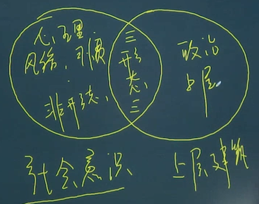 
>
> 属于上层建筑的社会意识就是社会意识形态。

- 政治法律制度及设施和政治组织又称==政治上层建筑==，包括国家政治制度、立法司法制度和行政制度，以及国家政权机构、政党、军队、警察、法庭、监狱等政治组织形态和设施（有形的）。

#### 经济基础与上层建筑的辩证关系

1. 经济基础决定上层建筑（生产关系也可以决定上层建筑，因此生产力也可以决定上层建筑）。

2. 上层建筑对经济基础具有反作用。这种反作用集中表现在为自己的经济基础服务。上层建筑的反作用是巨大的，但不是无限的。它可以影响社会性质和历史进程，但不能决定历史发展的总趋势。

> 判断先进性：
>
> 1. 生产关系是不是先进的
>
>    当生产关系适应于生产力的发展时，生产关系就是先进的，可以推动生产力发展，若不适应则是落后且阻碍生产力发展。
>
> 2. 经济基础是不是先进的
>
>    当经济基础适应于生产力的发展时，经济基础就是先进的，可以推动生产力发展，若不适应则是落后且阻碍生产力发展。
>
> 3. 上层建筑是不是先进的
>
>    错误观点：当上层建筑适应于经济基础的发展时，上层建筑就是先进的，若不适应则是落后的。
>
>    正确观点：当上层建筑所服务的经济基础适应生产力的发展时，上层建筑就是先进的，若不适应则是落后的。
>
> 生产力、生产关系、经济基础和上层建筑四者关系：
>
> 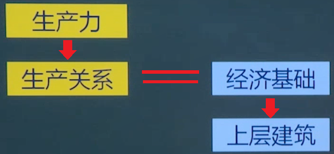 

#### 社会发展第二规律

经济基础与上层建筑的矛盾运动规律就是社会发展第一规律，即上层建筑一定要适合经济基础发展状况的规律。

### 社会形态更替

#### 社会形态的含义

社会形态（与社会意识形态截然不同的概念）是关于社会运动的具体形式、发展阶段和不同质态的范畴，是同生产力发展一定阶段相适应的经济基础与上层建筑的统一体（社会形态=经济基础+上层建筑）。

社会形态包括社会的经济形态、政治形态和意识形态。

#### 社会形态的特点

1. 社会形态的内容是全面的，既包括经济基础，又包括上层建筑，二者缺一不可，犹如“骨骼”和“血肉”。经济基础是社会的“骨骼系统”，上层建筑是社会的“血肉系统”，上层建筑不过是经济基础的政治和思想的表现形态。

2. 社会形态是具体的，不是抽象的。

3. 社会形态是历史的，有它产生、发展和灰亡的过程。

#### 社会形态更替的特点

1. 社会形态更替的统一性和多样性：

   从纵向看，表现为社会形态更替的统一性（即都是从原始社会到奴隶社会，再到封建社会...）和多样性（有些国家可以不经历其中的一些社会形态，比如中国就没有资本主义社会，这就体现了多样性）。

   从横向看，社会发展过程的统一性和多样性表现为同类社会形态既有共同的本质，又有各自的特点（比如美国和日本的资本主义社会，它们有共同的东西，也有互相区别的东西）。

2. 社会形态更替的必然性（即规律，符合社会形态更替的顺序）与人们的历史选择性（即能动，可以选择封建过后就是社会主义，而无需经过资本主义，而这也符合规律）。

   一个民族之所以作出这种或那种选择，有其特定的原因：一是取决于民族利益；二是取决于交往（中国与苏联好=>社会主义）；三是取决于对历史必然性以及本民族特点的把握程度（封建过后的中国可以选择资本主义和社会主义，但社会主义更符合中华民族）。

3. 社会形态更替的前进性与曲折性。社会发展过程中的决定性、统一性表明社会发展的总趋势是前进的；社会发展过程中的选择性、多样性表明社会发展的具体道路不是直线的，而是曲折的（否定之否定）。

### 社会历史发展的动力

#### 社会基本矛盾

社会基本矛盾是社会历史发展的==根本动力==。社会基本矛盾指的就是生产力和生产关系之间的矛盾和经济基础和上层建筑之间的矛盾。

为什么社会基本矛盾是根本动力？

① 生产力是社会基本矛盾运动中最基本的动力因素，是人类社会发展和进步的最终决定力量（生产力变动会会引起其它也跟着变动）。

② 社会基本矛盾特别是生产力和生产关系的矛盾，是“一切历史冲突的根源”，决定着社会中其他矛盾的存在和发展。

③ 社会基本矛盾具有不同的表现形式和解决方式，并从根本上影响和促进社会形态的变化和发展（矛盾解决的好则社会形态的发展就好）。

#### 阶级斗争

阶级斗争是社会基本矛盾在阶级社会中的直接表现，是阶级社会发展的直接动力（重要动力）。

#### 社会革命

革命是实现社会形态更替的重要手段，是社会发展的重要动力。

#### 改革

 改革是推动社会发展的又一重要动力。

#### 科学技术

科学技术革命是社会动力体系中的一种重要动力。原因如下：

① 现代科学技术革命对生产方式产生了深刻影响。

② 现代科学技术革命对生活方式产生了巨大影响。

③ 现代科学技术革命促进了思维方式的变革。

### 现实的人

现实的人指的是“不是处在某种虚幻的离群索居和固定不变状态中的人，而是处在现实的，可以通过经验观察到的，在一定条件下进行的发展过程中的人”。

人的本质是现实的人之所以存在的内在根据。人的本质问题包括两个方面：一是人与动物的区别；二是人与人的区别。

1. 从人与动物相区别的层次上，人的本质在于劳动。

2. 从人与人相区别的层次上，人的本质是一切社会关系的总和（我的父母、我的兄弟、我的妻子、我的儿女等关系的总和，而用这些关系去区别人，即人的本质不是自然属性，而是社会属性）。

   （被动物带大的人不是人，他没有社会关系）

### 人民群众

人民群众是一个历史范畴。从质上说，人民群众是指一切对社会历史发展起推动作用的人，从量上说，是指社会人口中的绝大多数。人民群众中最稳定的主体部分始终是从事物质资料生产的劳动群众及其知识分子。

（在封建社会，封建阶级也是人民群众，他们也在推动历史发展）

在社会历史发展过程中，人民群众起着决定性的作用。人民群众是社会历史实践的主体，是历史的创造者。原因如下：

1. 人民群众是社会物质财富的创造者；
2. 人民群众是社会精神财富的创造者；
3. 人民群众是社会变革的决定力量；
4. 人民群众既是先进生产力和先进文化的创造主体，也是实现自身利益的根本力量。

历史是人民群众创造的，但人民群众创造历史的活动及作用又受到社会历史条件的制约。这些条件包括经济条件（根本制约因素）、政治条件和精神文化条件。

人民群众创造历史所得出的方法论：

1. 要树立群众观点和坚持群众路线。

2. 群众观点：坚信人民群众自己解放自己的观点，全心全意为人民服务的观点，一切向人民群众负责的观点，虚心向群众学习的观点（为什么树立这些观点，因为历史是由人民群众创造的）。

3. 群众路线（实际工作中）：一切为了群众，一切依靠群众，从群众中来，到群众中去（为什么要坚持群众路线，因为历史是由人民群众创造的）。 

# 政治经济学

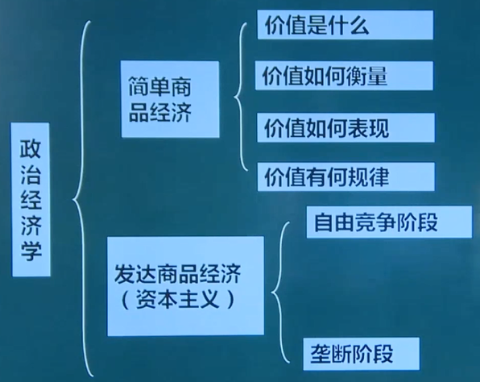

## 资本主义生产关系的产生和生产方式的形成

1. 资本主义生产关系的产生

   资本主义生产关系产生的途径有两个：一是从小商品经济分化出来；二是从商人和高利贷者转化而成。

2. 资本的原始积累

   资本原始积累的概念：生产者与生产资料相分离，货币资本迅速集中于少数人手中的历史过程。

   资本原始积累的途径：一是用暴力手段剥夺农民土地；二是用暴力手段掠夺货币财富。

3. 资本主义生产方式的确立

   经过资产主义革命和产业革命，最终建立起资本主义生产方式。 

## 简单商品经济

### 什么是价值

1. 自然经济和商品经济

   自然经济是一种以自给自足为特征的经济形式。

   商品经济是以交换为目的而进行生产的经济形式（为了卖给别人而生产出来的）。商品经济产生的历史条件有两个：一是社会分工的存在；二是生产资料和劳动产品属于不同的所有者。

2. 商品的两个因素

   商品是用来交换的能满足人们某种需要的劳动产品，具有使用价值和价值两个因素或两种属性，是使用价值和价值的矛盾统一体。

   - 使用价值：指商品能满足人们某种需要的属性，即商品的有用性（有用就有使用价值），反映人与自然之间的物质关系，是商品的==自然属性==，是==一切劳动产品共有的属性==。使用价值构成社会财富的物质内容（有用的东西越多，则社会财富越大）。

   - 价值：指凝结在商品中的无差别的一般人类劳动（价值等同于劳动，即一个东西只有由劳动产生，它才具有价值），即人类脑力和体力的耗费。价值是商品特有的==社会属性==，在本质上体现了==生产者之间的一定社会关系==（商品的交换就是生产者之间的劳动交换）。

   商品的使用价值和价值的对立统一关系

   - 对立性：二者不可兼得（即一个人不可能同时获得某个商品的使用价值和价值，对于卖家来说，他获得的是价值，对于买家来说，他获得的是使用价值）

   - 统一性：二者不可或缺。

3. 商品之间的交换价值

   交换价值不是商品的因素，它只是一个概念，它首先表现为一种使用价值同另一种使用价值交换的量的关系或比例，但决定商品交换比例的，不是商品的使用价值，而是价值。价值是交换价值的基础，交换价值是价值的表现形式。比如，用一支笔换两个包子，表面上看是笔的用处和两个包子的用处相同，但实际上决定它们1:2的是它们的价值。

4. 生产商品的劳动的二重性

   商品是劳动产品，生产商品的劳动可区分为具体劳动和抽象劳动。

   - 具体劳动：具体劳动是指生产一定使用价值的具体形式的劳动，即有用劳动（劳动的具体形式）。
   - 抽象劳动：抽象劳动是指撇开一切具体形式的、无差别的一般人类劳动，即人的体力和脑力的消耗。

   劳动二重性决定了商品的二因素：具体劳动形成商品的使用价值，抽象劳动形成商品的价值实体。（价值就是抽象劳动）

   具体劳动和抽象劳动的对立统一关系：

   - 具体劳动和抽象劳动在时间上和空间上是统一的，是商品生产者同一劳动过程的两个方面；
   - 具体劳动所反映的是人与自然的关系，它是劳动的自然属性，而抽象劳动所反映的是商品生产者之间的社会关系，它是劳动的社会属性。  

### 如何衡量价值

1. 商品价值量的决定因素

   决定商品价值量的，不是生产商品的个别劳动时间，而是社会必要劳动时间。

   社会必要劳动时间是指在现有的社会正常生产条件下，在社会平均的劳动熟练程度和劳动强度下制造某种使用价值所需要的劳动时间（可以理解为大家生产某个商品的平均劳动时间）。

2. 商品价值量与劳动生产率的关系

   商品的价值量与生产商品所耗费的劳动时间成正比，与劳动生产率成反比（效率越高、时间越短、价值越低）。

   影响劳动生产率的因素主要包括：劳动者的平均熟练程度（正比因素），科学技术的发展程度及其在生产中的应用（正比因素），生产过程的社会结合（即分工，正比因素），生产资料的规模和效能以及自然条件（正比因素）。 

   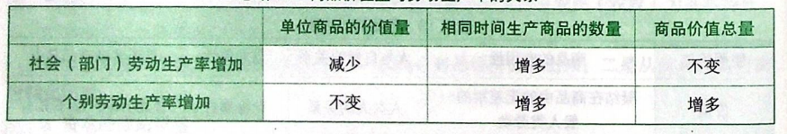

3. 简单劳动与复杂劳动

   简单劳动是指不需要经过专门训练和培养的一般劳动者都能从事的劳动。复杂劳动是指需要经过专门训练和培养，具有一定文化知识和技术专长的劳动者所从事的劳动。

   商品价值量是以简单劳动为尺度计量的，复杂劳动等于自乘的或多倍的简单劳动。

   复杂劳动转化为简单劳动，是在商品交换过程中自发实现的。

### 如何表现价值

> 使用价值不需要表现，它可以直观地被人认识到，但价值是隐藏在商品内部的属性，无法直接看到，因此需要表现。
>
> 商品如果被顺利的交换了，那么它的价值就表现出来了。

商品的价值形式的发展经历了四个阶段：简单的或偶然的价值形式（即1只绵羊=2把石斧，这需要交易双方碰巧都缺少对方拥有的东西）、总和的或扩大的价值形式、一般的价值形式以及货币形式。

货币：在长期交换过程中形成的固定地充当一般等价物的商品（货币只能是金银）。

货币的==五种基本职能==：价值尺度、流通手段、贮藏手段、支付手段和世界货币。其中，价值尺度和流通手段是货币的两个最基本的职能。

- 价值尺度：货币本身的价值可以用来衡量一切商品的价值

  - 原因：货币也是商品，具有价值，可以衡量其它商品的价值
  - 观念上的货币（比如心里想：这辆车值一百万）

- 流通手段：货币作为商品的媒介

  - 必须是现实的货币
  - 可以不足值（货币的价值比商品的价值少一点也可以买到 => 纸币=0价值，纸币不具有价值尺度）

- 贮藏手段：屯金银

- 支付手段：指货币被用来清偿债务或支付赋税、租金、工资

  （流通手段是现货交易，支付手段没有现货交易）

- 世界货币

### 价值有何规律

价值规律的基本内容：商品的价值量由生产商品的社会必要劳动时间决定，商品交换以价值量为基础，按照等价交换的原则进行。

价值规律的表现形式：商品的价格围绕价值自发波动。原因如下：

1. 价格的形成受供求关系变动的影响
2. 价格受币值影响
3. 价格受商品本身价值影响（决定因素）

价值规律的作用：

1. 积极作用：① 自发地调节生产资料和劳动力在社会各生产部门之间的分配比例（哪里有钱赚就往哪里去）；② 自发地刺激社会生产力的发展（率先提高生产率的人就更赚钱）；③ 自发地调节社会收入分配（做得好的越有钱，做得差的越少钱）。

2. 消极作用：① 自发地调节生产资料和劳动力在社会各生产部门之间的配置，可能出现比例失调状况，导致社会资源浪费（这种调节具有盲目性）；② 导致商品生产者的两极分化（富的越富，穷的越穷）；③ 可能导致垄断的发生，阻碍技术的进步（一家独大）。

### 私有制基础上商品经济的基本矛盾

私人劳动和社会劳动的矛盾构成私有制商品经济的基本矛盾。

> 从私有制的角度来看是私有劳动，从社会分工和你要卖出去的角度来看是社会劳动。

私人劳动和社会劳动之间的矛盾在资本主义制度下，进一步发展成资本主义的基本矛盾，即生产资料的资本主义私人占有和生产社会化之间的矛盾，正是这一矛盾的不断运动，才使资本主义制度最终被社会主义制度所代替具有了客观必然性。

### 马克思劳动价值论的意义

马克思劳动价值论的意义：

1. 马克思在继承古典政治经济学劳动创造价值理论的同时，创立了劳动二重性理论。

2. 劳动二重性理论成为理解政治经济学的枢纽。

深化对马克思劳动价值论的认识：

1. 深化对创造价值的劳动的认识，对生产性劳动作出新的界定。

2. 深化对科技人员、经营管理人员在社会生产和价值创造中所起的作用的认识。
3. 深化对科技、知识、信息等新的生产要素在财富和价值创造中的作用的认识。
4. 深化对价值创造与价值分配关系的认识。

## 发达商品经济

### 劳动力成为商品

发达商品经济之所以发达是因为它第一次把劳动力也作为商品。

劳动力指人的劳动能力，是人的体力和脑力的总和。劳动力的使用即劳动。劳动力成为商品，要具备两个基本条件：① 劳动者是自由人，能够把自己的劳动力当作自己的商品来支配；② 劳动者没有别的商品可以出卖，自由得一无所有。

劳动力商品的价值：由生产、发展、维持和延续劳动力所必需的生活必需品的价值决定的（让劳动者明天还有劳动力可以出卖，你就需要给足够的钱让其可以恢复劳动力），包括三个部分：

1. 维持劳动者本人生存所必需的生活资料的价值；
2. 维持劳动者家属的生存所必需的生活资料的价值；
3. 劳动者接受教育和训练所支出的费用。

劳动力价值的构成包含一个历史的和道德的因素（劳动力价值会因为历史和地区的不同而不同）。

劳动力商品的使用价值就是劳动，而劳动可以产生普通商品，而且这些普通商品的价值大于劳动力商品的价值。货币持有者购买劳动力商品，能够产生剩余价值（增殖），则购买劳动力商品的==货币就转化为资本==（即货币不会增殖，资本会增殖）。

### 剩余价值的生产

资本主义生产过程是劳动过程（工人劳动）和价值增殖过程（资本家的越来越多）的统一。

> 什么是剩余价值：
>
> 1. 买面粉：40元；雇佣工人：20元
>
>    让工人工作 4 小时 => 生产并卖出60元包子 => 资本家没赚钱（无剩余价值）
>
> 2. 买面粉：80元；雇佣工人：20元
>
>    让工人工作 8 小时 => 生产并卖出包子120元 => 资本家赚20（20就是剩余价值）

#### 从劳动方面来看

具体劳动的任务是：① 将面粉的价值转移到包子中（将面粉的样子变成包子的样子）；② 生产包子的使用价值（将包子蒸熟使其可以吃）

抽象劳动的任务：消耗了工人的体力和精力，从面粉中产生了新价值，即面粉的80元变成了包子的120元，产生了40的新价值。

#### 从资本方面看

全部预付资本为100元。

1. 买面粉的80元只能借助具体劳动转移到最终产品中，不会产生增殖，因此称为不变资本（记作C）。
2. 雇佣工人的20元，可以通过工人的劳动再创造出来，并且能够增殖，因此称为可变资本（记作V），同时产生剩余价值（记作M）。
3. 剩余价值率M'=M/V，用来衡量剥削程度。

#### 从时间方面看

全天工作8小时。

1. 前4个小时为自己劳动，创造劳动力价值，称之为必有劳动时间；
2. 后4个小时为资本家劳动，创造剩余价值，称之为剩余劳动时间。

#### 三类剩余价值

1. 绝对剩余价值：指必要劳动时间不变的条件下，由于延长工作时间而生产的剩余价值。

2. 相对剩余价值：指再工作时间不变的条件下，通过缩短必要劳动时间而相对延长剩余劳动时间生产的剩余价值。缩短必要劳动时间是==通过提高全社会的劳动生产率==实现的。由于社会劳动生产率的提高，降低了劳动力的价值，从而缩短了必要劳动时间，相对延长了剩余劳动时
   间。全社会劳动生产率的提高是资本家追逐超额剩余价值的结果。

   > 绝对剩余价值和相对剩余价值的相同点和不同点：
   >
   > ① 都延长了剩余劳动时间；
   >
   > ② 绝对剩余价值的生产没有必要劳动时间的缩短，而相对剩余价值有；
   >
   > ③ 对剩余价值的生产没有技术进步，而相对剩余价值有。

3. 超额剩余价值：指企业由于提高劳动生产率而使商品的个别价值低于社会价值的差额。个别企业提高了技术，获得了更多的价值，这就是超额。但由于大家都想超额，因此都纷纷提高技术，使得全社会的劳动生产率都提高了，这时候整个资本家阶级普遍获得相对剩余价值（原本的超额剩余价值就消失了）。可以说，超额是原因，相对是结果。

#### 生产自动化

资本主义条件下的生产自动化是资本家获取超额剩余价值的手段，而雇佣工人的剩余劳动仍然是这种剩余价值的唯一源泉。

错误的观点：生产自动化使得车间不需要工人了，因此没有了剥削。

批判：① 不存在绝对的无人；② 转移了剥削，即剥削转移到了生产自动化机器人的工人身上了。

### 资本的积累

资本的积累就是指把剩余价值转化为资本，或者说剩余价值资本化。

#### 简单再生产和扩大再生产

资本家获得剩余价值后，如果将其全部用于消费，则生产就在原有规模的基础上重复进行， 这叫资本主义简单再生产。资本主义再生产的特点是扩大再生产。资本家将获得剩余价值的一部分转化为资本，使生产在扩大规模上重复进行，这就是资本主义的扩大再生产。在这里，资本积累是资本主义扩大再生产的源泉。

#### 资本积累的本质

资本积累的本质，就是资本家不断利用无偿占有的工人创造的剩余价值，来扩大自己的资本规模，进一步扩大和加强对工人的剥削和统治。

资本积累的源泉是剩余价值。

资本积累规模的大小取决于对工人的剥削程度、劳动生产率的高低、所用资本和所费资本之间的差额（省下来的钱），以及资本家垫付资本的大小（本金）。

随着资本积累和生产规模的扩大，必然加剧社会的两极分化，即一极是财富越来越集中于少数人手中，另一极是多数人只拥有社会财富的较小部分。资本积累不但是社会财富占有两极分化的重要原因，而且是资本主义社会失业现象产生的根源。

#### 资本有机构成

资本的技术构成：由生产的技术水平所决定的生产资料和劳动力之间的比例。

（比如 4kg面粉:1个工人 ）

资本的价值构成：不变资本和可变资本价值之间的比例（记作C:V）。

（比如：4kg面粉的价值:1个工人的价值=80:20）

由资本技术构成决定并反映技术构成变化的资本价值构成，叫作资本的有机构成，通常用c:v来表示。

（如果资本价值构成的变化是由资本技术构成决定的，也即资本价值构成的变化反映了资本技术构成的变化，那么这种资本价值构成就是资本有机构成。如果它们不具备这种关系，则不能称之为资本有机构成。比如由于面粉价格提高了20元，还是买4kg面粉和1个工人，此时资本技术构成没有变化，而资本价值构成变成了100:20，即资本价值构成变化了，但这种变化不能反映资本技术构成的变化，而且这种变化也不是由资本技术构成决定的，那么这种资本价值构成就不是资本有机构成。但如果从原来的买4kg面粉和1个工人变为买8kg面粉和4个工人，则因此而变化的资本价值构成就是资本有机构成）

#### 失业的原因

在资本主义生产过程中，资本有机构成呈现不断提高的趋势。

资本有机构成提高，可变资本相对量减少，资本对劳动力的需求日益相对地减少，结果就不避免地造成大批工人失业，形成==相对过剩人口==。

资本积累是资本主义社会失业现象产生的根源。资本积累的历史趋势是资本主义制度必然灭亡和社会主义必然胜利。

资本积累=>资本有机构成提高=>相对过剩人口（失业）=>贫富差距越大（两级分化）=>资本主义灭亡

### 剩余价值的流转

#### 资本循环的三个阶段

产业资本在循环过程中要经历三个不同阶段，与此相联系的是资本依次执行三种不同职能：

- 第一个阶段是购买阶段，产业资本执行的是货币资本（买面、工人的钱）的职能；

- 第二个阶段是生产阶段，产业资本执 行的是生产资本（面、工人）的职能；

- 第三个阶段是售卖阶段，产业资本执行的是商品资本（包子）的职能。 

产业资本运动的两个基本前提条件：

- 一是产业资本的三种职能形式必须在空间上并存。

- 二是产业资本的三种职能形式必须在时间上继起。

#### 资本的周转规律

资本是在运动中增殖的，资本周而复始、不断反复的循环，就叫资本的周转。

影响每次资本周转快慢的因素有很多，关键的因素有两个：一是资本周转时间；二是生产资本中固定资本（不会因为一次生产就消失，比如车间里的机器）和流动资本（生产一次就消失，比如面粉）的构成。

要加快资本周转速度，获得更多剩余价值，就要缩短资本周转时间，加快==流动资本==的周转速度。

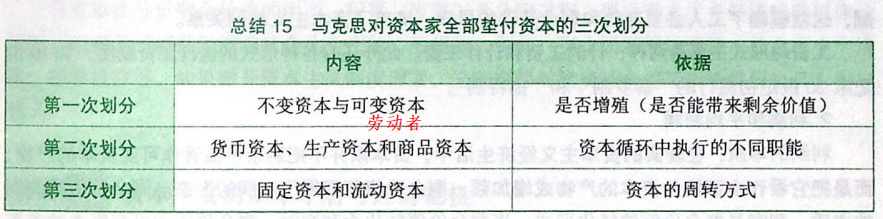

#### 社会再生产的问题

社会再生产的核心问题是社会总产品的实现问题，即社会总产品的价值补偿（生产的东西能卖出去，钱能收回来）和实物补偿（为了以后的生产，需要不断购买原材料）问题。

通过对社会资本简单再生产实现过程中交换关系的分析，可以得出

（第Ⅰ部类是生产生产资料的部门，第Ⅱ部类是生产生活资料的部门。c是不可变资本（对应原材料，即购买生产资料的资本），v是可变资本（可看成是劳动者的饭钱，即购买生活资料的资本），m是剩余价值（可看成是资本家的饭钱））

- Ⅰ(c)是通过第Ⅰ部类内部交换实现的，因为自己本身是生产生产资料的。
- Ⅱ(v+m)是通过第Ⅱ部类内部交换实现的，因为自己本身是生产生活资料的。
- Ⅰ(v+m)是通过和Ⅱ(c)交换实现的，因为所需资料都在对方部门手上。

要求满足Ⅰ(v+m)=Ⅱ(c)，如果两者严重失衡，则会发生经济危机。因此，经济危机的发生，实际上是资本主义条件下以强制的方式解决社会再生产的实现问题的途径。这种强制性地恢复平衡，是以社会经济生活的严重混乱以及社会资源和财富的极大浪费为代价的。

### 剩余价值的分配

#### 资本主义工资的本质和形式

在资本主义制度下，工人工资是劳动力的价值或价格，这是资本主义工资的本质。工资表现为“劳动的价格”或工人全部劳动的报酬，这就模糊了工人必要劳动和剩余劳动的界限，掩盖了资本主义剥削关系（工资没给够）。 

#### 资本家的一些概念

1. 成本价格：不变资本+可变资本（即C+V）
2. 利润r：剩余价值m
3. 平均利润率：不同部门之间如果利润率不同，资本家之间就会展开激烈的竞争，使资本从利润率低的部门转向利润率高的部门， 从而导致利润率趋于平均化，此时的利润率就是平均利润率（这是==行业间==竞争形成的）。
4. 平均利润：按照平均利润率来计算和获得的利润，即成本×平均利润率。
5. 生产价格：即商品的成本价格加平均利润。
6. 超额利润：即超额剩余价值，这是行业内企业间竞争形成的，因此平均利润率不会影响超额利润的存在。

#### 资本家如何瓜分剩余价值

在利润率平均化过程中，产业资本家获得产业利润，商业资本家获得商业利润，银行资本家获得银行利润，农业资本家获得农业利润，土地所有者获得地租。这就是各路资本家按照等量资本获得等量利润原则，瓜分由工人创造的剩余价值。

> 马克思在哲学史上的两大贡献：① 创立了唯物史观；② 形成了辩证法。
>
> 马克思在理论上的两大贡献：① 创立了唯物史观；② 创立了剩余价值理论。

### 资本主义的基本矛盾与经济危机

1. 生产资料资本主义私人占有（生产的东西私人独吞）和生产社会化（生产的过程却分工合作）之间的矛盾，是资本主义的基本矛盾。这是生产力和生产关系之间的矛盾在资本主义社会的具体体现。

2. 生产相对过剩（牛奶往大海里倒）是资本主义经济危机的本质特征。

3. 经济危机的可能是由货币作为支付手段和流通手段引起的（物物交换不会有经济危机）。

4. 资本主义经济危机爆发的根本原因是资本主义的基本矛盾，这种基本矛盾具体表现 为两个方面：

     ① 表现为生产无限扩大的趋势与劳动人民有支付能力的需求相对缩小的矛盾；

     ② 表现为个别企业内部生产的有组织性和整个社会生产的无政府状态（没有人调配生产的度）之间的矛盾。 

5. 经济危机一般包括四个阶段：危机（本质阶段）、萧条、复苏和高涨。

## 资本主义的政治制度

1. 资本主义国家的职能

   资本主义国家的职能是以服务于资本主义制度和资产阶级利益为根本内容的，是资产阶级进行政治统治的工具。资本主义国家的职能包括对内和对外两个基本方面，即对内实行政治统治和社会管理，对外进行国际交往和维护国家安全及利益。

2. 资本主义的民主制度、法制、国家政权

   - 民主制度：“主权在民”、“天赋人权”、“分权制衡”、“社会契约” 、“自由、平等、博爱”

   - 法制：宪法是资本主义国家法律制度的核心，它所依据的基本原则有：私有制原则、“主权在民”原则、分权与制衡原则和人权原则。

   - 国家政权：采取分权制衡的组织形式，即国家的立法权、行政权、司法权分别由三个权力主体独立行使，形成各主体之间的“制衡”。

3. 资本主义政治制度的进步性和局限性
   - 资本主义的民主是金钱操纵下的民主，实际是资产阶级精英统治下的民主。
   - 法律名义上的平等掩盖着事实上的不平等。
   - 资本主义国家的政党制是一种维护资产阶级统治的政治制度，其多党制则是资产阶级选择自己的国家管理者，实现其内部利益平衡的政治机制。
   - 政党恶斗相互掣肘，决策效率低下，激化社会矛盾。

## 垄断资本主义的发展

### 私人垄断资本主义

1. 资本主义发展的两个阶段

   自由竞争资本主义 -> 垄断资本主义两个阶段

   垄断取代自由竞争在资本主义经济中占据统治地位。垄断资本主义的发展包括私人垄断资本主义和国家垄断资本主义两种形式。

2. 垄断的两种手段

   - 生产集中：是指生产资料、劳动力和商品的生产日益集中于少数大企业的过程，其结果是大企业在社会生产中所占的比重不断增加。

   - 资本集中：是指大资本吞并小资本，或由许多小资本合并而成大资本的过程，其结果是越来越多的资本为少数大资本所支配。

3. 垄断的概念和形成

   垄断是指少数资本主义大企业，为了获得高额利润，通过相互协议或联合，对一个或几个部门商品的生产、销售和价格进行操纵与控制。

   垄断形成的原因： ① 获得高额利润； ② 避免两败俱伤； ③ 形成对竞争的限制。

   尽管垄断组织的形式多样，但它们在本质上是一样的，即通过联合实现独占和瓜分商品生产和销售市场，操纵垄断价格，以撰取高额垄断利润。

4. 垄断与竞争

   垄断资本主义阶段存在竞争的主要原因：

   - 垄断没有消除产生竞争的经济条件（私有制）；

   - 垄断必须通过竞争来维持；

   - 不存在由一个垄断组织囊括一切部分、一切社会生产的绝对垄断。

   垄断条件下的竞争同自由竞争（自由竞争是为了获取平均利润）相比，具有一些新特点：

   - 垄断条件下的竞争的主要目的是要获得高额垄断利润，巩固、扩大已有的垄断地位。
   - 不仅采取经济手段还采取非经济手段，使竞争更加复杂、激烈。
   - 竞争的规模扩大，范围遍及各个领域和部门，并由国内扩展到国外。

5. 金融资本与金融寡头

   金融资本：由工业垄断资本和银行垄断资本融合在一起而形成的一种垄断资本。金融资本形成的主要途径包括金融联系（跟银行贷款）、资本参与（让出股份给其它资本参与）和人事参与（其它资本派来人员作为高层）。

   金融寡头：指操纵国民经济命脉，并在实际上控制国家政权的少数垄断资本家或垄断资本家集团。

   金融寡头在经济中的统治，主要是通过“参与制”来实现的；金融寡头在政治上对国家机器的控制，主要是通过同政府的多种途径的“个人联合” （亲自担任或指派代理人担任政府要职）来实现的。

   金融寡头还通过建立政策咨询机构等方式对政府的政策施加影响，并通过掌握新闻科教文化等上层建筑的各个领域来左右和影响国家的内政外交与社会生活。

6. 垄断利润和垄断价格

   垄断利润：垄断资本家凭借其在社会生产和流通中的垄断地位而获得的超过平均利润的高额利润。

   垄断利润的来源：垄断资本所获得的高额利润，归根到底来自无产阶级和其他劳动人民创造的剩余价值。其中包括：

   - 对本国无产阶级和其他劳动人民剥削的加强；
   - 通过控制市场占有其他企业特别是非垄断企业的利润；
   - 通过加强对其他国家劳动人民的剥削和掠夺获取的国外利润；
   - 通过资本主义国家政权进行有利于垄断资本的再分配，从而将劳动人民创造的国民收入的一部分变成垄断资本的收入。

   垄断利润的实现：垄断利润主要是通过垄断组织制定的垄断价格来实现的。

   垄断价格是垄断组织在销售或购买商品时，凭借其垄断地位规定的、旨在保证获取最大限度利润的市场价格。

   垄断价格的计算公式：垄断价格=成本价格+平均利润+垄断利润

   垄断价格包括垄断高价和垄断低价两种形式：

   - 垄断高价是指垄断组织出售商品时规定的高于生产价格的价格；
   - 垄断低价是指垄断组织在购买非垄断企业所生产的原材料等生产资料时规定的低于生产价格的价格。

   垄断价格的产生并没有否定价值规律，它是价值规律在垄断资本主义阶段作用的具体表现。

   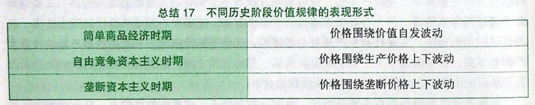

### 国家垄断资本主义

1. 国家垄断资本主义的形成、主要形式及作用

   国家垄断资本主义是国家政权和私人垄断资本融合在一起的垄断资本主义。

   国家垄断资本主义形成的原因：

   - 社会生产力的发展，要求资本主义生产资料在更大范围内被支配，从而促进了国家垄断资本主义的产生（根本原因）；
   - 经济波动和经济危机的深化，要求国家垄断资本主义的产生；
   - 缓和社会矛盾、协调利益关系，也要求国家垄断资本主义的产生。

   国家垄断资本主义的主要形式有五种：

   - 国家所有并直接经营的企业；
   - 国家与私人共有、合营企业；
   - 国家通过多种形式参与私人垄断资本的再生产过程，包括国家向私人垄断企业订货、提供补贴等；
   - ==宏观调节==：主要是国家运用财政政策、货币政策等经济手段，对社会总供求进行调节，以实现经济快速增长、充分就业、物价稳定和国际收支平衡的基本目标；
   - ==微观规制==：主要是国家运用法律手段规范市场秩序，限制垄断，保护竞争，维护社会公众的合法权益。微观规制主要有三种类型：其一是反托拉斯法（即反垄断法）；其二是公共事业规制；其三是社会经济规制。

   对国家垄断资本主义的评价：

   - 国家垄断资本主义是垄断资本主义的新发展，它对资本主义经济的发展产生了积极的作用。
   - 但是，国家垄断资本主义的出现并没有改变垄断资本主义的性质。国家垄断资本主义的出现是资本主义经济制度内的经济关系调整，并没有从根本上消除资本主义的基本矛盾。

2. 金融垄断资本的发展

   金融垄断资本形成的条件：金融自由化与金融创新是金融垄断资本得以形成和壮大的重要制度条件，推动着资本主义经济的金融化程度不断提高。

   - 金融业在国民经济中的地位大幅上升，金融资本在资本主义国家国民生产总值和利润总额中所占的比例越来越大；
   - 随着实体经济的资本利润率下降，面对激烈竞争，实体经济部门不得不把利润的一部分投向金融领域，导致金融资本的急剧膨胀；
   - 制造业就业人数严重减少，以金融为核心的服务业就业人数逐步增加；
   - 虚拟经济越来越脱离实体经济（炒房）。

   金融垄断资本的发展，一方面促进了资本主义的发展，另一方面也造成了经济过度虚拟化，导致金融危机频繁发生，不仅给资本主义经济，也给全球经济带来灾难。

### 国际垄断同盟

1. 垄断资本在世界范围的扩展及其后果

   垄断资本向世界范围扩展的经济动因：

   - 将国内过剩的资本输出，以便在国外谋求高额利润；
   - 将部分非要害技术转移到国外，以取得在别国的垄断优势；
   - 争夺商品销售市场；
   - 确保原材料和能源的可靠来源。

   垄断资本向世界范围扩展的基本形式有三种：借贷资本输出；生产资本输出；商品资本输出。从输出资本的来惩着，主要有两类：一类是私人资本输出；另一类是国家资本输出。

   垄断资本向世界范围扩展的经济社会后果：对于资本输出国来讲是有利的（也有坏处），对资本输入国来讲是一把双刃剑。

2. 垄断资本国际化条件下的垄断组织

   国际垄断同盟在经济上瓜分世界是通过垄断组织间的协议实现的，而协议的订立、瓜分的结果又以经济实力为后盾和基础。

   早期的国际垄断同盟主要是国际卡特尔。

   当代国际垄断同盟的形式以跨国公司和国家垄断资本主义的国际联盟为主。国家垄断资本主义的国际联盟是由一些资本主义国家的政府出面缔结协定所组成的国际经济集团，如西方七国集团、欧盟等。

   第二次世界大战后，从事国际经济协调、维护国际经济秩序的国际性协调组织主要有三个：国际货币基金组织、世界银行和世界贸易组织。

   对国际垄断同盟的评价：垄断资本国际化条件下各种形式的国际垄断组织、国际垄断同盟和国际经济协调机构的发展，在一定程度上促进了经济全球化的发展，但它们从根本上说是为了维护资产阶级的利益、为他们撰取高额垄断利润服务的。

3. 垄断资本主义的基本特征和实质（不重要）

   - 垄断组织在经济生活中起决定作用；
   - 在金融资本的基础上形成金融寡头的统治； 
   - 资本输出有了特别重要的意义； 
   - 瓜分世界的资本家国际垄断同盟已经形成； 
   - 最大资本主义列强已把世界上的领土分割完毕。

4. 垄断的发展过程：私人垄断、国家垄断、国际垄断同盟（早期：卡特尔、当代：国家垄断资本主义的国际联盟）

## 经济全球化

1. 经济全球化的表现

   - 国际分工进一步深化：国际水平分工（以不同加工环节分工）取代国际垂直分工（以不同行业分工）。

   - 贸易全球化：主要指商品和服务。

   - 金融全球化。

   - 企业生产经营全球化。

2. 经济全球化发展的动因
   - 科学技术的进步和生产力的发展（根本的推动力）；
   - 跨国公司的发展；
   - 各国经济体制的变革。
3. 经济全球化的影响
   - 经济全球化的过程是生产社会化程度不断提高的过程。
   - 经济全球化又是一个充满矛盾的过程，它在产生积极效应的同时，也会产生消极的后果。主要表现如下：
     - 发达国家与发展中国家之间的差距进一步扩大；
     - 在经济增长中忽视社会进步、环境恶化与经济全球化有可能同时发生；
     - 各国特别是相对落后国家原有的体制、政府领导能力、社会设施、政策体系、价值观念和文化都面临全球化的冲击，国家内部和国际社会都出现不同程度的治理危机；
     - 经济全球化使各国的产业结构调整变成一种全球行为，它既为一国经济竞争力的提高提供了条件，同时也存在着对别国形成依赖的危险。

## 当代资本主义的变化

1. 生产资料所有制的变化
   - 私人资本所有制
   - 私人股份资本所有制
   - 国家资本所有制
   - 法人资本所有制（股东变成了公司）

2. 劳资关系和分配关系的变化

   职工参与决策、终身雇佣、职工持股

3. 社会阶层和阶级结构的变化

   - 资本家的地位和作用发生了很大的变化，资本所有权和经营权发生分离，拥有所有权的资本家一般不再直接经营和管理企业，而是靠拥有和掌握的企业股票等有价证券的利息收入为生。
   - 高级职业经理（CEO）成为大公司经营活动的实际控制者。
   - 知识型和服务型劳动者的数量不断增加，劳动方式（直播等）发生了新变化。

4. 经济危机呈现出新的特点

   - 去工业化和产业空心化日趋严重（实体经济变弱），产业竞争力下降；

   - 经济高度金融化，虚拟经济与实体经济严重脱节；

     （实体经济越强，抗危机能力越强；虚拟经济越强，抗危机能力越弱）

   - 财政严重债务化，债务危机频繁爆发；

   - 两极分化和社会对立加剧；

   - 经济增长乏力，为展活力不足，周期性危机与结构性危机（有些产业危机，有些产业没事）交织在一起；

   - 金融危机频发，全球经济屡受打击。

5. 政治制度的变化
   - 政治制度出现多元化的趋势，公民权利有所扩大。
   - 法制建设得到重视和加强，以协调社会各阶级、阶层之间的利益。
   - 改良主义政党在政治舞台上的影响日益扩大。

6. 当代资本主义新变化的原因
   - 科学技术革命和生产力的发展，是当代资本主义变化的==根本==推动力量。
   - 工人阶级争取自身权利的斗争，是推动当代资本主义变化的重要力量。
   - 社会主义制度初步显示的优越性对当代资本主义产生了重要影响。
   - 主张改良主义的政党对资本主义制度的改革，也对当代资本主义的变化发挥了重要作用。

7. 当代资本主义新变化的实质

   - 当代资本主义发生的变化从根本上说是人类社会发展一般规律和资本主义经济规律作用的结果。

   - 当代资本主义发生的变化是在资本主义制度基本框架内的变化，并不意味着资本主义生产关系的根本性质发生了变化。

   - 当代资本主义的新变化是深刻的，其意义也是深远的，但是，这些变化并没有触动资本主 义统治的根基，并没有改变资本主义制度的本质，并没有克服资本主义的基本矛盾，也没有改变马克思主义关于资本主义的基本论断的科学性。

8. 2008年国际金融危机以来资本主义的矛盾与冲突

   在这场危机的影响下，西方国家的经济生活、政治生活和民生等各方面都出现了各种问题。第一，经济发展“失调”。第二，政治体制“失灵”。第三，社会融合机制“失效”。这些现象背后的深层次原因和根源，归根结底还在于资本主义制度本身，在于资本主义的基本矛盾。

9. 资本主义的历史地位和发展趋势

   资本主义的内在矛盾决定了资本主义必然被社会主义所代替。

# 科学社会主义

## 社会主义社会

### 空想社会主义

从16世纪初期兴起的社会主义思潮算起，社会主义到现在已经有五百年的历史，其间经历 了从空想到科学、从理想到现实（前两次是飞跃）、从一国到多国的发展，也经历了从苏东剧变到中国特色社会 主义蓬勃兴起的过程。

批判的空想社会主义： 19世纪初期以圣西门、傅立叶、欧文为代表的空想社会主义是科学社会主义的直接思想来源。

空想社会主义的局限性主要表现在：

- 空想社会主义者只看到了资本主义必然灭亡的命运，却未能揭示资本主义必然灭亡的经济根源；
- 他们要求埋葬资本主义，却看不到埋葬资本主义的力量（工人）；
- 他们憧憬取代资本主义的理想社会，却找不到通往理想社会的现实道路（无产阶级革命）。

### 科学社会主义

创立的基础：马克思、恩格斯在新的历史条件下创立了唯物史观和剩余价值学说，从而超越了空想社会主义，创立了科学社会主义。

创立的标志： 1848年2月，马克思、恩格斯为世界上第一个无产阶级政党“共产主义者同盟”所写的党纲《共产党宣言》的发表，标志着科学社会主义的产生。

### 第一国际和巴黎公社

马克思、恩格斯在指导建立无产阶级政党的过程中，阐述了各国无产阶级政党相互关系的重要原则：

- 坚持无产阶级的国际联合。在马克思、恩格斯的指导下，各国工人政党于1864年建立了工人运动的国际联合组织—国际工人协会（“第一国际”）。

- 坚持各国党的独立自主和完全平等。1871年3月18日至5月28日的巴黎工人起义和由此建立起的巴黎公社，是无产阶级革命和无产阶级专政的第一次伟大尝试。

### 十月革命

十月革命是世界历史上划时代的重大事件，产生了深远的历史影响，开启了新纪元：

- 它将马克思主义关于无产阶级革命的理论变为现实，开启了无产阶级革命的新时代，建立了世界上第一个社会主义国家。

- 它沉重打击了帝国主义的统治，鼓舞了资本主义国家的革命运动。

- 它激励了殖民地、半殖民地的民族民主革命，掀起了被压迫民族解放斗争的新高潮。
- 它促进了马克思列宁主义的传播，推进了无产阶级政党的建立。

### 俄国探索

列宁努力把马克思主义基本原理同俄国的具体实际相结合探索出一条适合俄国国情的社会主义道路。这是列宁对马克思主义的重大贡献，也是他留给后人的最宝贵的思想遗产。

苏联模式的基本特征：

- 从经济方面来看，主要是由经济发展战略和经济体制两部分组成。在经济发展战略方面，主要是以高速度发展国民经济为首要任务，以重工业为发展重点，实现从农业国到工业国的转变。与这种发展战略相适应，在经济体制方面，主要是在所有制结构上形成了单一的生产资料公有制形式，在经济运行中排斥市场机制，完全采用行政手段，形成了过度集中的指令性计划经济模式，

- 从政治方面来看，主要表现为过度集权的党和国家领导体制，自上而下的干部任命制，软弱而低效的监督机制等。

### 社会主义首先在经济文化相对落后的国家取得胜利的原因

1. 经济文化相对落后的国家可以先于发达资本主义国家进入社会主义，是由革命的客观形势和条件所决定的。
2. 经济文化相对落后的国家可以先于发达资本主义国家进入社会主义，并不违背生产关系一定要适合生产力状况的规律。
3. 经济文化相对落后的国家率先进入社会主义，也是历史发展规律作用的结果。

## 共产主义社会

### 马克思主义经典作家展望未来社会的科学立场和方法

1. 在揭示人类社会发展一般规律的基础上指明社会发展的方向
2. 在剖析资本主义社会旧世界中阐发未来新世界的特点

2. 在社会主义社会发展中不断深化对未来共产主义社会的认识

3. 立足于揭示未来社会的一般特征，而不对各种细节作具体描绘（重点）

### 共产主义社会的基本特征

1. 物质财富极大丰富，消费资料按需分配

2. 社会关系高度和谐，人们精神境界极大提高

3. 实现每个人自由而全面的发展，人类从必然王国向自由王国的飞跃