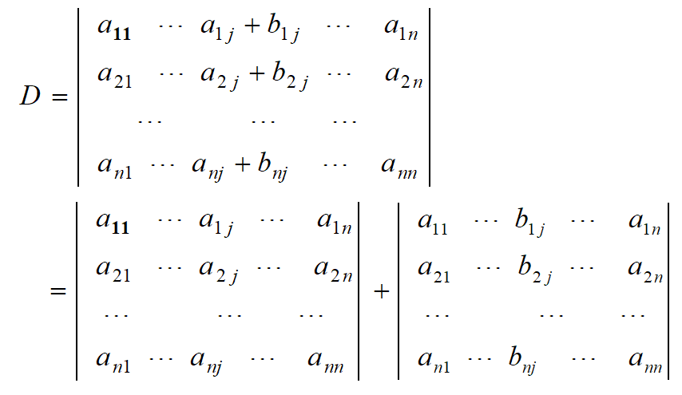
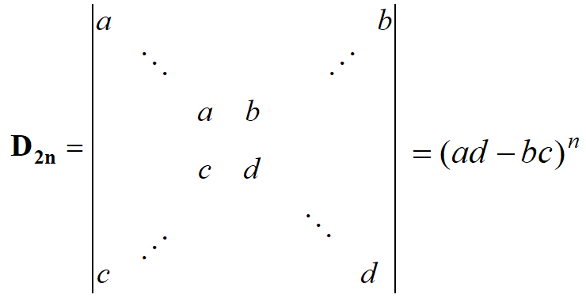

# 行列式

行列式可以看成是一种运算方式或一个数值。

## 基本概念

1. 全排列（也简称排列）：把n个不同的元素排成一列。

2. 排列总数：n个不同元素的所有排列的种数为n!。

3. 标准次序：规定各元素之间只能按某种次序进行排列，比如可规定从小到大为标准次序。

4. 逆序：某一对元素的先后次序与标准次序不同就构成了一个逆序。

5. 逆序数：一个排列中所有逆序的总数就叫这个排列的逆序数。

6. 奇/偶排列：逆序数为奇/偶数的排列叫做奇/偶排列。

7. 逆序数的计算方法：规定从小到大为标准次序，由此计算某一个具有n个元素的排列的逆序数。

   ① 计算每个元素具有的逆序数：如果比元素$p_{i}$大且排在其前面的元素有$t_{i}$个，则称该元素具有的逆序数为$t_{i}$；

   ② 将每个元素具有的逆序数加在一起就是这个排列的逆序数。

8. 对换：将排列中某两个元素对调，其余元素不动，从而形成一个新的排列的方式就叫对换。将相邻元素对换就叫相邻对换。
   - 定理：一个排列中任意两个元素对换，排列改变奇偶性。
   - 推论：奇/偶排列对换成标准排列的对换次数为奇/偶数。
9. 转置行列式：将行列式D沿主对角线进行对称对换得到的新行列式称为D的转置行列式，即原本的行变为列，原本的列变为行。

## 行列式的性质

1. 行列式与它的转置行列式相等。

   推论：行列式的任何性质凡是对行成立的对列也同样成立，反之亦然。

2. 对换行列式的两行（列），行列式变号。

   推论：行列式中有两行（列）完全相同，行列式为0。

3. 行列式某一行（列）所有元素均乘同一个数k，等于用数k乘此行列式。

   推论：行列式某一行（列）所有元素的公因子可以提到行列式记号外面。

4. 行列式中有两行（列）元素成比例，行列式为0。

5. 行列式中某一行（列）的元素都是两数之和，则此行列式可按该行（列）拆为两个行列式之和

     

6. 把行列式某一行（列）的各元素同乘一数，然后加到另一行（列）对应的元素上，行列式不变。

## 行列式的计算

### 一阶行列式

|a| = a

### 二阶行列式

数值 = 对角元素的乘积之差

### 三阶行列式

结果有6项，每1项为（从上往下）对角线上3个元素的乘积，符号由对角线的方向决定，即从左到右为正，从右到左为负。

### n阶行列式

1. 用定义计算：$\sum_{1}^{n!}(-1)^{t}a_{1p_{1}} a_{2p_{2}} ...a_{np_{n}} $，其中$p_{1}p_{2}...p_{n}$为列标排列，t为对应列标排列的逆序数。
2. 利用行列式的性质将行列式化为上/下三角形行列式，从而算得行列式的值。
3. 利用行列式按行（列）展开法则：
   - 余子式和代数余子式：在n阶行列式中，把元素$a_{ij}$所在第i行和第j列去掉后，留下来的n-1阶行列式叫做元素$a_{ij}$的余子式$M_{ij}$。而元素$a_{ij}$的代数余子式为 $A_{ij}=(-1)^{i+j}M_{ij}$ 。
   - 引理：行列式某一行除了$a_{ij}$外其余元素均为0，则此行列式等于该元素$a_{ij}$与其代数余子式的乘积，即$D=a_{ij}A_{ij}$。
   - 定理：行列式等于它的任一行（列）各元素与其对应代数余子式乘积之和。
   - 推论：行列式某一行（列）各元素与另一行（列）对应元素的代数余子式乘积之和等于零。

### 特殊行列式

无特殊声明，对角线均指的是从上到下、从左到右的斜线。

1. 上/下三角形行列式：主对角线以下\上的元素均为0的行列式

   数值 = 主对角线元素的乘积

2. 对角行列式：除主对角线以外的元素都为0的行列式

   数值 = 主对角线元素的乘积
   
3.   

4. n阶反下三角形行列式 = $(-1)^{\frac{1}{2}n(n-1)}·$ 对角元素乘积

5. 范德蒙德行列式 = $\prod_{n≥i>j≥1} (x_{i}-x_{j})$ 

