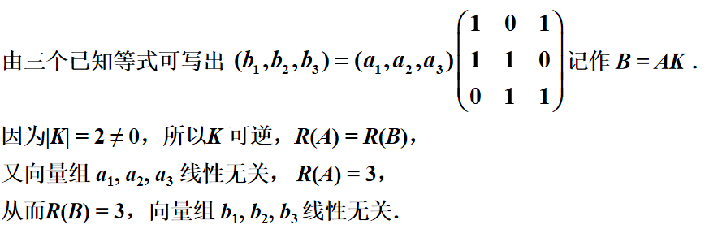
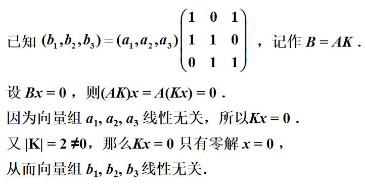
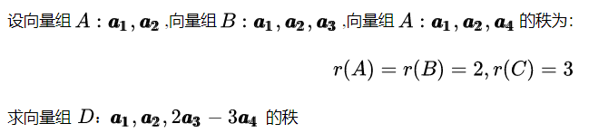
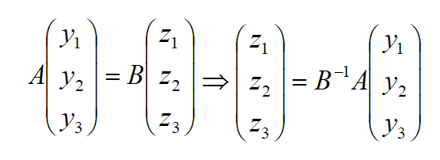

# 向量

## 基本概念

1. 向量指的是仅有一行或一列的矩阵，向量组就是一组向量的集合。

2. 线性组合：向量组$A:a_{1},a_{2},...,a_{n}$的线性表达式$k_{1}a_{1}+k_{2}a_{2}+...+k_{n}a_{n}$称为向量组A的一个线性组合。

## 线性表示

### 什么是线性表示

1. ==对于某一向量b==：若b是向量组A的一个线性组合，即存在一组实数$k_{i}$使得$b=k_{1}a_{1}+k_{2}a_{2}+...+k_{n}a_{n}$，则称向量b能由向量组A线性表示。
2. ==对于某一向量组B==：若B中每一个向量都能由向量组A线性表示，即存在矩阵K使得B=AK或B=KA，则称向量组B能由向量组A线性表示。
- 当B=AK（右乘）时，即有$\left(b_{1}, b_{2}, \cdots, b_{n}\right)=\left(a_{1}, a_{2}, \cdots, a_{l}\right)\left(\begin{array}{cccc}
     k_{11} & k_{12} & \cdots & k_{1 n} \\
     k_{21} & k_{22} & \cdots & k_{2 n} \\
     \vdots & \vdots & & \vdots \\
     k_{l 1} & k_{l 2} & \cdots & k_{l n}
     \end{array}\right)$，则称矩阵B的列向量组能由矩阵A的列向量组线性表示，K为这一表示的系数矩阵。
   - 当B=KA（左乘）时，即有$\left(\begin{array}{c}
     b_{1}^{T} \\
     b_{2}^{T} \\
     \vdots \\
     b_{m}^{T}
     \end{array}\right)=\left(\begin{array}{cccc}
     k_{11} & k_{12} & \cdots & k_{1 l} \\
     k_{21} & k_{22} & \cdots & k_{2 l} \\
     \vdots & \vdots & & \vdots \\
     k_{m 1} & k_{m 2} & \cdots & k_{m l}
     \end{array}\right)\left(\begin{array}{c}
     a_{1}^{T} \\
     a_{2}^{T} \\
     \vdots \\
     a_{l}^{T}
     \end{array}\right)$，则称矩阵B的行向量组能由矩阵A的行向量组线性表示，K为这一表示的系数矩阵。
   
- 向量组等价：向量组之间能相互线性表示，则称它们等价。向量组等价与矩阵等价的关系：
     - 矩阵A和矩阵B行等价，则A的行向量组与B的行向量组等价；
     - 矩阵A和矩阵B列等价，则A的列向量组与B的列向量组等价。
3. 可推广到线性方程组的情况：两个方程组的增广矩阵能互相线性表示（即行向量组等价），则它们之间可以进行互推，且一定同解。

### 线性表示的充要条件

1. 对于某一向量b：向量b能由向量组A线性表示 $\Leftrightarrow$ R(A)=R(A,b)（或对应方程组有解）

2. 对于某一向量组B：向量组B能由向量组A线性表示 $\Leftrightarrow$ R(A)=R(A,B)（或矩阵方程B=AX有解）
   - 向量组A和向量组B等价$\Leftrightarrow$ R(A)=R(B)=R(A,B)（仅仅是R(A)=R(B)不能推出等价）
   - 若向量组B能由向量组A线性表示，则R(B)≤R(A)=R(A,B)

## 线性相关性

1. 定义：给定向量组$A:a_{1}, a_{2}, \ldots, a_{m}$，如果存在不全为零的数${k}_{1}, {k}_{2}, \ldots, {k}_{m}$，使$k_{1} a_{1}+k_{2} a_{2}+\ldots+k_{m} a_{m}=0$（零向量），则称向量组A是线性相关的，否则称它线性无关。

   - ==可推广到线性方程组的情况==：方程组（Ax=b）存在多余方程，则方程组线性相关（即增广矩阵的行向量组线性相关），无多余方程则线性无关。 
   - 两个向量之间存在不同维非零元素，则它们线性无关。
   - 线性无关则系数全为0。

2. 用于判定线性相关性的三个充分必要条件：

   - 向量组A线性相关的充要条件是其中至少有一个向量可表示为其余向量的线性组合（或能由其余向量线性表示）；线性无关的充要条件是其中任何一个向量均不能表示为其余向量的线性组合（或均不能由其余向量线性表示）。

   - 向量组A线性相关的充要条件是Ax=0有非零解；线性无关的充要条件是Ax=0仅有零解。
   - 向量组A线性相关的充要条件是R(A)<向量个数；线性无关的充要条件是R(A)=向量个数。

3. 用于判定线性相关性的其它结论：

   - 小相关 => 大相关；大无关 => 小无关。

   - 维数小于个数：m个n维向量组成山向量组，当维数n小于向量个数m时一定线性相关。特别地，n+1个n维向量一定线性相关。

     （即没有足够多的方程可以解出所有解，也就是说有无限多解，这时候就是线性相关）

   - 设向量组$ A: a_{1}, a_{2}, \ldots, a_{m}  $线性无关，而向量组$B: a_{1}   a_{2}, \ldots, a_{m}, b $线性相关，则向量b必能由向量组A线性表示，且表示式唯一。

3. ==经典问题==：

   例题1：已知向量组$a_{1}, a_{2}, a_{3}$线性无关，且$b_{1}=a_{1}+a_{2},b_{2}=a_{2}+a_{3},b_{3}=a_{3}+a_{1}$，试证明向量组$b_{1}, b_{2}, b_{3}$线性无关。

   - 常规解法：定义+逆推。首先写出向量组$b_{1}, b_{2}, b_{3}$线性无关的定义式，然后将三个等式代入式中转化为向量组$a_{1}, a_{2}, a_{3}$线性无关的式子，解出未知系数即可。

   - 解法2。转化为矩阵的秩的问题：

        

   - 解法3。转化为齐次线性方程组的问题：
   
       
   
   例题2： 

## 向量组的秩

1. 定义：向量组A的最大线性无关向量组（即最大无关组）所含向量个数称为向量组A的秩。仅含零向量的向量组没有最大无关组，规定它的秩为0。
   - 向量组的最大无关组与矩阵的最高阶非零子式相对应。
   - 向量组与其最大无关组等价；能与向量组自身等价的线性无关部分组必定是最大无关组。
2. 最大无关组的判定：凡是满足（①本身线性无关；②能线性表示向量组的任一向量）的部分组必定是向量组的最大无关组。
3. 向量组的秩的判定：矩阵的秩等于它的列向量组的秩，也等于它的行向量组的秩。
4. 求解最大无关组的方法：若$D_{r}$是矩阵A的一个最高阶非零子式，则D所在r列是A的列向量组的一个最大无关组，D所在r行是A的行向量组的一个最大无关组。

## 线性方程组的解的结构

### 基础解系

线性方程组的解集的最大无关组称为该线性方程组的基础解系（不唯一）

### 齐次线性方程组

#### 解的性质

1. 性质1：若$x=\xi_{1},x=\xi_{2}$是齐次线性方程组$Ax=0$的解，则$x=\xi_{1}+\xi_{2}$也是$  A x=0  $的解。
2. 性质2：若$x=\xi  $是齐次线性方程组$  A x=0  $的解，k为实数，则$x=k\xi$也是$  A x=0  $的解。
3. 结论：若$ x=\xi_{1}, x=\xi_{2}, \ldots,, x=\xi_{t} $是齐次线性方程组$A x=0$的解， 则$x=k_{1} \xi_{1}+k_{2} \xi_{2}+\ldots+k_{t} \xi_{t}$也是$  A x=0  $的解。

4. 定理：设m×n矩阵的秩R(A)=r，则n元齐次线性方程组Ax=0的解集的秩为n−r（一个自由变量产生一个线性无关的解向量）。
5. 由基础解系的定义和以上性质可知，齐次线性方程组的通解=基础解系的各解向量与任意实数的乘积之和。

#### 如何求基础解系

题不难，参考相关例题即可。

（注意：自由变量的选取不一定总是前几个变量，也可以令前几个变量为自由变量，从而得到不同的基础解系）

1. 先求通解，再化为基础解系
2. 直接求基础解系，再求通解

### 非齐次齐次线性方程组

#### 解的性质

1. 性质3：若$ x=\eta_{1},x=\eta_{2}$是非齐次线性方程组$A x=b$的解，则$x=\eta_{1}-\eta_{2}$是对应齐次线性方程组$A x=0$的解。
2. 性质4：若$x=\eta  $是非齐次线性方程组$  A x=b  $的解，$x=\xi  $是对应齐次线性方程组$A x=0$的解，则$x=\xi+\eta $仍是$Ax=b$的解。

3. 由基础解系的定义和以上性质可知，非齐次线性方程组的通解=对应齐次线性方程组的通解+非齐次方程的一个特解。

#### 如何求基础解系

先求出特解（取变量为特殊值解得其中一个解向量即可），再求出对应齐次线性方程组的通解，组合起来便是非齐次齐次线性方程组的基础解系。

# 向量空间

## 基本概念

1. 向量空间：向量空间就是向量的集合，且要求集合非空以及对于集合内的向量的加法和数乘两种运算封闭。
2. 解空间：由线性方程组的解集构成的向量空间。
3. 子空间：由某个向量集合的子集构成向量空间。
4. 向量空间的基：对于某个向量空间，若存在某个向量组满足① 组内向量线性无关；② 能线性表示向量空间的任一向量，则该向量组就是向量空间的一个基，并称向量组的向量个数为向量空间的维数。
   - 如果向量空间没有基，则维数为0。0维空间仅含一个零向量。
   - 如果将向量空间看成向量组，则基就是最大无关组，维数就是秩。
   - 向量空间可以由基$a_{1},a_{2},...a_{r}$表示为$V=\{x=\lambda_{1}a_{1}+\lambda_{2}a_{2}+...+\lambda_{r}a_{r}|\lambda_{1},\lambda_{2},...,\lambda_{r}\in R\}$，其中$\lambda_{1},\lambda_{2},...,\lambda_{r}$称为对应向量在该基中的坐标。
   -  自然基是指由某一维为1其余维都为0的向量组成的一组基。

## 相关问题

1. 证明题给向量组是向量空间的一个基：只须证其是最大无关组

   ① 证明它的秩等于维数

   ② 证明向量组与E等价

2. 求向量b在某个基A上的坐标：建立方程b=Ax，解出的x即是坐标

3. 求基变换公式或过渡矩阵：求解矩阵方程$B=AX$即可

4. 求坐标变换公式： 