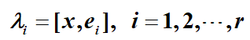
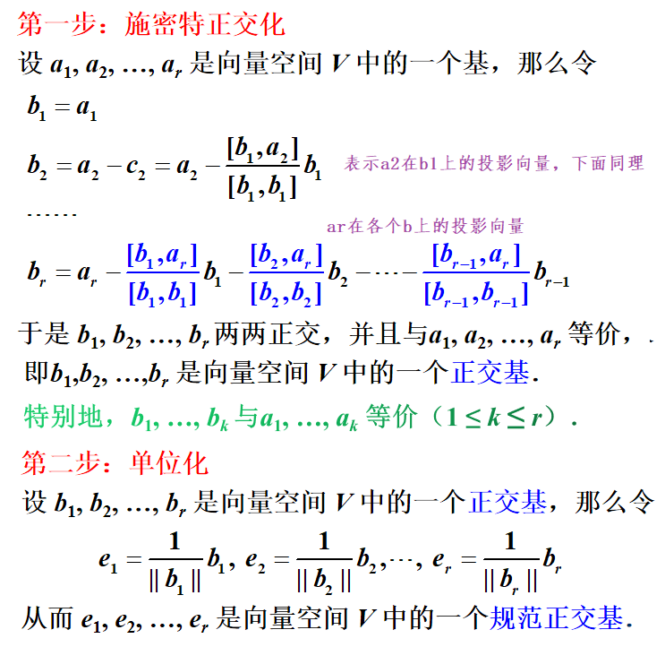
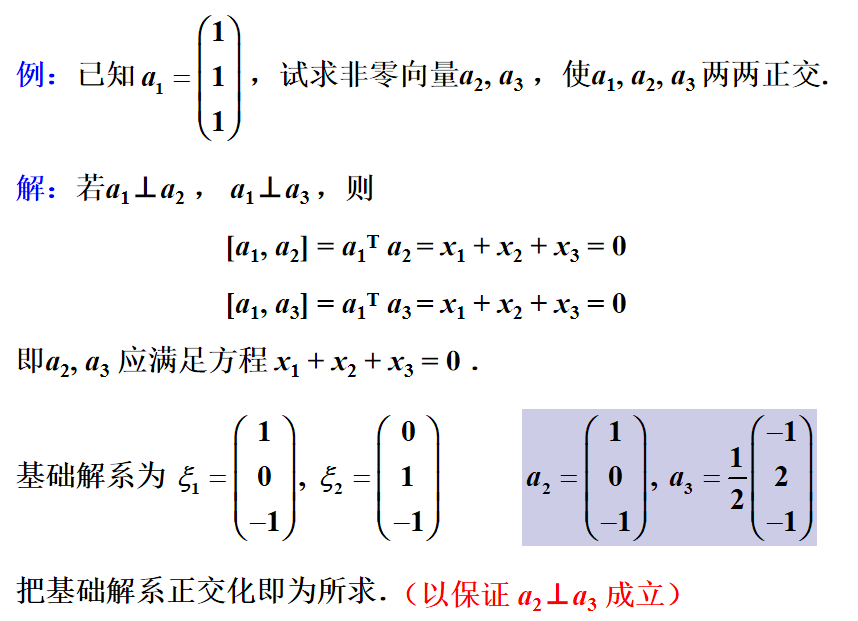
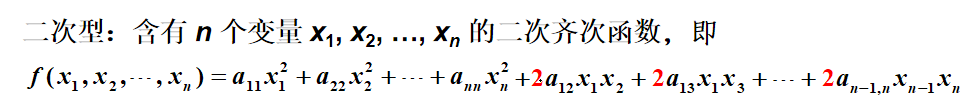
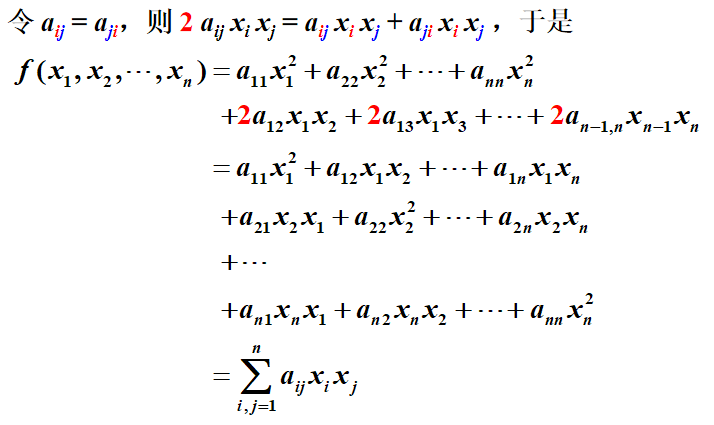
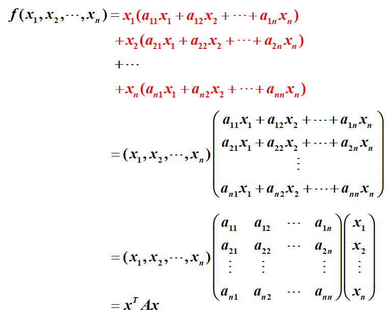
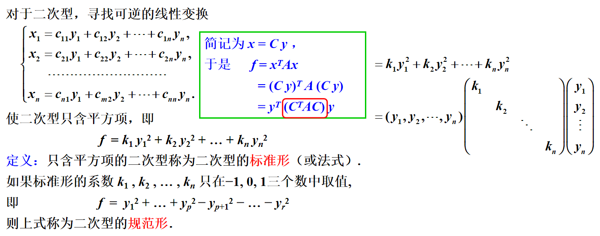
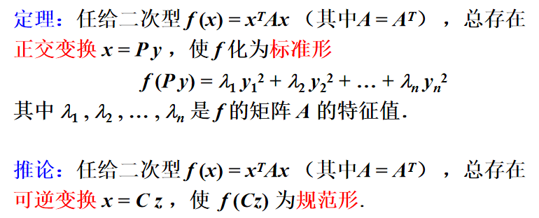
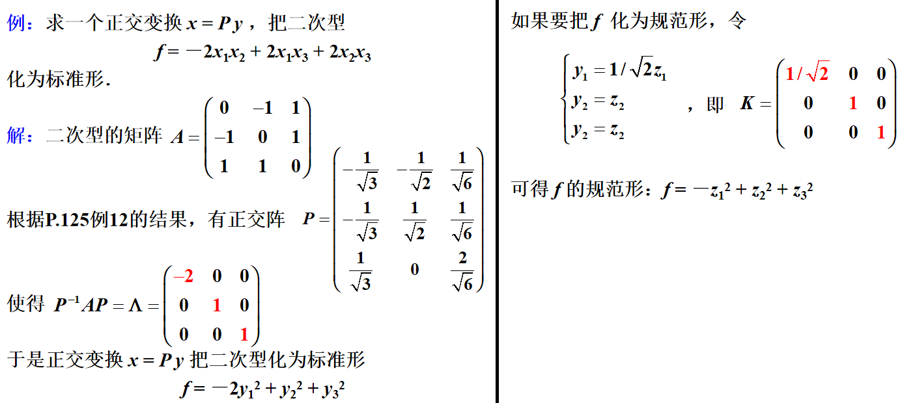
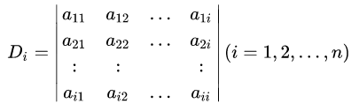

# 向量的相关特性

1. 内积：向量x和y的对应元素乘积之和称为它们的内积，记作$[x,y]=x^{T}y$（设x和y都是列向量）
   - [x, y] = [y, x]
   - $[\lambda x, y]=\lambda[x, y]$ 
   - [x + y, z] = [x, z] + [y, z] 
   - 当$x=0$时，$[x, x]=0$；当$x \neq 0$时，$[x, x]>0$ 
   - $[x, y]^{2} \leq[x, x][y, y]$ 
2. 长度（范数）：$||x||=\sqrt{[x, x]}=\sqrt{x_{1}^{2}+x_{2}^{2}+\cdots+x_{n}^{2}}$
   - 非负性：$||x||≥0$；齐次性：$\|\lambda x\|=|\lambda| \cdot\|x\|$；三角不等式：$|| x + y || ≤ || x || + || y ||$ 
   - 单位向量：$||x||=1$ 
   - 单位化：$x=\frac{a}{||a||}$
3. 夹角：$\theta=\arccos \frac{[x, y]}{\|x\| \cdot\|y\|}$
   - 当$ [x, y] = 0$，称向量x和y正交
   - 若 x = 0，则x与任何向量都正交
   - 正交向量组：两两正交的非零向量组成的向量组
   - 定理：若n维向量$a_{1}, a_{2}, \ldots, a_{r}$是一组两两正交的非零向量， 则$a_{1}, a_{2}, \ldots, a_{r}$线性无关
   - 问题：求与两个正交向量正交的第三个向量

# 向量特性的应用

## 标准正交基

向量空间的一个基$e_{1},e_{2},...,e_{r}$满足两两正交且都是单位向量，则称该基为标准正交基。

1. **向量在标准正交基中的坐标**： 

2. **标准正交化**：

   ① $\frac{\left[b, a\right]}{\left[b, b\right]}b$表示a在b上的投影向量；

   ② a减去了在哪些向量上的投影向量，就与哪些向量正交。

     

3. 标准正交化的应用：

   ① 求标准正交基；

   ② 已知某一向量a，求多个向量使得这多个向量和a两两正交。

      

## 正交矩阵

如果n阶矩阵 A 满足$A^{\mathrm{T}} A=E$，即$  A^{-1}=A^{\mathrm{T}}  $，则称矩阵A为正交矩阵。

1. 正交矩阵的一些性质：

   - 矩阵A为正交矩阵的充要条件：A的列向量（或行向量）都是单位向量且两两正交。

   - n阶正交矩阵A的n个列向量（或行向量）构成n维向量空间的一个标准正交基。
   - 若A是正交阵，则$A^{-1}=A^{T}$也是正交阵，且|A| = 1 或 －1。
   - 若A和B是正交阵，则 AB 也是正交阵。

2. 正交变换：若 P 是正交阵，则线性变换 y = Px 称为正交变换。

   - 经过正交变换，线段的长度保持不变（从而三角形的形状保持不变）。

# 方阵的特征值与特征向量

## 基本概念

1. 特征值、特征向量

   若n阶矩阵A满足关系式 $Ax=\lambda x$（也可以写成 $(A-\lambda E)x=0$ ），则实数$\lambda$称为A的特征值，而非零向量x称为A对应于特征值$\lambda$的特征向量。

2. 特征方程、特征多项式

   上述关系式（或齐次线性方程组）有非零解的充要条件是 $|A-\lambda E|=0$ 。其中，$|A-\lambda E|=0$ 叫做A的特征方程，$|A-\lambda E|$ 叫做A的特征多项式（n次多项式）。

3. 特征值的性质：

   - A的特征值就是特征方程的解，且特征方程在复数范围必定有n个解（重根按重数计算），即n阶矩阵有n个特征值。

   - 设n阶矩阵A的特征值为$\lambda_{1}, \lambda_{2}, \ldots, \lambda_{n}$，则：

     ① $\lambda_{1}+\lambda_{2}+\ldots+\lambda_{n}=a_{11}+a_{22}+\ldots+a_{nn}$（对角元之和）
     ② $\lambda_{1} \lambda_{2} \ldots \lambda_{n}=|A|$ 

   - 矩阵可逆的充要条件是它的特征值全不为0。

   - 若$\lambda$是A的特征值且非零向量p是A对应于特征值$\lambda$的特征向量，则：

     ① $\lambda^{k}$是$A^{k} $的特征值，对应的特征向量也是p；

     ② 当A可逆时，$1/\lambda$是$A^{−1 }$的特征值，对应的特征向量仍是p；

     ③ $\varphi(\lambda)=a_{0}+a_{1} \lambda+\ldots+a_{m} \lambda^{m}$是矩阵多项式$\varphi(A)=a_{0}+a_{1} A+\ldots+a_{m} A^{m}$的特征值。

   - 设$\lambda_{1}, \lambda_{2}, \ldots, \lambda_{m}$是方阵A的特征值，$p_{1}, p_{2}, \ldots, p_{m}$是依次与之对应的特征向量，如果$\lambda, \lambda, ..., \lambda $各不相同，则$p_{1}, p_{2}, \ldots, p_{m}$线性无关。
- 对应于两个不同特征值的线性无关的特征向量组，合起来仍是线性无关的。
   - 分别对应于两个不同特征值的两个特征向量，其和不是特征向量。
   
4. 相关问题：

   ① 求特征值和特征向量：先后解特征方程和方程组$(A-\lambda E)x=0$即可

   ② 求矩阵多项式的特征值

## 相似矩阵

1. 相似矩阵的定义:

   设A,B都是n阶矩阵，若有可逆矩阵P满足$P^{-1} A P=B$，则称B为矩阵A的相似矩阵，或称矩阵A和B相似， 记作$  A \sim B $。对  A  进行运算${P}^{-1}{A P}  $称为对A进行相似变换，称可逆矩阵P为把A变成B的相似变换矩阵。

2. 相似矩阵的性质：

   - 相似性是一种等价关系，但等价不一定相似。

   - ==若n阶矩阵A和B相似，则A和B的特征多项式相同，从而A和B的特征值也相同。==

     （特征多项式相同的两个矩阵不一定相似）

   - ==若n阶矩阵A和B相似，则A的多项式$\varphi (A)$和B的多项式$\varphi (B) $相似。==

   - 若n阶矩阵A和对角矩阵$\Lambda $相似，则$\Lambda $的n个对角元素是A的n个特征值。

     （对角矩阵的特征值就是对角元素）
     
   - $A\sim B =>A=P^{-1}BP=>P^{-1}B^{-1}PA=E=>A^{-1}\sim B^{-1}$

## 矩阵对角化

1. 矩阵对角化：寻求相似变换矩阵P，使$P^{-1} A P=\Lambda$为对角矩阵，则称为把矩阵A对角化。

   - n阶矩阵A能对角化的充要条件是A有n个线性无关的特征向量。
   - 若n阶矩阵A有n个不同的特征值，则A能对角化。

   - 如何求n阶矩阵A的对角矩阵和相应的变换矩阵：

     ① 求出矩阵A的n个不同的特征值（即为对角矩阵的对角元）

     ② 求出n个特征值对应的n个特征向量（它们的组合即是变换矩阵，并且各特征向量的排列次序应与对角矩阵的对角元的排列次序一致）

     ③ 如果矩阵A存在重复的m个特征值，此时特征方程的系数矩阵的秩必须等于n-m，这样这m个特征值才能产生m个线性无关的解向量，矩阵A才能对角化。

2. 对称矩阵的对角化：

   - 对称矩阵A（即满足$A^{T}=A$）的性质：

     - 对称矩阵的特征值为实数，对应的特征向量也是实向量。

     - 对称矩阵的两个不同的特征值对应的特征向量正交。

     - n阶对称矩阵必存在==正交矩阵P==，使$P^{-1} A P=P^{T} A P=\Lambda$，其中$\Lambda$是以A的n个特征值为对角元的对角矩阵。

       （正交矩阵P满足：$P^{T}=P^{-1}$）

     - 设A为n阶对称矩阵，$\lambda$是A的特征方程的k重根，则矩阵$A-\lambda E$的秩等于n-k，即对应特征值$\lambda$恰有k个线性无关的特征向量。

     - ==设A为n阶对称矩阵，则A的n个特征向量必线性无关，故A必可对角化。== 

   - 对称矩阵A的对角化步骤：

     ① 求出特征值，这n个特征值必定构成对角矩阵$\Lambda$；

     ② 对于每个不同的k重特征值，求出k个线性无关的特征向量，并将它们正交化和单位化。

     ③ 将每个不同的特征值对应的正交特征向量组按对角元的次序排好，则构成了矩阵A的正交变换矩阵P，使得$P^{-1} A P=P^{T} A P=\Lambda$。

3. 对角化的应用：可以用于快速求出矩阵A的n次幂和多项式。

# 二次型

## 二次型的定义

1. 二次型的定义：

    

2.  进一步化简：

    

3. 利用矩阵进一步化简：

     

   （其中A为对称矩阵，即任给一个二次型，就唯一确定一个对称矩阵，反之亦然）

## 二次型的目的

 

> 什么是合同？
>
> 设A,B都是n阶矩阵，若有可逆矩阵C满足$C^{T}AC = B $，则称矩阵A和B合同，有以下性质：
>
> ① 若A为对称矩阵，则B也为对称矩阵；② R(A)=R(B)。

总结：将二次型化为标准形就是寻求矩阵A的一个合同矩阵$C^{T}AC$，且该矩阵为对角矩阵（这个过程叫合同对角化，其中C是一个正交矩阵）。据此，有以下定理和推论：

  

## 化为标准形的例子

（标准二次型的项数等于矩阵A的秩）

① 求出对称矩阵A的特征值和特征向量

② 将特征向量正交单位化之后便是所需要的正交变换矩阵

③ 特征值对应的就是标准形的系数

除此之外，还可以使用配方法将二次型化为标准型，请看书本例题P135。

## 正定二次型

### 正定相关的概念

惯性定理：在二次型的任何标准形中正系数的个数不变。

正/负惯性指数：指的是二次型的标准形的正/负系数的个数。

正/负定二次型：设$f(x)=x^{T}Ax$，如果对于任意x≠0，都有f(x)>0，则称f是正定二次型，并称对称矩阵A为正定的；若f(x)<0，则称f是负定二次型，并称A为负定的。

### 正定的判定方法

1. 定义判定法：

   n元二次型$f(x)=x^{T}Ax$为正定的充要条件：它的标准形的n个系数均为正，即它的规范形的n个系数均为1，也即它的正惯性指数为n。

2. 特征值判定法：

   对称矩阵A为正定的充要条件：A的特征值均为正。

3. 主子式判定法：

   ① 对称矩阵A为正定的充要条件：A的各阶主子式均为正；

   ②对称矩阵A为负定的充要条件：A的奇数阶主子式均为负，偶数阶主子式均为正。

> 主子式是指主对角线元素是原n阶行列式的主对角线元素的一部分的行列式。
>
> 上述用于判定的主子式可取顺序主子式，即
>
>  