# 矩阵的初等变换

## 矩阵的初等变换

1. 初等行/列变换：统称为初等变换

   - 对换两行/列
   - 以数k≠0乘某一行/列的所有元
   - 把某一行所有元的k倍加到另一行对应的元上去

2. 行/列等价：矩阵A经有限次初等行/列变换变成矩阵B，则称A和B行/列等价，记作$A\overset{r}{\sim }B/A\overset{c}{\sim }B$；矩阵A经有限次初等变换变成矩阵B，则称A和B等价，记作$A\sim B$。

   - 反身性：$A\sim A$
   - 对称性：$A\sim B\Leftrightarrow B\sim A$
   - 传递性：$A\sim B,B\sim C\Rightarrow A\sim C$

3. 行阶梯形矩阵和行最简形矩阵

   - 任何非零矩阵总可经有限次初等行变换变为行阶梯形矩阵和行最简形矩阵。
   - 要解线性方程组，只需将增广矩阵化为行最简形矩阵。
   - 一个矩阵的行最简形矩阵是唯一确定的（行阶梯形矩阵的非零行行数也是唯一确定的）。
   - 行最简形矩阵在经过初等列变换可以化为标准形矩阵（左上角为单位矩阵，其它元素均为零）。

    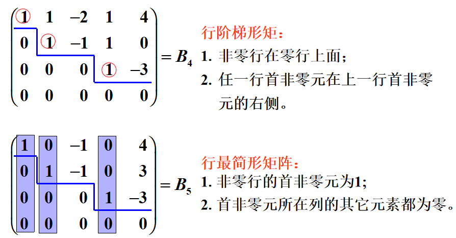 

## 初等变换与矩阵乘法的关系

矩阵的初等变换本质上是矩阵乘法在形式上的拓展和在过程上的分解。它将矩阵乘法的运算过程完全集中在矩阵内部进行，且把矩阵乘法的复杂过程细分为操作更简单的几个步骤来完成。

1. 初等矩阵：由单位矩阵E经过一次初等变换得到的矩阵称为初等矩阵。三种初等变换对应着三种初等矩阵：

   - E(i, j) ：对换单位阵的第i和j行（列）
     - 左乘矩阵A：相当于对A施加一次初等行变，即把A的第i和j行对换
     - 右乘矩阵A：相当于对A施加一次初等列变，即把A的第i和j列对换

   - E(i(k))：以数k≠0乘单位阵第i行（列）
     - 左乘矩阵A：相当于对A施加一次初等行变，即以数k乘A的第i行
     - 右乘矩阵A：相当于对A施加一次初等列变，即以数k乘A的第i列

   - E(ij(k))：以k乘单位矩阵的第j行加到第i行上，或以k乘单位矩阵的第i列加到第j列上
     - 左乘矩阵A：相当于对A施加一次初等行变，即以k乘A的第j行加到第i行上
     - 右乘矩阵A：相当于对A施加一次初等列变，即以k乘A的第i列加到第j列上

2. 由初等矩阵推断出来的一些结论和定理：

   - 初等矩阵的两个性质：
     - 设A是一个m×n矩阵，对A施行一次初等行变换，相当于以相应的m阶初等矩阵左乘A；对A施行一次初等列变换，相当于以相应的n阶初等矩阵右乘A。
     - 方阵A可逆的充要条件是存在有限个初等矩阵$P_{1},P_{2},...,P_{l}$，使$A=P_{1}P_{2}...P_{l}$。

   - 基本定理：设A与B都是m×n矩阵，那么

     ① $A\overset{r}{\sim }B$的充要条件是存在m阶可逆矩阵P，使得PA=B；

     ② $A\overset{c}{\sim }B$的充要条件是存在n阶可逆矩阵Q，使得AQ=B；

     ③ $A\sim B$的充要条件是存在m阶可逆矩阵P及n阶可逆矩阵Q，使得PAQ=B。

   - 基本定理的推论：

     - 初等矩阵都是可逆矩阵，且其逆矩阵是同类型的初等矩阵：

        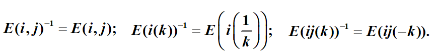  

     - 方阵A可逆的充要条件是$A\overset{r}{\sim }E$。

## 初等变换的应用

将矩阵(A:C)中的子块A通过初等行变换变为B，就相当于C左乘一个将A变成B的可逆矩阵P，即P(A:C)=(PA:PC)=(B:PC)。对于初等列变换也是同理，只不过是上下分块且为右乘。

1. 已知矩阵A和B，求可逆矩阵P，使得PA=B：

   分析：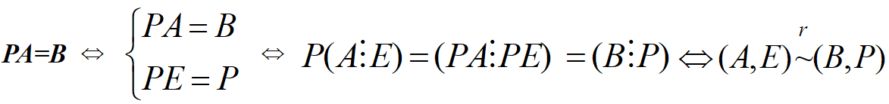 

2. 求可逆矩阵A的逆矩阵：

    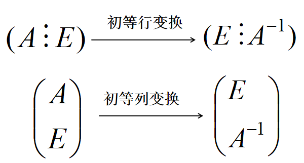 

3. 求 $A^{-1}B$ ：

    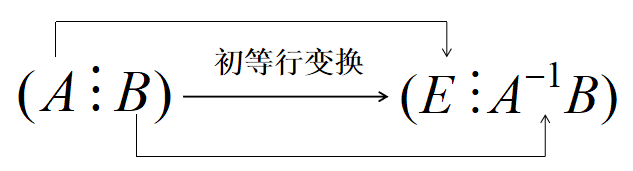 

4. 求 $CA^{-1}$ ：

    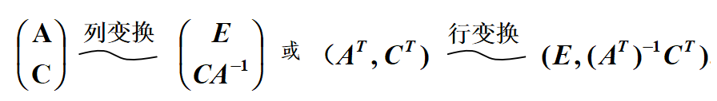 

5. 求解线性方程组：将增广矩阵化为行最简形矩阵即可。

## 矩阵的秩

1. k阶子式：任取矩阵k行k列并保持位置次序而得到的k阶行列式称为矩阵的k阶子式。

2. 矩阵的秩：矩阵的非零子式的最高阶数r称为矩阵的秩，并规定零矩阵的秩为0。

   - 矩阵≥r+1阶的所有子式均等于0
   - 转置矩阵的秩与原矩阵相等
   - 可逆矩阵的秩等于矩阵的阶数（满秩矩阵）；非可逆矩阵的秩小于矩阵的阶数（降秩矩阵）
   - 初等变换不改变矩阵的秩：① 若A~B，则R(A)=R(B)；②若P、Q可逆，则R(PAQ)=R(A)
   - $0≤R(A_{m×n})≤min\{m,n\}$ 
   - $max\{R(A),R(B)\}≤R(A,B)≤R(A)+R(B)$；$R(A)≤R(A,b)≤R(A)+1$ 
   - $R(A+B)≤R(A)+R(B) $
   - $R(AB)≤min\{R(A),R(B)\}$ 
   - 若$A_{m×n}B_{n×l}=O$，则$R(A)+R(B)≤n$ 
   - 设AB=C，若A为列满秩矩阵，则R(B)=R(C)
   - $R(A)=0\Leftrightarrow A=O$
   
3. 矩阵的秩的计算方法：

   ① 行阶梯形矩阵的秩等于其非零行的行数，因此可以通过将矩阵转化为行阶梯形矩阵来求矩阵的秩。

   ② 夹逼准则：若存在不为0的k阶子式，并且k+1阶子式均为0，则矩阵的秩等于k。

## 线性方程组的解

用矩阵的秩讨论线性方程组的解的情况，有如下定理：

- 对于n元非齐次线性方程组$Ax = b$ ：

  ① 无解的充分必要条件是$R(A)<R(A, b) $；

  ② 有唯一解的充分必要条件是$R(A)=R(A, b)=n $；

  ③ 有无限多解的充分必要条件是$R(A)=R(A, b)<n$ 。

- 对于n 元齐次线性方程组$Ax = 0$：

  ② 有唯一零解的充分必要条件是$R(A)=n$ ；

  ③ 有无限多解的充分必要条件是$R(A)<n $ 。

> 1. 线性方程组AX=b有解的充要条件时R(A)=R(A,b)；矩阵方程AX=B有解的充要条件时R(A)=R(A,B)
>
> 2. 当线性方程组有无限多解时，如何写出通解的形式：
>
>       设增广矩阵的秩为R，则R非零行的首非零元对应的未知数取作非自由未知数，其余n-R个未知数取作自由未知数，并令自由未知数等于$c_{1},c_{2}...$，由增广矩阵的行最简形矩阵即可写出含n-R个参数的通解。
>
> 3. 有唯一解 => |A|≠0

### 相关问题

1. **根据参数取值讨论方程组解的情况**：

    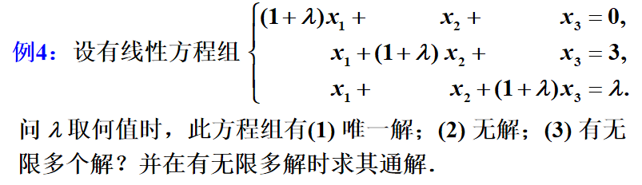  

   解法1：化为行最简矩阵，然后根据解的定理进行分类讨论。

   解法2：先从唯一解入手，然后根据非唯一解的取值情况来讨论其它解即可。

    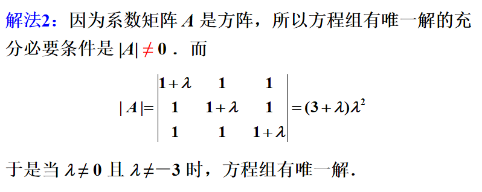 

    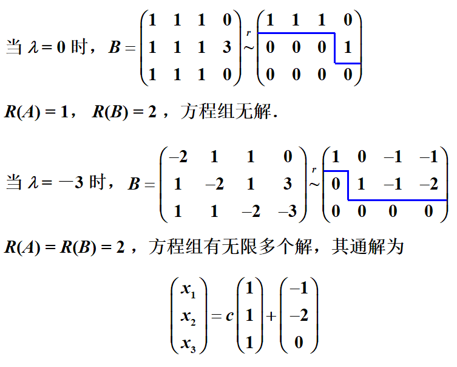 

   > **注意**：
   >
   >  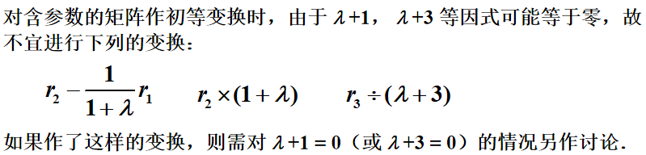 

2. **求解线性方程组的流程**：

    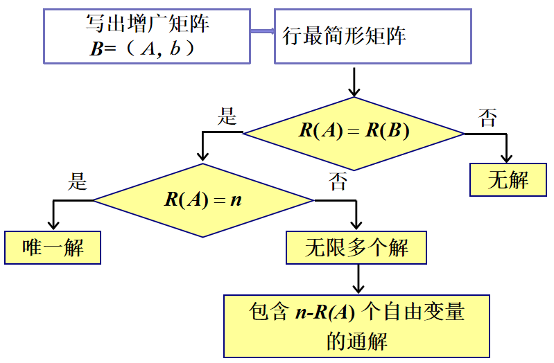 

