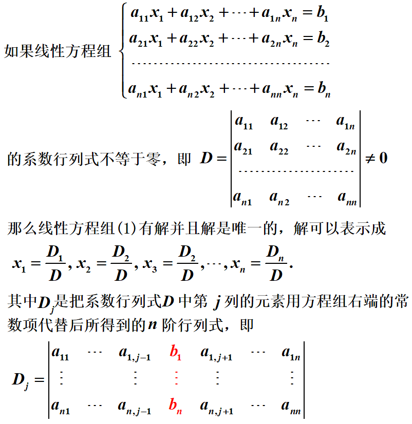
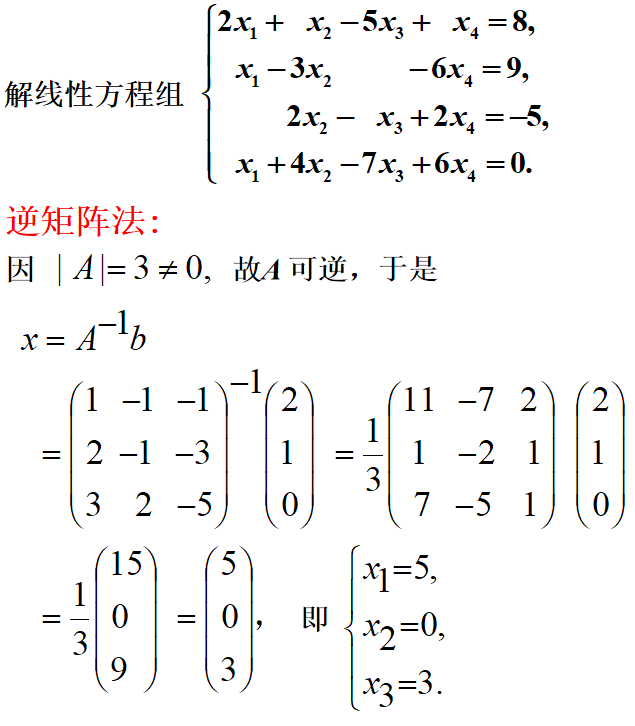
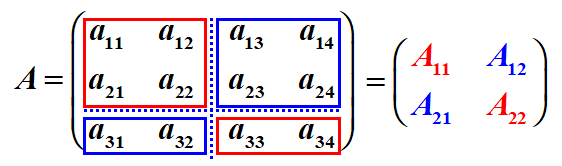
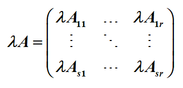
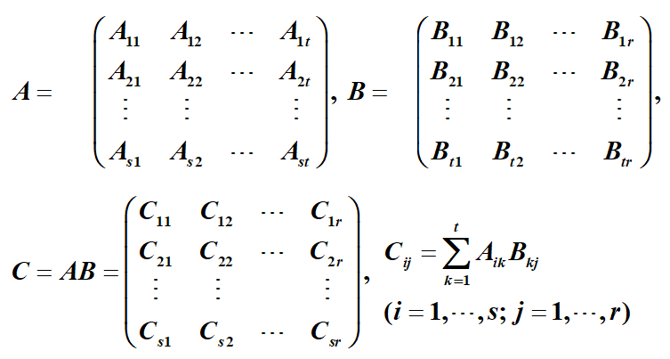
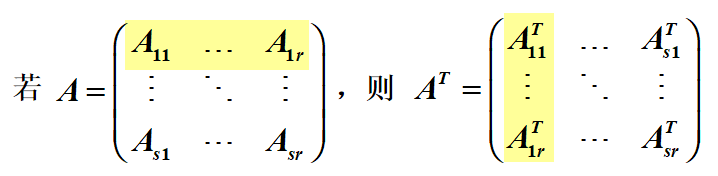
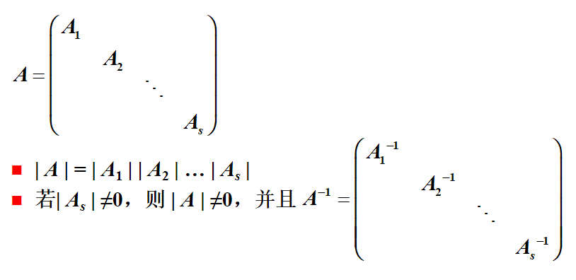
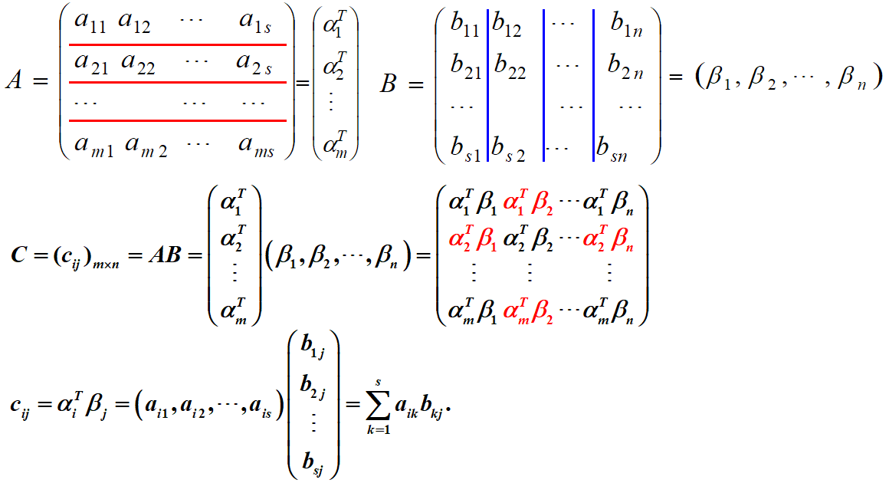

# 矩阵

矩阵是一种数集的表示方式，它的本意是用来表示线性方程组。

## 基本概念

1. m×n矩阵：n行m列的矩阵
2. n阶矩阵（方阵）：n行n列的矩阵
3. 行/列矩阵（行/列向量）：只有一行/列的矩阵
4. 同型矩阵：行数和列数均相等的两个矩阵
5. 矩阵相等：两个矩阵同型且对应元素均相等
6. 零矩阵：元素都是零的矩阵
7. 增广矩阵：由线性方程组的系数和常数项组成的矩阵
8. 对角矩阵：除主对角线以外的元素均为0的矩阵
9. 单位矩阵：主对角线上元素均为1，其它元素均为0的矩阵，记作E。$\lambda E$称为纯量阵。

## 矩阵运算

1. ==矩阵的加法==：将两个矩阵的对应元素进行相加。
   - 注意：同型矩阵才能相加。
2. 矩阵的减法：转换为矩阵与负矩阵的相加。
3. 数与矩阵相乘：将矩阵的各个元素同乘该数。
4. ==矩阵与矩阵相乘==：左行与右列的乘积之和为该行该列元素的数值。
   - 注意：左矩阵列数与右矩阵行数相等才能相乘。
   - 矩阵乘法不满足交换律：AB≠BA，但若AB=BA，则称A和B可交换。
   - 矩阵乘法满足所有不用交换矩阵的运算，比如结合律和分配律；而任何须交换矩阵的运算只有当矩阵之间是可交换时才能成立，比如$(AB)^{k}=A^{k}B^{k}$、$(A+B)^{2}=A^{2}+2AB+B^{2}$、$(A-B)(A+B)=A^{2}-B^{2}$。
   - AB=0不能得出A=0或B=0的结论。

5. 矩阵的n次幂运算：n个矩阵相乘。

   - 注意：只有方阵的幂才有意义。

6. ==矩阵的转置==：以对角线为轴进行对称变换。
   - $(A^{T})^{T}=A$ 
     - $(A+B)^{T}=A^{T}+B^{T}$ 
     - $(\lambda A)^{T}=\lambda A^{T}$ 
     - $(AB)^{T}=B^{T}A^{T}$ 
   - $A^{T}=A\Rightarrow $ A为对称矩阵，它的元素以对角线为对称轴对应相等
7. ==矩阵的行列式==：由矩阵A的元素构成的行列式，记作|A|。

   - $|A^{T}|=|A|$ 
   - $|\lambda A|=\lambda^{n}|A|$
   - $|AB|=|A||B| 、 |AB|=|BA|$

8. 矩阵的除法：利用逆矩阵将矩阵的除法转换为乘法。

## 逆矩阵

1. 伴随矩阵：行列式|A|的各个元素的代数余子式$A_{ij}$构成的矩阵$(A_{ij})$称为矩阵A的伴随矩阵，记作A*。
   - $AA^{*}=A^{*}A=|A|E$

2. ==逆矩阵==：存在方阵B使得AB=BA=E，则称方阵A可逆且B为A的逆矩阵，记作$A^{-1}=B$ 
   - 可逆矩阵必定是非奇异方阵；矩阵可逆，则逆矩阵唯一；矩阵可逆 $\Leftrightarrow |A|≠0$ 
   - 逆矩阵的计算公式：$A^{-1}=\frac{1}{|A|}A^{*}$ 
   - $(\lambda A)^{-1}=\frac{1}{\lambda}A^{-1}$、$(AB)^{-1}=A^{-1}B^{-1}$ 
   - $|\lambda^{-1}|=\frac{1}{|\lambda|}$

## 矩阵多项式

$f(A)=a_{0}E+a_{1}A+...+a_{n}A^{n}$称为矩阵A的n次多项式。

- 同一个矩阵的所有多项式之间是可交换的，因此它们可以像数一样进行相乘或分解因式。
- $A=P\Lambda P^{-1}\begin{matrix}\Rightarrow A^{k}=P\Lambda^{k} P^{-1}
   \\\Rightarrow f(A)=Pf(\Lambda) P^{-1}
  \end{matrix}$ 
- $\Lambda =diag(\lambda_{1}, \lambda_{2},..., \lambda_{n})\begin{matrix}\Rightarrow \Lambda^{k}=diag(\lambda_{1}^{k}, \lambda_{2}^{k},..., \lambda_{n}^{k})
   \\\Rightarrow f(\Lambda)=diag(f(\lambda_{1}), f(\lambda_{2}),..., f(\lambda_{n}))
  \end{matrix}$ 

## 克拉默法则

1. ==克拉默法则==用于求解由n个n元线性方程构成的方程组。

      

2. 拓展：除了用克拉默法则求解线性方程组外，还可以使用逆矩阵的方法进行求解。

      

## 矩阵分块法

矩阵分块法用于将大矩阵的运算简化成小矩阵的运算。用一些横线和竖线将矩阵分成若干个小块，这种操作称为对矩阵进行分块；每一个小块称为矩阵的子块；矩阵分块后，以子块为元素的形式上的矩阵称为分块矩阵。

### 分块矩阵的运算

1. 分块矩阵的加法：（矩阵A、B是同型矩阵，且采用相同的分块法）

     

2. 分块矩阵的数乘运算： 

3. 分块矩阵的乘法：（设A为m×l 矩阵，B为l×n矩阵）

   （形式与一般矩阵的乘法运算相同）

     

4. 分块矩阵的转置：

     

### 分块对角矩阵

设A是n阶矩阵，若A的分块矩阵只有在对角线上有非零子块，其余子块都为零矩阵，且对角线上的子块都是方阵，那么称A为分块对角矩阵。

  

### 按行\列分块

  

## 一些有用矩阵定理

1. 矩阵$A=O$的充分必要条件是方阵$A^{T}A=O$ 
2. 已知从$y_{i}$到$x_{j}$的线性变换，求从$x_{j}$到$y_{i}$的线性变换，就是求系数矩阵的逆矩阵。
3. n阶矩阵A与其伴随矩阵$A^{*}$满足：$|A^{*}|=|A|^{n-1}$ 
