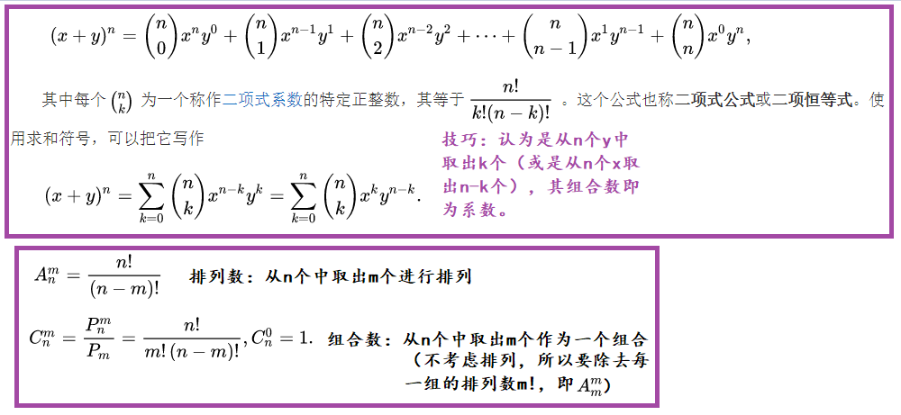
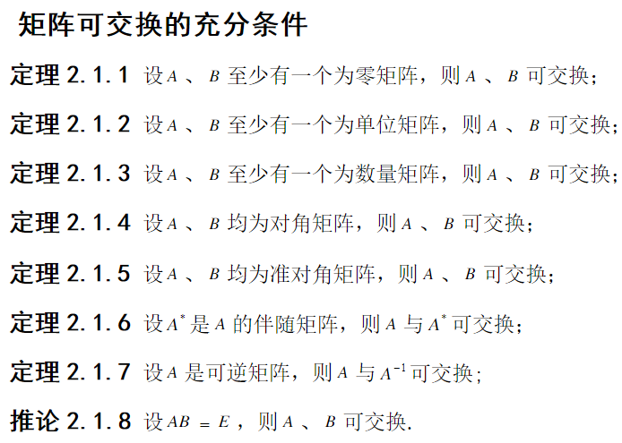
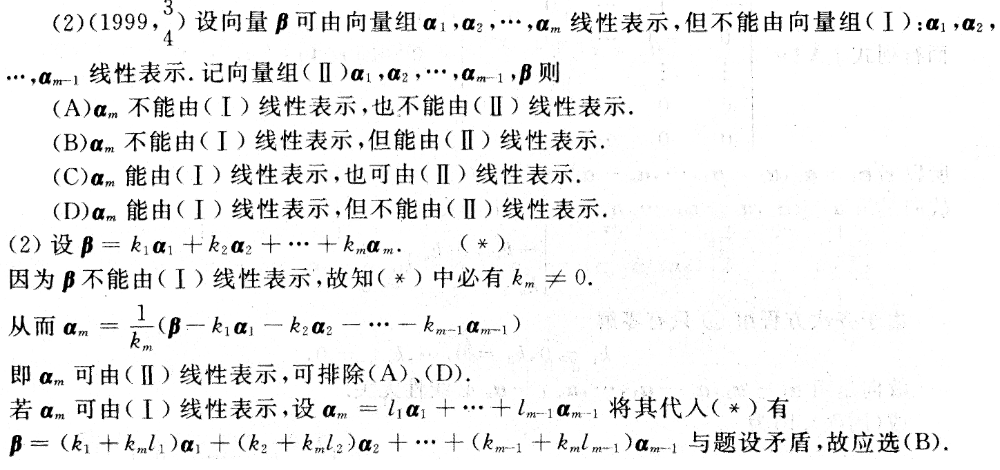

# 行列式

## 基础知识

1. 逆序数的计算方法

2. 行列式的性质

3. 行列式的计算

   - 一阶、二阶和三阶的计算方法

   - n阶的计算方法

     利用性质化为上/下三角形行列式

     利用行列式的按行展开法则（代数余子式）

   - 特殊行列式的计算方法：范德蒙行列式（后元素与前元素之差的乘积）、拉普拉斯展开式（符号·对角行列式乘积）、三角形行列式（符号·对角元素乘积）

## 题型总结

1. 行列式计算方法
   - 先化为某行/列仅存在一个非零元素的形式，然后按行/列展开⭐
   - 利用行列式的可拆性进行补0拆解至最简形式
   - 利用|A|=特征值的乘积
   - 化为特殊行列式的形式，然后按公式进行计算⭐
   - 化三角或展开的三个方法：⭐
     - 把其余行/列加到第一行/列上 => 展开
     - 逐行/列相加 => 化三角或展开
     - 递推法：求出递归式，然后递归至平凡情况
2. 证明n阶行列式的等式：数学归纳法
3. 抽象行列式的计算
   - 利用行列式的性质、矩阵运算
   - 利用公式：转置矩阵的行列式相等、相似矩阵的行列式相等、相似矩阵的伴随矩阵/逆矩阵也相似
   - 利用矩阵的恒等变形：左/右乘已知矩阵、利用单位矩阵E
   - 利用矩阵的多项式与矩阵的关系
   - 利用分块矩阵的乘法：若A已知，求|B|，则由分块矩阵可化为|B|=|A·C|=|A||C|（C为纯数字矩阵）
4. 证明|A|=0
   - 反证法=>|A|不等于0，A可逆，$A^{-1}$存在
   - 利用|A|=0的一些性质（矩阵不可逆、秩小于n、齐次方程有非零解、特征值有0、行/列向量线性相关）
   - 凑形法：利用矩阵的恒等变形或运算将要证矩阵化为已知矩阵
   - 代入法：将已知矩阵代入要证矩阵
   - 利用一些多项式公式进行展开
   - 利用特征值存在0（注意只要$Ax=\lambda x$，则$\lambda$就是A的特征值）
   - 乘自身
5. 代数余子式求和
   - 如果代数余子式之和是（行列式的某行/列展开）或（可以==利用代数余子式与对应元素的无关性==化为某个行列式的某行/列展开），则可以转化为直接计算行列式的值。
   - 如果要计算的代数余子式是行列式的某行/列的代数余子式，而系数为另一行/列的元素，则可以直接判定式子等于0
   - ==利用代数余子式与对应元素的无关性==构造方程，通过解方程求解
   - 直接求出行列式的伴随矩阵，然后根据伴随矩阵的定义求解
6. |A|=0的必要条件：有一行向量a可由其余行向量线性表示（可以想象通过初等变换消除a向量为0向量的过程，将这个过程整合成一个式子，该式子就是这个线性表示）
7. ==利用单位矩阵== 

# 矩阵

## 基础知识

1. 矩阵的运算

   加法、乘法、转置、逆矩阵、矩阵的行列式、分块矩阵

   伴随矩阵（==A*A=|A|E==）：代数余子式+==转置== 

2. 矩阵多项式和n次幂的计算方法

3. 线性方程组的求解方法：克拉默法则、逆矩阵法

4. 矩阵的初等变换

   - 三种变换方法：到最后再换行

   - 与矩阵乘法的关系：左乘、右乘

   - 初等变换的应用

     除法应用：求变换矩阵、==求逆矩阵==

     解线性方程组

5. 矩阵的秩的相关性质及计算方法

6. 用矩阵的秩讨论线性方程组的解的情况

## 题型总结

### 矩阵运算相关

1. 矩阵的计算
   - 待定元素（向量）法
   - 琐碎方法：单数矩阵本身对称
   - 合必分，分必合：式子为多个矩阵的和差，则考虑结合律；式子为多个矩阵的乘积，则考虑分配律
   
2. 若对于任何列向量x都有$x^{T}Ax=0$，证明A是某个特殊矩阵（比如对称矩阵）。此时可以不断取x为特殊列向量，从而求出矩阵A中各个元素之间的关系（若对称元素相等，则可以说明A对称）

3. AB=A+B，证明AB=BA：① 凑因式合并；② 逆矩阵的推论；③ 可逆矩阵满足$A^{-1}A=A^{-1}A$ 

4. 矩阵的幂的计算

   - 试乘找规律，再用归纳法
   - ==将矩阵分解为两个或多个矩阵的乘积==，然后再用法一
     - 比如比例矩阵（或秩为1的矩阵）可分解为列向量和行向量的乘积
   - ==将矩阵分解为两个或多个矩阵的和==，然后再用法一（可能需要用到二项式定理）
     - 比如上三角矩阵可分解为对角矩阵（可逆）和对角元素皆为0的矩阵（在累积中消失）
   - 秩为k且对角元素皆为0的上/下三角矩阵A满足：$A^{k}=\begin{bmatrix}
      & 次对角元素的乘积 \\O
      &
     \end{bmatrix}或\begin{bmatrix}
      &O\\次对角元素的乘积
      &
     \end{bmatrix}$，$A^{k+1}=0$ 
   - 利用对角分块矩阵的求幂公式=>再利用上述方法分别对两个分块进行分解找规律
   - 利用A=$p\lambda p^{-1}$来求解
   - 式子为同一矩阵不同幂次的和差 => 结合律 => 部分因式可计算为0

5. 求伴随矩阵的相关问题

   - 定义法

   - 二阶矩阵的伴随矩阵 = 原矩阵主对角线对换，副对角线变号
   - 利用核心公式将复杂伴随矩阵转化为原矩阵的形式
   - 若求逆矩阵比求伴随矩阵简单，则利用核心公式转化为求逆矩阵：
     - 求对角分块矩阵的伴随矩阵 => 利用公式转化为求对角分块矩阵的逆矩阵和行列式的问题

6. 逆矩阵的计算：① 初等变换；② 公式法；③ 定义法：凑出AB=E的形式。
7. 证明可逆

   - 定义法：通过恒等变形得到 AB=E 或 BA=E
   - 反证法：假设可逆，则存在可逆矩阵，因此可以利用可逆矩阵进行恒等变形，得到矛盾等式；假设不可逆，则存在|A|=0且Ax=0存在非零解，此时可通过设非零解为k得到等式Ak=0，将此式代入其它已知等式中，比如题给某个矩阵B不可逆，则可以构造出式子 Bx（x根据Ak=0的情况来取，确保Ak=0可以代入其中），将Ak=0代入其中，得到Bx=0存在非零解的矛盾。
   - 行列式法：
     - 将题给等式凑出目标矩阵并两边求行列式，判定目标矩阵的行列式是否为零
     - 题目没有给出等式，则直接求目标矩阵的行列式，然后通过恒等变形等方式进行化简，得到可以明确数值的式子
       - 恒等变形的技巧：==添E(或本来有E) => 令$E=AA^{-1}$(已知A可逆)== => 结合律 => 行列式乘法公式
       - 如果某行某列比较有特点（比如仅有一个元素），则可以按行/列展开
       - 拉普拉斯展开式、对角分块矩阵的一些公式
   - 逆推法：结论给出了目标矩阵的逆矩阵，则可以通过逆推得到明确成立等式
   - 正推法：直接给目标矩阵加上(-1)符号，然后通过恒等变形得到明确不为0的式子，此为其逆矩阵
   - 待定逆矩阵法：令目标矩阵A的逆矩阵为X，则解方程AX=E即可；如果目标矩阵是分块矩阵，则待定的逆矩阵也是同样形式的分块矩阵。

> 1. 二项式定理
>
>  
>
> 2. ==明确老师的出题思路和方向，由此发现考察的源点式子==
>
> 3. 矩阵可交换的条件
>
>      
>
> 4. Ax=0有非零解，即x≠0 
>
> 5. 可交换的一些结论：
>
>       EA=AE；(E-A)(E+A)=(E+A)(E-A)；==$A^{-1}A=AA^{-1}$；$A^{*}A=AA^{*}$；$A^{T}A≠AA^{T}$==（考虑$A=\begin{bmatrix}0
>         & 1\\0
>         &0
>       \end{bmatrix}$）
>
> 6. AB=E不能得出A可逆的结论，因为要考虑A和B均不为方阵的情况。
>
> 7. 对角矩阵的逆矩阵为对角元素为原相应元素倒数的对角矩阵。

### 初等变换相关

1. 已知$P^{T}AP$以及P和Q，求$Q^{T}AQ$：找出P和Q之间的关系，然后代入$Q^{T}AQ$或$P^{T}AP$中即可
   
   - 寻找P和Q之间的关系的方法：① 根据矩阵的运算直接求出（通常要用到分块矩阵的乘法）；② 观察P是经过怎样的初等变换得到Q，将该变换过程用一系列初等矩阵$X_{1}X_{2}...X_{n}$表示出来，则有$PX_{1}X_{2}...X_{n}=Q$（此处假设是列变，若是行变则是左乘）。
   
2. ==在矩阵乘法时，若左乘或右乘的对象是初等矩阵，则可以通过初等变换来代替矩阵乘法。==

3. ==若题目用初等变换描述矩阵的变换过程，则只需要写出相应的初等矩阵并正确地左乘或右乘即可。==
   - 求伴随矩阵要注意符号。
   
   - ==注意各个初等矩阵的逆矩阵的形式和对应的操作：== 
     - 原初等矩阵是对某一行乘以数a，则其逆矩阵就是对该行乘以a的倒数（以恢复原来的样子）
     - 原初等矩阵是对调某两行，则其逆矩阵还是对调该两行（以恢复原来的样子）
     - 原初等矩阵是将某一行加上另一行的k倍，则其逆矩阵就是将该行加上另一行的-k倍（以恢复原来的样子）
   
4. A与B等价，相当于r(A)=r(B)

   - 若A与B为非满秩矩阵，则有|A|=|B|=0

5. ==待定元素法==：
   - 求与矩阵A可交换的矩阵B，只需待定B的各个元素，并作AB=BA，然后解出。
   - 解AX=B时，若A不可逆，则只能根据B待定X的各个元素，然后解出。

6. 解AX=B：
   - A可逆：① $X=A^{-1}B$；② (A:B)=(E:X)
   - A不可逆：待定X的元素，解矩阵方程AX=B，其中(A|B)->(行最简|?)

### 矩阵的秩相关

1. 求某个矩阵A的秩

   - 夹逼法：若n阶矩阵A的行列式|A|=0，且存在n-1阶子式不为0，则r(A)=n-1

   - 作初等变换（若不需解方程组，则可以同时行变和列变）化为等价阶梯型矩阵B，则r(A)=r(B)
     - 沿用行列式计算的技巧：① 逐行/列相加；② 用某一行/列（通常是第一行/列或最后一行/列）去减其他行/列；③ 用其他行/列加到第一行/列上。
     - 由未知元素组成的矩阵通常需要分类讨论，而对于需要分类讨论的问题也可以计算出矩阵的行列式|A|，通过对|A|进行讨论来求解。
     - 行变不行则列变，若仅仅是求秩，则行变和列变可以混合使用。
   - 特征值法：若矩阵A为对称矩阵，则必有对角元素为A的特征值的相似对角矩阵$\lambda$，使得r($\lambda$)=r(A)。

   - 利用矩阵的秩的一些结论来求解。 

2. 有关矩阵的秩的证明题：

   - 线性表示法：
     - 证明r(A,AB)=r(A)（A、B为三阶）：① 待定A、B、C（C=AB）三者的元素或向量；② 求得C可由A的列向量组线性表示；③ 则r(A,C)=r(A)=r(A,AB)
     - 证明r(AB)≤min(r(A),r(B))：① 待定A、B、C（C=AB）三者的元素或向量；② 求得C可由A的列向量组线性表示；③ 则r(AB)=r(C)≤r(A)
   - 方程组法：（原理：r(A) = A的列数 - A的解向量组的秩；A的解向量组的秩 = A的列数 - r(A)）
     - 证明r(AB)≤min(r(A),r(B))：① 设ABx=0，Bx=0；② 方程2的解集是方程1的子集，则（列数-r(B)）≤（列数-r(AB)）；③ 可得r(AB)≤r(B)
   - 利用矩阵的秩的一些结论
     - 已知n阶矩阵A满足$A^{2}=E$，证明r(A+E)+r(A-E)=n：① (A+E)(A-E)=0 => r(A+E)+r(A-E)≤n；② r(A+E)+r(A-E)=r(A+E)+r(E-A)≥r(A+E+E-A)=r(2E)=n

> 1. $A^{5}=O$ => $|A^{5}|=|A|^{5}=0$ => |A|=0
> 2. ==转置矩阵与原矩阵沿主对角线对称。== 
> 3. $((AB)^{n})^{T}=((AB)^{T})^{n}$ 
> 4. ==有关矩阵的秩的一些结论：== ⭐
>    - ==A≠O== => r(A)≥1
>    - 若|B|≠0，则r(AB)=r(A)（初等变化不改变秩）
>    - ==AB=O== => r(A)+r(B)≤ A的列数（或B的行数）
>    - ==r(AB)==≤min(r(A),r(B))，==r(A+B)==≤r(A)+r(B)，max(r(A),r(B))≤==r(A,B)==≤r(A)+r(B)
>    - ==A～B== => r(A)=r(B)
>    - $r(\begin{bmatrix}A
>  &O \\O
>  &B
>     \end{bmatrix})=r(A)+r(B)$ 
>    - $r(A^{T})=r(A)$，r(A)=r(-A)
> 5. 若向量组A可由另一个向量组B线性表示，则r(A)≤r(B)
> 6. 行列式与它的转置行列式相等。

# 向量

## 基础知识

### 线性组合

n个向量和n个常系数的乘积之和（不要求系数的取值）

### 线性表示

- 定义：（不要求线性组合的系数取值）

  - 向量b能由向量组A线性表示：b等于A的一个线性组合
  - 向量组B能由向量组A线性表示：B的任一向量均是A的线性组合

- 零向量能由任意向量组线性表示

- 等价：两个向量组可以互相线性表示

- 有关线性表示的一些结论：

  - 向量b可由向量组A==线性表示的充要条件==：

    $\Leftrightarrow $ 非齐次方程组Ax=b有解（解向量x即是定义中的n个系数）

    $\Leftrightarrow $ r(A)=r(A,b)

  - 向量组B可由向量组A==线性表示的充要条件==：

    $\Leftrightarrow $ 非齐次方程组AX=B有解

    $\Leftrightarrow $ r(A)=r(A,B)

  - 线性表示的一些推论：

    - 向量组A线性无关，向量组(A,b)线性相关，则b能由A唯一线性表示
    - ==向量组B能由向量组A线性表示 => r(B)≤r(A)=r(A,B)==
    - 向量组B和向量组A等价 $\Leftrightarrow $ R(A)=R(B)=R(A,B)

### 线性相关和线性无关

（针对某个向量组或某一组向量，即在系数取值不全为零时，是否存在线性组合为0的情况）

- 向量组/n个向量线性无关的定义：（向量组的）n个向量的线性组合均不等于零，除非系数都是0。
- 向量组/n个向量线性相关的定义：（向量组的）n个向量存在系数不全为0而值等于零的线性组合。
- 含有==零向量、相等向量、成比例向量==的向量组都是线性相关的；==阶梯形向量组必线性无关==。

- 有关线性相关性的一些结论：⭐

  - 由n个向量组成的向量组A==线性相关的充要条件==：

    $\Leftrightarrow $ 至少存在一个向量能由余下n-1个向量线性表示（说明该向量可通过初等变换变成0向量）

    $\Leftrightarrow $ 齐次方程组Ax=0有非零解（解向量x即是定义中的n个系数）

    $\Leftrightarrow $ r(A)＜n

    $\Leftrightarrow $ |A|=0

  - 由n个向量组成的向量组A==线性无关的充要条件==：

    $\Leftrightarrow $ 任一向量均不能由余下n-1个向量线性表示

    $\Leftrightarrow $ 齐次方程组Ax=0仅有零解（解向量x即是定义中的n个系数）

    $\Leftrightarrow $ r(A)=n

    $\Leftrightarrow $ |A|≠0

  - 线性相关/无关的一些推论：

    - 向量的维数m小于向量的个数n（相当于行向量组有n-m个零向量）=> 该n个向量线性相关
    
    - 线性无关的向量组，其延伸组（即增加维数）也线性无关
    
    - 小相关可以推出大相关；大无关可以推出小无关
    
    - 向量组A（有a个向量）能由向量组B（有b个向量）线性表示，且a>b，则向量组A线性相关
    
      （较多向量组能由较少向量组线性表示，则较多向量组线性相关）
    
    - 向量组A（有a个向量）能由向量组B（有b个向量）线性表示，且向量组A线性无关，则a≤b

### 向量组的秩

- 向量组的秩 = 最大无关组的向量个数 = 相应矩阵的秩

- 最大无关组的定义：本身线性无关且再添加任一向量必线性相关（或任一向量均能由其线性表示）

- 求解最大无关组的一个方法：求得相应矩阵的秩n，从向量组中找出任意n个满足线性无关或呈阶梯型的向量。

- 向量组与其最大无关组等价 

- 初等变换不改变向量组的秩

- 行向量组的秩 = 列向量组的秩 = 相应矩阵的秩

  （虽然秩一样，但行向量组线性无关并不表示列向量组也线性无关，是否线性无关还与向量组的向量个数有关，即==一个向量组是否线性相关/无关取决于其秩和向量个数==。这个理论同样适用于线性方程组的解的情况）

### 向量的运算

1. 向量的内积$(a,b)$、长度$\sqrt{(a,a)} $、夹角、正交（(a,b)=0）

2. 向量空间的基的==正交单位化==（标准正交化、施密特正交化）

   ① $\frac{\left[b, a\right]}{\left[b, b\right]}b$表示a在b上的投影向量；

   ② a减去了在哪些向量上的投影向量，就与哪些向量正交。

    

3. 正交矩阵：如果n阶矩阵 A 满足$AA^{\mathrm{T}}=A^{\mathrm{T}} A=E$，则称矩阵A为正交矩阵。

   - 正交变换：若 P 是正交阵，则线性变换 y = Px 称为正交变换。

   - 正交矩阵的一些性质：

     - A是正交矩阵的充要条件：

       $\Leftrightarrow $ ==$A^{-1}=A^{\mathrm{T}}$==

       $\Leftrightarrow $ A的行(列)向量组是==正交单位化==矩阵

     - 若A是正交阵，则|A| = 1 或 －1。
     - 若A和B是正交阵，则 AB 也是正交阵。

4. 向量空间的基的定义和求解、基变换矩阵、坐标和坐标变换公式

   - 基：某个向量组A线性无关，且向量空间中任一向量a均可由A线性表示，则A为该空间的一个基。

     - 坐标：a的坐标即由A线性表示时对应的系数x（a=Ax）
     - 维数：基所含向量个数

     - 规范正交基：即正交且单位化的基（$(e_{i},e_{j})=0或1$）
- 求向量b在基A上的坐标：建立方程b=Ax，解出的x即是坐标
   - 过渡矩阵：设有基A和基B，且B=AP，则P称为由基A到基B的过渡矩阵（可逆矩阵），B=AP称为基变换公式
- 坐标变换公式：设某个向量y在基A的坐标为a，在基B的坐标为b，则a=Pb称为坐标变换公式（P为由基A到基B的过渡矩阵）（可由y=Aa，y=Bb推得）
   - 向量在标准正交基中的坐标： 
- 设A=BC，其中B为规范正交基，则A为规范正交基的充要条件是C为正交矩阵。

## 题型总结

### 判别线性相关性(Ax=0)

1. ==利用充要条件==：① 行列式；②秩与向量个数；③方程组的解。

2. ==利用定义==：将向量组展开成线性组合的形式，判断其系数是全0，还是不全为0。
   
   - 快速判断是否为线性相关：直接将所有向量加起来，若等于0，则线性相关，若不为0则还需进一步判断。
   
3. ==利用推论==：① 小相关推大相关，大无关推小无关；② 维数小于个数是相关；③ 增维数还无关；④ 少表多是相关。

4. ==利用B=AX==⭐：==若向量组B能由向量组A线性表示==，则可以写出B=AX（X由A对B的各个向量的线性组合的系数组成），因为A线性无关（即可逆，相乘不改变X的秩），所以r(B)=r(X)，因此可以通过求X的秩来求抽象向量组B的秩，进而判断线性相关性。

5. 利用反证法：

   举例说明：已知b可由A线性表示，证明表示法唯一的充要条件是A线性无关。

   解题步骤：写出已知和反证法假设的式子（包括线性相关/无关/表示），然后进行==两式相加==或==两式相减==。

6. 其它方法：

   - ==正交与线性无关==

     已知非零向量b与向量组A的每个向量的内积均为0，且向量组线性无关，证明(A,b)线性无关：写出(A,b)的线性相关性的定义式，两边左乘$b^{T}$ => 系数均等于0，则(A,b)线性无关。

   - ==利用基础解系==

     若有n个向量均是某个方程组的解向量，但该方程组的基础解系的秩<n，则可以推断这n个向量线性相关。

   - 利用证明一些定理时所用到的方法

     - 不同特征值对应的特征向量线性无关：==用A左乘定义式并代入Ax=$\lambda$x==。
     - 设3维列向量$a_{1} , a_{2},b_{1},b_{2}$，其中$a_{1},a_{2}$和$b_{1},b_{2}$分别线性无关，则存在非零向量y既可由$a_{1},a_{2}$线性表示，也可由$b_{1},b_{2}$线性表示：① $a_{1} , a_{2},b_{1},b_{2}$是4个3维向量，必线性相关；② 移项=y；③ 反证y必不等于0。
     
   - 线性相关一般用于提供等式，线性无关一般用于提供反证的矛盾条件或形成用于求解系数的方程组

> 1. 如果题给条件无法直接（或简单变形后）判断或证明线性相关性，则可以考虑将其作为辅助条件（用于推进主线证明的条件），然后按照常规方法解题即可。
> 2. 分清条件的使用范围：
>
>   - 主线条件：一般是需要求证的目标式子，通常可以直接假设
>    - 辅助条件：负责简化主线的求解过程
>    - 限制条件：仅仅用于限制结果的范围
> 3. 求秩转化为求线性相关性：==已知前n-1个向量为线性无关==，因此秩≥n-1，此时有三种方法：
>
>    - 判断第n个向量能否被前n-1个向量线性表示（称为目标式子），若能则秩为n-1，否则秩等于n。
>    
>    - 写出该向量组的线性组合式，通过已知条件计算出系数是否全为0，若全为0则秩为n，不全为0则秩等于n-1。
>    - 对已知秩为n的向量组进行初等变换，转化为要证的目标向量组，若成功则秩为n。
>
> 4. 任何n维向量均可由向量组A的n个向量a1,a2,...,an线性表示，则向量组A必线性无关。
> 5. ==A[a1,a2,...,an]=[Aa1,Aa2,...,Aan]==

### 判别能否线性表示(Ax=b)

1. 利用充要条件⭐：==相应非齐次方程组有解==，即r(A)=r(A,B)或r(A)=r(A,b)。

   - 设向量组A有n个向量，当r(A)=n，Ax=b只有一个解，即b能由A==唯一地==线性表示。
   - 设向量组A有n个向量，当r(A)<n，Ax=b有无穷多解，即b能由A线性表示，且==表示法不唯一==。
   - 向量组B能由向量组A线性表示可以看成是向量组B的每个向量能由向量组A线性表示。

2. 利用推论：若向量组A线性无关（即r(A)=n，以推出"唯一"），向量组(A,b)线性相关（即有解，以推出"能线性表示"），则b能由A唯一线性表示。

   - 若b不能由A线性表示且向量组(A,b)线性相关，则向量组A必线性相关。（是当b不能由A线性表示时常用的方法）

3. 当须具体求表达式时，对于向量组B由向量组A线性表示，则是求解AX=B；对于向量b由向量组A线性表示，则是求解Ax=b。

4. 判别向量组B和向量组A是否等价，即是看判别式R(A)=R(B)=R(A,B)成不成立

   - 直接对(A,B)进行初等行变换即可，不用分别进行计算
   - 向量组B能由向量组A线性表示 => r(B)≤r(A)=r(A,B)（由此式推得上述判别式）

5. 举特例：比如设a,b,d线性无关，a,b,c线性相关，则可令c=b来证明"a可由b,d,c线性表示"是错的。

6. 利用证法。

7. 利用定义。

    

### 最大线性无关组与秩

求某个向量组的秩、最大线性无关组，用最大线性无关组线性表示其余向量。
- 作初等行/列变换：① 矩阵的秩等于向量组的秩；② 初等行/列变换不改变向量组每个向量之间的线性相关性；③ 初等行/列变换不改变用最大无关组线性表示其余向量的各个系数。
- 求伴随矩阵的秩：① r(A)=n，r(A*)=n；② r(A)=n-1，r(A\*)=1；③ r(A)＜n-1，r(A\*)=0 

### 正交相关

1. 求与多个向量正交的某个向量x：即x与各个向量的内积均为零，设x并联立方程组解出即可
2. 求正交矩阵的某个未知向量x：正交矩阵的各行/列向量均为单位向量且两两正交，即它们两两之间的内积均为0且长度等于1。
3. 证明某个向量组为正交矩阵：满足$AA^{T}=A^{T}A=E$即可
   - 注意$a^{T}a$是一个数，$aa^{T}$是n阶矩阵。

### 向量空间相关

1. 由固定的n个向量所生成的向量空间的维数等于m，则这n个向量组成的向量组的秩等于m。
2. 求由A到B的过渡矩阵：$ C=A^{-1}B$ 
3. 求向量a在基A下的坐标x：$a=Ax => x=A^{-1}a$ 
4. 已知向量a在基A的坐标x，求在基B的坐标y和向量a：a=Ax=By。
5. 设向量a在基A和基B下有相同坐标x：$a=Ax=Bx => (A-B)x=0$，解方程组即可。
   - 如果要求a为非零向量，则坐标不全为0，即方程组具有非零解=>|A-B|=0
6. 已知基A，向量组B可由A线性表示，证B也是基：能线性表示即B=AX，若|X|≠0，则B也是基。（说明：基A的秩就是该向量空间的维数，只有向量组B的秩等于A的秩或向量组B线性无关，则B就是一个基）

# 线性方程组

## 基础知识

### 克拉默法则

$x_{i}=\frac{|A_{i}|}{|A|}$  

### 线性方程组的解的情况

1. n 元非齐次线性方程组 $Ax = b$  

   ① 无解  $\Leftrightarrow $  $R(A)<R(A, b)$；有解  $\Leftrightarrow $  $R(A)=R(A,b)$ 

   ② 有唯一解  $\Leftrightarrow $  $R(A)=R(A, b)=n  $  $\Leftrightarrow $  |A|≠0  $\Leftrightarrow $  A的列向量组线性无关

   ③ 有无穷解  $\Leftrightarrow $  $R(A)=R(A, b)<n$  $\Leftrightarrow $  |A|=0  $\Leftrightarrow $  A的列向量组线性相关

2. n 元齐次线性方程组 $Ax = 0$ 

   ① 必有解

   ② 有唯一零解  $\Leftrightarrow $  $R(A)=n$  $\Leftrightarrow $  |A|≠0  $\Leftrightarrow $  A的列向量组线性无关

   ③ 有无穷多解  $\Leftrightarrow $  $R(A)<n $   $\Leftrightarrow $  |A|=0  $\Leftrightarrow $  A的列向量组线性相关

3. 矩阵方程 $AX=B$ 

   ① 有解  $\Leftrightarrow $  $R(A)=R(A,B)$ 

> 1. 设A的向量个数为n，R(A)=r，则方程有r个非自由未知数，有n-r个自由未知数。
> 2. n是指列向量的个数，并非行向量的个数，但R(A)等于行向量的个数可推出方程组必定有解。
> 3. R(A)等于n，即列向量的个数，并不能说明方程有唯一解，也有可能是无解。
> 4. 无解的情况均是由于加上常数项矩阵后秩增加了。

### 线性方程组的解的结构

#### 基础解系

1. 基础解系的定义：线性方程组的解空间的最大无关组称为该线性方程组的基础解系。

2. 基础解系的充要条件：

   (假设系数矩阵A有n个向量，基础解系X有r个向量)

   - X的各个向量线性无关；

   - 解空间任一向量均可由X线性表示。

     等价说法：① X加入任一解向量，则线性相关；② r(A)=n-r

#### 齐次线性方程组Ax=0

##### 解的性质

1. 齐次线性方程组的解是使A的列向量组的线性组合为零的系数。

2. 性质1：若$x=\xi_{1},x=\xi_{2}$是齐次线性方程组$Ax=0$的解，则$x=\xi_{1}+\xi_{2}$也是$  A x=0  $的解。

3. 性质2：若$x=\xi  $是齐次线性方程组$  A x=0  $的解，k为实数，则$x=k\xi$也是$  A x=0  $的解。

4. 结论：若$ x=\xi_{1}, x=\xi_{2}, \ldots,, x=\xi_{t} $是齐次线性方程组$A x=0$的解， 则$x=k_{1} \xi_{1}+k_{2} \xi_{2}+\ldots+k_{t} \xi_{t}$也是$  A x=0  $的解。

5. 定理：设m×n矩阵的秩R(A)=r，则n元齐次线性方程组Ax=0的解集的秩为n−r。

   （一个自由未知数产生一个线性无关的解向量）

##### 通解结构

齐次线性方程组的通解 = 基础解系的各解向量与任意实数的乘积之和（基础解系的任意线性组合）

##### 通解求法

1. 通过初等行变将系数矩阵A化为阶梯型矩阵，并写出对应的同解方程组；

2. 令n-r个自由未知数组成的列向量分别等于n-r阶单位向量的每个列向量，并分别将其代回方程求出相应的n-r个解；

   （也可以令n-r个自由未知数组成的列向量为其他值，但要保证这n-r次赋值产生的n-r个列向量是线性无关的）

   （r个非自由未知数须取在A的阶梯型矩阵中的r个线性无关列向量所对应的未知数）

3. 可以证明该n-r个解就是方程组Ax=0的基础解系，为其附上n-r个任意实数则得到通解。

   （也可以直接令n-r个自由未知数为任意实数，先求出通解，然后将这n-r个任意实数提取到外部所得到的n-r个向量就是相应的基础解系）

#### 非齐次线性方程组Ax=b

##### 解的性质

1. 非齐次线性方程组的解是b可由A的列向量组线性表示的表出系数。
2. 性质3：若$ x=\eta_{1},x=\eta_{2}$是非齐次线性方程组$A x=b$的解，则$x=\eta_{1}-\eta_{2}$是对应齐次线性方程组$A x=0$的解。
3. 性质4：若$x=\eta  $是非齐次线性方程组$  A x=b  $的解，$x=\xi  $是对应齐次线性方程组$A x=0$的解，则$x=k\xi+\eta $仍是$Ax=b$的解（k为任意实数）。
4. ==Ax=0的基础解系中含有n-r(A)个向量，而Ax=b的解的极大无关组含有n-r(A)+1个向量。== 

##### 通解结构

非齐次线性方程组的通解 = 对应齐次线性方程组的通解 + 非齐次方程的一个特解

##### 通解求法

1. 通过初等行变将增广矩阵(A,b)化为阶梯型矩阵，并求出对应齐次方程组的基础解系；
2. 令n-r个自由未知数为任意特定值（为简便，可全取作0），代回方程组求得一个特解；
3. 按照非齐次线性方程组的解的结构，将上述计算结果组合为相应的通解。

## 题型总结

### 概念相关

1. 若初等变换只是求秩时，只行只列或既行又列都是可以的。

2. 若n阶矩阵A存在不等于0的代数余子式（或伴随矩阵≠0），则r(A)≥n-1。

   - 举例：求证代数余子式组成的n个列向量$[A_{i1},A_{i2},...A_{in}]^{T}$是方程组Ax=0（其中|A|=0）的n个解向量，且两两相关。
   - 上题用（ ① AA*=|A|E=0；② |A|=0 => r(A\*)≤1 ）也可以求解。

3. 已知齐次方程组Ax=0的基础解系B，问所给向量中哪个是该方程组的解向量。

   - 法一：解向量c必定可由基础解系线性表示，即Bx=c有解（为简便，可将所有代求的增广矩阵合并一起进行初等行变）
   - 法二：反求出线性方程组，然后将各个向量代入求证

   > 若方程组是非齐次方程组Ax=b，其通解为x=Bk+y，问c是否为该方程组的解向量：
   >
   > - 若向量c是解向量，则其与特解y的差可由基础解系B线性表示，即Bx=c-y

4. 已知m个向量是非齐次方程组的线性无关解并给出由这m个向量线性表示的m个具体向量，求该方程组通解。

   - 法一：凑式子
     - 将这m个具体向量丢到式子A()的括号中凑出满足A()=b的式子，则()就是一个特解。
     - 将这m个具体向量丢到式子A()的括号中凑出满足A()=0的式子，则()就是对应齐次方程组的一个解。
     - 将上述结果按照非齐次方程组的解的结构组合起来即可。
   - 法二：利用非齐次方程组的解的性质
   - 法三：直接解出这m个解向量

5. 证明某个多项式矩阵对应的行列式等于0，即 |f(A)|=0

   - 构造方程组进行求解：|f(A)|=0 等价于 f(A)x=0 有非零解，其中非零解一般从题设条件中寻找。
   - AB=0说明B中每一个列向量均是方程组Ax=0的解。
   - 已知$A^{2}=A，A≠E$，证明|A|=0：关键点在于A(A-E)=0（或反证法）
   
6. 讨论某个未知参数的取值，问方程组何时有非零解、零解、无解。

   - 初等行变+按照秩的情况进行判断
   - 按照系数矩阵的行列式进行判断

   > 若Bx=ACx=0，且|A|≠0，则Bx=0和Cx=0是同解方程组。

7. 已知某个基础解系A，问下列由A线性表示的向量组中哪个也是基础解系。

   ① 首先必须是由解向量组成（由解的性质进行判断），② 接着看其向量个数是否与题给基础解系一致，③ 最后看该向量组是否线性无关。

8. 清楚线性方程组的三种表现形式：① 方程组形式；② 向量形式；③ 矩阵形式。

### 计算相关

1. 基本：计算方程组的通解、基础解系。

3. 将矩阵方程转化为方程组进行计算。

   举例：给出带参数a和b的具体矩阵A和B，问a,b为何值时，存在矩阵C使得AC-CA=B。

   解法：待定C的元素，然后根据两个矩阵相等的条件写出相应的方程组，求解该方程组即可。

5. ==已知基础解系$a_{1},a_{2},...,a_{n}$求原方程组A（或同解方程组）==

   - 已知原方程的形式为Ax=0，两边同时==转置==得$x^{T}A^{T}=0^{T}$，可以知道原方程的解向量作为齐次方程组的系数矩阵的行向量，则原方程组的系数矩阵的行向量就是该方程组的解向量。
   - 于是可以构造齐次方程组$[a_{1},a_{2},...,a_{n}]^{T}$x=0，该方程组的基础解系就是原方程组的系数矩阵的转置。

   > 1. 矩阵方程AX=O的解矩阵X的每个列向量就是方程组Ax=0的解向量。
   >2. ==齐次方程组的解向量与系数矩阵的行向量正交==，可依次来证明涉及解向量与系数矩阵结合的线性相关性。
   > 3. 证明线性无关向量组与某个向量线性无关，则只需证该向量不能由向量组线性表示，此时可用反证法。
   
4. 常数项列向量b、系数矩阵列向量组A以及解向量组X之间的线性相关性和线性表示。

   - 题目给出通解，则需要将通解中包含的解向量代入方程组中写出线性表达式或线性组合式；

     （或者将整个通解代入方程组中写出线性表达式或线性组合式，然后令任意实数k等于特定值，从而得到想要的线性表达式或线性组合式）

   - 写出证明所需要的线性表达式或线性组合式，然后由已知式子之间的关系或运算解出证明所需要的系数。

   > 1. 向量组A有列向量a,b,c,d，若a能由c,d线性表示，则r(A)≤3；若b也能由c,d线性表示，则r(A)≤2。
   > 2. ==在向量组中，如果某个列向量a可以由其它列向量线性表示，则在初等列变时可将其化为零向量。==（线性表示可以看成是初等变换时所需要做的操作序列）

5. 已知某个方程组的通解，求该方程组的演变的新方程组的通解。

   - 先由原方程组推出新方程组的通解情况：基础解系（几个解向量）+特解；
   - 然后通过已知的所有线性表达式或线性组合式，凑出所需要的几个解向量和特解。

6. ==求两个方程组的公共解==

   （有时候题目为求某个方程组在满足某个或某些条件下的通解，其本质就是求两个方程组的公共解）

   - Ax=0和Bx=0的公共解是满足$\begin{bmatrix}A
      \\B
     \end{bmatrix}$x=0的解
   - 将方程组1的通解代入方程组2中，再将结果回代通解中，即可得到它们的公共解
   - 令方程组1的通解和方程组2的通解相等，再将结果分别回代它们的通解中，即可得到它们的公共解

   （限制通解系数得到公共解，所以只需找出通解系数之间的关系）

   > 两个齐次方程组有公共非零解：通解之间线性相关；$\begin{bmatrix}A
   > \\B
   > \end{bmatrix}$x=0有非零解。

7. 同解方程组：两个方程组具有完全相同的解。

   - 新增一个方程还是同解：新添方程是多余方程（可由原方程组线性表示），则与原方程组同解。
     - 写出线性表达式，然后对应系数相等即可
   - 我的解是你的解，你的解是我的解，则我们同解（通过恒等变形等）：
     - 比如Ax=0和$A^{T}Ax=0$，Ax=0左乘$A^{T}$说明Ax=0的解是$A^{T}Ax=0$的解，$A^{T}Ax=0$左乘$x^{T}$得$(Ax)^{T}Ax=0=>Ax与自身正交=>Ax=0$，则$A^{T}Ax=0$的解是Ax=0的解，所以它们同解。
   -  设Bx=y是Ax=p的部分方程组。若Ax=p有解，且r(A)=r(B)，则这两个方程组同解。 
     - 比如：Ax=b有解，则$A^{T}x=0$与$\begin{bmatrix}A^{T}
        \\b^{T}
       \end{bmatrix}$x=0同解。
   - 两个齐次方程组同解，则它们有相同的基础解系。

   > $r(A)=r(A^{T}A)=r(AA^{T})$ ：由Ax=0和$A^{T}Ax=0$同解来证明。

# 特征值与特征向量、对角化

## 基础知识

### 特征值与特征向量

1. 特征值、特征向量

   若n阶方阵A满足关系式 $Ax=\lambda x$，则数$\lambda$称为A的特征值，而非零向量x称为A对应于特征值$\lambda$的特征向量。

2. 特征方程、特征多项式、特征矩阵

   使得上述关系式成立的充要条件是方程组$(A-\lambda E)x=0$ 有非零解，即$|A-\lambda E|=0$。

   其中，==等式 $|A-\lambda E|=0$ 叫做A的特征方程，行列式 $|A-\lambda E|$ 叫做A的特征多项式，矩阵 $A-\lambda E$ 叫做特征矩阵。== 

   > 凡是满足以下三个条件之一的$\lambda$均是矩阵A的特征值：
   >
   > ① $Ax=\lambda x$；② $(A-\lambda E)x=0$；③ $|A-\lambda E|=0$ 

3. 特征值的性质
   - n阶矩阵的特征值即是特征方程的解，且总共有n个。而对应于特征值$\lambda$的特征向量即是对应方程组$(A-\lambda E)x=0$ 的解向量。
     - 每个特征值对应的特征向量有无数个。
   - ==特征值的和等于对角元的和；特征值的乘积等于行列式。==
     - 矩阵可逆 <=> 特征值全不为0。
   - 特征值不同，对应的特征向量线性无关。
     - 对应于两个不同特征值的线性无关的特征向量组，合起来仍线性无关。
     - 分别对应于两个不同特征值的两个特征向量，其和不是特征向量。
   - 设$\lambda$是A的特征值且p是对应$\lambda$的特征向量：
     -  $\lambda^{k}$是$A^{k} $的特征值，p还是对应的特征向量；
     - $\frac{1}{\lambda}$是$A^{−1 }$的特征值，p还是对应的特征向量；
     - $\varphi(\lambda)=a_{0}+a_{1} \lambda+\ldots+a_{m} \lambda^{m}$是矩阵多项式$\varphi(A)=a_{0}+a_{1} A+\ldots+a_{m} A^{m}$的特征值，p还是对应的特征向量。

4. 如何求特征值和特征向量
   - 方法一：先后求解特征方程 $|A-\lambda E|=0$ 和方程组 $(A-\lambda E)x=0$ 即可。
     - 对角矩阵、上/下三角矩阵的特征值，即是主对角元素。
     - 齐次方程组的解即是对应于$\lambda=0$时的特征向量。
   - 方法二：定义法。凡是满足关系式 $Ax=\lambda x$的$\lambda$和x即是A的特征值和对应的特征向量。一般用于抽象矩阵。
   - 方法三：与A相似的对角矩阵的对角元即是A的特征值。

### 方阵对角化

1. 相似变换与对角化

   - 相似变换：设A和B都是n阶矩阵，若存在可逆矩阵P使得$P^{-1} A P=B$，则称A与B相似， 记作$  A \sim B $。其中，${P}^{-1}{A P}$称为对A进行相似变换，P称为把A变成B的相似变换矩阵。

     （相似变换是初等变换的一种拓展）

   - 对角化：若B是一个对角矩阵，则称A可相似对角化，而这个过程称为把A对角化。

2. 相似矩阵的性质：

   - 反身性、对称性、传递性

   - 两个矩阵相似，可推出（反之不一定成立）：

     - 它们的==特征多项式、特征值、秩、行列式、主对角元素之和==都相同。

     - A的多项式$\varphi (A)$和B的多项式$\varphi (B) $相似。

     - 它们的逆矩阵也相似。

       $A\sim B =>A=P^{-1}BP=>P^{-1}B^{-1}PA=E=>A^{-1}\sim B^{-1}$

3. 可相似对角化的条件：

   - n阶矩阵A能对角化 $\Leftrightarrow $ A有n个线性无关的特征向量
   - n阶矩阵有n个互不相同的特征值 => A能对角化
   - n阶矩阵A能对角化 $\Leftrightarrow $ A的每个k重特征值对应的线性无关特征向量个数等于k
     - 注意：k重特征值对应的线性无关特征向量个数≤k

4. ==如何求方阵A的对角矩阵和对应的相似变换矩阵：==
   - 求出A的n个特征值（即为对角矩阵的对角元）
   - 求出n个特征值对应的n个特征向量$[a^{1},a^{2},...a^{n}]$（即为相似变换矩阵，且各向量的排列次序与相应对角元在对角矩阵中的排列次序一致）
   - 若存在K重特征值$\lambda$，则 $(A-\lambda E)x=0$ 应能求出k个线性无关的解向量，作为k重特征值$\lambda$的k个线性无关的特征向量。
5. 对称矩阵的对角化
   - 若矩阵A满足$A^{T}=A$，则A为对称矩阵，其有如下性质：
     - 对称矩阵的特征值为实数，对应的特征向量也是实向量。
     - ==对称矩阵的不同特征值对应的特征向量正交。== 
     - n阶对称矩阵必存在n个线性无关的特征向量（k重特征值必有k个线性无关的特征向量），即对称矩阵必可对角化。
     - ==对称矩阵可以进行特殊的对角化：正交对角化==，即相似变换矩阵为正交矩阵（即满足$P^{T}=P^{-1}$的矩阵）的对角化，这种对角化可以很方便地求出相似变换矩阵的逆矩阵，只需转置即可。
   - ==对称矩阵A的正交对角化（即变换矩阵为正交阵的对角化）步骤：==
     - 求出A的n个特征值（构成对角矩阵$\Lambda$）；
     - 求出n个线性无关的特征向量，并将属于k重特征值的k个特征向量正交化（不同特征值对应的特征向量已正交）；
     - 将全部特征向量单位化，并按对角矩阵中相应对角元的顺序排列好，即得所求正交变换矩阵P，使得$P^{-1} A P=P^{T} A P=\Lambda$。

## 题型总结

### 求特征值和特征向量

1. 利用特征值的性质，快速求解特征值
   - 利用特征值的乘积等于行列式：若|A|=0，则矩阵A必有特征值为0；
   - 利用特征值之和等于主对角元素之和：若3阶矩阵的前两个特征值为a,b，则可设第三个特征值为x，列前述等式即可求得第三个特征值。
   - ==若某个特征值$\lambda$求得的特征向量中有n个是线性无关的，则$\lambda$至少是n重特征值。==

2. 已知n阶矩阵A的特征值$\lambda$和对应的特征向量p，求与A相关的矩阵或多项式的特征值和对应的特征向量。
   -  比如：$\lambda^{k}$是$A^{k} $的特征值，p仍是对应的特征向量；$\frac{1}{\lambda}$是$A^{−1 }$的特征值，p仍是对应的特征向量；$1+\lambda$是E+A的特征值，p仍是对应的特征向量...
   - 掌握它们的证明过程：① 定义法；② 特征方程法...

3. 已知矩阵A满足某种条件，求其特征值$\lambda$的取值范围。

   - 方法一：用定义 => 凑出关于特征值$\lambda$的等式

   - 方法二：用特征方程

     根据条件等式凑出（移项、取行列式等恒等变形）特征方程的形式

   - 方法三：利用上述第二点的结论

     移项使得条件等式为"矩阵=0"的形式，由$\lambda$写出该矩阵的特征值，并令该特征值=0即可求解

4. 已知矩阵A满足某种条件，问k取何值时，矩阵kE+A是可逆矩阵。

   首先求出矩阵A满足某种条件时其特征值$\lambda$的取值范围，则矩阵kE+A的特征值为k+$\lambda$，则k的取值只要使其特征值不等于0即可。（也可用反证法，假设矩阵kE+A不可逆...）

### 证明两个矩阵具有相同的特征值

1. 凡是特征多项式相等的两个矩阵的特征值相同：即若|A-$\lambda$E|=|B-$\lambda$E|，则A和B的特征值相同

   - 比如证明$A$和$A^{T}$的特征值相同：对A-$\lambda$E直接转置，一般与转置相关的都可以如此证明；
   - 比如证明相似矩阵的特征值相同：两边分别乘$|P|$和|$P^{-1}$|即可，一般与相似或可逆相关的都可以如此证明。

2. 利用定义式来证明：只需从一个矩阵的定义式通过恒等变形凑出另一个矩阵的定义式，只要它们的特征值是同一个，那么它们就有相同的特征值。

   - 比如证明相似矩阵的特征值相同：设$P^{-1} A P=B$，$Ba=\lambda a$，则有$P^{-1} A Pa=\lambda a$，移项得$APa=\lambda Pa$，则A和B的特征值均为$\lambda$，但A的特征向量为Pa。

     ==（特征向量可以是任何形式，只要非零即可，因此要懂得使用结合律。此外，该题型的关键就在于凑，因此要懂得一些"凑"的技巧）==

   - 比如已知A和B均为n阶矩阵，证明AB和BA具有相同的特征值。

     - 在ABa=λa两边左乘B => BA(Ba)=λ(Ba)，若Ba非零，则λ也是BA的特征值；
     - 若Ba=0，则λ=0，因为|AB|=0=|A||B|=|BA|，所以BA的特征值也是0，则它们具有相同的特征值。

3. 利用相似矩阵具有相同的特征值：比如已知A可逆，证明AB和BA具有相同的特征值。

### 证明两个矩阵具有相同的特征向量

1. 用定义：写出已知条件对应矩阵的定义式，然后通过恒等变形凑出关于另一个矩阵的定义式，判断它们此时的特征向量是否相同即可。
   - 比如：设A是n阶可逆矩阵，满足$A^{3}a=\lambda a$，$A^{5}a=\xi a$，证明a也是A的特征向量。

2. 举反例。

### 判断矩阵是否可对角化

1. ==求特殊矩阵的特征值的一些方法：==⭐
   - 若|A|=0，则有特征值=0，若r(A)=k，则特征值0还是n-k重根。
   - 若已知n阶矩阵的n-1个特征值，则第n个特征值可由公式"对角元之和等于特征值之和"求取；
   - 利用特征值在矩阵多项式中的结论求取特征值：比如n阶矩阵B≠0，$B^{3}=0$，则B的特征值等于0（==该方法也可以用于求特征向量，即原矩阵与该矩阵多项式具有相同的特征向量==）
   - 若n阶矩阵A==每行元素之和均为k==，则有Aa=ka，其中特征向量a为元素均为1的列向量。
   - ==若n阶矩阵A为幂等阵，则A的特征值取值范围为0或1。==
     - ==如果r(A)=r，则A的特征值为r个1和n-r个0==（因为A的特征值至少有n-r个0，至少有r个1），且A有n个线性无关的特征向量，即A可对角化。
     - 延伸：当题目给出"矩阵满足某一条件"，则可以据此求出特征值的取值范围，若取值范围是0和其他值，且知道矩阵的秩，则可以准确得出各个特征值的数量。⭐
   - 若A满足某个条件，则应联想到特征值λ满足的条件，可求得λ的取值范围。
2. 根本解决点在于n阶矩阵==是否有n个线性无关的特征向量==。
   - 不同特征值之间的特征向量必线性无关；
   - 可对角化要求：k重特征值λ必须有k个线性无关的特征向量，即(A-λE)x有k个线性无关的解（自由未知数）或基础解析有k个向量或n-r(A-λE)=k。
3. 若矩阵是==实对称矩阵（$A=A^{T}$）==，则该矩阵必定可以对角化
4. 问矩阵满足一定条件下能否对角化
   - 通常先求取对应的特征值，然后按照以上结论进行判断。
   - 若既可能对角化，也可能不能对角化，则举两个例子说明即可。

### 由特征值/向量反求A

1. 若所给特征向量均线性无关，则有$P^{-1}AP=\Lambda $，因此==$A=P\Lambda P^{-1}$==。
   - 看书的例题P419 例13的解题思路（对理解对角化有帮助）
   - P不一定是要正交矩阵，但正交矩阵可以简化逆矩阵的计算。
2. 所给n阶矩阵为实对称矩阵，且特征值存在重根的情况。
   - 比如：已知三阶实对称矩阵A的三个特征值为-1,1,1，对应-1的特征向量为$a_{1}=[0,1,1]^{T}$，求A。
   - 解题思路：A必可对角化，特征值1必有两个线性无关的特征向量，因此要先求出来，然后利用上述第一点即可求得A。
   - 解题关键：==由实对称矩阵不同特征值对应的特征向量相互正交，可知凡是与$a_{1}$正交的非零向量均是特征值1对应的特征向量==，只需从中找出两个线性无关的向量即可。 
   - 简化：由于实对称矩阵可以正交对角化，若能求出正交单位变换矩阵P，则可以由$P^{T}$来代替求$P^{-1}$，从而简化计算。

### 由相似求参数元素

1. 利用相似矩阵的必要条件：矩阵A和矩阵B相似，则它们==有相同的特征多项式、特征值、秩、行列式、主对角元素的和==。
2. 也可由相似转化成其它问题：
   - 比如由相似可推得特征矩阵的秩，从而通过初等变换求得参数；
   - 比如由相似可推得矩阵的部分特征值，通过代入特征多项式并等于0求得参数。

> ==若|A|=0，则Ax=0中至少有一个方程是多余的，因此在作初等变换时，可直接令某一行等于0，只作其他行的初等初等变换。==

### 证明两个矩阵相似

1. 定义法：即可以找到可逆矩阵P，使得$P^{-1}AP=B$，则A和B相似。
   - 另一个思路，只要A可以通过对称的行变和列变得到B，则它们相似。
2. 利用相似的传递性：分别求出两个矩阵的特征值，并证明它们都相似于同一个对角阵，则它们相似。

### 相似对角阵的应用

1. 计算如|A-xE|的行列式：

   若A可对角化，则有$A=P\Lambda P^{-1}$，代入行列式得

   |A-xE| = $|P\Lambda P^{-1}-xPP^{-1}|=|P||\Lambda-x||P^{-1}|=|\Lambda-x|$ 

   （实际上也可以用特征值在矩阵多项式中的结论来计算）

2. 计算矩阵的n次方：$A^{n}=P\Lambda^{n} P^{-1} $

3. 计算如$A^{n}x$形式的矩阵：已知A的特征值λ和对应的特征向量a和列向量x，只需将x用A的特征向量线性表示并代入式子，从而转化为$λ^{n}a$形式的计算。

4. 计算递推方程组在下标较大时的值

   - 方法一：先将递推方程组表示成矩阵形式，然后递推到平凡情况，得到包含n次方矩阵的形式，接着用上述第二点方法即可。

   - 方法二：在得到包含n次方矩阵的形式后，用上述第三点的方法求解；或者直接将平凡向量用特征向量线性表示，然后递推到n次的情形。

> 单位向量：长度为1的向量
>
> 求行列式可行列同时运算，解方程组一般只能行变
>
> r(A)=1，则3阶矩阵A的特征值0至少是2重，因为它至少可以求出2个线性无关的特征向量，但它也可能是3重，不过此时它就必定不能对角化了。

# 二次型

## 基础知识

### 什么是二次型

1. 二次型的定义

    

2. 二次型的矩阵形式（先取出左边的x，然后取出右边的x）

    

   其中A是由二次型中各个系数组成的对称矩阵，即$A^{T}=A$，与二次型一一对应。

3. 对称矩阵A的性质
   - 对称矩阵A的秩 = 二次型的秩 = ==标准型中系数的个数== 
   - 对应的对称矩阵相同 $\Leftrightarrow$ 二次型相同
   - 对应的对称矩阵正定 $\Leftrightarrow$ 二次型正定
   - 对应的对称矩阵合同 $\Leftrightarrow$ 二次型合同

### 标准形和规范形

1. 什么是标准形和规范形

   - 标准形：只含平方项的二次型（即平方和的形式）
   - 规范形：在标准形中，平凡项的系数仅为1,-1,0

2. 化二次型为标准形和规范形

   - 正交变换法：

     任意二次型必存在==正交变换==x=Qy，使得二次型转化为标准形，即$f(x)=x^{T}Ax\overset{x=Qy}{=} f(Qy)=y^{T}Q^{T}AQy=标准型$。从对称矩阵A的角度来看，即任意对称矩阵必存在正交阵Q，使得$Q^{-1}AQ=Q^{T}AQ=\Lambda$（即合同对角化，但由于Q是正交阵，因此也是正交相似对角化）。其中，Q是A的n个线性无关特征向量正交单位化后的矩阵，$\Lambda$是由A的n个特征值组成的对角阵，标准型的系数是$\Lambda$的对角元（也就是A的特征值）。

     ==具体步骤：==

     - 写出二次型的矩阵表示；
     - 求出对称矩阵A的特征值和特征向量；
     - 将特征向量正交单位化后即是所需的正交变换矩阵Q（顺序与对角阵对应对角元相同）；
     - 特征值就是标准形的系数，也是对角阵$\Lambda$的对角元（顺序任意）。

   - 配方法：正交变换法一般不能化二次型为规范形，但配方法可以化二次型为规范形和标准形。

### 什么是合同

- 合同矩阵：两个n阶方阵A和B存在可逆阵C，使得==$C^{T}AC=B$==，则A与B合同。合同矩阵具有反身性、对称性、传递性。
- 合同二次型：将一个二次型化为标准形，因为变换前后的对称矩阵合同，因此它们对应的二次型也合同，并称它们为合同二次型。

### 什么是正定

1. 正定二次型和正定矩阵的定义

   ==设$f(x)=x^{T}Ax$，如果对于任意非零向量x，都有f(x)>0，则称f是正定二次型，并称对称矩阵A为正定矩阵；若f(x)<0，则称f是负定二次型，并称A为负定矩阵。== 

2. 惯性定理、正/负惯性指数

   惯性定理：在二次型的任何标准形中正系数的个数不变。

   正/负惯性指数：在二次型的标准形中的正/负系数的个数。

   - 正、负惯性指数的和等于二次型的秩。
   - 合同的两个矩阵对应的二次型具有相同的正、负惯性指数。

3. 正定的判定方法

   - n元二次型$f(x)=x^{T}Ax$为正定的充要条件：

     - 它的标准形的n个系数均为正，对应矩阵为对角元均大于0的对角阵
     - 它的规范形的n个系数均为1，对应矩阵为单位阵
     - 它的正惯性指数为n。
     - 它的对称矩阵A的特征值均大于0。
     - ==对称矩阵满足$A=D^{T}D$，D为可逆阵（即A合同于单位阵）==。

     一般步骤：可逆线性变换不改变正定性，因此设法将二次型作可逆线性变换化成标准形/规范形，然后判断。

     > 二次型负定的充要条件：
     >
     > - 它的标准形的n个系数均为负，对应矩阵为对角元均小于0的对角阵
     > - 它的规范形的n个系数均为-1，对应矩阵为负的单位阵
     > - 它的负惯性指数为n。
     > - 它的对称矩阵A的特征值均小于0。

   - 主子式判定法：

     - 对称矩阵A为正定的充要条件：A的各阶主子式均为正；
     - 对称矩阵A为负定的充要条件：A的奇数阶主子式均为负，偶数阶主子式均为正。

     > 顺序主子式：
     >
     >  

4. 正定的必要条件：

   - ==对称矩阵A的主对角元素均大于0== 
   - ==对称矩阵A的行列式|A|>0==

## 题型总结

### 二次型的矩阵表示

1. 根据定义写出
2. 根据二次型的矩阵表示的推导过程来写出

### 化二次型为标准型和规范形

1. 正交变换法
2. ==配方法：P438 例5、6==
   - 二次型中含有平方项，则直接配成完全平方之和（注意：在配$x_{1}$时，须在配方后使得在剩余项中不含$x_{1}$，然后继续配$x_{2}$，此时也须在配方后使得在剩余项中不含$x_{2}$，以此类推）；
   - ==二次型中不含有平方项，则令x1=y1+y2 , x2=y1-y2 , x3=y3 ... 凑出平方项，然后按上一步进行配方。==
   - 做变换时须补充缺失的平方项（即系数为0的平方项），使变换变成可逆变换。

> 已知特征值求参数：通过|A-λE|来求解。

### 合同矩阵的性质

1. 对称矩阵必相似且合同于对角阵
2. 两个合同的矩阵具有相同的秩，但两个秩相同的矩阵不一定合同
3. ==两个矩阵合同 $\Leftrightarrow $ 两个矩阵有相同的秩和正惯性指数 $\Leftrightarrow $ 两个矩阵有相同的正、负惯性指数 $\Leftrightarrow $ 两个矩阵对应二次型的规范形的系数中1、-1、0的个数一致== （从二次型的角度看）
4. 二次型合同 $\Leftrightarrow $ 对应对称矩阵合同

### 求两个对角元相同的对角矩阵的合同变换矩阵

1. 方法一：将A和B两个矩阵写成二次型，作可逆线性变换C使得A对应的二次型化为B对应的二次型，则C就是所求合同变换矩阵。（一般只需变换变量顺序即可）
2. 方法二：求出A的标准正交特征向量，然后将其按对角阵B中对角元的顺序进行排列，即可得到所求合同变换矩阵。

### 判断下列哪个是题给二次型的标准形

1. 方法一：用配方法或正交变换法将二次型化为标准形，然后根据正、负惯性系数要一致的原则进行判断（与系数的具体数值无关）。

2. 方法二：根据对称矩阵A的特征值判断该二次形的标准形应有的正、负惯性系数，然后进行判断（与特征值的具体数值无关）。

3. 方法三：根据正定性、对称矩阵的秩等进行排除，首先求出题给二次型是正定、负定还是不定（代入特殊值并用定义来判断），据此排除一些选项，然后根据对称矩阵的秩相同来排除剩余选项。

   （该题的本质就是判断它们是否合同。==两个矩阵合同，则它们的二次型也合同，因此它们的一些性质相同，但最重要的是正、负惯性指数相同==，由此可以推出其它很多相同的性质）

### 正定性的判定

1. 二次型正定的每一个充要条件都是判断二次型正定的一个准则（P442 例10）。

2. 除此之外还可以==利用定义==证明正定性：① 配方；② 证明仅在x=0时$f=x^{T}Ax=0$。

   （与配方法化标准形不同的是，此时在配方时不要求一次将某平方项及其有关混合项一次配完）

3. 用$A=D^{T}D$证明正定性时，也需要对二次型进行配方（其方法和用定义证明时的方法一样），然后表示成矩阵形式，并通过矩阵的恒等变形化出$D^{T}D$，此时若D可逆，则二次型正定。

### 正定矩阵的判断⭐

1. 正定矩阵的一些判断方法：

   - 正定矩阵一定是对称矩阵且全部特征值均大于0。==因此判断正定矩阵，先判断是不是对称矩阵==⭐，然后判断它的特征值是否均大于0。

     - 如果题目没有给出矩阵具体数值，但给出了矩阵应该满足的条件等式，则可以据此算出特征值的取值范围，然后进一步判断。

   - 正定矩阵与二次型一一对应，因此也可以使用二次型正定性的判断方法来判断正定矩阵。⭐

     - 比如==定义法==：A是正定矩阵，则任给非零向量x，$x^{T}Ax>0$（看P444 例13）

       （在没有给出具体数值时，一般都采用定义法或$A=D^{T}D$来证明，这两个方法的过程都类似）

     - 比如证明$C^{T}AC$是正定的，则只需证明$x^{T}C^{T}ACx=(Cx)^{T}A(Cx)>0$ => Cx≠0（x非零且A为正定矩阵）

     - 比如证明$A^{T}A$是正定的，则只需证明$x^{T}A^{T}Ax=(Ax)^{T}E(Ax)>0$ => Ax≠0（x非零且E为正定矩阵）

   - 正定矩阵一定合同于单位阵，因此合同于单位阵的对称矩阵是正定矩阵，或合同于正定阵的对称矩阵是正定矩阵。

2. 正定矩阵的相关结论：

   正定矩阵A的伴随矩阵、kA、转置矩阵、逆矩阵、$A^{k}$、f(A)（f(A)是系数均大于0的多项式）也是正定矩阵。

> 做证明矩阵是否可逆、是否为正定矩阵等这类题时：可以先写出要证等式，然后往题给条件的形式上去凑。

### 二次型的应用

1. 寻求向量x，使得$x^{T}Ax=0$：① 根据题给矩阵A满足的条件，求出矩阵A的特征值的取值范围；② 根据所给秩推出各个特征值的个数；③ 设各个特征值对应的特征向量，然后用这些特征向量凑出向量x并代入$x^{T}Ax$使其等于0即可。

   （总结：==求A的特征值和特征向量，凑出x使$x^{T}Ax$等于0==）

2. ==会根据二次型的矩阵表示的推导过程写出由配方法或其他非标准形式表示的二次型的对应矩阵A（注意是要对称矩阵，应根据情况进行转化，比如不对称的两个元素相加除以2作为这两个元素的值）、$D^{T}D$等。== 

> 再次提醒：
>
> - 对称矩阵的不同特征值对应的特征向量正交。
> - 正定矩阵合同于单位阵，即必有可逆阵C，使得$C^{T}AC=E$。
> - 正定矩阵必存在可逆阵D使得$A=D^{T}D$。
>
> ==证明抽象二次型和抽象矩阵的正定性一般用定义法和充要条件（$A=D^{T}D$，D可逆），其中配方无须要求。== 
>
> 证明数值矩阵的正定性就用主子式法、特征值法等。
>
> ==证明非正定，只需证明对称矩阵的秩<n、行列式不大于0、对角元素之和不大于0等。== 