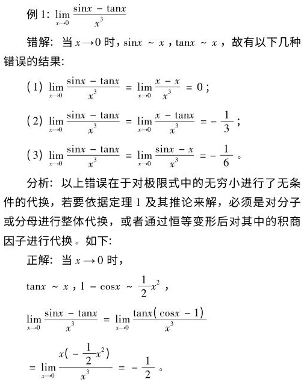
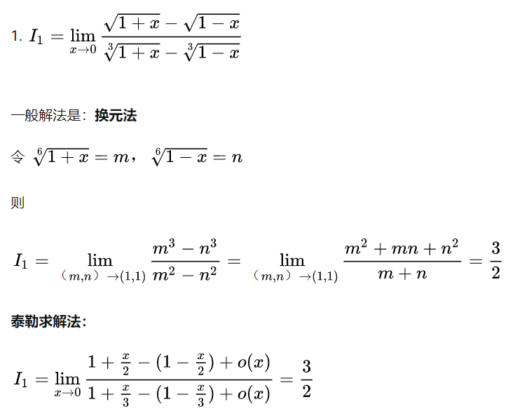

# 极限

题型（特征）$\Leftrightarrow $ 解法（思路）

## 概念相关

1. 极限定义：任意正数的范围界定必须满足无穷小
2. 极限存在：左右极限存在且相等
3. 证明局部有界性（不存在无穷大）：只需证明区间上下界存在极限以及区间内间断点（主要是未定义点）存在极限
   - 如果一个函数中包含多个不同的函数，则其中本身有界的函数（sinx、cosx等）可以直接排除在外
4. 由某点的导数判断局部信息的正确性：
   - 将导数扩展为定义形式（极限）
   - 仅凭一个点的导数无法判断局部的单调性

## 计算相关

### 数列求极限

1. 数列通项由n项多项式组成：

   - 放缩数列通项+夹逼准则

     - 放缩方法：
       - n为无穷大时：$n\times u_{min}≤u_{1}+u_{2}+...+u_{n}≤n\times u_{max}$
       - n为有限数时：$1\times u_{max}≤u_{1}+u_{2}+...+u_{n}≤n\times u_{max}$

     - 扩展：极限为一个多项函数
       - 根据函数中各项起决定性作用（在该区间内该项始终最大）的区间将函数分段
       - 在各段内按放缩的第二种方法处理

   - 根据定积分的定义将极限转化为定积分求解

2. 数列通项由递推关系式给出：

   - 利用"单调有界必有极限"
     - 先证明单调性，即$x_{k+1}-x_{k}$是大于还是小于0；
     - 再通过对递推公式进行放缩来证明该数列有界；
     - 此时数列必有极限，则可以直接令极限为x并代入递推式转化为方程来求解，若结果有多个，则需要通过保号性剔除掉无用解。
   - 由递推关系式直接推导（递归到平凡解、裂项相消）出数列通项

### 函数求极限

#### 一般化简方法

- 头轻脚重：倒代换

- 根号差：有理化

- $x\to-\infty $：令x = -t，转化为$t\to + \infty $
  
  - 拓展：只要不是趋于0，一般都要转化为趋于0的形式
  
- $\frac{\infty }{\infty } $：==上下同除，转化为$\frac{0 }{0 } $== 
  - 该方法目的也和上一条一样，即==趋于常见== 
  - $\frac{0 }{0 } $一般是其它所有未定式的终极目标
  - $\infty-\infty $：想办法转化为上下式
    - 有分母则通分
    - 没分母则凑分母（提取公因式、倒代换）
  - $\infty^{0}$、$0^{0}$：自然对数代换，即 $\lim u^{v}=\lim e^{lnu^{v}}=e^{\lim vlnu}$ 
  - $1^{\infty}$：重要极限 $\lim_{x \to \infty} (1+\frac{1}{x} )^{x} =e$ 代换，即 $\lim u^{v} =e^{lim(u-1)v} $ 
    - 不能只会用结果，还要会凑出广义化的样子（尤其是对过程有要求的题）
  
- ==等价无穷小代换== 
  
  - 记住常用的等价无穷小
  
  - 乘除式均可使用等价无穷小代换，加减式在最高阶次为1时能用
  
       
  
  - 当目标形似常用的等价无穷小，就应该想办法将其==凑出可以代换的样子== 
  
  - 广义化⭐：在等价无穷小（比如sin狗\~狗）中，==狗可以是任何趋于0的式子== 
  
- ==洛必达法则==
  
  - 适用于==无穷小之比==和==无穷大之比==
  - 式子中==包含积分== 
  - 上下求导容易
  
- $\lim_{x \to 0^{+} } x^{x}=1$

- ==提取公因式==并将公因式脱离原极限单独计算，以简化原极限

#### 泰勒展开式

1. 泰勒展开式一般写为 $f(x)=···+Ax^{n}+o(x^{n})$ ：
   - $o(x^{n})$表示比$x^{n}$高阶的所有式子的总和；
   - 只要$x^{n}$->0，则必有$o(x^{n})$->0，这也是泰勒展开式可以只写部分式子的原因；
   - 等价无穷小是泰勒展开式展开到1阶时的特例（此时o(x)->0）。
   
2. 广义化：泰勒展开式中的x可以是任何趋于0的式子。

3. 求极限时函数应展开到几阶？

   - 总原则：必须展开到与当前式子最高阶n同阶；
     - 小于n阶的项：不能保证n阶变量趋于0时变为0，故应该展开；
     - 等于n阶的项：与n阶变量同时趋于0，也应该展开；
     - 大于n阶的项：即余项，必定在n阶变量趋于0时变为0，故不必展开。

   - A/B型：上下同阶；
   - A-B型：系数不相等的最低阶。

4. 展开式本身带有平方，则计算后大于最高阶的部分可以归入余项。
   - 拓展：由展开式计算所得的超阶部分可归入余项。

#### 换元法

  

#### 夹逼准则

1. 取整函数：x-1<[x]≤x

#### 其它题型

1. 由某一极限a求另一极限b
   - a已知，一般化简可得b
   - a仅存在，则必为常数，可通过乘上变量（极限变为0）转化为上一题
2. 已知极限求参数
   - 展开后，令常数项（或上下同阶项系数）等于极限的值，而其余项等于0，解出即可
   - 若$\lim\frac{f(x)}{g(x)} =c(c\ne0)$，则$\lim f(x)=0\Leftrightarrow\lim g(x)=0$ 
3. 无穷小比阶

   - 化为极限的形式求解
   - 当f(0)=1时，$\int_{0}^{x} f(t)dt \sim x$ 
   - 比较多个无穷小量的阶数
     - 通过泰勒公式和等价代换转化为幂形式
     - ==结果为多项相加，阶数由最低阶项决定== 
     - ==结果为多项相乘，阶数为各项阶次的累加== 
     - ==积分的阶数=(原函数的阶次+1)×上界阶次==（假定下界为常数）

   - 已知等式以及两边的阶次，求其中的参数
     - 通过泰勒公式展开成幂形式
     - 根据平衡性，建立关于系数的等式
4. 当需要将一个极限拆成多个极限的和差积商时要考虑各极限的存在性
5. 极限函数考虑==分段处理== 
   - 这类函数看似多种情况杂糅在一起，但只需划分区间，这些情况就界限分明了
6. 极限的形式为f(a)-f(b)，可以考虑使用拉日中值定理进行转化。
7. 极限的形式为$(1+x^{n})^{a}(x\to ∞)$，可以通过提取$x^{n}$到外部化为可泰勒展开的形式$x^{an}(\frac{1} {x^{n}}+1)^{a}$ 

### 函数连续性

1. 用分段函数举反例
2. 间断点只需考虑函数的无定义点、分段点
3. 考察单侧极限

#### 零点定理

对于无法直接求取的零点，采用零点定理来证明其存在。

#### 间断点相关

f(x)存在间断点$x_{0}$必是以下三种情况之一：

- 在$x=x_{0}$无定义：
  - $\lim_{x \to x_{0}}f(x)=∞$（无穷间断点）
  - $\lim_{x \to x_{0}}f(x)$振荡不存在（振荡间断点）
- 在$x=x_{0}$有定义，$\lim_{x \to x_{0}}f(x) $不存在（左右极限存在但不相等 => 跳跃间断点）
- 在$x=x_{0}$有定义，$\lim_{x \to x_{0}}f(x)≠f(x_{0})$（可去间断点）

（左右极限存在的都是第一类间断点，其余为第二类间断点）

#### 连续的几种证明方式

1. $lim_{x\to x_{0}}f(x)=f(x_{0})$
2. $lim_{Δx\to 0}[f(x+Δx)-f(x)]=0$
   - 因为要证明的极限为0，所以可以在式子两端加绝对值并用夹逼准则来证明：0≤|f(x+Δx)-f(x)|