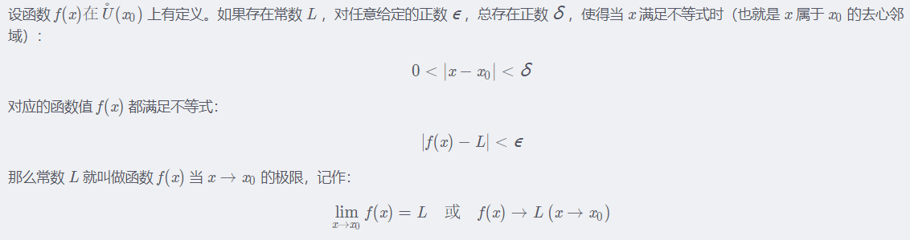
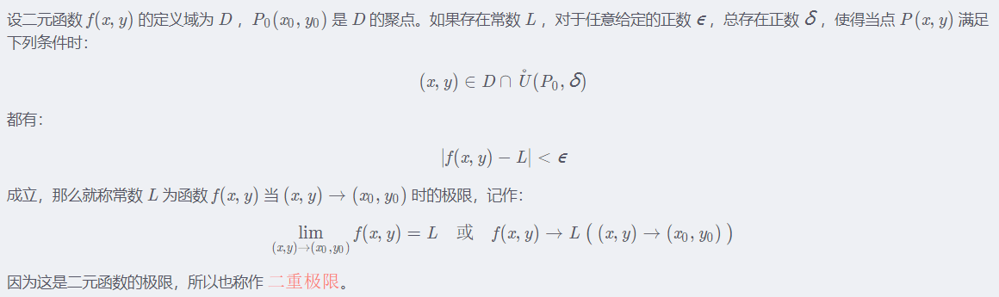
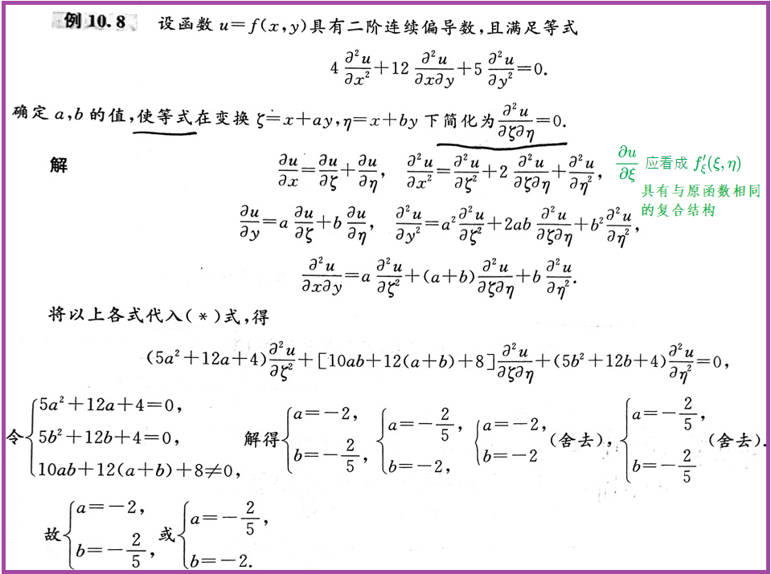

# 多元函数微分学

## 平面点集

1. 平面点集：坐标平面上具有某种性质的点的集合。

2. 点$P_{0}$的$\delta$邻域：$U(P_{0},\delta)=\{P||PP_{0}|<\delta\}$；点$P_{0}$的去心$\delta$邻域：$U(P_{0},\delta)=\{P|0<|PP_{0}|<\delta\}$。

3. 内/外点：点P的某一邻域都在点集E里面，则P是E的内点；点P的某一邻域都在点集E外面，则P是E的外点。

   边界点：点P的任一邻域一部分在点集E外面，一部分在E里面，则P是E的边界点。E的边界点的全体称为E的边界。

   聚/孤立点：点P的任一去心邻域总有点集E中的点，则P是E的聚点；点P的某一邻域仅有P属于点集E，则P是E的孤立点。内点都是聚点，边界点要么是聚点，要么是孤立点。

4. 开/闭集：点集E的点都是E的内点，则称E为开集；边界点都是点集E的点，则称E为闭集。

   连通集：点集E内任意两点均可用折线连接，且折线上的点都属于E，则称E为连通集。

   开/闭区域：连通的开集称为开区域；连通的闭集称为开区域。

   单/多连通区域：点集E内任一简单闭曲线的内部还在E内，则称E为单连通区域，否则为多连通区域。

   有/无界集：点集E在原点的某一邻域内，则称E为有界集，否则为无界集。

## 二元函数

### 二重极限

$\lim_{(x,y) \to (x_{0},y_{0})} f(x,y)=A$ 

1. $(x,y)$是以任何方式趋于$(x_{0},y_{0})$。如果$(x,y)$以某一特殊方式趋于$(x_{0},y_{0})$，即使f(x,y)无限趋近于某一确定值，也不能断定极限存在；如果$(x,y)$以不同方式趋于$(x_{0},y_{0})$，f(x,y)趋于不同的值，则可以断定极限不存在。

5. 极限定义的理解：

   ① 一元函数极限：不管$\epsilon $如何变化，总能找到某个$x_{0}$的去心邻域上的函数值满足不等式。

   

   ② 二元函数极限：不管$\epsilon $如何变化，总能找到某个$P_{0}$的去心邻域上的函数值满足不等式。

   

### 连续性

$\lim_{(x,y) \to (x_{0},y_{0})} f(x,y)=f(x_{0},y_{0})$

1. 连续函数：定义域上的每一点都连续
2. 间断点：定义域上不连续的点
3. 多元连续函数的和、差、积、商（分母不为0）、复合仍为连续函数。
4. 一切多元初等函数均在定义域内连续，且任一点的极限值为该点的函数值。
5. 有界性与最值定理：有界闭区域上的连续函数必定有界，且能取到最值。
6. 介值定理：有界闭区域上的连续函数可取得介于最值之间的任意值。

### 偏导数

只让f(x,y)的自变量x变化，而y固定(看做常数)，此时它就是x的一元函数，对x的导数就称为f(x,y)对x的偏导数：
$$
\frac{\partial z}{\partial x} =f'_{x}(x,y)=\lim_{Δx \to 0} \frac{f(x+Δx,y)-f(x,y)}{Δx}=\lim_{x \to x_{0}} \frac{f(x,y)-f(x_{0},y)}{x-x_{0}}
$$

1. 偏导数的记号$\frac{\partial z}{\partial x}$是一个整体记号，不能看做分子与分母之商，这与$\frac{dy}{dx} $不一样。

2. 与连续性的关系：连续不一定有偏导，偏导存在不一定连续。

3. 几何意义：某一截面上曲线的斜率。

4. 高阶偏导数：偏导的偏导的偏导的......

5. 二阶混合(两次偏导的自变量不一样)偏导在连续的条件下与求导次序无关。

6. ==对称性：两个自变量对调位置后仍表示原来的函数。此时对两个自变量求偏导的结果一样，仅仅记号不同。== 

### 全微分

1. 自变量的微分：dx=Δx，dy=Δy

2. 偏增量和偏微分

   $f(x+Δx,y)-f(x,y)=f_{x}(x,y)Δx（Δx\to 0）$

   $f(x,y+Δy)-f(x,y)=f_{y}(x,y)Δy（Δy\to 0）$

2. 全增量和全微分

   可微分：$Δz=f(x+Δx,y+Δy)-f(x,y)=AΔx+BΔy+o(\rho)（\rho=\sqrt{(Δx)^{2}+(Δy)^{2}} ）$

   全微分：$dz=AΔx+BΔy=\frac{\partial z}{\partial x}dx+\frac{\partial z}{\partial y}dy=Δz（\rho\to 0）$

   实际意义：用全微分代替全增量，且误差只有$o(\rho)$ 

3. 全微分的充分必要条件：

   - 可微分则偏导存在，偏导存在则不一定可微分
   - 偏导存在且连续则可微分

## 求导法则

### 复合函数求导法则

1. 链式求导法则：（假设求复合函数z=f(x,y)对某一变量m的导数）

   $\frac{\partial z}{\partial m}= 由z对中间变量x求偏导·由x对目标变量m求复合导+由z对中间变量y求偏导·由y对目标变量m求复合导$

2. 具体应用

   - 中间变量均为一元函数的情形：z=f(u,v)，u=m(t)，v=n(t)

     $\frac{dz}{dt} =\frac{\partial z}{\partial u} \frac{du}{dt} +\frac{\partial z}{\partial v} \frac{dv}{dt}$

   - 中间变量均为多元函数的情形：z=f(u,v)，u=m(x,y)，v=n(x,y)

     $\frac{\partial z}{\partial x} =\frac{\partial z}{\partial u}\frac{\partial u}{\partial x}+\frac{\partial z}{\partial v}\frac{\partial v}{\partial x}$，$\frac{\partial z}{\partial y} =\frac{\partial z}{\partial u}\frac{\partial u}{\partial y}+\frac{\partial z}{\partial v}\frac{\partial v}{\partial y}$

   - 部分自变量不是中间变量的情形：z=f(u,x,y)，u=m(x,y)

     $\frac{\partial z}{\partial x} =\frac{\partial f}{\partial u}\frac{\partial u}{\partial x}+\frac{\partial f}{\partial x}$，$\frac{\partial z}{\partial y} =\frac{\partial f}{\partial u}\frac{\partial u}{\partial y}+\frac{\partial f}{\partial y}$

3. 多元复合函数的微分性质：全微分形式的不变性。

4. 链式求导法则对于任何函数都是适用的。

### 隐函数求导法则

1. 隐函数存在定理1：

   - 条件：① F(x,y)在点$P(x_{0},y_{0})$的某一邻域具有连续的偏导数；② $F(x_{0},y_{0})=0$；③ $F_{y}(x_{0},y_{0})≠0$

   - 结论：方程F(x,y)=0可以在点$P(x_{0},y_{0})$的某一邻域唯一确定一个连续且具有连续导数的函数y=f(x)，且有
     $$
     \frac{dy}{dx}=-\frac{F_{x}}{F_{y}}
     $$

2. 隐函数存在定理1：

   - 条件：① F(x,y,z)在点$P(x_{0},y_{0},z_{0})$的某一邻域具有连续的偏导数；② $F(x_{0},y_{0},z_{0})=0$；③ $F_{z}(x_{0},y_{0},z_{0})≠0$

   - 结论：方程F(x,y,z)=0可以在点$P(x_{0},y_{0},z_{0})$的某一邻域唯一确定一个连续且具有连续偏导数的函数z=f(x,y)，且有
     $$
     \frac{\partial z}{\partial x} =-\frac{F_{x}}{F_{z}}，\frac{\partial z}{\partial y}=-\frac{F_{y}}{F_{z}}
     $$

3. 举例说明：讨论$F(x,y,z)=x^{2}+y^{2}+z^{2}=0$可以在(1,1,0)确定几个连续且具有连续偏导数的函数？

   - $F_{x}'=2x，F_{y}'=2y，F_{z}'=2z$

   - $F_{x}'(1,1,0)=2，F_{y}'(1,1,0)=2，F_{z}'(1,1,0)=0$

   - 因此可以确定x=f(y,z)和y=f(x,z)两个函数，但不能确定z=f(x,y)

## 极值和最值

1. 极值：在点P的某个去心邻域内z(P)最大/小，则z(P)为极大/小值，而P为极大/小值点。

   最值：在定义域内z(P)最大/小，则z(P)为最大/小值，而点P为最大/小值点。

2. 极值存在的条件

   - 必要条件：z=f(x,y)在点$(x_{0},y_{0})$可偏导且有极值，则该点的各个偏导均为0
     
   - 驻点：使各个偏导同时为0的点，但不一定是极值点
     
   - 充分条件：假设z=f(x,y)在点$(x_{0},y_{0})$的某邻域内连续且具有一阶及二阶连续偏导

     ① $f_{x}(x_{0},y_{0})=0，f_{y}(x_{0},y_{0})=0$

     ② $f_{xx}(x_{0},y_{0})=A，f_{xy}(x_{0},y_{0})=B，f_{yy}(x_{0},y_{0})=C$

     - $AC-B^{2}>0$：有极值，A<0是极大值，A>0是极小值

     - $AC-B^{2}<0$：无极值

     - $AC-B^{2}=0$：不确定，需另作讨论

3. 极值的求解过程：① 解方程求驻点；② 写出A、B、C；③ 根据定理进行讨论

   （当然偏导数不存在的点也有可能是极值点，所有这些可能是极值的点统称为可疑点）

4. 最值得求解过程：① 求出所有可疑点的函数值；② 求出边界上的最值；③ 比较所有函数值，最大者为最大值，最小者为最小值（在实际问题中，如果可以确定最值在内部取得且只有一个驻点，则可以判定该驻点就是最值）

5. 条件极值：求目标函数u=f(x,y,z)在条件$\left\{\begin{matrix}\varphi(x,y,z)=0
   \\\psi(x,y,z)=0
   \end{matrix}\right.$下的极值

   （① 通过回代转化为无条件极值来求解；② 采用拉格朗日乘数法来求解（如下所示））

   - 构造辅助函数：$F(x,y,z,a,b)=f(x,y,z)+a\varphi(x,y,z)+b\psi(x,y,z)$
   - 解方程组：$\left\{\begin{matrix}F_{x}'=f_{x}'+a\varphi _{x}'+b\psi _{x}'
      \\F_{y}'=f_{y}'+a\varphi _{y}'+b\psi _{y}'
      \\F_{z}'=f_{z}'+a\varphi _{z}'+b\psi _{z}'
      \\F_{a}'=\varphi(x,y,z)=0
      \\F_{b}'=\psi(x,y,z)=0
     \end{matrix}\right.$

   - 由方程组解出的所有点(x,y,z)就是f(x,y,z)在附加条件下的可能极值点

   - 如果求最值，则取其中最大/小者，然后由实际问题可知必存在最值，所得即所求

# 相关题型总结

##  概念相关

1. 用定义证明二重极限：

   - 原理解释：给出任意正值$\varepsilon$，你要找到一个局限于$\delta$的邻域$(0<\sqrt{(x-a)^{2}+(y-b)^{2}}<\delta)$ ，使得在这个邻域内的点都能使得式子$|f(x)-A|$的值比给出的值小。因为只是让$|f(x)-A|<\varepsilon $，所以可以放大$|f(x)-A|$，让放大后的式子小于$\varepsilon$也是可以的（放大后还比$\varepsilon$小，我当然比$\varepsilon$小），即$|f(x)-A|<(放大后的式子)<\varepsilon$，从而将问题转为找到一个邻域里的点使得放大后式子的值小于$\varepsilon$。

   - 举例说明：$已知f(x,y)=(x^{2}+y^{2})sin\frac{1}{x^{2}+y^{2}}，证明\lim_{(x,y) \to (0,0)} f(x,y)=0$

     ① 将式子放大$|f(x,y)-0|≤x^{2}+y^{2}$，所以要满足的式子变为$x^{2}+y^{2}<\varepsilon$（⭐）

     ② 假设我找到的邻域为$0<\sqrt{x^{2}+y^{2}}<\delta$，要使该邻域的点满足⭐式，$\delta$只需等于$\sqrt{\varepsilon}$ 

2. 求二元函数的极限：

   - 一元函数的极限运算法则对于多元函数仍然使用，为此需要将两个自变量凑成一个整体。
   - 如果二重极限的趋向只涉及其中一个变量，则可以把另一个变量看成是常数。
- 一个较为万能的二重极限求解方法：极坐标代换法（令x=rcosθ，y=rsinθ）。
  
3. 已知$f'_{x}(x,y)<0$，$f'_{y}(x,y)>0$，为了使$f(x_{1},y_{1})<f(x_{2},y_{2})$成立，$x_{1}$和$x_{2}$以及$y{1}$和$y{2}$之间的大小应如何？

   解：$x_{1}>x_{2}$，$y{1}<y{2}$（重点在于搭建桥梁：$f(x_{1},y_{1})<f(x_{1},y_{2})<f(x_{2},y_{2})$）

4. 已知二元函数，判断函数或偏导函数的极限存在性、连续性和可微性。

   - 判断极限存在性：极坐标代换法、以特定趋向路径求极限、直接求极限

   - 判断函数的连续性：定义法（$lim_{(x,y)\to(x_{0},y_{0})}f(x,y)=f(x_{0},y_{0}$)）

   - 判断偏导函数的连续性：

     ① 用定义法求 $f'_{x}(x_{0},y_{0})$，$f'_{y}(x_{0},y_{0})$；

     ② 求偏导函数并作极限 $\lim_{(x,y)\to(x_{0},y_{0})} f'_{x}(x,y)$，$\lim_{(x,y)\to(x_{0},y_{0})} f'_{y}(x,y)$；

     ③ 对比两者的值是否相等，若相等则连续，否则不连续（极限不存在也说明不连续）。

   - 判断函数的可微性（定义法）：

     ① 写出全增量$Δz=f(x_{0}+Δx,y_{0}+Δy)-f(x_{0},y_{0})$；

     ② 写出线性增量$dz=f'_{x}(x_{0},y_{0})dx+f'_{y}(x_{0},y_{0})dy$；

     ③ 作极限 $\lim_{Δx \to 0,Δy \to 0} \frac{Δz-dz}{\sqrt{(Δx)^{2}+(Δy)^{2}}} $；

     ④ ==极限为0==（即误差是比$\rho$高阶的无穷小）说明可微，否则不可微。

5. 通过定义法求高阶偏导数：比如求$f''_{xy}(0,0)$，须先求$f'_{x}(0,y)$，再求$f''_{xy}(0,0)$。

6. 用全微分判断函数的全增量变化趋势。

## 偏导数相关

1. 复合函数求偏导

   - 假设z=f(u,v)，u=x+y，v=x+y，求$\frac{\partial^{2}y}{\partial x^{2}}$：（注意求导后的新函数具有与原函数完全相同的复合结构）

     ① $\frac{\partial z}{\partial x}=\frac{\partial z}{\partial u}+\frac{\partial z}{\partial v}$ 

     ② $\frac{\partial^{2}z}{\partial x^{2}}=\frac{\partial \frac{\partial z}{\partial u}}{\partial x} +\frac{\partial \frac{\partial z}{\partial v}}{\partial x}=\frac{\partial \frac{\partial z}{\partial u}}{\partial u}\frac{\partial u}{\partial x}+\frac{\partial \frac{\partial z}{\partial u}}{\partial v}\frac{\partial v}{\partial x}+\frac{\partial \frac{\partial z}{\partial v}}{\partial u}\frac{\partial u}{\partial x}+\frac{\partial \frac{\partial z}{\partial v}}{\partial v}\frac{\partial v}{\partial x}= \frac{\partial^{2} z}{\partial u^{2}}+ \frac{\partial^{2} z}{\partial u\partial v}+ \frac{\partial^{2} z}{\partial v^{2}}+ \frac{\partial^{2} z}{\partial v\partial u}$

   - 举例说明：

2. 隐函数求偏导

   - 如果隐函数确定的函数是求导的目标函数，则可以使用==隐函数存在定理==来求导
   
   - 如果隐函数确定的函数不是求导的目标函数，则一般使用==两边求导法==（万能）来求导
   
   - 也可以通过==两边求全微分==来得到所确定函数的多个偏导数，此时需要用到和差积商的微分法则：
   
     $d(u±v)=du±dv，d(uv)=vdu+udv，d(\frac{u}{v})=\frac{vdu-udv}{v^{2}}，d(Cu)=Cdu$
   
3. ==与偏导数相关的微分方程==：积分法

   - 由$\frac{\partial^{2}z}{\partial x\partial y} =x+y$求z=f(x,y)：

     ① 两边对y积分：$\frac{\partial z}{\partial x} =\int(x+y)dy=xy+\frac{y^{2}}{2}+m_{1}(x)$（对y求导时x被看作常数，因此逆导时就要添加$m_{1}(x)$）

     ② 两边对x积分：$z=\int(xy+\frac{y^{2}}{2}+m(x))dy=\frac{yx^{2}}{2}+\frac{y^{2}}{2}x+m(x)+n(y)$（同理须添加n(y)，由于$m_{1}(x)$是未知的，逆导后还是未知的，所以只需变换记号）

   - 由$\frac{\partial f}{\partial x} =-f$求f(x,y)：

     ① 移项得：$\frac{1}{f}\frac{\partial f}{\partial x} =-1$

     ② 两边对x积分：$\int \frac{1}{f}\frac{\partial f}{\partial x}dx=\int\frac{1}{f}df=ln|f|=-x+C(y)$

     ③ 化简得：$f=±e^{-x+C(y)}=C_{1}(y)e^{-x}$（$C_{1}(y)=±e^{C(y)}$）
     
   - ==积分法分为两种：① 仅添加积分符号$\int$（对两边积分）；② 添加积分符号$\int$和微分符号dx（两边对x积分）== 

## 极/最值相关

1. ==无条件极值==

   - 一般分为求隐函数的无条件极值和求显函数的无条件极值两种题目。
   - 如果某驻点P的判别式AC-B²=0，则无法判断该点是否为极值。此时一般可以限制点P的邻域在一定的范围内，然后取该邻域内2个分别大于和小于f(P)的特殊函数值来证明该点不是极值。比如假设驻点为(0,0)，则可界定邻域为$x^{2}+y^{2}<\delta ^{2}<1$，取特殊函数值为$f(\varepsilon,-\varepsilon )、f(\varepsilon,\varepsilon )$（$0<\varepsilon<1$），然后进行判断。

2. ==条件极值==（18讲P199范例10.20）：

   - ==约束条件为闭区域边界==（即条件为等式）：
     
     - 拉格朗日乘数法：需要注意拉格朗日乘子取0时可能有特殊解
     - 凑原函数法：通过拉格朗日乘数法列出方程组后，由这些方程凑出原函数的形式
   - 转化为无条件极值：即将条件直接代入原函数中进行求解（有时候代入原函数后不必展开，而是将求偏导的式子与条件构成方程组进行求解）
     
   - ==约束条件为整个闭区域==（即条件为不等式）：

     ① 在闭区域内部用无条件极值的方法求出所有可疑点的函数值；

     ② 在闭区域边界上用第一类型的方法求出边界上的最大值和最小值；

     - 如果有多个边界条件则应分别代入，然后分别求出各个边界上的最大值和最小值（注意极值点和端点以及其它可疑点），取其中的最大者和最小者（因为边界条件为不等式，所以边界方程之间并不要求同时成立，也因此要分别单独进行计算）

     ③ 比较各个函数值，最大/小者为最大/小值。

3. ==利用条件极值证明不等式== 

   举例说明：证明$\frac{x^{n}+y^{n}}{2} ≥(\frac{x+y}{2} )^{n}$，其中n为正整数且a,b>0。

   证明过程：增设条件x+y=a，使得原问题转化为求$f(x,y)=\frac{x^{n}+y^{n}}{2}$在条件x+y=a下的最小值。

   原理说明：该解法的本质就是构造函数求最小值，而且该最小值必须包含x+y，所以需要添加条件x+y=a。

## 全微分相关

1. 已知全微分求原函数（即特殊的解微分方程）

   举例说明：已知dz=2xdx+2ydy，求z=f(x,y)

   - 方法一：==利用全微分定义==$dz=\frac{\partial z}{\partial x} dx+\frac{\partial z}{\partial y}dy$

     ① 由全微分定义可知：$\frac{\partial z}{\partial x}=2x，\frac{\partial z}{\partial y}=2y$；

     ② 在$\frac{\partial z}{\partial x}=2x$两边对x求积分：$f(x,y)=x^{2}+C(y)$

     ③ 求f(x,y)对y的偏导：$f'_{y}=C'(y)=2y$

     ④ 在$C'(y)=2y$两边对y积分：$C(y)=y^{2}+c$

     ⑤ 综上可得：$f(x,y)=x^{2}+y^{2}+c$

   - 方法二：==直接在两边求积分==，可得$z+c=x^{2}+C_{1}(y)+y^{2}+C_{2}(x)$

2. 利用全微分快速求复合函数的偏导数

   举例说明：求z=f(xy,x+y)的一阶偏导数。

   ① 令 $u=xy，v=x+y$，则 $dz=u'du+v'dv$

   ② 由上式推得：$dz=f'_{1}d(xy)+f'_{2}d(x+y)$

   ③ 由上式推得：$dz=f'_{1}(ydx+xdy)+f'_{2}(dx+dy)$

   ④ 经整理并与全微分定理对比即可得到相应的偏导

3. 由隐函数求全微分

   - 方法一：根据全微分定义对隐函数求偏导即可

   - 方法二：直接对隐函数两边求微分，比如求隐函数$z+x+y+e^{x+y+z}=0$的dz

     $z+x+y+e^{x+y+z}=0$

     $\Rightarrow dz+dx+dy+de^{x+y+z}=0$

     （==将$e^{x+y+z}$看成是三元函数f(x,y,z)进行求全微分==，此时z应看成是与x和y无关的自变量，于是得以下结果）

     $\Rightarrow dz+dx+dy+e^{x+y+z}(dx+dy+dz)=0$

     （若将$e^{x+y+z}$看成是二元函数f(x,y)进行求全微分，则得以下结果）

     $\Rightarrow dz+dx+dy+e^{x+y+z}[(1+z'_{x})dx+(1+z'_{y})dy]=0$ 

# 注意事项

1. $\lim_{y \to +∞} ysin\frac{Πx}{y} =\lim_{y \to +∞} \frac{sin\frac{Πx}{y}}{\frac{1}{y} }=Πx $
2. 求高阶偏导时，如果题给条件包括"高阶偏导连续"，则需要注意合并高阶混合偏导
3. 在计算偏导的过程中一般能化简就化简
4. $y'=y\Rightarrow \frac{1}{y} y'=1\Rightarrow\int\frac{1}{y} y'dx=\int 1dx\Rightarrow ln|y|=x$
5. $x^{3}=x\Rightarrow x=±1,0$ 
6. 已知$f''(x)+\frac{f'(x)}{x}=0$，求f(x)
   - 方法一：由于$(xf'(x))'=xf''(x)+f'(x)$，因此对原式两边乘以x后求积分得$xf'(x)+C=0$（这里不能看到$(xf'(x))'$等于$xf''(x)+f'(x)$，就直接认为$xf'(x)=0$，因为也有可能是$(xf'(x)+C)'$，因此一定不能忘记添加常数项）......
   - 方法二：令f'(x)=g(x)，则原式变成$g'(x)+\frac{g(x)}{x}=0$......
7. 求偏导函数在某点的取值，对于不涉及求偏导的变量可以直接先代入值。