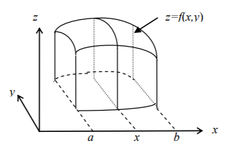
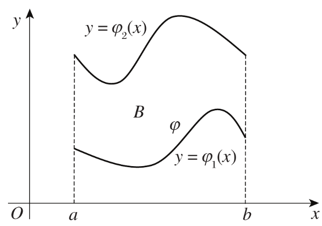
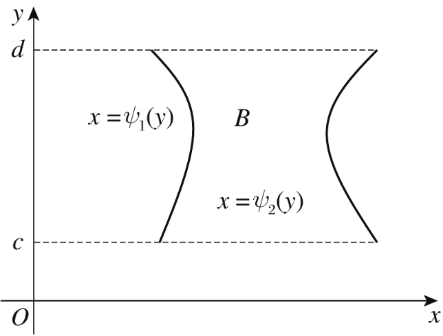
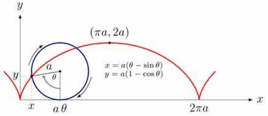

# 二重积分

## 基本概念

2. 定义：$\iint_{D}f(x,y)d\sigma =\lim_{\lambda\to 0} \sum_{i=1}^{n} f(\xi_{i},\eta_{i})Δ\sigma_{i}=\iint_{D}f(x,y)dxdy（\lambda为各小区域直径中得最大值）$

2. 几何意义：以D为底，以曲面f(x,y)为顶的曲顶柱体的体积。

3. 二重积分的存在性（可积性）

   - 二元函数在D上连续=>可积
   - 二元函数在D上有界且仅有有限个点和有线条光滑曲线是不连续的=>可积

   （其中D是由一条或几条逐段光滑闭曲线所围成的有界闭区域）
   
5. 定积分是一个数，二重积分也是一个数。

## 二重积分的性质

1. 求区域面积：即被积函数为1的二重积分
2. 可积函数必有界
3. 积分的线性性质：系数可提取，加减可分离
4. 积分区域的可加性
5. 积分的保号性：函数值大的积分必然大；$|\iint_{D}f(x,y)d\sigma| ≤\iint_{D}|f(x,y)|d\sigma$
6. 二重积分的估值定理：mA≤二重积分≤MA
7. 二重积分的中值定理：二重积分=某点函数值·A

## 积分区域的对称性

1. ==普通对称性==：

   假设积分区域关于x或y轴对称，则有

   $\iint_{D}f(x,y)dxdy=\left\{\begin{matrix}2\iint_{D_{1}}f(x,y)dxdy，对称点函数值相等
    \\0，对称点函数值相反
   \end{matrix}\right.$（$D_{1}$是其中对称的一半区域）

2. ==轮换对称性==：

   如果将x与y对调后，积分区域不改变（即积分区域关于y=x对称），则有

   $\iint_{D}f(x,y)dxdy=\iint_{D}f(y,x)dydx$（即对调前后的二重积分相等）
   
3. 不局限于上述2种对称性，具体问题具体画图分析，比如：

   ① 积分区域关于$y=x$对称，若$f(x,y)=-f(-x,-y)$，则$\iint_{D}f(x,y)dxdy=0$

   ② 若D关于直线x=a对称（对称点为(2a-x,y)和(x,y)），则$\iint_{D}(x-a)dxdy=0$

## 二重积分的计算

总体来说就是将二重积分化为两次定积分来计算。

### 直角坐标系下的计算法

第一次定积分求截面积，第二次定积分求截面积的累积。

1. ==D为X型区域==：沿y轴方向与边界相交不多于两点（先y再x）

   

   $\iint_{D}f(x,y)d\sigma=\int_{a}^{b} dx\int_{\varphi_{1}(x)}^{\varphi_{2}(x)}f(x,y)dy$，其中$\varphi_{1}(x)≤y≤\varphi_{2}(x)$，a≤x≤b

2. ==D为Y型区域==：沿x轴方向与边界相交不多于两点（先x再y）

   

   $\iint_{D}f(x,y)d\sigma=\int_{c}^{d} dy\int_{\psi_{1}(y)}^{\psi_{2}(y)}f(x,y)dx$，其中$\psi_{1}(x)≤x≤\psi_{2}(x)$，c≤y≤d

3. 注意事项

   - 此处计算两次定积分的下限都必须小于等于上限。
   - 先对y再对x积分：先把x看成常数，把f(x,y)只看做y的函数，然后对y计算定积分；然后把算得的结果（即x的函数）对x计算定积分。
   - 如果积分区域既不是X型区域，也不是Y型区域，则需要将积分区域分成几个部分，使得各个部分是X型区域或Y型区域，然后利用积分区域的可加性进行计算。
   - ==如果积分区域既是X型区域，也是Y型区域，则可以交换积分次序且积分结果相同。== 
   - 积分限的确定：① 画出积分区域（X型）；② 在[a,b]内任取一个x值；③ 以该x值为横坐标找到上下边界的纵坐标。

### 极坐标系下的计算法

1. 二重积分从直接坐标变换到极坐标的公式：

   $\iint_{D}f(x,y)dxdy=\iint_{D}f(\rho\cos\theta,\rho\sin\theta)\rho d\rho d\theta$（其中 $dxdy=\rho d\rho d\theta$，$x=\rho\cos\theta$，$y=\rho\sin\theta$）

2. 计算极坐标形式的二重积分的三种方法：

   - 极点在积分区域外：$\int_{\alpha }^{\beta }d\theta\int_{\psi_{1}(\theta)}^{\psi_{2}(\theta)}f(\rho\cos\theta,\rho\sin\theta)\rho d\rho $
   - 极点在积分边界上：$\int_{\alpha }^{\beta }d\theta\int_{0}^{\psi(\theta)}f(\rho\cos\theta,\rho\sin\theta)\rho d\rho $
   - 极点在积分区域内：$\int_{0}^{2Π }d\theta\int_{0}^{\psi(\theta)}f(\rho\cos\theta,\rho\sin\theta)\rho d\rho $

   （极点就是极坐标原点；此处定积分的下限均小于等于上限）

3. 注意事项：

   - 积分限的确定与直角坐标系完全类似。
   - 极坐标系下的求面积公式变为：$\sigma =\iint_{D}\rho d\rho d\theta$。
   - 一般极坐标系的积分次序都是先积$\rho$再积$\theta$，但反过来也可以。
   - 二重积分从直接坐标变换到极坐标时，也需要注意积分限的变换。
   - 若被积函数为$f(x^{2},y^{2})、f(\frac{x}{y})、f(\frac{y}{x})$等形式，且积分区域是圆或圆的一部分，则应优先考虑极坐标系。

# 题型总结

## 与概念相关的综合题

1. 须将二重积分看做常数的问题：

   举例说明：已知$f(x,y)=g(x,y)+A\iint_{D}f(x,y)dxdy$，求f(x,y)

   解题过程：将$\iint_{D}f(x,y)dxdy$看成一个常数，对两边求二重积分即可

2. 与划分积分区域相关的问题：

   - 如果被积函数为分段函数，则需要根据分段曲线或分段点划分积分区域

   - 如果积分区域不是X型和Y型，则需要划分积分区域为几个部分且各个部分为X型或Y型

   - 如果边界函数为分段函数，则需要根据分段点划分积分区域，比如

     $\iint_{D}f(x,y)dxdy=\int_{0}^{\frac{Π}{4} } d\theta\int_{0}^{\frac{r}{cos\theta } }f(\rho\cos x,\rho\sin y)\rho d\rho+\int_{\frac{Π}{4}}^{\frac{Π}{2}} d\theta\int_{0}^{\frac{r}{sin\theta } }f(\rho\cos x,\rho\sin y)\rho d\rho$ 

     其中$D=\{(x,y)|0<x<r,0<y<r\}$ 

3. 计算包含二重积分的极限：

   - 利用二重积分的保号性、估值定理或中值定理进行==放缩=>夹逼准则==

   - 利用==洛必达法则==消除二重积分（特别是被积函数复杂且没有好的放缩特征的时候）
     
     - 对于求导复杂或无法求导的二重积分，则应==交换积分次序==
     
   - 如果积分区域随极限的趋向变化为一点P，则可以利用==积分中值定理==直接计算出二重积分的极限
     - 使得积分中值定理成立而存在的某一点必然是积分区域中唯一的那个点
     - 这个方法同样适用于包含定积分的极限
     
   - 直接化为反常二重积分来计算：

     $\lim_{r \to+\infty} \iint_{|x|≤r,|y|≤r}(x^{2}+y^{2})e^{-x^{2}-y^{2}}d\sigma=\iint_{|x|≤+\infty,|y|≤+\infty}\rho^{3}e^{-\rho^{2}}d\rho d\theta =\int_{0}^{2Π}d\theta\int_{0}^{+∞}\rho^{3}e^{-\rho^{2}}d\rho$

4. 证明由二次积分或二重积分组成的不等式：

   - 构造函数=>求导=>证单调性
   - 化为二重积分=>轮换对称性=>直接比较、放缩法或中值定理等

   注意：① 只要式子中的变量与积分变量不同，就可以将其看做常数从而合并到或分离出被积函数；② 只要面积元素和积分区域相同，两个二重积分就可以合并；③ 积分变量的大小必然介于积分限之间：比如$\int_{0}^{t}(t-x)dx（t>0）$，则0≤x≤t，因此有$\int_{0}^{t}(t-x)dx>0$。

5. 计算被积函数为变限积分的定积分：

   - 利用分部积分法去除变限积分的积分符号
   - 化为二重积分=>交换积分次序

6. 计算n重变限积分的n阶导数：

   - 注意复合导数求导

   - 当被积函数中包含求导变量，则需要将其提取到积分外面；如果无法提取，则一般使用换元法或凑微分法，比如

     $\int_{0}^{x} tf(t^{2}+x)dt=\int_{0}^{x} \frac{1}{2}f(t^{2}+x)d(t^{2}+x)=\int_{x}^{x^{2}+x} \frac{1}{2}f(u)du$

7. 规定使用二重积分的方式计算定积分$I$：

   ① 凑出二重积分$E$的形式：$E=I×I$

   ② 计算二重积分$E$

   ③ 得出结果：$I=\sqrt{E}$

8. 积分区域为==由参数方程给出的曲线==和坐标轴围成的二重积分的计算：

   - 直接解出曲线函数y(x)来计算二重积分

   - 如果解不出y(x)，则使用==待定曲线函数法==来解题：

     举例说明：假设曲线为摆线，其参数方程为$\left\{\begin{matrix}x=t-\sin t
      \\y=1-\cos t
     \end{matrix}\right.$，求$\iint_{D}2ydxdy$

     ① 画出积分区域的大概样子并待定曲线函数为y(x)

     ② 写出二重积分并解出到包含y(x)的式子：$\iint_{D}2ydxdy=\int_{0}^{2Π}dx\int_{0}^{y(x)}2ydy=\int_{0}^{2Π}y^{2}(x)dx$

     ③ 换元x=x(t)：$\int_{0}^{2Π}y^{2}(x(t))dx(t)=\int_{0}^{2Π}y^{2}(t)x'(t)dt$

     （其中 y(x(t))=y(t)，并且注意积分限也须改变，这里积分限一样仅仅是凑巧）

     ④ 将参数方程代入即可求解：$\int_{0}^{2Π}y^{2}(t)x'(t)dt=\int_{0}^{2Π}(1-\cos t)^{3}dt$

## 积分计算相关

1. ==直角/极坐标系的二重积分计算==
   - 利用二重积分的线性性质化简积分：分离和式、提取参数；
   - 利用积分区域的对称性化简积分：看积分区域是否具有某种对称性。
     - 对于普通对称性：看被积函数互相对称的两点间是否相等或相反
     
       （如果积分区域具有对称性，但对称点之间无关系，此时可试图==凑出关系来化简积分==，比如D关于直线x=a对称，则$\iint_{D}xdxdy=\iint_{D}(x-a+a)dxdy=\iint_{D}(x-a)dxdy+\iint_{D}adxdy=0+\iint_{D}adxdy$）
     
     - 对于轮换对称性：看变量对调前后的两个函数是否可以结合化简
   
2. ==坐标系互相转化==的积分计算：看积分具有哪个坐标系的味道浓一些

3. 与==交换积分次序==相关的问题：

   - 交换积分次序的重点在于画出积分区域的范围。

   - 须交换积分次序的二重积分计算：
   
  - 通常用于被积函数作为x/y的原函数难以求得，而作为y/x的原函数容易求得；
   
    举例说明：$计算\iint_{D}e^{max\{x^{2},y^{2}\}}dxdy，其中D=\{(x,y)|0≤x≤1,0≤y≤1\}$
   
     - 若题给积分由多个积分区域的和式组成，交换次序后通常可以合并积分区域。
   
- 交换二次积分的积分次序：
  
  - 二次积分与二重积分的区别：二次积分不要求上下限之间的大小关系；二重积分须保证上限≥下限；
     - 二次积分不能直接交换积分次序，必须先转化为二重积分，再进行积分次序的交换；
  - 二次积分如何转化为二重积分：只需要将不严格的积分限改为上限大下限小的形式。
  
- ==极坐标系下交换二重积分次序：== 

  - 先θ后ρ→先ρ后θ：

    ① 让θ从负无穷开始增加，将刚进入积分区域的角度以及刚离开积分区域的角度作为对θ积分的下限和上限；

    ② 用"θ=常数"穿过积分区域，找出ρ方向的两个关于θ的边界函数，将其作为对ρ的积分上下限。

  - 先ρ后θ→先θ后ρ：(参考18讲P216例11.11)

    ① 让ρ从0开始增加，将刚进入积分区域的长度以及刚离开积分区域的长度作为对ρ积分的下限和上限；

    ② 用"ρ=常数"穿过积分区域，找出θ方向的两个关于ρ的边界函数，将其作为对θ的积分上下限。

# 注意事项

1. 估计$\iint_{D}\frac{1}{100+cos^{2}x+sin^{2}y}d\sigma$的值，其中$D=\{(x,y)||x|+|y|≤10\}$：

   （既是积分中值定理，也是积分估值定理）

   ① 积分中值定理：原式Y=$\frac{1}{100+cos^{2}a+sin^{2}b}·A$

   ②放缩法：$\frac{1}{102}≤\frac{1}{100+cos^{2}a+sin^{2}b}≤\frac{1}{100}$

   ③ 计算A的大小：A=(20×20)/2=200

   ④ 得估值结果：100/51≤Y≤2

2. 弧长=角度×半径、扇形面积=$\frac{1}{2}$×弧长×半径

3. $\int_{0}^{2Π}dx\int_{0}^{x}y\sqrt{1-x^{2}+y^{2}}dy$=$\frac{1}{2}\int_{0}^{2Π}dx\int_{0}^{x}\sqrt{1-x^{2}+y^{2}}d(1-x^{2}+y^{2})$（把x看成常数）

4. 由积分$\int_{0}^{1}dx\int_{1-x}^{\sqrt{1-x^{2}}}f(x,y)dy$判断积分区域：

   ① y方向：下限为$y=1-x$，上限为$y=\sqrt{1-x^{2}}$

   ② x方向：下限为x=0，上限为x=1

   （令$y=\rho\sin x，x=\rho\cos x$，则可以得到极坐标下的边界函数）

5. 一些反三角函数的定义域和值域：

   ① $y=\arcsin x$的定义域为$[-1,1]$，值域为$[-\frac{Π}{2},\frac{Π}{2}]$

   ② $y=\arcsin x$的定义域为$[-1,1]$，值域为$[-\frac{Π}{2},\frac{Π}{2}]$

6. $sgnx=\left\{\begin{matrix}1,x<0
    \\0,x=0
    \\-1,x<0
   \end{matrix}\right.$

7. y<x是直线y=x的下方，y>x是直线y=x的上方

8. $y^{2}<x^{2}\Rightarrow |y|<|x|\Rightarrow y<x且y>-x$

9. $若D=D_{1}+D_{2}且f(x,y)=\left\{\begin{matrix} f(x,y)，在D_{1}上
   \\-f(x,y)，在D_{2}上
   \end{matrix}\right.，则有
   \\\iint_{D} f(x,y)d\sigma =\iint_{D_{1}} f(x,y)d\sigma+\iint_{D_{2}}-f(x,y)d\sigma
   \\=\iint_{D_{1}} f(x,y)d\sigma+\iint_{D-D_{1}}-f(x,y)d\sigma
   \\=\iint_{D_{1}} f(x,y)d\sigma+\iint_{D}-f(x,y)d\sigma-\iint_{D_{1}}-f(x,y)d\sigma
   \\=2\iint_{D_{1}} f(x,y)d\sigma+\iint_{D}-f(x,y)d\sigma$

9. 求$\iint_{D}[(x-a)^{2}+(y-b)^{2}-A]d\sigma $，其中$D=\{(x,y)|(x-a)^{2}+(y-b)^{2}≤A\}$

   令$X=x-a，Y=x-b$，则原式$=\iint_{D}[X^{2}+Y^{2}-A]d\sigma$，其中$D=\{(X,Y)|X^{2}+Y^{2}≤A\}$
   
11. $\frac{a}{b}+\frac{b}{a}≥2\sqrt{\frac{a}{b}×\frac{b}{a}}=2$

12. 若$0<a<x^{2}$，则$lim_{x\to 0}\frac{a}{x}=0$，因为$(0<\frac{a}{x}<x)+$夹逼准则

13. 已知$f(0,0)=0且f'_{x}(0,0)=b$，求$\lim_{x\to 0} \frac{f(x,0)}{x}$：

     - 洛必达法则：全增量法相当于洛必达法则的复杂化

     - ==全增量法==：

       ① 写出全增量$f(x,y)-f(0,0)=f'_{x}(0,0)x+f'_{y}(0,0)y+o(\sqrt{x_{2}+y_{2}})$

       ② 代入极限即可求解

14. 已知$f(1,y)=0，f(x,1)=0，\iint_{D}f(x,y)dxdy=a，D=\{(x,y)|0≤x≤1,0≤y≤1\}$，求$\iint_{D}xyf''_{xy}(x,y)dxdy$

     解题方法：分部积分法

15. $\iint_{0≤x≤Π,0≤y≤Π}(e^{\sin y}+e^{-\sin x})dxdy\overset{轮换对称性}{=} \iint_{0≤x≤Π,0≤y≤Π}(e^{\sin x}+e^{-\sin x})dxdy≥\iint_{0≤x≤Π,0≤y≤Π}2dxdy=2Π^{2}$ 

16. f(x,y)在D上连续且在D的任何子域$\sigma $恒有$\iint_{\sigma }f(x,y)d\sigma=0$，证明在D内f(x,y)≡0：

     解题过程：反证法。

     ① 假设在D上存在一点P的函数值不等于0，不妨设其>0；

     ② 由于f(x,y)在D上连续，必存在点P的某个领域的函数值均大于0；

     ③ 以该领域进行积分，由于在该邻域上f(x,y)>0，所以积分不等于0=>矛盾。

     （或者积分中值定理=>存在一点且大于0以及面积>0=>积分大于0=>矛盾）

17. ==知道摆线方程是啥子==

       