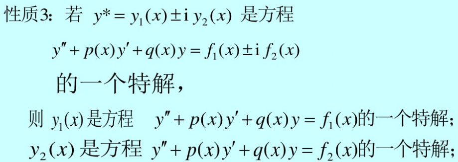

# 微分方程

## 基本概念

1. 微分方程：含未知函数及其导数或微分的方程
2. 微分方程的阶：未知函数导数的最高阶数
3. 微分方程的解：使方程成为恒等式的函数
4. 微分方程的通解：含有独立常数的个数等于微分方程阶数的解
5. 微分方程的特解：由初值条件确定了常数后的解
6. 常微分方程：未知函数是一元函数的微分方程

## 解微分方程

### 一阶微分方程

1. ==分离变量==后两边同时积分

2. 化为可分离变量（凑元+换元）

   ① 方程可凑出$\frac{dy}{dx}=f(ax+by+c)$的形式：令$u=ax+by+c$且$\frac{du}{dx}=a+b\frac{dy}{dx}$，代入方程化为可分离变量型；

   ②  方程可凑出$\frac{dy}{dx}=f(\frac{y}{x})$（即==齐次方程==）的形式：令$u=\frac{y}{x}$且$\frac{dy}{dx}=u+x\frac{du}{dx}$，代入方程化为可分离变量型；

   ③ 方程可凑出$\frac{dy}{dx}=f(\frac{ax+by+c}{a_{1}x+b_{1}y+c_{1}} )$的形式：若$\frac{a_{1}}{a}≠\frac{b_{1}}{b}$，则令$x=X+h，y=Y+k$，代入方程可化为齐次方程；若$\frac{a_{1}}{a}=\frac{b_{1}}{b} $，则令$u=ax+by$且$\frac{du}{dx}=a+b\frac{dy}{dx}$，代入方程可化为可分离变量型。

   拓展：方程可凑出$\frac{dx}{dy}=f(\frac{x}{y})$的形式也能用方法②解决，因此可凑形式不局限于上述几种。

3. 一阶非齐次线性微分方程 $y'+p(x)y=q(x)$ 

   - 常数变易法：① 先求出对应齐次线性方程的通解$y=Ce^{-\int p(x)dx}$；② 将C换成x的未知函数u(x)并把$y=ue^{-\int p(x)dx}$看成是原方程的通解，将其代入原方程解出$u=\int q(x)e^{\int p(x)dx}dx+C$，则$y=e^{-\int p(x)dx}(\int q(x)e^{\int p(x)dx}dx+C)$就是原方程的一个通解。

     - 推导过程：两边同乘$e^{-\int p(x)dx}$ 

     - 原理：一阶非齐次线性微分方程的通解等于对应齐次线性方程的通解与其一个特解之和=>逆向待定通解

   - ==通解公式法==：上述通解公式可以直接拿来用。

     （推导过程：在原方程两边乘以$e^{\int p(x)dx}$再化简即可得到公式）

   （在计算过程中，若积分后出现lnk的形式，如果不知道k的正负，则须加绝对值，即ln|k|）

4. 伯努利方程 $y'+p(x)y=q(x)y^{n}$

   两边除以$y^{n}$后，令$z=y^{1-n}$即可化为关于z的一阶线性微分方程

### 可降阶微分方程

1. $y^{n}=f(x)$型：两边连续积分即可
2. $y''=f(x,y')$型：令$y'=p$，则$y''=p'$，代入方程即可化为自变量为x因变量为p的一阶微分方程
3. $y''=f(y,y')$型：令$y'=p$，则$y''=p'=\frac{dp}{dx}=\frac{dp}{dy}\frac{dy}{dx}=p\frac{dp}{dy}$，代入方程即可得到自变量为y因变量为p的一阶微分方程

### 高阶线性微分方程

1. ==线性微分方程的解的结构==

   - 对于二阶齐次线性微分方程 $y''+P(x)y'+Q(x)y=0$：

     如果$y_{1}$和$y_{2}$是方程的两个解，则$C_{1}y_{1}+C_{2}y_{2}$也是方程的一个解；

     如果$y_{1}$和$y_{2}$线性无关（它们之比不为常数），则$C_{1}y_{1}+C_{2}y_{2}$是方程的通解。

     （可推广到n阶齐次线性方程：n个线性无关的特解的线性组合为其通解）

   - 对于二阶非齐次线性微分方程 $y''+P(x)y'+Q(x)y=f(x)$：

     如果$Y$是对应齐次方程的通解，$y*$是方程的一个特解，则$Y+y*$是方程的通解。

     （同样适用于n阶线性非齐次微分方程）

   - 叠加原理：

     $y_{1}^{*}$是$y''+P(x)y'+Q(x)y=f_{1}(x)$的特解，$y_{2}^{*}$是$y''+P(x)y'+Q(x)y=f_{2}(x)$的特解

     $\Rightarrow y_{1}^{*}+y_{2}^{*}$是$y''+P(x)y'+Q(x)y=f_{1}(x)+f_{2}(x)$的特解

2. ==二阶常系数齐次线性微分方程 $y''+py'+qy=0$ 的通解==（待定解为$e^{rx}$）

   ① 解特征方程 $r^{2}+pr+q=0$ => 特征根 $r_{1}$ 和 $r_{2}$ 

   ② 根据特征根写出通解：

   - $r_{1}$ 和 $r_{2}$ 是两个不等实根 => 通解为 $y=C_{1}e^{r_{1}x}+C_{2}e^{r_{2}x}$

   - $r_{1}$ 和 $r_{2}$ 是两个相等实根 => 令$r=r_{2}=r_{1}$，则通解为 $y=(C_{1}+C_{2}x)e^{rx}$

     （$e^{rx}为其中一个解，另一个解必与其线性无关，因此可设为u(x)e^{rx}，代入解得u=x$）

   - $r_{1}$ 和 $r_{2}$ 是一对共轭复根 $\alpha±\beta i$ => 通解为 $y=(C_{1}\cos\beta x+C_{2}\sin\beta x)e^{\alpha x}$ 

     > 一元二次方程的基础知识：
     >
     > - 求根公式：$r_{1,2}=\frac{-b±\sqrt{b^{2}-4ac}}{2a}$
     >
     > - 根的判别式：$b^{2}-4ac$
     >
     > - 共轭复根：$\alpha=\frac{-b}{2a}，\beta=\frac{\sqrt{4ac-b^{2}}}{2a} $

3. ==n阶常系数齐次线性微分方程 $y^{(n)}+p_{1}y^{(n-1)}+...+p_{n-1}y'+p_{n}y=0$ 的通解==

   ① 解特征方程 $r^{n}+p_{1}r^{n-1}+...+p_{n-1}r+p_{n}=0$

   ② 根据特征根写出对应的解：（1个根对应1个解，n个解之和即为方程的通解）

   - 单实根r：给出一项 $Ce^{rx}$ 
   - k重实根r：给出k项 $ (C_{1}+C_{2}x+...+C_{k}x^{k-1})e^{rx}$ 
   - 单复根$\alpha±\beta i$：给出两项 $(C_{1}\cos\beta x+C_{2}\sin\beta x)e^{\alpha x}$ 
   - k重复根$\alpha±\beta i$：给出2k项 $[(C_{1}+C_{2}x+...+C_{k}x^{k-1})\cos\beta x+(D_{1}+D_{2}x+...+D_{k}x^{k-1})\sin\beta x]e^{\alpha x}$ 

4. ==二阶常系数非齐次线性微分方程 $y''+py'+qy=f(x)$ 的特解==（待定特解法）

   （ 技巧：$y^{*}$ 大体为 $f(x)x^{k}$ ，且只需改变多项式。m次多项式指0到m次方的x之和加上系数 ）

   - $f(x)=e^{λx}P_{m}(x)$ 型（$P_{m}(x)=a_{0}x^{m}+a_{1}x^{m-1}+...+a_{m-1}x+a_{m}$）

     ① 设特解为$y^{*}=x^{k}e^{λx}Q_{m}(x)$；

     ​	k为特征方程含根λ的重复次数；

     ​	$Q_{m}(x)$是形式与$P_{m}(x)$一样的m次多项式；

     ② 将特解代入微分方程并比较两端x同次幂的系数，得到m+1个方程，可解出$Q_{m}(x)$的m+1个系数，从而得到特解。

   - $f(x)=e^{λx}[P_{m}(x)\cosωx+Q_{n}(x)\sinωx]$ 型

     ① 设特解为$y^{*}=x^{k}e^{λx}[R_{l}^{(1)}(x)\cosωx+R_{l}^{(2)}(x)\sinωx]$；

     ​	k为特征方程含根λ+ωi（或λ-ωi）的重复次数，即λ±ωi是特征根，则k=1，λ±ωi不是特征根，则k=0；

     ​	l=max(m,n)，$R_{l}^{(1)}$ 和 $R_{l}^{(2)}$ 分别为x的两个不同的$l$次一般多项式；
   
     ② 用同上的方法解出两个多项式的系数即可得到特解。

# 题征总结

## 概念相关

1. 已知方程的解，反求解中的系数：由于微分方程的解是使方程成为恒等式的函数，因此可以将解回代方程，通过化简得到关于系数的方程，解此方程即可求解系数。

2. 不解微分方程，利用方程所给信息解题：微分方程反映了函数与其导数之间的关系，借此关系来解决问题。

3. ==二阶线性微分方程解的结构的拓展==：⭐

   若$y_{1},y_{2},y_{3}$是方程$y''+p(x)y'+q(x)y=f(x)$的三个解，则对于$y=ay_{1}+by_{2}+cy_{3}$：

   ① $a+b+c=1\Leftrightarrow y是y''+p(x)y'+q(x)y=f(x)的解$

   ② $a+b+c=0\Leftrightarrow y是y''+p(x)y'+q(x)y=0的解$

   若$y_{1},y_{2},y_{3}$是方程$y''+p(x)y'+q(x)y=f(x)$的三个线性无关解，且a,b,c中2个为任意常数，则对于$y=ay_{1}+by_{2}+cy_{3}$：

   ③ $a+b+c=1\Leftrightarrow y是y''+p(x)y'+q(x)y=f(x)的通解$ 

   ④ $a+b+c=0\Leftrightarrow y是y''+p(x)y'+q(x)y=0的通解$ 
   
    

## 解微分方程

### 一阶相关

1. 换位法：在微分方程的x和y中，谁作为自变量，谁作为未知函数是可以互换的。

2. 就所学而言，一阶微分方程就只有齐次方程、伯努利方程、非齐次线性方程、ax+by+c形式的方程、可分离变量型方程。一切的化简（凑元法、换元法、换位法等）都为了让目标方程可转化为这些方程的形式，从而利用对应方法来求解。

   举例说明：解方程$y'\cos y=(1+\cos y\sin y)\sin y$

   解题过程：令$z=\sin y$，因为$z'=y'\cos y$，所以原方程变为$z'=(1+z\cos y)z=z+z^{2}\cos x$，这是一个伯努利方程，所以就可以用对应得方法进行求解。

   思考：这里换元的思路来自于方程中拥有导数关系的两个元素$\sin y$和$y'\cos y$，因此观察方程元素之间的关系也是找到解题路径的一个方法。

### 可降阶相关

按部就班即可

### 高阶相关

对于高阶非齐次线性微分方程：

- 待定特解并代入微分方程后，其中高于多项式次数的项都可以直接排除

- 如果f(x)为n种类型之和，则微分方程的特解为这n种类型对应特解之和（叠加定理）

  举例说明：$f(x)=e^{x}\cos x+xe^{3x}\Rightarrow y^{*}=e^{x}(A\cos x+B\sin x)+x(ax+b)e^{3x}$

  对于$e^{x}\cos x$：λ-ωi不是特征根，则k=0；两个多项式最高为0次，所以是两个常数

  对于$xe^{3x}$：3是单实根，则k=1；多项式为1次，所以是(ax+b)

# 注意事项

1. 欧拉公式：$\cos\theta =\frac{1}{2} (e^{i\theta }+e^{-i\theta })，\sin\theta =\frac{1}{2i} (e^{i\theta }-e^{-i\theta })$ 

2. 两边积分时须注意是否需要加绝对值或正负号，而且常数必须加在积分后的式子中，而不是化简后的式子中：

   $\int \frac{1}{y} dy=\int x dx\Rightarrow ln|y|=\frac{1}{2}x^{2}+C_{1}\Rightarrow y=±C_{2}e^{\frac{1}{2}x^{2}}=y=Ce^{\frac{1}{2}x^{2}}（C=±C_{2}）$

3. 在对分式积分时，分母都是默认不等于0，因此会丢掉分母等于0时的部分解：

   $(x+1)dy=dx\Rightarrow \int dy=\int \frac{1}{(x+1)} dx，此时默认(x+1)不等于0，因此丢掉了x=-1这个特殊解。$

4. ==求微分的一点点本质：需要指定谁是自变量，谁是因变量==

   举例说明：求xyz的微分$dxyz$：

   ① 将x看成是自变量，则y和z在均为因变量：$dxyz=(yz+xy'z+xyz')dx$

   ② 将y看成是自变量，则x和z在均为因变量：$dxyz=(xz+x'yz+xyz')dy$

   ③ 将x和y看成是自变量，则z为因变量：$dxyz=(yz+yxz'_{x})dx+(xz+yxz'_{y})dy$

   ④ 将x、y和z都看成是自变量，则无因变量：$dxyz=yzdx+xzdy+xydz$

5. 如果目标函数的积分无需求取也无法求取，则可以用变限积分表示其逆导并添加一个常数：

   比如方程的解为$y(x)=e^{-ax}(\int e^{ax}f(x)dx+C)$，则可令$\int e^{ax}f(x)dx=\int_{0}^{x}e^{at}f(t)dt+C_{1}$，则$y(x)=e^{-ax}(\int_{0}^{x}e^{at}f(t)dt+C+C_{1})$。此时如果y(0)=0，则$C+C_{1}=0$。

6. 对微分方程换元时需要注意的地方：

   ① 别忘了将导数展开进行换元：比如对方程$x+y'=y''$进行换元$x=\cos t\Rightarrow \cos t+\frac{dy}{d\cos t} =\frac{d(\frac{dy}{d\cos t})}{d\cos t}$

   ② 如何求$\frac{dy}{d\cos t}$：

   - 方法一：直接对$\cos t$求微分：$\frac{dy}{d\cos t}=\frac{dy}{-\sin tdt}$

   - 方法二：恒等变形为可求导：$\frac{dy}{d\cos t}=\frac{dy}{dt}\frac{1}{\frac{d\cos t}{dt}}=\frac{dy}{-\sin tdt}$

   ③ ==如何求$\frac{d(\frac{dy}{d\cos t})}{d\cos t}$==：

   （1）先直接对$\cos t$求微分：$\frac{d(\frac{dy}{d\cos t})}{d\cos t}=\frac{d(\frac{dy}{-\sin tdt})}{-\sin tdt}=\frac{1}{-\sin t}\frac{d(\frac{dy}{-\sin tdt})}{dt}$

   （2）现在只需对$\frac{dy}{-\sin tdt}$求关于t的导数，此时需要把$\frac{dy}{dt}$看成是关于t的函数y(t)，则有：

   ​		$\frac{d(\frac{dy}{-\sin tdt})}{dt}=y'(t)\frac{1}{-\sin t}+\frac{\cos t}{\sin^{2}t}y(t)=\frac{d^{2}y}{dt^{2}}\frac{1}{-\sin t}+\frac{\cos t}{\sin^{2}t}\frac{dy}{dt}$ 
   
7. 曲线y=f(x)的切线方程：Y-y=y'(X-x)

8. 在有关距离或面积的等式中，如果不能判断用于计算距离或面积式子的正负，则需要加绝对值，因此须进行分类讨论：

   比如计算直线与坐标轴围成的面积，若直线与坐标轴交于(x,0)和(0,y)，则面积应等于$\frac{1}{2}|xy|$。

9. 如果方程含有变限积分，则可以通过两边同时求导转化为一般形式的微分方程。

10. 求$\int \frac{4}{x^{2}+C} dx$，根据$C=0、C>0、C<0$三种情形有三种积分结果。

11. ==微分方程连续性要求==：二阶微分方程的通解只能存在2个未知常数，如果由于方程存在绝对值需要分段计算等原因，使得结果有2个分段的通解和4个未知常数，则需要将其合并成两个，方法如下：

    - 原理：只要二阶微分方程存在，就说明二阶可导且二阶导函数连续，那么原函数以及一阶导函数必定存在且连续，所以可以利用2个分段通解函数在分段点必定连续且它们的导函数也在分段点连续的要求来合并未知常数；

    - 举例说明：若分段微分方程为$y''+4y=|\sin x|$（定义域为$[-Π,Π]$，分段点为x=0），求得两个分段通解函数为$y_{1}=C_{1}+C_{2}e^{-4x}+\sin x$和$y_{2}=C_{3}+C_{4}e^{-4x}-\sin x$，则一定会有以下连续要求：

      ① $lim_{x\to 0}y_{1}=lim_{x\to 0}y_{2}$；② $lim_{x\to 0}y'_{1}=lim_{x\to 0}y'_{2}$

      以次就可以合并4个未知常数为2个。
    
12. 由已知解求出微分方程。