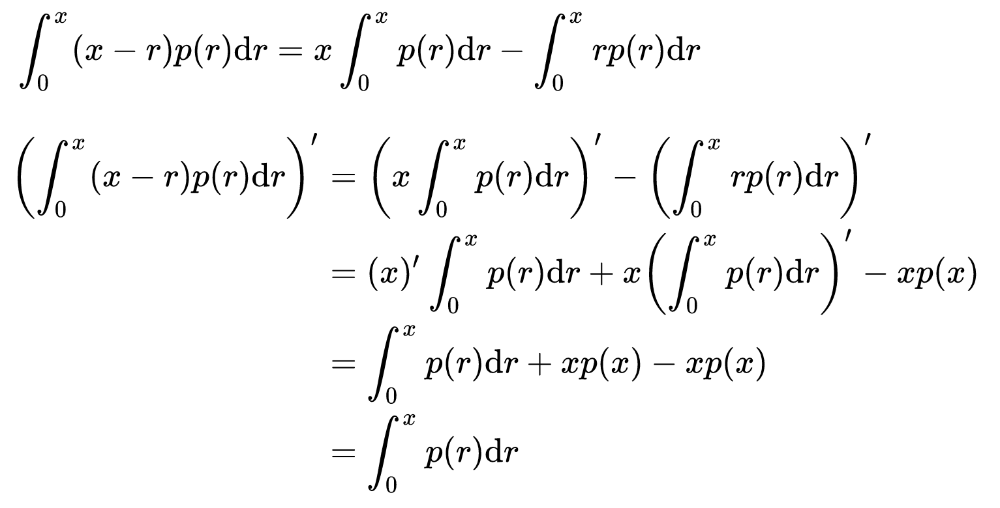

# 导数和微分

有时候题目的特征不容易发现，此时就需要尝试获取更多信息

## 导数和微分的定义

### 导数的定义

1. 定义：$f'(x_{0})=\lim_{\bigtriangleup x \to 0} \frac{\bigtriangleup y}{\bigtriangleup x} =\lim_{\bigtriangleup x \to 0} \frac{f(x_{0}+\bigtriangleup x )-f(x_{0})}{\bigtriangleup x} =\lim_{x \to x_{0}} \frac{f(x)-f(x_{0})}{x-x_{0}} $

2. 广义化：$f'(x_{0})=\lim_{狗 \to 0} \frac{f(x_{0}+狗 )-f(x_{0})}{狗} =\lim_{狗 \to x_{0}} \frac{f(狗)-f(x_{0})}{狗-x_{0}} $
3. 充要条件：左导数$\left ( \bigtriangleup x \to 0^{-} \right ) $和右导数$\left ( \bigtriangleup x \to 0^{+  } \right ) $存在且相等
4. 几何意义：切线斜率
   - 切线方程：$y-y_{0}=f'(x_{0})(x-x_{0})$
   - 法线方程：$y-y_{0}=-\frac {1}{f'(x_{0})}(x-x_{0})$
5. 高阶导数：导数的导数
6. 导数与连续性：可导必定连续，连续未必可导

### 微分定义

1. 自变量的微分$dx= \triangle x$
2. ==因变量的微分$dy=A\triangle x=f'(x)dx$==
   - dy是因变量的增量$\triangle y=A\triangle x+o(\triangle x)$在$\triangle x \to 0$的代替
   - dy和Δy是等价无穷小
   - ==可微必可导，可导必可微（一元）== 
   - 导数也叫微商：f'(x)=dy/dx

3. 几何意义：在局部用切线段代替曲线段
4. 微分形式的不变性（复合导数的微分性质）

4. 用定义证明可微：（也可用可导来证明可微）⭐

   ① 写增量：Δy=f(x0+Δx)-f(x0)

   ② 写线性增量：AΔx=f'(x0)Δx

   ③ 作极限：$\lim_{Δx \to 0}\frac{Δy-AΔx}{Δx}$ 

   ④ 判别：极限等于0则可微，否则不可微。

## 导数和微分的题征

### 导数相关

#### 各类函数的求导

1. 两个函数的==和差积商的求导== 

2. ==复合函数==的求导：内导与外导的乘积

3. ==反函数==x(y)的求导：$x'(y)=\frac{dx}{dy}=\frac{1}{dy/dx}=\frac{1}{y'(x)}$

4. 反函数的二阶导：$x''(y)=\frac{d(\frac{dx}{dy})}{dy}=\frac{-y''(x)}{y'(x)^{3}}=(\frac{1}{y'(x)})'/y'(x)$

5. 求==高阶导数==：

   - 逐次求导
   - 莱布尼兹公式(熟悉)
   - 泰勒公式展开法
     - 任何一个无穷阶可导的函数可写成：$f(x)=\sum_{n=0}^{\infty } \frac{f^{(n)}(x_{o} ) }{n!} (x-x_{o})^{n}$ 
     - 再将函数用泰勒公式（$x_{o}=0$）展开
       - 拓展：懂得如何将$x_{o}=0$的公式转化为$x_{o}= k$的公式
     - 根据展开的唯一性，确定系数$\frac{f^{(n)}(x_{o} ) }{n!} $ 

6. 由参数方程$\left\{\begin{matrix}x=\alpha (t)
   \\y=\beta (t)
   \end{matrix}\right.$确定的函数y(x)的求导

   - 推出原函数直接求导
   - $y'(x)=\frac{dy}{dx}=\frac{dy/dt}{dx/dt}= \frac{\beta '(t)}{\alpha '(t)} $
   - $\beta (t)$和$\alpha (t)$不可导，则用导数定义处理

7. ==由参数方程确定的函数==的二阶导

   $y'(x)=\frac{d(\frac{dy}{dx})}{dx}=(\frac{\beta '(t)}{\alpha '(t)})' /{\alpha '(t)}$

8. ==隐函数F(x，y)=0==的求导

   - 显化后直接求导
   - 在方程两边同时对x求导（y看成是中间变量），解方程即可得到y'

9. 幂指函数$u(X)^{v(X)} $的求导（其它场合也适用）

   - ==对数求导法==：
     1. 对等式两边同时取对数
     2. 两边同时对x求导（y看成是中间变量）
   - 借助自然数e求导：
     1. 化为$u(X)^{v(X)} = e^{v(x)lnu(x)} $ 
     2. 在此基础上求导

10. ==变限积分==$F(x)=\int_{u(x)}^{v(x)} f(t)dt$求导公式（ 假设 f(x) 原函数为 p(x) ）

    $F'(x)=[p(v(x)) -p(u(x))]' =f(v(x))v'(x)-f(u(x))u'(x)$

11. ==基本初等函数求导公式==（看书背）

> $C_{n}^{m} $：从n个物品中取出m个进行排列（不考虑顺序）
>
> $A_{n}^{m} $：从n个物品中取出m个进行排列（考虑顺序）

#### 导数定义相关

1. 由导数定义推出的一些概念：
   - 偶/奇函数的导函数为奇/偶函数
   - 以T为周期的周期函数的导函数为以T为周期的周期函数
2. 通过导数定义求解的题型：
   - 与导数有关，但没有给出具体函数的证明题
   - ==给出与导数无关信息的求导题==：导数定义隐藏在信息中，或需要凑出导数定义
   - ==题给导数没有出现在计算目标中==：在计算目标时需要由导数定义联系上题给导数，以化简目标
   - 求导函数时，直接通过求导法则得到的结果==存在无定义点==，而这些无定义点的导数需要通过导数定义求解
3. 根据极限推断函数的相关信息（包括某点导数是否存在、特殊点的函数值或导数值）
   - 将极限凑成==导数定义的广义化==样子（注意广义化后的极限是否为单侧极限）
   - 极限存在的快速判断：由f(x)和g(x)通过和差积商组合的极限存在，如果$\lim  f(x)$存在，则$\lim  g(x)$也存在
     - 特殊情形：若$\lim_{x \to 0} \frac{f(x)}{g(x)} $存在且g(0)=0，则f(0)=0
   - 必要时举特殊函数为反例：$f(x)=|x|$、$f(x)=x^{\frac{1}{3}}$、$f(x)=\left\{\begin{matrix}1，x>0\\-1，x<0\end{matrix}\right.$......
     - 书中所举简单函数的例子恰恰就是很好的反例
4. 证明某个函数在某点处的导函数连续
   - ==判断该函数在该点可导==（该点的导函数存在）
   - ==导函数趋向该点的极限存在== 

#### 导数计算相关

1. 计算复杂但有鲜明特征的函数f(x)的特殊点p导数
   
- 由n项相乘的函数：提取特殊项为t(x)，剩余n-1项为g(x)，则原函数f(x)=t(x)·g(x)，因此特殊点导数为f'(p)=t'(p)g(p)+t(p)g'(p)，此时可以通过特殊项化简原式（==分离特殊项和一般项==）
  
2. 计算复合函数的导数
   - 内可导和外可导只是复合可导的充分非必要条件
   - f'(g(x))是对g(x)求导，[f(g(x))]'是对x求导

3. 分段函数相关：
   - 判断分段函数的连续性和可导性：左、右极限/导数存在且相等
   - 对于需要分段计算的导函数，==其分段点导数需要用导数定义求解== 
   - 某点可导包含两方面信息：==左、右极限/导数存在且相等== 
   - 某点连续不能说明可导：仅说明左、右极限存在且相等
4. 在反函数和参数方程的求导公式中的变量都不是函数本身的自变量
   - 对于反函数：公式中的变量是原函数的自变量，也就是反函数的因变量
   - 对于由参数方程确定的函数：公式中的变量是方程的参数

6. 高阶导的求取一般需要找出各阶导之间的规律

   - 有时候需要通过移项或其他操作构造出莱布尼兹公式的样子
     - 移项（将商式改为积式）：$f(x)=\frac{p(x)}{g(x)}\Rightarrow f(x)g(x)=p(x)$
   - 如果莱布尼兹公式的一个函数是幂函数，则公式只有前几项

7. 上限和积分函数中都出现变量x的求导问题：

   

8. Δy和dy之间的关系可以由泰勒展开式给出：

   $\because  f(x)=\sum_{n=0}^{\infty } \frac{f^{(n)}(x_{o} ) }{n!} (x-x_{o})^{n}
         =f(x_{0})+f’(x_{0}) (x-x_{0})+o(x-x_{0})$ 

   $\therefore Δy=f(x)-f(x_{0})=f’(x_{0})Δx+o(Δx)=dy+o(Δx)$ 

>  x³-y³=(x-y)(x²+xy+y²) 

### 微分相关

1. 微分就是导数与dx的乘积，因此微分公式都与求导一致
2. 考察微分的定义
3. 考察复合函数的微分形式不变性
