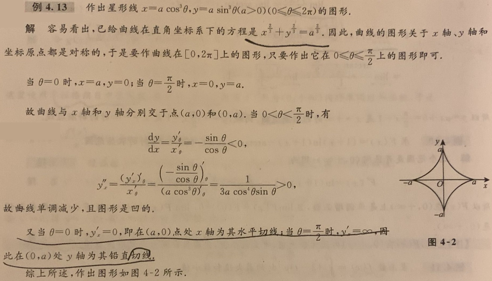

# 一元函数的微分应用

## 单调性和极值

### 概念相关

1. 极大值就是在领域内最大，极小值就是在领域内最小。
2. 最大值就是在定义域内最大，最小值就是在定义域内最小。
3. 如果f(x)在区间l上有最值点p，并且p不是l的端点而是内部点，则p必是f(x)的一个极值点。
4. 间断点可以是极值点。

### 单调性的判别

- $f'(x)>0\Rightarrow$单调递增
- $f'(x)≥0\Rightarrow$单调不减
- $f'(x)<0\Rightarrow$单调递减
- $f'(x)≤0\Rightarrow$单调不增

### 极值的判别

1. 必要条件：f(x)在$x=x_{0}$处可导且取得极值，则必有$f'(x_{0})=0$
2. 第一充分条件：设f(x)在$x=x_{0}$处连续，且在$U(x_{0},\delta )$内可导
   - $f(x_{0})$为极小值：当$x\in (x_{0} -\delta,x_{0})$时，f'(x)<0；当$x\in (x_{0},x_{0}+\delta)$时，f'(x)>0；
   - $f(x_{0})$为极大值：当$x\in (x_{0} -\delta,x_{0})$时，f'(x)>0；当$x\in (x_{0},x_{0}+\delta)$时，f'(x)<0；
   - $f(x_{0})$不是极值：f'(x)在$(x_{0} -\delta,x_{0})$和$(x_{0},x_{0}+\delta)$内不变号。
3. 第二充分条件：设f(x)在$x=x_{0}$处二阶可导，且$f'(x_{0})=0$，$f''(x_{0})≠0$
   - $f(x_{0})$为极大值：$f''(x_{0})<0$
   - $f(x_{0})$为极小值：$f''(x_{0})>0$
4. 第三充分条件：设f(x)在$x=x_{0}$处n阶可导，且$f^{(m)}(x_{0})=0(m=1,2,...,n-1)$，$f^{(n)}(x_{0})≠0(n≥2)$
   - $f(x_{0})$为极大值：n为偶数且$f^{(n)}(x_{0})<0$ 
   - $f(x_{0})$为极小值：n为偶数且$f^{(n)}(x_{0})>0$ 

### 求最值或取值范围

1. 求出驻点（导数为0的点）和不可导点的函数值
2. 求出区间两侧端点的函数值或极限
3. 比较这些值，确定最值或取值范围

## 凹凸性和拐点

### 概念相关

1. f(x)在区间l上图形是凹的：区间l内任意两点满足$f(\frac{x_{1}+x_{2}}{2} )<\frac{f(x_{1})+f(x_{2})}{2} $
2. f(x)在区间l上图形是凸的：区间l内任意两点满足$f(\frac{x_{1}+x_{2}}{2} )>\frac{f(x_{1})+f(x_{2})}{2} $
3. 拐点：连接凹弧和凸弧之间的分界点

### 凹凸性的判别

- 凹的：在区间l上f''(x)>0
- 凸的：在区间l上f''(x)<0

### 拐点的判别

1. 必要条件：$f''(x_{0})$存在且$x_{0}$是拐点，则f''(x)=0
2. 第一充分条件：设f(x)在$x=x_{0}$处连续，且在$U(x_{0},\delta )$内二阶导数存在，若在左右领域内$f''(x_{0})$变号，则$(x_{0},f(x_{0}))$为拐点
3. 第二充分条件：$f''(x_{0})=0$且$f'''(x_{0})≠0$，则$(x_{0},f(x_{0}))$为拐点
4. 第三充分条件：当n为奇数时，若$f^{(m)}(x_{0})=0(m=2,...,n-1)$且$f^{(n)}(x_{0})≠0(n≥3)$，则$(x_{0},f(x_{0}))$为拐点

## 作图相关

### 渐近线

1. 水平渐近线：若$\lim_{x \to \infty} f(x)=y_{0}$，则$y=y_{0}$是f(x)的一条水平渐近线。
2. 铅直渐近线：若$\lim_{x \to x_{0}^{+} } f(x)=∞$或$\lim_{x \to x_{0}^{-} } f(x)=∞$，则$x=x_{0}$是f(x)的一条铅直渐近线。
3. 斜渐近线：若$\lim_{x \to \infty} \frac{f(x)}{x}=k$且$\lim_{x \to \infty}[f(x)-kx]=b$，则y=kx+b是f(x)的一条斜渐近线。

### 如何作图

1. 确定定义域、奇偶性、对称性、周期性；
2. 根据特殊点（间断点、一阶导和二阶导为0或不存在的点）划分区间；
3. 在各区间内确定函数的单调性、凹凸性、极值点、拐点、零点；
4. 确定渐近线以及其它变化趋势；
5. 结合以上信息来画出图形。

## 注意事项

1. 导函数的零点和无定义点(确保该点在原函数连续)都有可能是极值点
2. 在与图形有关的选择题中，有明显几何意义的函数可以考虑作图解决
3. 如果函数中的某些项无关紧要，则可以将它们集合成一个子函数g(x)
4. 当导函数单增/单减且涉及导函数和原函数之间的比较时，就应该使用拉格朗日中值定理
5. 如何求渐近线：
   - 水平渐近线：x趋于无穷时f(x)有固定值，值无穷时无水平渐近线
   - 铅直渐近线：x趋于特殊点时f(x)值无穷，无特殊点（处处有定义）时无铅直渐近线
   - 斜渐近线：x趋于无穷时f(x)/x有固定值，值无穷时无斜渐近线
6. 求最值时，如果函数具有奇偶性，则可以只考虑一半而简化计算
7. $(lny)'=\frac{y'}{y}$；$\ln{\frac{a}{b}}=\ln {a}-\ln {b}$；$\frac{\ln{a}}{\ln{b}}=\log_{b}{a} ≠\ln{(a-b)}$
8. 分离常数是求导前的一个很好的化简方式
9. 取x=0时，$xy+3x=1-e^{x}\Rightarrow y=\lim_{x \to 0} (\frac{1-e^{x}}{x} -3)$ 
