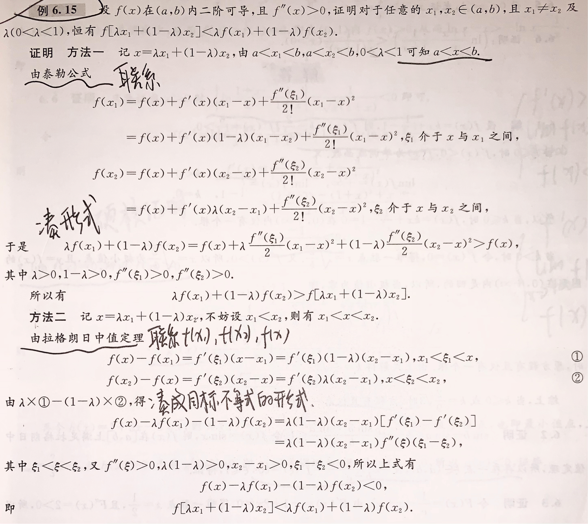

# 零点问题

1. 零点问题包括以下方面（它们之间在一定条件下可以相互转化）：
   - 方程f(x)=0、f(x)=g(x)的根
   - 函数的零点
   - 两条曲线的交点
2. 解决方法：
   - 零点定理（至少一个根）
     - 推广：（开或闭）区间的左右端点（有限数或无穷大）的函数值或极限满足乘积小于0即可
   - 单调性（至多一个根）
     - 如果f(x)在(a,b)和(b,c)上分别单调，则f(x)在(a,b)和(b,c)上分别至多有1个零点，即在(a,c)上至多有2个零点。
   - 罗尔原话：$f^{(n)}(x)=0至多有k个根 \Rightarrow f(x)=0至多有k+n个根$
     - $f'(x)=0无实根 \Rightarrow f(x)=0至多有1个根$（罗尔定理+反证法）
     - $降低n阶 \Rightarrow 多n个根$
   - 实系数奇次方程（最高阶项阶次为奇数）至少存在一个实根（零点定理的推广）

## 恰好有n个根

1. 罗尔原话和单调性确保了根的上限，零点定理、奇次方程单根性和直接求根确保了根的下限，两者夹逼得到根的准确数量。
2. 零点定理、奇次方程单根性和直接求根可以混合或反复使用。
3. 其它方法：
   - 二次方程判别式：$b^{2}-4ac$
     - 拓展：$求f(x)=ax^{4}+bx^{2}+c的零点\Rightarrow 求方程f(x)=0的根\Rightarrow 令t=x^{2},at^{2}+bt+c=0$
   - 绝对值函数分区间讨论、奇/偶函数分半讨论
     - 如果偶函数在x>b时必定恒大于0或小于0，则可以将讨论范围缩减至[0,b)，并且仅需讨论该区间内的单调性
   - 求曲线f(x)和直线g(x)的交点 => F(x)=f(x)-g(x)=0
     - 可以作图分析就作图分析：特别注意特殊点的取值（区间端点、极值点等）
     - 作图有两种：单独作f(x)-g(x)的图和分别作f(x)和g(x)的图，看哪个简单选择哪个
     - 答题时可以根据所作的图制表说明
     - 如果带有参数k，则需要根据k分段讨论，而k的分段点常取决于k对F(x)导函数的取值影响（即能够改变F(x)单调性的临界点）
     - 作图最重要的还是单调性和极值点

# 微分不等式

1. 熟练掌握常用的经典不等式

2. 仅包含单变量的不等式：利用函数的性质证明

   - 单调性、极值/最值（唯一的极值即是最值）、凹凸性等等

   - 如果目标函数复杂（比如无法直接求取特殊点函数值），就需要进行化简

     - 有$\frac{1}{x}$式则倒代换
     - 有$e^{x}$式则两边加对数
     - 有根号则两边求平方
     - 有平方则两边求根号：本来有平方部分需要加上绝对值符号，因此也需要先计算该部分内容是否恒大于/小于0来去掉绝对值符号，或者进行分段讨论。

   - 如果目标函数的导数复杂，那么可以进一步考察其更高阶的导数

   - 应选择更简单的方式转化成函数，比如：

     $f(x)-\frac{m(x)}{n(x)}>0\Leftarrow f(x)>\frac{m(x)}{n(x)},n(x)>0 \Rightarrow f(x)n(x)-m(x)>0$

3. 未知常数组成的不等式：将其中一个或几个常数变量化，从而转化为"仅包含单变量的不等式"的问题

   - 常数变量化的2种方式：① 仅将一个常数变量化；② 将多个常数化为"齐次式"后统一进行变量化

4. 根据不等式的形式采取相应的措施（依形法）：

   - 分离常数法：若不等式包含两个常数a和b，且能够将其化为"f(a)>f(b)"的形式，则利用函数f(x)的单调性来求解
   - 拉日中值法：若不等式包含两个常数a和b，且能够将其化为"$\frac{f(a)-f(b)}{a-b}>A$"的形式，则对f(x)在区间(a,b)上使用拉格朗日中值定理来求解

5. 将函数展开后凑出不等式的样子（凑形法）：分为泰勒展开法和拉日展开法

   

# 注意事项

1. 题征包括区间、导数和一个端点函数值，而目的是获得另一个端点函数值，则应使用拉日中值定理
2. 做题的过程其实就是将问题不断转化至平凡的过程（创造和寻找平凡）
3. $\lim_{x \to 0} xlnx=\lim_{x \to \infty} \frac{ln\frac{1}{x} }{x} =\lim_{x \to \infty} -\sqrt{x} =0$
4. f(x)=0无实根说明f(x)恒大于或恒小于0；f'(x)=0无实根说明f(x)单调
5. 单调递增：x1>x2>0 => f(x1)>f(x2)>f(0)
6. $0<a<m<b<1,\frac{1}{1+m^{2}} <\frac{1}{1+a^{2}} <\frac{1}{b^{2}+a^{2}} <\frac{1}{2ab} $
7. 单调递减函数的最大/小值在右/左边；单调递增函数的最大/小值在左/右边