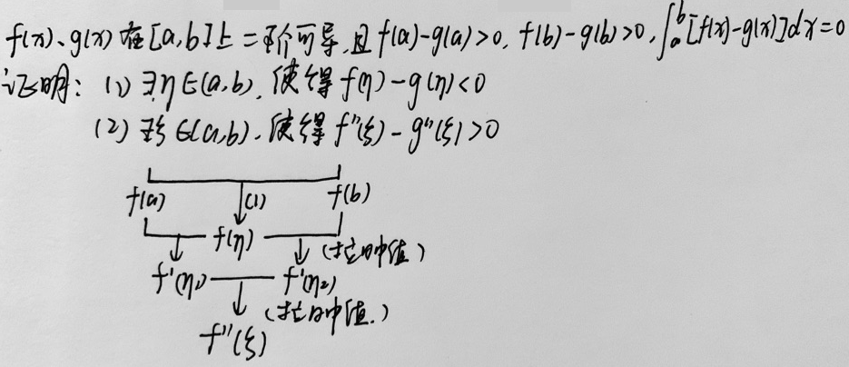
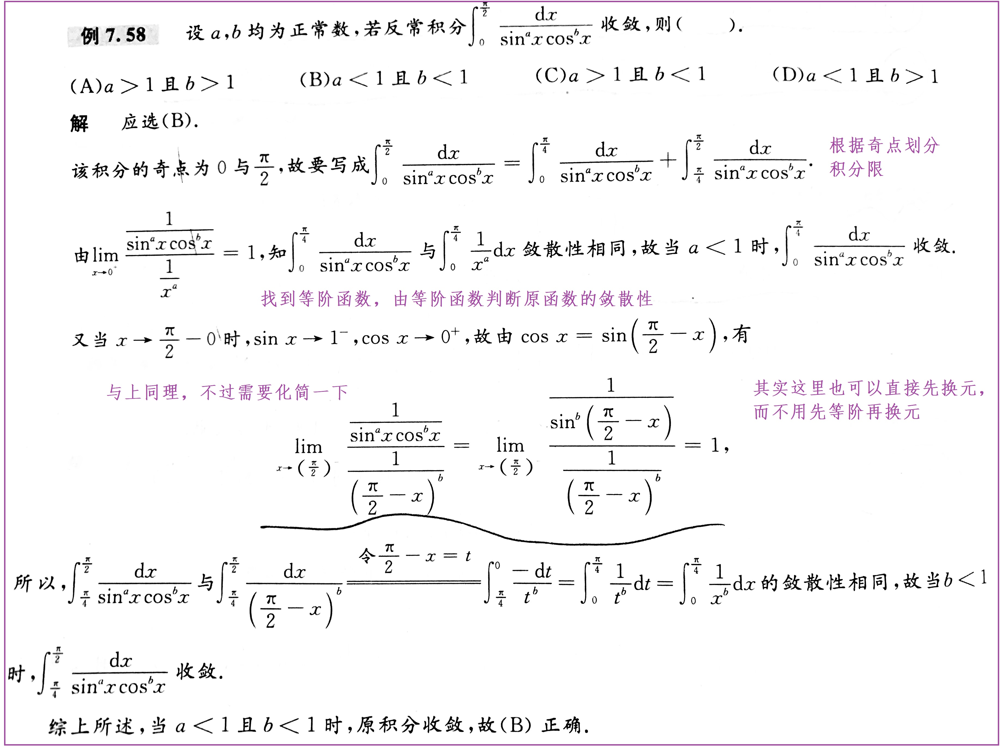
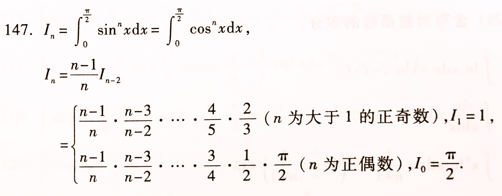

# 一元函数积分

## 不定积分

1. 不定积分是求原函数运算，与求导运算互逆：

   $\int f(x)dx=F(x)+C\Leftrightarrow F'(x)=f(x)$

2. 原函数存在定理：
   - 连续必有原函数
   - 被积函数具有第一类间断点、无穷间断点=>在包含间断点的区间内无原函数
   - 被积函数具有振荡间断点=>在包含间断点的区间内可能存在原函数
   - 总结：一个函数的导数不能有第一类间断点和无穷间断点，但可能包含振荡间断点

3. 不定积分的运算具有线性性质

## 定积分

1. 定积分就是微分之和：

   $\lim_{\lambda  \to 0} \sum_{i=1}^{n} f(\xi_{i})Δx_{i}=\int_{a}^{b} f(x)dx=\lim_{n \to \infty} \sum_{i=1}^{n}f(a+\frac{b-a }{n}i)\frac{b-a }{n} ≈ \frac{b-a }{n}(f(x_{1})+f(x_{2})+...+f(x_{n}))$

2. 定积分仅与积分限和被积函数有关，而与积分变量的记法无关。在确定积分限和被积函数后，定积分就是一个常数。

3. 定积分存在（可积）定理：
   - 充分条件：连续必可积；有界且仅有有限个间断点=>可积
   - 必要条件：可积必有界

4. 定积分性质：
   - 保号性：$f(x)≥g(x)\Rightarrow \int_{a}^{b} f(x)dx≥\int_{a}^{b}g(x)dx$ 
     - $f(x)≥0\Rightarrow \int_{a}^{b} f(x)dx≥0$ 
     - $\int_{a}^{b} |f(x)|dx≥|\int_{a}^{b}f(x)dx|$ 
   - 估值定理：$ML≥\int_{a}^{b} f(x)dx≥mL$
   - 中值定理：$\int_{a}^{b} f(x)dx=f(\xi)(b-a)$（拉日中值定理）
   - 其它略（区间长度可求性、线性性质、区间可加性）
   - 规定：$\int_{a}^{a} f(x)dx=0$；$\int_{a}^{b} f(x)dx=-\int_{b}^{a} f(x)dx$

## 变限积分

1. 积分上限函数：$\phi (x)=\int_{a}^{x}f(t)dt $ 

2. 积分上限函数的性质：

   - 积分上限函数是f(x)的一个原函数：$\phi' (x)=f(x)$ 

   - f(x)可积 $\Rightarrow\phi (x)$连续（证明）；f(x)连续 $\Rightarrow\phi (x)$可导

   - 积分上限函数只要存在就必然是连续的

3. 变限积分的求导公式：$F(x)=\int_{m(x)}^{n(x)} f(t)dt\Rightarrow F'(x)=f(n(x))n'(x)-f(m(x))m'(x)$ 

   - 计算过程：先积分再求导
   - 注意：求导变量x仅出现在积分上下限时才能使用变限积分的求导公式；如果出现在被积函数中，就必须通过恒等变形将其移出被积函数才能使用变限积分的求导公式。

## 反常积分

1. 什么是反常积分：积分区间无限或函数无界的定积分

2. 反常积分存在则称为收敛，否则为发散

3. 无穷区间的反常积分：

   ① $\int_{a}^{+∞}f(x)dx=\lim_{b \to +∞} \int_{a}^{b}f(x)dx=\lim_{b \to +∞}F(b)-F(a)$ 

   ② $\int_{-∞}^{+∞}f(x)dx=\int_{c}^{+∞}f(x)dx+\int_{-∞}^{c}f(x)dx$ 

4. 无界函数的反常积分：

   ① $\int_{a}^{b}f(x)dx=\lim_{t \to b+} \int_{a}^{t}f(x)dx=\lim_{t \to b+}F(t)-F(a)$（b为瑕点）

   ② $\int_{a}^{b}f(x)dx=\int_{c}^{b}f(x)dx+\int_{a}^{c}f(x)dx$（c为瑕点）

## 计算积分的方式

### 不定积分的计算

1. ==基本积分表==（课本P188、205）：无论是下面的哪种方法，其目的都是将原式化为能直接通过积分表求取的平凡情况，因此须熟练掌握积分表。若能做到先一步看出最后要采取的是哪个积分公式，从而采取相应的方法进行化简是最好不过了。

2. ==凑微分法==：$\int f[g(x)]g'(x)dx=\int f[g(x)]d[g(x)]=\left [\int f(u)du\right ]_{u=g(x)}$ 

   - 从前面取出一部分放到d后面去，以简化被积函数。
   - 在$\int f(x)g(x)dx$中哪个应该被扔到后面：分别对f(x)和g(x)求逆导，哪个逆导后式子变得一致，就将其扔到后面去。比如f(x)在求逆导后是g(x)的倍数，则将f(x)扔到后面去。这只是一种==快速判断==，不一定完全正确。

3. ==换元法==：$\int f(x)dx \overset{x=g(u)}{=} \int f[g(u)]d[g(u)]=\left [ \int f[g(u)]g'(u)du \right ] _{u=g^{-1}(x)}$

   - 从d后面取出一部分放到前面来，以简化被积函数。

4. ==分部积分法==：$\int uv'dx=uv-\int vu'dx$ 或 $\int udv=uv-\int vdu$

   - 证明：$(uv)'=u'v-uv'\Rightarrow uv'=(uv)'-vu'\Rightarrow$ 两边求不定积分。
   - 用于求$\int udv$困难而求$\int vdu$容易的情况。
   - 有空可掌握一下分部积分法的推广式。
   - 在$\int f(x)g(x)dx$中哪个应该被扔到后面：分别对f(x)和g(x)求导（或多次求导），哪个求导后式子变得简单，就将对方扔到后面去。比如对f(x)求导后式子变得简单，则将g(x)扔到后面去。这只是一种==快速判断==，不一定完全正确：在$\int x\arctan xdx$中，虽然x求导后式子变得简单，但因为要将$\arctan x$扔到后面去且扔了以后不知道是什么东西，所以还是只能将x扔到后面去。
   - 除了上述的快速判断外，还可以看看被积函数中有没有可以直接逆导的项，这往往是要被扔到后面去的。

5. ==有理分式$\frac{P_{n}(x)}{Q_{m}(x)} $（两个多项式之商）积分法==：（看课本最合适）

   ① 利用多项式除法将假分式化成真分式（分子多项式次数小于分母多项式次数）；

   ② 将真分式分解成部分分式之和。

   - 分解方法：
     - 将$Q_{m}(x)$因式分解至==没有公因式==的≤m项，并待定m个系数
     
       （因式分解的方法：猜根$x_{0}$->原式/$(x-x_{0})$）
     
     - 建立等式并对比$P_{n}(x)$求出待定系数的值（对比法）
     
       （赋值法：通过==对变量x赋一些特殊值==来求取系数，可以和对比法相互结合使用）
     
   - $Q_{m}(x)$分解原则：
   
     - 一次因式(ax+b)可产生1项：$\frac{A}{ax+b} $
     - k重一次因式$(ax+b)^{k}$可产生k项：$\frac{A_{1}}{ax+b}+\frac{A_{2}}{(ax+b)^{2}}+...+\frac{A_{k}}{(ax+b)^{k}}$
     - 二次因式$(px^{2}+qx+r)$可产生1项：$\frac{Ax+B}{px^{2}+qx+r} $
     - k重二次因式$(px^{2}+qx+r)^{k}$可产生k项：$\frac{A_{1}x+B_{1}}{px^{2}+qx+r}+\frac{A_{2}x+B_{2}}{(px^{2}+qx+r)^{2}}+...+\frac{A_{k}x+B_{k}}{(px^{2}+qx+r)^{k}}$
   
   ③ 对分解式求不定积分
### 定积分的计算

1. ==牛顿-莱布尼茨公式==：$\int_{a}^{b}f(x)dx=F(a)-F(b)，其中F'(x)=f(x)$（要求f(x)是连续函数）
2. ==换元法==：令x=g(t)，且g(α)=a，g(β)=b，则$\int_{a}^{b} f(x)dx = \int_{\alpha }^{\beta }f[g(t)]g'(t)dt$
   - 注意：换元后积分限要换成相应于新变量t的积分限
   - 也可以拓展为凑微分法，也要记得变更积分限
   - 与不定积分的区别：由于积分限的改变，换元后不需要回代
3. ==分部积分法==：$\int_{a}^{b} u(x)v'(x)dx=u(x)v(x)|_{a}^{b}-\int_{a}^{b} u'(x)v(x)dx$
4. 不定积分法：$\int f(x)dx=F(x)\Rightarrow F(a)-F(b)$

## 题征总结

### 概念相关

1. 证明原函数存在性：

   - 用导数定义证明：原函数可导且导数为被积函数（前提是被积函数连续）

   - 快速判断：

     ① 原函数存在定理

     ② 原函数存在必定连续

     ③ 严格指明区间的原函数不能分段

2. 证明定积分存在性：

   - 定积分存在定理
   - 原函数存在和可积之间不是充分必要关系

3. 根据被积函数的图形判别原函数的图形：

   - 原函数必定连续
   - 被积函数的间断点为原函数的不可导点
   - 找到特殊点（零点、原点等）

### 性质相关

1. 证明奇偶性：连续奇函数的原函数为偶函数；连续偶函数仅有一个奇原函数

2. 证明周期性：若连续函数以T为周期，则其原函数以T为周期 $\Leftrightarrow \int_{0}^{T} f(x)dx=0$

   - $\int_{T}^{a+T}f(x) dx\overset{x-T=t}{=} \int_{0}^{a}f(t) dt$

3. 证明保号性：连续函数f(x)在[a,b]上非负且不恒等于0，则$\int_{a}^{b} f(x)>0$

4. 积分性质与中值定理结合的综合证明题

   

### 不定积分相关

1. 根据题给包含不定积分的等式求解相应函数的表达式（解微分方程）
   - 基本方法：两边同时求导、分离变量后两边同时积分（注意解积分后须添加常数C，并由已知函数值代入解出，而已知函数值可以通过原式代入特殊变量值得到）
   - 求导回代：包含2个函数可考虑求导回代消去其中一个函数
   - 待定表达式：若题目规定了函数的形式，则可以待定函数表达式并代入方程求解
2. 求分段函数的原函数：① 分区间分别求取，再根据条件计算出常数；② 利用变限积分求取

3. 常规四种方法的计算

### 定积分相关

#### 凑积分定义

根据定积分的精确定义将式子==凑成定积分==来计算：$\int_{a}^{b} f(x)dx=\lim_{n \to \infty} \sum_{i=1}^{n}f(a+\frac{b-a }{n}i)\frac{b-a }{n}$

1. 更常用的形式：$\int_{0}^{1} f(x)dx=\lim_{n \to \infty} \sum_{i=1}^{n}f(\frac{i}{n})\frac{1}{n}$

2. 更常用的步骤：① 凑出求和$\sum_{i=1}^{n}$形式；② 提取1/n（对应dx）；③ 凑出i/n（对应x）

3. 广义化的形式：：① 区间的划分不一定要均匀，即对应于dx的项$Δx_{i}$可以大小不一，但必须保证当n->∞时，$max\{Δx_{i}\}\to0$；②  对应于x的项必须保证在各自的区间内

4. 广义化的步骤：① 写出和式；② 找到对应于dx的项；③找到对应于x的项；④ 计算积分限（积分限的选取需要是常数）

   > 计算$\lim_{n \to \infty}(b^{\frac{1}{n}}-1)\sum_{i=0}^{n-1}b^{\frac{i}{n} }\sin b^{\frac{2i+1}{2n}}$；
   >
   > 1. 写出和式：$ \lim_{n \to \infty}\sum_{i=0}^{n-1}\sin b^{\frac{2i+1}{2n}}(b^{\frac{1+i}{n}}-b^{\frac{i}{n}})$；
   >
   > 2. $(b^{\frac{1+i}{n}}-b^{\frac{i}{n}})$对应于dx，且当n->∞时趋于0；
   >
   > 3. $ b^{\frac{2i+1}{2n}}$对应于x，且$ b^{\frac{2i+1}{2n}}\in [b^{\frac{i}{n}},b^{\frac{1+i}{n}}]$；
   >
   > 4. 求积分限：下限=$b^{\frac{i}{n}}|_{i=0}=1$，上限=$b^{\frac{1+i}{n}}|_{i=n-1}=b$；
   >
   > 5. 因此原式可化为$\int_{1}^{b}\sin xdx$

5. 推广到二重积分$\int_{a}^{b} \int_{c}^{d} f(x,y)dxdy$：其步骤可以完全参考广义化的步骤。

   > 计算$\lim_{n\to \infty} \sum_{i=1}^{n} \sum_{j=1}^{n}\frac{ij}{n^{4}}$：
   >
   > 1. 写出和式：$\lim_{n\to \infty} \sum_{i=1}^{n} \sum_{j=1}^{n}\frac{i}{n}\frac{j}{n}\frac{1}{n}\frac{1}{n}$
   > 2. $\frac{1}{n}$和$\frac{1}{n}$分别对应于dx和dy；
   > 3. $\frac{i}{n}$和$\frac{j}{n}$分别对应于x和y；
   > 4. 求积分限（x和y的积分限都一样）：下限=$\frac{i}{n}|_{i=1}=0$，上限=$\frac{i}{n}|_{i=n}=1$；
   > 5. 因此原式=$\int_{0}^{1} \int_{0}^{1} xydxdy$ 
   
6. 其它技巧：

   - 当式子为n项累乘时，可通过取对数变和式。

   - 当式子具有凑积分的样子但又无法凑出时，可以考虑夹逼准则：

     $\lim_{n \to \infty} \sum_{i=1}^{n} \frac{sin\frac{iΠ}{n} }{n+1}≤\lim_{n \to \infty} \sum_{i=1}^{n} \frac{sin\frac{iΠ}{n} }{n+\frac{1}{i} } ≤\lim_{n \to \infty} \sum_{i=1}^{n} \frac{sin\frac{iΠ}{n} }{n} $

#### 定积分计算

1. 若被积函数在积分区间上非单值连续，则需要调整积分限：① 划分区间法：将积分限划分成若干个小区间，在每个小区间上被积函数是单值连续的；② 区间转换法：利用被积函数的周期性和奇偶性转化积分限，使得在转化后的积分限上被积函数是单值连续的；③ 换元法：$\int_{\frac{\Pi}{2}}^{\Pi}\cos^{2}xdx\overset{x=Π-t}{=} \int_{0}^{\frac{\Pi}{2}}\cos^{2}xdx$。

2. （预处理）简化定积分的方法：① 第一条不仅可以用来调整积分限，还可以用来简化定积分；② ==尽量将复杂的定积分拆解成独立的几个较为简单的定积分来计算（和式分解）==：$\int_{-1}^{1}\frac{x+1}{1+\sqrt[3]{x^{2}}} dx=\int_{-1}^{1}\frac{1}{1+\sqrt[3]{x^{2}}} dx+\int_{-1}^{1}\frac{x}{1+\sqrt[3]{x^{2}}} dx$；③ 区间再现公式：通常在题给定积分用任何常规方法都无法解决或解决比较麻烦时使用。

   > 区间再现公式的使用举例：
   >
   > 1. 重现原式，可消原式：$\int_{0}^{Π}x\sin xdx\overset{x=Π-t}{=} \int_{0}^{Π}(Π-t)\sin tdt=\int_{0}^{Π}Π\sin tdt-\int_{0}^{Π}t\sin tdt$
   > 2. 重现分母，可消分子：$\int_{0}^{\frac{Π}{2} } \frac{\sin x}{\sin x+\cos x}dx \overset{x=\frac{Π}{2}-t}{=}\int_{0}^{\frac{Π}{2} } \frac{\cos t}{\cos t+\sin t}dt $

3. 带有抽象函数的定积分：一般往题给条件信息多的方向简化

   - 涉及多阶导数：分部积分法
   - 被积函数为变限积分：分部积分法
   - 被积函数为分段函数：划分区间法
   - 被积函数为奇/偶或周期函数：奇/偶和周期函数性质+换元法

### 变限积分相关

1. 判断变限积分的大概取值范围：主要考察各种积分性质。
2. 对变限积分求导：若求导变量出现在被积函数中，须用换元法将其移出被积函数。
3. 求被积函数为分段函数的变限积分（包含两次分段）：① 整体根据分段函数分段；② 在每段内积分限须按分段点划分成几个小区间，在各个小区间内用相应的函数进行计算。
4. 解包含变限积分的微分方程。

### 反常积分相关

1. 反常积分的计算：

   - 如何识别反常积分：① 积分限无限；② 积分限内存在奇点（通常是使被积函数分母为0的点），此时须划分积分限。
   - 反常积分的计算与一般积分无异，仅仅须在解出原函数后求极限（有时候还可以通过换元消除极限）。

2. 敛散性的判别：

   - 记住两个常用的结论：

     - 无穷区间的积分$\int_{a}^{ + ∞ } \frac{dx}{x^{p}} $，在p>1时（是分数）收敛，在p≤1时（是非分数）发散；
     - 无界函数的积分$\int_{0}^{a} \frac{dx}{x^{p}} $（奇点x=0），在p＜1时收敛，在p≥1时发散。

   - ==利用上述结论进行判断==：（p是目标函数的主要阶次、$\varepsilon$是充分小的正数）

     > 必懂例题：讨论反常积分$\int_{1}^{+∞} \frac{[arctan\frac{1}{x} ]^{\alpha }}{[ln(1+\frac{1}{x} )]^{2\beta }} dx（\alpha,\beta>0）$和$\int_{0}^{1} \frac{lnx}{x^{\alpha }} dx（\alpha >0）$）的敛散性。

     - 无界函数的积分（x->0）：将目标函数与$\frac{1}{x^{p+  \varepsilon}}$（当p＜1时）或$\frac{1}{x^{p-  \varepsilon}}$（当p≥1时）进行无穷大比阶
       - 如果$\frac{1}{x^{p+  \varepsilon}}$是比目标函数高阶的无穷大量，则目标函数收敛（我比你大得更快还收敛，你必然收敛）
       - 如果$\frac{1}{x^{p-  \varepsilon}}$是比目标函数低阶的无穷大量，则目标函数发散（我比你大得更慢还发散，你必然发散）
     - 无穷区间的积分（x->+∞）：将目标函数与$$\frac{1}{x^{p+  \varepsilon}}$$（当p≤1时）或$\frac{1}{x^{p-  \varepsilon}}$（当p＞1时）进行无穷小比阶
       - 如果$\frac{1}{x^{p+  \varepsilon}}$是比目标函数高阶的无穷小量，则目标函数发散（我比你小得更快还发散，你必然发散）
       - 如果$\frac{1}{x^{p-  \varepsilon}}$是比目标函数低阶的无穷小量，则目标函数收敛（我比你小得更慢还收敛，你必然收敛）

   - 上个方法主要用于被积函数无法求解的情况，若被积函数可以求解，则可以==直接计算出结果==来判别敛散性（一般须分为p=1、p>1、p<1三种情况）

   - ==等阶代换==：如果被积函数与某个函数等阶，则它们的敛散性相同，利用这个结论就可以将被积函数的敛散性判别转移为另一个函数的敛散性判别（这也是上上个方法的原理）

      

## 注意事项

### 凑微分法总结

1. 若被积函数无法直接使用凑微分法，则须通过上下同乘/除等恒等变形化成可凑形式

   - 上下同除：$\int \frac{dx}{a^{2}sin^{2}x+b^{2}cos^{2}x}=\int \frac{d\tan x}{a^{2}\tan^{2}x+b^{2}}$ 

   - 上下同乘：$\int \frac{1}{\sin x} dx=\int \frac{1}{1-\cos^{2}x} d\cos x$、$\int \frac{dx}{1+\sin x} =\int \frac{1-\sin x}{\cos^{2} x}dx$ 

   - 三角函数的半角公式（2x->x、x->x/2、==升幂==）、倍角公式（x/2->x、x->2x、==降幂==）、"1"式

     （一般来说，有平方就降幂，没平方就升幂，有"1"就用"1"）

   - 三角三凑：凑tanx、凑sinx、凑cosx

   - $\int \frac{1}{O\sqrt{O}}dx=\int d\sqrt{O}$ 

2. 用于凑微分的因子中可包含任意常数项或常系数

3. 掌握课本例子：

   - $sin^{2k+1}xcos^{n}x、sin^{n}xcos^{2k+1}x$：选取g(x)=cosx或sinx
   - $sin^{2k}xcos^{2l}x$：通过倍角公式化为cos2x的多项式
   - $tan^{n}xsec^{2k}x、tan^{2k-1}xsec^{n}x$：选取g(x)=tanx或secx
   - $\cos mx\cos nx$：通过积化和差公式化为coskx的多项式

### 换元法总结

1. 被积函数包含平方和/差的根式：① 作三角代换；② 利用积分公式。

2. 如果根式内不是平方和/差：① 通过恒等变形化为平方和/差，作三角代换；② 无法化为平方和/差，则直接代换根式。如果有多个根式，则尽量选取能让所有根式都消除的因子。

3. 如果分母不是根式，但也可以化为平方和/差的形式，有时候也能使用三角代换。

4. 分母幂次比分子≥2次（头轻脚重）：倒代换。

5. 复杂函数直接代换。

6. 平移区间：通常用在被积函数包含三角函数且无法求解（一般还包含幂函数）的情况，此时利用平移区间和奇函数的性质消除难解项：

   $\int_{0}^{Π} \frac{xsinx}{1+sin^{2}x} dx\overset{x=\frac{Π}{2}  + u }{=}\frac{Π}{2}  \int_{-\frac{Π}{2} }^{\frac{Π}{2}}\frac{cosu}{1+cos^{2}u} du+\int_{-\frac{Π}{2} }^{\frac{Π}{2}}\frac{ucosu}{1+sin^{2}u} du=\frac{Π}{2}  \int_{-\frac{Π}{2} }^{\frac{Π}{2}}\frac{cosu}{1+cos^{2}u} du+0 $（将积分限==平移至关于原点对称的区间==上，同时==改变三角函数的符号==而使原本的偶函数变为奇函数，从而消除难解项）

### 分部积分法总结

1. $P_{n}(x)$与$e^{kx}、sinax、cosax$相乘：选取$u=P_{n}(x)$
2. $e^{ax}sinbx、e^{ax}cosbx$：可选任一因子作为u
3. $P_{n}(x)$与$lnx、arcsinx、arctanx$相乘：选取后者为u
4. ==特殊例子==：
   - 将1扔到后面：$\int \arccos xdx=x\arccos x-\int xd(\arccos x)$
   - 多次分部出现原式（一般含有$e^{f(x)}$）：$\int e^{x}\sin xdx=e^{x}\sin x-\int e^{x}\cos xdx=e^{x}\sin x-e^{x}\cos x-\int e^{x}\sin xdx$（此时只需移项即可得到结果，但要记得加上常数C）
   - 分部过程出现原式：$\int sec^{3}xdx$（过程略。快速判断也不适用该式子，一个原因是我们只知道$\sec x$的导数而不知道$sec^{2}x$的导数，而且直接将$sec^{2}x$扔到后面去看起来更简单，此外$\sec x$扔到后面去也不知道是什么）
   - 分部前使用换元法化简：$\int e^{\sqrt{x}}dx$（过程略）
   - n次分部：$I_{n}=\int_{0}^{+∞} x^{n}e^{-x}dx=n!$（通常只需找出$I_{n-1}$和$I_{n}$的递推规律，然后递归到平凡情况即可求解）
   - 多次分部消除原式中无法求解的项：$\int_{-\frac{Π}{4} }^{\frac{Π}{4}} e^{\frac{x}{2} } \frac{cosx-sinx}{\sqrt{cosx} }dx $
   - 由分部积分法得到递推公式：$\int \frac{dx}{(x^{2}+a^{2})^{m}}$ 

### 定积分结论

1. f(x)为连续的偶函数：$\int_{-a}^{a}f(x)dx=2\int_{0}^{a}f(x)dx$（通过换元证明）

2. f(x)为连续的奇函数：$\int_{-a}^{a}f(x)dx=0$（通过换元证明）

3. f(x)为连续的周期函数：$\int_{a}^{a+T}f(x)dx=\int_{0}^{T}f(x)dx$；$\int_{a}^{a+nT}f(x)dx=n\int_{0}^{T}f(x)dx$

   - 用"在一个区间上导数恒为零的函数必为常数"证明

4. 区间再现公式：$\int_{a}^{b}f(x)dx=\int_{a}^{b}f(a+b-x)dx$

5. $\int_{0}^{\frac{Π}{2}}f(\sin x)dx=\int_{0}^{\frac{Π}{2}}f(\cos x)dx$（用区间再现公式证明）

6. 华理士公式：当被积函数为$sin^{n}x$或$cos^{n}x$时使用，通常需要调整积分限

    

   - 公式证明：分部积分法+递归

   - 公式口诀：上奇下偶
   - 记住积分限为0~2Π的华理士公式

#### 化为有理函数

1. 由正/余弦函数组成的积分式：通过半角公式转化为$\tan \frac{x}{2}$统一表示，换元($u=\tan \frac{x}{2}$)后化为有理分式
2. 包含简单根式（$\sqrt[n]{ax+b}$ 或 $\sqrt[n]{\frac{ax+b}{cx+d}}  $）的积分在换元后基本都可以化为有理分式

### 其它总结

1. 与"1"有关的三角公式：$sec^{2}x=1+tan^{2}x$、$cos^{2}x+sin^{2}x=1$、$csc^{2}x=1+cot^{2}x$（x可以是狗）
2. 如果被积函数包含绝对值，则可以利用积分限的可拆性去除绝对值符号（分段函数同理）
3. 积分限对称的定积分通常被积函数也具有某种对称性
4. 当被积函数为指数函数与三角函数的乘积时，不能使用凑微分法求出原函数，只能使用分部积分法
5. $\sqrt{x^{2}} =|x|$
6. $sinx+cosx=\sqrt{2} sin(x+Π/4)$   
7. $\sin x\overset{x=\frac{Π}{2} -t}{\rightarrow}\cos t$、$\sin x\overset{x=Π -t}{\rightarrow} \sin t$
8. $(\sqrt{1-x})'=-\frac{1}{2\sqrt{1-x} } $
9. $(\arcsin \sqrt{x})'=\frac{1}{\sqrt{1-x}}d\sqrt{x}$
10. $\sqrt{6x-x^{2}}=\sqrt{9-(x^{2}-6x+9)}  =\sqrt{9-(x-3)^{2}} $
11. $f(x)>0,g(x)=\int_{1}^{x} f(x)dx=0\Rightarrow g(x)单增,有唯一解x=1$
12. $\int_{-a}^{a}|x-t|dt=\int_{-a}^{x}(x-t)dt+\int_{x}^{a}(t-x)dt$
13. $\int x·(-x)dx\overset{x=-t}{=} \int t·tdt$
14. $\int \frac{e^{x}}{1+e^{x}} dx=\frac{-1}{1+e^{x}}+C$、$\int \frac{e^{x}}{\sqrt{e^{x}-1}} dx=2\sqrt{e^{x}-1}+C$
15. $e^{-x}=\frac{1}{e^{x}} $、$\int \frac{1}{e^{x}} dx=-\int de^{-x}$
16. $(\frac{1}{sin^{2}x})'=\frac{-2cosx}{sin^{3}x} $、$\int \frac{\cos x}{sin^{3}x}=-\int \cot x d\cot x=-\frac{1}{2} \int d\cot^{2}x$
17. $\int e^{\sqrt{2x+1} }dx=\int \sqrt{2x+1}e^{\sqrt{2x+1} }d\sqrt{2x+1}=\int \sqrt{2x+1}de^{\sqrt{2x+1} }$（相当于将$e^{\sqrt{2x+1} }$原样(不逆导)扔到后面去，则须在前面添加一些项来保持平衡）
18. 遇绝对值则分段、增项化简法、识狗