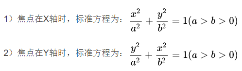
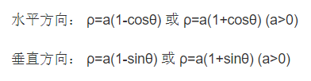
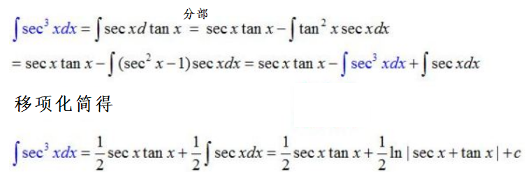

# 一元函数的专题内容

## 微分相关

### 物理应用

1. 位移s方程：$s=s(t)$，其中t为时间

2. 速度v方程：$v=\lim_{Δt \to 0} \frac{Δs}{Δt} =s'(t)$ 

3. 加速度a方程：$a=\lim_{Δt \to 0} \frac{Δv}{Δt} =v'(t)=s''(t)$ 

### 相关变化率

已知 $y=f(x)$ 及其参数方程 $\left\{\begin{matrix}x=x(t)
 \\y=y(t)
\end{matrix}\right.$，则有$\frac{dy}{dt} =\frac{dy}{dx}\frac{dx}{dt}=f'(x)\frac{dx}{dt}$，其中$\frac{dy}{dt}$和$\frac{dx}{dt}$之间由f'(x)联系在一起，也可以说$\frac{dy}{dt}$和$\frac{dx}{dt}$之间是相互依赖的，因此也将这两个变化率称为相关变化率。

### 曲率应用

假设y(x)二阶可导，则对于曲线y=y(x)==在点(x,y(x))处==有以下公式：

1. 弧微分公式：$ds=\sqrt{1+(y')^{2}} dx $ 
2. 曲率公式：$k=单位弧段上切线转过的角度=\left | \frac{d\alpha}{ds} \right | =\frac{|y''|}{[1+(y')^{2}]^{\frac{3}{2}}}$ 
   - 圆上各点处的曲率都等于半径的倒数
3. 曲率半径公式：$R=\frac{1}{k}$（与曲率互为倒数）
4. 曲率圆表达式：$(X-a)^{2}+(Y-b)^{2}=R^{2}$，其中 $a=x-\frac{y'[1+(y')^{2}]}{y''}，b=y+\frac{1+(y')^{2}}{y''}$ 

### 微分方程的应用

1. 牛顿第二定律：位移对时间的导数为速度、速度对时间的导数为加速度、力=质量×加速度
2. 变化率问题：提法多为某一变化率$\frac{dy}{dx}$与某个式子$f(x)$成正比，即$\frac{dy}{dx}=kf(x)$ 

（注意：需要根据题目为加速度或其他变化率添加正确正负符号）

## 积分相关

### 物理应用

1. 变力沿直线做功

   $W=\int_{a}^{b} F(x)dx$，其中F(x)为力函数

2. 抽水做功

   $W=\rho g\int_{a}^{b} xA(x)dx$ 

   - 抽水做功等于水的重力做功，即==mgh==
   - 微元法：dW=$(\rho  A(x)dx)gx$=某一层水的质量×g×该层高度

3. 垂直浸没在水中的平板的一侧受到的水压力

   $P=\rho g\int_{a}^{b}x[f(x)-h(x)]dx$ 

   - 压力=面积×压强，压强\===$\rho gh$== 
   - 微元法：$dP=\rho gx[f(x)-h(x)]dx$=某一层水的压强×该层平板的面积（斜的就是斜的面积、直的就是直的面积）
   - 如果题目没有给出像重力加速度、质量等这样的参数，则一般可以通过已知条件求解出来。
   - 重量=重力×质量=mg。

### 几何应用

**平面曲边梯形的形心坐标公式**

推导公式：$\frac{坐标累积值}{面积}$ 

- $\bar{x} =\frac{\iint_{D}xd\sigma}{\iint_{D}d\sigma}=\frac{\int_{a}^{b}dx\int_{0}^{f(x)} xdy}{\int_{a}^{b}dx\int_{0}^{f(x)}dy}=\frac{\int_{a}^{b}xf(x)dx}{\int_{a}^{b}f(x)dx}$ 
- $\bar{y} =\frac{\iint_{D}yd\sigma}{\iint_{D}d\sigma}=\frac{\int_{a}^{b}dx\int_{0}^{f(x)} ydy}{\int_{a}^{b}dx\int_{0}^{f(x)}dy}=\frac{\frac{1}{2}\int_{a}^{b}f^{2}(x)dx}{\int_{a}^{b}f(x)dx}$ 

**平面曲线的弧长**

推导公式：==$s=\int_{a}^{b}\sqrt{(dx)^{2}+(dy)^{2}}$==

1. 曲线由直角坐标方程给出$y=y(x)$（a≤x≤b）

   $s=\int_{a}^{b} \sqrt{1+[y'(x)]^{2}} dx$（弧微分的累积）

2. 曲线由参数方程给出$\left\{\begin{matrix}x=x(t)
    \\y=y(t)
   \end{matrix}\right.$（a≤t≤b）

   $s=\int_{a}^{b} \sqrt{[x'(t)]^{2}+[y'(t)]^{2}} dt$ 

3. 曲线由极坐标方程给出$\rho=\rho(θ)$（a≤θ≤b）

   $s=\int_{a}^{b} \sqrt{[\rho(\theta)]^{2}+[\rho'(\theta)]^{2}}d\theta $ 

**旋转曲面的面积**

推导公式：$S=\int_{a}^{b}(2Πy)·弧微分$ 

1. 曲线$y=y(x)$在[a,b]上绕x轴旋转一周得到的旋转曲面的面积

   $S=2Π\int_{a}^{b}|y(x)|\sqrt{1+[y'(x)]^{2}}dx$ 

2. 曲线$\left\{\begin{matrix}x=x(t)
    \\y=y(t)
   \end{matrix}\right.$在[a,b]上绕x轴旋转一周得到的旋转曲面的面积

   $S=S=2Π\int_{a}^{b}|y(t)|\sqrt{[x'(t)]^{2}+[y'(t)]^{2}} dt$ 

**已知截面面积的立体体积**

$V=\int_{a}^{b}A(x)dx$，其中 A(x) 为立体已知的截面面积公式（重点在于计算截面积公式）

# 题型总结

1. 由一个变化率求另一个变化率

   举例说明：漏斗高18cm、上端圆直径为10cm，开始时盛满溶液并漏入一个直径为10cm的圆筒中，当溶液在漏斗中深为12cm时液面下降速率为1cm/min，求此时圆筒中液面上升速率。

   解题过程：① 求导法：由于液面下降/上升速率等于液面高度变化与时间变化的比值，因此只需求出分别在漏斗和圆筒中以液面高度为因变量、以时间为自变量的函数，求导并联系相关信息即可求解；② 微分法：找出漏斗液面下降速率和圆筒液面上升速率之间的微分量关系即可求解。

2. 求由参数方程确定的路程$\left\{\begin{matrix}x=x(t)
    \\y=y(t)
   \end{matrix}\right.$的速度和加速度：

   v=$\sqrt{(\frac{dx}{dt})^{2}+(\frac{dy}{dt})^{2}} $，$a=\sqrt{(\frac{d^{2}x}{dt^{2}})^{2}+(\frac{d^{2}y}{dt^{2}})^{2}} $

   （若方程由极坐标给出，则须转化为直角坐标方程）

3. 汽车变速刹车问题：假设质量为m的汽车的初始速度为$v_{0}$，其所受阻力与速度成正比(k)，求汽车的刹车距离。

   解决方法有两种：首先写出牛顿第二定理 $a=\frac{dv}{dt}=-\frac{vk}{m}$ 。

   ① 将刹车问题看成$v\to 0$的极限问题，因此只需找出位移和速度之间的关系等式。由于$\frac{dv}{dt}=\frac{dv}{ds}\frac{ds}{dt}=\frac{dv}{ds}v$，代入方程得$dv=-\frac{k}{m}ds$，两边求积分即可得到位移和速度之间的关系等式，令$v\to 0$即得结果；

   ② 将刹车问题看成$t\to +∞$的极限问题，因此只需求出速度方程v(t)，对其求积分$\int_{0}^{+∞} v(t)dt$即可；或者求出位移方程s(t)，对其求极限$\lim_{t \to +\infty} s(t)$即可。

4. 引力问题：比如求某一长为l和质量为M的细杆对某一质量为m的质点的引力，须注意 ① 引力公式为$F=\frac{GMm}{r^{2}}$；② 引力微元为$dF=\frac{Gm\frac{M}{l}dx}{r^{2}}$；③ 细杆上某点对质点的引力需要分别投影为x和y方向上再积分。

5. 求曲线围成的面积、曲线弧长等、曲线绕x轴所围成曲面的面积：

    - 分为三种情形：即曲线函数分别由直角坐标方程、参数方程、极坐标方程给出。
    - 一般题给哪种方程就按该种方程的公式进行计算，但有时候题给方程难以计算，此时就需要转化成其他方程再计算：
      - 直角坐标方程转化为参数方程：其实就相当于积分计算的换元法。比如求内摆线$x^{\frac{3}{2}}+y^{\frac{3}{2}}=a^{\frac{3}{2}}$所围成的面积：只需将曲线方程通过换元（$x=a\cos^{3}t,y=a\sin{3}t$）转化为参数方程进行求解；
      - 直角坐标方程转化为极坐标方程：在计算有关面积的积分时，直角坐标系的面积元素不能直接用坐标转换公式通过换元变成极坐标系的面积元素，此时只能将直角坐标方程转化为极坐标方程后，再套用相应的公式进行计算。比如求曲线$x^{3}+y^{3}=3axy$（a>0）所围成的面积，此时需要先求出$\rho(\theta)$，再套用公式 $\int_{a}^{b}\frac{1}{2} \rho ^{2}d\theta $ 进行计算。

# 注意事项

1. 圆锥的体积：$\frac{1}{3}×底面积×高$ 

2. 已知$f(0)=0,f(60)=2700,f'(0)=0,f'(60)=0$，证明至少存在一点使得$f''(\xi)≥3$

   ① 泰勒中值定理（因为有三个阶次）：取$x_{0}$等于60和0得到两个泰勒公式，取特殊值x=30合并两个式子

   ② 通过$|f''(\xi_{1})|+|f''(\xi_{2})|≤2max\{|f''(\xi_{1})|,|f''(\xi_{2})|\}=2f''(\xi)$放大式子，即可证明

3. $\int\tan xdx=ln|\cos x|+C$ 

4. 已知y=y(x)和g=g(x)，求$\frac{dy}{dg}$和$\frac{d^{2}y}{dg^{2}}$：

   通过恒等变形转化为对x的求导：$\frac{dy}{dg}=\frac{\frac{dy}{dx}}{\frac{dg}{dx}}$，$\frac{d^{2}y}{dg^{2}}=\frac{\frac{d\frac{dy}{dg}}{dx}}{\frac{dg}{dx}}$ 

5. 打桩问题：打桩的阻力与桩打进地下的深度成正比（k>0），每次打桩所做功与前一次之比为常数r(0<r<1)，第一次打桩的深度为a，若击打次数无限，至多可以打进地下多深？

   解题思路：先将文字翻译成数学表达式，然后寻找规律，根据规律递归到平凡情况，再进行求极限得到结果。

6. 椭圆方程：2a为长轴长度，2b为短轴长度

      

7. $\int_{-a}^{a} \sqrt{a^{2}-x^{2}}dx$ 的几何意义是半圆的面积

8. $\int_{-b}^{b} a\sqrt{1-\frac{x^{2}}{b^{2}}}dx$ 的几何意义是半个椭圆的面积（椭圆面积=Πab）

9. 心形线方程：

     

10. 参数方程$\left\{\begin{matrix}x=x(t)
     \\y=y(t)
    \end{matrix}\right.$的二阶导：$\frac{d\frac{dy}{dx}}{dx}=\frac{d\frac{y'(t)}{x'(t)}}{dx}=\frac{\frac{d\frac{y'(t)}{x'(t)}}{dt}}{\frac{dx}{dt}}$

11. $\int_{0}^{\frac{Π}{2}} \frac{sin^{2}\theta cos^{2}\theta}{(sin^{3}\theta+cos^{3}\theta)^{2} }d\theta$：上下同除即可求解。

12. 求$\int \frac{1}{cos^{3}x} dx$：

      
    
13. $f(x)f'(x)=\frac{1}{2}[f^{2}(x)]^{'}$  