# 汇编语言

## 机器语言和汇编语言

1. 机器语言是机器指令的集合，用01表示，可以被CPU直接理解和解释；汇编语言是汇编指令的集合，用字符表示，通过汇编程序翻译成机器语言后才能被CPU理解和解释。

2. 汇编指令和机器指令一一对应，它们的差别仅在于指令的表示方法，汇编指令就是根据机器指令的功能起的一个英文名称，因此汇编指令可以理解为机器指令的助记符。

3. 汇编指令本身也是由01组合而成的，但其通过字符集可以转换成人可以阅读的字符，因此实际上从机器指令映射为汇编指令就是一段01转换成了另一段01。

4. 机器指令：1000100111011000

   操作：寄存器BX的内容送到AX中

   汇编指令：MOV  AX,BX

5. 汇编语言 = 汇编指令（主体）+伪指令

   伪指令由编译器（软件）执行（编译阶段执行），汇编指令由编译器翻译成机器指令后由硬件执行（执行阶段执行）。

   汇编指令不区分大小写。

6. 汇编指令和高级语言的转换

   MOV AX,8（=高级语言=>）AX=8

   ADD AX,BX（=高级语言=>）AX=AX+BX

## 处理器和存储器

1. 处理器的眼中只有存储器（寄存器也算），离开了存储器，处理器什么也干不了。因为其工作就是从存储器中取出数据或指令，执行指令对数据的操作，将结果返回给存储器。可以说处理器不和存储器之外的任何设备接触。

   CPU和内存是一对，GPU和显存是一对。现在的IO接口上也有处理器，可以和内存直接交流，以前的IO设备要和内存交换数据，必须经过CPU。

2. 在存储器上，地址、指令和数据没有任何区别，都是二进制数。将其放到什么总线上，它就是什么，比如将一段二值放到地址总线上，那么它就是地址，以此类推。

   地址总线的宽度决定了CPU的寻址能力；数据总线的宽度决定了一次数据传输量；控制总线的宽度决定了CPU的控制能力（可以控制多少个设备）。

   内存地址空间就是指有多少个存储单元。

3. CPU不能直接控制外部设备，而要通过IO接口才行。CPU控制IO接口，IO接口控制外部设备。

   CPU是如何控制设备的？CPU 能交流的只有能存储东西的玩意，因此它只能做的就是向设备上的状态寄存器等存储元件发送一位或一段二值，而设备根据这些存储元件的状态来调整自己的工作。因此CPU只是通过改变设备的寄存器状态，而设备自己根据寄存器状态的来做相应的工作。

4. CPU将所有存储器的存储单元都看成一个整体，称之为逻辑存储器。CPU将所有存储器的存储单元的地址都统一分配，不同的地址范围就代表了不同的存储器，CPU对不同的地址范围进行读取，就是对不同的存储器进行交流。

5. 汇编指令用于控制CPU工作，本质上就是控制CPU如何通过三条总线（地址总线、数据总线、控制总线）将三种机器数（地址、指令、数据）从内存中读取或写入。

## 8086CPU

1. 如何表示物理地址

   机器字长为16位，地址总线有20位。那么如何用16位来表示20位的物理地址呢？

   用两倍机器字长（段地址+偏移地址）来表示，即物理地址=段地址×16（左移4位）+偏移地址。因此，一个物理地址可以由多种形式的（段地址×16+偏移地址）来表示。

   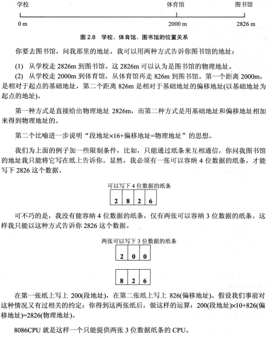

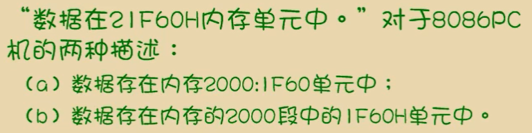

2. 地址分段

   将内存空间分段，段的起始地址（基础地址）必须是（段地址×16）。偏移地址的长度决定了段的最大长度（64K）。

3. 段地址寄存器和IP寄存器

   段地址寄存器有四种：代码寄存器CS、数据段寄存器DS、堆栈段寄存器SS、附加段寄存器ES。

   用段寄存器存放段地址，IP寄存器放偏移地址，它们共同作用形成一个物理地址，指向内存空间的某一个存储单元。

   CPU认为用CS:IP指向的内容就是指令，用DS:IP指向的内容就是数据。将一组代码放在一个地址段中，就构成了代码段。如果要想CPU执行该代码段，那就需要用CS:IP指向该代码段的起始地址。其实，如果我们将DS指向该代码段的起始地址，CPU就将该段认为是数据段，而不是代码段。

   CPU刚启动时就有一个默认的CS:IP值（FFFF:0000），它指向的内容就是CPU开机后的第一条指令。

4. 用 JMP 来修改CS和IP的值：JMP 2AE3:3（段地址:IP地址）

   仅修改IP的值：MOV AX,200H =>  JMP AX

5. CPU执行指令的过程

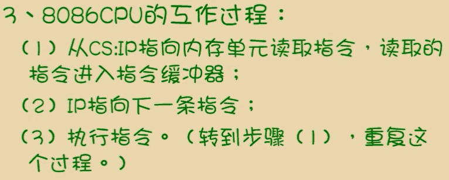

6. Debug调试工具
   - 进入Debug模式：cmd  => debug
   - R：查看和修改寄存器内容
   - D：查看内存内容
   - E：修改内存内容
   - U：将内存中的机器指令翻译成汇编指令
   - T：执行CS:IP指向的指令
   - A：以汇编指令的格式向内存写入机器指令

> 显存也是CPU逻辑存储器的一部分，CPU可以直接指定显存的地址范围为数据的输出空间，但数据并不会直接到达显存，而是要经过GPU翻译后才能进入显存。显存的各个存储单元与显示器的像素点一一对应，向显存输入什么数据，显示器就会显示什么东西（这其中还要有一个将数字信号转换为模拟信号的渲染电路）。
>
> 计算机是根据存储器的状态来工作的。存储器包括存储1位二值的触发器、存储n位二值的寄存器以及内存等。举例来说：
>
> 1. 中断屏蔽触发器决定了IO设备能否发出中断请求；
>
> 2. 地址寄存器用来决定内存中的哪个存储单元有效；
>
> 3. 显存决定了显示器显示什么内容。
>
> 4. 实际上可以把计算机的各个处理电路看成是一个函数，存储器就作为这些函数的输入和输出。
>
>    (学习计算机某个单元的作用就是了解该单元有哪些输入和哪些输出。学习过程中还可以把一个单元在细分成多个电路来分析，看看各个小的电路有哪些输入和哪些输出)

7. 通用寄存器AX为16位（字），为了兼容，将其分成两个寄存器AL和AH，分别存放低位字节和高位字节。

### 数据段寄存器

DS寄存器用来存放要访问数据的段地址，而偏移地址直接由 [NUM] 指出。

8086CPU不支持将数据直接送入段寄存器的操作。

- 段地址 -> 通用寄存器 -> 段寄存器
- 偏移地址直接给出

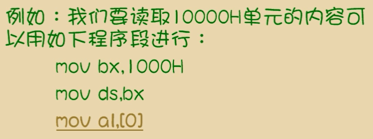

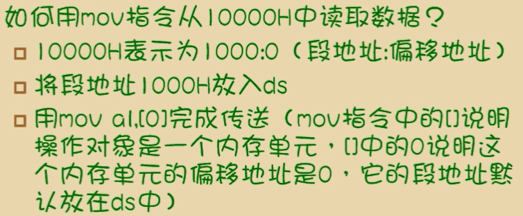

### 栈段寄存器

内存空间的结构和数组类似，可以说除了数组，其他数据结构在物理上都是不存在的，都是通过逻辑上加以限制，使其表现得像某个数据结构而已。

1. 如何确定栈顶元素？

   段寄存器SS存放栈顶的段地址，寄存器SP存放栈顶的偏移地址。因此在任何时刻，SS:SP都指向栈顶元素。

   假设将10000H~1000FH这段空间当作栈，SS=1000H。当栈中只有一个元素时，SS:SP=1000H:000EH；当栈为空时，SS:SP=1000H:0010H。

2. PUSH入栈和POP出栈的操作都是**以字为单位**的，它们都属于**访存指令**。

   PUSH  AX（入栈）

   -  SP=SP-2；
   - 将AX的内容送到SS:SP指向的内存单元。

   POP  AX（出栈）

   - 将SS:SP指向的内容送到AX；
   - SP=SP+2。

   

   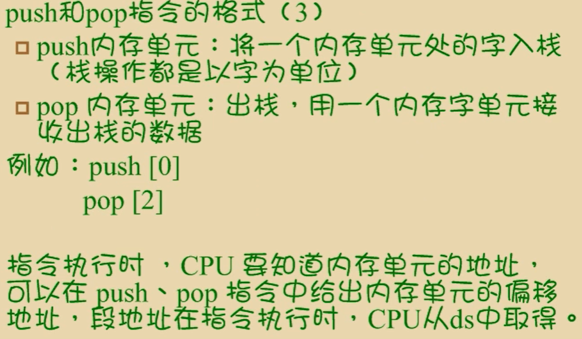

3. 如何确定栈边界，以防止栈顶越界（栈溢出）？

   CPU不保证对栈的操作不会越界（只记录栈顶），我们在编程时要自己操心栈顶越界的问题（自己管理栈空间的大小）。

4. 栈的一大作用就是用来保护现场和恢复现场。从高级语言来看，栈对函数特别有用，函数的调用实际上就是不断的入栈和出栈。

5. 举例说明

   - **例一：**利用栈交换数据

     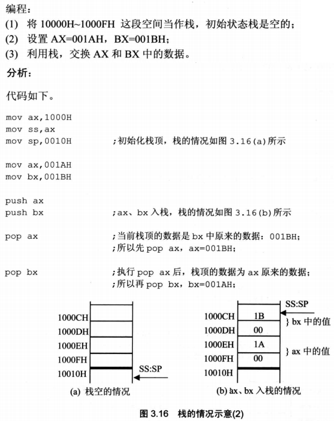

   - **例二：**SP溢出

     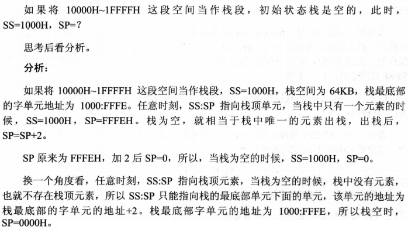

   - **例三：**栈循环

     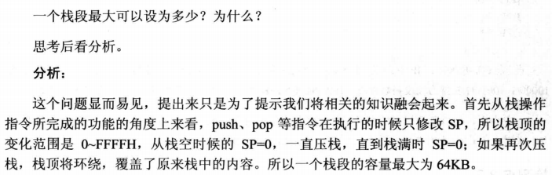

## 用汇编编程

### 从源程序到可执行的过程

1. 使用编辑器（vscode）编写源代码

2. 编译（MASM.EXE）产生本地文件（机器码）

3. 链接（LINK.EXE）产生可执行文件

   可执行文件包括程序（机器码）、数据、描述信息。

   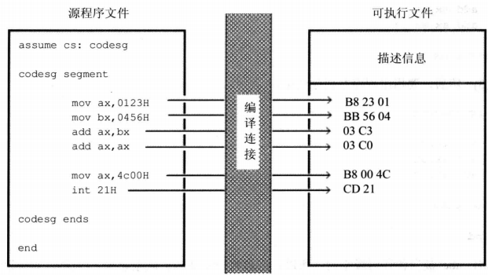

4. 运行可执行文件中的程序

   操作系统根据可执行文件的描述信息，将机器码和数据加载到内存，并进行初始化（比如将CS:IP指向第一条指令），然后由CPU执行程序。

 ### 源程序

包括汇编指令和伪指令。汇编指令是可转换为机器指令并被CPU执行的汇编语言。

汇编程序由多个段（至少有一个代码段）组成，这些段用来存放代码、数据、或当作栈空间来使用。

#### 标号

标号没有固定的名称，主要用于指代一个地址。

1. segment和ends中的段名就是一个标号，它指定了一个段的段地址。

2. 用于指定程序的入口。下图中的start就是一个用于指定程序的入口的标号：

   （只有在end后面指定的标号才是程序的入口）

   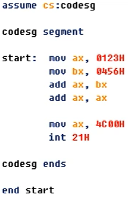

#### 伪指令

伪指令用于告诉编译器程序的结构，并让编译器做一定的处理，其没有对应的机器指令，不能被CPU执行，最终不会被编译到本地文件中。

1. segment和ends：成对使用，用于段定义。

   段名  segment

   段名  ends

2. end：程序结束标记，用于告诉编译器可以停止编译了。

3. assume：用于将段寄存器关联到某一个段。下面将名为code的标号定义的段标识为一个代码段。

   ``` assembly
assume  cs:code
   code  segment
code  ends
   ```

### 程序返回

1. 什么是程序返回

   操作系统就是这个正在运行的程序，它就负责把其它程序加载到内存并让CPU执行。因此每次调用程序后都必须返回，不然就卡在那里了。

   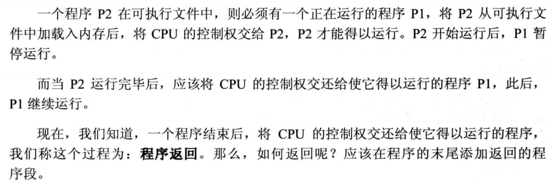

2. 三种与结束相关的指令

   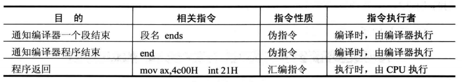

### 链接的作用

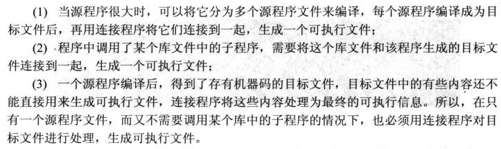 

### 具体应用

1. 例一：源程序编写过程

   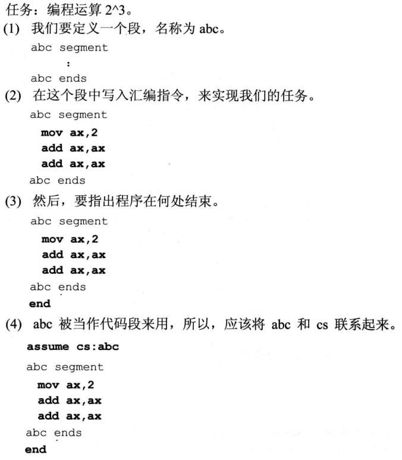 

2. 例二：具体编程过程

   - 编写example.asm
   - masm example.asm => example.obj 
   - link example.obj  => example.exe
   - 运行example.exe

3. 例三：简化编程过程

   增加“ ; ”可以简化过程中的说明。

   - 编写example.asm
   - masm example.asm;
   - link example.obj ;
   - 运行example.exe

4. 例三：最简化编程过程

   ml 是集合masm和link的工具。

   - 编写example.asm
   - ml example.asm
   - 运行example.exe

### 程序的执行过程

任何通用操作系统都必须提供一个shell程序让用户可以操作计算机内核工作。windows系统的shell程序就是cmd.exe（命令解释器）

1. cmd将可执行文件example.exe中的机器码和数据加载到内存中，并设置CS:IP指向程序的第一条指令（程序入口）；
   - 找到一段空间足够大的空闲内存区（SA:0），在前256个字节创建PSP数据区（用于操作系统和被加载程序的通信）；
   - 在PSP数据区后（SA+10H:0处）装入程序，并将CS:IP指向程序入口的地址；
   - 因此此时，DS=SA，CS=SA+10H。此外，CX寄存器存放程序的长度。

1. cmd挂起，把CPU的控制权交给example.exe，CPU执行example.exe；
2. 执行完成后，将程序返回，控制权交回cmd，CPU继续执行cmd。

> **使用Debug测试程序：debug example.exe**
>
> 使用Debug测试程序时，Debug并不放弃对CPU的控制权，以便可以在程序每执行一步后可以中断程序。因此，Debug属于单步调试。
>
> 要使用P命令执行int 21，以便正常结束程序。这里是使用debug加载程序，因此程序结束后返回的程序也是debug。然后再使用q命令退出Debug程序，返回到cmd程序（因为debug是由cmd加载运行的。谁给你权力，你结束后就要把权力交还给谁）。

## [bx]和loop指令

### [bx]的作用

mov ax,[0]本意是将编译地址为0的内存单元的内容传入ax，但编译器认为[0]就是0。如果要达到前面的效果，那就只能使用[bx]，提前把0传入bx寄存器中（mov bx,O）。

但是直接在debug中编写mov ax,[0]就没有问题。如果一定要用[0]怎么办？那就可以采用以下的方式：mov ax,ds:[0]，即加上数据段地址就可以了。当然，mov ax,ds:[bx]也是可以的，其和mov ax,[bx]的意思一样。

> ()是描述性符号，用(ax)表示ax寄存器的内容。
>
> idata表示该位置应该填写一个常量。
>
> inc bx：bx的值自增1。
>
> debug里面编写指令是默认为16进制的，不需要加H。而在其他编辑器中编写指令一般默认为十进制，需要末尾加H来表明所写数值为16进制。
>
> 在汇编源程序中数据不能以字母开头，比如ffffH需要在在前面加个0，即0ffffH。

### loop的作用

用于循环执行指令。

- 格式：loop 标号
- 执行过程：（cx）=（cx）-1；判断（cx），若为0则终止循环，不为0则执行标号处指令。
- 解释：cx寄存器存放循环次数，标号指定要循环的指令。
- 注意：要循环指令段就放在loop指令前面。

> 用debug的G命令或P命令快速执行完loop指令
>
> - g x：x为loop指令下一条指令的地址，就是让程序一直执行到loop指令的下一条指令。
> - p命令：用于快速执行完当前指令。结束时也是用p命令，这就是为了快速执行完结束程序所需要的后续处理。

### [bx]和loop的联合应用

计算ffff:0~ffff:b单元中的数据的和，结果保存在dx中。

- 分析：内存单元是8位，dx寄存器为16位，两者不能直接相加，即(dx)=(dx)+(ffff0H)。因此就需要一个ax寄存器作为两者的中介，将(ffff0H)先转换为16位的数据，即(al)=(ffff0H)、(ah)=0，然后再(dx)=(dx)+(ax)就行了。代码如下：

  ```assembly
  mov al,ds:[x]
  mov ah,0
  add dx,ax
  ```

- 这段代码需要执行12次（加12次），因此可以用loop指令。但其中x是递增变化的，这就要用到[bx]了，利用bx寄存器将偏移地址作为变量来使用。完整代码如下：

  ```assembly
  assume cs:code
  code segment
  	 mov ax,0ffffh
  	 mov ds,ax
  	 mov bx,0
  	 mov dx,0
  	 mov cx,12
  	
  here:mov al,[bx]
  	 mov ah,0
  	 add dx,ax
  	 inc bx
  	 loop here
  	 
       mov ax,4c00h
       mov 21h
  code ends
  end
  ```

### 段前缀

mov ax,ds:[0]中ds就是段前缀，表明[0]是指数据段中的第一个内存单元。

ds可以换成其他段寄存器，以切换[0]所指的内存段。比如cs:[0]就是指指令段中的第一个内存单元，ss:[0]就是指栈段中的第一个内存单元，es:[0]就是指附加段中的第一个内存单元。

如果不写段前缀，[0]在debug模式编写的指令中默认是指ds所指的数据段，但在编辑器编写的源代码中默认是数值。

#### 段前缀的使用

假设要将一段空间的数据复制到另一段空间，我们可以用一个段寄存器先后分别设置这两段空间的段地址来分别指代这两段空间：

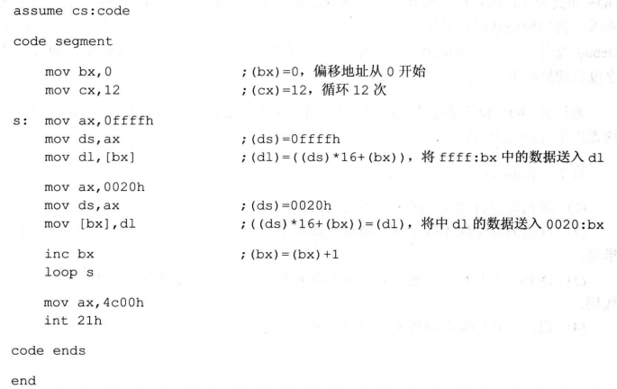

但我们也可以通过两个段寄存器来分别指代这两段空间，从而减少循环的内容，提高执行效率：

（通过两个段寄存器来指代两段距离比较远的内存空间，并通过段前缀来区分和使用这两段空间中的内存单元）

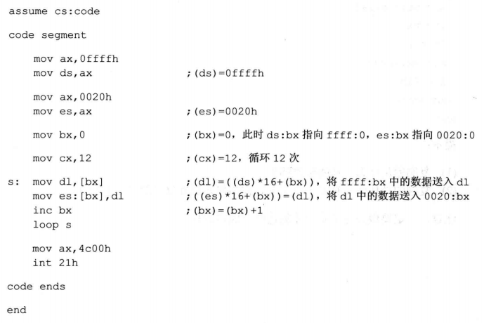

### 段安全

如果指令中操作的内存单元存放的是重要的系统资源，那么指令的执行结果可能引发系统错误，但一般该指令不会执行成功，而是被操作系统直接拒绝。因此要想安全地执行程序，就必须先找到一段安全的内存空间。

一般在0:200~0:2FF这段256个字节的内存空间是不会被系统使用的，因此这段空间是安全的。

如果需要使用更多的空间，就需要向操作系统请求。

## 多段程序

> **封装的好处**
>
> 面向过程：将处理特定问题的程序封装在一个函数中。
>
> 面向对象：将同类的函数封装在一个对象中。

### dw伪指令

用于定义字型数据（definite word）。

- dw 0123h,0456h,0789h

- 该条指令在哪个内存地址上执行，就是从哪个地址开始存放数据。如下代码所示，dw指令定义的三个数据的地址分别为cs:0、cs:2、cs:4。因为已经假定code段为cs段，所以dw指令定义的数据肯定在代码段中，而且在代码段开头执行，因此这三个数据的偏移地址就从头开始数起。

  ```assembly
  assume cs:code
  code segment
  	dw 0123h,0456h,0789h
  	mov bx,0
  	mov cx,3
    s:add ax,cs:[bx]
  	add bx,2
  	loop s
  	mov ax,4c00h
  	mov 21h
  code ends
  end
  ```

- dw是一个伪指令，因此它是在编译阶段就把数据定义在内存单元中了。如果dw像上面一样直接使用在代码段中，系统就不能按默认的方式从头开始执行（代码段的开头存放的是数据，在CPU看来这些数据就跟指令一样），因此就需要指定程序入口。

  ```assembly
  assume cs:code
  code segment
  	  dw 0123h,0456h,0789h
  start:mov bx,0
  	  mov cx,3
      s:add ax,cs:[bx]
        add bx,2
        loop s
  	  mov ax,4c00h
  	  mov 21h
  code ends
  end start
  ```

### 在代码段中使用栈

利用栈将0123h，0456h，0789h这三个数据在原来的内存单元中逆序存放。由于要使用栈，就需要一段内存空间作为一个栈来使用，我们可以以定义数据的方式来获取一段空间，并在程序中人为地指定它为栈。完整的代码如下所示：

> dw 0123h,0456h,0789h：可以说是定义了3个字型数据,也可以说是开辟了3个字的内存空间。

```assembly
assume cs:code
code segment
	  dw 0123h,0456h,0789h
	  dw 0,0,0
start:mov ax,cs
	  mov ss,ax
	  mov sp,12 ;初始化栈顶指针
	  
	  mov bx,0
	  mov cx,3
   s0:push cs:[bx]
      add bx,2
      loop s0

      mov bx,0
      mov cs,3
   s1:pop cs:[bx]
      add bx,2
      loop s1
      
	  mov ax,4c00h
	  mov 21h
code ends
end start
```

### 将数据、代码、栈放入不同的段

将数据、代码、栈放在一个段中，我们就需要注意何处是数据，何处是代码，何处是栈，因此最好的方式就需要将它们放入不同的段中。

```assembly
assume cs:code,ds:data,ss:stack

data segment
	  dw 0123h,0456h,0789h
data ends

stack segment
	  dw 0,0,0
stack ends

code segment
start:mov ax,stack;标号会被编译器处理为数值,所以不能直接mov到ss寄存器中
	  mov ss,ax
	  mov sp,6
	  mov ax,data
	  mov ds,ax
	  
	  mov bx,0
	  mov cx,3
   s0:push [bx]
      add bx,2
      loop s0

      mov bx,0
      mov cs,3
   s1:pop [bx]
      add bx,2
      loop s1
      
	  mov ax,4c00h
	  mov 21h
code ends
end start
```

> assume cs:code,ds:data,ss:stack：主要用于告诉汇编器这些标号定义的段是属于哪种类型的段。**但要让CPU知道这些被分配的段是什么类型的，还要我们在程序中指明**。
>
> end start：用来告诉编译器程序到此结束，同时也说明了程序的入口，使得操作系统可以在加载程序时**自动帮我们将CS:IP设置为start对应的内存地址**。
>
> 如果段定义中的数据占N个字节，则程序加载后，该段实际占有空间为16(N/16+1)。
>
> 程序的加载顺序是和段定义的顺序一致的，因此在内存空间中，这些段都是按段定义的顺序连续地进行存放。
>
> 如果不指定程序入口，那么该程序就会从头开始执行（将CS:IP指向程序加载到内存后的第一个内存单元）。如果将代码段定义在开头，这就不会出现问题，但如果将数据段或栈段定义在开头，CPU就会将数据拿来执行，就会出错。

## 更多的寻址方式

### and指令

逻辑与指令，按位进行与运算。可将指定位设为0。

```assembly
mov al,01100011B
and al,00111011B ;(al)=00100011B
```

### or指令

逻辑或指令，按位进行或运算。可将指定位设为1。

```assembly
mov al,01100011B
or al,00111011B ;(al)=01111011B
```

### ASCII

ASCII是一种字符集，用于将01组合（ASCII码）翻译成相应的字符。在汇编程序中，可以用字符的形式 'char' 给出数据，编译器会根据ASCII字符集将其转换成二进制数值（ASCII码）。

db 'unIX' 相当于 db 75H,6EH,49H,58H

mov al,'a' 相当于 mov al,61H

#### 改变字母大小写

1. 大小写的ASCII码是不一样的，改变大小写就是改变它的ASCII码，即大写字母ASCII码+20H=小写字母ASCII码。
2. 一个字母的第5位为0，就是大写字母，为1就是小写字母。

### [bx+idata]

用 (bx)+idata 的值作为偏移地址。也可以使用以下格式：

```assembly
mov ax,[200+bx]
mov ax,200[bx]
mov ax,[bx].200
```

可以用 [bx+idata] 的方式进行数组的处理。比如要将两个字符串分别转化为大写和小写，就可以将两个字符串当成两个数组来处理：

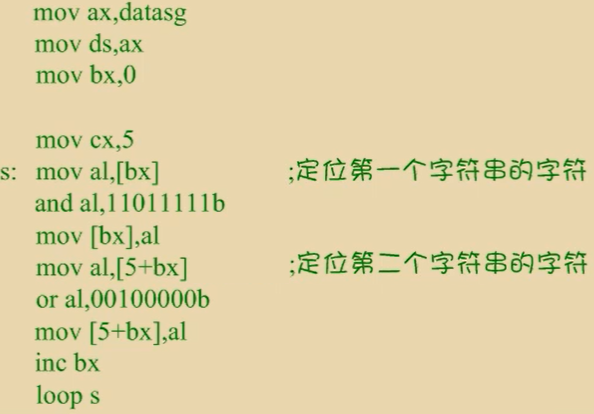

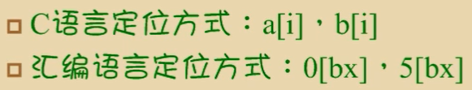

### SI和DI寄存器

SI和DI寄存器的功能和bx寄存器相近，但其不能分成两个8位寄存器来使用。即[si]和[di]都与[bx]一样，都可以作为ds寄存器的偏移地址来使用，它们默认的段地址都是ds。

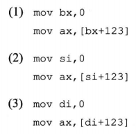

1. 将第一个字符串复制到点点上

   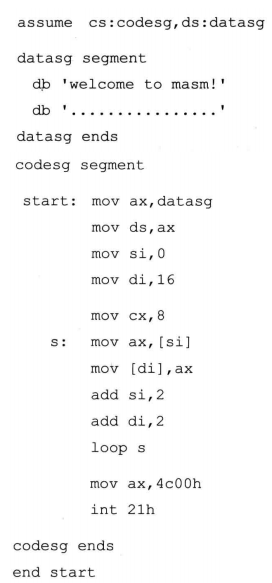

### 其他形式的寻址方式

1. [bx+si] 和 [bx+di]，[bx+si]也可以表示为[bx]\[si]。

2. [bx+si+idata] 和 [bx+di+idata]

   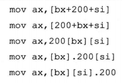

3. 总结

   

### 举例应用

**将以下数据段中的所有字符改为大写。**

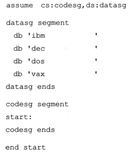

- 发现可以利用两个变量bx和si分别定位行偏移地址和列偏移地址，因此通过两层循环就可以解决这个问题：

  (由于循环计数器只有cx，为了实现内外循环，需要在内循环前将外循环的cx保存起来，等内循环结束后再恢复)

  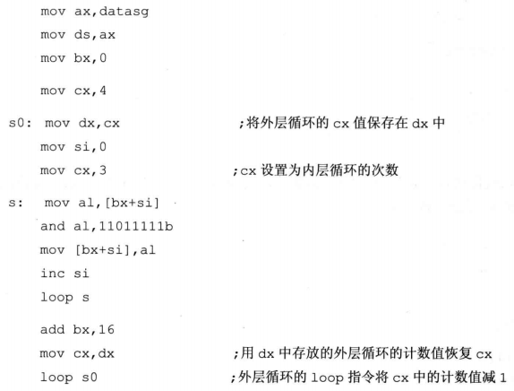

- 上面的程序用dx寄存器来暂存外循环的cx，但我们也可以用内存来暂存，即专门开辟一个空间来存放临时数据，比如在数据段后面添加一个字来保存数据：

  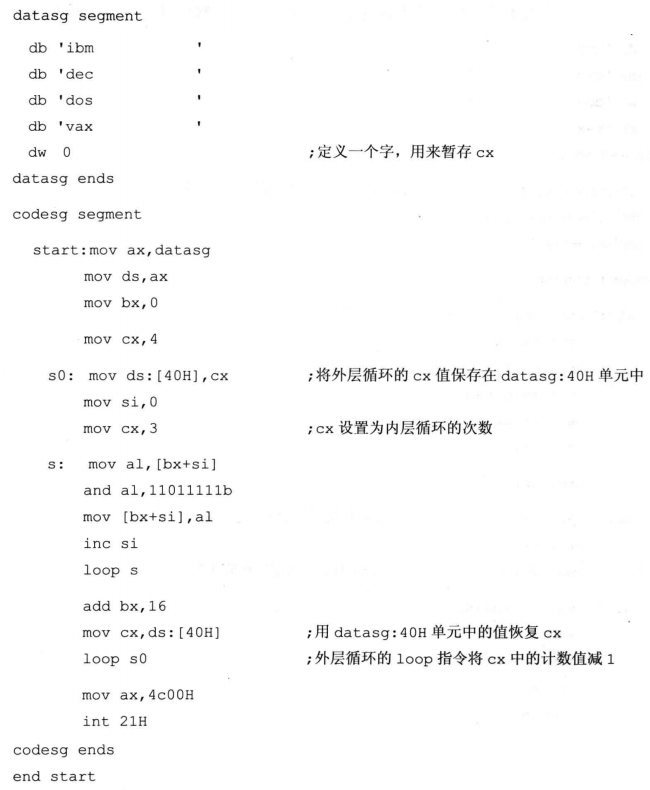

- 其实我们可以**利用堆栈的方式暂存数据**，这是更普遍的做法：

  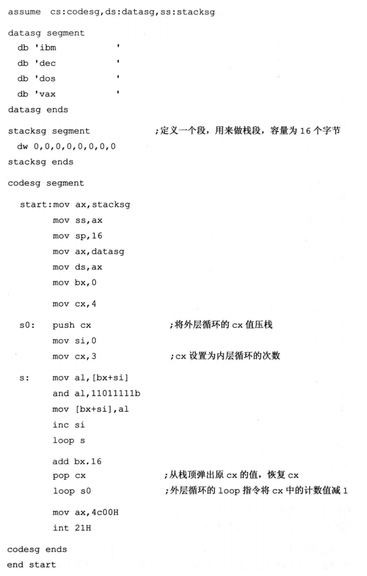

### 总结

1. [bx+idata] ：一般用idata手动指出行起点，bx指出列变化；或者用idata指出所需数据在数据段中的偏移量，用bx递增来获取数据。
2. [bx+si]：用bx作为行起点，si作为列变化。
3. [bx+si+idata]：用bx作为行起点，idata指出所需数据在每行数据段中的偏移量，si作为列变化来获取数据。
4. bx一般用于定位数组的起点；si作为数组的下标；idata作为数组的偏移量。

## 数据处理的进阶

处理的数据在哪里？要处理的数据有多长？

### bx、si、di、bp寄存器

reg表示寄存器，sreg表示段寄存器

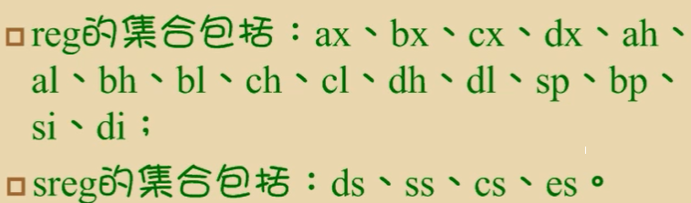

1. 在8086CPU中只有这四个寄存器（bx、si、di、bp）可用在 [ ] 中进行寻址；
2. 在 [ ] 中，这四个寄存器只能有以下组合：bx和si、bx和di、bp和si、bp和di；
3. 只要在 [] 中使用bp，而指令中没有显性地给出段地址，段地址就默认在ss中。

指令执行前，数据可以在CPU内部、内存、端口中。表示数据位置有三个方法：

1. 立即数（idata）。直接包含在机器指令中的数据，指令执行前存放在CPU内部的指令缓冲器中；
2. 寄存器。指令执行前存放在CPU内部的寄存器中；
3. 段地址：偏移地址。指令执行前存放在内存中。

### 寻址方式

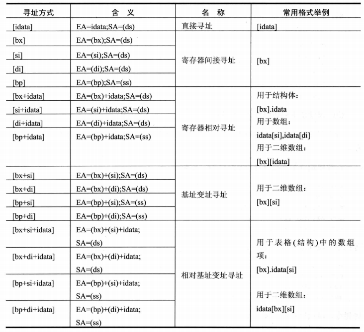

 ### 数据长度

数据长度有两种（byte和word），到底是多长要在指令中指明。

1. 通过寄存器名（ax、al、ah）指定数据长度；

2. 通过x ptr指明数据长度；

   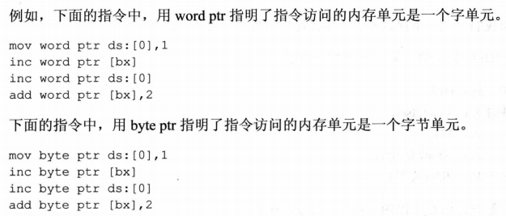

3. 指令默认了数据长度，比如push和pop默认操作字型数据。

### 综合应用

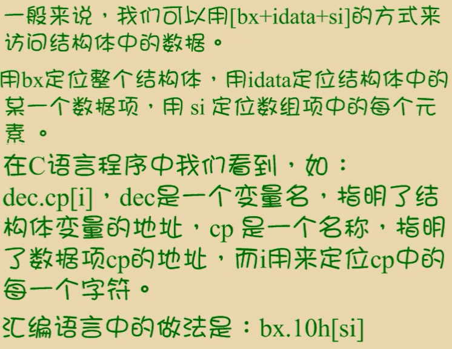

### div指令

用于做除法操作。

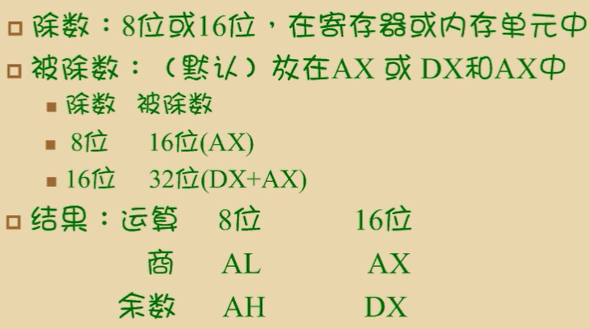

- 指令格式：

  div 寄存器

  div 内存单元

- 指令示例：

  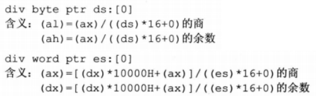

### dd伪指令

用来定义一个dword型数据。

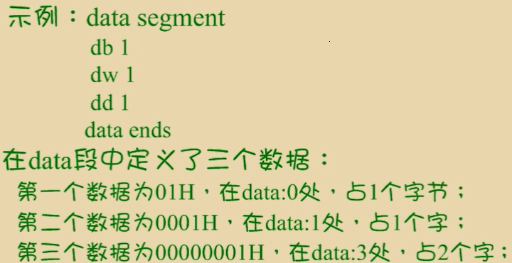

- 举例说明

  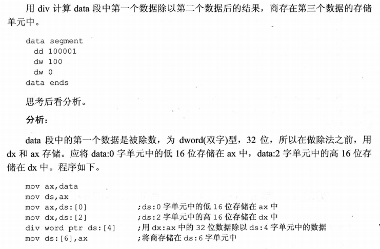

### dup伪指令

1. 指令格式

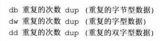

2. 指令示例

   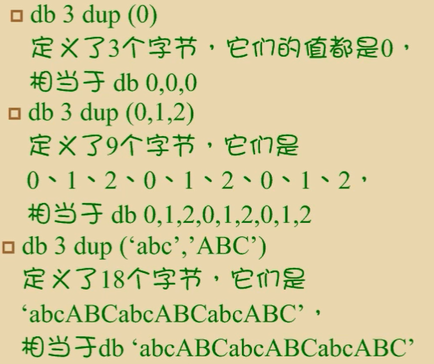

 ## 转移指令

### 伪指令offset

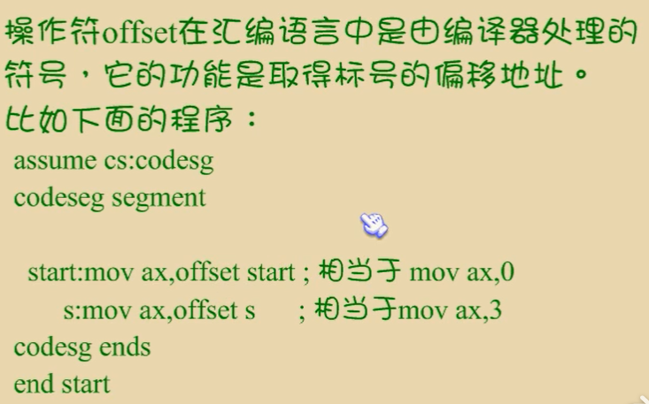

### jmp指令

1. 段内短转移

   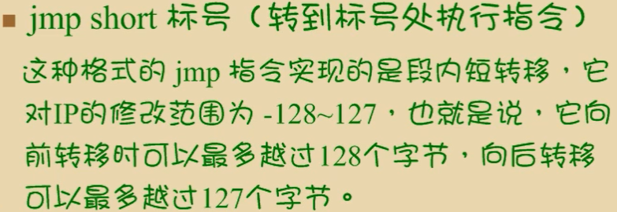

   在实际的机器指令中，操作数并不是标号所指的偏移地址，而是目标指令的IP与当前指令执行完后的IP的差，即跳转位移。也就是说，执行该指令并不是给IP进行赋值（mov），而是进行一次加法运算（add）。

   操作数指定为一个字节，且为补码形式，因此指令可以跳转的范围为-128~127。该操作数由汇编器自动算出后再转换为机器指令。

2. 段内近转移

   jmp near ptr 标号

   该指令作用和段内短转移完全一样，唯一的区别就是其机器指令的操作数所表示的跳转位移是16位，即该指令可以跳转的范围更大（-32769~32767）。

3. 段间转移（远转移）

   jmp far ptr 标号

   该指令用于段间转移，会同时用标号的段地址和偏移地址修改CS和IP。

   汇编器转换成机器指令的过程：jmp far ptr example => JMP 0BBD:010B => EA0B01BD0B。

   可见，该指令的跳转方式是直接给CS和IP进行复制。

4. jmp 16位寄存器（段内转移）

   执行后，(IP)=(16位寄存器)

5. jmp word ptr 内存单元地址（段内转移）

   执行后，(IP)=(内存单元地址)

   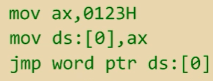

6. jmp dword ptr 内存单元地址（段间转移）

   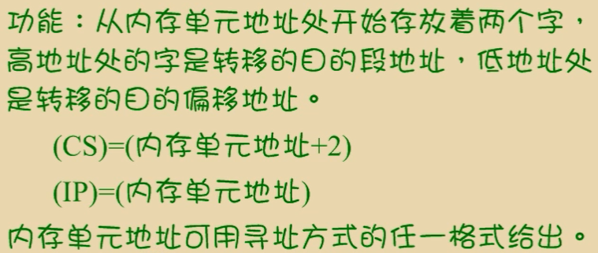

   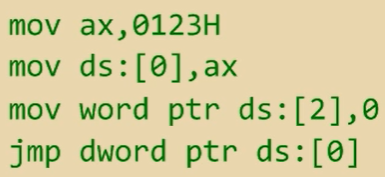

### jcxz指令

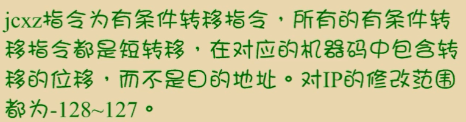

指令格式：

jcxz 标号（如果(cs)=0，则转移到标号处执行）

### loop指令

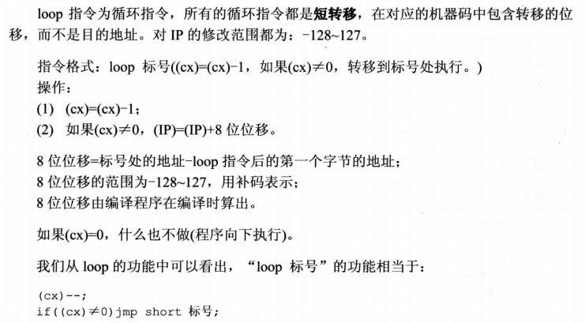

> dec指令：对目标数值减1后放回。

### 根据跳转位移进行转移的意义

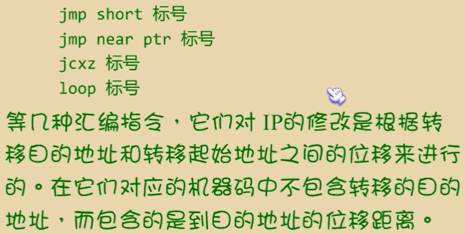

使得同一段代码可以在不同的内存段中正确执行（浮动装配），增加复用性。

但是根据跳转位移进行转移的指令的转移位移受到转移范围的限制。

jmp 2000:0100是在Debug模式中使用的汇编指令，汇编编译器并不认识，会报错。

> nop指令：啥都没有。
>
> xor bx,bx：bx清零。

### 分析程序

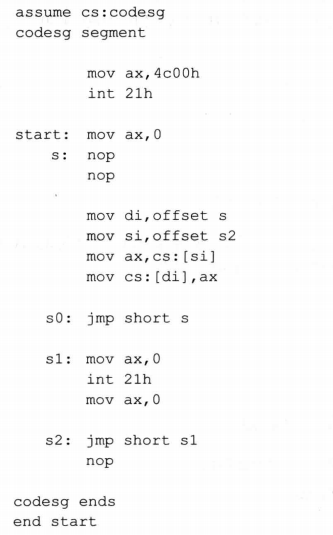

s2处的指令是位移跳转，跳转到其上10个字节处，因此最后它不是跳转到s1处，而是跳转到了s指令的上10个字节处，即首行指令处，因此可以正常返回程序。

### 显示字符

内存单元B8000H~BFFFFH为显存，向该区域写入数据，即可在显示屏显示出内容。

在80×25彩色字符模式下，显示屏一页可显示25行，每行80个字符，每个字符包含2个字节（ASCII码和属性值），所以一页可以有4KB字节，共有8页。

属性字节的格式如下：


## Call和Ret指令

### ret指令

利用栈中的数据修改IP，实现近转移。执行该指令有以下两步操作：

1. (IP)=((SS)*16+(SP))
2. (SP)=(SP)+2

即取出栈顶元素的值作为IP（pop ip）。

### retf指令

利用栈中的数据修改CS:IP，实现远转移。执行该指令有以下四步操作：

1. (IP)=((SS)*16+(SP))
2. (SP)=(SP)+2
3. (CS)=((SS)*16+(SP))
4. (SP)=(SP)+2

即连续取出最上面两个栈元素的值作为IP和CS（pop ip => pop cs）。

### call指令

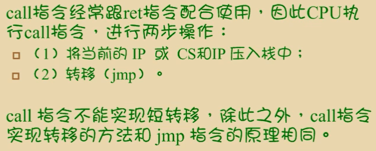

1. call 标号

   将当前的IP（call指令的下一条指令的IP）压栈，转到标号处执行指令。执行以下操作：

   

   相当于：

   ​	push IP

   ​	jmp near ptr 标号

2. call far ptr 标号

   将当前的CS:IP压栈，转到标号处执行指令。执行以下操作：

   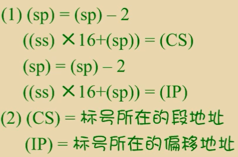

   相当于：

   

3. call 16位寄存器

   将当前的IP压栈，转到IP为 (16位寄存器) 处执行指令。执行以下操作：

   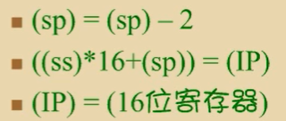

   相当于：

   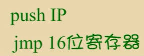

4. call word ptr 内存单元地址

   

5. call dword ptr 内存单元地址

   

### call和ret的配合使用

主程序中用call来调用子程序，子程序中用ret返回主程序，从而实现面向过程编程。

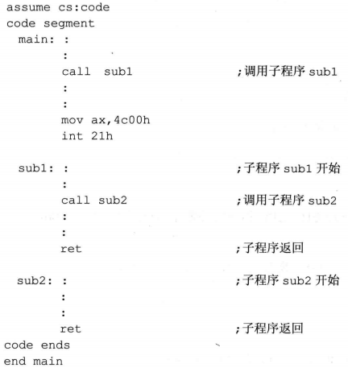

### mul指令

乘法命令。有如下要求：

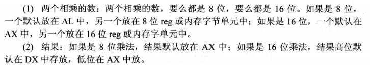

格式如下：

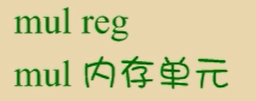

举例说明：

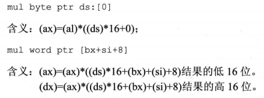

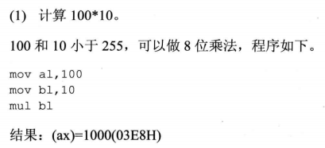

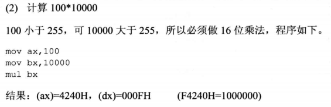

### 子程序参数和结果的传递

即如何存储子程序需要的参数和产生的返回值，以便到时候从存储的地方取。一般可以将它们存放在寄存器中：

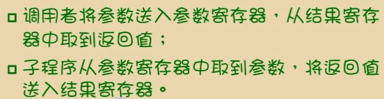

举例说明：

- 设计一个计算三次方的子程序，从bx取参数，将结果存入ax和dx中。

  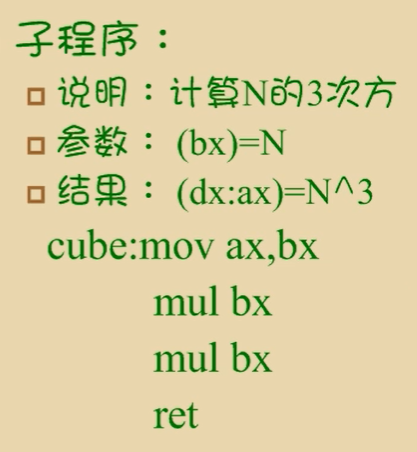

- 利用子程序做如下计算：

  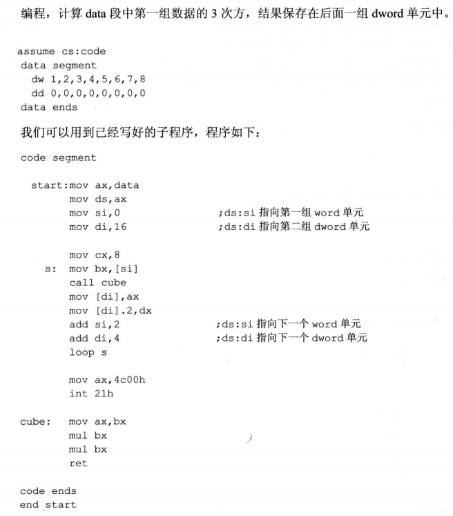

### 批量数据的传递

即多参数和多结果如何传递。这里就可以考虑将批量参数存放在内存中，然后将该空间的首地址通过存放在寄存器中来传递给子程序。对于批量结果的返回，也可以用同样的方法。

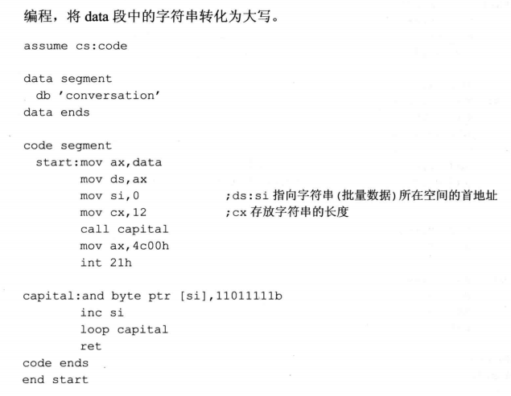

> **实现if判断的方法**
>
> 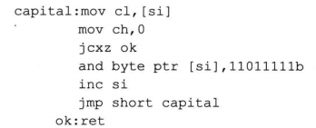
>
> 1. capital子程序用于实现以0为结尾的字符串的大写转换。由于字符串不定长，需用末尾的0来判断字符串是否结束；
> 2. 前两行代码用于取出字符，第三行判断是否为0，如果是0则跳转到ret结束子程序，如果不是0则继续向下执行；
> 3. 用jmp指令进行循环。
>
> **其他思考**
>
> 任何数值不管用什么进制表示，其大小都是一致的。
>
> 显示屏能够显示的东西都是通过ASCII转化过的，也就是说任何输入显存的数据都会经过ASCII转化后再显示在屏幕上。你直接输入一个数值，它并不会显示这个数值，而是应该先将该数值转换成对应的字符串形式，再输入到显存才会显示该数值。

### 寄存器冲突问题

如果主程序使用到的寄存器，子程序也要使用，那么等子程序返回后，这些寄存器的值对于主程序来说可能已经改变了，就会导致主程序执行出错。这就是寄存器冲突问题，解决这个问题有两个方法：

1. 避免使用相同的寄存器。这不太好，毕竟寄存器就几个；

2. 在子程序开始前，将子程序需要用到的寄存器中的内容保存起来（不管主程序是否用到，只要子程序用到就要保存），然后在程序返回前进行恢复。这个保存和恢复过程可以用栈来完成（保护现场、恢复现场）。

   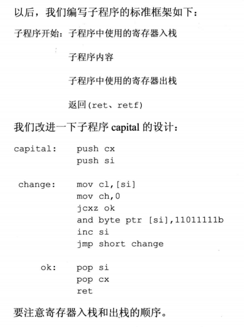

### 编写子程序

#### 显示字符串

名称：show_str

功能：在指定位置，用指定颜色，显示指定字符串(以0结尾)

参数：(dh)=行号，(dl)=列号，(cl)=颜色，ds:si指向字符串首地址

```assembly
show_str:push cx
		push si

		mov al,0A0h;计算显示首地址
		dec dh
		mul dh
		mov bx,ax ;得到行偏移
		mov al,2
		mul dl
		sub ax,2 ;得到列偏移
		add bx,ax ;得到总偏移地址
		mov ax,0B800H
		mov es,ax ;用es存放显存首页段地址
		
		mov di,0 ;下标
		mov al,cl ;存放颜色
		mov ch,0 ;ch置零
	 s1:mov cl,ds:[si]
	 	jcxz ok
	 	mov es:[bx+di],cl
	 	mov es:[1+bx+di],al
	 	inc si
	 	add di,2
	 	jmp short s1
	 	
	 ok:pop cx
	 	pop si
	 	ret
```

#### 不会溢出的除法程序

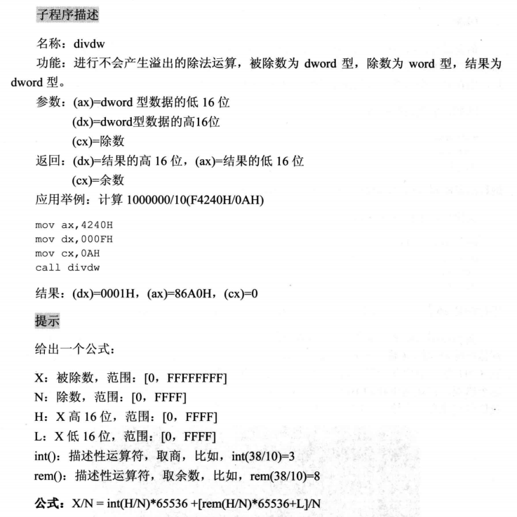

#### 显示数值

需要将数值先转化为字符串，然后再进行显示。数值转化为字符串的方法如下：

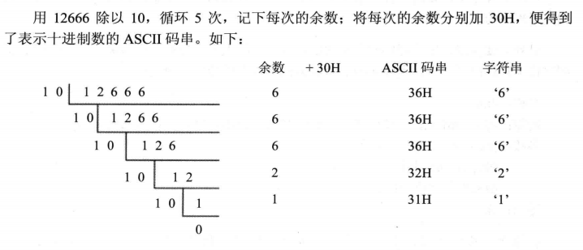

## 标志寄存器

标志寄存器存储的数据为16位（称为程序状态字）。

标志寄存器按位起作用，每一位都有专门的含义。

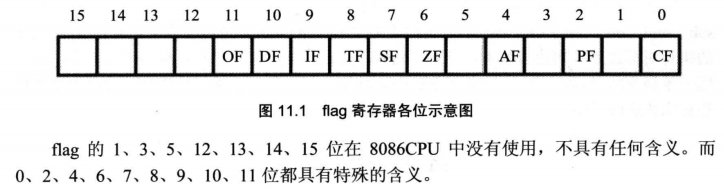

### ZF标志（第6位）

零标志位（zero flag），即若上一次指令执行结果为0则ZF为1，否则为0。

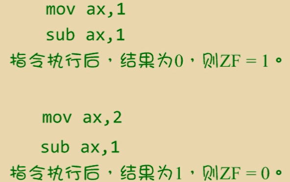

影响ZF标志的指令：add、sub、mul、div、inc、or、and等；

不影响ZF标志的指令：mov、push、pop等。

### PF标志

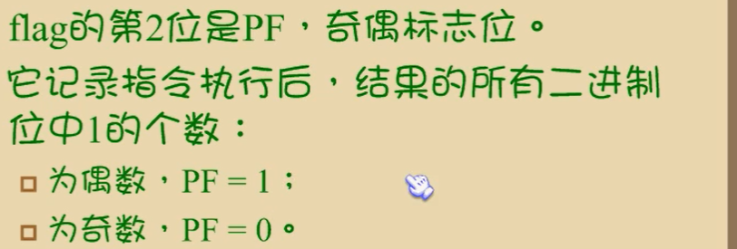

### SF标志

SF标志将指令执行结果当成补码形式来判断。

> 对于CPU来说，add、sub等运算指令只负责运算，是否溢出它们也不管，结果是用什么形式来表示，CPU也不做规定，全靠编程者如何认定。编程者将其考虑为无符号数，那么参数运算的就是无符号数，结果也是无符号数；如果考虑为有符号数，那么参数运算的就是有符号数，结果也是有符号数（补码形式）。


### CF标志

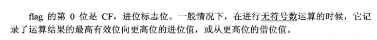

### OF标志

在进行**有符号数运算**时，如结果超出了机器所能表达的范围就称为溢出。

> 进位说的是无符号数,溢出说的是有符号数。但是，溢出和进位是可能同时发生的。
>
> 比如，两个数相加导致符号位变成负的，这就是溢出了。
>
> 两个数相加，相加的结果的位数超过了寄存器的位数，这就是进位了。

OF就是溢出标志位，运算结果溢出则为1，否则为0。

### adc指令

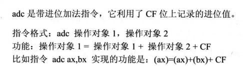

CF是上一次指令执行后的判断结果（借位值、进位值）。  

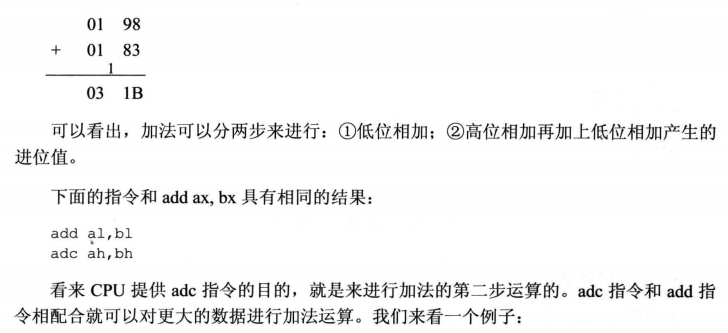

adc指令用于扩展加法的范围，使得加法可以对任意大的数据进行加法运算。

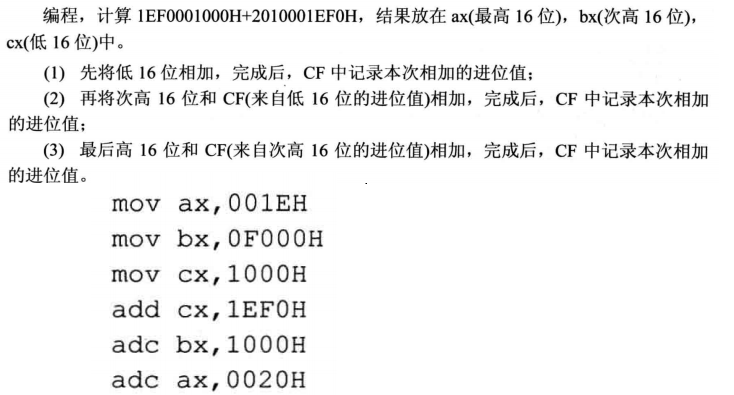

下面是128为数据的加法程序，每次相加都是16位，依次从低位向高位进行，并把结果存回内存。其中，inc si和inc di不能替换成add si,2和add di,2，以避免影响CF位。

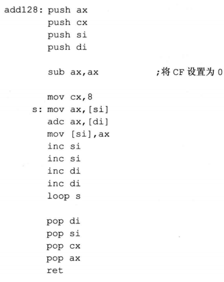

### sbb指令

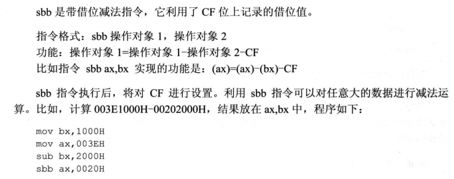

### cmp指令


1. 假设指令为cmp ax,bx，此处认为ax和bx都为无符号数，则比较结果如下：

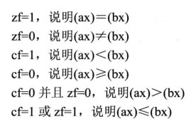

2. 假设指令为cmp ah,bh，此处认为ax和bx都为有符号数，则比较结果如下：

   - 相等或不相等看zf：

   

   - 如果没有溢出（OF=0），则看SF是啥就是啥；
   - 如果产生溢出（OF=1），则结果就和SF相反。

### 与cmp指令配合使用的条件转移指令


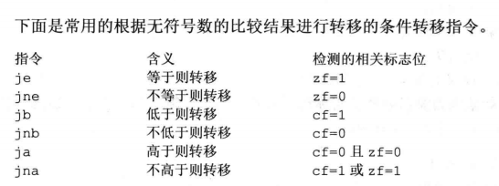

举例说明

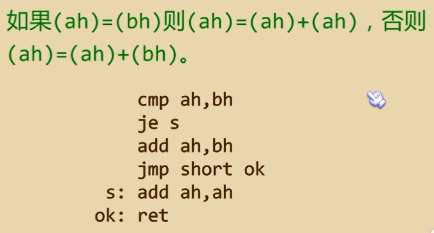

### DF标志位

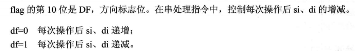

#### 串处理指令

1. movsb指令

   - 使用格式：movsb

   - 执行过程：

     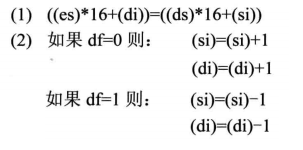

   - 功能：将ds:si的字节内容送入ds:di，并根据df递增或递减si和di。

2. movsw指令

   - 使用格式：movsw

   - 执行过程：

     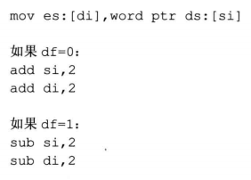

   - 功能：将ds:si的字内容送入ds:di，并根据df递增或递减si和di。

#### rep指令

- 使用格式：rep movsb或rep movsw

- 执行过程：

  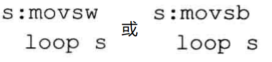

- 功能：根据cx的值，重复后面的串处理指令，相当于传送(cx)个字或字节。

#### 用于修改df的指令

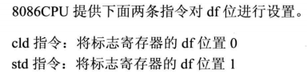

#### 举例说明

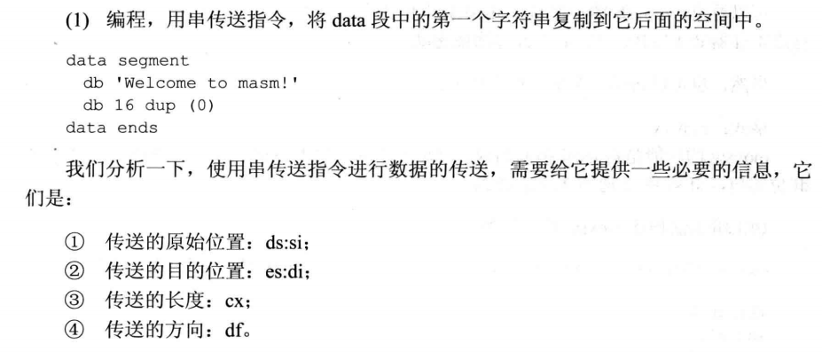

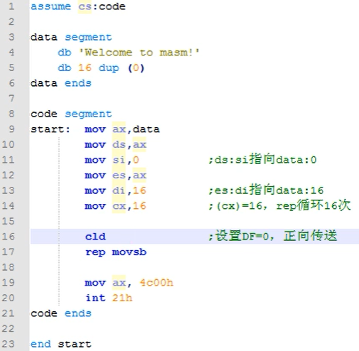

### pushf和popf

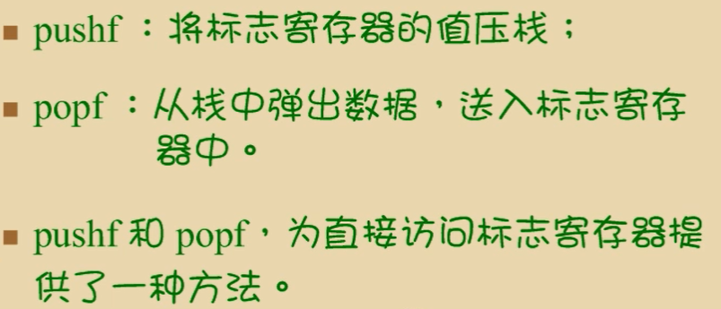

### 各种标志位的表示

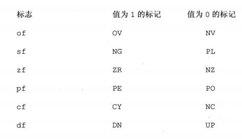

## 内中断

中断使得CPU运行时可以对外部事件发出的中断请求及时进行处理，处理完后立即返回断点继续原来的工作。

中断源：发出中断请求的来源，分为硬件中断（又分为外部中断和内部中断）和软件中断。

外部中断：外设发出的中断请求，如键盘等。该中断可用中断控制器来屏蔽。

内部中断：硬件出错（突然掉电等）或运算出错（除数为零等）引起的中断。不可被屏蔽。

软件中断：不是真正的中断，比如int 21H。

中断优先级：① 除法错、溢出中断、软件中断；② 不可屏蔽中断；③ 可屏蔽中断；④ 单步中断。

### 中断向量表

中断处理程序：CPU设计者必须在中断信息和其处理程序的入口之间建立映射，使CPU可以根据中断信息找到要执行的处理程序。

中断信息：包含标识中断源的类型码，中断类型码用来定位中断处理程序。

如何根据**8位**的中断类型码找到中断处理程序的段地址和偏移地址？这就需要中断向量表。中断类型码就是中断向量表的索引，根据索引查表就可以找到中断处理程序的入口地址。

中断向量表：在内存中保存，存放着**256个**中断源对应的中断处理程序的入口地址（也叫中断向量）。8086PC的中断向量表存放在内存0000:0000到0000:03FF的1024个单元中。

2^8=256 ==> 1024=(2(段地址)+2(偏移地址))×256

### 中断过程

8086CPU中断过程：

1. 从中断信息中取得中断类型码；
2. 标志寄存器的值入栈；
3. 设置标志寄存器的第8位TF和第9位IF值为0；
4. CS入栈；
5. IP入栈；
6. 从内存地址为（中断类型码×4）和（中断类型码×4+2)的两个字单元中读取中断处理程序的入口地址，并设置为CS和IP（这个过程由硬件自动完成）。

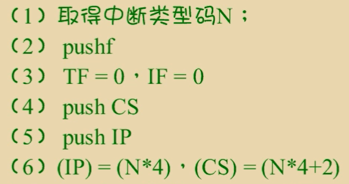

### 中断处理程序

CPU检测到中断信息后就会去执行中断处理程序，所以中断处理程序必须一直处在内存中，其对应的中断向量也应一直在中断向量表中。

#### 如何编写中断处理程序

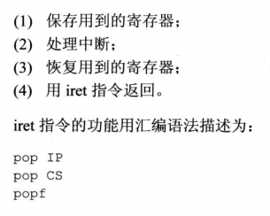

> iret指令和硬件自动完成中断的过程是相配合的，因此一般要用iret指令来返回。

### 除法错误的中断处理

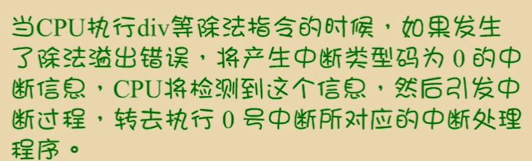

修改中断处理程序的方法(也叫安装中断处理程序)：

1. 提前将中断处理程序编写好，并存放到安全的内存区；
2. 修改中断向量表，使其指向我们编好的程序处。

用于修改中断处理程序的安装程序:

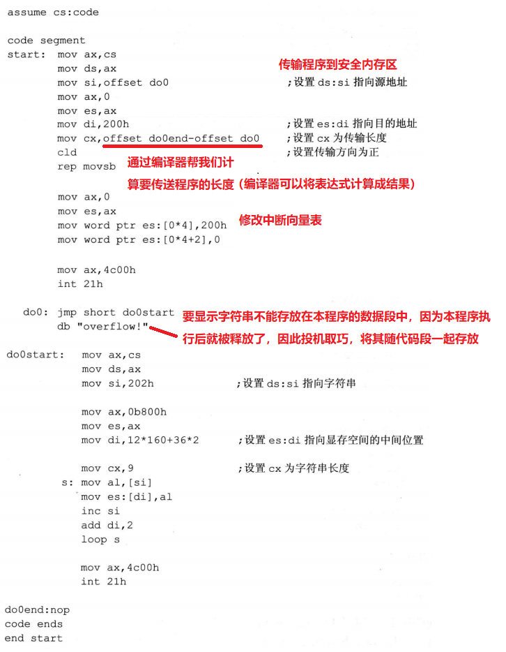

### 单步中断

单步中断使得程序变得可控，就像debug单步调试一样。

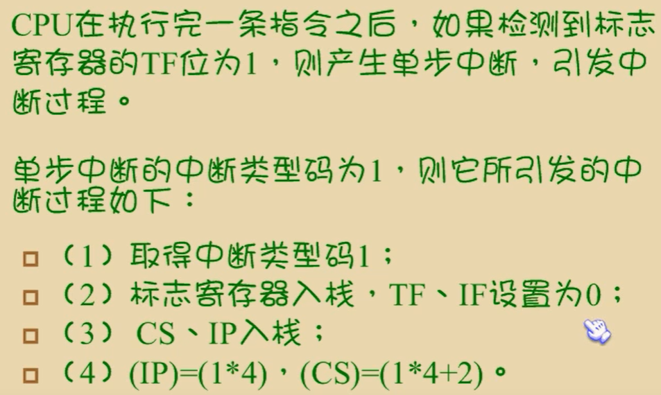

> **debug单步调试原理**
>
> 1. 将单步中断的处理程序修改为显示寄存器状态并等待下一步命令的程序；
> 2. 使用T命令执行一条指令时，将TF置1，引发CPU产生单步中断。

当TF=1时，CPU执行完一条指令后将引发单步中断，转而执行中断处理程序。执行完中断处理程序后，返回原处继续执行其它指令。

#### 响应单步中断的特殊情况

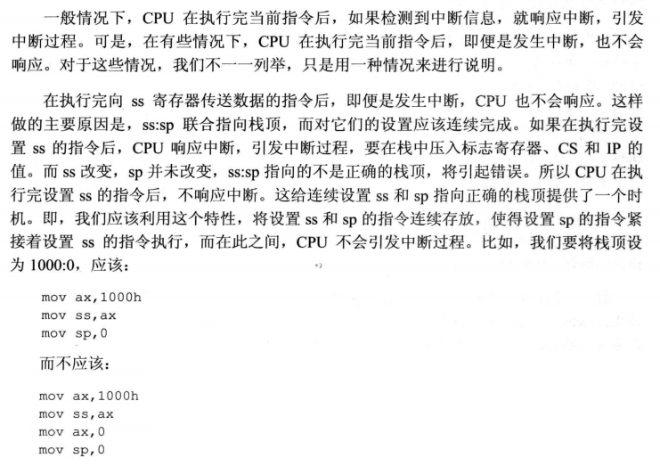

#### 将TF置1的程序

该程序也适合于修改其它标志位。

```assembly
PUSHF
POP AX
OR AH,00000001B
PUSH AX
POPF
```

## int指令

1. 指令格式：int n（n为中断类型码）
2. 功能：用于引发n号中断的中断过程。
3. 执行过程：


### 实现供应用程序调用的中断例程

中断处理程序也叫中断例程。

1. 实现求平方的7ch号中断例程

   - 编写中断例程

     参数：(ax)=要计算数据；

     返回值：(dx)=结果的高16位，(ax)=结果的低16位。

   - 安装中断例程

     即将中断例程写入到安全内存区0:200中。

     程序被加载进内存后被CPU执行，执行结束后该程序所在内存区就被释放掉了（或者是在执行下一个程序时被覆盖掉），因此想要一段程序停驻在内存中，就应该手动将其存储到一段安全的内存区中，这就是安装过程。

   - 设置中断向量表（将入口地址存放在7ch号表项中）

   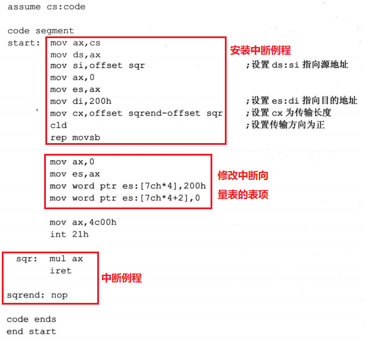

   > 在调用中断例程前，由硬件自动帮我们将中断标志、CS、IP入栈保存现场，因此在执行完中断例程前，需要手动将它们出栈来恢复现场。
   >
   > int指令和iret指令配合使用，call指令和ret指令配合使用。但int指令和iret指令用于调用段间程序，call指令和ret指令用于调用段内程序。

2. 实现转换大写字母的7ch号中断例程

   参数：ds:si 指向字符串首地址；

   无返回值。

   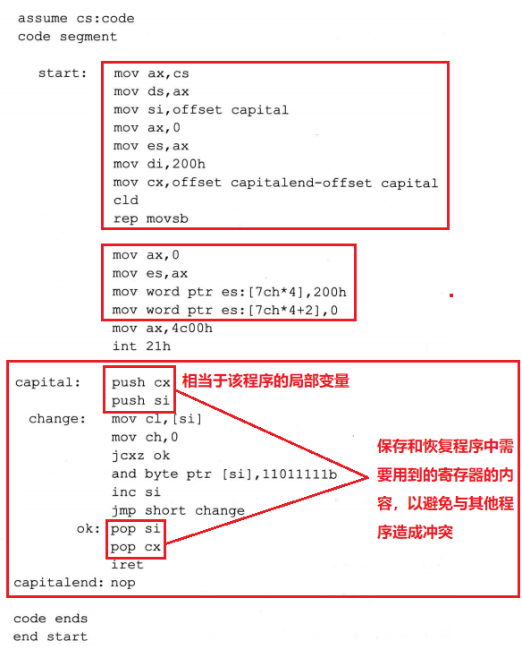

### 对int、iret和栈的深入理解

用7ch中断例程完成loop指令的功能。

1. 参数：(cx)=循环次数，(bx)=跳转位移；无返回值。

2. 中断例程功能，即实现loop指令的两个步骤：

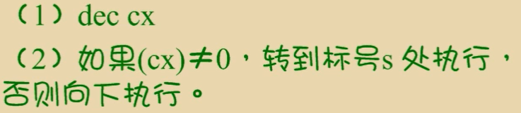

​		原理上就是根据cx的值，修改iret恢复现场时返回的IP值。

3. 编写中断例程：

   

4. 使用中断例程：

   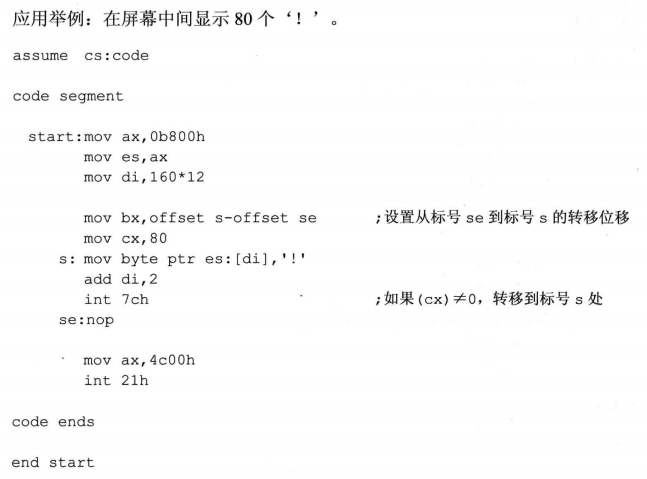

### BIOS和DOS中断例程的安装过程

即由BIOS和DOS提供的中断例程是如何写入到内存中并设置中断向量表的。

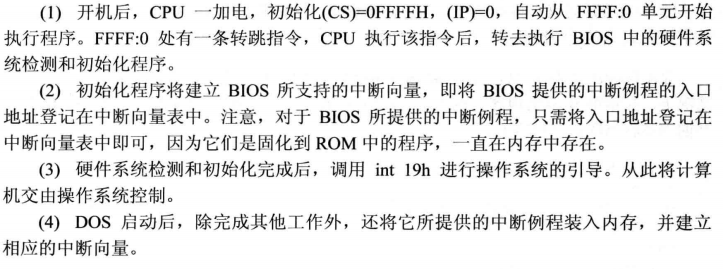

### BIOS中断例程的使用

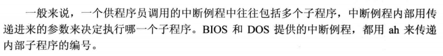

int 10h中断例程是BIOS提供的中断例程，其中包含了多个和屏幕输出的子程序。

1. 设置光标位置

   

2. 在光标位置显示字符

   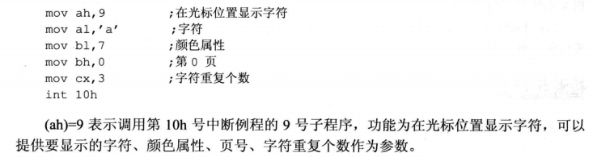

3. 综合应用

   相当于调用系统的程序来干事情。

   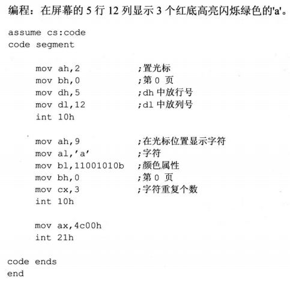

### DOS中断例程的使用

int 21h中断例程是DOS提供的中断例程，其中也包含了多个子程序。

1. 程序返回子程序

   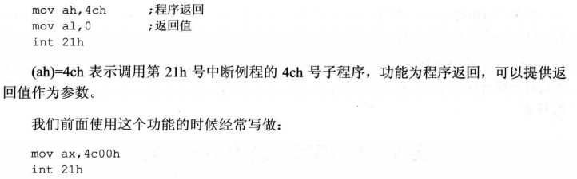

2. 在光标位置显示字符

   

3. 举例说明

   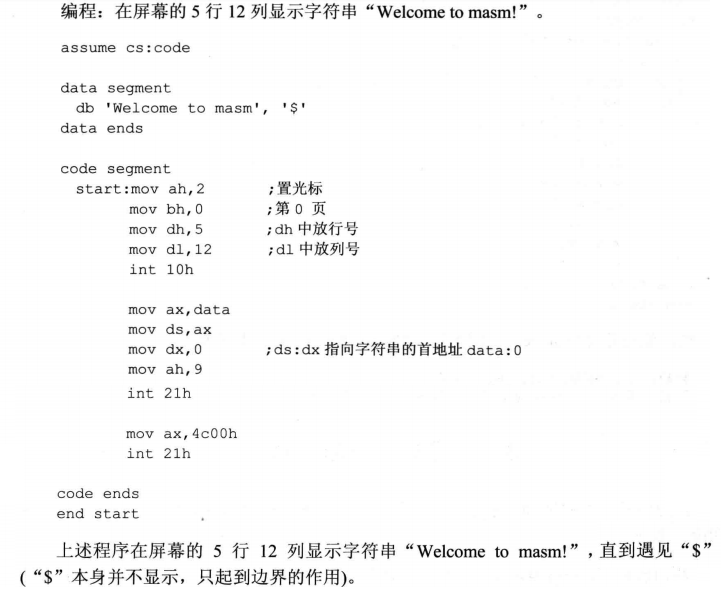

## 端口

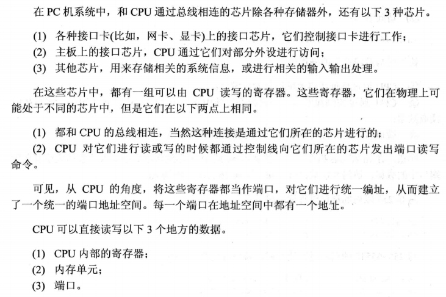

### 端口的读写

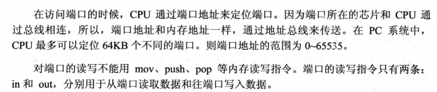

#### 访问内存和访问端口的区别

1. 访问内存

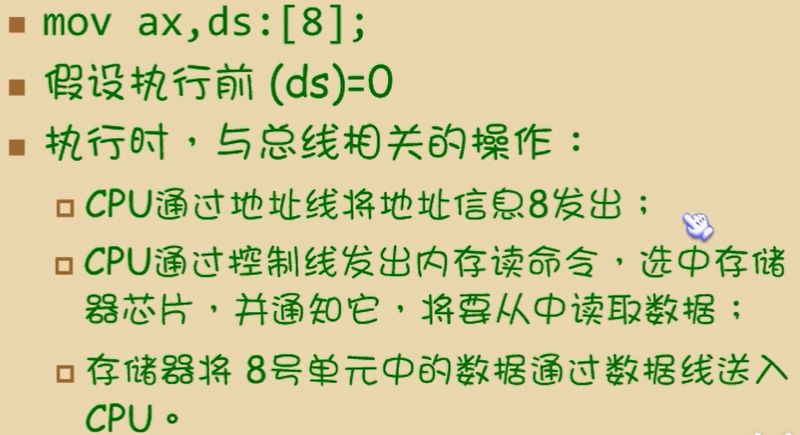

2. 访问端口

   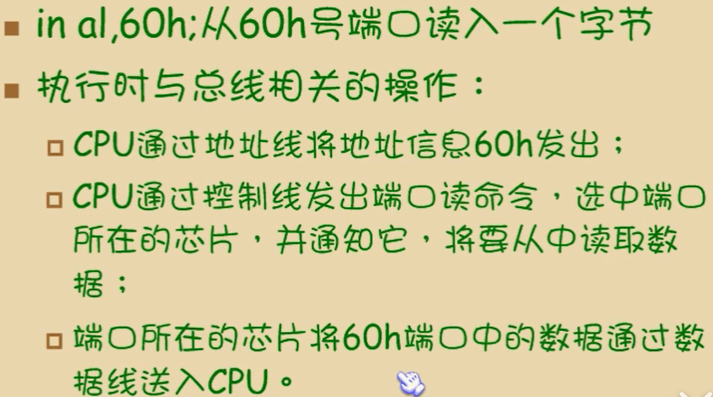

#### 访问端口的注意要点

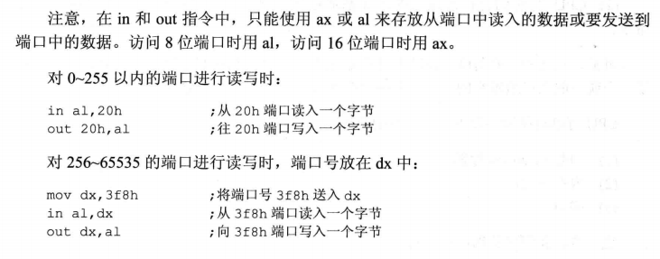

### CMOS RAM芯片

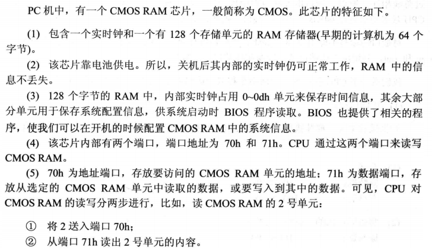

### shl和shr指令

即逻辑位移指令。

#### shl指令

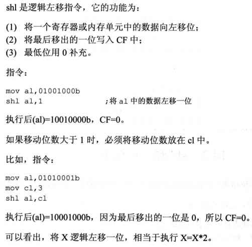

#### shr指令

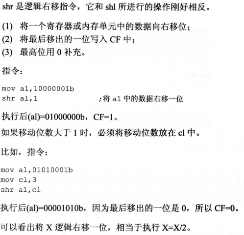

### CMOS RAM存储时间信息

 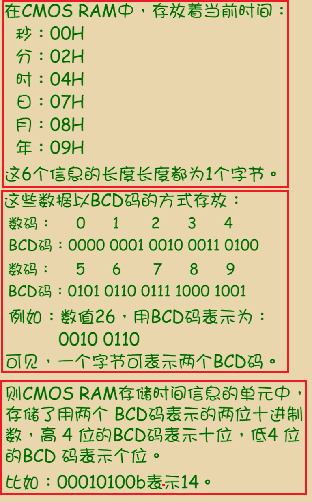

#### 编程举例

将月份显示在屏幕上

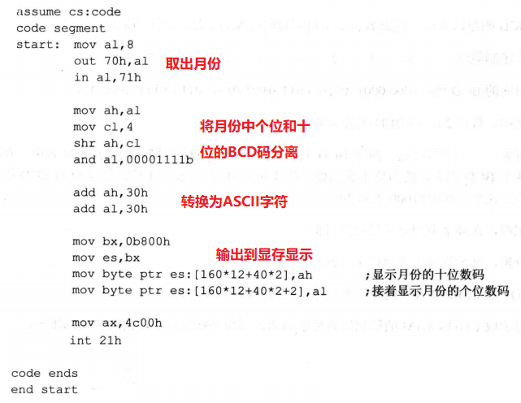

## 外中断

### 外设和端口

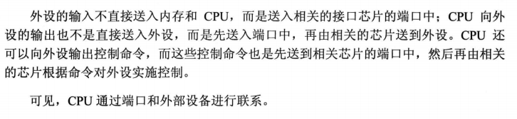

### 外中断

CPU如何及时知道外设传输的信息呢？CPU在**执行完当前指令后，就会检测**有没有发送过来的中断信息，引发中断过程，以处理外设的输入。

#### 外中断源

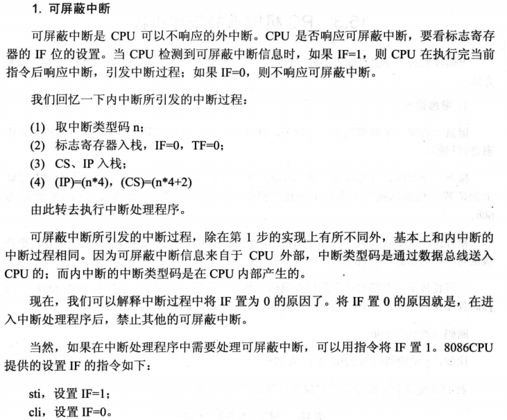

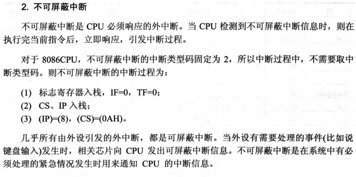

### PC机键盘处理过程

1. 键盘输入

   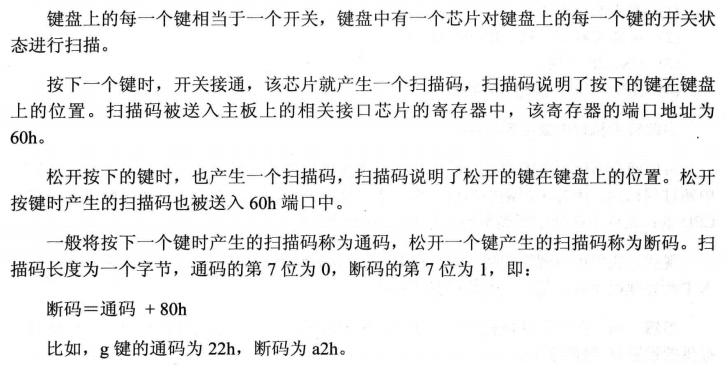

   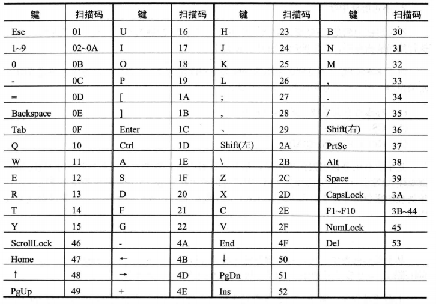

2. 引发9号中断

   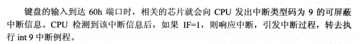

3. 执行9号中断例程

   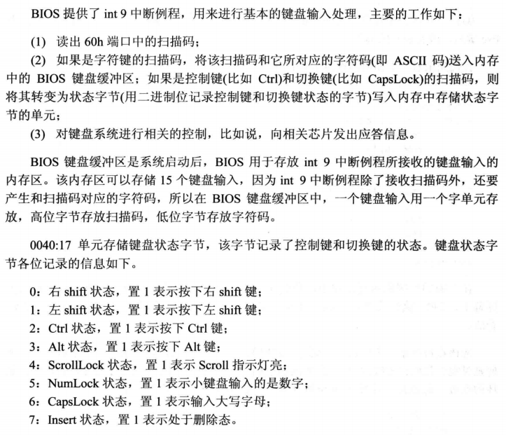

   > 键盘状态字相当于开关。比如按下大写按键，则键盘状态字中的CxpsLock状态为1，当输入其他字符后，会先检查键盘状态字中CxpsLock的状态，发现是1，则输出大写的字符。
   >
   > **总结过程**
   >
   > 1. 键盘产生扫描码；
   > 2. 扫描码送入60h端口；
   > 3. 一旦侦测到60h端口有动静，引发9号中断；
   > 4. CPU执行9号中断例程处理键盘输入。
   >
   > 前三步都由硬件自动完成，能修改的只有第四步的中断例程。

### 编写9号中断例程

在屏幕中间依次显示a~z，在显示过程中按下ESC键改变显示颜色。

1. 编写依次显示a~z的程序

   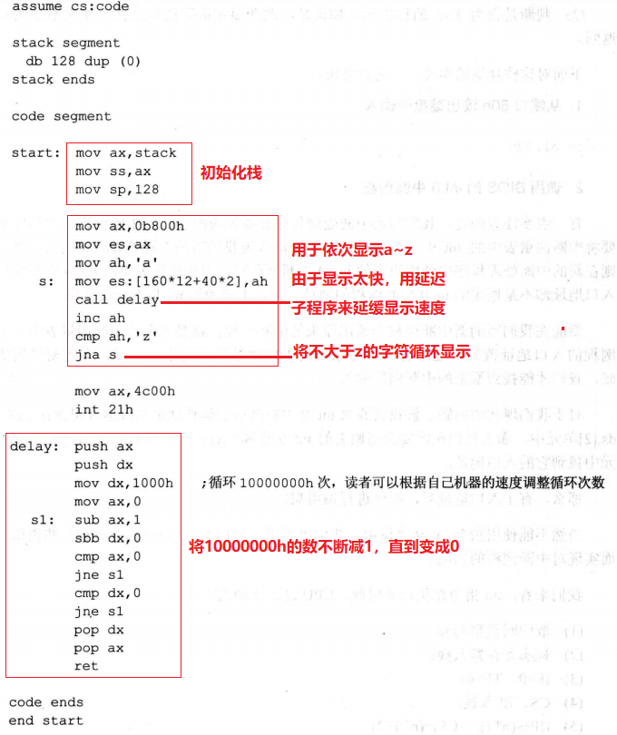

2. 编写9号中断例程

   1. 从60h带你看读出键盘输入；

      in al,60h

   2. 调用BIOS的9号中断程序；

      > 由于直接将9号中断在中断向量表的入口地址修改为自定义中断例程的地址，因此为了确保键盘还能继续正常使用，就需要调用原来BIOS的9号中断程序。
      >
      > 此时不能直接通过int 9h来调用BIOS的9号中断程序，而是应通过模拟int指令来实现调用。在此之前需要先找到并保存BIOS的9号中断程序的入口地址。

      1. 标志寄存器入栈

         pushf

      2. IF=0，TF=0

         pushf

         pop ax

         and ah,11111100b;

         push ax

         popf

      3. CS、IP入栈，设置目标程序的CS:IP

         call dword ptr ds:[0]

   3. 判断是否为ESC的扫描码，若是则改变颜色后返回；不是则直接返回。

      > 返回前需要将9号中断在中断向量表的入口地址恢复为原来的地址。因为此处并没有将自定义的9号程序安装进内存，该程序执行完就释放了，如果不恢复原地址，则程序返回后其他程序将无法使用键盘。

3. 完整程序：

   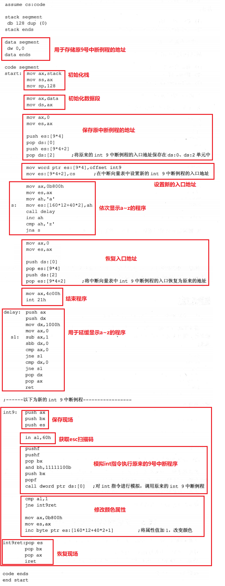

### 安装9号中断例程

目的：安装新的9号中断例程以扩展原9号中断例程。

扩展功能：按F1修改屏幕颜色，其他键不变。

> ① 修改显存奇地址的颜色属性来修改屏幕颜色。
>
> ② 调用原9号中断例程来处理其他按键。
>
> ③ 保存原9号中断例程的地址到0:200处。
>
> ④ 安装新的9号中断例程到0:204处。

### 总结

CPU对外设输入的通常处理方法：

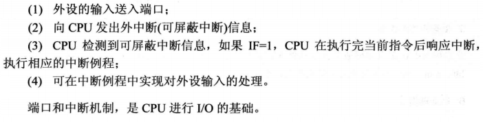

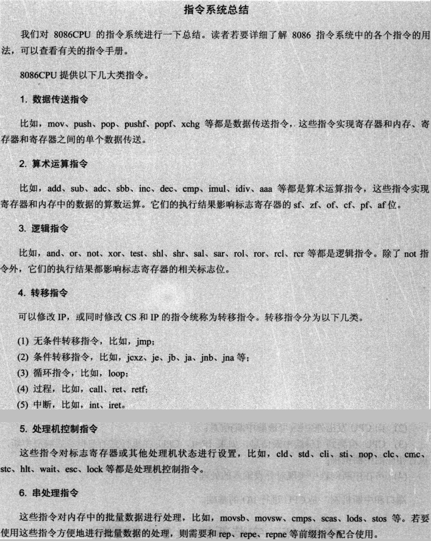

## 直接定址表

### 数据标号

数据标号指后面没有冒号的标识，只能用于标识数据，表示了内存单元的地址和长度。

1. 数据标号包含了对单元长度的描述，可以代表内存单元

   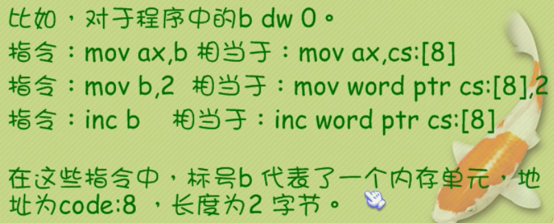
   
2. 数据标号指明了单元长度，不能与长度不符的寄存器进行数据传送

   

3. 数据标号还可以作为数据的首地址，与[]配合使用（就像数组）

   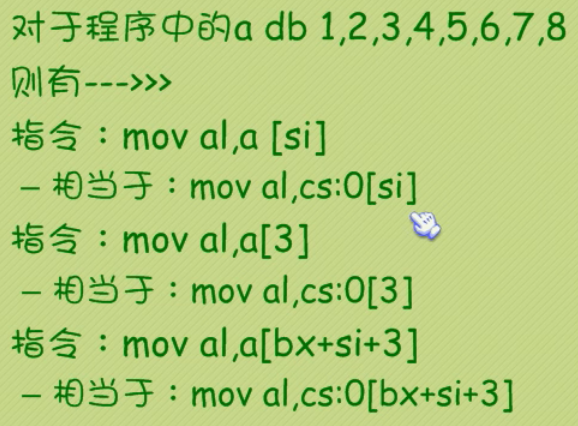

4. 可以将标号作为数据来定义

   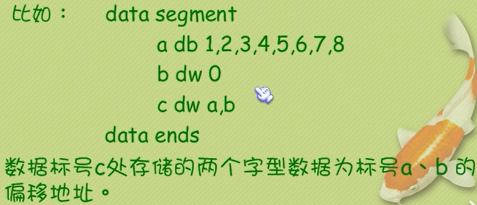

   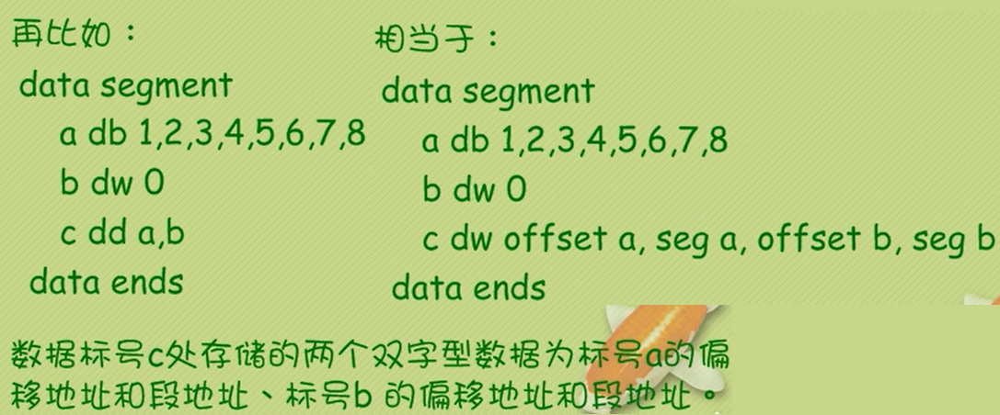

> **与地址标号的区别**
>
> 地址标号有冒号，只能用于代码段内和段定义，仅仅表示了内存单元的地址。经过编译后，指令中的地址标号会被转化为地址对应的数值。
>
> **要注意的地方**
>
> offset 标号：取得标号在其所在段的偏移地址。
>
> seg 标号：取得标号在其所在段的段地址。
>
> assume：定义了一个内存段后，在内存段中使用标号来表示偏移地址，**其段地址就默认为某个段寄存器的值，到底是哪个寄存器就由assume指明**。因此assume的作用仅仅是指明段内标号的段地址用哪个段寄存器的值，并不会将具体的段地址作为该段寄存器的值，**该段寄存器的值是啥还需要在程序中写入**。也可以得知，要使用标号，就得用assume为其指明段地址，不然标号就没有段地址，就无法定位正确的内存单元。
>
> cs寄存器的初始值是由end伪指令来决定和设置的，并不是assume设置的。

### 直接定址表

依据数据查表获取所要找的元素的地址，这个表就叫直接定址表。


1. 通过偏移量查表获取目标值

   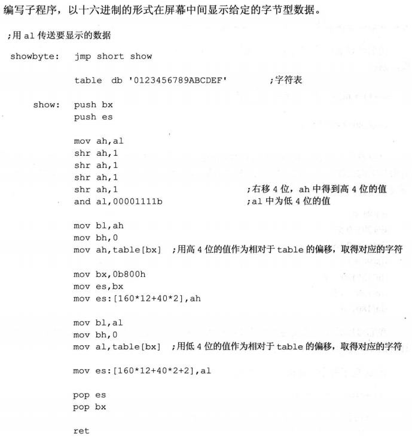

2. 通过查表的方式，用空间换取速度

   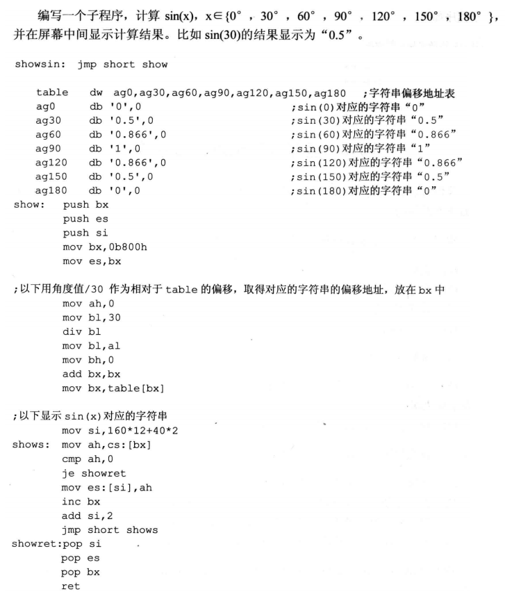

### 程序入口地址的直接定址表

1. 编写一个setscreen子程序，为显示输出提供以下功能：

   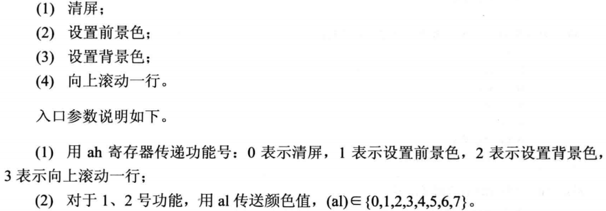

2. 功能实现方法：

   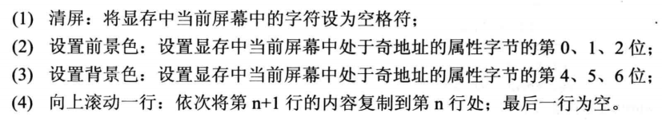

3. 将这四个功能分别用四个子程序实现：

   ① 清屏

   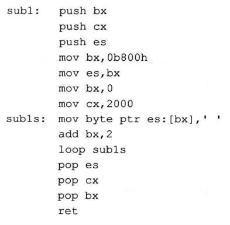

   ② 设置前景色

   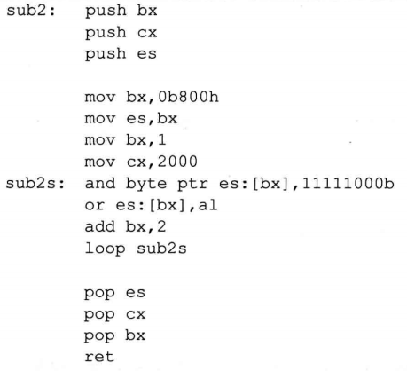

   ③ 设置背景色

   

   ④ 上滚一行

   

4. 将这些程序的入口地址存储在表中，它们在表中的位置和功能号对应：

   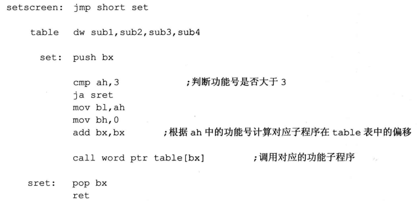

   > 如果不使用查表的方式，则程序如下：
   >
   > 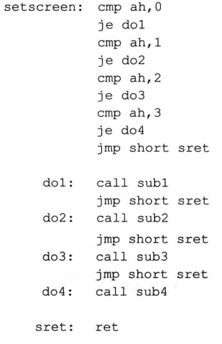
   >
   > 可见，通过比较来定位子程序的方式比较混乱且不易扩展。

## 使用BIOS进行键盘输入和磁盘读写

### 9号中断例程执行过程

9号中断例程用于写入键盘缓冲区，由系统自动完成。

1. 按下键，扫描码进入60h端口，触发9号中断，CPU侦测到中断，执行9号中断例程；
2. 读取60h端口的扫描码，如果是字符按键，则将其转换成ASCII码，并将ASCII码和扫描码存入键盘缓冲区；如果是状态按键，则直接修改键盘状态字；
3. 程序返回。

### 16号中断例程执行过程

16号中断例程用于读取键盘缓冲区，由程序员调用。调用16号中断例程的0号功能，其执行过程如下：

```assembly
mov ah,0
int 16h
```

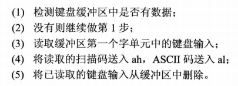

### 9号和16号中断例程的编程举例

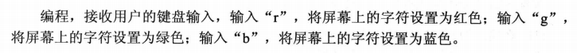

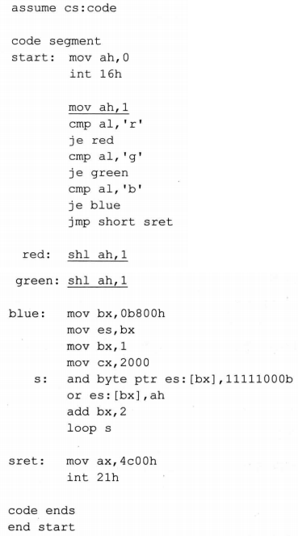

### 字符串的输入

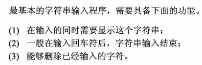

1. 参数说明

   

2. 功能说明

   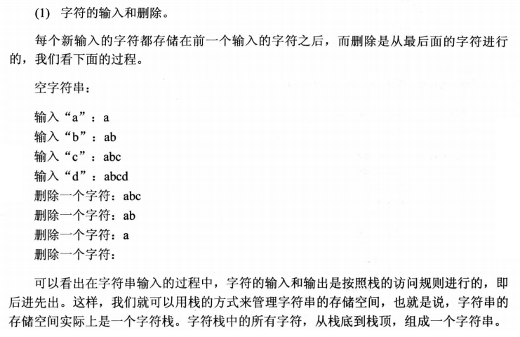

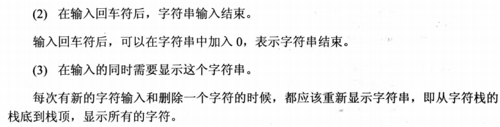

3. 处理过程:

   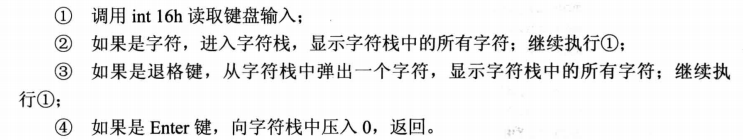

4. 将字符栈的出栈、入栈和显示写成一个子程序，实现复用：

   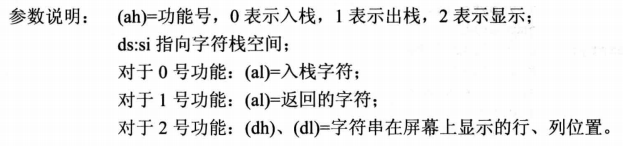

   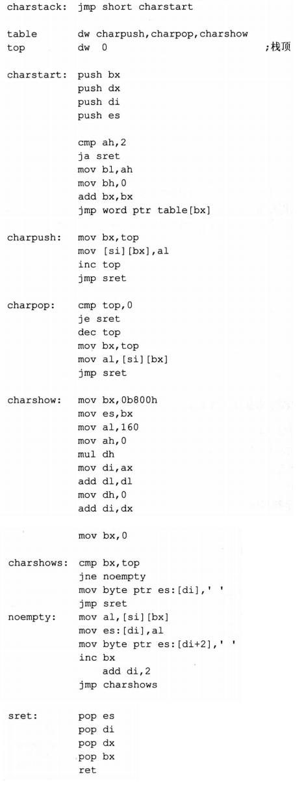

5. 接收字符串的程序：

   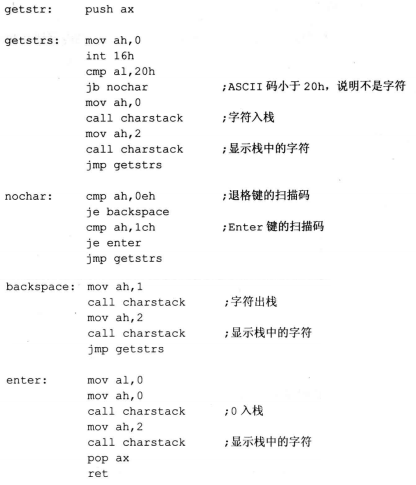

### 用13号中断例程对磁盘读写

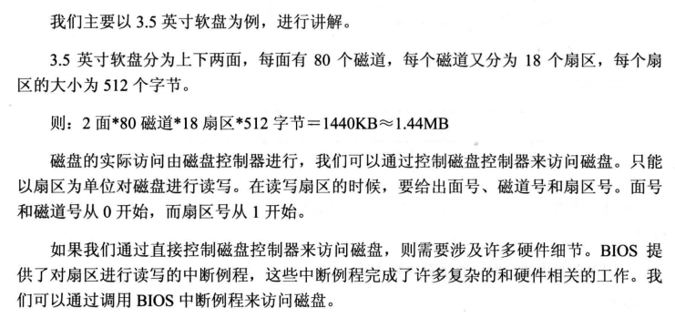

BIOS提供13号中断例程对磁盘进行读写

1. 用13号中断例程的2号功能对磁盘进行读取

   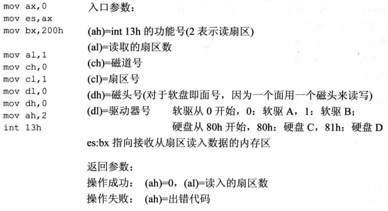

2. 用13号中断例程的3号功能对磁盘进行写入

   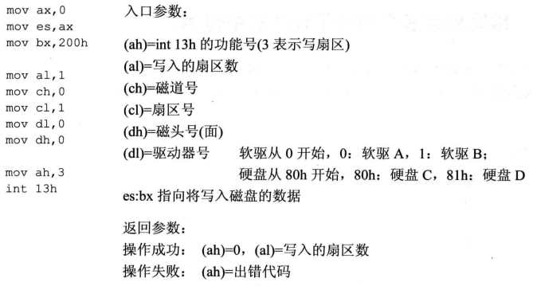

#### 13号中断例程编程举例

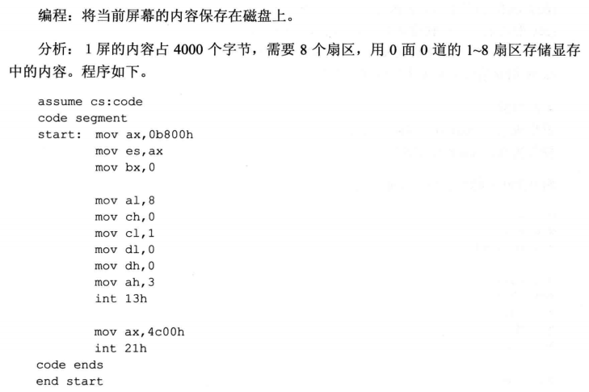


