# CPU管理

## 进程的由来

CPU的工作原理就是取值执行。要使CPU工作，那就只需要给它一个初址（即设置PC的值）即可，剩下的指令地址由PC自增得到。有了地址，CPU就可以不断地取值执行。如果指令中有IO指令，CPU启动IO设备后就需要等待IO设备工作完成才继续执行下去。IO指令相比计算指令执行得非常慢。因为IO指令需要驱动磁盘工作，磁盘是机械设备，相比CPU这种电子设备，工作要慢很多，因此在执行IO指令时，大多是CPU等待磁盘工作。而计算机在使用时大部分时间都是在和IO设备打交道。因此使用这种工作方式，CPU的利用率非常低，大部分时间都是在等待IO设备工作，但管理起来却非常简单，只需要设置一下初址就行了。

> 假设要烧一壶谁来泡茶，上面的方式就是：先往壶中倒入冷水，然后把壶放到火炉上加热，在加热的过程中一直在旁边等着，等到水烧开再去泡茶。第二种方式就是：在加热的时候去做别的事情，而不是干耗着。这就使得人比较忙碌，而不会空闲下来。
>
> 人好比CPU，水壶加热就是IO设备工作，可以看出第二种方式，CPU的效率会比较高。

因此可以让CPU在等待IO设备工作的期间去执行其它的程序，等这个程序也进入IO操作时，在返回到原来的程序继续执行。这样的话，CPU就处于一直忙碌的状态，利用率就比较高。简单来说就是CPU交替执行多道程序。因此管理CPU的另一种方式就是将多个程序同时放在内存中，让CPU交替执行。这种方式也叫做并发。

要实现并发，那就需要在适当的时候修改PC的值，使CPU切换到另一个程序去执行，然后在适当的时候把PC修改成原来的值，使CPU切换回原来的程序继续执行。但是如何才能知道原来程序的PC值呢？ 就算知道了PC的值，切换回原程序的时候，程序中原来寄存器的值被其它程序修改了，这样原程序运行的结果显然是不正确的。为了完成切换，就需要专门创建一个数据结构来记录切出去时原程序的样子，这种数据结构就叫PCB。

因此在内存中运行的程序和存储在磁盘中未运行的静态程序不一样了，这个不一样就体现在需要有一个表来专门记录运行程序的状态，而静态程序不需要这些东西。而为了描述这种不一样，也专门创建了一个概念，就叫做进程，以区别放在磁盘中未工作的静态程序。可以知道，使用这种工作方式，CPU的利用率大大提高了，大部分时间都处在忙碌状态，但管理起来却比较麻烦了，不仅要设置初址，还需要完成程序的切换。

小结进程的由来：

1. CPU单程序执行效率不高，因此需要多程序交替执行；

2. 多程序交替执行需要记录切换前程序的状态；

2. 这个状态使得运行时程序与静态程序变得不同；
3. 为了描述不同，就引入了进程这个概念。

## 多进程图像

### 多进程图像的样子

1. 用户角度：启动多个进程，看到多个进程在同时推进
2. OS角度：用PCB记录每个进程的样子，并根据PCB合理推进每个进程

### 多进程图像的存活时期

1. 多进程图像从开机时就建立起来

   由main.c调用init函数创建第一个进程：if(!fork()){init();} 

   这第一个进程通常为shell命令行（或Windows桌面）

2. 由初始化进程再去创建其它进程

   由shell进程再启动其他进程 

   ```c
   int main(int argc, char * argv[]) { 
       while(1) { scanf(“%s”, cmd);
       if(!fork()) {exec(cmd);} wait();} 
   } 
   ```

   一个命令就创建一个进程，然后返回shell再启动其他进程

3. 多进程图像直到关机才结束

### 多进程图像的实现

1. OS如何感知进程

   操作系统为每个进程创建一个PCB（Process Control Block）来记录进程信息，并通过PCB来感知进程。

2. 多进程如何组织（状态+队列）

   组织就是让OS可以清楚地知道每个进程的状态，以便于后续的处理。

   OS通过PCB来标识每一个进程。

   OS创建多个数据结构来存放PCB，比如就绪队列和等待队列。

   OS为每个进程的PCB添加了状态信息，包括新建态、就绪态、运行态、终止态、阻塞态。

   OS根据不同进程的PCB的状态信息，将不同进程的PCB放入不同的队列中来组织进程。

   比如新建态->就绪态的进程就会被扔进就绪队列，运行态->阻塞态的进程会被扔进等待队列，阻塞态->就绪态的进程会被扔回就绪队列，这样每个进程都有它的存放位置，为后续的处理提供了方便。这个方便体现在：如果一个运行中的进程被阻塞，那么OS就可以直接从等待队列找出一个进程来继续执行，而不需要判断这个进程处于什么状态。

3. 多进程如何交替执行

   - 首先修改当前进程的PCB状态为阻塞态，并扔进等待队列（组织）

   - 找到并获取就绪队列中某个进程的PCB（调度）
   - 用新进程的PCB覆盖CPU的状态（切换）

4. 多进程如何调度（即如何找到要切换的那个进程）
   - FIFO：先进先出策略
   - Priority：优先级策略

5. 多进程如何切换

   - 保存当前进程的现场，即将当前CPU的状态保存到对应的PCB

   - 恢复新进程的样子，即将对应的PCB的状态覆盖到CPU（包括PC值）
   
   （这个过程由汇编语言来描述）
   
6. 多进程如何保证内存空间安全（内存管理）

   比如一个进程执行一个mov指令，该指令将要修改某个地址的数据，而这个地址属于另一个进程的内存段。由于大家都是用户态，是可以相互访问的。那这就很危险，因为一旦修改成功，就可能导致另一个进程出错。

   为了避免这种情况，就需要限制一个进程对其它进程内存段的读写，这就需要用到映射表。

   通过映射表将多进程的地址空间进行分离，即一个进程中使用的地址会被映射到该进程所在的内存段，所以无论访问任何地址，这个地址都会映射到自身内存段的地址。

7. 多进程如何避免脏值

   这是一个进程同步问题，解决方法就是给共享数据加锁，使得一次只能有一个进程访问该数据。

   进程同步使得多进程的推进变得更加合理，而不会因为随意推进导致脏值产生。

## 多进程切换

### 线程的由来

进程=资源+指令序列

由一个进程切换到另一个进程，其指令序列和资源都会发生变化，那么能不能只让指令序列发生变化，而资源不发生变化呢？

> 资源指的是由映射表映射出来的那一段内存空间。不同进程的映射表不一样，因此资源也不一样，切换进程就必须同时切换资源。

这样的话，由于不用切换映射表，只需要修改一下PC值（或其它寄存器的值），切换速度会比较快，而且还能维持指令序列的交替执行，使得CPU始终忙碌（既保留了并发的优点，还减少了进程切换的代价）。其实，这就是线程（thread），意思是比进程切换更简单。

在一个进程里启动多个线程其实就是在一个资源上并发执行多条指令序列，在这个过程中，只涉及到了指令序列的切换，而没有资源上的切换。

因此，切换可以分为两部分来看：一个是指令的切换，另一个是资源的切换。资源的切换涉及到内存，因此先讲指令的切换，即线程的切换，在此基础上加上资源的切换，就是进程的切换。

### 线程存在的价值

假设访问一个网页的过程是一个单程序过程，先用一段程序从网上下载网页，然后再用另一段程序去呈现网页，那么在这个过程中浏览器先是显示一段时间的空白，然后内容才显示出来。这对用户体验就很不友好，因为要等一段时间才能进行阅读。

正常的做法应该是下载程序和显示程序并发执行，即先下载一会，再切到显示程序显示一部分内容，然后再切回去下载，这样交替执行。

由于下载的资源和显示程序读取的资源应是共享的，即它们都是对同一块缓存进行操作，因此这里采用线程是最合适不过的。

### 用户级线程的切换原理

用户线程指的是该线程的指令不涉及内核，完全处于用户态，只在用户段上存取数据，其切换完全由用户决定（虽说不涉及内核，但用户还是可以使用内核指令，可一旦发生阻塞就会变得非常麻烦）。

用户线程切换过程：首先要同时启动多个线程，然后让多个线程交替执行。该过程需要实现两个函数：一个是用于启动线程的create函数，另一个是用于切换线程的yield函数。

> create函数用于创造出第一次切换时应该的样子。
>
> yield函数的功能更像是对其它程序进行调用，使得CPU从一段程序跳到另一段程序中去执行。
>
> python的协程就是一个用户级线程。

1. 实现yield函数最直观的方法：

   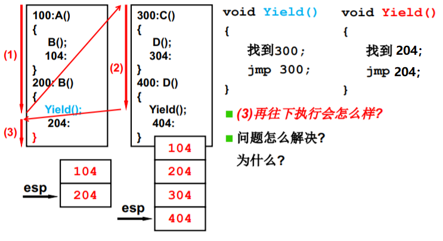

   直接在yield函数中用jmp指令跳到另一个线程对应的内存段中去执行，在整个切换过程中使用同一个栈对函数调用的返回地址进行保存。

   （PC切换）

   这种方式会有一个问题：在函数返回时，比如线程2返回线程1时，线程1从204继续执行，然后B函数返回，此时栈顶元素是404，使用ret指令返回时返回的是404，这明显错了。

   造成这个问题的原因就是两个线程共用了一个栈，解决方法就是为每个线程都创建一个栈来保存各自的函数返回地址。

2. 实现yield函数第二个方法：

   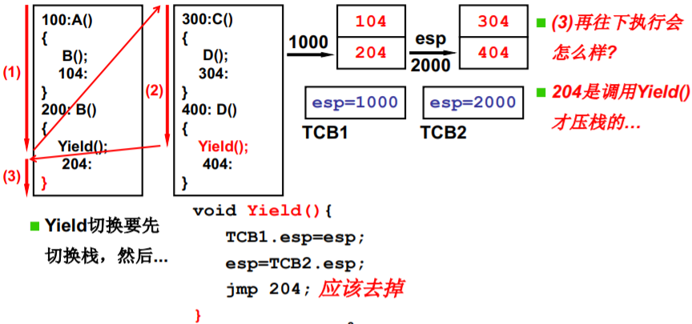

   还是在yield函数中用jmp指令跳到另一个线程对应的内存段中去执行，但每个线程都有一个栈来保存各自的函数返回地址，而各自的栈顶地址保存在相应的TCB中。因此，在切换之前，还需要切换栈段。

   （栈切换、PC切换）

   > 由于栈顶指针寄存器esp只有一个，所以栈段的切换就是修改esp寄存器的值。

   这种方式会有一个问题：由于yield函数采用jmp跳转，使得线程切换时，比如线程2切换回线程1时，线程1从204继续执行，然后B函数返回，而返回时的栈顶地址还是204，导致又跳回204继续执行一遍。

   造成这个问题的原因就是yield函数采用了jmp跳转，导致yield函数本身没有返回。解决方法就是直接去掉jmp指令，直接靠yield函数的返回来实现跳转。到此，yield函数就完成了。

   （栈切换、弹栈跳转）

3. 实现create函数的方法：

   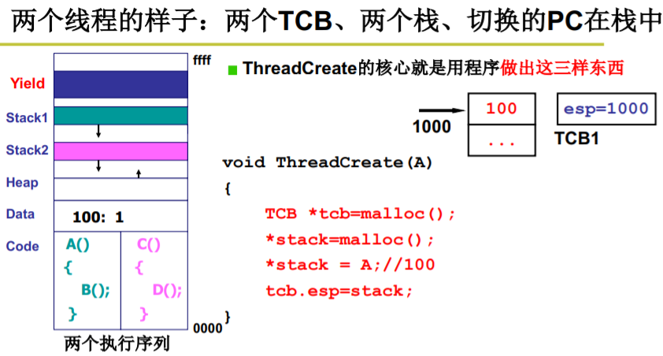

   两个线程的起始样子：2个TCB、2个栈、起始PC在栈中。create函数就是要做出这三样东西：

   1. 创建该线程的TCB
   2. 创建该线程的栈段
   3. 将该线程的起始地址压入栈中
   4. 将栈段保存在TCB中

   > 两个线程的指令序列是在调用create()之前就放在内存中了，无需create()做这些事情。

4. 将所有玩意组合在一起

   create函数：创建一个保存了包含起始地址的栈的TCB

   yield函数：保存当前栈段、切换栈段、弹栈跳转

   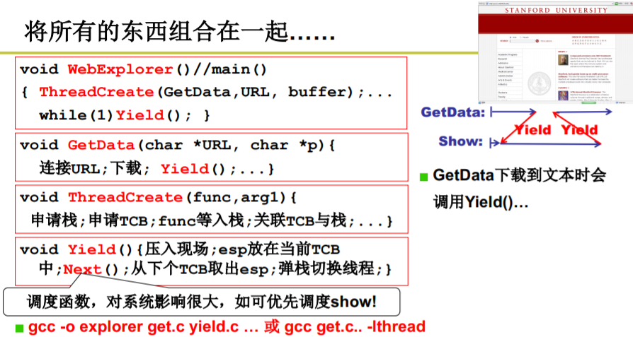

### 内核级线程的必要性

上述的yield函数和create函数都是用户程序，线程也只在用户态切来切去，而线程的切换也是由用户主动调用yield函数来进行，TCP也只是保存在用户段，所以是用户级线程。这就导致操作系统根本感觉不到这种切换，从而引发一个问题：

假设一个用户线程要执行一个IO操作，然后该线程阻塞了，这时用户也无法进行主动切换，此时由于OS感觉不到用户级线程，所以它根本不会进行线程切换，而是直接进行进程切换。

比如在浏览器中，每个标签都是一个用户级线程，假设其中一个标签卡了（即对应线程阻塞了），那么其它标签也会跟着卡了，因为此时OS切换到其它进程去执行了。

也就是说如果一个用户级线程在内核阻塞了，那么其并发效果也就没有了，OS并不会去切换用户级线程，而且即使没有其它进程可以切换，它也不会进行用户级线程的切换，这就导致CPU只能空等了。这时候就需要用到内核级线程了。

内核级线程的ThreadCreate函数属于系统调用，TCB是在内核段中创建的，OS完全可以感知，因此这时候的切换就由操作系统自动完成，而不是由用户手动调用，用户也根本看不见yield函数（为了区分用户线程的切换，内核级线程的切换其实叫schedule调度）。因此在这种情况下，如果一个内核级线程阻塞了，那么系统就会自动切换到另一个内核级线程中继续执行。

> **其它方面：**
>
> 1. 多核计算机必须支持内核级线程才能发挥其真正的价值
>    - 不能是用户级线程：因为只有到了内核，操作系统才能为其分配核。此时用户级线程只能并发。
>    - 不能是多进程：因为多进程需要多套映射表，所以此时多进程只能并发。
>    - 必须是内核级线程：内核级线程可以进入内核，而且可以共用一套映射表。这样系统就能为其分配多个核，从而实现多个线程在多个核上并行执行。
> 2. 进程都是在内核中的，所以切换进程的基础是切换内核级线程。因此有必要知道内核级线程的切换原理。
>
> **多处理器计算机和多核计算机的区别：**
>
> 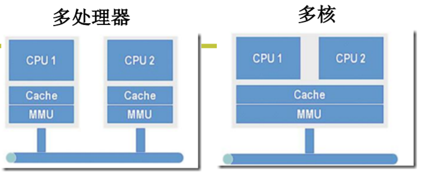
>
> 1. 多处理器计算机有多个CPU，每个CPU都有自己的缓存和映射表。
>
> 2. 多核计算机有多个CPU，但它们共用一套缓存和映射表。

### 内核级线程的切换原理

#### 与用户级线程的区别

一个用户级线程只需要一个栈来保存信息

一个内核级线程则需要两个栈：用户栈和内核栈

在内核创建一个TCB关联内核栈，再由内核栈关联用户栈

一个线程处于用户态就使用用户栈，一旦发生中断进入内核态就使用内核栈

切换线程就需要切换两个栈

#### 内核级线程的切换过程

- **用户栈和内核栈的切换（中断返回）**

  

  1. 触发中断，中断源有：
     - 用户执行中断指令int 80h
     - 在分时系统中该线程的时间片到时了，产生时钟中断
     - 外设产生的中断
  2. 进入内核启用内核栈，将相关信息压入栈中（由硬件自动完成）

     - 将用户栈的栈顶指针压入栈
     - 将用户态程序的返回地址压入栈
  3. 调用IO函数并将函数的返回地址压入栈中（假设没有阻塞）

  4. IO函数执行完成，调用ret指令返回
     - 将返回地址弹出内核栈
     - 从返回地址处继续往下执行
  5. 内核态程序执行完成，调用iret指令返回用户态

     - 将用户态程序的返回地址和用户栈的栈顶指针弹出栈
     - 跳转到用户态程序的返回地址处继续往下执行
     - 同时将内核栈切换回用户栈

  > 内核栈和用户栈之间的切换也属于指令序列之间的切换。

- **内核级线程的切换（在内核中完成）**

  

  1. 用户执行中断指令int 80h触发中断
  2. 进入内核启用内核栈，将相关信息压入栈中（由硬件自动完成）

  3. 调用IO函数并将函数的返回地址压入栈中
  4. 启动磁盘读写，发生IO阻塞，引起OS调度
  5. 从就绪队列中找到新线程的TCB，然后进行线程切换
     - 保存当前esp到当前线程的TCB中
     - 将esp修改为新线程的栈顶地址（从当前线程的内核栈切换到新线程的内核栈）
     - 调用ret指令，跳转到新线程的内核态程序中执行（从新线程的内核栈中弹出该线程在内核态的返回地址）
  6. 新线程的内核态程序执行完成，调用iret指令返回用户态

     - 将用户态程序的返回地址和用户栈的栈顶指针弹出栈
     - 跳转到用户态程序的返回地址处继续往下执行
     - 同时将内核栈切换到用户栈

  > 对于线程来说，用户态程序才是主体，内核态的系统调用只是辅助，因此无论如何最终都要返回用户态执行程序。因此，从旧线程切换到新线程时，新线程只在内核执行一小段（收尾工作）就马上返回用户态执行主体程序了。
  >
  > 内核级线程只能在内核中进行切换（与用户态无关，因为TCB保存在内核中），然后返回到用户态去执行代码。
  >
  > 这整个过程在用户来看就是用户栈切换到用户栈，底层的内核栈切换用户是看不到的。
  >
  > 两个栈切换完成后再加上一个映射表的切换，就完成了进程的切换（顺便提一下）。

- **总结线程切换的过程（五段论）**

  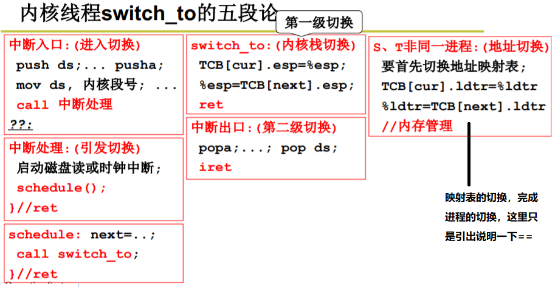

  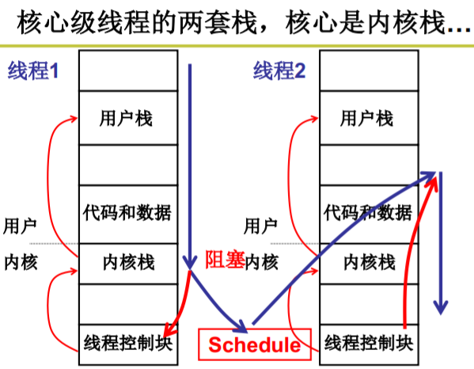

  1. 触发中断，从用户栈切换到内核栈
  2. 阻塞引发调度
  3. 找到新线程的TCB（TCB的切换）
  4. 内核栈切换
  5. 用户栈的切换

#### 内核级线程的创建过程

内核级线程的ThreadCreate函数的样子

- 完成用户栈和内核栈的关联
- 完成内核栈和TCB的关联

具体过程：

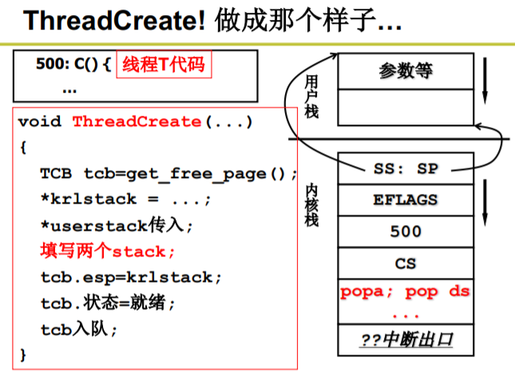

1. 申请一段内核段内存作为TCB
2. 申请一段内核段内存作为内核栈
3. 申请一段用户段内存作为用户栈
4. 将相关信息压入内核栈（将用户栈关联到内核栈）
   - 将用户栈栈顶指针压入内核栈
   - 将用户态程序的起始地址压入内核栈
   - 将用于创建线程的内核函数的返回地址压入内核栈
5. 将内核栈关联到TCB
6. 将TCB的状态设为就绪，并扔进就绪队列

> 内核栈在创建时就保存了用户栈的信息。
>
> 在创建时用户栈只需要保存一些参数信息，而不需要任何地址信息，因为从内核态返回用户栈时，其执行是从用户态程序的起始地址开始的。
>
> 创建线程时，内核栈保存的是用户态程序的起始地址，而不是用于创建线程的接口函数的返回地址。

### 用户级线程和核心级线程的比较

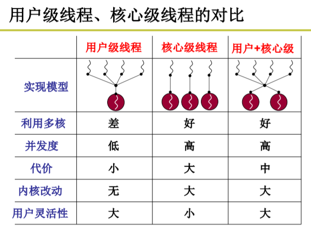

### 内核级线程的代码实现

因为内核级线程相当于进程的一部分，所以直接采用进程的代码实现来推敲内核级线程的代码实现。

fork是系统调用，功能是进入内核创建进程。创建进程包括创建指令序列和创建资源，创建指令序列的代码实际上就是创建内核级线程的代码。

---

#### 预备工作

假设在某一个进程1（父进程）中创建另一个进程2（子进程），mian函数就是进程1的主体程序：

```c
main(){
	A();
	B();
}
A(){
    # 创建进程2的系统调用
	if(!fork()){......}
}
```

1. 执行main函数

   （当前栈为进程1的用户栈）

   执行前压入main函数的返回地址

2. 执行main函数中的A函数

   （当前栈为进程1的用户栈）

   执行前压入A函数的返回地址，即B函数的起始地址

3. 执行A函数中的fork函数

   （当前栈为进程1的用户栈）

   执行前压入fork函数的返回地址

   ```assembly
   // fork函数的部分代码
   mov %eax, __NR_fork // 传入功能号参数
   INT 0x80            // 执行80号中断
   mov res,%eax        // 将中断返回值传入eax寄存器
   ```

4. 执行fork函数中的int 80h指令，该指令的执行过程：

   （当前栈为进程1的用户栈）

   CPU找到当前进程的内核栈，并往里压入当前的SS:ESP（即用户栈的栈顶地址）和CS:EIP（即int指令的下一条指令的地址）

   

   跳转到中断例程（system_call）继续执行，此时自动从用户态切换到内核态，因此当前栈也从用户栈切换到内核栈。

   > 在执行int 80h指令的过程中，当前栈始终还是用户栈，并没有提前切换到内核栈。
   >
   > 执行完int 80h指令就直接跳转到对应的中断例程（system_call）去执行了，不过在跳转前由硬件进行了权限检查。跳转成功后才真正地从用户栈切换到了内核栈。

5. 执行中断例程（system_call）

   ```assembly
   _system_call:
   	push %ds
   	push %es
   	push %fs
   	pushl %eax
   	pushl %edx 
   	pushl %ecx
   	pushl %ebx
   	......
   	call _sys_call_table(,%eax,4) // 此处为调用sys_fork函数
   	pushl %eax // eax存放的是系统调用返回值，将其压入栈
   	...... 
   ```

   （当前栈为进程1的内核栈）

   将用户态程序用到的所有寄存器的值进行压栈，保护用户态程序的现场（至此，进程1的内核栈中保存了该进程在用户态执行的样子）。然后调用sys_fork函数（该函数从sye_call_table中找到）进行创建进程2。

   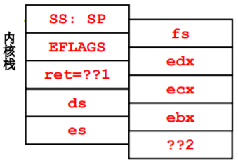

---

#### 如何切换进程

此时先不去探究如何创建进程，即sys_fork函数的执行过程。这里先将system_call函数继续执行下去，**看一看进程是如何切换的**：

```assembly
_system_call:
	......
	call _sys_call_table(,%eax,4)
	pushl %eax
	
2:  // 2为调度代码，用于判断当前进程是否堵塞或到时等，若是则切换进程，否则继续往下执行。
	movl _current,%eax // 取当前进程数据结构指针
	cmpl $0,state(%eax)
	jne reschedule
	cmpl $0,counter(%eax)
	je reschedule
	
ret_from_sys_call:  // 中断返回
	......
```

1. 首先取出当前进程，判断其是否堵塞，若是跳转到reschedule函数，否则继续向下执行；然后再判断其是否到时，若是跳转到reschedule函数，否则继续向下执行。

2. 这里假设其堵塞了，于是跳转到reschedule函数执行：

   ```assembly
   reschedule:
       pushl $ret_from_sys_call
       jmp _schedule
   ```

   将ret_from_sys_call函数的入口地址入栈，使得schedule函数返回后跳转到ret_from_sys_call处继续执行。

3. 执行schedule函数完成切换：

   ```c
   void schedule(void){ 
       ......
   	next=i; # 这里假设通过调度从队列中获取了一个可用进程i
   	switch_to(next);
   }
   
   switch_to(n){ # switch_to是一个宏，这里是展开形式
       struct{ long a,b; };
       __asm__(
       	......
       	"movw %%dx,%1\n\t" 
       	"ljmp %0\n\t"
       	:
       	:"m"(*&__tmp.a),
        	 "m"(*&__tmp.b),
        	 "d"(_TSS(n))
       )
   }
   # 解释：
   # 临时数据结构__tmp用于组建远跳转指令的操作数，该操作数由4字节偏移地址和2字节的段选择符组成。因此__tmp中a的值是4字节偏移值，而b的低2字节是新TSS的选择子（高2字节不用）
   # %0指向__tmp，%1指向__tmp.b
   # dx存放新TSS的选择子，并将其赋给了%1
   # 对于造成任务切换的长跳转，a值无用
   ```

    在linux0.11中采用的是TSS切换，即使用一条ljmp指令即可完成切换。其切换过程如下：

   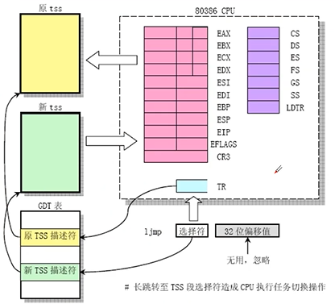

   - ljmp的操作数是新进程对应的TSS段的选择子，引起CPU进行任务切换；
   - CPU首先将当前进程的寄存器状态保存到当前进程对应的TSS段中，该TSS段的选择子由任务寄存器TR指出（TR永远保存着当前进程对应的TSS段的选择子）；
   - CPU利用ljmp指令中的选择子，查GDT表找到对应的TSS段，然后将该TSS段中的内容覆盖到所有寄存器中（寄存器状态一变，当前进程就切换到新进程）；
   - CPU将新进程的TSS选择子更新到TR寄存器中。

   > - 什么是TSS？
   >
   >   将每个进程对应的所有寄存器的状态用一个数据结构存储起来，这个数据结构就叫TSS（任务状态段，因为一个进程就是用于执行一个任务）。因此，一个TSS结构就代表了一个进程，到时候要切换到某个进程时，就只需要将TSS中的内容恢复到寄存器上就可以了。
   >
   > - 如何找到TSS？
   >
   >   TSS也是一个段，其段描述符存放在GDT表上，通过选择子查表找到该TSS的段描述符就可以找到该TSS，即选择子->查GDT表->段描述符->TSS段。
   >
   > - 只有长跳转指令ljmp的操作数是一个TSS的段选择符时，就会引起CPU进行任务切换，切换到该TSS对应的进程。
   >
   > - TSS切换使用一条长跳转指令完成切换，这个过程比较慢，现在基本上都不采用。现在采用的都是内核段切换执行过程那一节讲的方法，即内核栈切换。

4. 执行完schedule函数后跳转到ret_from_sys_call完成中断返回：

   ```assembly
   ret_from_sys_call:
   	......
   	popl %ebx
   	popl %ecx
   	popl %edx
   	addl $4,%esp //跳过eax
   	pop %fs
   	pop %es
   	pop %ds
   	iret
   ```

   恢复新进程的用户态程序现场，然后调用iret指令返回新进程的用户态程序中开始执行

---

#### 如何创建子进程

此处开始讲解sys_fork函数（真正用于创建进程的函数）的执行过程，即**如何创建进程**。主要思路就是将父进程在用户态执行的样子（即所有父进程内核栈中的内容）复制到子进程的PCB中：

```assembly
_sys_fork:
	call _find_empty_process // 为新进程取得进程号last_pid，返回值保存在eax
	testl %eax,%eax // 判断返回值是否为负，若是则退出
	js 1f
	push %gs
	pushl %esi
	pushl %edi
	pushl %ebp
	pushl %eax
	call _copy_process
	addl $20,%esp // 丢弃这里的所有压栈内容
1:   ret
```

1. 执行sys_fork函数

   （当前栈为进程1的内核栈）

   执行前压入sys_fork函数的返回地址

   将当前其它的一些寄存器的值也压入栈中

   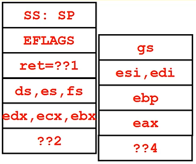

   调用copy_process函数进行子进程的创建

2. 执行copy_process函数（将所有寄存器的值作为参数）

   ```c
   int copy_process(int nr,long ebp,long edi,long esi,long gs,long none,long ebx,long ecx,long edx,long fs,long es,long ds,long eip,long cs,long eflags,long esp,long ss)
   {
   	......
   	# 申请内核段作为PCB
   	p = (struct task_struct *) get_free_page();
   	......
       # 在PCB的顶部创建子进程的内核栈
   	p->tss.esp0 = PAGE_SIZE + (long)p;
   	p->tss.ss0 = 0x10; # 内核态栈的段选择符（与内核数据段相同）
       # 将当前父进程的用户栈作为子进程的用户栈
   	p->tss.esp = esp;
   	p->tss.ss = ss & 0xffff;
       # 将执行地址存入TSS
   	p->tss.eip = eip;
   	p->tss.cs = cs & 0xffff;
   	......
       # 将eax置为0，用于区分父进程和子进程
   	p->tss.eax = 0;
   	p->tss.ecx = ecx;
   	p->tss.edx = edx;
   	......
   	p->tss.ldt = _LDT(nr);
       ......
       # 设置子进程TSS的段描述符
   	set_tss_desc(gdt+(nr<<1)+FIRST_TSS_ENTRY,&(p->tss));
       # 设置子进程的ldt描述符
   	set_ldt_desc(gdt+(nr<<1)+FIRST_LDT_ENTRY,&(p->ldt));
       # 设置子进程的状态为就绪
   	p->state = TASK_RUNNING;
   	return last_pid;
   }
   ```

   - 获取一页空白内核段（mem_map中为0的一段）作为子进程的PCB

     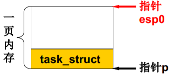

   - 初始化PCB的一些参数

   - 创建子进程内核栈和用户栈

   - 将所有当前进程的寄存器状态存入子进程的TSS段中

   - 设置子进程的TSS段描述符和LDT段描述符

   - 返回该子进程的进程号

3. 回到sys_fork函数做收尾工作

   - 清楚栈中无用的内容
   - 跳回system_call函数（此时调回去执行的第一条指令是pushl %eax，该指令用于将系统调用的返回值压入栈中，作为整个中断处理的结果。此处返回的是父进程所创建的子进程的进程号，而子进程开始执行时也是从这里开始返回，它的返回值就是上面设置的0）

> 汇编调用C函数时，函数的参数就从栈中获取。
>
> CPU执行哪个进程（或线程），完全靠寄存器的状态来决定，切换进程（或线程）的本质就是修改寄存器的值。可以说，不同的寄存器状态就代表了不同的进程（或线程），只要用一种数据结构（PCB或TCB）将这个状态保存起来，就相当于创建了一个进程（或线程），同时创建多个状态并保存起来，就是所谓的多进程（或线程）了，如果不时地切换这些状态，就是多进程（或线程）的交替执行了。
>
> 所有功能号的int 80h中断例程都是一样的，只是call _sys_call_table(,%eax,4)这个指令调用的功能处理函数不一样而已。
>
> 只要两个进程的内核栈不是同一个，即使它们共用一个用户栈，操作系统也会认为它们是两个不同的进程。
>
> 父进程的中断返回值为last_pid，而子进程的中断返回值为0。通过这两个不同的值就可以在用户态区分父进程和子进程。

---

#### 子进程和父进程分叉

子进程已经创建好了，但不同的进程肯定是要执行不同任务的，而子进程中断返回到用户态时执行的也是父进程的任务，那么如何才能让子进程去执行别的任务呢？

不管是父进程还是子进程，其中断返回后执行的第一条指令都是mov res,%eax，即将存在eax中的中断结果赋给res作为fork函数的返回值，而fork函数返回后执行的代码是if(!fork()){......}，而之前说过父进程的返回值是大于0的，而子进程的返回值等于0，因此子进程返回后就会去执行if内部的代码，而父进程就跳过if继续往下执行自己的任务。所以是在这里将两个进程的任务分开。

我们看看子进程在if内部执行了哪些代码，可以让子进程脱离父进程的程序转而去执行自己的任务。我们以shell程序为父进程，建立子进程去执行命令为例：

```c
int main(int argc, char * argv[])
{ 
    while(1) { 
    	scanf(“%s”, cmd);
    	if(!fork()) { exec(cmd); } 
    	wait(0); 
    }
}
```

可以看到子进程执行了一条代码exec(cmd)，即调用exec函数去执行cmd命令。所以基本思路就是，当子进程执行完exec函数返回后，它就必须跳转到其它程序去执行了，不再从父进程的程序往下执行。这是如何做到的？其实本质上就是修改了exec函数的返回地址，使其不会跳回父进程，主要执行过程如下：

1. exec函数是一个系统调用，其中断处理函数为sys_execve，代码如下。其主要就是给do_execve函数传入了内核栈中存放用户程序指针的地址，然后调用该函数：

   ```assembly
   _sys_execve:
   	lea EIP(%esp),%eax // 将内核栈中保存用户程序指针的地址赋给eax寄存器，其中EIP=0x1c
   	pushl %eax // 压栈作为do_execve函数的参数
   	call _do_execve
   	addl $4,%esp // 丢弃调用时压入栈的EIP值。
   	ret
   ```

   此时内核栈的情况如下所示：

   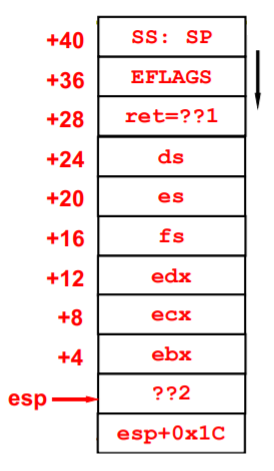

> EIP(%esp)=EIP+%esp=0x1c+%esp=28+%esp，即内核栈中存放用户程序指针的地址。
>
> 在下述do_execve代码中eip[0]和eip[3]的含义：
>
> - eip[0]=esp+eip=esp+28
> - eip[3]=esp+eip+0x0C=esp+40

2. do_execve的代码如下。其主要就是① 先创建了一个用户栈，P指向该栈的栈顶，② 然后将cmd命令对应程序的起始地址赋给eip[0]，替换内核栈中的中断返回地址，③ 接着将P赋给eip[3]，替换内核栈中保存的用户栈栈顶指针。

   结果就是：使得iret返回时返回的是cmd命令对应程序的起始地址，而且让子进程拥有了自己的一个用户栈（不用和父进程共用了）

   ```c
   int do_execve(unsigned long * eip,......){
       ......
   	p += change_ldt(ex.a_text,page);
   	p -= LIBRARY_SIZE + MAX_ARG_PAGES*PAGE_SIZE;
   	p = (unsigned long) create_tables((char *)p,argc,envc);
   	eip[0] = ex.a_entry;
   	eip[3] = p;
       ......
   	return 0;
   }
   ```

> do_execve函数中a_entry是cmd命令对应程序的入口地址，这个地址从该程序的文件首部（链接时产生）中获取：
>
> ```c
> struct exec {
> 	unsigned long a_magic // 执行文件魔数
> 	unsigned long a_text // 代码长度
> 	unsigned long a_data // 数据长度
> 	unsigned long a_bss // 文件中的未初始化数据区长度
> 	unsigned long a_syms // 文件中的符号表长度
> 	unsigned long a_entry // 执行开始地址
> 	unsigned long a_trsize // 代码重定位信息长度
> 	unsigned long a_drsize // 数据重定位信息长度
> };
> ```
>
> 为了确保子进程不会干扰父进程的执行，父进程返回后就调用wait(0)让自身阻塞，从而切换到子进程，让其顺利跳到其它程序去执行。

#### 总结

1. 如何切换进程

   系统调用进入内核 -> 阻塞触发调度 ->  TSS切换 ->  中断返回用户态

2. 如何创建进程

   系统调用进入内核 -> 调用sys_fork ->  创建TSS、内核栈 ->  中断返回进入阻塞，切换到子进程

3. 子进程如何摆脱父进程

   系统调用进入内核 -> 修改中断返回地址、创建用户栈 ->  iret跳转到其它程序

> 子进程刚创建时与父进程共用用户栈和任务，中断返回后通过exec系统调用来创建自己用户栈和任务。
>
> 子进程调用exec函数时，会往父进程的用户栈压入一个返回地址，但这个不会影响父进程的执行。
>
> 两个进程虽然可以共用一个用户栈，但两个进程执行的任务不一样，共用一个用户栈始终会造成相互影响而破坏执行结果，因此还是要为每一个进程都创建一个属于它自己的用户栈。所以无论如何，两个进程最后的样子必须如下面所示：
>
> 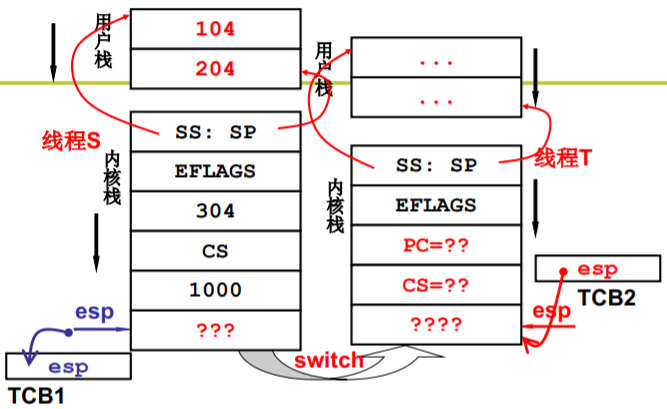

## 整理知识点↑

1. 如何启动CPU？

   给它一个初始PC值

2. 如何更好运转CPU？

   在IO阻塞时运行别的程序，形成多程序交替执行

3. 如何实现程序切换

   用户级线程切换：找到下一个TCB -> 切换用户栈 -> 弹栈返回

   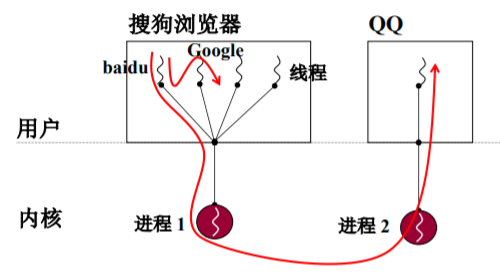

   内核级线程切换：系统调用 -> 用户栈切换到内核栈  -> 找到下一个TCB  -> 内核栈切换到内核栈 -> 中断返回  ->  内核栈切换到用户栈

   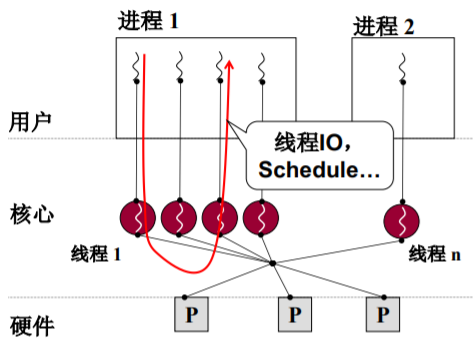

4. 创建两个进程，在屏幕上交替打出A和B

   - 主进程执行AB.c函数：

     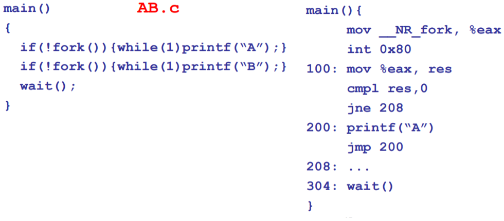

   - 进入内核

     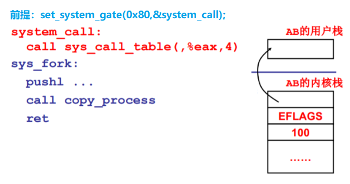

   - 创建子进程

     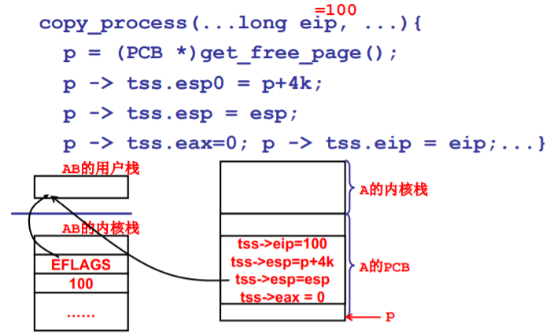

   - 继续创建第二个子进程

     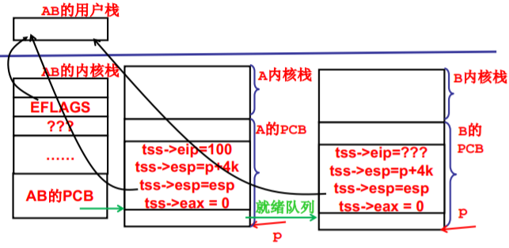

   - 主进程调用wait()进入阻塞，

     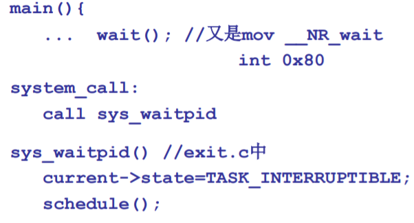

   - 通过调度切换到子进程A执行

     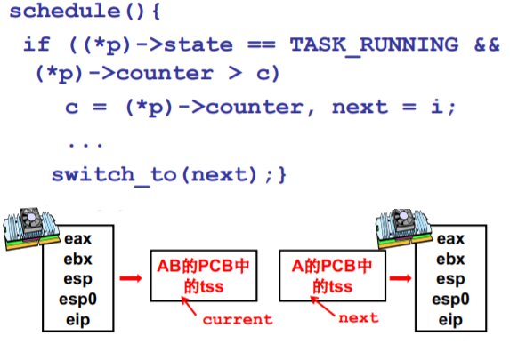

   - 为了打印出B，必须中断进程A，使得进程B可以执行。因此给A添加一个时钟中断

     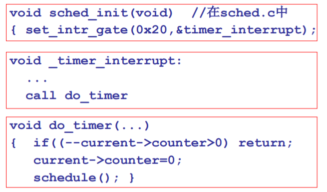

   - A产生时钟中断，切换到进程B执行

     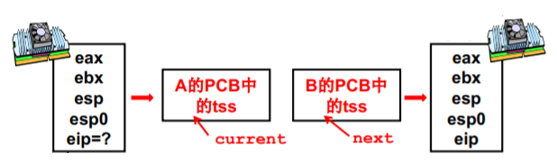

   - 为了交替打印出A和B，也需要给B进程添加一个时钟中断。至此任务完成。

## CPU调度策略

CPU调度就是从就绪队列中找出下一个应该被执行的进程。

### 调度基本概念

 CPU调度的最重要度量是时间，这体现在三个方面：

- 完成时间：从开始执行到执行结束
- 周转时间：从进入队列到执行结束
- 响应时间：从进入队列到开始执行

另外， CPU调度还要考虑系统内耗，即用于切换和调度的时间，该值越大，CPU的吞吐量就越小。

这几种概念的关系：响应时间小 => 切换次数多 => 系统内耗大 => 吞吐量小  => 周转时间大。

CPU调度的任务主要由两种：前台任务和后台任务。前台任务关注响应时间，属于IO约束型任务，CPU执行时间短；后台任务关注周转时间，属于CPU约束型任务，CPU执行时间长。


CPU调度的主要设计理念就是在这几个要求中不断折中和综合。而折中和综合让操作系统变得复杂， 但有效的系统又要求尽量简单（内耗小）。

### 三个基本调度算法

1. FCFS算法

   即先来先服务，可以保证公平。

   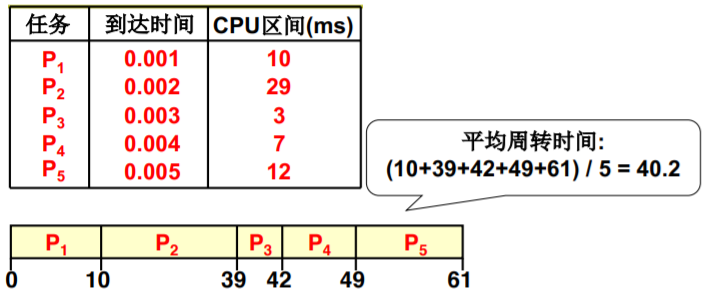

2. SJF算法

   即短作业优先，可使周转时间最小。

   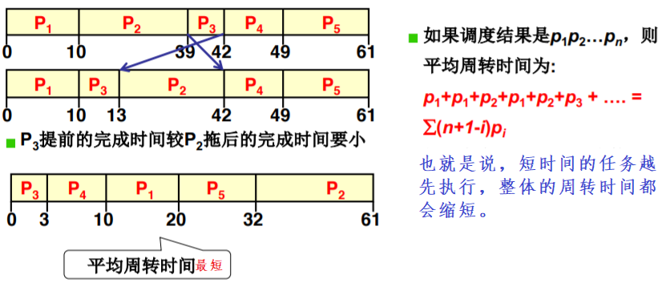

3. RR算法

   即按时间片轮转调度，可以保证响应时间。

   如果同时有n个进程，其中一个是前台进程，用户在这个进程上进行操作，如果用户在这个进程得到执行时发出操作，那么用户会立即得到响应，这是最短的响应时间；如果用户在该进程刚刚结束时发出操作，那么用户会在nT（T为时间片长度）时间后得到响应，这是最长的响应时间。也就是说，无论n个任务的执行时间有多长，用户总能够在nT时间内得到响应。

   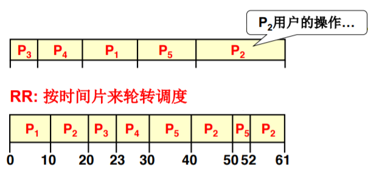

   > 时间片长度的选择需要折中考虑：
   >
   > 时间片大：响应时间大，吞吐量大（内耗小）
   >
   > 时间片小：响应时间小，吞吐量小（内耗大）

这三个算法都是在特定的场景下才能发挥出最佳的作用，比如SJF算法适合于后台任务，RR算法适合于前台任务。如果同时存在前台任务和后台任务怎么办？这需要综合考虑响应时间和周转时间。

一个办法就是设置两个队列，一个是前台任务队列，内部采用轮转调度算法，另一个是后台任务队列，内部采用短作业优先算法。

而前台任务和后台任务之间的切换，可以通过优先级来调度，比如前台任务的优先级高，后台任务的优先级低，但这会导致只有前台任务没有时，后台任务才会被调度，就有可能使得后台任务一直得不到运行。


这时可以考虑动态调整后台任务的优先级，但一旦提高了后台任务的优先级，由于后台任务时间较长，就会导致前台任务无法被及时响应。于是又想到可以利用时间片，让后台任务只执行一段时间就进行切换，但这又要考虑后台任务的短作业优先算法，这也是一个问题。

同时，我们又怎么知道哪些是前台任务，哪些是后台任务？而且任务也不一定一成不变，可能在前台任务和后台任务之间发生变化，这又如何解决（听说可以通过系统自己学习来解决）？除此之外，任务的执行长度又如何确定，使得短作业优先算法可以生效? 

### 一个调度实例schedule函数

```c
void schedule(void){
   int i,next,c;
   struct task_struct ** p;
   ......
   while (1) {
      c = -1;
      next = 0;
      i = NR_TASKS;
      p = &task[NR_TASKS];
# 这段代码也是从任务数组的最后一个任务开始循环处理，并跳过不含任务的数组槽。它比较每个就绪状态任务的counter（任务运行时间的递减滴答计数）值，哪一个值大，就表示相应任务的运行时间还有很多，next就指向哪个的任务号。
      while (--i) {
         if (!*--p)
            continue;
         if ((*p)->state == TASK_RUNNING && (*p)->counter > c)
            c = (*p)->counter, next = i;
      }
# 如果比较得出有counter值不等于0的结果，或者系统中没有一个可运行的任务存在（此时c仍然为-1，next=0），则退出外层while循环，并执行后面的任务切换操作。否则就根据每个任务的优先权值，更新每一个任务的 counter值，然后再重新循环继续比较。
# counte值的计算方式为 counter = counter/2 + priority。
# 注意，这里计算过程不考虑进程的状态，即阻塞态的任务也会被重新计算。
# 任务0是一个闲置任务，只有当没有其他任务可以运行时才调用它。
      if (c) break;
      for(p = &LAST_TASK ; p > &FIRST_TASK ; --p)
         if (*p)
            (*p)->counter=((*p)->counter>>1)+(*p)->priority;
   }
# 切换到任务号为next的任务，并运行之。  
   switch_to(next);
}
```

1. 首先从所有进程的PCB中找出counter值最大的那一个进程；
2. 如果找到就直接切换到该进程执行；
3. 如果没有找到就重新计算所有进程的counter值，然后重新寻找。

**counter值有以下作用：**

1. 作为各个进程的优先级，counter值越大的进程就越先被执行；

2. 作为各个进程的时间片（即定时器，通过时钟中断不断递减），通过轮转调度保证了前台任务在一定时间内一定可以得到响应；

   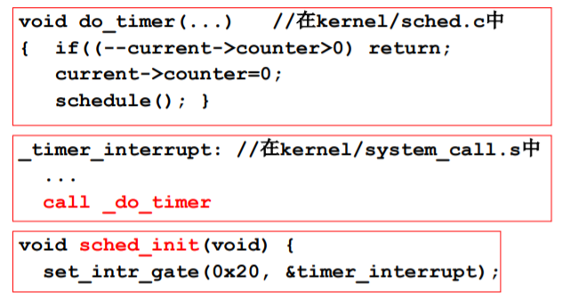

3. 保证了响应时间的边界，即counter值的重计算具有收敛性，最大值为2倍的priority，所以一个进程的最大响应时间为2np；

4. counter代表的优先级可以动态调整，使得IO进程的优先级再就绪时高于非阻塞进程，即变相照顾了前台进程（IO进程的counter值在进入阻塞时就不再减少了）；

5. 后台进程一直按照counter轮转，使得短任务始终会在长任务之前结束，近似于SJF调度；

6. 每个进程只用维护一个counter变量，即简单又高效 。

## 进程同步与信号量

### 什么是进程合作和进程同步


进程合作就是多个进程共同完成一个任务，这意味着每个进程都是任务的一部分，进程之间具有相互约束，这个约束就表现在：

1. 每个进程都有自己的执行程序，但不是每条指令都可以随便执行
2. 一个进程的推进依赖另一个进程的执行结果

进程同步就是让多个进程的推进变得合理有序，主要方法就是等待和唤醒，信号就是媒介，即一个进程执行到一定程度就阻塞，等待一个信号；另一个进程执行到一定程度后产生推进条件，就发送一个信号（唤醒）。

因此进程同步的样子就是各个进程走走停停，而进程同步的关键就在于找到什么时候停，什么时候走。

可以看出来，合作依靠同步，同步依靠信号。

生产者-消费者模型就是一个典型的进程同步的例子：

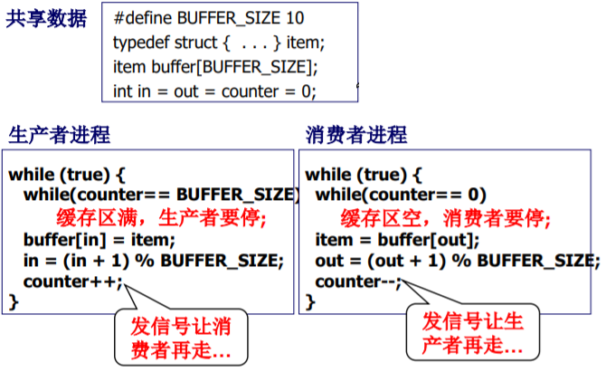

### 什么是信号量

仅通过信号来传递推进条件往往是不够的，因为信号只能表达0和1（或有和无），还需要信号量来表达更丰富的信息。如下所示：

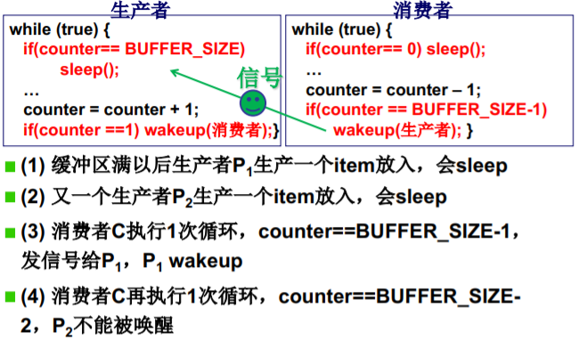

这里通过counter值是否等于缓冲区大小来作为信号产生的条件，可以发现生产者P2是永远不可能被唤醒的。因为此处信号的语义只能表达缓冲区有没有满，不能表达出有几个生产者在等待，因此单单使用counter已经不能满足需求了，需要用另一个量来记录额外的一些信息，比如有几个生产者进程在睡眠，然后根据这个量来决定是否发信号。这个量其实就是信号量。

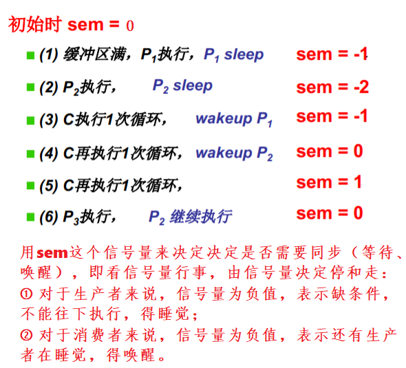

因此信号量是在信号本身无法表达更多信息时产生的，比如信号只能表达有还是没有，而信号量可以表达有还有多少，没还缺多少。或者说单单一个信号只能实现单对单的同步，而信号量可以实现多对多的同步。

### 信号量的定义

信号量：1965年，由荷兰学者Dijkstra提出的一种特殊整型变量，量用来记录，信号用来sleep和wakeup。

信号量的实现方法：

1. 定义一个信号量结构体来记录信息

   ```c
   struct semaphore
   {
   	int value;  //记录资源个数
   	PCB *queue; //记录等待在该信号量上的进程
   }
   P(semaphore s); // 生产者接口
   V(semaphore s); // 消费者接口
   ```

2. 再为这个信号量定义两个接口来进行同步

   ```c
   P(semaphore s){
   	s.value--;
   	if(s.value < 0) {
   		sleep(s.queue); }
   }
   
   V(semaphore s){
   	s.valu++;
   	if(s.value <= 0) {
   		wakeup(s.queue); }
   }
   ```

信号量的实现举例：

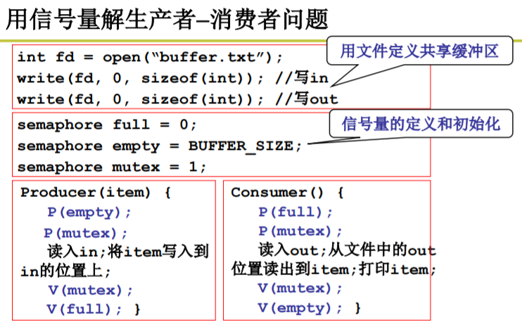

- 信号量的语义标准应该是当信号量=0时为同步的界限。
- 信号量empty：表示缓存区的空闲资源，用于决定生产者的等待和被唤醒。
- 信号量full：表示缓存区的消费资源，用于决定消费者的等待和被唤醒。
- 信号量mutex：进程合作难免会进行共享资源的读取，为了防止脏值产生，就用互斥信号量mutex对共享资源进行加锁，使得一次只能有一个进程访问共享资源，其它进程必须等待。因此，这个信号量用于所有进程的等待和被唤醒。

- 可以看出，信号量empty和full用于保证进程合理有序的推进，而互斥信号量mutex用于保证进程合作的正确性。

> 脏值产生的根本原因在于对目标的修改不是原子性操作（单指令操作），而是多步操作的组合（或多指令操作）。
>
> 一般情况下，只要是共享数据，如果没有对其添加保护（加锁等），对其进行并发操作都会引起脏值产生。
>
> 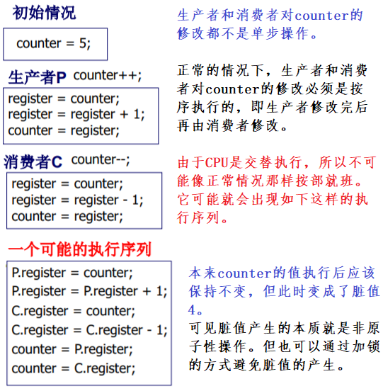

### 信号量临界区保护

进程合作依靠同步，同步依靠信号量，信号量依靠临界区保护

#### 为什么要保护信号量以及什么叫临界区

进程之间通过对信号量的访问和修改来实现合理有序的推进，而一旦信号量出错，那么就会引起同步产生问题。

比如上述用信号量实现的例子中，empty表示的是空闲资源的数量，如果此时睡眠的进程有两个，而empty的值为-1，那么就会造成一个进程永远也无法被唤醒。

信号量出错的最主要原因是多个进程并发修改信号量，从本质上看就是信号量的修改并非是原子性操作（不能被继续分割的操作）：

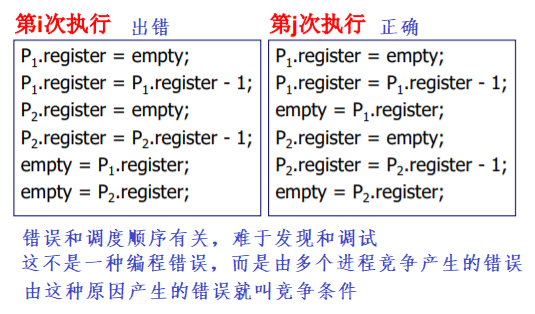

解决竞争条件的最直观方法就是在写共享变量empty时阻止其他进程也访问empty：

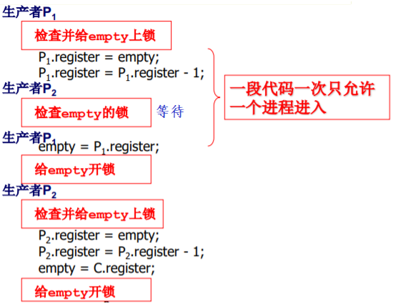

换句话说就是，一个进程在进入修改empty的那段代码的时候绝不允许其它进程也进入它的那段修改empty的代码。为了描述那段代码，就把它称为临界区，所以临界区指的就是该进程用于修改共享变量的那段代码，可以发现临界区有以下特点：


1. 对于都需要访问和修改共享变量的所有进程，它们都有自己的临界区；
2. 每个进程的临界区可能一样，也可能不一样；
3. 读写信号量的代码段一定是临界区。

到这里又可以把解决竞争条件的方法用临界区描述一遍：一个进程在进入临界区时绝不允许其它进程也进入临界区，即保护临界区。所以为了保护临界区，就必须先找出进程中的临界区代码，然后在进入临界区前和退出临界区后写一些保护代码，称为进入区代码和退出区代码：

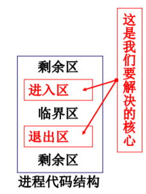

#### 临界区的保护原则

1. 互斥进入：如果一个进程在临界区中执行，则其他进程不允许进入。这些进程间的约束关系称为互斥(mutual exclusion) ；
2. 有空让进：若干进程要求进入空闲临界区时， 应尽快使一进程进入临界区 ；
3. 有限等待：从进程发出进入请求到允许进入，不能无限等待。

#### 临界区的保护方法

#####  面包店算法

纯软件支持的方法，无需硬件支持

1. **轮转法**

   每个进程都对应一个数值，当turn轮换到该数值时，就说该进程值日，此时它才能进入临界区。

   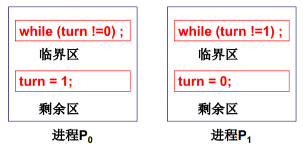

   - 满足互斥进入原则：如果P0和P1同时进入临界区，则turn必须同时等于1和0，这明显不可能，所以满足互斥进入原则。
   - 不满足有空让进原则：假设turn=1，但进程P1发生阻塞并不能进入临界区，于是又重新切换到进程P0执行，但此时不满足P0进入临界区的条件，因此P0只能进入循环空等，这时候就造成了有空不让进的问题。

2. **标记法**

   每个进程都有一个标记，当该进程想要进入临界区时，就打上标记并进入临界区，其它进程看到已经有标记时，就循环等待。也就是说，只有其它进程没有打上标记，我才能进入临界区。

   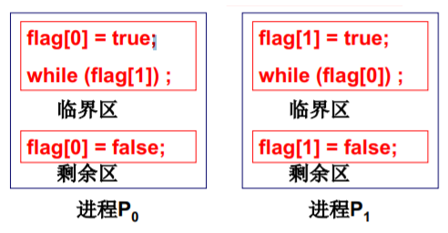

   - 满足互斥进入原则：如果P0进入临界区，则flag[0]和flag[1]必须分别等于true和false，此时P1如果也进入临界区，则flag[0]和flag[1]必须分别等于false和true，产生矛盾，所以满足互斥进入原则。
   - 不满足有空让进和有限等待原则：如果P0执行完第一条指令就切换到P1执行，此时P1执行完第一条指令后发现flag[0]=true就进入循环等待，此后无论是哪个进程继续执行都只能进入循环等待。因此，这就造成了无限等待和有空不让进的情况。

3. **Peterson算法 （非对称标记法）**

   同时使用标记和轮转两种方法，只要其它进程没有打上标记或轮到自己了，该进程就可以进入临界区。

   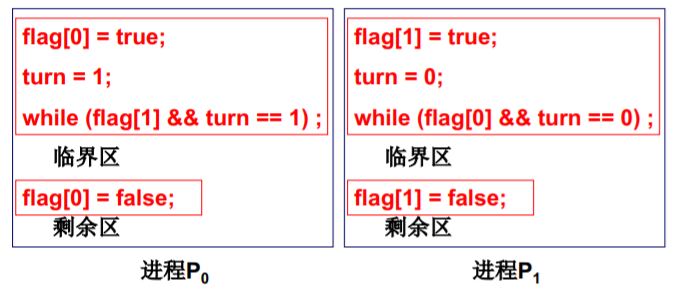

   - 满足互斥进入原则： 如果两个进程都进入，则flag[0]=flag[1]=true且turn=0=1，矛盾，所以满足互斥进入原则。
   - 满足有空让进原则：① 如果值日的进程阻塞了，那么其它进程可以通过标记进入临界区；② 如果所有进程都打上了标记，那么可以通过轮转来打破这个僵局。
   - 满足有限等待原则：P0要求进入，flag[0]=true，后面的P1不可能一直进 入，因为P1执行一次就会让turn=0。

4. **面包店算法**

   以上都是在两个进程中使用的方法，而面包店算法是在Peterson算法上拓展的用于多个进程的方法，仍然是标记和轮转的结合：

   - 如何轮转：每个进程都获取一个序号，序号最小的进入。

   - 如何标记：序号非0表示打上了标记，序号为0表示没有标记。进程每次进入临界区前都会取一个号，同时也表示有标记；每次离开临界区序号都会被置0，表示无标记。

   面包店算法：每个进入商店的客户都获得一个号码，号码最小的先得到服务；号码相同时，名字靠前的先服务。

   ```c
   // 进程Pi
   --------------------
   # 进入区
   choosing[i] = true;  // 表示正在取号
   num[i] = max(num[0],...,num[n-1]) +1; 
   choosing[i] = false; // 表示结束取号
   for(j=0; j<n; j++) { 
       while(choosing[j]){
   		// 等待其它进程取号完成
       };
       while ( (num[j] != 0) && (num[j],j)<(num[i],i) ){
           // wait
       }
   }
   --------------------
   # 临界区
   ......
   --------------------
   # 退出区
   num[i] = 0; // 取消标记
   --------------------
   # 剩余区
   ......
   ```
   
   > (a, b)<(c, d) 等价于 (a < c) or ((a == c)and(b < d))
   >
   > num[i]表示进程Pi的轮转序号，同时也表示了标记。
   >
   > 面包店算法太复杂，而且取号可能发生溢出。因此，可以通过硬件支持来减轻代码量。
   
   可以进入临界区的几种方式：
   
   1. 如果其它进程都不想进入临界区（序号都等于0），那么我可以进去；
   2. 如果我的序号最小（轮换到我了），那么我可以进入。
   3. （特殊）如果我和另一个进程的序号一样且最小，我的进程号靠前，那么我可以进入。
   
   临界区保护原则检验：
   
   - 互斥进入：Pi在临界区内，Pk试图进入，一定有(num[i], i)<(num[k],k)，使得Pk循环等待。
   - 有空让进：如果没有进程在临界区中，最小序号的进程一定能够进入。
   - 有限等待：离开临界区的进程再次进入一定排在最后(FIFO)，所以任一个想进入进程至多等n个进程。

##### 阻止调度法（开关中断）

硬件支持的方法，只需2条指令即可完成。

当一个进程进入临界区后，只要让该进程不被中断，不产生调度，那么其它进程就没有办法进入临界区，使得信号量得到保护。

进程只有中断才能被调度，而一个没有阻塞的进程在执行时就只会被时钟中断，因此只需要在该进程处于临界区时关闭时钟中断就可以实现临界区保护。


具体方法：只要在进入临界区前执行cli()就可以实现硬件关中断，离开临界区后执行sti()打开中断。

缺点：这种方法只在单CPU上有用，在多CPU(多核) 系统上不好使。

原因：CPU有一个INTR中断寄存器，其中1位表示时钟中断，只要有一个进程的时间片被用完，该位就会被置成1。CPU每次执行指令结束后就会检查INTR中断寄存器，如果发现时钟中断位是1，就会去调用时钟中断，进而引发调度。执行了cli()后，CPU就会忽视时钟中断，使得调度不会发生。但多CPU系统的每个CPU都有一个INTR寄存器，某个时间片用完，所有INTR寄存器中的时钟中断位都会变成1，也就是说即使其中一个CPU被关中断了，其它CPU还是可以继续调度，并发还是会发生。

##### 硬件原子指令法

一个进程在进入临界区前加锁，使得其它进程无法进入临界区，然后离开临界区后开锁，使得其它进程有机会进入临界区。

这个锁就是一个变量，只有两种取值（比如0和1），加锁就是将这个变量置成1，开锁就是将这个变量置成0。每个进程进入临界区前就会检查这个变量的值，若是1就可以进入，是0则空循环等待，而一旦进入临界区就必须将这个变量置为1，以阻止其它进程进入，一直到离开临界区后才能开锁。

为了实现这种锁机制，就必须将加锁和开锁这两个操作做成原子指令，即加锁和开锁这两个动作只能一气呵成，中途不可以中断，过程不能被切割。也就是说，这个锁变量不应该是一个类似信号量的玩意，对这个变量的修改绝不会因为并发而变成脏值，因此这个变量是由硬件进行保护的，加锁和开锁这两个操作也被称为硬件原子指令。

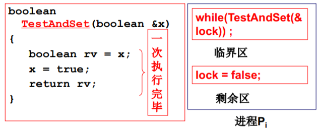

上图中lock就是一个锁变量（有true和false两个值），而TestAndSet这个函数就是一个用于加锁的硬件原子指令，虽然其中有三条代码，但这三条代码的执行是一步到位的，绝不会被切割，也不能被中断，由硬件保证这整个过程。而解锁就是一条赋值代码，也是一个硬件原子指令。所以就用这两个由硬件保护的原子指令将信号量的临界区进行保护，这也就相当于用硬件保护临界区了。

### 信号量的代码实现

#### 用户态程序实现信号量同步

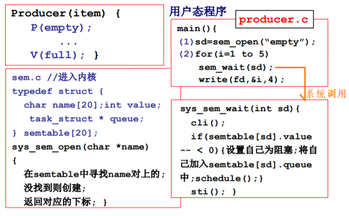

1. 首先在内核中写一个信号量结构体以及该信号量的申请调用；

   > 信号量结构体需要有自身的value用来判断进程是否阻塞，还要有一个PCB队列来管理等待进程。这些内容都需要对所有进程可见，因此必须放置在内核中。

2. 然后在必要的地方执行wait系统调用，检查信号量的状态，并据此来决定是否等待；

3. 在信号量的临界区前后使用关中断来保护信号量的修改和判断；

4. 如果发现需要阻塞，就将自己的状态设为阻塞态，然后将自己加入等待队列，最后调用schedule进行调度，切换到其它进程。

这里的wait代码使用的是if来判断是否应该阻塞，这种方式使得只能从等待队列唤醒一个指定的进程（比如队首进程）来继续执行，这样就不能充分考虑等待队列中各个进程的优先级。

#### 内核态程序实现信号量同步

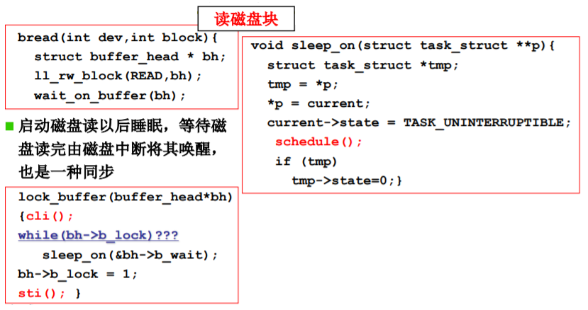

1. 用户态调用read接口后就会进入内核执行bread函数（读磁盘块），这个函数先在内存中申请一块缓冲区用于存放从磁盘中读进来的内容，然后调用ll_rw_block函数。

2. 在ll_rw_block函数中，调用了lock_buffer函数（参数为缓冲区指针，其中有一个信号量b_lock），用于给缓冲区加锁，使得该缓冲区无法被其它进程访问，防止缓冲区被污染，然后就发送读命令，启动设备工作。

   - 在lock_buffer函数中，如果缓冲区的信号量b_lock=1，这说明缓冲区已经被加锁，已经有某个进程在使用这个缓冲区，于是调用sleep_on函数进入睡眠，等待直到解锁；
     - sleep_on函数的作用就是将当前进程加入等待队列（这个队列不简单），然后将该进程的状态改为阻塞态，并调用schedule函数进行调度，切换到其它进程。
   - 如果缓冲区的信号量b_lock=0，这说明缓冲区没有被任何进程在使用，于是加锁，接着发送读命令请求，让磁盘开始工作，往缓冲区传送内容。
   - 这个判断和加锁的过程由关中断保护。

3. 执行完ll_rw_block函数则说明磁盘已经在工作，并正在往缓冲区传送内容，于是进程调用wait_on_buffer函数让自身进入睡眠，等待磁盘填充好缓冲区。

   - 在wait_on_buffer函数中（可在下面的源码部分看到），进程也是通过信号量b_lock来判断缓冲区状态，如果缓冲区加锁则说明里面的内容还没有读取完成，于是进入睡眠；
   - 如果如果缓冲区没有加锁了，则说明内容已经在缓冲区了，于是可以将缓冲区指针进行返回（相当于把内容提交给上层进行处理）。

   > 此时在等待队列中的进程有两种情况，一个是等待缓冲区被其它进程使用完成的进程（缓冲区个数有限，总有多个进程会使用到同一个缓冲区），另一个是等待缓冲区读取内容完成的进程。

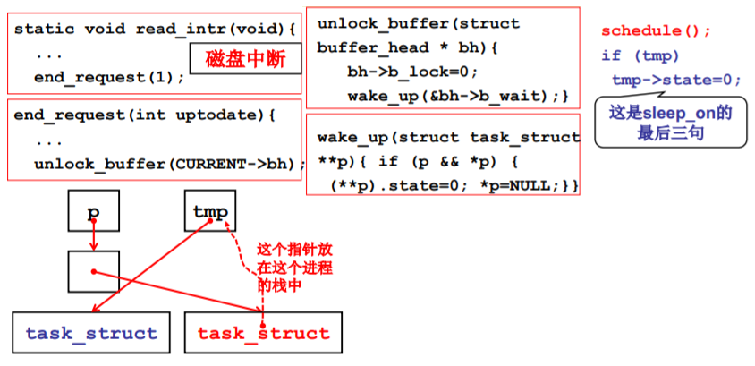

4. 当磁盘工作完成后就会产生硬盘中断信号，然后CPU就会去执行硬盘中断程序read_intr，该函数调用了end_request函数，end_request函数调用了unlock_buffer函数来解锁缓冲区并唤醒等待队列中的进程。
5. unlock_buffer函数调用了wake_up函数来唤醒进程，这个函数仅仅将队列中的队首进程的状态置为了就绪态，然后将队列的队首置为空，也就是说此时队列中已经不存在任何等待的进程了，这是怎么完成的呢？为什么两句代码就可以唤醒所有的进程呢？（解答看不可以思议的队列）
   - 这里没有调用sechdule函数来进行调度，这是因为此时的唤醒是由中断产生的，当前还进行着一个进程，不可以直接中断该进程，这样太自私了，想要真正唤醒只能等待当前进程被时钟中断。

##### 不可以思议的队列

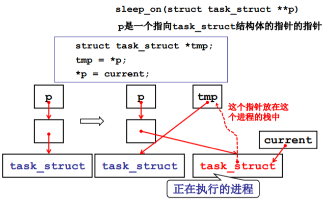

缓冲区的等待队列不是一个简单的数组，它是一个**类似链表的数据结构**。

在sleep_on函数中，创建了一个变量叫tmp，这个变量会被压入当前进程的内核栈中，也就是说每个调用了sleep_on函数的进程的内核栈中都会有一个叫tmp的变量。

传入sleep_on函数的参数 p 是指向当前缓冲区等待队列队首进程PCB（\*\*p）的指针（*p）的指针，随后sleep_on函数执行了两句代码：

```c
tmp = *p;
*p = current;
```

这两句代码使得tmp指向了当前队列的队首进程，而*p指向了当前的进程，这使得当前进程变成了队列的队首，由于tmp存在于内核栈，这就意味着当前进程可以通过内核栈中的tmp变量找到以前的队首进程。

可以联想到，每个执行了sleep_on函数的进程都会变成队列的队首进程，而且由其内核栈中的tmp变量可以找到上一个队首进程，于是每个调用了sleep_on函数的进程，也就是进入睡眠的进程，都会**被tmp这个变量串在一起，形成一个类似链表的结构**。

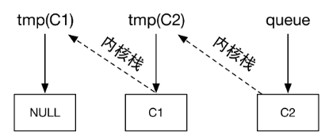

再来看看wake_up函数，这个函数仅仅是将等待队列的队首进程唤醒了。假设此时通过调度切换到了这个队首进程，那么这个进程就会从上一次执行的地方继续往下执行，看看源码，接下去执行的代码是：

```c
if (tmp)
	tmp->state=0;
```

这段代码就是将当前进程内核栈中的tmp变量指向的进程唤醒，而每个被唤醒的进程都是会执行这段代码，这就意味着所有的等待进程都会被一个接着一个的被唤醒（**链式唤醒**）。这不就把所有进程唤醒了嘛。

> 这里举的磁盘读例子是通过while来判断是否阻塞的，这和用户态使用信号量的例子不一样。这里将所有进程都唤醒了，此时就由schedule调度来决定谁先执行，即让优先级高的先执行，优先级高的先执行了，其它进程就无法再执行，所以这里就必须使用while来重新判断，不然所有被唤醒的进程都可以同时访问buffer了。
>
> 在调用sleep_on函数前，对进程进行了关中断，然后调用sleep_on函数切换到了另一个进程，这个进程不会受到关中断的影响，因为此时的标志寄存器已经切换到当前进程保存的eflags了。

##### 读磁盘块的部分源代码

```c
struct buffer_head * bread(int dev,int block)
{
	struct buffer_head * bh;
	......
	ll_rw_block(READ,bh);
	wait_on_buffer(bh);
	if (bh->b_uptodate)
		return bh;
	brelse(bh);
	return NULL;
}

void ll_rw_block(int rw, struct buffer_head * bh)
{
	unsigned int major;
    
	if ((major=MAJOR(bh->b_dev)) >= NR_BLK_DEV ||
	!(blk_dev[major].request_fn)) {
		printk("Trying to read nonexistent block-device\n\r");
		return;
	}
    
	make_request(major,rw,bh);
}

static void make_request(int major,int rw, struct buffer_head * bh)
{
	......
	lock_buffer(bh); // 给缓冲区加锁
	......
	add_request(major+blk_dev,req); // 添加请求
}

static inline void lock_buffer(struct buffer_head * bh)
{
	cli();
	while (bh->b_lock)
		sleep_on(&bh->b_wait);
	bh->b_lock=1;
	sti();
}

static inline void wait_on_buffer(struct buffer_head * bh)
{
	cli();
	while (bh->b_lock)
		sleep_on(&bh->b_wait);
	sti();
}

void sleep_on(struct task_struct **p)
{
    struct task_struct *tmp;
	......
    tmp = *p;
    *p = current;
    current->state = TASK_UNINTERRUPTIBLE;
    schedule();
    if (tmp)
        tmp->state=0;
}
```

##### 唤醒队列的部分源码

```c
// 当请求的硬盘操作完成或出错就会发出中断信号，进而执行该硬盘中断处理程序。
static void read_intr(void)
{
	......
    // 执行到此，说明本次请求项的全部扇区数据已经读完，则调用end_request()函数去处理请求项结束事宜。
    // 最后再次调用 do_hd_request()，去处理其他硬盘请求项。
	end_request(1); // 数据已更新标志置位（1）。
	do_hd_request();
}

extern inline void end_request(int uptodate)
{
	DEVICE_OFF(CURRENT->dev); // 关闭设备。
	if (CURRENT->bh) { // CURRENT 为当前请求结构项指针。
		CURRENT->bh->b_uptodate = uptodate; // 置更新标志。
		unlock_buffer(CURRENT->bh); // 解锁缓冲区。
	}
	......
	wake_up(&CURRENT->waiting); // 唤醒等待该请求项的进程。
	wake_up(&wait_for_request); // 唤醒等待空闲请求项的进程。
	CURRENT->dev = -1; // 释放该请求项。
	CURRENT = CURRENT->next; // 指向下一请求项。
}

static inline void unlock_buffer(struct buffer_head * bh)
{
	if (!bh->b_lock)
		printk("ll_rw_block.c: buffer not locked\n\r");
	bh->b_lock = 0;
	wake_up(&bh->b_wait);
}

void wake_up(struct task_struct **p)
{
    if (p && *p) {
        (**p).state=0;
        *p=NULL;
    }
}
```

#### 简单的总结

用户态实现信号量的例子使用 if 来判断信号量状态，这就意味着信号量必须表达更丰富的信息，可以指出有多少个进程在阻塞或可以有多少个进程继续执行而不必等待，而且一次只能唤醒指定的一个进程，没有考虑各个进程的优先级。

而内核态实现信号量的例子使用 while 来判断信号量状态，这使得信号量只需要两种取值状态就可以了，通过一次唤醒全部，由所有的进程竞争进入权，充分考虑了各个进程的优先级。

## 死锁处理

### 什么是死锁


1. 在生产者-消费者模型的例子中，如果将生产者和消费者对信号量的申请反过来（如图所示），此时生产者开始执行，先申请mutex，使得mutex被锁上，然后继续申请empty，假如此时empty=0，则此时资源为空，生产者只能阻塞等待；接着消费者开始执行，也先申请mutex，但此时mutex被锁住了，所以消费者也只能阻塞等待。
2. 此时就造成了一种局面：生产者需要消费者归还empty资源，而消费者需要生产者释放mutex锁，而mutex这个锁又要求生产者继续执行下去。这就像各个进程互相咬住对方，但谁也不想松口，使得谁也别想前进，形成了一种环路。而从某个进程单独来看，这就是我自己咬着自己的尾巴不放。
3. 这种情况就叫死锁，即多个进程互相等待对方持有的资源而造成谁都无法执行。
4. 这种情况持续下去就会造成后续的进程也锁死，使得锁越来越多，最后导致进程无法执行，CPU就不工作了，计算机看起来就变慢了。

> 可以将信号量看成是一种资源，而把对信号量的修改和判断看成是申请资源，比如P(empty)是对空闲资源的申请，每申请一次，资源就减少一个，即信号量减1；V(empty)是归还资源，每归还一次，资源就增加一个，即信号量加1。

### 死锁的成因

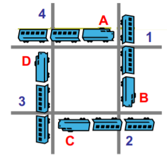

1. 资源互斥使用，一旦占有别人无法使用；

2. 进程占有了一 些资源，又不释放，再去申请其他资源；

   

3. 各自占有的资源和互相申请的资源形成了环路等待。

### 造成死锁的4个必要条件

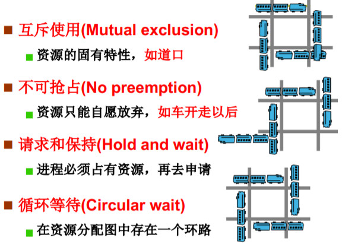

### 死锁的处理方法


1. 死锁预防

   - 在进程执行前，一次性申请所有需要的资源，使得不会出现不会占有资源再去申请其它资源的情况。

     - 缺点1：需要预知未来，编程困难 
- 缺点2：许多资源分配后很长时间后才使用，资源利用率低；
  
- 对资源类型进行排序，资源申请必须按序进行，使得不会不会出现环路等待的情况。
  
  - 缺点：仍然造成资源浪费，比如使用10号资源必须先申请1~9号资源，即使这9个资源都不用。
  
2. 死锁避免（银行家算法）

   在进程申请资源前判断这次申请会不会造成死锁，这个判断方法就是银行家算法。具体说法就是当一个进程申请使用资源的时候，银行家算法通过先试探分配给该进程资源，然后通过安全性算法判断分配后的系统是否处于安全状态，若不安全则试探分配作废，让该进程继续等待。 

   - 什么是安全状态：如果系统中的所有进程存在一个可完成的执行序列（各个进程的执行顺序），则称系统处于安全状态 。

   - 四个数据结构：

     - 可利用资源向量Available：这是一个含有m个元素的数组，其中的每一个元素代表一类可利用的资源数目，其初始值是系统中所配置的该类全部可用资源的数目，其数值随该类资源的分配和回收而动态地改变。如果Available[j]=K，则表示系统中现有Rj类资源K个。
     - 最大需求矩阵Max：这是一个n×m的矩阵，它定义了系统中n个进程中的每一个进程对m类资源的最大需求。如果Max[i,j]=K，则表示进程i需要Rj类资源的最大数目为K。
     - 分配矩阵Allocation：这也是一个n×m的矩阵，它定义了系统中每一类资源当前已分配给每一进程的资源数。如果Allocation[i,j]=K，则表示进程i当前已分得R j类资源的数目为K。
     - 需求矩阵Need：这也是一个n×m的矩阵，用以表示每一个进程尚需的各类资源数。如果Need[i,j]=K，则表示进程i还需要R j类资源K个，方能完成其任务。 

   - 算法简述过程：

     - 假设进程P1申请资源，银行家算法先试探地分配给它（当然先要看看当前资源池中的资源数量够不够），若申请的资源数量小于或等于Available，然后接着判断分配给P1后剩余的资源能不能使进程队列的某个进程执行完毕，若没有进程可执行完毕，则系统处于不安全状态（即此时没有一个进程能够完成并释放资源，随时间推移，系统终将处于死锁状态）。
   - 若有进程可执行完毕，则回收已分配给它的资源（剩余资源数量增加），把这个进程标记为可完成，并继续判断队列中的其它进程，若所有进程都可执行完毕，则系统处于安全状态，并根据可完成进程的分配顺序生成安全序列，比如{P0，P3，P2，P1}。
     
   - {P0，P3，P2，P1} 表示将申请后的剩余资源Work先分配给P0 –> 回收（Work+已分配给P0的A0=Work）–> 分配给P3 –> 回收（Work+A3=Work）–> 分配给P2 –>...... 直到满足所有进程。
     
   - 算法完整过程：

     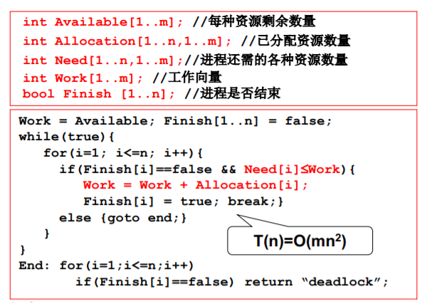

     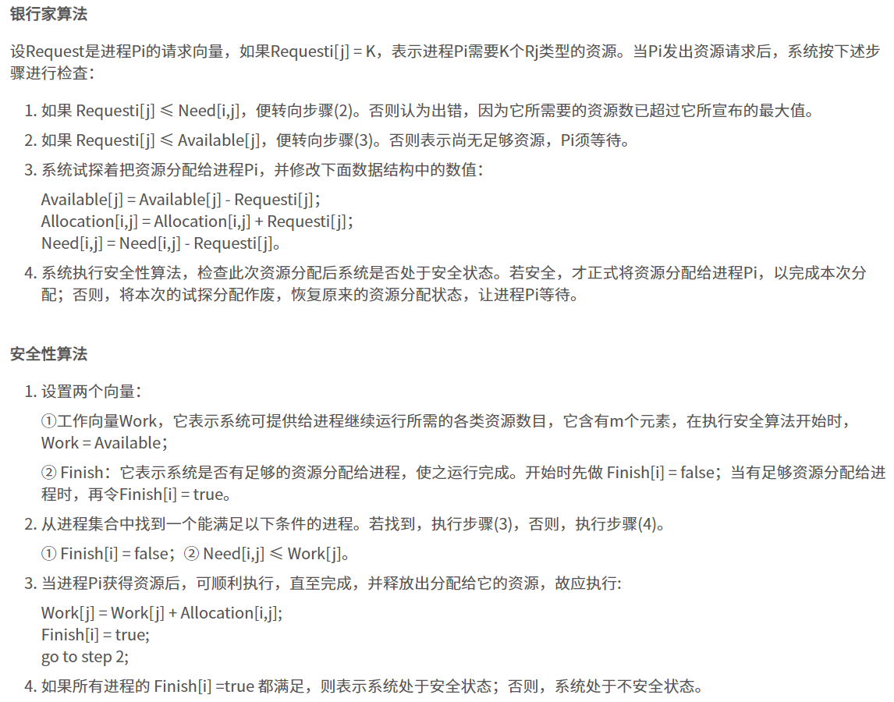

   - 举例说明：

     > 安全性算法是在给定的一个资源状态下寻找进程间的安全执行序列。
     >
     > 银行家算法就是在安全性算法之前多了一个试探分配的过程，即在试探分配的基础上通过安全性算法找出其中的安全执行序列。
     
     - 这是安全性算法：
     
     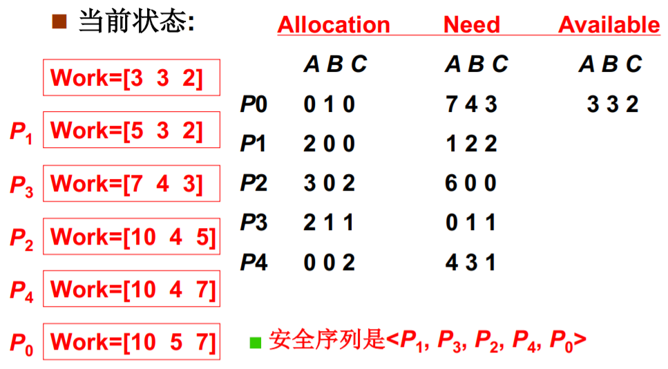
     
     - 这是银行家算法：
     
     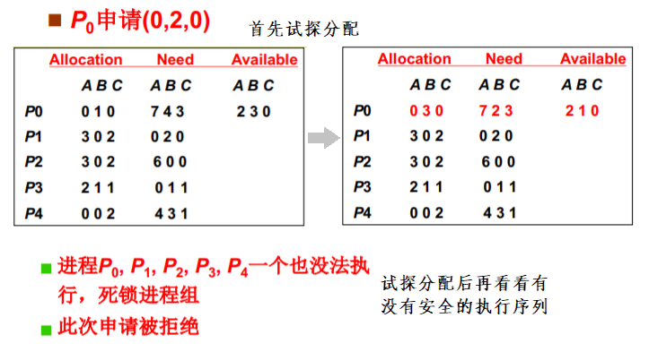

3. 死锁检查+恢复

   不是每次进程申请资源前都进行银行家算法，而是等到发现问题（计算机变慢了、CPU利用率低了或定时检测）后才执行银行家算法，看一看是不是死锁了，然后找出死锁进程组，最后选择某个或某些进程进行回滚。
   
   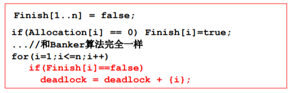
   
   但回滚比较麻烦，需要解决以下问题：
   
   - 选择哪些进程回滚？优先级？占用资源多的？ 
   - 如何实现回滚？那些已经修改的文件怎么办？

4. 死锁忽略

   许多通用操作系统，如PC机上安装的 Windows和Linux，都采用死锁忽略方法，有以下原因：

   - 死锁忽略的处理代价最小；
   - 这种机器上出现死锁的概率比其他机器低；
   - 死锁可以用重启来解决，PC重启造成的影响小；
   - 死锁预防、死锁避免、死锁检查+恢复这三个方法的代价比较高。
     - 死锁预防：会造成资源浪费
     - 死锁避免：每次申请都执行银行家算法O(mn2)，效率太低
     - 死锁检测+恢复：恢复很不容易

