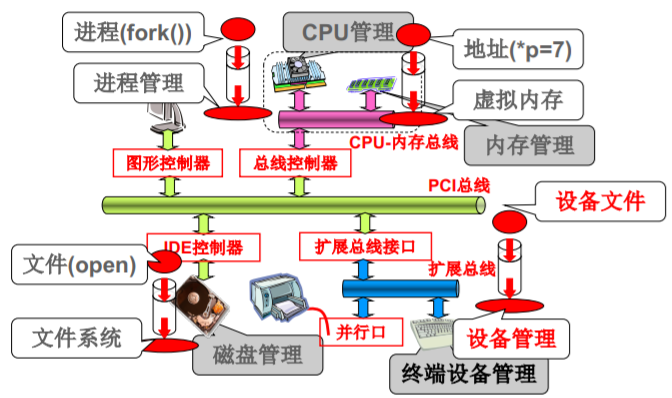

# IO管理

## 显示器管理

### 如何让外设工作起来

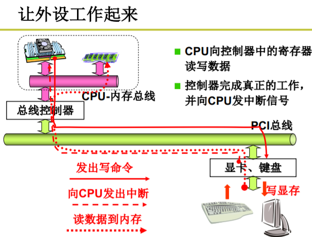

1. CPU向外设控制器（显卡、网卡等）中的某个寄存器（端口）发送命令（out指令等），外设控制器就会根据该寄存器中的命令操控外设进行相应的操作。
2. 由于外设控制器也相当于一个独立的处理器，与CPU的工作互不干扰，因此外设控制器可以控制外设进行工作，CPU也可以同时切换到别的进程去干其它的事，两者相互平行，可以同时工作。
3. 当外设工作完成，外设控制器就会向CPU发送中断请求，让CPU处理外设的工作结果。

### 外设驱动的三件事

1. 形成统一的文件视图，以方便用户使用
2. 向外设控制器发出out指令
3. 形成中断处理

### 什么是文件视图

由于向设备控制器的寄存器发指令需要查寄存器地址、内容的格式和语义等，对于用户来说非常麻烦，所以操作系统要给用户提供一个简单方法，即文件视图。文件视图就是将out指令执行前后要做的所有事情进行了层层抽象和封装，使得用户可以不用那么麻烦。

文件视图就是将所有设备都看成文件，对设备的操作都统一成对文件的操作，并提供统一的调用接口open()、read()、write()、close()。有了文件视图，对任何外设的操作都变成了open()、read()、write()、close()这四个接口的组合。

比如图中所示一段程序，如果要向一个外设写入内容，就必须要知道这个设备的控制器地址和内容格式等信息，这些信息就保存在了设备文件上，因此在进行写操作write前，就需要先打开open设备文件，获取设备的对应信息。

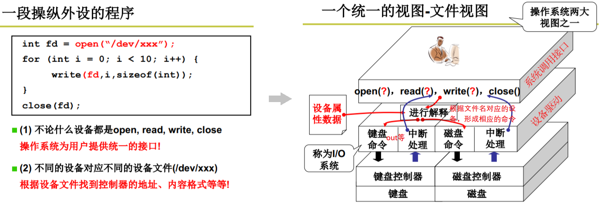

### 如何驱动显示器工作

这个故事要从printf库函数开始，即printf("Host Name: %s", name)。这个函数首先将参数中的字符串进行格式化，然后存放到buf缓冲区中，接着调用了write这个文件接口，即write(1,buf,...)。这个接口的表面含义就是将buf缓存中的东西输出到文件句柄值为 1 对应的设备中去，其底层其实就是调用了中断处理函数sys_write，其前面执行了两句代码如下：

```c
int sys_write(unsigned int fd,char * buf,int count)
{
	struct file * file;
	struct m_inode * inode;
	......
	file=current->filp[fd];
	inode=file->f_inode;
	......
}
```

fd是文件句柄，也就是文件索引。file=current->filp[fd]; 这句代码就是从当前进程所有打开的文件堆filp中取出索引为fd的文件，然后取出该文件的信息f_inode赋给inode，有了文件的信息（控制器地址和内容格式等）才能进行后续IO指令的发送。

---

**读取出来的file是什么文件**

file这个文件是直接从PCB中取出来的，我们还不知道该文件从哪个地方被打开的，也不知道该文件是什么，所以我们往回探究：filp存放在当前进程的PCB中，而当前进程的PCB是从父进程拷贝而来的，所以从copy_process函数看起：

```c
int copy_process(...){
	......
    // 将父进程拷贝到子进程的PCB中，包括父进程的filp
	*p = *current;
	// 因为新创建的子进程与父进程共享打开着的文件，所以父进程若有打开着的文件，则需将对应文件的打开次数增1
	for (i=0; i<NR_OPEN;i++)
		if (f=p->filp[i])
			f->f_count++;
	......

}
```

> 从这里我们可以知道，所有进程的PCB都保存了该进程在执行过程中打开的所有文件。

可见，filp就是子进程从父进程那里拷贝过来的，那我们再看看父进程是如何创建filp的（或者说父进程打开了哪些文件），父进程在初始化时创建，此时执行了如下代码：

```c
void main(void){
    ......
    if(!fork()){
        init(); // 创建第一个进程，即上述的父进程
    }
}

void init(void){
	int pid,i;
	......
	 // 下面以读写访问方式打开设备文件“/dev/tty0”，它对应终端控制台。由于这是第一次打开文件操作，因此产生的文件句柄号（文件描述符）肯定是0。
	 // 这里再把它以读写方式打开，复制产生标准输出句柄stdout(1)和标准出错输出句柄stderr(2)。
	 // 函数前面的“(void)”前缀用于强制函数无需返回值。
	(void) open("/dev/tty0",O_RDWR,0);
	(void) dup(0); // 复制句柄，产生句柄1号--标准输出设备
	(void) dup(0); // 复制句柄，产生句柄2号--标准出错输出设备
	......
	execve("/bin/sh",argv_rc,envp_rc); // 切换到shell程序执行
    ......
}
```

因此，在父进程初始化时用open接口打开了三次tty0设备文件，该设备文件对应终端控制台。我们再看看open接口干了什么，open接口的底层调用了sys_open函数，如下所示：

```c
int sys_open(const char * filename,int flag,int mode){
	struct m_inode * inode;
	struct file * f;
	int i,fd;
	......
	// 为了给打开文件建立一个文件句柄，需要搜索进程结构中文件结构指针数组，以查找一个空闲项。空闲项的索引号fd即是句柄值。若已经没有空闲项，则返回出错码。
	for(fd=0 ; fd<NR_OPEN ; fd++)
		if (!current->filp[fd]) // 找到空闲项。
			break;
		if (fd>=NR_OPEN)
			return -EINVAL;
    
	// 设置当前进程在执行时需要关闭的文件句柄（close_on_exec）
	current->close_on_exec &= ~(1<<fd);
    
    // 然后为打开文件在文件表中寻找一个空闲结构项（引用计数为0的项），用来存放文件信息。
	f=file_table;
	for (i=0 ; i<NR_FILE ; i++,f++)
		if (!f->f_count) break;
	if (i>=NR_FILE)
		return -EINVAL;
    
	// 此时我们让进程对应文件句柄 fd 的文件结构指针指向搜索到的文件结构，并令文件引用计数自增 1，然后调用函数 open_namei() 执行打开操作。若返回值小于 0，则说明出错，于是释放刚申请到的文件结构，返回出错码 i。若文件打开操作成功，则 inode 是已打开文件的 i 节点指针。
	(current->filp[fd]=f)->f_count++;
	if ((i=open_namei(filename,flag,mode,&inode))<0) {
		current->filp[fd]=NULL;
		f->f_count=0;
		return i;
	}
    
	// 做一些检查
	......
	// 现在我们初始化打开文件的文件结构。
	f->f_mode = inode->i_mode;
	f->f_flags = flag;
	f->f_count = 1;
	f->f_inode = inode;
	f->f_pos = 0;
    // 最后返回文件句柄号。
	return (fd);
}
```

总结一下sys_open函数的关键点就是：通过open_namei函数将对应文件的信息读取到inode中，然后保存到当前进程的PCB中，以形成下图所示的这个链关系。

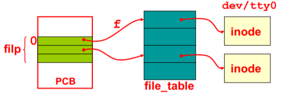

到此就可以解释前面的问题：子进程的filp[fd]取出的file文件就是终端控制台对应的设备文件，而提取出来的信息f_inode就是该设备文件的信息（主要就是该设备在哪个端口）。

---

现在我们已经获取到了终端控制台对应的设备文件的信息，接下来我们再看看sys_write函数还干了哪些事情：

```c
int sys_write(unsigned int fd,char * buf,int count){
	......
	// 取文件的i节点，并根据该i节点的属性分别调用相应的写操作函数。
	// 若是管道文件，并且是写管道文件模式，则进行写管道操作，若成功则返回写入的字节数，否则返回出错码退出；
	// 如果是字符设备文件，则进行写字符设备操作，返回写入的字符数并退出；
	// 如果是块设备文件，则进行块设备写操作，并返回写入的字节数并退出；
	// 若是常规文件，则执行文件写操作，并返回写入的字节数并退出。
	inode=file->f_inode;
	if (inode->i_pipe)
		return (file->f_mode&2)?write_pipe(inode,buf,count):-EIO;
	if (S_ISCHR(inode->i_mode))
		return rw_char(WRITE,inode->i_zone[0],buf,count,&file->f_pos);
	if (S_ISBLK(inode->i_mode))
		return block_write(inode->i_zone[0],&file->f_pos,buf,count);
	if (S_ISREG(inode->i_mode))
		return file_write(inode,file,buf,count);
	// 若执行到这里，说明我们无法判断文件的属性。则打印节点文件属性，并返回出错码退出。
	printk("(Write)inode->i_mode=%06o\n\r",inode->i_mode);
	return -EINVAL;
}
```

接下来sys_write函数根据inode的信息选择相应类型的写操作。由于是打印输出字符，所以这里应该是进行写字符设备操作。其中S_ISCHR(inode->i_mode)用于判断此次写操作是否为写字符设备操作，结果为是，所以接着执行 rw_char(WRITE,inode->i_zone[0],buf,count,&file->f_pos)，在传入参数中，WRITE指出此次操作是写操作，inode->i_zone[0]指出了此次操作的设备号，buf是要写入的缓存数据。下图列出了tty0这个设备文件对应的信息（即inode里面的信息）：

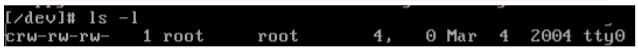

可见这个设备就是字符读写设备，设备号为4，从设备号为0。我们再看看rw_char函数做了什么：

```c
int rw_char(int rw,int dev, char * buf, int count, off_t * pos){
	crw_ptr call_addr;

 	// 如果设备号超出系统设备数，则返回出错码。如果该设备没有对应的读/写函数，也返回出错码。否则调用对应设备的读写操作函数，并返回实际读/写的字节数。
	if (MAJOR(dev)>=NRDEVS)
		return -ENODEV;
	if (!(call_addr=crw_table[MAJOR(dev)]))
		return -ENODEV;
	return call_addr(rw,MINOR(dev),buf,count,pos);
}
```

这个函数主要就是根据设备号从crw_table中取出该设备的读写处理函数，然后调用该处理函数。从下图的crw_table结构中，我们可以知道此次取出的读写处理函数为rw_ttyx。

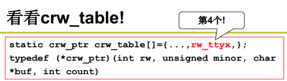

于是开始执行rw_ttyx函数，这个函数只是做了一下判断，如果是读则调用tty_read，如果是写则调用tty_write，所以此处是写，执行的是tty_write。

> 终端设备指的就是键盘和显示器，键盘对应的是读，执行的是tty_read；显示器对应的是写，执行的是tty_write。

```c
static int rw_ttyx(int rw,unsigned minor,char * buf,int count,off_t * pos)
{
	return ((rw==READ)?tty_read(minor,buf,count):
			tty_write(minor,buf,count));
}
```

下面继续看一下tty_write函数做了什么：

```c
int tty_write(unsigned channel, char * buf, int nr)
{
	static cr_flag=0;
	struct tty_struct * tty;
	char c, *b=buf;

	// 首先判断参数有效性并取终端的tty结构指针。
	if (channel > 255)
		return -EIO;
	tty = TTY_TABLE(channel);
	......
        
	// 现在我们开始从用户缓冲区buf中循环取出字符并放到写队列缓冲区中。当欲写字节数大于0，则执行以下循环操作。
	while (nr>0) {
         // 在循环过程中，如果此时tty写队列已满，则当前进程进入可中断的睡眠状态。
		sleep_if_full(tty->write_q);
		// 如果当前进程有信号要处理，则退出循环体。
		if (current->signal & ~current->blocked)
			break;
		// 当要写的字符数nr还大于0并且 tty 写队列缓冲区不满，则循环执行以下操作。
		while (nr>0 && !FULL(tty->write_q)) {
			// 从用户缓冲区中取出一个字符。
			c=get_fs_byte(b);
             // 对字符做一些预处理。
			......
			// 接着把用户数据缓冲指针b前移1字节；欲写字节数减1字节；复位cr_flag标志，并将该字节放入tty写队列中。
			b++; nr--;
			cr_flag = 0;
			PUTCH(c,tty->write_q);
		}
		// 若要求的字符全部写完，或者写队列已满，则程序退出循环。此时会调用对应tty写函数，把写队列缓冲区中的字符显示在控制台屏幕上，或者通过串行端口发送出去。如果当前处理的 tty 是控制台终端，那么tty->write()调用的是con_write()；如果tty是串行终端，则tty->write()调用的是rs_write()函数。
        tty->write(tty);
		// 若还有字节要写，则我们需要等待写队列中字符被取走。所以这里调用调度程序，先去执行其他任务。
		if (nr>0) schedule();
	}
	return (b-buf); // 最后返回写入的字节数。
}
```

channel是从设备号，buf是指向缓冲区的指针，nr是写字符数。首先根据从设备号从TTY_TABLE取出相应从设备（控制台设备）的tty结构体，然后进行循环，不断从缓存中取出字符放入到写队列中（即先把内存缓冲区的内容写入到设备的缓冲区中，设备的这个缓冲区就相当于生产者消费者模型中的共享缓冲区，这里的函数就是生产者），然后调用tty->write(tty);将队列中的字符显示到显示屏上。tty是一个结构体，其结构如下：

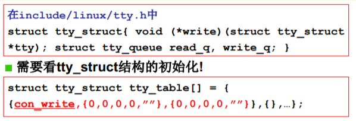

因为此处的tty是控制台设备的结构体，所以它调用write，最后找到的是con_write函数，于是接着就执行con_write函数（消费者）：

```c
void con_write(struct tty_struct * tty)
{
	int nr;
	char c;
	int currcons;

 	// 该函数首先根据当前控制台使用的tty在tty表中的项位置取得对应的控制台号currcons，然后计算出目前tty写队列中含有的字符数nr，并循环取出其中的每个字符进行处理。
	currcons = tty - tty_table;
	if ((currcons>=MAX_CONSOLES) || (currcons<0))
		panic("con_write: illegal tty");

	nr = CHARS(tty->write_q); // 取写队列中字符数。
	while (nr--) {
		if (tty->stopped)
			break;
		GETCH(tty->write_q,c); // 取1字符到c中。
         // 根据字符类型对字符采取不同的措施。
		...... // 举个例子：如果是普通显示字符，则执行以下方法输出显示。
            if (c>31 && c<127) {
				......
				__asm__("movb %2,%%ah\n\t" // 写字符。
						"movw %%ax,%1\n\t"
						::"a" (translate[c-32]),
						"m" (*(short *)pos),
						"m" (attr)
						:"ax");
				pos += 2;
				x++;
			}
	......
	}
	set_cursor(currcons); // 最后根据上面设置的光标位置，设置显示控制器中光标位置。
}
```

con_write函数就是不断从缓冲队列中取出字符，然后根据字符的类型执行不同的处理代码，这里假设字符是普通的显示字符，所以执行了一段汇编指令，这段汇编指令就是外设驱动的三件事中"向外设控制器发出out指令"这件事，解释一下这段汇编：① 将显示属性赋给ah；② 将字符赋给al；③ 将ax寄存器的值发送给显卡的显存中（pos就是显存地址。因为与内存一起统一编址，所以使用mov指令，而不是out指令）；④ 显卡根据显存的内容控制显示器显示。

> 下图中的90000和90001是系统启动执行setup文件时获取的光标位置参数，然后在系统初始化时据此来获得显存的位置并设置给pos。

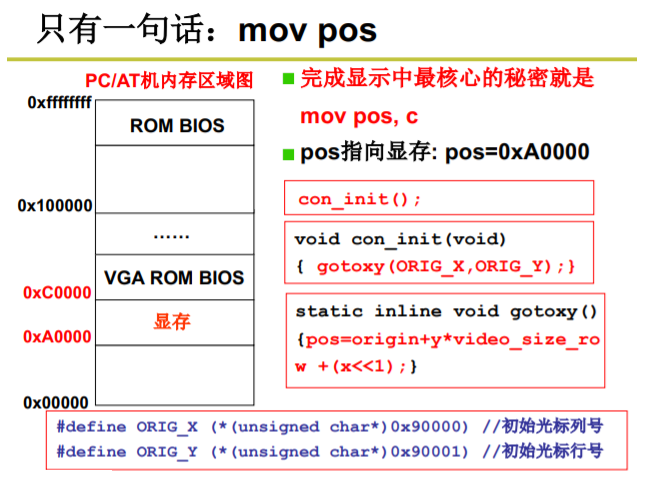

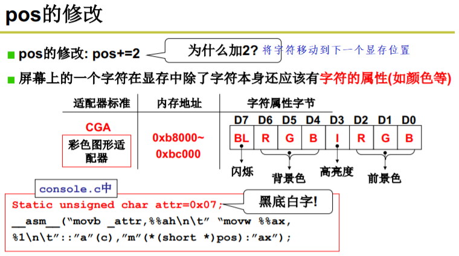

至此驱动显示器的工作就完成了。

### 一个小总结

- 驱动显示器的工作可总结为以下步骤：

  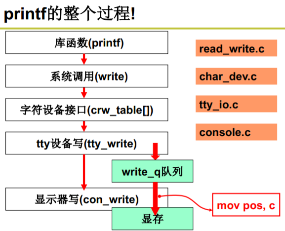

  1. 取出设备信息；

  2. 根据设备信息调用相应的处理函数；

     - rw_char：根据设备号选择处理函数rw_ttyx
     - rw_ttyx：根据读写类型选择写函数tty_write

     - tty_write：将字符写入缓冲队列，并调用con_write函数
     - con_write：从缓冲队列取出字符发送给显存（out指令）

     （这里用到了缓冲优化技术）

  3. 显卡根据显存内容控制显示器显示字符。

  将这些步骤封装在一起就构成了文件视图。

- 如何写设备驱动？

  一句话概述：根据设备信息注册处理函数。

  三句话概述：写出核心out指令，然后将相应的函数注册到应有的表上，最后创建与表对应的dev文件。

## 键盘管理

终端设备包括显示屏和键盘，显示屏负责输出，键盘负责输入。这节就讲操作系统如何驱动键盘工作。

 键盘的驱动过程和显示器的驱动过程相反，显示器是由CPU向显卡发出out指令，让显卡根据指令信息控制显示器工作，而键盘是用户敲下键盘后由键盘的控制器向CPU发送中断请求，让CPU处理键盘的输入信息。所以键盘的驱动主要是对应了外设驱动三件事中的"中断处理"这一件事。

### 如何驱动键盘工作

键盘驱动的故事由用户敲下键盘后产生中断开始，因此首先要看键盘中断产生的中断处理程序是哪一个，这个要从系统初始化部分看起：

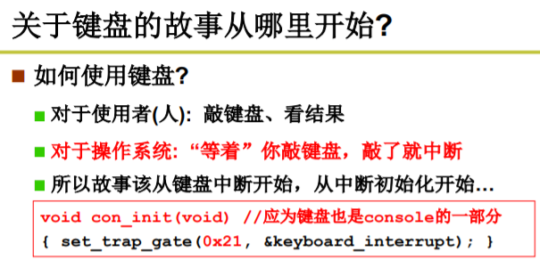

可见，键盘中断是21号中断，处理程序为keyboard_interrupt。所以当键盘中断发生后就会调用keyboard_interrupt程序，让我们看看这个程序主要做了哪些事：

```asm
# 当键盘控制器接收到用户的一个按键操作时，就会向中断控制器发出一个键盘中断请求信号IRQ1。当CPU响应该请求时就会执行键盘中断处理程序。
# 这段代码就是键盘中断处理程序入口点。该中断处理程序先从键盘控制器端口（0x60）读入按键扫描码，并调用对应的扫描码子程序进行处理。
_keyboard_interrupt:
	......# 保护现场及一些预处理
	inb $0x60,%al # 从0x60端口读取扫描码到al。
	...... # 对一些特殊的扫描码做特殊处理。
	call key_table(,%eax,4) # 调用键处理程序key_table+eax*4。
	...... # 复位处理并向键盘控制器发出中断结束信号EOI。
	pushl $0 # 控制台tty号=0，作为参数入栈。
	call _do_tty_interrupt # 将收到数据转换成规范模式并存放在规范字符缓冲队列中。
	...... # 做一些中断返回前的处理并返回。
```

> 由于键盘和内存独立编址，所以这里采用in和out指令来从键盘控制器读写数据。

使用inb指令从0x60端口读取扫描码，然后根据扫描码值从key_table找到相应的处理函数进行处理。key_table如下所示，一般的显示字符都是调用do_self函数，而其它字符就需要调用其它函数，比如按下f10调用func函数。

```asm
key_table:
	.long none,do_self,do_self,do_self /* 00-03 s0 esc 1 2 */
	.long do_self,do_self,do_self,do_self /* 04-07 3 4 5 6 */
	.long do_self,do_self,do_self,do_self /* 08-0B 7 8 9 0 */
	......
	.long func,num,scroll,cursor /* 44-47 f10 num scr home */
	......
```

假设这里是显示字符，于是调用do_self函数，do_self函数如下所示：

```asm
do_self:
	lea alt_map,%ebx # 选用alt_map映射表。
	testb $0x20,mode # 右alt键同时按下了?
	jne 1f # 是则跳转到标号1处，根据alt_map映射表去映射字符。
	lea shift_map,%ebx # 否则选用shift_map映射表。
	testb $0x03,mode # shift键同时按下了吗?
	jne 1f # 是则跳转到标号1处，根据shift_map映射表去映射字符。
	lea key_map,%ebx # 否则选用普通映射表key_map。
	
# 现在已选择好使用的映射表。接下来根据扫描码来取得映射表中对应的ASCII字符，若没有对应字符，则跳转none处返回。
1:  movb (%ebx,%eax),%al # 将扫描码作为索引值，取对应的ASCII码并赋给al。
	orb %al,%al # 检测是否有对应的ASCII码（不为0）。
	je none # 若没有对应的ASCII码，则返回。
	
# 若此时shift键也已同时按下或caps键锁定，并且字符在 'a'--'}'[0x61--0x7D]范围内，则将其减去0x20(32)，从而转换成相应的大写字符等[0x41--0x5D]。
	testb $0x4c,mode # shift键已按下或caps亮?
	je 2f # 没有则跳转标号2处。
	cmpb $'a,%al # 将al中的字符与'a'比较。
	jb 2f # 若al值<'a'，则跳转标号2处。
	cmpb $'},%al #将 al中的字符与'}'比较。
	ja 2f # 若al值>'}'，则跳转标号2处。
	subb $32,%al # 将al转换为大写字符等（减0x20）。
	
# 若ctrl键已按下，并且字符在 '@'--'_' [0x40--0x5F] 范围内，则将其减去0x40从而转换成值控制字符[0x00--0x1F]。例如，按下 ctrl+'M'会产生回车字符（0x0D，即13）。
2:  testb $0x0c,mode # ctrl键同时按下了吗?
	je 3f # 若没有则跳转标号3处。
	cmpb $64,%al # 将al与'A'前的'@'（64）比较，即判断字符所属范围。
	jb 3f # 若值<'@'，则跳转标号3处。
	cmpb $64+32,%al # 将al与'_'后的'`'（96）比较，即判断字符所属范围。
	jae 3f # 若值>='`'，则跳转标号3处。
	subb $64,%al # 否则减 0x40，转换为0x00--0x1f范围的控制字符。
	
# 若左alt键同时按下，则将字符的位7置位。即此时可生成值大于0x7f的扩展字符集中的字符。
3:  testb $0x10,mode # 左 alt 键同时按下?
	je 4f # 没有则转标号4处。
	orb $0x80,%al # 将字符的位7置位。
	
# 将al中字符的ASCII码放入读缓冲队列中。
4:  andl $0xff,%eax # 清eax的高字节ah。
	xorl %ebx,%ebx # 由于放入队列字符数<=4，因此需把ebx清零。
	call put_queue # 将字符放入缓冲队列中。
none:ret
```

所以do_self函数的主要作用就是从ASCII码映射表中获取扫描码对应的ASCII码，然后调用put_queue函数将ASCII码放入读缓冲队列中。ASCII码映射表如下所示：

```asm
# elif defined(KBD_US)
# 以下是美式键盘的扫描码映射表：
key_map:
	.byte 0,27
	.ascii "1234567890-="
	......
shift_map:
	.byte 0,27
	.ascii "!@#$%^&*()_+"
	......
alt_map:
	.byte 0,0
	.ascii "\0@\0$\0\0{[]}\\\0"
	......
```

此时我们已经拿到所按下键的ASCII码并调用put_queue函数，我们看看put_queue函数是如何将ASCII码放入读缓冲队列中的：

```asm
# 下面该子程序把ebx:eax中的最多8个字符添入缓冲队列中。写入字符的顺序是 al,ah,eal,eah,bl,bh...直到eax等于0。
# 首先从缓冲队列地址表table_list取控制台的读缓冲队列read_q地址。
# 然后把al寄存器中的字符复制到读队列头指针处并把头指针前移1字节位置。
# 若头指针移读缓冲区的末端，就让其回绕到缓冲区开始处。
# 然后再看看此时缓冲队列是否已满，如果已满，就把ebx:eax中可能还有的其余字符全部抛弃掉。
# 如果缓冲区还未满，就把ebx:eax中数据联合右移8个比特（即把ah->al、bl->ah、bh->bl），然后重复上面对al的处理过程。
# 直到所有字符都处理完后，就保存当前头指针值，再检查一下是否有进程等待着读队列，如果有就唤醒之。
put_queue:
	pushl %ecx
	pushl %edx
	movl _table_list,%edx # 取控制台tty结构中读缓冲队列指针。
	movl head(%edx),%ecx # 取队列头指针并赋给ecx。
1:  movb %al,buf(%edx,%ecx) # 将al中的字符放入头指针位置处。
	incl %ecx # 头指针前移1字节。
	andl $size-1,%ecx # 调整头指针，若超出缓冲区末端则绕回开始处。
	cmpl tail(%edx),%ecx # 头指针==尾指针吗?（即缓冲队列满了吗?）
	je 3f # 如果已满，则后面未放入的字符全抛弃。
	shrdl $8,%ebx,%eax # 将ebx中8个比特右移8位到eax中，ebx不变。
	je 2f # 还有字符吗?若没有（等于0）则跳转。
	shrl $8,%ebx # 将ebx值右移8位，并跳转到标号1继续操作。
	jmp 1b
2:  movl %ecx,head(%edx) # 若已将所有字符都放入队列，则保存头指针。
	movl proc_list(%edx),%ecx # 该队列的等待进程指针？
	testl %ecx,%ecx # 检测是否有等待该队列的进程。
	je 3f # 无，则跳转；
	movl $0,(%ecx) # 有，则唤醒进程（置该进程为就绪状态）。
3:  popl %edx
	popl %ecx
	ret
```


可见，put_queue函数就是先从table_list中获取读缓冲队列read_q，然后从ebx:eax中取出字符放入到其中，最后将等待该队列的进程唤醒。到此do_self函数执行结束，于是返回中断处理程序keyboard_interrupt继续执行，接下来就是调用了一个叫do_tty_interrupt函数，这个函数仅仅就是调用了copy_to_cooked这个函数，如下所示：

```c
void do_tty_interrupt(int tty){
	copy_to_cooked(TTY_TABLE(tty));
}
```

> 终端控制台的结构体tty有三个缓冲队列，其中一个是上述的读缓冲队列read_q，还有两个分别是写缓冲队列write_q和辅助缓冲队列secondary。其中read_q和write_q的作用我们已经知道，一个是保存按键的ASCII码，一个是存放即将发送给显存的数据。

copy_to_cooked函数的作用主要就是将已经存放到读缓冲队列read_q中的字符进行预处理，将其转换为规范字符以及进行回显，然后将处理过的字符放入到辅助缓冲队列secondary中进行保存，最后会调用wake_up唤醒等待辅助缓冲队列的进程。

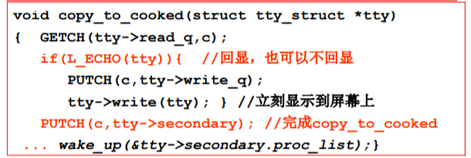

回显就是将刚刚按下的按键对应的可显示字符显示到控制台上，这里先通过PUTCH(c,tty->write_q)将字符放到写缓冲队列中，然后调用tty->write(tty)（即con_write函数）将字符进行显示。

至此键盘中断处理程序就执行完了，而键盘驱动的整个过程就是这样。

### 一个小结

- 键盘驱动过程

  1. 产生键盘中断（硬件要参与到计算机内部，就只能通过中断）
  2. 使用in指令从端口读取扫描码
  3. 将扫描码转换成ASCII码
  4. 将ASCII码放到read_q队列中
  5. 将read_q队列中的字符进行转义处理后再放到secondary队列中（此时函数scanf就可以从这里读取字符了）
  6. 如果要求回显，也可以直接将read_q队列中的字符发送到write_q队列中，然后调用con_write函数进行显示

  > 函数scanf：按用户指定的格式从键盘上把数据输入（read）到指定的变量之中。这个过程刚好和printf相反，一个从read队列读取数据，一个往write队列写入数据。
  >
  > 在文件接口中，read是指从外设中读取数据；write是指向外设发送数据。

- 如何写键盘驱动？

  对于键盘驱动，就只需完成键盘中断的处理程序就行了，即根据扫描码获取ASCII码，将按键对应的字符读取到缓冲队列中。

- 键盘（输入设备）驱动从硬件到CPU，硬件先工作产生数据，然后由CPU读取该数据；显示屏（输出设备）驱动从CPU到硬件，CPU先将数据发送到硬件，然后由硬件对数据进行处理。如图可以看出，这两个过程刚好相反，但前者的终点和后者的起点都是文件接口，两者结合在一起就形成了完整的文件视图。这也印证了外设驱动的三件事：两者一起形成了统一的文件视图；键盘驱动需要产生中断处理；显示器驱动需要最后发送out指令。

  PS：文件视图对于输出设备，其简化了写入过程（比如调用printf就行了）；对于输入设备，其简化了读取过程（比如调用scanf就行了）。两者底层的层层调用都无需用户自己编写。

  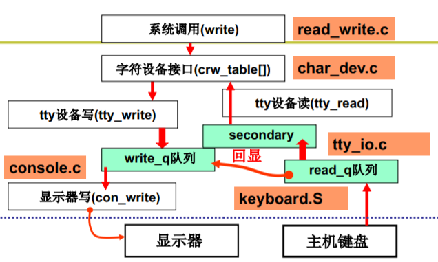

## 磁盘管理

### 如何让磁盘工作起来

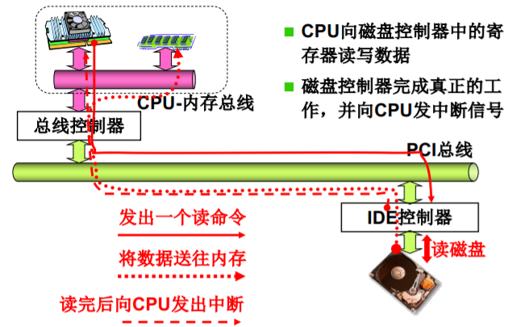

### 认识磁盘

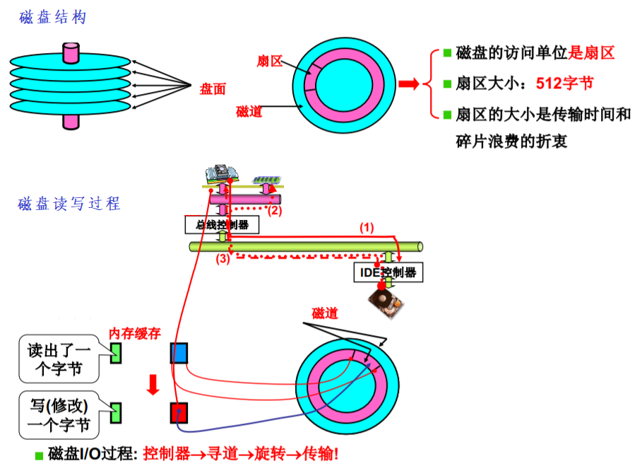

磁盘读写过程：

1. 磁头转动到相应的磁道上
2. 磁盘转动到相应的扇区上
3. 继续转动（磁生电），将扇区上的磁信号转化为电信号，这电信号就是一段高低电平，代表了一段数据，最后这段数据就会被传送到内存中
4. 如果是修改磁盘内容，前两步还是一样的，不过最后一步是电生磁，将内存传来的代表数据的电信号转化为扇区上的磁信号。

### 最直接的磁盘使用（直接发out指令）

想要磁盘工作，那就要告诉磁盘你想要读取的是哪个位置的数据，这个位置信息就包括哪个写柱面C（磁道）、哪个磁头H（盘面）、哪个扇区S，有了这些信息，磁盘自然就会驱动磁头和盘面转动到相应的位置进行读写。此外还要告诉磁盘控制器内存缓冲区的位置，然后通过DMA总线盗用技术就可以将磁盘数据读取到内存，或将内存数据写入到磁盘。

因此，最直接使用磁盘的方法就是使用out指令向磁盘控制器的端口（寄存器）发送这四个值（写柱面、磁头、扇区、缓存位置）。

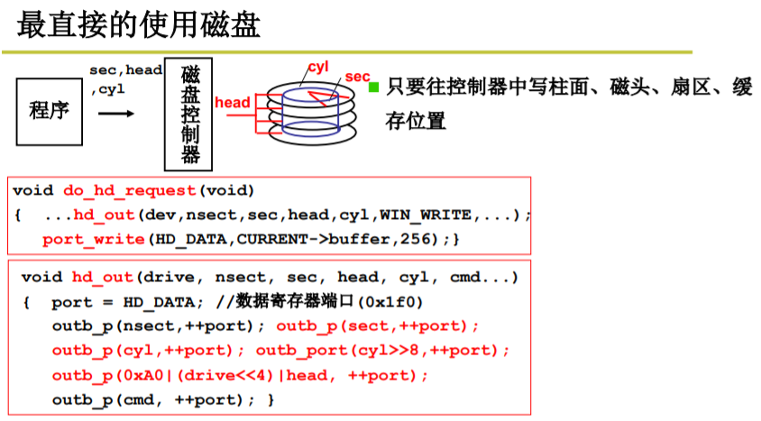

### 第一层抽象（从CHS到盘块号）

直接使用磁盘需要知道好几个参数，为了避免麻烦，希望只使用一个参数就可以使用磁盘，这就是磁盘驱动要做的第一层抽象。完整地讲就是：用户只需要给出一个盘块号，磁盘驱动就会负责将其转化成写柱面、磁头、扇区等参数，就可以直接使用磁盘了。

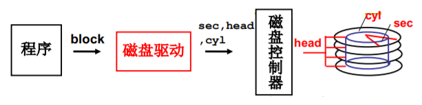

所以这一层抽象的核心就是如何通过盘块号计算出写柱面、磁头、扇区等参数，即如何将磁盘的三维编址转化为线性编址。

#### 盘块号的编址过程

这是为了让磁盘读写变得高效简便做的第一个优化：

1. 磁盘读写的单位是扇区，因此一个盘块号代表的就是一个扇区，此时就称扇区为盘块。程序都是集中在一起的，同一个程序必定连续存放在多个盘块中，这就要求盘块号相邻的盘块可以被快速读写。

2. 磁盘访问时间=写入控制器时间+寻道时间+旋转时间+传输时间。

   - 写入控制器时间和传输时间都非常短，因为它们都是电传递的过程；而旋转时间和寻道时间都相对较长，因为它们都是机械运动。
   - 旋转时间是指盘面旋转的时间，一般7200转/分钟，半周需要4ms的时间；寻道时间是磁臂转动到相应磁道的时间，这个时间偏长，一般为8ms~12ms。

3. 为了提高读写速度，就必须减少磁盘访问时间，而其中寻道时间是最长的，因此就应该避免花费较多的时间在寻道上，所以盘块应该沿着写柱面进行编址（即相邻盘块号应该在用一个磁道上）。

   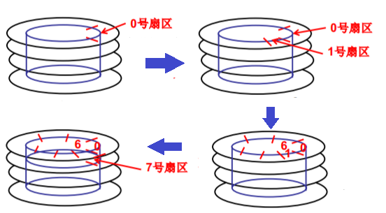

则从磁盘CHS的三维编址到扇区号的一维编址的映射关系可以按如下公式给出：扇区号=C×(Heads×Sectors) + H×Sectors + S。其中，Heads为磁头数（盘面数），Sectors为一个磁道的扇区数。

#### 从扇区到盘块

这是为了让磁盘读写变得高效简便做的第二个优化：

- 磁盘的访问单位是扇区，有了盘块后访问单位就变成了盘块，一般情况下一个盘块等于一个扇区，但为了继续提高磁盘的读写速率，就将连续的多个扇区看成是一个盘块，使得一次寻道时间内可以读写多个扇区，这样就可以提高磁盘的读写效率。
- 比如磁盘访问时间是10ms，若每次访问读写1K的内容，产生碎片0.5K，而读写速率是100K/s；若每次访问读写1M的内容，产生碎片0.5M，而读写速率约有40M/s。
- 可见提高一次读写的扇区数的确可以提高读写速率，但一次访问的内容多了，产生的碎片也多了（碎片就是所读写内容中用不上的部分），而且访问的量越大，碎片也就越大（空间浪费）。所以，用盘块来代替扇区是以空间换取时间的一种做法。


#### 第一层抽象的代码实现

有了盘块后，这时的磁盘使用就变成了下面这样：

1. 用户程序给出盘块号；
2. 操作系统根据盘块号计算出起始扇区号（一个盘块号对应多个扇区号）；
3. 然后根据得到的扇区号利用公式计算出参数C、H、S以及要读取的连续扇区数；
4. 最后根据这些参数发出out指令来访问磁盘。

这个过程的代码实现：

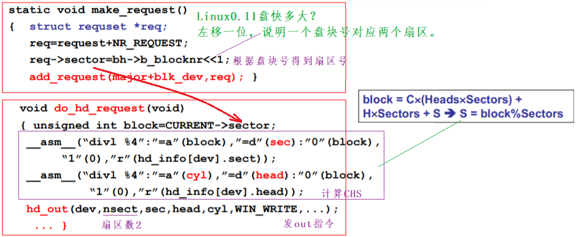

### 第二层抽象（磁盘调度）

由于计算机是多进程图像，因此不可能只有一个进程需要用到盘块来读写磁盘，为了适应多进程，就必须要增加一个请求队列。完整解释：磁盘同一时间只能为一个进程进行读写，如果多个进程都要访问磁盘，就必须有先后顺序，于是增加一个请求队列，让所有需要访问磁盘的进程将盘块号丢到请求队列中，让操作系统来调度，由谁先得到访问权。

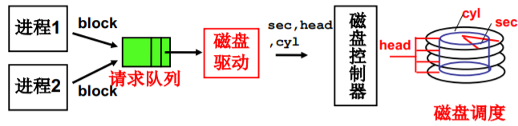

这时使用磁盘的过程就变成了这样：

1. 多个进程将盘块号放入请求队列
2. 经过调度，磁盘驱动从请求队列取出一个盘块号进行读磁盘写
3. 当磁盘发出中断，说明此次读写结束，于是磁盘驱动继续执行步骤2

那么此时就应该考虑如何形成请求队列，即如何安排各个访问请求的先后顺序，这就需要用到磁盘调度算法。下面列举了一些常用的调度算法，它们的调度目标是希望平均访问延迟小，实际点就是希望寻道时间更短。

#### 各种磁盘调度算法

1. FCFS磁盘调度算法

   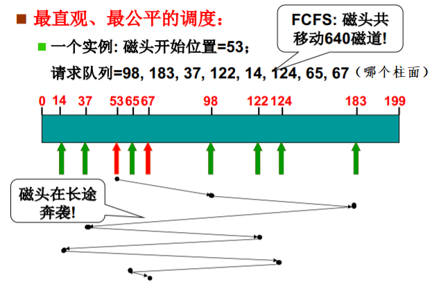

   直观的改进想法： 在移动过程中把经过的请求处理了。

2. SSTF磁盘调度算法

   短寻道优先算法：谁离磁头近，先处理谁的。

   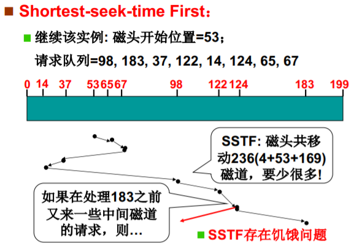

   造成问题：一般的请求都集中在盘面中间，这使得在盘面远处的请求会一直得不到处理。

3. SCAN磁盘调度算法

   先按照一个方向扫描，直到该方向没有请求，再反向扫描，如此反复。这种调度方法的磁臂移动类似于电梯，所以也称为电梯算法。

   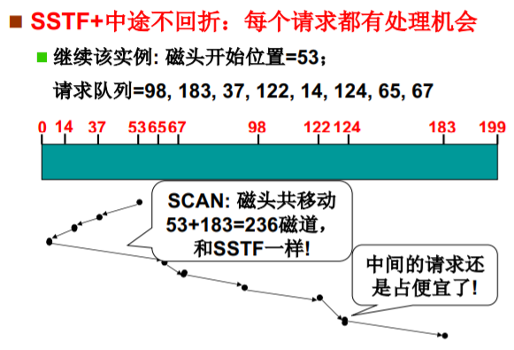

   造成问题： 两侧磁道被访问的频率仍低于中间磁道。 

4. CSCAN磁盘调度算法

   选定一个扫描方向，当该方向上的请求处理完成后，返回最外层的一个请求，继续按照这个方向扫描，如此反复。由于这个算法的扫描为单方向的扫描，所以也叫单向电梯算法。

   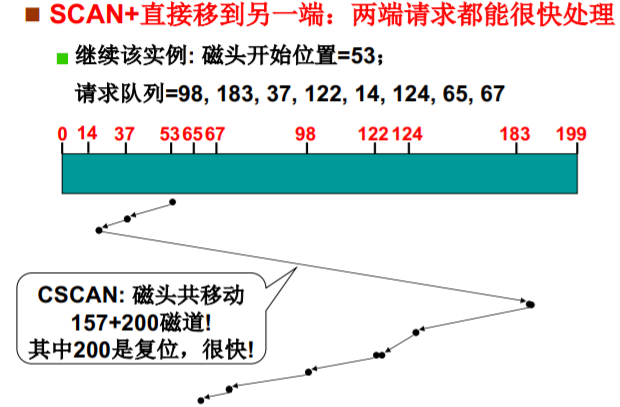

   这是可用且公平的算法。

#### 第二层抽象的代码实现

根据电梯算法形成的磁盘调度实现：

```c
//// 请求结构体。
struct request {
	int dev; /* -1 if no request */ // 发请求的设备号。
	int cmd; /* READ or WRITE */ // READ 或 WRITE 命令。
	int errors; //操作时产生的错误次数。
	unsigned long sector; // 起始扇区。(1 块=2 扇区)
	unsigned long nr_sectors; // 读/写扇区数。
	char * buffer; // 数据缓冲区。
	struct task_struct * waiting; // 任务等待请求完成操作的地方（队列）。
	struct buffer_head * bh; // 缓冲区头指针(include/linux/fs.h,73)。
	struct request * next; // 指向下一请求项。
};

//// 创建请求项并插入请求队列中。
static void make_request(...)
{
	struct request * req;
	......
	/* 向空闲请求项中填写请求信息，并将其加入队列中 */
	req->dev = bh->b_dev; // 设备号。
	req->cmd = rw; // 命令(READ/WRITE)。
	req->errors=0; // 操作时产生的错误次数。
	req->sector = bh->b_blocknr<<1; // 起始扇区号。
	req->nr_sectors = 2; // 本请求项需要读写的扇区数。
	req->buffer = bh->b_data; // 缓冲区地址。
	req->waiting = NULL; // 任务等待操作执行完成的地方。
	req->bh = bh; // 缓冲块头指针。
	req->next = NULL; // 指向下一请求项。
	add_request(major+blk_dev,req); // 将请求项加入队列中。
}

//// 向请求链表中加入请求项。
static void add_request(struct blk_dev_struct * dev, struct request * req)
{
	struct request * tmp;

	req->next = NULL; // 置空请求项中的下一请求项指针。
	cli(); // 关中断。请求队列是共享数据，因此需要用临界区来保护。
	if (req->bh)
		req->bh->b_dirt = 0; // 清缓冲区“脏”标志。
	// 然后查看指定设备是否有当前请求项，如果没有，则本次是第1个请求项，因此可将块设备当前请求指针直接指向该请求项，并立刻执行相应设备的请求函数。
	if (!(tmp = dev->current_request)) {
		dev->current_request = req;
		sti(); // 开中断。
		(dev->request_fn)(); // 执行请求函数，对于硬盘是do_hd_request()。
		return;
	}
    
 	// 如果目前该设备已经有当前请求项在处理，则首先利用电梯算法搜索最佳插入位置，然后将当前请求项插入到请求链表中。
	for ( ; tmp->next ; tmp=tmp->next) {// 与请求链表中的每一项进行比较，找到合适的插入位置。
		......
		if ((IN_ORDER(tmp,req) || !IN_ORDER(tmp,tmp->next)) 
            && IN_ORDER(req,tmp->next))
			break;
	}
	req->next=tmp->next;
	tmp->next=req;
	sti();
}

//// 下面的宏定义用于电梯算法，用于根据请求结构中的信息（命令cmd、设备号dev以及所操作扇区号sector）来判断出两个请求项结构的前后排列顺序。
// 参数s1和s2是请求结构request的指针。
#define IN_ORDER(s1,s2) \
((s1)->cmd < (s2)->cmd || (s1)->cmd == (s2)->cmd && \
((s1)->dev < (s2)->dev || ((s1)->dev == (s2)->dev && \
(s1)->sector < (s2)->sector)))
// 优先读操作；优先设备号小；优先扇区号小。
// 由sector=C×(Heads×Sectors)+H×Sectors+S可知，扇区号越小，其所在写柱面也越小。
```

整个过程总结为：

1. 根据盘块号计算出起始扇区号，由此构成请求结构（形成磁盘访问请求）

2. 根据电梯算法在请求队列中找到该请求的合适位置并插入（形成电梯队列）

   （请求在队列中的位置决定了其读写磁盘的先后顺序）

### 生磁盘的使用总结

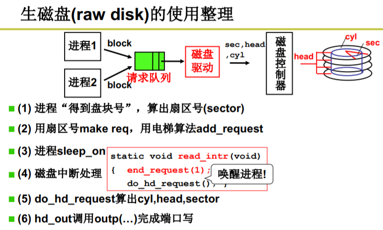

> 生磁盘：没有使用文件进行读写的磁盘使用。
>
> 熟磁盘：通过文件进行读写的磁盘使用。

### 第三层抽象（从盘块到文件）

从盘块号抽象成文件，从文件得到盘块号。

用户使用生磁盘就必须知道盘块号，但要知道盘块号就先得了解磁盘的结构，因此为了进一步让用户使用起来方便，就在盘块的基础上引入了更高一层的抽象概念，即文件。

#### 文件是什么

文件在用户眼里就是一串按顺序排列的字符，即字符序列或字符流。而实际上，文件在磁盘上就是一堆连续的盘块，这些盘块存放了文件的各个部分。

因此，第三层抽象就是为了建立从字符流到盘块集合的映射，直白点就是如何从文件（字符流）得到相应的盘块号，或如何将一个盘块集合映射成一个文件。

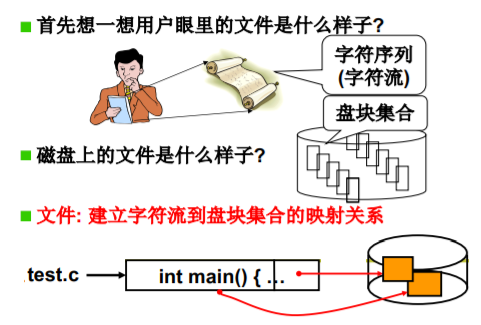

#### 如何形成映射

##### 顺序结构

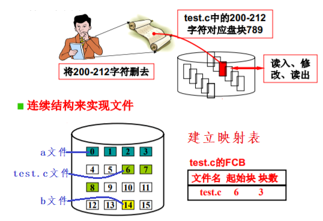

将文件按顺序存放在磁盘中连续的盘块上，比如a文件存放在盘块0~3中，test.c文件存放在盘块6~8中，b文件存放在盘块14中。假设一个盘块存放100个字符，拿test.c文件来说，第0~99个字符就存放在6号盘块中，第100~199个字符就存放在7号盘块中，第200~299个字符就存放在8号盘块中。

现在已经将文件存放在磁盘了，就需要建立它们之间的映射表FCB，映射表就主要存放文件名、起始盘块号、块数这三个信息。test.c文件在映射表中的内容如图所示，有了这个映射关系就可以找到具体字符在磁盘中的位置，比如要找第200~212个字符所在的盘块号，就只需要将200除以一个盘块所能存储的字符数，这里是100，所以得到2，将2与该文件的起始块号相加就可以得到目标盘块号8，因此第200~212个字符所在的盘块号就是8。

现在用户使用磁盘就变成了文件名+字符流中的第几个字符。

采用顺序结构存放文件的特点：

1. 结构连续，类似数组；
2. 不适合文件的动态增长；
3. 随机存取；
4. 因此该结构适合存储那些不需要变化的文件，比如词典。

##### 链式结构

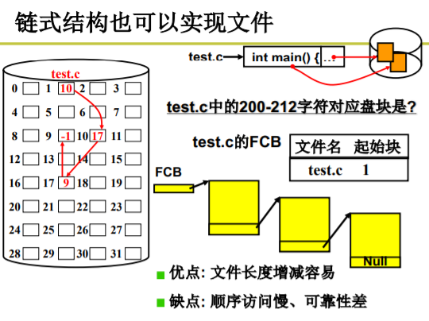

将文件按链表的方式存放在磁盘中离散的盘块上，比如test.c文件的第一段字符流存放在盘块1中，然后在盘块1的末位写上存放下一段字符流的盘块号10，所以第二段字符流就在盘块10中，在盘块10的末位也写上下一个盘块号，以此类推，就形成了链式的存储结构。

链式结构映射表只需要知道文件名和起始块号这两个信息，有了这两个信息就可以帮助操作系统找到某个字符对应的盘块号。比如还是要找test.c文件第200~212个字符所在的盘块号，这时还是将其除以一个盘块所能存储的字符数，还是得到2，这就说明需要链接两次才能到达目标盘块，即先根据映射表取出起始块1，从盘块1读出下一盘块号10，再取出盘块10，从盘块10读出下一盘块号17，所以目标盘块号就是17，总共经过两次跳转。

采用链式结构存放文件的特点：

1. 适合动态增长，只需要随便找个空闲块存储文件，再改变相应的指针就可以了；
2. 不适合顺序访问。

##### 索引结构

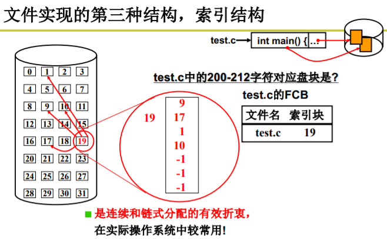

专门找一个盘块做索引表，上面按顺序写出每段字符流在磁盘中存放的盘块号，因此这种结构的映射表就只需要记录文件名和索引块的盘块号。比如test.c文件的索引块为盘块19，将这个信息记录在映射表中，如果要找第200~212个字符所在的盘块号，就首先根据映射表找到对应的索引块，读出里面的索引信息，从图中可以看出，盘块9存放了第0~99个字符，盘块17存放了第100~199个字符，盘块1存放了第200~299个字符......因此第200~212个字符所在的盘块号就是1。

采用索引结构存放文件的特点：

1. 适合动态增长；
2. 也适合顺序访问 。

##### 多级索引结构

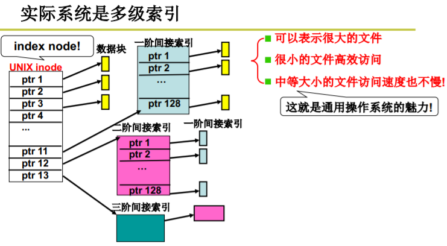

> 索引结构的映射表FCB也叫inode。

- 小文件的映射表直接就包含了索引信息，可以直接找到文件对应的盘块号；
- 中等文件的映射表指出了单级索引表的盘块号，该单级索引表就包含了文件对应的盘块号；
- 大型文件的映射表指出多级索引表的盘块号，真正的文件索引需要层层递进才能找到，因此访问比较慢，但这提供了大型文件存储方式。

#### 通过文件使用磁盘的实现

假设要向某个文件写入内容，因此调用write这个文件接口，这个接口底层就是调用了sys_write这个函数，所以从sys_write函数开始着手实现：

```c
int sys_write(unsigned int fd,char * buf,int count)
{
	struct file * file;
	struct m_inode * inode;
	......
	file=current->filp[fd];
	inode=file->f_inode;
	if (inode->i_pipe)
		return (file->f_mode&2)?write_pipe(inode,buf,count):-EIO;
	if (S_ISCHR(inode->i_mode))
		return rw_char(WRITE,inode->i_zone[0],buf,count,&file->f_pos);
	if (S_ISBLK(inode->i_mode))
		return block_write(inode->i_zone[0],&file->f_pos,buf,count);
	if (S_ISREG(inode->i_mode))
		return file_write(inode,file,buf,count);
	......
}
```

> PCB保存了进程打开的所有文件。
>
> 调用write接口前都会先调用open接口来打开文件，用来建立当前进程与该文件的关联。直白点讲就是将即将要进行写入操作的文件的信息保存到PCB中，使得后续的write操作可以从中获取文件信息。
>
>  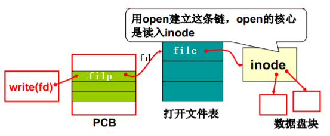

sys_write函数已经讲解过：首先通过文件描述符fd（句柄）从当前进程的PCB中取出要写入文件的指针，然后根据指针获取文件的映射表inode，最后根据操作类型选择处理函数，这里是文件写入，所以是调用file_write函数。

file_write函数接收三个参数。其中，inode是文件的索引映射表，file保存了要写入文件的起始字符位置，buf是存放了要写入数据的缓冲区，count是总共要写入的字符数。所以file_write函数的工作就是从file中获取起始写入地址，然后加上count形成整个要写入字符段所在的区间，根据这个区间就可以通过inode找到盘块号，形成请求并加入到请求队列等待读写。接下来看看file_write函数的具体过程：

> file中有一个指针file->f_pos，这个指针就指示了当前读写开始位置在整个文件字符流中的偏移。
>
> 文件写入采用的是缓存回写机制，即先读出文件内容到缓存中，然后修改缓存数据，然后把数据再次写入到磁盘中。这里就是将要修改的目标盘块读到高速缓存中，然后根据buf修改其中的数据，然后进行回写。这种机制使得写入操作在数据写入高速缓存后即可返回，无需等待数据实际写入磁盘。
>
> 写入分为覆盖、插入和追加。我对插入的理解：它将插入位置到文件结尾的所有盘块都重新回写，如果插入内容过多，还要增加盘块。而且情况复杂的话，应该还要算法来处理。

```c
int file_write(struct m_inode * inode, struct file * filp, char * buf, int count)
{
	off_t pos;
	int block,c;
	struct buffer_head * bh;
	char * p;
	int i=0;
	// 首先确定数据写入文件的位置。如果是要向文件后添加数据，则将文件读写指针移到文件尾部，否则就将在文件当前读写指针处写入。
	if (filp->f_flags & O_APPEND)
		pos = inode->i_size;
	else
		pos = filp->f_pos;
    
	// 然后在已写入字节数i（刚开始时为0）小于指定写入字节数count时，循环执行以下操作：取文件逻辑块号 (pos/BLOCK_SIZE) 在磁盘上对应的盘块号，若出错则退出循环，没出错则根据盘块号读取盘块内容到高速缓冲区bh中，若出错也退出循环。
	while (i<count) {
		if (!(block = create_block(inode,pos/BLOCK_SIZE)))
			break;
		if (!(bh=bread(inode->i_dev,block)))
			break;
        
		// 求出文件当前读写指针在盘块中的偏移值c，并将指针p指向高速缓冲bh中开始写入数据的位置。
		c = pos % BLOCK_SIZE;
		p = bh->b_data + c;
		bh->b_dirt = 1; // 置缓冲块标志为已修改
    	// 从当前指针开始到块末共可写入c=(BLOCK_SIZE - c)个字节。若c大于剩余还需写入的字节数(count - i)，则此次只需再写入c = (count - i)个字节即可。
		c = BLOCK_SIZE - c;
		if (c > count-i) c = count-i;
        
		// 预先设置好下一次循环操作要读写的起始位置，如果此时pos位置超过了文件当前长度，则修改i节点中文件长度字段，并置i节点为已修改标志。然后把此次要写入的字节数c累加到已写入字节计数值i中，供循环判断使用。接着从用户缓冲区buf中复制c个字节到高速缓冲区中p指向的开始位置处，复制完后就释放该缓冲块以进行回写。
		pos += c;
		if (pos > inode->i_size) {
			inode->i_size = pos;
			inode->i_dirt = 1;
		}
		i += c;
        // 回写。
		while (c-->0)
			*(p++) = get_fs_byte(buf++);
		brelse(bh); // 唤醒专门进行回写的进程。
	}
    
	// 当数据已经全部写入文件或者在写操作过程中发生问题时就会退出循环，此时我们更改文件修改时间为当前时间，并调整文件读写指针。如果此次操作不是在文件尾添加数据，则把文件读写指针调整到当前读写位置 pos 处，并更改文件i节点的修改时间为当前时间。最后返回写入的字节数，若写入字节数为 0，则返回出错号-1。
	inode->i_mtime = CURRENT_TIME;
	if (!(filp->f_flags & O_APPEND)) {
		filp->f_pos = pos;
		inode->i_ctime = CURRENT_TIME;
	}
	return (i?i:-1);
}
```

总结file_write函数的过程：

 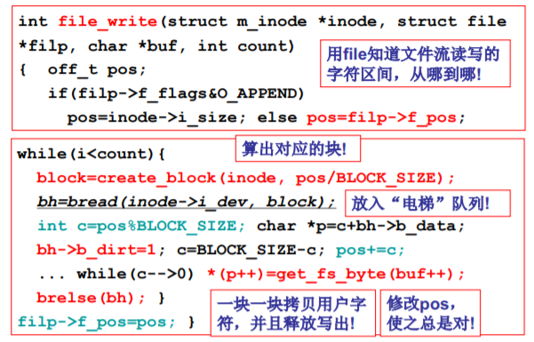

1. 确定写入位置pos；
2. 根据pos计算出盘块号；
3. 根据盘块号形成读写请求并等待数据读取到高速缓冲bh中；
4. 修改写入位置pos；
5. 修改高速缓冲bh中的数据，然后进行回写；

我们再看看其中create_block函数是如何根据写入位置pos获取盘块号的，实际上create_block函数仅仅是调用了_bmap函数，该函数代码如下：

```c
//// 文件数据块映射到盘块的处理操作。
// inode：文件的i节点指针；block：文件逻辑块号；create：创建块标志。
// 该函数把指定的文件数据块block对应到设备上逻辑块上，并返回逻辑块号。如果块创建标志置位，则在设备上对应逻辑块不存在时就申请新磁盘块，返回文件数据块block对应在设备上的逻辑块号（盘块号）。
// 该函数分四个部分进行处理：(1)参数有效性检查；(2)直接块处理；(3)一次间接块处理；(4)二次间接块处理。
static int _bmap(struct m_inode * inode,int block,int create)
{
	struct buffer_head * bh;
	int i;

    ......// 判断参数的有效性。
        
	// 根据文件块号的大小值和是否设置了创建标志分别进行处理。
	// 如果该块号小于 7，则使用直接块表示。
	if (block<7) {
		if (create && !inode->i_zone[block])
			if (inode->i_zone[block]=new_block(inode->i_dev)) {
                 inode->i_ctime=CURRENT_TIME;
				inode->i_dirt=1; // 设置已修改标志。
			}
		return inode->i_zone[block];
	}
    
	// 如果该块号>=7，且小于(7+512)，则说明使用的是一次间接块，于是按一次间接块进行处理。
	// 如果是创建操作，并且该i节点的间接块字段i_zone[7]是0，表明文件是首次使用一次间接块，于是需要申请一盘块用于存放间接块信息，并将此盘块号填入一次间接块字段中。如果创建时申请磁盘块失败，则此时i节点间接块字段 i_zone[7]为 0，则返回 0。或者不是创建，但i_zone[7]原来就为0，表明i节点中没有间接块，于是映射磁盘块失败，返回0退出。
	block -= 7;
	if (block<512) {
		if (create && !inode->i_zone[7])
			if (inode->i_zone[7]=new_block(inode->i_dev)) {
				inode->i_dirt=1;
				inode->i_ctime=CURRENT_TIME;
			}
		if (!inode->i_zone[7])
			return 0;
        
	// 现在读取设备上该i节点的一次间接块，并在其上读取第block项的盘块号i（间接块上每项占2个字节）。如果是创建操作并且所取得的盘块号为0，则需要申请一盘块，并让索引块中的第block项等于该新逻辑块块号，然后置位间接块的已修改标志。如果不是创建操作，则i就是需要映射（寻找）的逻辑块号。最后释放该索引块占用的缓冲块（包括写回），并返回磁盘上新申请或原有的对应block的盘块号。
		if (!(bh = bread(inode->i_dev,inode->i_zone[7])))
			return 0;
		i = ((unsigned short *) (bh->b_data))[block];
		if (create && !i)
			if (i=new_block(inode->i_dev)) {
				((unsigned short *) (bh->b_data))[block]=i;
				bh->b_dirt=1;
			}
		brelse(bh);
		return i;
	}
	......// 运行到这里说明是二级间接块，以下是对二级间接块的处理。
}
```

> 索引块中一个盘块号就占两个字节（说明linux0.11系统最多支持2^16个盘块，即65535KB），一个索引块大小为1024B，因此一个索引块就可以存放512个盘块号，也就可以映射512个盘块。

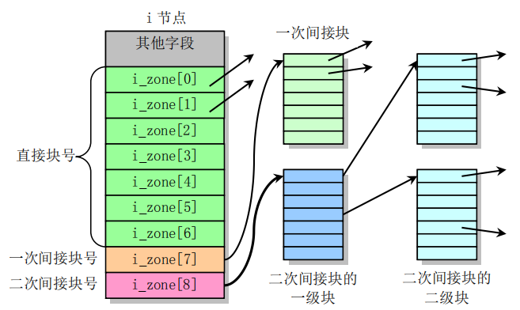

linux0.11的文件系统采用的是多级索引结构，每个文件就对应有如上图所示的映射表inode，其中文件的第0-6个盘块由直接块号映射，第7-518个盘块由一次间接块映射，大于518的盘块由二次间接块映射。因此在计算盘块号时，首先要判断文件的逻辑块号处于哪个范围内，然后按对应的映射方法进行计算，从而获得文件的逻辑块号对应的盘块号。

至此从盘块到文件的抽象实现就完成了，一个完整的文件视图也只差一步就完成了，这步就是讲open如何从文件名找到其对应的inode，请听下回分解。

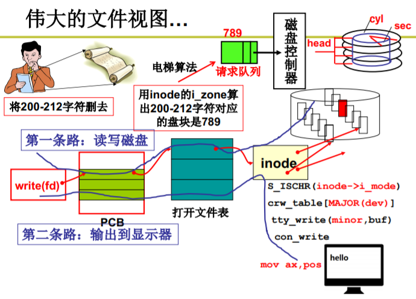

#### 题外话

不论是普通文件还是设备文件，它们都有inode结构体，这个结构体通过open接口获得并存放在进程的PCB中。普通文件的inode存放的主要是映射表，而设备文件存放的主要是主设备号和次设备号等信息，比如显示器驱动中，显示器对应的就是设备文件，其i_mode表示的就是字符设备文件，对应的i_zone存放的就是设备号，而不是文件和盘块之间的映射关系。

下面是inode结构体的内部说明。

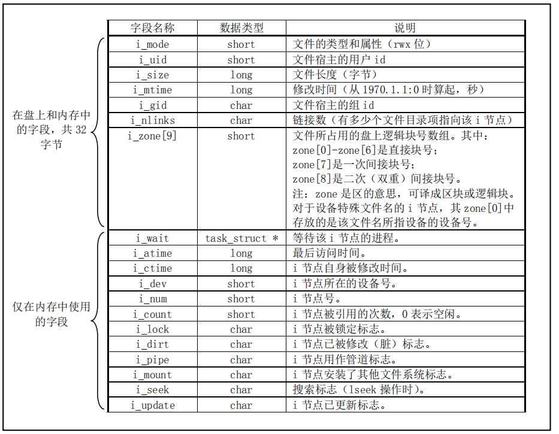

### 最后一层抽象（从文件到目录树）

将盘块集合映射为文件，然后以树状结构的形式（目录树）来组织文件，这就是文件系统。总体来说，这几层抽象的目的就是将磁盘映射（抽象）为一个目录树（这个映射关系存储在磁盘中），以目录树的形式来管理磁盘中的内容，也使得用户可以以目录树的方式来使用磁盘。

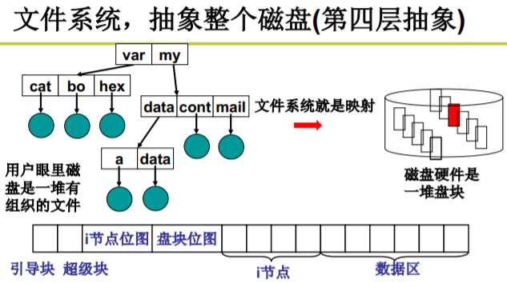

#### 如何将一堆文件映射成整个磁盘

系统一开始就是将所有文件都放在一个单层的集合中，但如果文件一多就会杂乱无章，无法快速地找到自己想要的文件。然后想出一个办法，就是将集合进行划分，每个用户都有自己的一个小集合，但一旦某个用户的文件多了，还是会导致上面的问题。

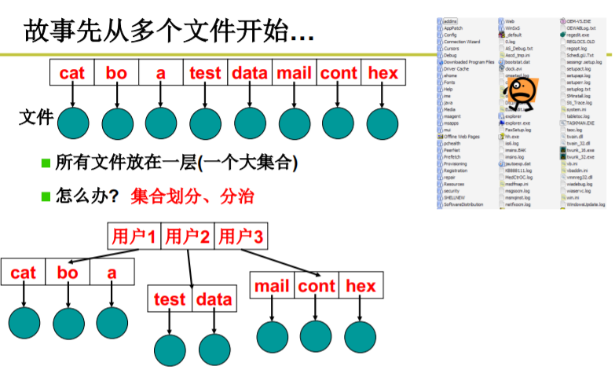

因此就引入了目录树这种组织结构，这是一种典型的分治方式和算法策略。它的做法其实就是将集合继续划分，多次划分后每个集合中的文件就比较少了，这样查找起来就方便了很多。为了简便，引入一个概念来表示这个文件集合，也就是目录。所以文件系统的关键就是如何实现"目录"这个概念，进一步讲就是应该在磁盘中维护怎样一种信息才能形成目录。

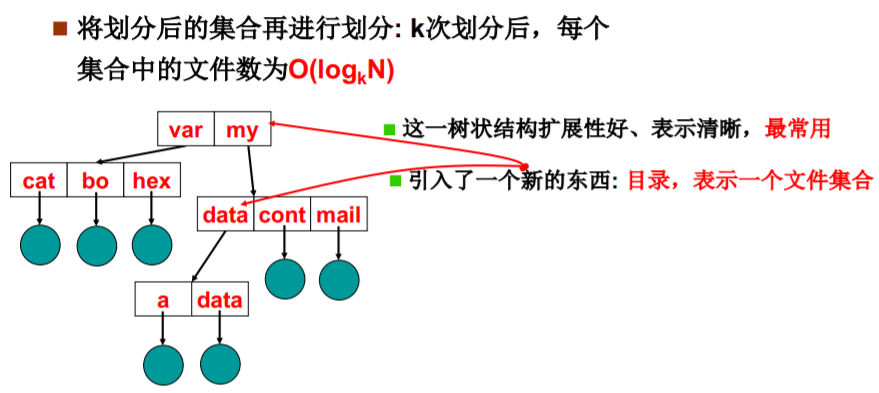

#### 如何实现目录

首先考虑用户是如何使用目录的，或者说用户提供给操作系统什么样的信息，使得操作系统可以返回用户需要的磁盘内容，并且这个给出的信息就可以体现出目录树这种结构来。不难想，这个信息就是路径，路径很好地体现了树状结构，而且只要用户给出了文件对应的路径，操作系统就可以将内容从磁盘中读取出来，但我们知道磁盘要进行读写，就必须要有文件对应的FCB，所以关键点就是如何从路径映射到文件的FCB。

> 一个文件（包括目录，目录本身也是文件）在磁盘中的存储分为两个部分，一个是该文件的FCB内容，一个是该文件本身的内容。该文件的FCB就指出了该文件本身的内容存放在磁盘的哪些盘块中，因此要获取文件本身的内容，就必须先获取该文件的FCB。

如果要从路径找到文件的FCB，那么目录本身就应该存放着所有子文件和子目录对应的名称和FCB，这样才能从根目录逐层向下地找到目标文件的FCB。

比如有如图所示的目录树，要根据路径/my/data/a找到a文件的FCB，那么根目录就应该存放var和my目录对应的名称和FCB，my目录存放data目录以及cont和mail文件对应的名称和FCB，data目录存放a和data文件对应的名称和FCB。这样就可以在根目录存放的信息中通过比对"my"这个名称找到my目录的FCB，并根据my目录的FCB找到my目录存放的信息，然后在my目录存放的信息中通过比对"data"这个名称找到data目录的FCB，并根据data目录的FCB找到data目录存放的信息，然后在data目录存放的信息中通过比对"a"这个名称找到a文件的FCB，至此就大功告成了。

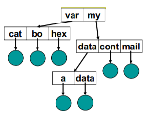

但是直接在目录中存放子目录的FCB会导致效率不高，因为在事先并不知道目标子目录是哪一个，就必须将所有子目录的FCB都加载进来。因此为了提高效率就改进为以下方法：

因为根据路径进行匹配，只能匹配子节点中的一个，所以将所有子节点的FCB都加载进来是不划算的，因此就可以在目录中只存放"文件名+文件对应FCB的地址"，这样体积小了很多，效率就高了。这样的一条信息就叫做目录项。

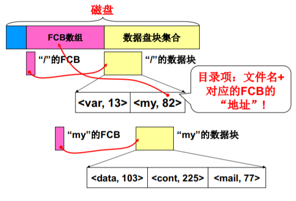

实际上这个信息中的"文件对应FCB的地址"应该是一个编号，在磁盘中将所有文件的FCB组织成一个数组，根据这个编号就可以找到对应的FCB，这样查找也更快，如上图所示。现在这个过程就变成了：在根目录存放的内容中找到"my"这个名称对应的FCB编号，然后根据这个编号取出my目录的FCB，接着根据my目录的FCB取出my目录存放的内容，然后在my目录存放的内容中继续寻找 ......

> FCB数组的位置在磁盘中是固定的，而每个FCB的长度也是固定，长度×编号就可以找到实际的偏移位置，进而找到对应的盘块号。

在初始化的时候，根目录的FCB必须是已知的，因此根目录的FCB就得存放在磁盘的固定位置，通常就是FCB数组的第0项，而FCB数组的位置在磁盘中也是固定的，或者在磁盘格式化时被记录起来，而记录该信息的位置是固定的。这个过程也叫做自举，即系统自己能找到自己需要的信息，而为了完成自举，磁盘就必须经过格式化，将各个信息能够处在合适的位置，如下图所示：

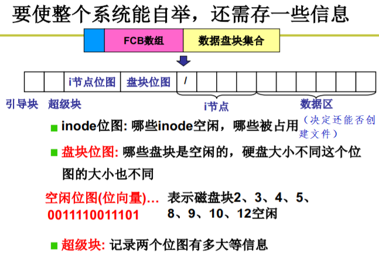

> 磁盘要使用是就需要mount一下，这个mount就是读取超级块的信息。

到此就完成了磁盘的全部映射（抽象），形成了一个完整的文件系统：

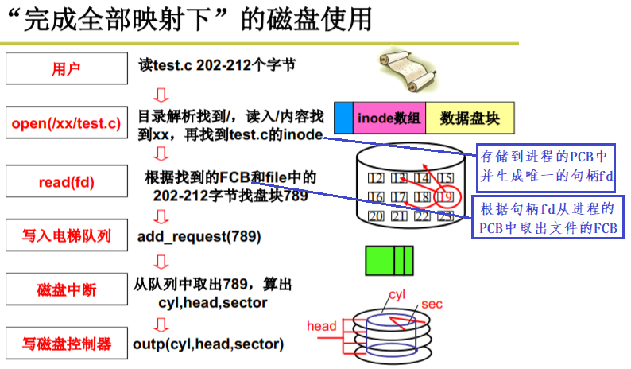

#### 通过目录树使用磁盘的代码实现

 这部分的代码主要就是将open接口弄明白，其主要过程就是通过路径解析出目标文件的inode，然后将其放入当前进程PCB中的file数组里面，最后返回数组的下标，即文件句柄fd。这部分代码的重点不在于如何形成文件与PCB的链接，而是在于如何根据路径读取文件的FCB，接下来我们就看看是如何实现的。

如往常一样，open接口在底层实际调用的是sys_open这个函数：

```c
int sys_open(const char * filename,int flag,int mode)
{
	struct m_inode * inode;
	struct file * f;
	int i,fd;

	// 首先将用户设置的文件模式和进程模式屏蔽码相与，产生许可的文件模式。然后寻找空闲的文件句柄值fd，若已经没有空闲项，则返回出错码。
	mode &= 0777 & ~current->umask;
	for(fd=0 ; fd<NR_OPEN ; fd++)
		if (!current->filp[fd]) // 找到空闲项。
			break;
		if (fd>=NR_OPEN)
			return -EINVAL;
	
	......// 设置当前进程执行时关闭文件句柄位图，并复位对应的比特位。
	// 打开文件在文件表中寻找一个空闲结构项。
    f=0+file_table;
	for (i=0 ; i<NR_FILE ; i++,f++)
		if (!f->f_count) break;
	if (i>=NR_FILE)
		return -EINVAL;
    
	// 让进程对应文件句柄fd的文件结构指针指向搜索到的文件结构，并令文件引用计数递增 1，然后调用函数open_namei()执行打开操作。若出错，则释放刚申请到的文件结构，返回出错码 i。若文件打开操作成功，则inode是已打开文件的i节点指针。
	(current->filp[fd]=f)->f_count++;
	if ((i=open_namei(filename,flag,mode,&inode))<0) {
		current->filp[fd]=NULL;
		f->f_count=0;
		return i;
	}
	......// 针对不同的文件类型进行一些处理。
     // 接着初始化打开文件的文件结构。最后返回文件句柄号。
	f->f_mode = inode->i_mode;
	f->f_flags = flag;
	f->f_count = 1;
	f->f_inode = inode;
	f->f_pos = 0;
	return (fd);
}
```

sys_open这个函数我们以及解析过，重点就是调用open_namei来获取文件的inode，然后将其保存在PCB中。现在来看看open_namei函数干了啥：

```c
//// 打开文件用的 namei 函数。
int open_namei(const char * pathname, int flag, int mode,
struct m_inode ** res_inode){
	const char * basename;
	int inr,dev,namelen;
	struct m_inode * dir, *inode;
	struct buffer_head * bh;
	struct dir_entry * de;

	......// 首先对函数参数进行合理的处理。
// 根据指定的路径名寻找到最顶端目录名对应的i节点。
// 如果最顶端目录名长度为0（例如'/usr/'这种路径名的情况），那么若操作不是读写、创建和文件长度截0，则表示是在打开一个目录名文件操作。于是直接返回该目录的i节点并返回0退出。否则说明进程操作非法，于是放回该i节点，返回出错码。
	if (!(dir = dir_namei(pathname,&namelen,&basename,NULL)))
		return -ENOENT;
	if (!namelen) {
		if (!(flag & (O_ACCMODE|O_CREAT|O_TRUNC))) {
			*res_inode=dir;
			return 0;
		}
		iput(dir);
		return -EISDIR;
	}
// 接着根据上面得到的最顶层目录名的i节点dir，在其中查找并取得路径名中最后的文件名对应的目录项结构de，同时得到该目录项所在的高速缓冲区指针。 
	bh = find_entry(&dir,basename,namelen,&de);
	if (!bh) { // 如果该高速缓冲指针为NULL，则表示没有找到对应文件名的目录项，因此只可能是创建文件操作。
		......
	}
 // 若上面在目录中取文件名对应目录项结构的操作成功（即bh不为NULL），则说明指定打开的文件已经存在。于是取出该目录项的i节点号和其所在设备号，同时释放该高速缓冲块并放回i节点。
	inr = de->inode;
	dev = dir->i_dev;
	brelse(bh);
	......
// 读取该目录项的i节点内容。
	if (!(inode = follow_link(dir,iget(dev,inr))))
		return -EACCES;
	......
	*res_inode = inode; // *res_inode用于接收inode指针，当函数返回后，调用者就从其中获取inode。
	return 0; // 返回0表示成功。
}
```

open_namei函数最主要的就是三件事：① 调用dir_namei函数获取路径中最顶端目录名对应的inode；② 调用find_entry从最顶端目录中找到文件对应的目录项；③ 根据目录项中的i节点号调用iget和follow_link函数获取文件的inode并返回给调用者。下面我们就一个一个来看这些函数具体干了啥。

首先是dir_namei函数：

```c
static struct m_inode * dir_namei(const char * pathname,
int * namelen, const char ** name, struct m_inode * base){
	char c;
	const char * basename;
	struct m_inode * dir;
 // 首先取得指定路径名最顶层目录的i节点。然后对路径名pathname进行搜索检测，查出最后一个'/'字符后面的名字字符串，计算其长度，并且返回最顶层目录的i节点指针。注意！如果路径名最后一个字符是斜杠字符'/'，那么返回的目录名为空，并且长度为 0。但返回的i节点指针仍然指向最后一个'/'字符前目录名的i节点。
	if (!(dir = get_dir(pathname,base))) // base是指定的起始目录i节点，此处是null。
		return NULL;
    // 找出文件名。
	basename = pathname;
	while (c=get_fs_byte(pathname++))
		if (c=='/')
			basename=pathname;
	*namelen = pathname-basename-1;
	*name = basename;
	return dir;
}
// get_fs_byte(addr)：读取fs段中指定地址处的字节。
```

dir_namei函数的重点就是调用了get_dir函数来获取指定路径名最顶层目录的i节点，还有就是获取路径中的文件名。接着看get_dir函数：

```C
//// 从指定目录开始搜寻给定路径名的顶端目录名的 i 节点。
static struct m_inode * get_dir(const char * pathname, struct m_inode * inode)
{
	......
// 如果给出的目录的i节点指针inode为空，则使用当前进程的当前工作目录i节点。
// 如果用户指定路径名的第1个字符是'/'，则说明路径名是绝对路径名，则应从当前进程PCB中设置的根（或伪根）i节点开始操作。
	if (!inode) {
		inode = current->pwd; // 为进程的当前工作目录i节点。
		inode->i_count++;
	}
	if ((c=get_fs_byte(pathname))=='/') {
		iput(inode); // 放回原i节点。
		inode = current->root; // 为进程指定的根i节点。在磁盘挂载时就会将根目录的inode保存到shell进程的PCB中，而其它进程都是从shell进程拷贝来的，所以也会有根目录的inode。
		pathname++; // 删除路径名的第1个字符'/'。
		inode->i_count++; // 把该i节点的引用计数加1。
	}
// 然后针对路径名中的各个目录名部分和文件名进行循环处理。
	while (1) {
		thisname = pathname; // 把变量thisname指向当前正在处理的目录名部分。
		......
// 每次循环处理路径名中一个目录名。因此每次循环都要从路径名中分离出一个目录名，方法是从当前路径名指针pathname开始处搜索检测字符，直到字符是是一个'/'字符。此时变量namelen正好是当前处理目录名的长度，而变量thisname正指向该目录名部分的开始处，它们组合在一起就是当前处理的目录名。此时如果字符是NULL，则表明已经搜索到路径名末尾，则返回该i节点指针退出。
// 如果路径名中最后一个名称也是一个目录名，但其后面没有加上'/'字符，则函数不会返回该最后目录名的i节点。例如/usr/src/linux，该函数将只返回src目录名的i节点。
		for(namelen=0;(c=get_fs_byte(pathname++))&&(c!='/');namelen++)
			/* nothing */ ;
		if (!c)
			return inode;
// 得到当前目录名后，调用find_entry()在当前处理的目录中寻找指定名称的目录项。
// 然后在找到的目录项中取出其i节点号inr和设备号idev，释放包含该目录项的高速缓冲块并放回该i节点。
// 然后取节点号inr的i节点inode。如果当前处理的目录项是一个符号链接名，则使用follow_link()就可以得到其指向的i节点。
// 以该目录项为当前目录继续循环处理路径名中的下一目录名。
		if (!(bh = find_entry(&inode,thisname,namelen,&de))) {
			iput(inode);
			return NULL;
		}
		inr = de->inode; // 当前目录名部分的i节点号。
		brelse(bh);
		dir = inode; // 设置下一次循环的目录。
		if (!(inode = iget(dir->i_dev,inr))) { // 取i节点内容。
			iput(dir);
			return NULL;
		}
		if (!(inode = follow_link(dir,inode)))
			return NULL;
	}
}
```

get_dir函数比较长，但其主要过程就是从路径的根目录的inode开始，逐层调用find_entry函数来获取下一个目录的目录项，并调用iget函数获取对应的inode，直到该目录是路径中最顶端的目录。这里有三个重点：① 根目录的inode从何而来；② find_entry函数如何从当前目录获取下一个目录的目录项；③ iget函数如何获取指定i节点号的inode。

- 根目录的inode从何而来：在磁盘挂载时就会将根目录的inode保存到shell进程的PCB中，而其它进程都是从shell进程拷贝来的，所以也会有根目录的inode。

  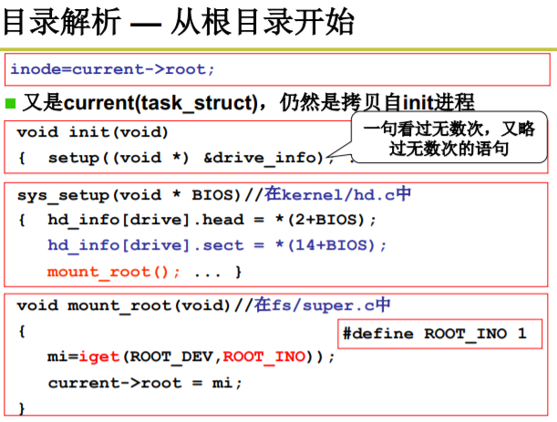

- find_entry函数如何从当前目录获取下一个目录的inode：根据当前目录的inode，获取该目录存储目录项的盘块，然后取出其中的目录项与指定目录名进行一个一个的比对，然后将匹配的目录项返回。

  ```c
  //// 在指定目录中查找指定文件名的目录项。
  static struct buffer_head * find_entry(struct m_inode ** dir,
  const char * name, int namelen, struct dir_entry ** res_dir)
  {
  	int entries;
  	int block,i;
  	struct buffer_head * bh;
  	struct dir_entry * de;
  	struct super_block * sb;
  
  
  	...... // 对函数参数的有效性进行判断和验证。
  // 首先计算本目录中目录项项数entries。目录i节点i_size字段中含有本目录包含的数据长度，因此其除以一个目录项的长度（16字节）即可得到该目录中目录项数，然后置空返回目录项结构指针。
  	entries = (*dir)->i_size / (sizeof (struct dir_entry)
  	*res_dir = NULL;
  	...... // 对目录项文件名是'..'的情况进行特殊处理。
  	// 读取目录的第一个盘块。
  	if (!(block = (*dir)->i_zone[0]))
  		return NULL;
  	if (!(bh = bread((*dir)->i_dev,block)))
  		return NULL;
  // 在目录的数据块中搜索匹配指定文件名的目录项。首先让de指向缓冲块中的数据块部分，并在不超过目录中目录项数的条件下，循环执行搜索。其中i是目录中的目录项索引号，在循环开始时初始化为0。
  	i = 0;
  	de = (struct dir_entry *) bh->b_data;
  	while (i < entries) {
  // 如果当前数据块中的目录项已经搜索完，还没有找到匹配的目录项，则释放当前目录项数据块，再读入目录的下一个盘块。若这块为空，则只要还没有搜索完目录中的所有目录项，就跳过该块，继续读目录的下一盘块。若该块不空，就让de指向该数据块，然后在其中继续搜索。其中i/DIR_ENTRIES_PER_BLOCK可得到当前搜索的目录项所在目录文件中的块号，而bmap()函数则可计算出在设备上对应的盘块号。
  		if ((char *)de >= BLOCK_SIZE+bh->b_data) {
  			brelse(bh);
  			bh = NULL;
  				if (!(block = bmap(*dir,i/DIR_ENTRIES_PER_BLOCK)) || 
                      !(bh = bread((*dir)->i_dev,block))) {
  					i += DIR_ENTRIES_PER_BLOCK;
  					continue;
  				}
  			de = (struct dir_entry *) bh->b_data;
  		}
  // 如果找到匹配的目录项的话，则返回该目录项结构指针de和该目录项所在数据块指针bh，并退出函数。否则继续在目录数据块中比较下一个目录项。
  		if (match(namelen,name,de)) {
  			*res_dir = de;
  			return bh;
  		}
  		de++;
  		i++;
  	}
  // 如果指定目录中的所有目录项都搜索完后，还没有找到相应的目录项，则释放目录的数据块，最后返回NULL（失败）。
  	brelse(bh);
  	return NULL;
  }
  ```

- iget函数如何获取指定i节点号的inode：先从内存中的节点表中查找有没有匹配的i节点，如果没有就调用read_inode函数进行获取。所以最终是调用了read_inode函数来从磁盘中读取i节点号对应的inode。

  ```c
  //// 根据i节点编号获取得对应的i节点。
  struct m_inode * iget(int dev,int nr)
  {
  	struct m_inode * inode, * empty;
  	......
  // 先从 i 节点表中取一个空闲i节点备用。接着扫描整个i节点表，看看里面有没有已经存储了参数指定节点号nr对应的i节点。若当前扫描i节点的设备号不等于指定的设备号或者节点号不等于指定的节点号，则继续扫描。
  	empty = get_empty_inode();
  	inode = inode_table; // 指向inode表首。
  	while (inode < NR_INODE+inode_table) {
  		if (inode->i_dev != dev || inode->i_num != nr) {
  			inode++;
  			continue;
  		}
  // 如果找到指定设备号de和节点号nr的i节点，则等待该节点解锁（如果已上锁的话）。在等待该节点解锁过程中，i节点表可能会发生变化。所以继续执行时需再次进行上述相同判断。如果发生了变化，则再次重新扫描整个i节点表。
  		wait_on_inode(inode);
  		if (inode->i_dev != dev || inode->i_num != nr) {
  			inode = inode_table;
  			continue;
  		}
  // 到这里表示已找到相应的i节点，于是将该i节点引用计数增1。
  		inode->i_count++;
  		...... // 如果i节点是文件系统的安装点，则进行特殊处理
  // 最终找到了相应的i节点，因此释放开始处临时申请的空闲i节点，返回找到的i节点指针。
  		if (empty)
  			iput(empty);
  			return inode;
  	}
  // 如果在i节点表中没有找到指定的i节点，则利用前面申请的空闲i节点empty在i节点表中建立该i节点，并从相应设备上读取该i节点信息，返回该i节点指针。
  	if (!empty)
  		return NULL;
  	inode=empty;
  	inode->i_dev = dev; // 设置i节点的设备。
  	inode->i_num = nr; // 设置i节点号。
  	read_inode(inode);
  	return inode;
  }
  ```

结束了上述三个问题后，我们再看看read_inode函数的执行过程：

```c
//// 从设备上读取含有指定i节点信息的i节点盘块，然后复制到指定的i节点结构中。
static void read_inode(struct m_inode * inode)
{
	struct super_block * sb;
	struct buffer_head * bh;
	int block;


	lock_inode(inode); // 锁定该i节点。
     // 取得该节点所在设备的超级块。
	if (!(sb=get_super(inode->i_dev)))
		panic("trying to read inode without dev");
// 获取该i节点所在的设备盘块号 = (启动块 + 超级块) + i 节点位图占用的块数 + 逻辑块位图占用的块数 + (i节点号-1)/每块含有的i节点数。虽然i节点号从0开始编号，但第1个0号i节点不用，并且磁盘上也不保存对应的0号i节点结构。
// 然后从设备上读取该i节点所在的盘块，并复制指定i节点内容到inode所指位置处。
	block = 2 + sb->s_imap_blocks + sb->s_zmap_blocks + 
        (inode->i_num-1)/INODES_PER_BLOCK;
	if (!(bh=bread(inode->i_dev,block)))
		panic("unable to read i-node block");
	*(struct d_inode *)inode =
		((struct d_inode *)bh->b_data)[(inode->i_num-1)%INODES_PER_BLOCK];
// 最后释放读入的缓冲块，并解锁该i节点。对于块设备文件，还需要设置i节点的文件最大长度值。
	brelse(bh);
	if (S_ISBLK(inode->i_mode)) {
		int i = inode->i_zone[0]; // 对于块设备文件，i_zone[0]中是设备号。
		if (blk_size[MAJOR(i)])
			inode->i_size = 1024*blk_size[MAJOR(i)][MINOR(i)];
		else
			inode->i_size = 0x7fffffff;
	}
	unlock_inode(inode);
}
```

这个函数也比较简单：首先锁住i节点，然后计算出该i节点在磁盘中对应的盘块号，根据这个盘块号获取该盘块上的i节点信息，最后从中获取指定i节点号对应的inode，并复制到已经准备好的inode结构体中返回给调用者。

执行到这里就已经完成了open_namei函数的第一件事，但我们发现这件事的调用过程已经将下面两件事也解决了，所以到此整个函数也讲解完了，最后一层抽象的代码实现也就完成了。