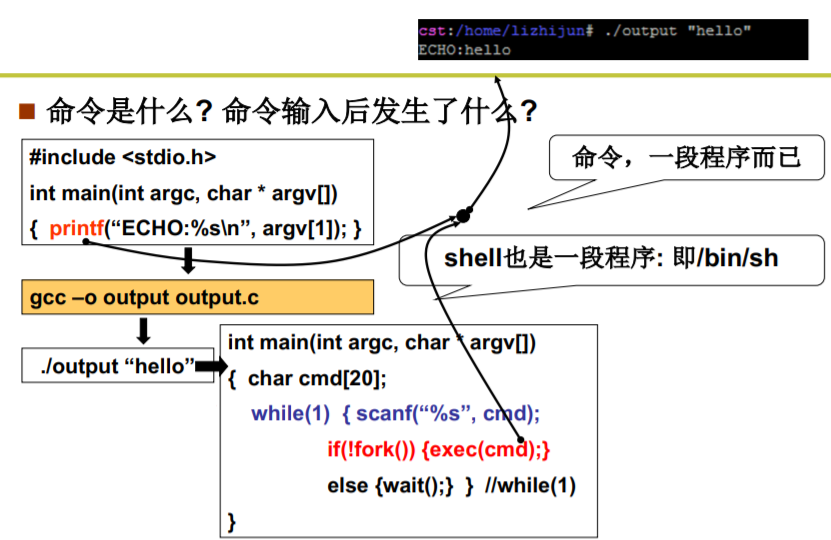
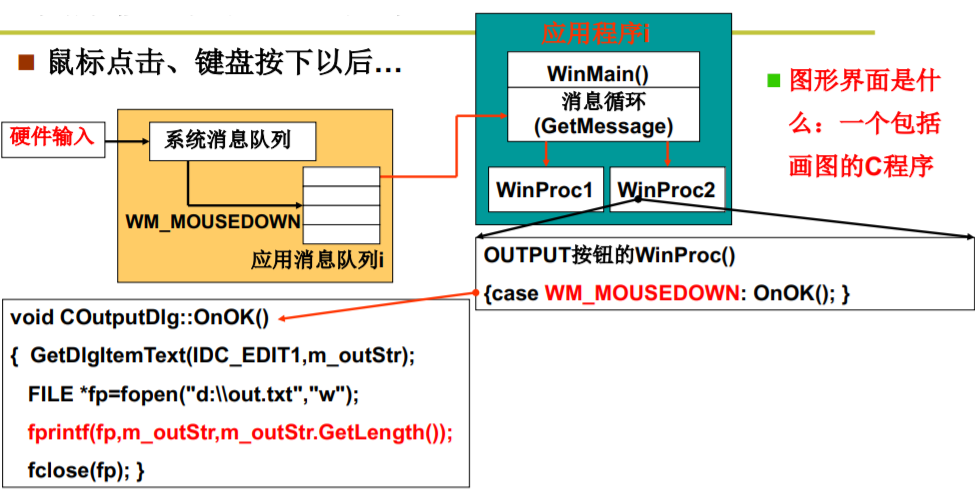
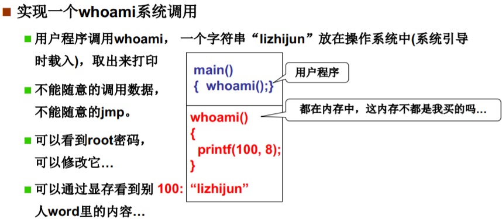
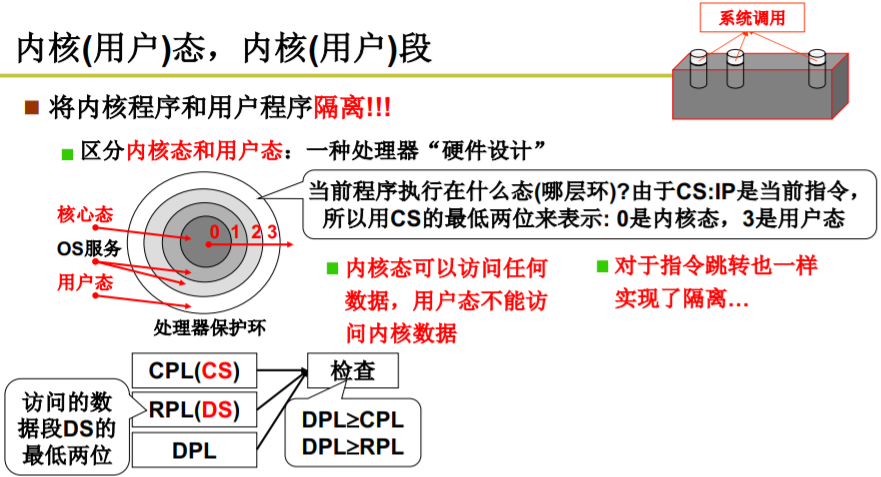
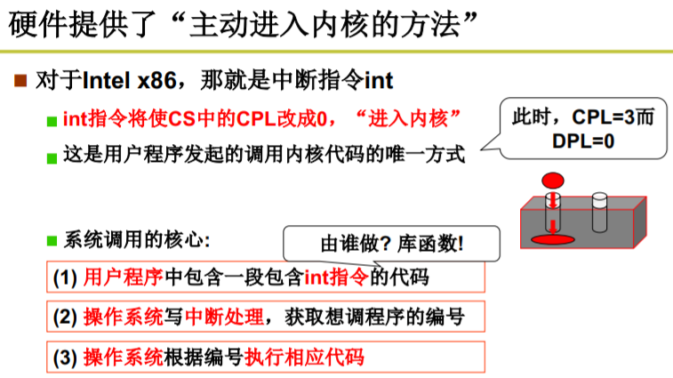
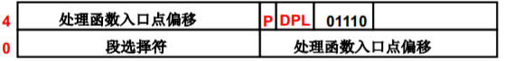
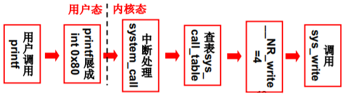

# 操作系统接口

操作系统接口就是一些操作系统预先定义好的函数，这些函数提供了对系统硬件功能的操作 ，用户通过调用这些函数就可以对操作系统进行控制，而无需知道底层的实现细节。 这些由操作系统提供的接口也被称为系统调用。

操作系统接口指的是一些可以使得用户进入操作系统里面，从而进入内核的函数，通过这些函数来调用系统的功能。

调用接口有两种方式，即命令行和图形界面。

1. 命令行方式：在shell程序中以命令输入的形式来调用接口。

   shell就是让用户可以输入命令并执行的程序，俗称命令行，在linux启动时由main.c程序启动。shell程序不会中断，而是一直等待命令输入，然后执行命令对应的程序。shell也是一种应用程序，它也是通过调用系统提供的接口来执行命令的。

   命令也是程序，一段程序进行编译后就可以当成命令来使用，执行命令就是调用了这段程序。用户想要调用接口，就只需要在程序中编写接口函数即可。

   举例说明：写一段程序，里面使用了接口函数printf，然后将其编译成命令，在shell中输入这个命令，shell程序就会调用接口函数fork来执行这个命令对应的程序，执行程序时调用printf函数，这个函数就会控制显示屏显示一段字符。

   

2. 图形界面：通过消息机制来实现对接口的调用。

   由中断程序将键盘、鼠标等的输入存入缓存，这些输入被称为消息，缓存被称为消息队列，然后由一个消息循环不断从消息队列中取出消息，然后根据消息的类型调用对应的处理程序，这整个过程就直接或间接地调用了操作系统接口。

   所以用户通过图形界面间接地使用系统接口，系统调用都是由系统程序自动完成的。

   

> POSIX是linux系统设计接口的统一标准。所有的接口函数都按这个标准来设计，就使得应用程序可以在不同的操作系统上进行复用。

# 系统调用的实现

## 为什么要系统调用，而不能直接调用



假设whoami是一个用于显示出当前计算机的所有者的函数，而所有者这个信息存储在在内核存储区中，需要进入内核才能访问，因此whoami属于一个系统调用。

但是这个信息在内存中，应用程序也是在内存中，为什么应用程序不可以直接访问这个信息，而非要经过系统调用呢？也就是说，操作系统在内存中，应用程序也在内存中，为什么操作系统可以直接访问内存，而应用程序就必须通过系统调用才能间接地访问内存，就不能直接访问吗？

 原因：保护系统重要信息。因为内存存储着系统重要信息，如果用户可以随意访问内存，那么这些信息就会被暴露。

## 如何使得用户不能直接调用



该机制由硬件实现（即硬件不让你直接调用），被称为保护环。

将内存分割成用户态和内核态，分别对应用户段和内核段。内核态可以访问用户段和内核段，用户态只能访问用户段。

CPL是当前进程的权限级别（Current Privilege Level），即当前进程正在执行的指令所在内存段的特权级，其值由cs寄存器的低两位决定。 

> 一个用户进程在开始时被载入内存，其在内存中的位置就固定了，并且处于一个用户段中，因此它的CPL就会始终保持为3，但当它通过系统调用进入内核时，其CPL会变为0，一旦退出又变为3。

DPL存储在段描述符（GDT）中，每个内存段都有一个DPL，DPL就规定了该段的访问权限级别（Descriptor Privilege Level），只有CPL小于等于DPL的指令才能访问该内存段。每个段的DPL都是固定的，在系统初始化时就写死了。 

> 特权级越小，权限越大。
>
> 用户段的DPL是3，内核段的DPL是0。
>
> 还有一个叫RPL（与DS寄存器有关）的特权级，这里不讲。

在用户执行指令时，硬件都会检查当前指令的CPL和指令所要访问的目标段的DPL，看看当前指令有没有访问目标段的权限，比如用户态指令想要访问内核段，硬件查询后发现CPL=3>DPL=0，那么该访问就会被硬件直接拒绝。

## 如果不能直接调用，那应该如何进入内核



用户态指令无法进入内核，只有内核态指令才有权限进入内核，因此首先要将用户态指令转变为内核态指令。

硬件提供了主动进入内核的唯一方法，那就是中断。用户只需要在应用程序中调用int指令，就可以将cs寄存器的CPL值修改为0，从而允许进入内核。

所以实际上系统调用就是一段包含int指令的代码。

举例说明：open函数是一个系统调用，里面包含了int指令，当执行到int指令时，系统产生中断，将相关数据进行压栈保护后，执行系统调用入口程序（中断例程），然后根据open这个函数的编号，调用相应的系统调用处理程序。

硬件（Intel x86）规定了系统调用进入内核的唯一中断是int 0x80，其它中断都不行，即用一个中断管理所有的系统调用。 在系统初始化的时会同时初始化IDT表, 也就是中断处理表,  这个表规定了只有int 0x80中断指令才能使CPL变成0 ，因此这个中断指令就是系统给用户进入内核的唯一后门。

## printf函数的系统调用过程

> 在C语言中，可以采用命令#define来定义宏。该命令允许把一个名称指定成任何所需的文本，例如一个常量值或者一条语句。在定义了宏之后，无论宏名称出现在源代码的何处，预处理器都会把它用定义时指定的文本替换掉。
>
> 宏展开将宏名称替换成宏定义时的内容。
>
> 内嵌汇编的语法：_\_asm__(汇编语句:输出部分:输入部分:破坏描述部分) 。

### 前提：初始化80h号中断的idt表项（中断处理门）

系统初始化时就将80h号中断的idt表项给设置好了，如下是初始化时调用的设置函数。

```c
void sched_init(void)
{
    int i;
    struct desc_struct * p;

    if (sizeof(struct sigaction) != 16)
        panic("Struct sigaction MUST be 16 bytes");
    set_tss_desc(gdt+FIRST_TSS_ENTRY,&(init_task.task.tss));
    set_ldt_desc(gdt+FIRST_LDT_ENTRY,&(init_task.task.ldt));
    p = gdt+2+FIRST_TSS_ENTRY;
    for(i=1;i<NR_TASKS;i++) {
        task[i] = NULL;
        p->a=p->b=0;
        p++;
        p->a=p->b=0;
        p++;
    }
    /* Clear NT, so that we won't have troubles with that later on */
    __asm__("pushfl ; andl $0xffffbfff,(%esp) ; popfl");
    ltr(0);
    lldt(0);
    outb_p(0x36,0x43);           /* binary, mode 3, LSB/MSB, ch 0 */
    outb_p(LATCH & 0xff , 0x40); /* LSB */
    outb(LATCH >> 8 , 0x40);     /* MSB */
    set_intr_gate(0x20,&timer_interrupt);
    outb(inb_p(0x21)&~0x01,0x21);
    set_system_gate(0x80,&system_call);
}
```

重点在最后一句代码：set_system_gate(0x80,&system_call);

这句代码是一个宏，宏定义如下，可以发现又调用了另一个宏。

```c
#define set_system_gate(n,addr) _set_gate(&idt[n],15,3,addr)
```

将宏全部展开后，代码变成：

```c
__asm__(
    "movw %%dx,%%ax\n\t"
    "movw %0,%%dx\n\t"
    "movl %%eax,%1\n\t"
    "movl %%edx,%2"
    :
    : "i" ((short)(0x8000+(dpl<<13)+(15<<8))), 
      "o" (*((char*)(&idt[80]))),
      "o" (*(4+(char*)(&idt[80]))),
      "d" ((char*)(addr)),
      "a" (0x00080000)
)
```

这段代码就是用来设置80h号中断的idt表项的，其主要意思如下：



1. "i" ((short)(0x8000+(dpl<<13)+(15<<8)))。将表项的DPL设置为3。
2. "a" (0x00080000)。将表项的段选择符（CS寄存器的值）。
3. "d" ((char *)(addr))。将表项的偏移地址（IP寄存器的值）设置为addr，即system_call。

### printf函数的执行过程

在程序中调用printf函数，实际上就是调用了库函数中的printf，其代码如下：

```C
static int printf(const char *fmt, ...)
{
    va_list args;
    int i;

    va_start(args, fmt);
    write(1,printbuf,i=vsprintf(printbuf,fmt,args));
    va_end(args);
    return i;
}
```

可以看出，printf函数实际上调用了write函数，write函数是由宏_syscall3定义的：

```c
_syscall3(int,write,int,fd,const char *,buf,off_t,count)
    
// _syscall3的宏定义如下：
#define _syscall3(type,name,atype,a,btype,b,ctype,c) \
type name(atype a,btype b,ctype c) \
{ \
long __res; \
__asm__ volatile ("int $0x80" \
    : "=a" (__res) \
    : "" (__NR_##name),"b" ((long)(a)),"c" ((long)(b)),"d" ((long)(c))); \
if (__res>=0) \
    return (type) __res; \
errno=-__res; \
return -1; \
}
   
// 宏展开如下：
int write(int fd, const char * buf, off_t count)
{
    long __res;
    __asm__ volatile (
        "int $0x80"
        :"=a" (__res)
        :""(__NR_write),"b"(long fd),"c"(long buf),"d"(long count)
    );
    
    if (__res >= 0) return (int)__res;
    errno = -__res;
    return -1;
    )
}
// __NR_write也是一个宏定义，实际代表4
#define __NR_write 4
```

write函数的作用如下：

1. "b"(long fd),"c"(long buf),"d"(long count)。向ebx、ecx、edx寄存器中存入3个参数。
2. "0"(__NR_write)。将\_\_NR_write存入eax中。
3. "=a" (__res)。系统调用结束后的返回值存放在eax寄存器中，此处就是将该结果输出到\_\_res变量中，用于后续返回给write函数的调用者。
4. 前三步做好后，就调用int 80h触发中断。
5. 在汇编中，用int 80h触发中断时，还需要一个功能号作为中断例程的参数，用于指出在中断例程中要调用哪一个子处理函数，\_\_NR_write就是这个功能号，在这里也称为系统调用号。

### int 0x80指令的执行过程

1. 保护现场

2. 从idt表找到中断例程的入口地址

3. 跳转到中断例程的入口地址

   > int 0x80指令的cpl=3，而80号中断的中断例程所在段在gdt表中的dpl=0，理应无法跳转。
   >
   > 但中断跳转查的不是gdt表，而是idt表。我们已经知道，在系统初始化时已经将80号中断的idt表项中的dpl设为了3，也就是说idt表对int 0x80放了水，使其可以访问到内核，从而导致跳转可以成功。
   >
   > 跳转成功后，cpu就从用户态变为了内核态，指令的cpl都变为了0，此时就可以无限制地访问内核数据，而需要返回数据时，只需要直接跳转回用户态继续执行即可（此时cpl又变回3，无法回到内核了）。
   >
   > dpl的值取决于表，cpl的值取决于cs低2位。

4. 执行中断例程

### 中断例程如何根据功能号找到子处理函数

由之前设置好的80号中断的idt表项可知，执行的中断例程为system_call，其代码如下：

```assembly
system_call:
    cmpl $nr_system_calls-1,%eax
    ja bad_sys_call
    push %ds
    push %es
    push %fs
    pushl %edx
    pushl %ecx        # push %ebx,%ecx,%edx as parameters
    pushl %ebx        # to the system call
    movl $0x10,%edx   # set up ds,es to kernel space
    mov %dx,%ds
    mov %dx,%es
    movl $0x17,%edx   # fs points to local data space
    mov %dx,%fs
    call sys_call_table(,%eax,4)
    pushl %eax
    movl current,%eax
    cmpl $0,state(%eax)        # state
    jne reschedule
    cmpl $0,counter(%eax)      # counter
    je reschedule
ret_from_sys_call:
    movl current,%eax          # task[0] cannot have signals
    cmpl task,%eax
    je 3f
    cmpw $0x0f,CS(%esp)        # was old code segment supervisor ?
    jne 3f
    cmpw $0x17,OLDSS(%esp)     # was stack segment = 0x17 ?
    jne 3f
    movl signal(%eax),%ebx
    movl blocked(%eax),%ecx
    notl %ecx
    andl %ebx,%ecx
    bsfl %ecx,%ecx
    je 3f
    btrl %ecx,%ebx
    movl %ebx,signal(%eax)
    incl %ecx
    pushl %ecx
    call do_signal
    popl %eax
3:  popl %eax
    popl %ebx
    popl %ecx
    popl %edx
    pop %fs
    pop %es
    pop %ds
    iret
```

从中挑选重要代码讲解：

1. 以下代码将CPU指向的数据段修改为内核的数据段，使得CPU真正地工作在内核态。

   mov %dx,%ds
   mov %dx,%es
   movl $0x17,%edx

2. call sys_call_table(,%eax,4)地意思是调用sys_call_table+4\*eax这个地址处的函数， 而sys_call_table的定义如下：

   ```c
   fn_ptr sys_call_table[] = { sys_setup, sys_exit, sys_fork, sys_read,
   sys_write, sys_open, sys_close, sys_waitpid, sys_creat, sys_link,
   sys_unlink, sys_execve, sys_chdir, sys_time, sys_mknod, sys_chmod,
   sys_chown, sys_break, sys_stat, sys_lseek, sys_getpid, sys_mount,
   sys_umount, sys_setuid, sys_getuid, sys_stime, sys_ptrace, sys_alarm,
   sys_fstat, sys_pause, sys_utime, sys_stty, sys_gtty, sys_access,
   sys_nice, sys_ftime, sys_sync, sys_kill, sys_rename, sys_mkdir,
   sys_rmdir, sys_dup, sys_pipe, sys_times, sys_prof, sys_brk, sys_setgid,
   sys_getgid, sys_signal, sys_geteuid, sys_getegid, sys_acct, sys_phys,
   sys_lock, sys_ioctl, sys_fcntl, sys_mpx, sys_setpgid, sys_ulimit,
   sys_uname, sys_umask, sys_chroot, sys_ustat, sys_dup2, sys_getppid,
   sys_getpgrp, sys_setsid, sys_sigaction, sys_sgetmask, sys_ssetmask,
   sys_setreuid,sys_setregid };
   ```

3. 由 typedef  int (*fn_ptr)(); 可知，sys_call_table是一个函数指针，对应着一个内存段，内存段中存放了众多系统调用处理函数的入口地址（如上所示），每个地址占4个字节，因此需要在eax前×4。前面已经知道eax存放的是系统调用号，其实它指的就是sys_call_table中的某个函数，printf函数的功能号为4，因此这里调用的就是sys_write这个处理函数。

## 总结



1. 系统调用的过程：

   (1) 应用程序调用库函数(API)

   (2) API将系统调用号存储到eax, 然后通过0x80号中断使系统陷入内核态

   (3) 内核中的中断处理函数sys_call根据eax中的中断号调用相应的系统调用

   (4) 系统调用完成相应功能，将返回值存入eax，返回到中断处理函数

   (5) 中断处理函数返回到API中

   (6) API将eax返回给应用程序

2. int 0x80的目的就是将用户态变为内核态。

   