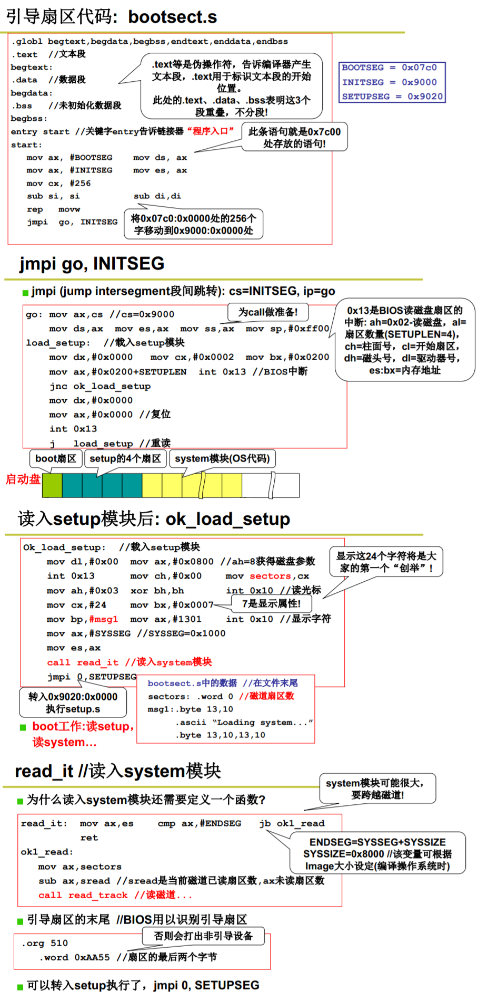
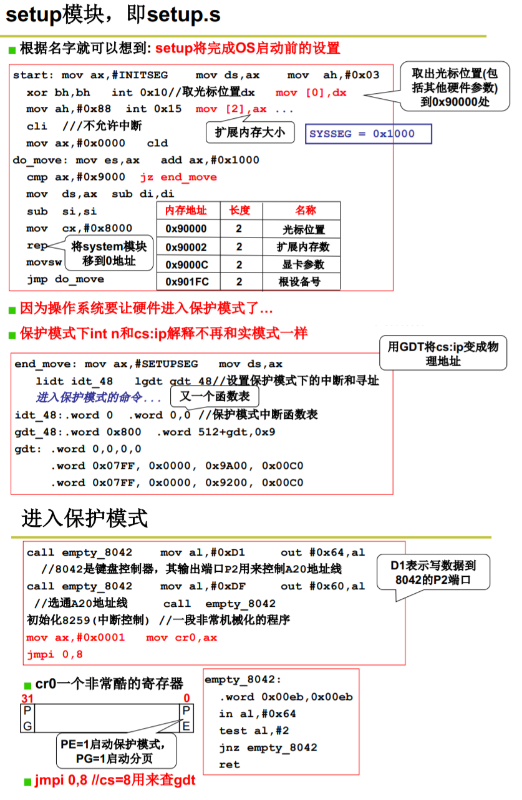
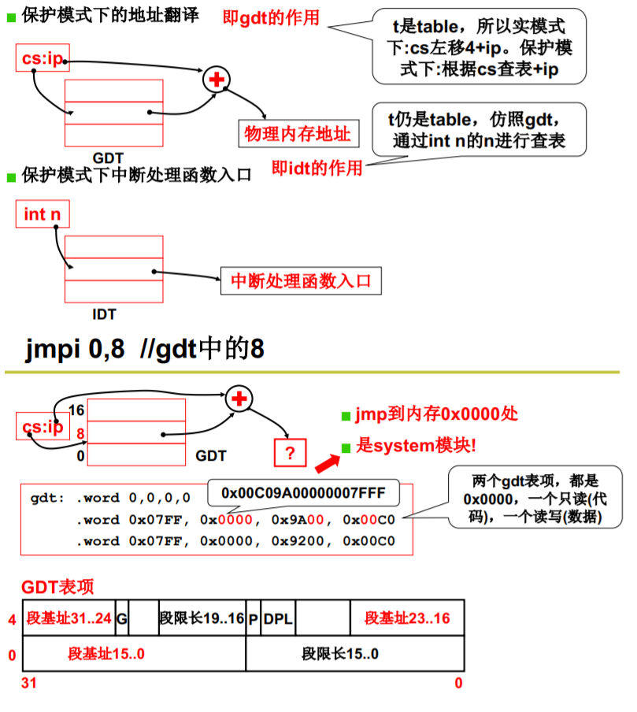
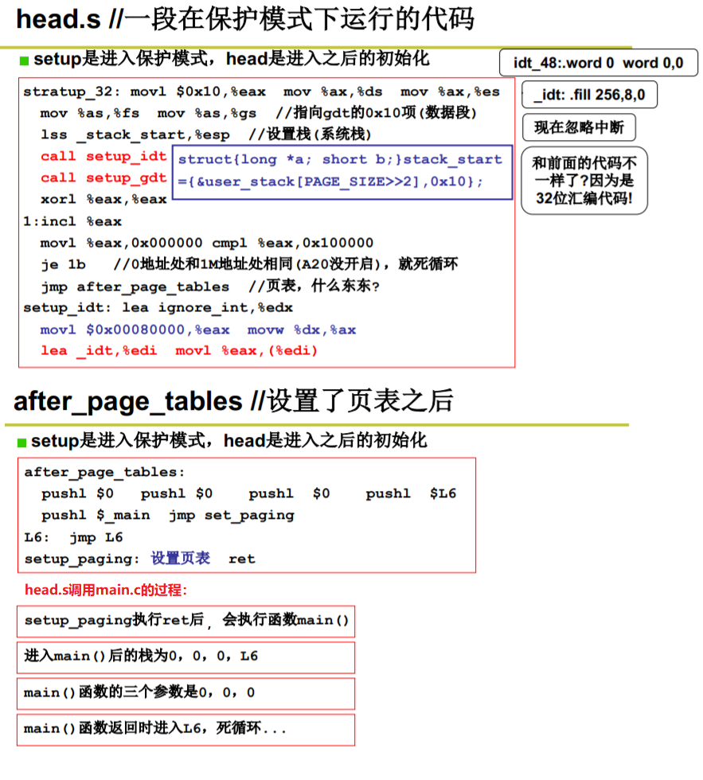
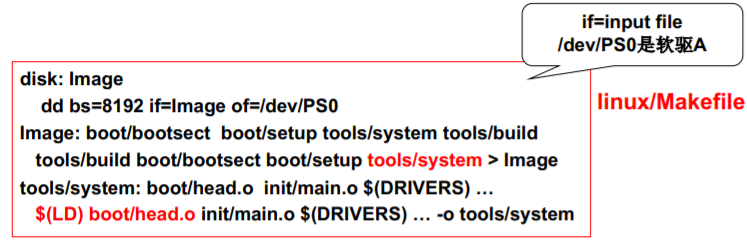
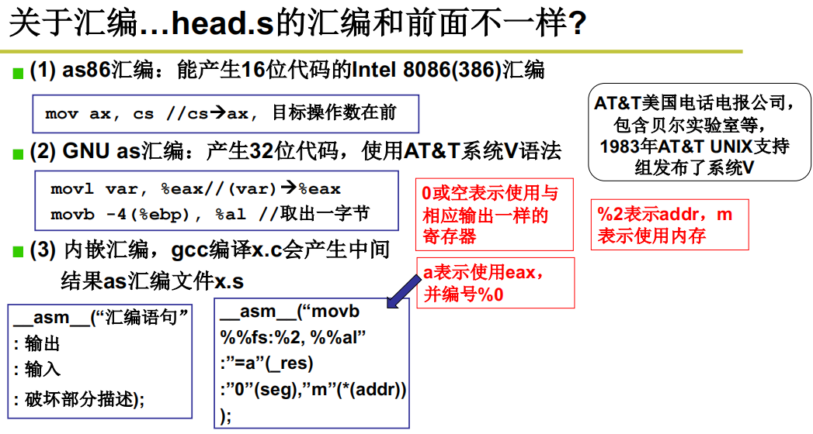
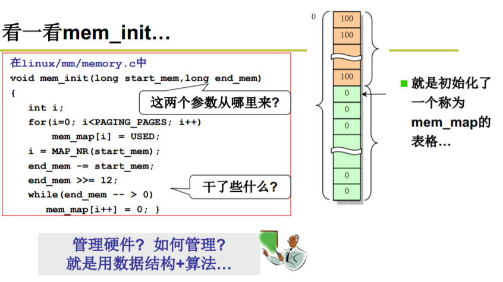

# 什么是操作系统

操作系统就是覆盖在裸机上的一层软件，用于简化计算机操作和管理硬件（CPU、内存、IO设备、磁盘）。

> 程序控制CPU干事情，CPU控制其它硬件来完成这个事情。程序载入内存后就是一系列指令，CPU在CS:IP的指示下取出一条条指令，然后按照指令的意思指挥其他硬件完成该指令包含的操作。
>
> CPU的实模式和保护模式
>
> 1. 实模式： 实模式的“实”体现在程序中用到的地址都是真实的物理地址，“段基址:段内偏移地址”产生的逻辑地址就是物理地址，即程序员可见的地址完全是真实的内存地址。 
> 2. 保护模式：程序员可见的地址为虚拟地址，由操作系统转换为物理地址。CPU启动时就是实模式，被操作系统接管后就进入了保护模式。

# x86计算机启动过程

## 刚启动时

1. 计算机刚启动时CPU处于实模式

2. CS:IP初始为FFFF:0000。这是CPU执行的第一条指令，通常为段间跳转指令，跳转到被称为BIOS的ROM中执行。

3. CPU执行BIOS程序

   （检查硬件，读取引导代码到内存中）

   - 检查RAM、键盘、显示器、磁盘等硬件。
   - 读取磁盘第一个扇区（主引导扇区）的512字节（引导代码）到内存的07c0:0000处。
   - 将CS:IP置为07c0:0000，开始执行引导代码。

## CPU执行引导程序bootsect.s

（bootsect.s各部分解读如下)



（bootsect.s完整代码如下)

```assembly
......

_start:
    ;bootsect模块是在内存中的0x7c00处
    ;先把bootsect模块自身拷贝到内存中的0x90000处
    ;然后在0x9000段里继续向下执行
    mov    ax,#BOOTSEG       ;BOOTSEG  = 0x07c0
    mov    ds,ax            
    mov    ax,#INITSEG       ;INITSEG  = 0x9000
    mov    es,ax            
    mov    cx,#256
    sub    si,si            
    sub    di,di            
    rep    movw                
    jmpi   go,INITSEG    

go: mov    ax,cs      ;cs=0x9000
    mov    ds,ax 
    mov    es,ax 
    mov    ss,ax 
    mov    sp,#0xff00

;把0磁道2扇区开始的4个扇区的程序读入到0x90200处,这个模块的名字叫做setup
load_setup:        
    mov    dx,#0x0000        
    mov    cx,#0x0002        
    mov    bx,#0x0200        
    mov    ax,#0x0200+SETUPLEN   ;SETUPLEN = 4
    int    0x13
    
    jnc    ok_load_setup    
    mov    dx,#0x0000
    mov    ax,#0x0000        
    int    0x13                    
    jmp    load_setup

ok_load_setup:
    ......
 
    ;获取光标位置
    mov    ah,#0x03
    xor    bh,bh
    int    0x10
        
    ;打印启动信息到屏幕上
    mov    cx,#24            
    mov    bx,#0x0007        
    mov    bp,#msg1        
    mov    ax,#0x1301        
    int    0x10

    mov    ax,#SYSSEG
    mov    es,ax
    call   read_it
    ......
    
read_it:;读入system模块到0x10000处, 此处代码比较复杂, 省略了
	......

msg1:
    .byte 13,10
    .ascii "Loading system ..."
    .byte 13,10,13,10

......
```

（bootsect.s总体过程总结如下）

1. 将引导代码移动到内存的9000:0000处继续执行，空出原来的内存空间用于存放后面载入的OS代码。
2. 将磁盘第2到5个扇区（setup模块）读取到内存的9000:0200处。
3. 显示加载logo。
4. 将system模块（OS代码）读取到内存中。
5. 跳转到内存的9000:0200处，开始执行setup模块。

> 操作系统等其他程序都是安装在磁盘上的，需要读取到内存中才能开始执行。bootsect.s的主要作用就是读取setup模块和system模块到内存中，以便后续的执行。

## CPU执行setup模块（setup.s）

（setup.s代码各部分解读如下）



（setup.s完整代码如下）

```assembly
......

start:

    ;取出光标位置的信息, 存放到地址0x90000处
    mov    ax,#INITSEG     ! INITSEG = 0x9000
    mov    ds,ax
    mov    ah,#0x03
    xor    bh,bh
    int    0x10
    mov    [0],dx

    ;取出内存大小的信息, 存放到地址0x90002处
    mov    ah,#0x88
    int    0x15
    mov    [2],ax
    ......
    
;将system模块移动到地址0x0处
do_move:
    mov    es,ax        ;destination segment
    add    ax,#0x1000
    cmp    ax,#0x9000
    jz     end_move
    mov    ds,ax        ;source segment
    sub    di,di
    sub    si,si
    mov    cx,#0x8000
    rep	   movsw
    jmp    do_move

end_move:
    mov    ax,#SETUPSEG    
    mov    ds,ax
    lidt   idt_48        ;将IDT表的地址存放到LDTR寄存器中
    lgdt   gdt_48        ;将GDT表的地址存放到GDTR寄存器中

    ;切换到保护模式
    mov    ax,#0x0001    ;CR0寄存器的第0位如果为0表示启动实模式, 为1表示启动保护模式, 
    lmsw   ax            ;启用保护模式. 这个可以替换为mov cr0,ax 用lmsw是为了兼容以前的CPU
    
    ;ip的值为0,cs的值为8
    ;在保护模式下,cs表示选择子,即GDT表的索引
    ;通过查GTD表可以知道基址为0, 即跳转到0x0地址处开始执行
    jmpi   0,8        

;初始化GDT表
gdt:
    .word    0,0,0,0        
    .word    0x07FF, 0x0000, 0x9A00, 0x00C0
    .word    0x07FF, 0x0000, 0x9200, 0x00C0
    
;idt是保护模式下的中断函数表
idt_48:
    .word    0            ;idt limit=0
    .word    0,0          ;idt base=0L

;gdt是全局描述符表
gdt_48:
    .word    0x800        ;gdt limit=2048, 256 GDT entries
    .word    512+gdt,0x9  ;gdt base = 0X9xxxx
    
    ......
```

（setup.s总体过程总结如下）

1. 将计算机的各项参数读取到内存中。这些参数用于形成OS对硬件的认知，从而构建出用于管理这些硬件的数据结构。
2. 将system模块移动到内存的0地址处。此后OS代码会一直停留在0地址处，从而把其它地方空出来给应用程序运行。
3. 临时初始化gdt表和idt表，并在gdt表中设置部分表项。
4. 将cr0寄存器的PE位置为1，使得CPU的寻址方式从实模式切换到保护模式。
5. 通过保护模式寻址，跳转到内存的0地址处执行system模块的第一个文件head.s。

> 在实模式下CPU的寻址范围只有20位（1MB），而如今的内存有4GB（32位），因此不可能再用实模式来寻址，必须要切换到新的寻址模式，这个模式就是保护模式。模式的切换实际上就是改变了CPU对地址的解释电路，而这个电路的切换就由cr0寄存器来决定，cr0寄存器的末位（PE）为0就是实模式，为1就是保护模式。
>
> 保护模式的寻址过程（简述）：此时cs不再是段地址，而是选择子（gdt的索引），通过其在gdt中找到对应的表项，这个表项就是32位的段基址，将其与32位IP进行相加，结果就是32位的真实物理地址。其中，gdt全称叫全局描述表，是由硬件制成的一个地址索引表。
>
> 保护模式下中断指令int寻找中断程序入口地址的方式也改变了，它的寻址也需要通过一个叫idt的中断描述表进行。
>
> 可以看出，setup.s的主要作用就是完成OS启动前的设置。

（保护模式的工作原理图如下）



##  CPU执行system模块的第一个文件head.s

（head.s代码各部分的解读如下）



> **汇编调用C函数**
>
> C函数本质上也是汇编程序，用汇编调用c就和汇编调用汇编程序一样。
>
> 第二个图代码说明：将0、0、0、L6、main函数地址压入栈中，设置页表后调用ret弹出main函数地址并跳转，从而开始执行main函数。main函数执行完后的返回地址就是L6，L6是一个死循环，如果跳转到此处就会导致死机。
>
> **如何得知system模块的第一个文件是head.s？**
>
> 操作系统想要启动，其源代码的各个部分就必须在编译后形成一个规定的结构（比如在扇区从0开始是bootsect、setup、system等），这个结构就叫image（镜像），由MakeFile形成。计算机启动时就会去执行image。
>
> MakeFile（控制代码）用于控制大型软件源代码的合成结构。MakeFile中就说明了image文件里各个部分的依赖关系（树结构），根据这个依赖关系就可以知道计算机启动时所要执行的各个模块的顺序，因此从image文件中就可以看出进入system模块后第一个要执行的文件是什么。
>
> (MakeFile文件举例)
>
> 
>
> **不同位数的汇编其语法不一样**
>
> head.s文件的汇编和之前的汇编不一样，因为之前的汇编是采用实模式的，只有16位，而head.s文件是处于保护模式下的，必须采用32位的汇编，32位的汇编和16位的汇编是不一样的。
>
> 

（head.s完整代码如下）

```assembly
startup_32:
    ......

    call setup_idt      ;设置IDT表
    call setup_gdt      ;设置GDT表
    
    ......
    
    jmp after_page_tables

setup_idt:
    ......
    
setup_gdt:
    ......

after_page_tables:
    pushl $0
    pushl $0
    pushl $0
    pushl $L6           ;main函数的返回地址
    pushl $main
    jmp setup_paging    ;设置页表
L6:
    jmp L6              ;当main函数返回时, 系统进入死循环
                
    ......
    
;设置页表
setup_paging:
    ......
    
    ret            ;因为栈顶是main()函数的地址, 所以执行这条指令之后就相当于跳转到main函数处了

    ......
```

（head.s代码总体过程总结如下）

1. 对保护模式的内容做一些初始化
   - 再次初始化idt表和gdt表
   - 开启20号地址线，使得可以访问32位的内存
   - ......
   - 设置页表

2. 跳转到system模块的main.c并执行

## CPU执行system模块的main.c

（main.c完整代码如下）

```c
......

void main(void)    
{    
    ......
    mem_init(main_memory_start,memory_end);   // 主内存区初始化 (mm/memory.c)
    trap_init();                              // 中断向量初始化 (kernel/traps.c)
    blk_dev_init();                           // 块设备初始化 (blk_drv/ll_rw_blk.c)
    chr_dev_init();                           // 字符设备初始化 (chr_drv/tty_io.c)
    tty_init();                               // tty初始化(键盘、显示器) (chr_dev/tty_io.c)
    time_init();                              // 设置开机启动时间
    sched_init();                             // 调度程序初始化 (kernel/sched.c)
    buffer_init(buffer_memory_end);           // 缓冲管理初始化, 建内存链表等
    hd_init();                                // 硬盘初始化 (blk_drv/hd.c)
    floppy_init();                            // 软驱初始化 (blk_drv/floppy.c)
    sti();                                    // 开启中断
    move_to_user_mode();                      // 移动到用户模式下执行 (include/asm/system.h)
    if (!fork()) {
        init();                               // 在新建的子进程(任务1即init进程)中执行
    }
    for(;;) pause();
}

......
```

1. 初始化硬件管理程序：
   - 根据之前setup保存的参数，调用mem_init函数初始化内存管理（即创建一张表格（数据结构）来管理哪些内存空间被使用了，哪些没有被使用。初始化就是将这些空间分页并将其状态置0，说明没有被使用）。
   - ......
   - 启动shell程序。

2. 正常情况下，main.c永远不会结束退出。

> 可以看出, main()函数主要是对系统进行各种初始化,然后从内核模式移动到用户模式下,再新建子进程init()

## CPU执行mem_init函数

```C
/* 参数说明:
1. start_mem是除去操作系统内核之后, 可用作页面分配的主内存区起始地址;
2. end_mem是实际物理内存的最大地址.
  (start_mem到end_mem是主内存区)
*/
void mem_init(long start_mem, long end_mem)
{
    int i;

    HIGH_MEMORY = end_mem;
    for (i=0 ; i<PAGING_PAGES ; i++)
        mem_map[i] = USED;              // 设置内核部分的内存的状态为"已使用"
    i = MAP_NR(start_mem);
    end_mem -= start_mem;
    end_mem >>= 12;                     // 相当于除以0x4000
    while (end_mem-->0) mem_map[i++]=0; // 设置主存中所有页的内存的状态为"未使用"
}
```



# 总结

x86计算机启动过程可以分为读取系统进入内存和初始化形成用于管理的数据结构两部分。