# 计组原理-CPU的结构和功能

## CPU的结构

### CPU的功能

1. 控制器的功能

	- 取指令：能自动地从存储器中取出指令
	- 分析指令：分析指令要完成什么操作，即控制器需发出什么操作命令；分析参与这次操作的操作数地址，即操作数的有效地址
	- 执行指令：发出各种操作命令，控制相应部件完成指令
	- 控制程序输入及结果输出、总线管理、处理异常情况和特殊请求

2. 运算器的功能

	实现算术运算和逻辑运算

3. 归纳总结

	- 指令控制：取指令
	- 操作控制：发出各种操作命令
	- 时间控制：使各种操作命令按序执行
	- 处理中断：控制程序输入及结果输出、总线管理、处理异常情况和特殊请求
	- 数据加工：算术运算和逻辑运算

### CPU结构框图

- 控制总线：双向。CPU向其它部件发出控制命令，外部设备向CPU发出请求以及反馈自身状态；
- 数据总线：双向。CPU输出和读入数据；
- 地址总线：单向。所有地址均由CPU发出；
- 指令控制：PC指出要取出指令的地址，IR用于存放指令；
- 操作控制和时间控制：CU（控制单元）对指令进行译码，在时序电路控制下，在给定时刻发出指定操作命令；
- 数据加工：需要ALU运算器以及用于保存数据的寄存器；
- 处理中断：需要中断系统。

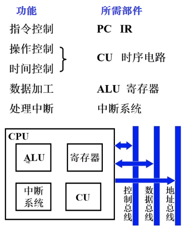

### CPU的寄存器

1. 用户可见寄存器
	- 通用寄存器：存放操作数；可作为某种寻址方式所需的专用寄存器
	- 数据寄存器：存放操作数（满足各种数据类型）；可以将两个寄存器拼接来存放双倍字长的数据（乘法运算）
	- 地址寄存器：存放地址（其位数应满足最大的地址范围）；可以用于特殊的寻址方式（段基址、栈指针）
	- 条件码寄存器：存放条件码（作为程序分支的依据，比如正、负、0、溢出、进位等）

2. 控制和状态寄存器

	- 控制寄存器：控制CPU操作

		比如取指令的过程中，PC寄存器将指令地址发送给主存地址寄存器，主存地址寄存器MAR再将地址发送给主存储器M，控制单元发出命令让主存储器M将指令取出并放到主存数据寄存器MDR，然后进一步放到IR寄存器中。这个过程中用到的寄存器都是控制寄存器，其中MAR、MDR、IR是用户不可见的，PC是用户可见的（指用户可以利用和读取寄存器中的值）

	- 状态寄存器：反映指令执行结果情况或软硬件状态

		① 状态寄存器：存放条件码

		② PSW寄存器：存放程序状态字（程序状态字是指一系列用于在程序中断或子程序调用时保存现场和断点信息的寄存器，将这一系列寄存器组合成一个大的寄存器，就叫PSW寄存器。这种方式使得不需要大量指令来完成程序切换，只需要交换程序状态字就可以完成）

### 控制单元CU和中断系统

1. 控制单元CU

	产生全部指令的微操作命令序列。

	- 组合逻辑设计：硬连线逻辑，精简指令集
	- 微程序设计：存储逻辑，复杂指令集

2. 中断系统

	包括中断装置和中断处理程序。

---

## 指令周期

### 概述

指令周期指取出并执行一条指令所需的全部时间（即解释一条指令的时间）

**完成一条指令的过程**

1. 取指、分析 --> 取指周期

2. 执行 --> 执行周期

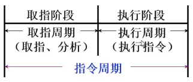

**每条指令的指令周期不同**

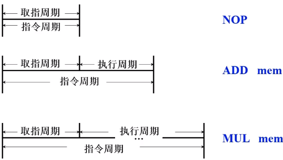

**具有间接寻址的指令周期**

因为间接寻址的时间比较长，可以单独形成一个周期。每个周期进行一次访存，取指周期访存取指令，间址周期访存取操作数地址，执行周期访存取操作数。

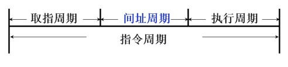

**带有中断周期的指令周期**

中断周期用于有中断请求的机器上，需要执行查询是否有中断请求、响应中断请求、保护现场和断点、形成中断服务的入口地址、硬件关中断等操作。

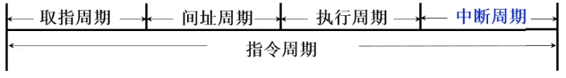

**指令周期的流程**

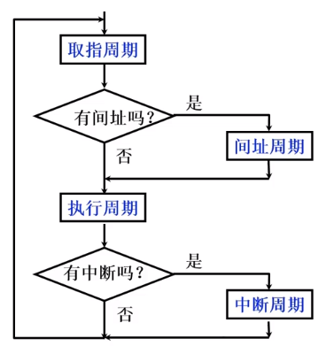

**CPU工作周期的标志**

用于标识和告诉控制器当前处于指令周期的哪个阶段。

比如CPU在不同周期对于内存的访问所执行的操作都是不同的，因此就需要标志来告诉CPU访存需要执行什么操作。

采用四个D触发器FE（取指）、IND（间址）、EX（执行）、INT（中断）来标识这四个工作周期。

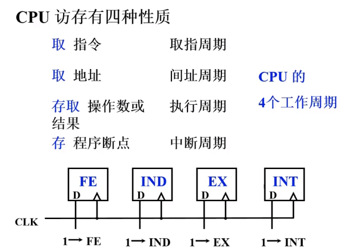

### 指令周期的数据流

1. 取指周期的数据流

	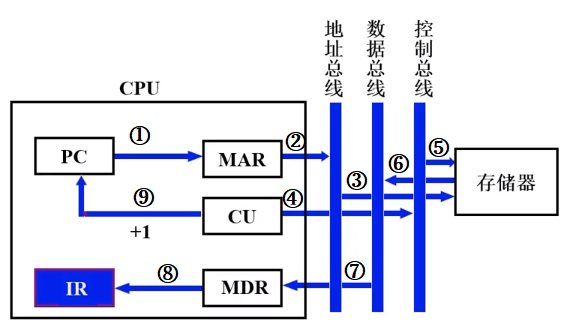

2. 间址周期的数据流

	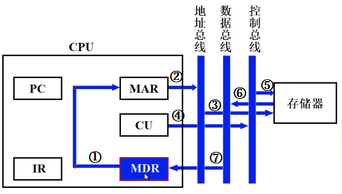

3. 执行周期的数据流

	不同指令的执行周期数据流不同

4. 中断周期的数据流

	① ~ ⑦ 保存断点、⑧ 形成中断服务程序的入口地址（写入PC）

	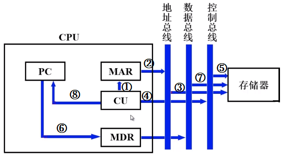

---

## 指令流水

### 提高机器速度的方法

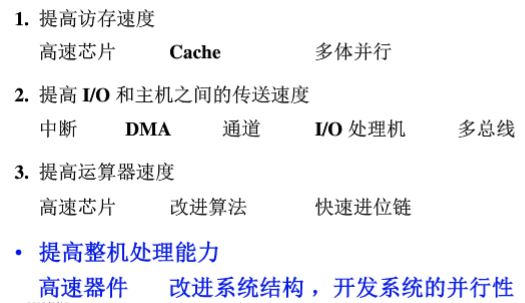

### 系统的并行性

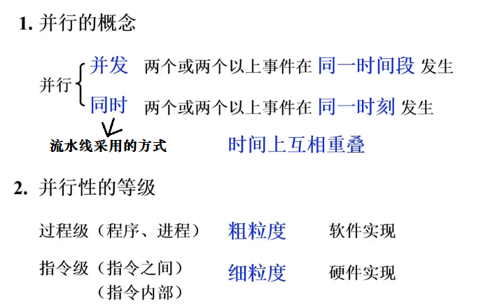

### 指令流水的原理

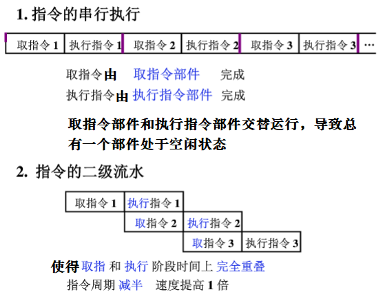

### 影响指令流水加倍效率的因素

（以二级流水为例，二级指只有两个周期，即取指周期和执行周期）

1. 执行时间＞取指时间

	解决方法：设立一个指令部件缓冲区用于缓存取回的指令，当执行指令部件空闲后，就会从指令部件缓冲取出指令进行执行。

	

2. 条件转移指令

	只有当上条指令执行结束，才能判断是否满足条件，从而确定下条指令的地址，因此造成时间损失

	解决方法：猜测法

### 指令六级流水举例

一个指令周期分为六个工作周期：FI、DI、CO、FO、EI、WO

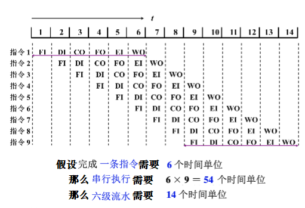

### 影响指令流水线性能的因素

1. 结构相关：不同指令争用同一功能部件产生资源冲突

	比如下图所示，在第4个周期，指令1的FO要将操作数从内存取出，指令4的FI要将指令从内存取出，就导致了访存冲突。

	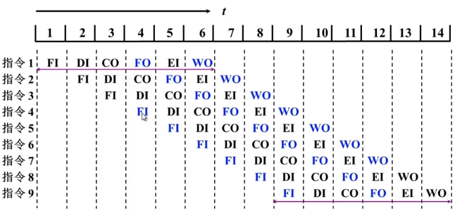

	解决方法：

	① 停顿（让指令4的FI放到第5个周期操作），也称加入气泡

	② 指令存储器和数据存储器分开

	③ 指令预取技术（适合访存周期短的情况）

2. 数据相关：不同指令因重叠操作，导致操作数的读写访问顺序改变，从而使数据出错

	比如写后读操作，由于写指令和读指令重叠，可能使读指令获取的值不是写入后的值。

	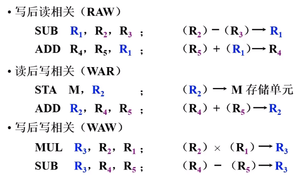

	解决方法：

	① 后推法：在写后读操作中，让读操作推后到写操作完成才开始

	② 采用旁路技术：在写后读操作中，让读操作直接从写运算输出端获取值。

3. 控制相关：由转移指令引起

	比如下图所示，假设指令3是转移指令，那么下一条指令如何进行必须等待指令2执行结束后才知道，所以在指令3的译码阶段（DI）其实并不知道指令4是否执行，而指令4、5、6、7已经进入流水线，如果转移条件成立并进入到指令15，那么指令4、5、6、7已经完成的操作都必须作废，从而造成浪费，形成转移损失。

	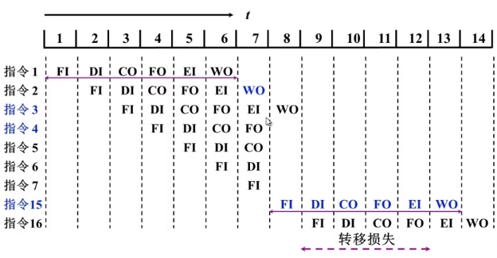

### 流水线的性能指标

1. 吞吐率

	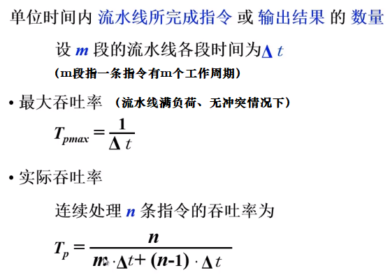

2. 加速比Sp

	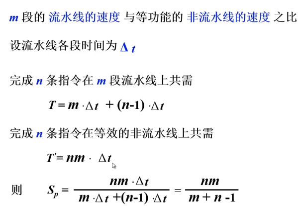

3. 效率：流水线中各功能段的利用率

	在流水线时空图中，S1~S4分别指四个功能段，1~n分别指指令1~指令n

	流水线的建立时间：第1条指令从开始到结束的这段时间

	流水线的排空时间：最后1条指令从开始到结束的这段时间

	由于流水线有建立时间和排空时间，因此各功能段的设备不可能一直处于工作状态，所以可以利用各功能段的利用率来衡量流水线的效率

	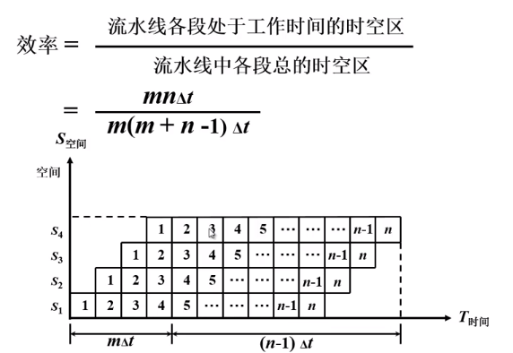

### 流水线的多发技术

在流水线的基础上，进一步提高指令速度的方法。

1. 超标量技术

	使用多条流水线，通过编译优化技术，挑选出可并行执行的多条指令，让它们同时进入不同流水线中进行解释。

	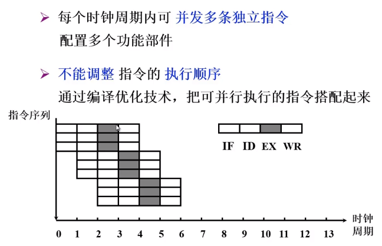

2. 超流水线技术

	把一个流水段继续细分成多段，使得多条指令可以在同一个流水段内进行解释，即指令可以提前进入流水段，从而提高指令速度。

	流水段之间通常有锁存器来暂存数据，而通过超流水线技术继续细分的每一段之间是不需要锁存器的。

	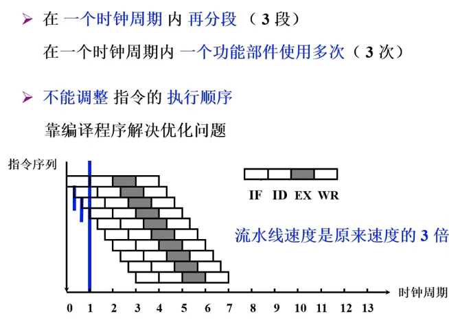

3. 超长指令字技术

	通过编译程序找出多条可以并行执行的指令，然后将它们组合成一个超长指令字，由多个并行的功能部件同时执行该超长指令字的不同操作，即相当于同时执行多个指令。

	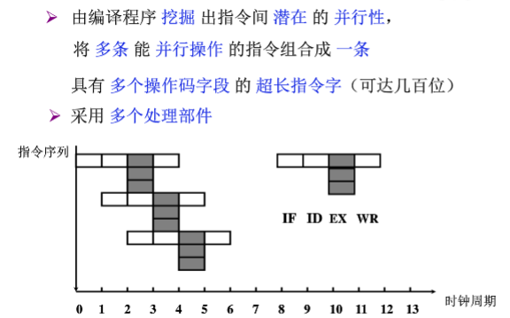

### 流水线结构

1. 指令流水线结构

	把指令的解释过程分成多段，然后通过流水线的形式进行执行。

	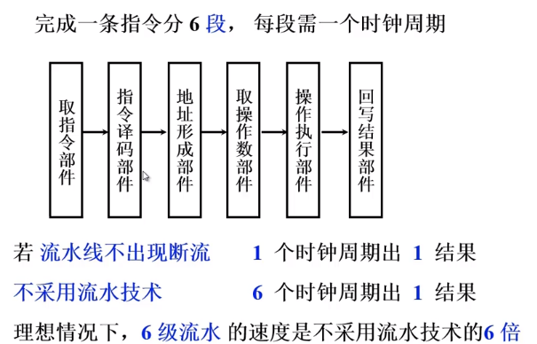

2. 运算流水线结构

	将运算过程分成多段，然后通过流水线的形式进行执行。

	

指令流水

---

## 中断系统

### 概述

1. 引起中断的各种因素

	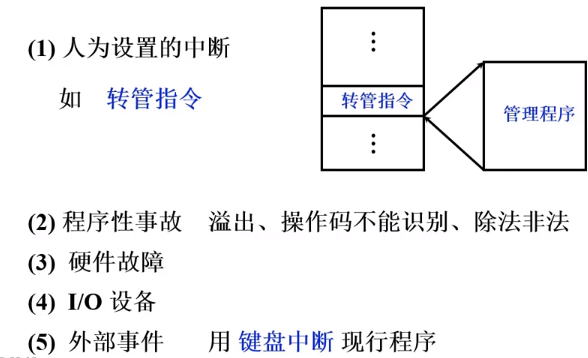

2. 中断系统需要解决的问题

	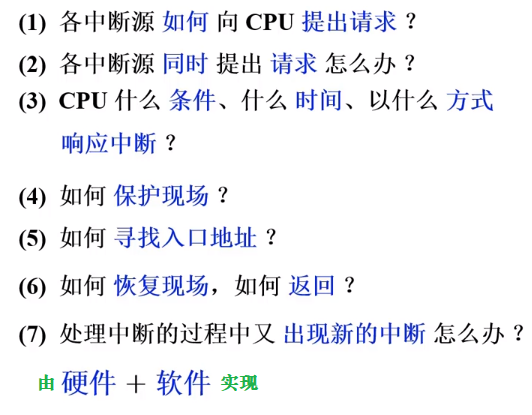

### 中断请求标记和中断判优逻辑

1. 中断请求标记 INTR

	给每一个中断源设置一个中断请求标记触发器，用该触发器来标记这个中断源是否提出了中断请求。多个中断请求标记触发器就组成了中断请求标记寄存器。

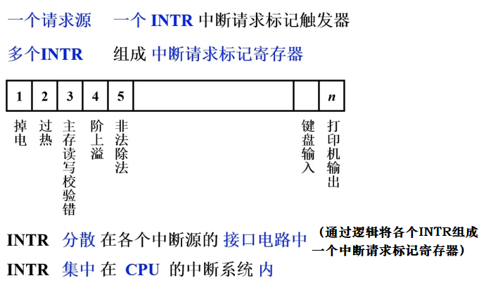

2. 中断判优逻辑

	当有多个中断请求时，由中断判优逻辑确定哪个中断请求优先级最高，优先级最高的中断请求优先响应。

	- 硬件实现（链式排队器）

		① 将判优电路分散在各个中断源的接口电路中，然后连接起来

		② 将判优电路集中在CPU中，然后连接起来

		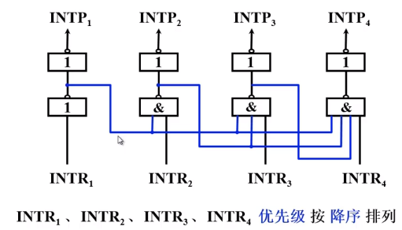

	- 软件实现（程序查询）

		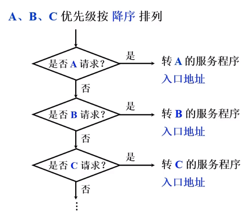

### 中断服务程序入口地址的寻找

1. 硬件向量法

	将排队器的输出输入到一个向量地址形成部件中，向量地址形成部件根据排队器的输出直接形成一个中断向量地址，然后根据中断向量地址就可以找到内存中存放的中断服务程序的入口地址或跳转指令。

	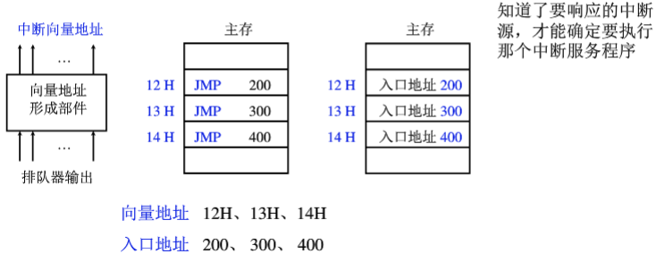

2. 软件查询法（中断识别程序）

	SKP DZ 1#指令表示如果1号中断源的完成触发器为0（说明1号中断源没有提出中断请求），那么跳过下一条指令，执行SKP DZ 2#指令；如果1号中断源的完成触发器为1（说明1号中断源提出了中断请求），那么执行下一条指令JMP 1#SR，跳转到1号中断源对应的中断服务程序进行执行。其余指令操作过程以此类推。

	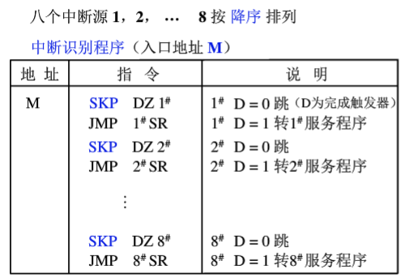

### 中断响应的条件和时间

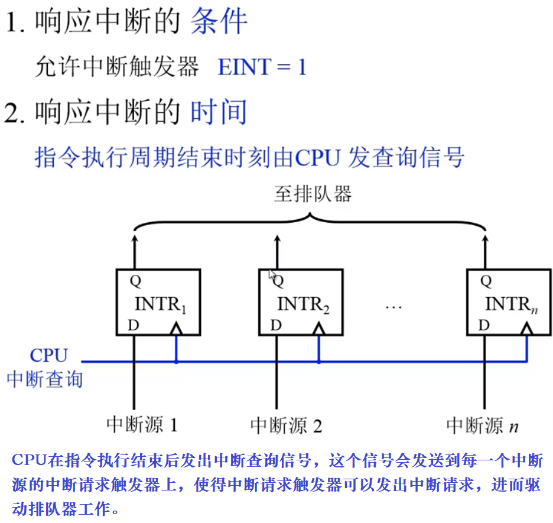

### 中断隐指令

隐指令指该指令的操作均由计算机的硬件来完成，但其本身并不是指令集中的某一条指令。中断隐指令指这些操作都会在中断响应时由硬件自动完成。

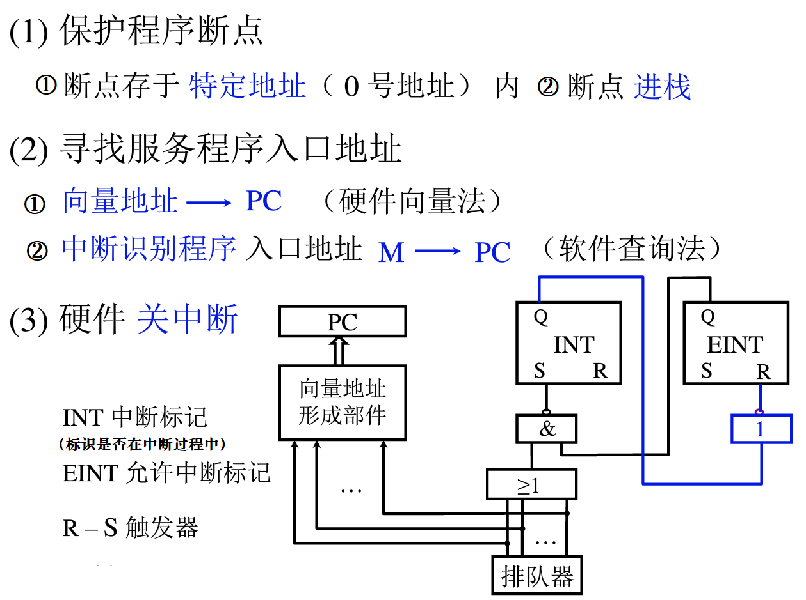

硬件关中断的原因：① 使采用单重中断方式的机器在执行中断服务程序时不被其他中断请求中断；② 使采用多重中断方式的机器在保护软硬件状态的过程中不被其他中断请求中断。

### 保存现场和恢复现场

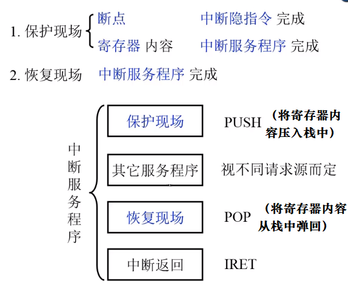

### 多重中断

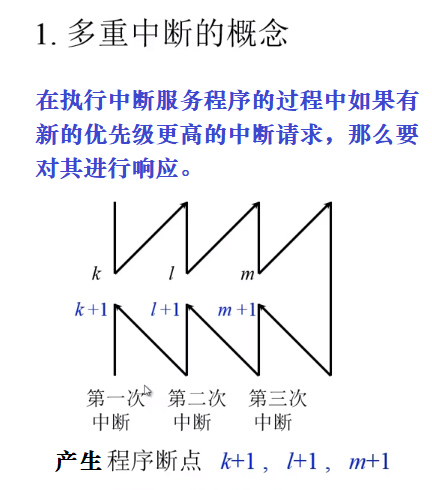

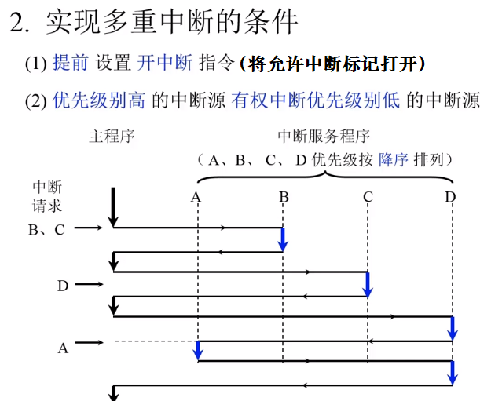

### 中断屏蔽技术

通过设置中断屏蔽字，使得某些中断源发出的中断请求无法进入排队器排队，从而不能被CPU响应。

1. 屏蔽触发器的作用

	每个中断源都有一个屏蔽触发器，屏蔽触发器的值分别对应中断屏蔽字上某一位的值，如果该值为1，那么其对应的中断源就无法发送中断请求。

	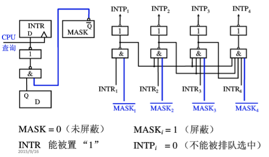

2. 中断屏蔽字

	每个中断源都有一个屏蔽字，当该中断源的中断服务程序执行时，其对应的屏蔽字就会生效。屏蔽字的每一位对应一个屏蔽触发器，值为1对应的屏蔽触发器就会生效，从而屏蔽该屏蔽触发器对应的中断源。

	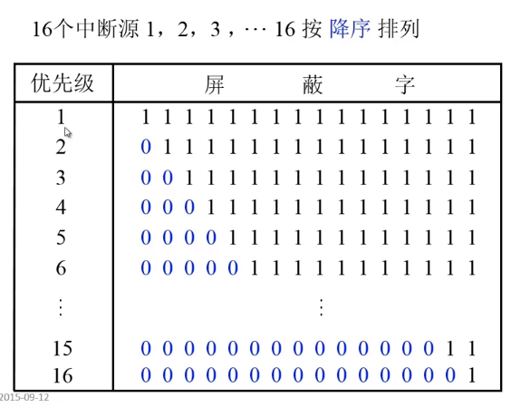

3. 通过屏蔽技术改变处理优先级

	屏蔽技术可以通过重新设置屏蔽字改变处理优先级，但是屏蔽技术无法改变响应优先级。

	举例说明

	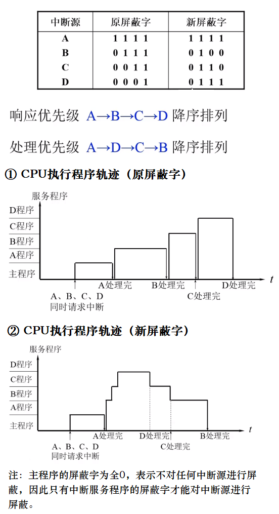

4. 屏蔽技术的其他应用

	可以人为地屏蔽某个中断源的请求。

5. 屏蔽字的设置阶段

	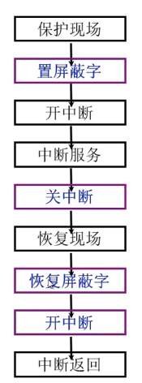

### 多重中断的断点保护

断点保护有两种方式：① 断点进栈（由中断隐指令完成）；① 断点存入“0”地址（由中断隐指令完成）

1. 断点存入“0”地址的问题

	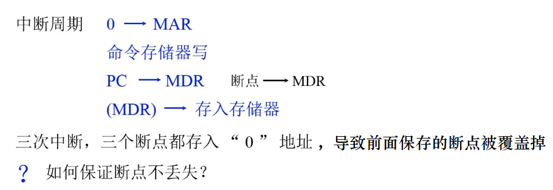

2. 解决方法：转存“0”地址保存的断点内容

	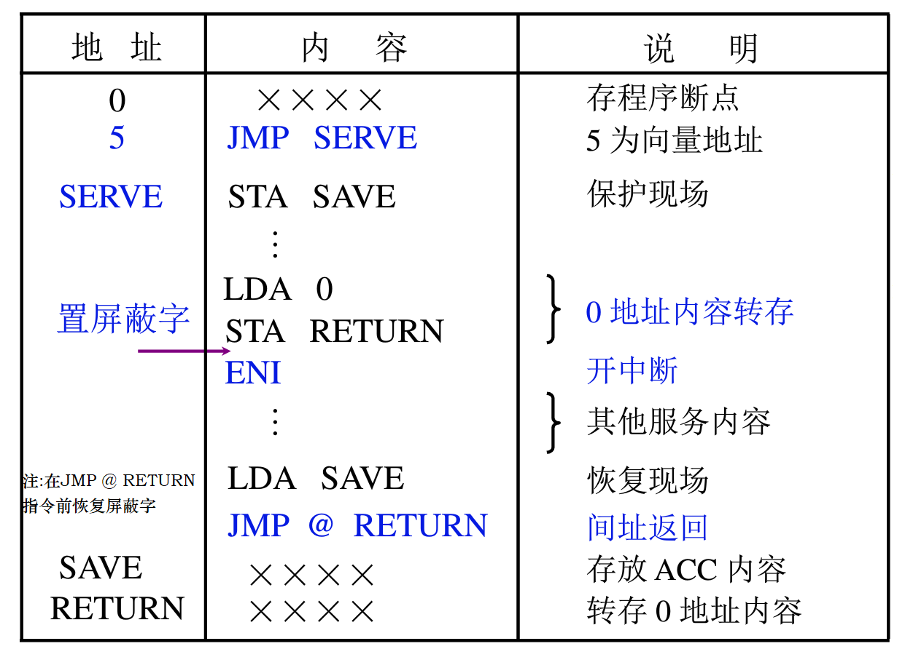

	某些指令的解释：

	STA SAVE  // 将ACC中的内容保存到SAVE地址中

	LDA 0  // 将0地址中的内容（断点）加载到ACC中

	STA RETURN  // 将ACC中的内容保存到RETURN地址中

	LDA SAVE  // 将SAVE地址中的内容加载到ACC中

	JMP @ RETURN  // 跳转到RETURN地址中保存的断点地址