# 计算机组成原理-存储器

## 概述

### 存储器分类

1. 按存储介质分类
	- 半导体存储器（U盘、内存条）：采用TTL或MOS，易失
	- 磁表面存储器（磁盘、磁带）：采用磁头、磁载体，通过磁化方向表示1、0，非易失
	- 磁芯存储器：采用硬磁材料或环状元件，通过导线通电磁化磁芯，以磁芯的电场方向表示0、1，非易失
	- 光盘存储器：采用激光或磁光材料，非易失
2. 按存取方式分类
	- 存取时间与物理地址无关（随机访问）：给出地址直接存取
		- 随机存储器RAM：在程序执行过程中可读可写
		- 只读存储器ROM：在程序执行过程中只读
	- 存取时间与物理地址有关（串行访问）：给出地址，需要先花一定时间找到地址所指位置，然后进行存取
		- 顺序存取存储器：磁带
		- 直接存取存储器：磁盘
3. 按在计算机中的作用分类
	- 主存储器
		- RAM：静态RAM、动态RAM
		- ROM：MROM、PROM、EPROM、EEPROM
	- Flash Memory：U盘，SSD，比主存储器慢，比辅存块
	- 高速缓冲存储器（Cache）：作为主存储器和CPU之间的缓冲，比主存储器块，通常用静态RAM制成
	- 辅助存储器：磁盘、磁带、光盘

### 存储器的层次结构

**层次结构和存储器主要特性的关系**

> **题外话：**
>
> - 体系结构寄存器：对程序员不透明，可以通过指令操作
>
> - 非体系结构寄存器：对程序员透明

#### 存储体系

任何一个存储器都无法满足高速度、大容量、低价格的特点，因此需要构建一个存储体系：

- 由两种或两种以上的存储介质构成的存储器，用软件、硬件或软硬件相结合的方式将它们连成一个整体，使得从某一级程序员的角度来看，这个整体具有高速度、大容量、低价格的特点，即存储器的层次结构是透明的，程序员在使用存储器的过程中不需要考虑存储器的层次结构，信息在层次结构中的流动是通过软件、硬件或软硬件相结合的方式自动完成的

#### 两个重要的层次结构

**缓存-主存层次**

- 用硬件的方式构成一个整体，用于解决主存速度慢于CPU的问题。
- 该层次构成的整体的地址空间由主存储器的地址定义，叫做实地址，即物理地址。

**主存-辅存层次**

- 用软硬件相结合的方式构成一个整体，用于解决主存容量不足的问题。
- 该层次构成的整体叫做虚拟存储器，其地址空间由虚地址定义，即编写程序时使用的逻辑地址，真正的物理地址在实际操作时给出。

> **题外话：**
>
> 程序的局部性原理（用于解决程序存放在辅存中且大小大于主存时如何连续执行程序的问题）
>
> - 时间局部性：程序在执行的一段时间内，其执行仅限于程序中的某一部分。
>
> - 空间局部性：执行所访问的存储空间也局限于某一个内存区域。

---

## 主存储器

### 概述

#### 基本组成

- 存储体由大量的存储单元组成，存储了各种数据

- MAR保存了要访问存储单元的地址，必须通过译码器译码后才能选定存储单元
- MDR保存了读写数据，通过控制电路控制读写电路是读还是写
	- 如果是写，那就将MDR中的数据写入MAR指定的存储单元
	- 如果是读，那就将MAR指定的存储单元中的数据读取到MDR

#### 与CPU的联系

通过三种信号（总线）进行连接：

- 数据总线：可读可写，双向的
- 地址总线：给出要访问地址，单向的
- 控制总线：读写两条线，都是单向的

#### 存储单元地址分配

主存编址单位为字节，存储体中每一个字节就分配一个地址，即地址0、1、2、3、...... 、n将从首字节按顺序分配到尾字节。如果存储字长为32位，则每四个字节构成一个存储单元，一个存储单元就包含了四个地址，而存储单元本身的地址（字地址）由存储单元中四个地址中的某一个地址指定。

假设有数据12345678H，应如何进行存储？数据为16进制，一共包含32位，刚好保存在一个存储单元中，有两种地址分配方式：

- **大端（大尾）方式**
	- 将数据以每四位（1字节）的形式按从高位到低位的顺序存储到存储单元中
	- 以高位字节的地址作为该存储单元的字地址
- **小端（小尾）方式**
	- 将数据以每四位（1字节）的形式按从低位到高位的顺序存储到存储单元中
	- 以低位字节的地址作为该存储单元的字地址

**CPU的寻址范围**（只与地址线有关，假设存储器有24根地址线）

- 按字节寻址，每一地址可以标识一个字节，则寻址范围为2^24=16M，寻址空间为16MB（1B=8bit=1byte）；

- 按字寻址（需留出一些地址线，用于指出字中的哪个字节）
	- 字长16位（2个字节），需留出1根地址线（0、1）来指定字节，则寻址范围为2^(24-1)=8M，寻址空间为8MW（1W表示1字长）
	- 字长32位（4个字节），需留出2根地址线（00、01、11、10）来指定字节，则寻址范围为2^(24-2)=4M，寻址空间为4MW

> 地址线：用于传输地址信号，一根地址线代表地址中的一位，可以产生两个地址0和1，24根地址线就可以产生2^24个地址用于分配。

#### 主存技术指标

**存储容量**

存放二值的总位数（或字节数）

**存储速度**

1. 存取时间：存储器的访问时间（从给出地址到数据输出或输入这段时间）
	- 读出时间
	- 写入时间

2. 存取周期：连续两次独立的存储器操作（读或写）所需的最小间隔时间，即第一次开始到第二次开始的时间间隔
	- 读周期（读出时间+恢复时间）
	- 写周期（写入时间+恢复时间）

3. 存储器带宽：位/秒

### 半导体存储芯片简介

#### 基本结构

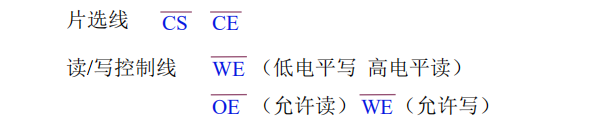

##### 各总线作用

片选线用于判断给出的地址是否在指定芯片中。低电平说明选中，有两种表示法：

- CS：芯片选择信号
- CE：芯片使能信号

地址线说明了有多少个存储单元

数据线说明了存储单元的字长

##### 片选线作用

- 问题：将16K×1位存储芯片组成64K×8位的存储器。
- 分析：
	- 16K×1位存储芯片：地址线14根说明有16K个存储单元；数据线1根说明每个存储单元保存1位信息，一次也只能读写1位信息
	- 64K×8位的存储器：64K个存储单元，一次读写8位信息
- 解决（应从两方面入手）：
	- 要能够一次读写8位信息：将8片存储芯片分成一组，同时利用片选线的作用，使这一组芯片能够同时进行工作，那么对这组芯片就能一次读写8位信息
	- 要有64K个存储单元：布置四组这样的芯片，那就构成了64K个存储单元
- 片选线的作用：将一组芯片连接在一起，当地址线指定的地址在该组芯片中时，连接这组芯片的片选线就生效，使这组芯片同时开始工作，而连接其他组芯片的片选线就失效，其他组的芯片就不能工作。
	- 举例：将0~16K-1的地址分配给第1组芯片，16K~32K-1的地址分配给第2组芯片，32K~48K-1的地址分配给第3组芯片，48K~64K-1的地址分配给第4组芯片。当要访问地址为65535时，由于该地址在第4组芯片中，那么连接该组的片选线就为低电平信号，使该组的8片存储芯片开始工作，可以被同时访问。

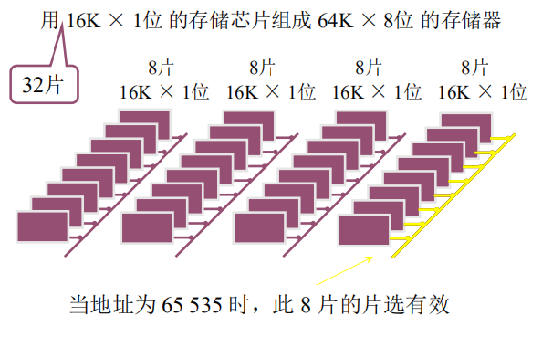

#### 译码驱动方式

给出存储单元的地址后，如何找到指定的存储单元

##### 线选法

工作过程：通过地址译码器将4位二值地址转换为十进制数，使该十进制数对应的字线生效，从而让该字线上连接的所有存储单元都可以被访问。

存在问题：如果地址线过多，则字线的数量会非常庞大。

特点：存储单元采用线性数组的布局方式

##### 重合法

工作过程：将地址译码器分为X地址译码器和Y地址译码器，两个译码器分别译码地址总位数的一半，只有两个译码器译码后对应生效的字线重合部分的存储单元才能被访问和进行信息的读写。

特点：存储单元采用二维矩阵的布局方式，大大减少了字线总数。

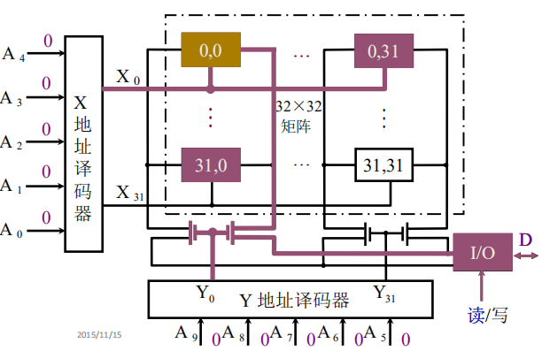

### 随机存取存储器RAM

#### 静态RAM(SRAM)

##### 基本单元电路

1. 基本构成

	T1~T4表示1个双稳态触发器，由4个晶体管T1~T4组成，A 和 A‘ 分别为该触发器的原端和非端。该触发器用于存储0和1，构成了存储元件的存储电路。

	T5和T6是行地址选择器开关，当该地址被选中时，T5和T6这两个晶体管就会打开，使这一行的触发器被导通。

	T7和T8是列地址选择器开关，当该地址被选中时，T7和T8这两个晶体管就会打开，使这一列的触发器被导通。

	虚线框中还包含其他存储元件，分别向虚线框的纵向和横向延伸，纵向的1列存储元件由列地址选择器控制，横向的1行存储元件由行地址选择器控制。只有被列地址选择器和行地址选择器同时选中的存储元件才能被读写电路进行读写操作。

	T5~T8构成了存储元件的读写控制电路。

	写入数据时分两个方向，一个方向写入触发器的原端，另一个方向写入触发器的非端。

	读出数据时只有一个方向，用于将触发器的原端进行输出。

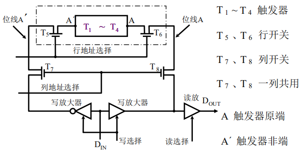

2. 读写操作

	- 读操作：

		- 给出行选信号，打开T5、T6开关

		- 给出列选信号，打开T7、T8开关

		- 给出读选择信号，那么读放大器就被导通，存储在A端的信息就会通过位线A输出到Dout

		- 由于写放大器不导通，那么 A‘ 端的信息在输出时就被写放大器拦截

			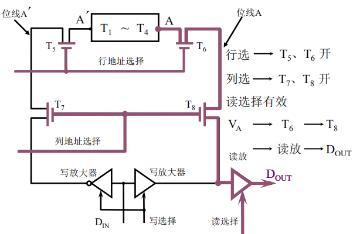

	- 写操作：

		- 行选 => 列选

		- 给出写选择信号，那么两个写放大器就被导通，从Din输入的数据就可以通过两个写放大器进入电路，一个写放大器对数据取反，用于输入到触发器非端，另一个放大器将数据原样输入到触发器原端。

			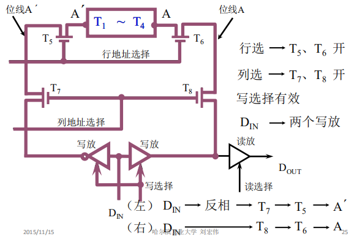

##### 典型静态RAM芯片Intel 2114

- 基本结构
	- WE为读写控制信号，低电平为写
	- CS为片选信号，低电平为选中
	- 地址线10条（A0~A9）=> 存储单元有2^10=1K个
	- 数据线4条（I/O1~I/O4）=> 1个存储单元保存4位二值
	- 存储容量为1K×4位
	- Vcc为电源端，GND为接地端

- 读写操作

	- 将Intel 2114芯片布局成64×64的阵列，采用重合法译码驱动，保证列译码时产生的列选择信号一次能够控制4列存储单元进行输出（即输出4位二值）
		- 行选信号6位，产生64个控制信号，控制64行存储单元，每次输出控制信号生效对应那一行的存储单元
		- 列选信号4位，产生16个控制信号，控制4组存储单元，每组16列，每次输出每组中控制信号生效对应那一列的存储单元，总共输出四列

	- 读操作

		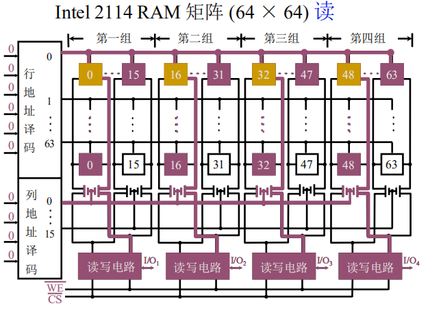

	- 写操作

		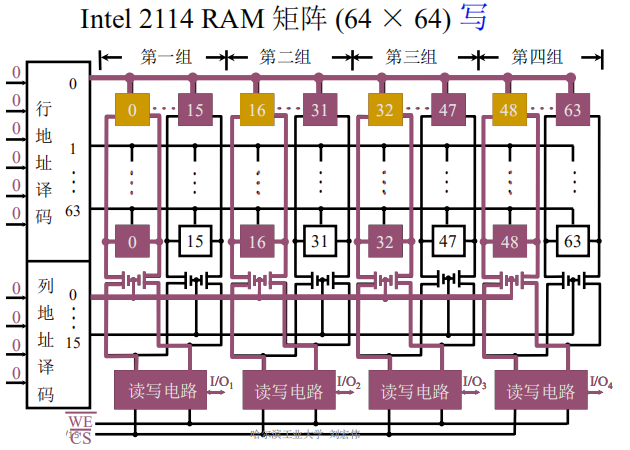

#### 动态RAM(DRAM)

##### 保存0和1的原理

采用电容进行存储，如果电容中保存了电荷，则表示1；如果电容中没有电荷，则表示0。

##### 基本单元电路

1. 基本结构

	- 三管结构

		T1~T3用于控制读写电路，Cg为存储电容

		① 读操作：

		- 给出预充电信号，使T4导通
		- 电源端VDD通过T4给读数据线充电，使读数据线变成高电平（信号为1）
		- 给出读选择信号，则读选择线有效，T2管导通
		- 如果Cg电容信号为0（没有充电），则T1管不导通，读数据线直接将高电平信号输出；如果Cg电容信号为1（充电了），则T1管导通，读数据线通过地线进行放电，变为低电平（信号为0），然后将低电平信号输出。

		② 写操作：

		- 给出写选择信号，则T3管导通

		- 写数据线就可以直接通过T3管对Cg电容进行充电或放电，即写数据线输入低电平，则Cg放电；写数据线输入高电平，则Cg充电

			

	- 单管结构

		字线用于选择基本电路，数据线用于读写，Cs为存储电容

		① 读操作：

		- 如果该基本电路被选中，则字线有效，使T管打开，Cs就可以通过T管进行充电或放电
		- 若Cs为0，则无电流产生，数据线输出0；若Cs为1，则有电流产生，数据线输出1

		② 写操作：

		- 如果该基本电路被选中，则字线有效，使T管打开，数据线就可以通过T管对Cs进行充电或放电

		- 写入信号为1，就对Cs进行充电；写入信号为0，就对Cs进行放电

			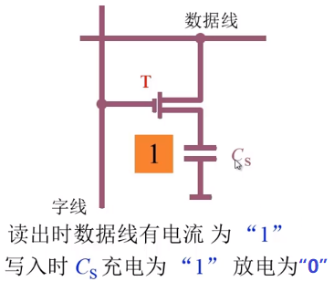

##### 典型芯片的结构和读写操作

三管动态RAM芯片（Intel 1103）

- 基本结构

	- 10位地址，1位读写数据 => 存储容量 1K×1位
	- 行地址信号对应两条控制线（读选择线、写选择线），即参与译码的信号包括地址信号和读写控制信号
	- 三角形器件：刷新放大器，用于每隔一段时间重写电容（电容会漏电），每一列存储单元都有一个刷新放大器，放置于写数据线和读数据线之间

- 读操作

	- 给出行地址信号和读选择信号，使某行存储单元的读选择线有效
	- 给出列地址信号，则行列重合单元被选中，可以进行读写操作
	- 将选中单元的数据送到读写控制电路，向外进行输出

- 写操作

	- 给出行地址信号和写选择信号，使某行存储单元的写选择线有效
	- 给出列地址信号，则行列重合单元被选中，可以进行读写操作
	- 将外部数据从读写控制电路写入选中单元

	

	

单管动态RAM芯片（Intel 4116）

- 基本结构

	- 存储容量16K×1位
	- 7位地址线，进行两次输入，所以总共包括14位地址信号，构成16K个存储单元。第一次输入为行地址，输入到行地址缓存器中；第二次输入为列地址，输入到列地址缓存器中。列地址和行地址经过译码后选中给定的存储单元进行读写操作。
	- I/O缓存器用于缓存输出和输入的数据，与数据输入寄存器和数据输出驱动共同完成数据的输入和输出
	- 时序控制器：由行选中信号RAS、列选中信号CAS、读写控制信号WE作为输入，产生行时钟、列时钟、写时钟，用于控制芯片内部的读写操作
	- 读放大器：在每列存储单元中都有一个读放大器，用于反转某一端的信号，即如果将读放大器的某一端强制为1，那么其另一端就会变为0。

	

- 读操作

	- 给出行地址和列地址，则所选中存储单元中电容的信息会被输出。如果选中行在读放大器的左端，则电容输出的信息会被读放大器反转，使输出信息与存储信息相反；如果选中行在读放大器的右端，则电容的信息直接被输出，使输出信息与存储信息相同‘

		

- 写操作

	- 给出行地址，选中指定行的存储单元

	- 输入数据，使数据从I/O缓冲输入到读写线上

	- 给出列地址，打开指定列存储单元的读写开关，使数据输入到所选中存储单元的电容中

	- 如果选中行在读放大器的左端，则输入的信息会被读放大器反转，使输入信息与存储信息相反；如果选中行在读放大器的右端，则输入的信息直接被存储到电容中，使输入信息与存储信息相同

		

##### 动态RAM刷新

电容容易漏电，一段时间后需要对电容再一次充电（刷新）

刷新只和行地址有关，一次刷新一行的基本单元电路

1. 集中刷新：将刷新集中在一段时间内进行

	- 一共128行存储单元，1次刷新1行，用时1个存取周期，总共刷新128次，总用时128个周期。将128次刷新都集中在刷新时间间隔的末端。
	- 用于刷新的128个周期形成死区，无法进行读写操作

	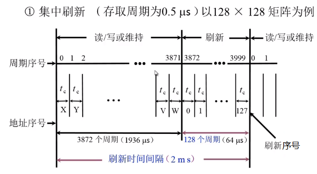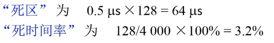

2. 分散刷新

	- 1次存取刷新1行，存取周期=存取时间+刷新时间，总共需要128个周期来刷新所有行

	- 和集中刷新相比，分散刷新在2ms内重复刷新了存储单元15.6次，造成过度刷新；存取周期加长，降低芯片性能；无死区

		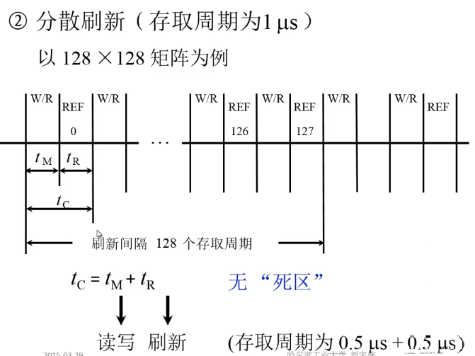

3. 异步刷新（分散刷新与集中刷新相结合）

	- 将128次刷新平均分散到2ms内，每隔15.6μs刷新一行，每行每隔2ms刷新一次

	- 一次刷新间隔内有0.5μs的死区，但将刷新安排在指令译码阶段，就不会出现死区

		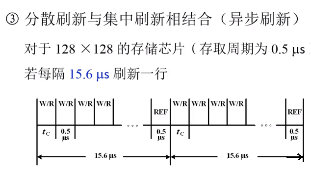

#### 两种RAM的比较

1. 集成度：DRAM结构比较简单；SRAM结构比较复杂
2. 芯片引脚：DRAM的地址分两次输入，地址线减半，引脚数较少
3. 功耗：SRAM存储触发器中的三个晶体管始终导通
4. 速度：DRAM电容需要充放电、刷新，地址分两次输入，均使其速度更慢；SRAM使用触发器，速度更快

### 只读存储器ROM

一般用于保存系统程序或系统配置信息

#### 掩模ROM(MROM)

厂家直接将信息存储到ROM中，用户不得修改，数据只能读，不能擦除。通过选中存储单元有无MOS管表示信息，MOS管在出厂时就已经规定好，无法在改变。

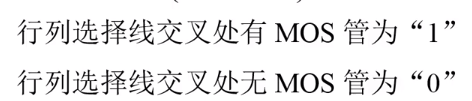

#### PROM(一次性编程)

通过熔丝的通与断表示信息，一旦熔丝断开就无法再连接，导致不能再次编程。

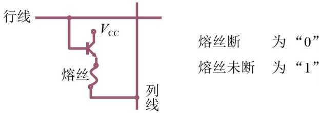

#### EPROM(多次性编程)

通过浮动栅的有无表示信息，可以通过紫外线照射消除浮动栅，从而擦除信息，进行多次编程。

#### EEPROM(多次性编程)

采用电可擦写的方式，可以局部擦写或全部擦写

#### Flash Memory(闪速型存储器)

比EEPROM块，具备RAM功能

### 存储器与CPU的连接

#### 存储器容量的扩展

**位扩展**

1. 目的：增加存储单元的存储字长

2. 举例：2片1K×4位的存储芯片 => 1K×8位的存储器

	- 原理：让2片芯片采用相同的片选，使它们被同时选中，分别提供4位信息，构成8位信息的读写

	- 连接方式

		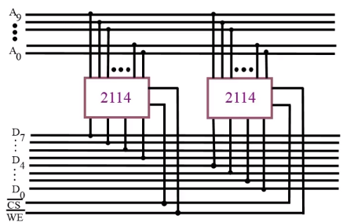

**字扩展**

1. 目的：增加存储单元的数量

2. 举例：2片1K×8位的存储芯片 => 2K×8位的存储器

	- 原理：利用多出来的一条地址线作为两个存储芯片的片选线

		- 00...0到01....1的地址分配给第一个芯片，10...0到11...1的地址分配给第二个芯片

	- 连接方式

		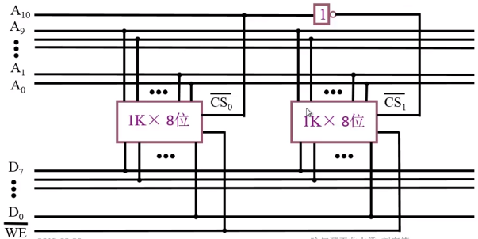

**字、位扩展**

1. 目的：同时增加存储字数量和存储字长

2. 举例：8片1K×4位的存储芯片 => 4K×8位的存储器

	- 原理：将8片芯片分成4组，每组2个芯片，每组芯片采用相同片选形成1K×8位的存储容量，利用多出来的2条地址线作为4组芯片的片选线

		- 000...0 ~ 001...1地址分配给第1组
		- 010...0 ~ 011...1地址分配给第2组
		- 100...0 ~ 101...1地址分配给第3组
		- 110...0 ~ 111...1地址分配给第4组

	- 连接方式 

		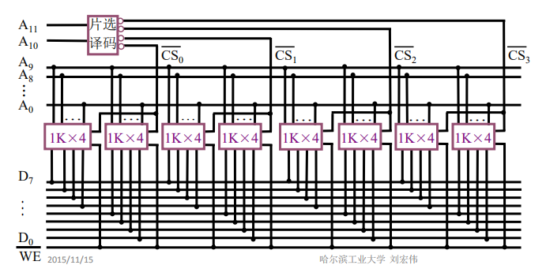

#### 存储器与CPU的连接

#####  基本步骤

1. 地址线的连接
	- 一般将CPU发出的地址信号的低位部分与存储器的地址线相连，高位作为片选信号或用于存储器扩展
2. 数据线的连接
	- CPU给出的数据线比存储器多，此时需要做位扩展
3. 读/写命令线的连接
	- 直接连接到每一个芯片的读/写控制端上
4. 片选线的连接
	- 哪一片存储芯片被选中完全取决于该存储芯片的片选控制端CS是否能接收到来自CPU的片选有效信号
	- 片选有效信号通常包含两个方面：
		- CPU的访存控制信号MREQ（低电平有效）。因为只有当CPU要求访存时，才需选择存储芯片。若CPU访问I/O，则MREQ为高电平，表示不要求存储器工作，无需片选。
		- CPU发出的地址信号。因为CPU发出的地址信号往往多于存储芯片的地址引脚，故那些未与存储芯片连上的高位地址必须和访存控制信号共同产生存储芯片的片选信号，通常需用到译码器。
5. 合理选择存储芯片
	- 是RAM还是ROM
	- 芯片数量尽可能少，构成的片选逻辑尽可能简单
6. 信号传输方向
	- 地址信号、控制信号都是由CPU发出流向各芯片；由于RAM是可读写的，所以CPU和RAM之间的数据信号可双向流动；ROM是只读的，则数据只能是从ROM读出，单向流入CPU。
7. 其他：时序（CPU与存储器的时序相互配合）、负载（CPU能够带多少个存储芯片）

##### 举2个例子

- 【例】设CPU有16根地址线、8根数据线，并用MREQ作为访存控制信号（低电平有效），用WR作为读/写控制信号（高电乎为读，低电平为写）．现有下列存储芯片：1K×4位RAM、4K×8位RAM、8K×8位RAM、2K×8位ROM、4K×8位ROM、8K×8位ROM及74138译码器和各种门电路，如图7.20所示．画出CPU与存储器的连接图，要求如下：

	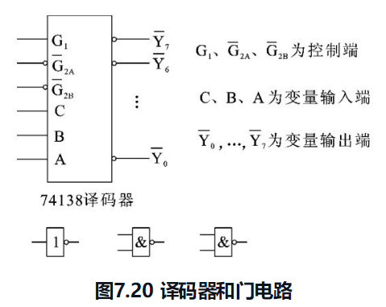

	① 主存地址空间分配：6000H～67FFH为系统程序区；6800H～6BFFH为用户程序区。

	② 合理选用上述存储芯片，说明各选几片。

	③ 详细画出存储芯片的片选逻辑图。

	**解题步骤：**

	1. 写出二进制地址码，确定存储容量以及芯片的类型和数量

		 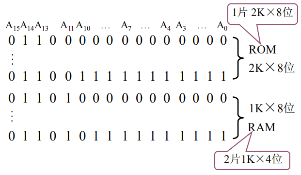

	2. 分配CPU的地址线

		将CPU的低11位地址A10～A0与2K×8位的ROM地址引脚相连；将CPU的低10位地址A9～A0与2片1K×4位的RAM地址引脚相连。剩下的高位地址与访存控制信号[插图]共同产生存储芯片的片选信号。

	3. 确定片选信号

		由74138译码器输入逻辑关系可知，必须保证控制端G1为高电，G2A与G2B为低电平，才能使译码器正常工作。根据第一步写出的存储器地址范围得出，A15始终为低电平，A14始终为高电平，它们正好可分别与译码器的G2A（低）和G1（高）对应，而访存控制信号MREQ（低电平有效）又正好可与G2B（低）对应。剩下的A13、A12、A11，可分别接到译码器的C、B、A输入端，其输出Y4有效时，选中1片ROM，Y5与A10同时有效均为低电平时，与门输出选中2片RAM。

	4. 其他总线连接

		ROM芯片的编程端接地，RAM芯片的读写控制端与CPU的读写命令端WR相连。ROM的8根数据线直接与CPU的8根数据线相连，2片RAM的数据引脚分别与CPU数据总线的高4位和低4位相连。

		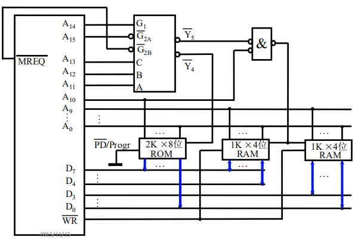

- 【例】假设同前，要求最小4K位系统程序区，相邻8K位用户程序区。

	**解题步骤：**

	1. 写出二进制地址码，确定存储容量以及芯片的类型和数量

	2. 分配CPU的地址线

		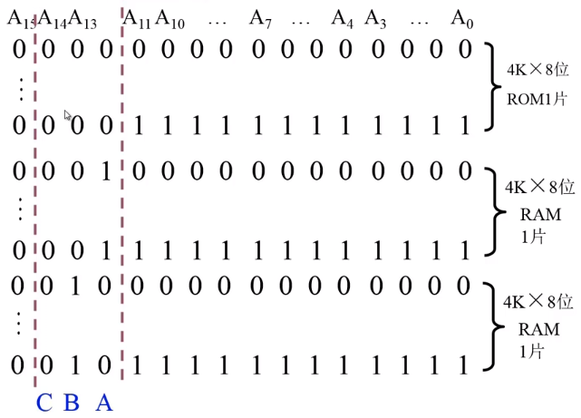

	3. 确定片选信号和片选逻辑

		A12~A14作为译码器的变量输入端；A15始终低电平，与G2A对应；G1需要高电平，可以将A15取反后相连，也可以连接电源；MREQ（低电平有效）与G2B（低）对应。

		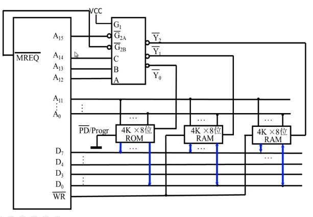

### 存储器的校验

#### 合法代码集合

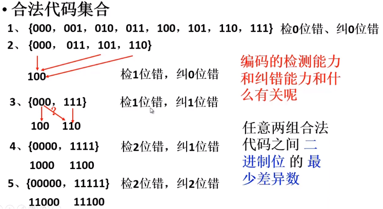

编码的最小距离：

- 任意两组合法代码之间二进制位数的最少差异

编码的纠错位数D和检错位数C与编码的最小距离L直接相关：

- L-1=D+C(D≥C)

#### 汉明码

- 汉明码特点：
	- 汉明码是具有1位纠错能力的编码
	- 采用奇偶校验（增加1位校验位，使整个代码中1的个数为奇数或偶数）
	- 采用分组校验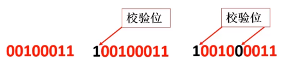
	- 分组采用非划分方式，即组和组之间信息位有重叠

- 举例解释：

	① 分组方式：

	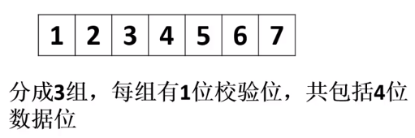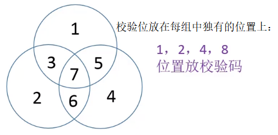

	② 校验方式：采用偶校验，将每组所有位输入异或门中获取校验结果P，若1的个数为偶数则校验结果为0，奇数个则为1。

	③ 纠错方式：P1、P2、P3分别为三组的校验结果，其十进制的值即为出错位置

	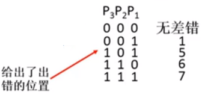

- 编码方式：

	**将原代码中每1位的位置用二进制表示，通过每组校验位所在位置来分组**

	第一组：校验位1（00001）=> xxxx1（凡是第1位为1的二进制所表示的位置都是第1组）

	第二组：校验位2（00010）=> xxx1x（凡是第2位为1的二进制所表示的位置都是第2组）

	第三组：校验位4（00100）=> xx1xx（凡是第3位为1的二进制所表示的位置都是第3组）

	第四组：校验位8（01000）=> x1xxx（凡是第4位为1的二进制所表示的位置都是第4组）

	第五组：校验位16（10000）=> 1xxxx（凡是第5位为1的二进制所表示的位置都是第5组）

	**重叠位置示例**

	由xxx11表示的位置同时存在于第1、2组

	由x1x11表示的位置同时存在于第1、2、4组

	**校验过程**

	如果第1、2组出错而其他组没有出错，那么该错误代码的位置为00011

	如果第1、2、4组出错而其他组没有出错，那么该错误代码的位置为01011

	**分组个数（校验位个数）的依据**

	纠错时要能够指出所有出错的位置，这些位置有n+k个（n为信息位个数，k为校验位个数），还要指出没有错的状态，所以总共有n+k+1个，即2^k≥n+k+1（2^k是k为校验位时纠错结果数的最大值）

	**汉明码最小编码距离**

	最小为3

- 【例】按配偶原则配置0011的汉明码

	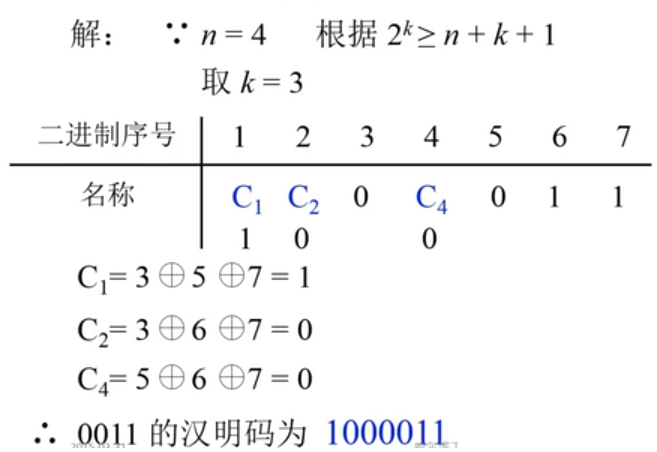

- 【例】接收到汉明码0100111（按配偶原则配置），试问传送的信息是什么？

	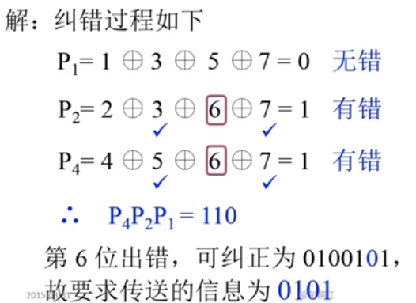

- 【例】对按配偶原则配置的汉明码0101101进行纠错

	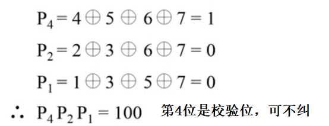

### 提高访存速度的措施

CPU发出访存信号，存储器接收到信号后，要进行一系列寻址、读取数据等操作，在此期间CPU无法干其他事情，只能等待存储器将数据发送给CPU后，CPU才能继续工作。这就造成了存储墙（存储器的速度限制了CPU的速度）。解决方式有：

1. 采用高性能存储芯片
2. 采用Cache-主存的层次结构
3. 调整主存结构

#### 调整主存结构

**单体多字系统**

- 工作过程：CPU字长16位（1条指令16位），存储器存储字长64位，一个存取周期内从存储器取出4条指令（相当于1/4周期读取一条指令，将存储器的带宽提高到4倍），分别存放到数据寄存器中，CPU需要用到指令时直接从数据寄存器中读取。
- 存在问题：存放数据时，CPU一次只能存放16位，可能导致存储单元中的其它48位被修改掉，从而出错；取出的4条指令不是连续的，导致只有部分指令有用。

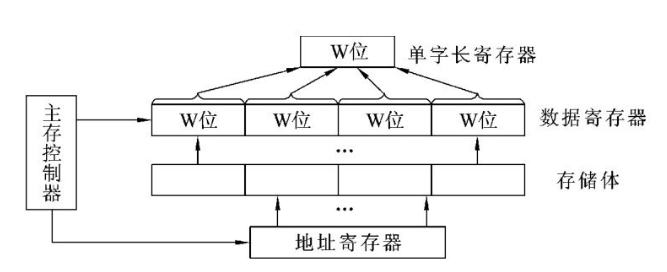

**多体并行系统**

-  工作过程：使用多个存储体作为存储器（多体），每个存储体都有自己的控制电路，都是独立工作的，这样CPU就可以同时发送多条访存信号，同时从存储器的多个存储体中读取多条指令（并行）

- 编址方式

	- 高位交叉（顺序编址）：程序是按序进行存储的，当用顺序编址的方式存储程序时，程序一般会按序存储于一个存储体中，而不是分散在各个存储体上，导致不能并行工作。

	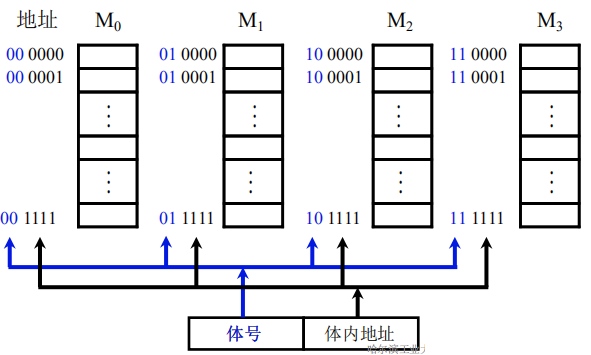

	- 低位交叉（各个存储体轮流编址）：程序按序轮流存放于各个存储体中，可以实现并行工作；在不改变存取周期的前提下，增加存储器带宽；能够实现以流水线的方式来访问不同的存储体。

		【多体存储器的低位交叉编址方式】

		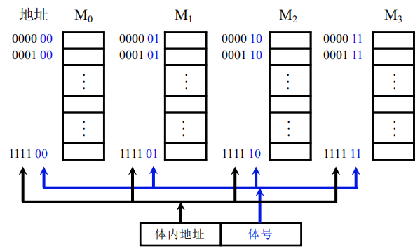

		【各个存储体访问时间关系】

		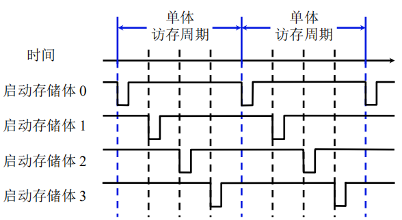

		【四体低位交叉编址存储器流水线工作方式】

		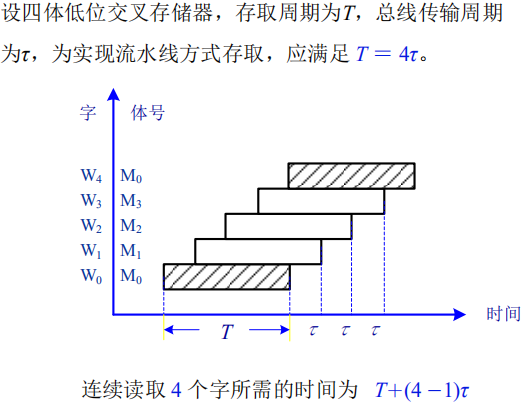

#### 高性能存储芯片

1. SDRAM（同步DRAM）：CPU和存储器能够在系统时钟信号的规定时间内完成给定操作，从而使CPU无需等待。
2. RDRAM：用于解决存储器带宽问题。
3. 带Cache的DRAM：在DRAM芯片中集成一个由SRAM组成的Cache，有利于猝发式读取。
	- 工作过程：Cache可以缓存DRAM一行的存储单元，当CPU发送读取信号时，DRAM先将要读取数据那一行的存储单元缓存到Cache中，当CPU进行下一次读取时，比对行选信号，如果与上一次读取相同，就直接从Cache中进行列选读取所要数据。

---

## 高速缓冲存储器

### 概述

**为什么用Cache？**

1. 避免CPU空等现象：I/O设备向主存请求的级别高于CPU访存，导致出现CPU等待I/O设备访存的现象，致使CPU空等一段时间。

2. 解决CPU和主存的速度差异

**解决方法**

在CPU与主存之间加一级缓存，这样，主存可将CPU要取的信息提前送至缓存，一旦主存在与I/O设备交换时，CPU可直接从缓存中读取所需信息，不必空等而影响效率。

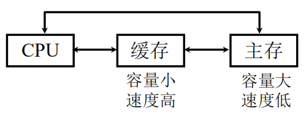

**程序访问的局部性原理**

要让Cache发挥作用，必须保证CPU访问的大部分数据和指令都能在Cache中取到，就要解决Cache应该保存哪些数据和指令的问题。

程序访问的局部性原理有两个方面，时间局部性说明当前使用的数据或指令以后还会用到；空间局部性说明将要使用到的指令或数据与当前使用的指令或数据相邻。这就明确了，Cache应该将正在使用的指令或数据以及其相邻的数据或指令进行保存。

因此，Cache与主存进行数据交换的单位是一块，该块包含了正在使用的指令或数据和相邻的指令或数据，块的大小由实验获得。

#### Cache的工作原理

1. 主存和缓存的编址

	将主存与缓存都分成若干块，块由存储字构成，主存与缓存的块长（块的大小，即包含存储字的数量）都相同。这使得地址分为两段，一段是块号（表示块地址，反映了总块数），一段是块内地址（反映了块长，1个地址对应1个存储字）。

	主存向缓存传输数据是整块传送的，因此所传输块在缓存中的块内地址和在主存中的块内地址是一样的。缓存中每块有一个标记，分别对应其在主存中的块号，形成映射关系。

	当CPU访问主存时，首先会将主存块号和Cache的标记进行比较，如果相同，则说明所要数据在Cache中，从Cache直接读取即可。

	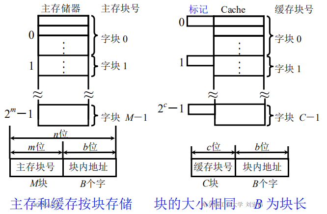

2. 命中与未命中

	- 命中：CPU要访问的块已从主存调入缓存中，可以直接从缓存中读取，即主存块和缓存块建立了对应关系，并且用标记记录对应的主存块号。
	- 未命中：CPU要访问的块没有从主存调入缓存中，只能从主存中读取。

3. Cache的命中率：CPU欲访问信息在Cache中的比率。这里介绍它的2个影响因素：

	- Cache的容量（总块数）：如果总块数与主存一样，那么CPU除了第一次是从主存读取指令外，其它时候都是从Cache中读取指令。

	- Cache的块长：一定程度反映了CPU可以从Cache中读取的指令数量，如果块长太小，那么CPU从缓存中读取几条指令就得从主存读取读取剩余指令了。一般取4~8个字，与一个存取周期内从主存调出的信息长度（多体交叉的存储体数）有关。

4. Cache-主存系统的效率

	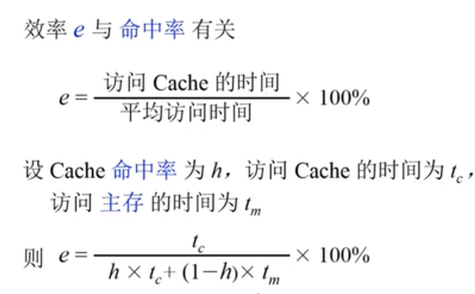

#### Cache的基本结构

（1）Cache存储体Cache存储体以块为单位与主存交换信息，主存采用多体结构，且Cache访存的优先级最高。

（2）地址映射变换机构是将CPU送来的主存地址转换为Cache地址。由于主存和Cache的块内地址相同，因此地址变换主要是主存的块号（高位地址）与Cache块号间的转换。地址变换与主存地址以什么样的函数关系映射到Cache中（称为地址映射）有关。如果转换后的块号命中，则CPU可直接访问Cache存储体；如果转换后的块号不命中，此刻CPU在访问主存时，不仅将该字从主存取出，同时将它所在的主存块一并调入Cache（需要的Cache块未被占用，如果已经占用，就得采用替换策略），供CPU使用。

（3）替换机构当主存块要装入的Cache块被占用，无法接受来自主存块的信息时，就由Cache内的替换机构按一定的替换算法来确定应从Cache内移出哪个块返回主存，而把新的主存块调入Cache。Cache对用户是透明的，即用户编程时所用到的地址是主存地址，根本不知道这些主存块是否已调入Cache内。

#### Cache的读写操作

- 读操作

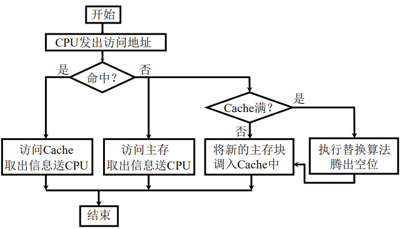

- 写操作
	- 由于要修改数据，必须解决主存和Cache的一致性问题
	- 主要采用以下几种方法：
		1. 写直达法（Write-through）：写操作时数据既写入Cache又写入主存。写操作时间就是访问主存的时间，能随时保证主存和Cache的数据始终一致，但增加了访存次数（每次Cache中的数据改变都要访问主存，造成Cache和主存之间进行频繁地数据交换）。
		2. 写回法（Write-back）：写操作时只把数据写入Cache而不写入主存（数据在Cache的前提下），当数据所在Cache块被替换退出时才写回主存。多处理器下每个处理器都会有自己的Cache，如果主存块在各个Cache中都有一个副本，写回法就会导致每个副本的情况不一致。

#### Cache的改进

1. 增加Cache的级数
	- 片内（片载）Cache：直接与CPU制作在同一个芯片内
	- 片外Cache
2. 统一缓存和分立缓存
	- 统一缓存：数据和指令一起放到Cache中
	- 分立缓存：数据和指令分别放到两个Cache中
	- 两种缓存的选用：①与主存结构有关，如果计算机的主存是统一的（指令、数据存储在同一主存内），则相应的Cache采用统一缓存；如果主存采用指令、数据分开存储的方案，则相应的Cache采用分立缓存；②与机器对指令执行的控制方式有关，当采用超前控制或流水线控制方式时，一般都采用分立缓存。

### Cache-主存地址映射

由主存地址映射到Cache地址称为地址映射。

#### 直接映射

采用固定的映射关系，即主存中任意一个给定的块只能映射（装载）到某一个指定的Cache块。这种方式速度高，利用率低。

- 基本结构：将主存分成多个区，每个区的结构与Cache存储体一致，即区中每一个字块与Cache中的字块一一对应，比如每个区的第1个字块只能装载到Cache的第1个字块中，而不能装载到Cache的其它字块中。主存地址由三段组成，即主存字块标记（区号）、字块地址和块内偏移地址；Cache地址由字块地址和块内偏移地址组成，分别与主存地址中的字块地址和块内偏移地址保持一致，每个字块有一个标记，记录该字块在主存中属于哪一个区。
- 工作过程：CPU访存时，先通过字块地址找到Cache中对应的字块，然后将该字块的标记与区号比较，如果相同，则说明该字块是所要信息块。

- 存在问题：每个主存块只能固定地对应某个缓存块，即使缓存内还空着许多位置也不能占用，使缓存的存储空间得不到充分的利用；如果程序恰好要重复访问对应同一缓存位置的不同主存块，就要不停地进行替换，从而降低命中率。

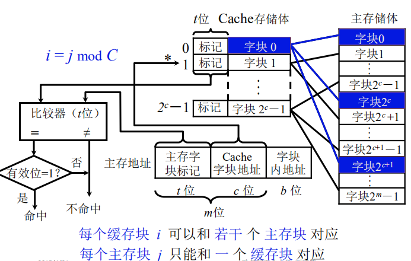

#### 全相联映射

全相联映射允许主存中每一字块映射到Cache中的任何一块位置上，可以从已被占满的Cache中替换出任一旧字块。这种方式速度低，利用率高。

- 工作过程：主存地址由主存字块标记（主存块号）和块内地址组成，要知道主存地址是否命中，需要将主存字块标记与Cache中的每一个标记进行比较。
- 存在问题：电路复杂，成本高；比较次数多；标记的位数增加。

#### 组相联映射

上述两种映射的折中。这种方式的速度和利用率都较高。

- 基本结构：将Cache分成多个组，每组包含固定多个块。将主存分成多个区，每个区的块数与Cache的组数相同，即区中的每一块与Cache的每一组11对应，比如第1块就只能放到Cache的第1组中，但可以装载到该组的任1个块中。
- 工作过程：主存地址由主存字块标记（主存区号）、组地址（主存块号）、块内地址；Cache中每块的标记记录其主存中对应的区号。CPU访存时，先通过组地址找到Cache中对应的组，然后用主存字块标记与组内每个块对应的标记进行比较，如果有一个标记相同，则命中。
- 特点：Cache中所有块分为一组的话就是全相联映射，每组只有一块的话就是直接映射。

#### 映射方式的选择

在多层级的Cache结构当中，越靠近CPU的Cache要求速度越高，应用直接映射或路数较少的组相联映射，中间层次的Cache就采用路数适中的组相联映射，离CPU越远的Cache要求利用率越高，速度不做强调，就可以使用全相联映射

### 替换算法

地址映射解决了一个主存块可以放入Cache中哪些位置中，如果所有位置都被占满了，那就需要将其中的一个Cache块进行替换，此时就需要替换算法来决定替换掉哪一个位置的Cache块。

1. 先进先出（FIFO）算法

	存在问题：没有根据访存的局部性原理，不能提高Cache的命中率。因为最早调入的信息可能以后还要用到，或者经常要用到，如循环程序。

1. 近期最少使用（LRU）算法

	比较好地利用访存局部性原理，替换出近期用得最少的字块。它需要随时记录Cache中各字块的使用情况，以便确定哪个字块是近期最少使用的字块。这种方法相对比较复杂，一般采用简化的方法，只记录每个块最近一次使用的时间。LRU算法的平均命中率比FIFO的高。

---

## 辅助存储器

### 概述

1. 特点不：与CPU直接交换信息

2. 磁表面存储器的技术指标

	- 记录密度：道密度（径向单位长度磁道数）、位密度（单位磁道长度二值位数）
	- 存储容量C = 盘面数×磁道数×位数
	- 平均寻址时间 = 寻址时间+等待时间
	- 辅存速度：寻址时间、磁头读写时间
	- 数据传输率Dr = 位密度×旋转速度
	- 误码率：出错信息位数与读出信息总位数的比值

### 磁记录原理

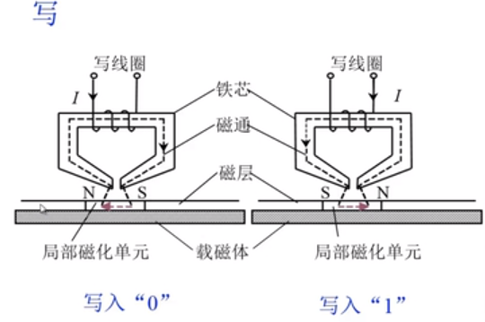

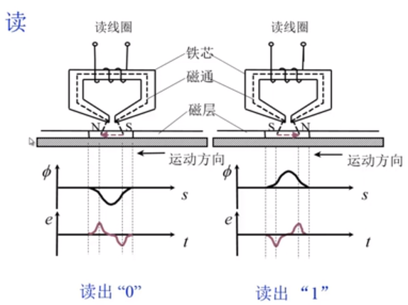

### 硬磁盘存储器

1. 类型

	- 固定磁头和移动磁头
		- 固定磁头：磁盘旋转，磁头不动，每个磁道都有一个磁头
		- 移动磁头：磁盘旋转，磁头沿径向移动

	- 可换盘和固定盘：盘片是否可更换

2. 基本结构

	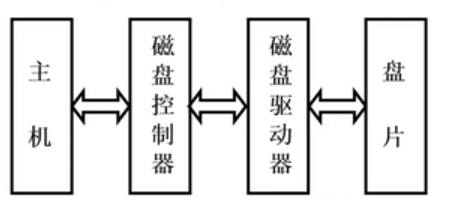

	- 磁盘驱动器

	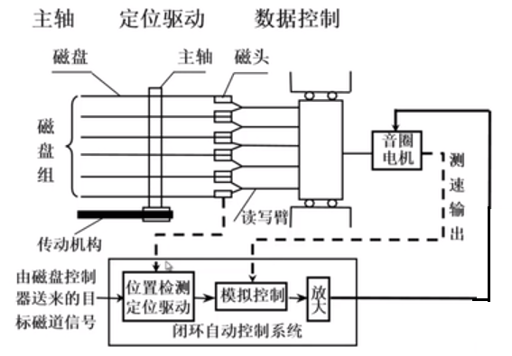

	- 磁盘控制器：相当于磁盘和主机之间的接口；用于接收主机命令，转换成磁盘驱动器的控制命令；实现了主机和驱动器之间的数据格式转换；控制磁盘驱动器读写
	- 盘片：由硬质铝合金制成
