# 计组原理-指令系统

机器指令指CPU能够直接识别并执行的操作命令，CPU能够执行的所有机器指令构成的集合叫做指令集，也称指令系统。指令系统位于硬件和软件的交界面上，即软件通过指令系统告诉硬件要做哪些操作，硬件通过指令系统把运算结果和自身状态反馈给软件。

高级语言或汇编语言 => 编译程序或汇编程序 => 机器指令（01代码）=> 硬件按序执行

---

## 机器指令

### 基本格式

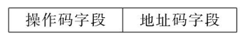

### 操作码字段

指令系统中的每一条指令都有一个唯一确定的操作码，指明了机器要做什么操作（也可能包含数据类型、寻址方式等）。指令不同，其操作码的编码也不同，通常可以分为规整型和非规整型两类。

#### 规整型（定长编码）

操作码字段的位数和位置是固定的。为了能表示整个指令系统中的全部指令，指令的操作码字段应当具有足够的位数，所以通常用于指令字长较长的情况（RISC）。

#### 非规整型（变长编码）

变长编码的操作码字段的位数不固定，且分散地放在指令字的不同位置上。这种方式能有效压缩指令中操作码字段的平均长度，通常用于指令字长较小的情况。下面是一种常见的变长编码方式：

- 扩展操作码法

	在指令长度一定的情况下，通过保留某个码点作为扩展窗口，减少指令中的地址数，从而增加操作码的位数。

	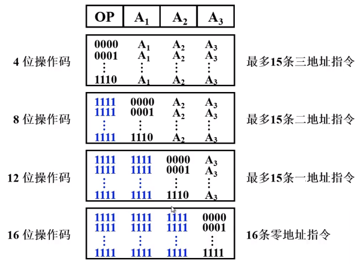

	- 此例中以1111、11111111、111111111111这3个码点作为扩展窗口。如果三地址指令操作码多保留1个码点作为扩展窗口，可多构成2^4个二地址指令；如果二地址指令操作码多保留1个码点作为扩展窗口，可多构成2^4个一地址指令......
	- 扩展操作码法应注意以下几点：
		1. 不允许短码是长码的前缀，即短码不能与长码的开始部分相同，否则将无法保证解码的唯一性和实时性；
		2. 各条指令的操作码一定不能重复，而且各类指令的格式安排应统一规整；
		3. 高频指令通常用短操作码，低频指令通常用长操作码。

### 地址码字段

指出操作数或指令存放的地址。

#### 四地址

- A1和A2地址存放的数据作为指令操作的输出，A3地址保存输出的结果，A4指向下一条指令的地址。

- 共包含4次访存：取指令（包含A4指令）；取A1的操作数；取A2的操作数；将结果保存到A3。

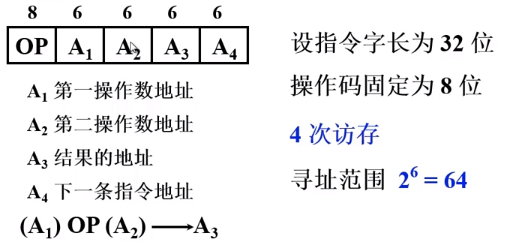

#### 三地址

用程序计数器PC代替A4（因为指令通常按序存放），即可减少一个地址数，从而在指令长度一定下，增加地址长度。

- 共包含4次访存：取指令；取A1的操作数；取A2的操作数；将结果保存到A3。

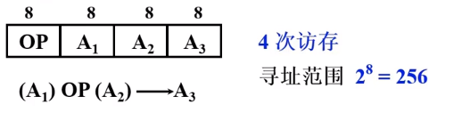

#### 二地址

用A1或A2代替A3，将运算结果保存在操作数的地址上，即可减少一个地址数，从而在指令长度一定下，增加地址长度。

- 共包含4次访存：取指令；取A1的操作数；取A2的操作数；将结果保存到A1或A2。如果将输出结果保存到寄存器（ACC）而不是内存中，那么就可以减少1次访存。

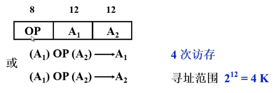

#### 一地址

用ACC寄存器代替A1（或A2），即将其中1个操作数隐含在ACC中，而且将输出结果也保存在ACC中，那么也可减少一个地址数，从而在指令长度一定下，增加地址长度。

- 共包含2次访存：取指令；取A1的操作数。

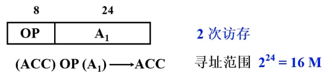

#### 零地址

只用ACC寄存器中的数据（隐含给出）作为操作数，或者当前指令不需要操作数，那么就不需要地址码了。

### 指令字长

指令字长是指一条指令中所包含的二进制代码的位数，它取决于操作码字段的长度、操作数地址的个数及长度。

指令长度与机器字长没有固定的关系，它可以等于机器字长，也可以大于或小于机器字长。

在一个指令系统中，若所有指令的长度都是相等的（指令字长=存储字长），称为定长指令字结构；若各种指令的长度随指令功能而异（按字节倍数变化），就称之为变长指令字结构。

### 指令格式的优化

1. 用硬件资源（寄存器）代替地址码字段
	- 可扩大指令寻址范围（固定指令字长）
	- 可缩短指令字长（固定操作码字长和地址码字长）
	- 可减少访存次数
2. 采用寄存器的地址作为指令的地址字段
	- 可缩短指令字长（寄存器存储容量比内存少很多）
	- 指令执行阶段不访存

---

## 操作数类型和指令类型

### 操作数类型

操作数指指令对应操作所要处理的数据。

- 地址：跳转指令（绝对地址：无符号整数；相对地址：有符号整数）
- 数字：定点数、浮点数、十进制数
- 字符：ASCII
- 逻辑数：逻辑运算

### 数据在存储器中的存放方式

大端模式和小端模式

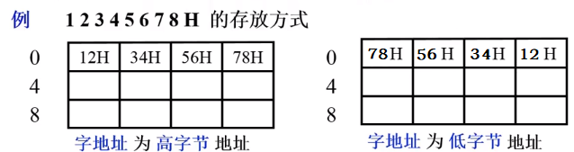

**不同字节数据的存储方式**

采用字节编址，假设存储字长64位，机器字长32位。

1. 从任意位置开始存储

	- 优点：不浪费存储资源。
	- 缺点：除了访问一个字节之外，访问其他任意类型的数据都可能花费两个存储周期的时间（需要判断是否跨存储字存储）；读写控制比较复杂。

	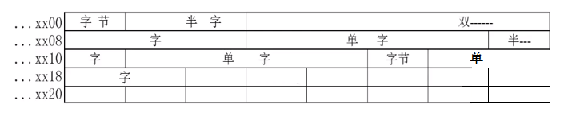

2. 从一个存储字的起始位置开始访问

	- 优点：无论访问何种类型的数据，在一个周期内均可完成，读写控制简单。
	- 缺点：浪费存储资源。

	

3. 边界对准方式——从地址的整数倍位置开始访问

	- 数据存放的起始地址是数据长度（按编址单位计算）的整数倍。
	- 在一个周期内可以完成存储访问，空间浪费也不太严重。

	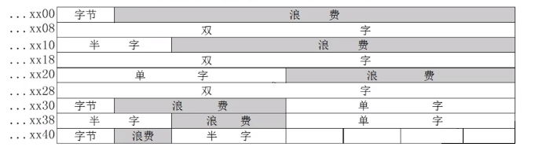

### 指令类型

#### 数据传送类指令

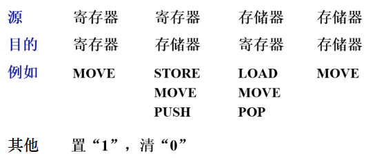

#### 算术逻辑类指令

- 算术运算：加、减、乘、除指令，浮点加、减、乘、除指令、加1、减1、比较、十进制算术

- 逻辑运算：与、或、非、异或、按位测（位检查）、按位清（位清除）、按位置（位设置）、按位求反、判符合

	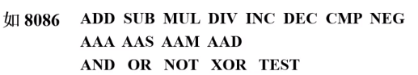

#### 移位类指令

算术移位、逻辑移位、循环移位（带进位和不带进位）

#### 转移类指令

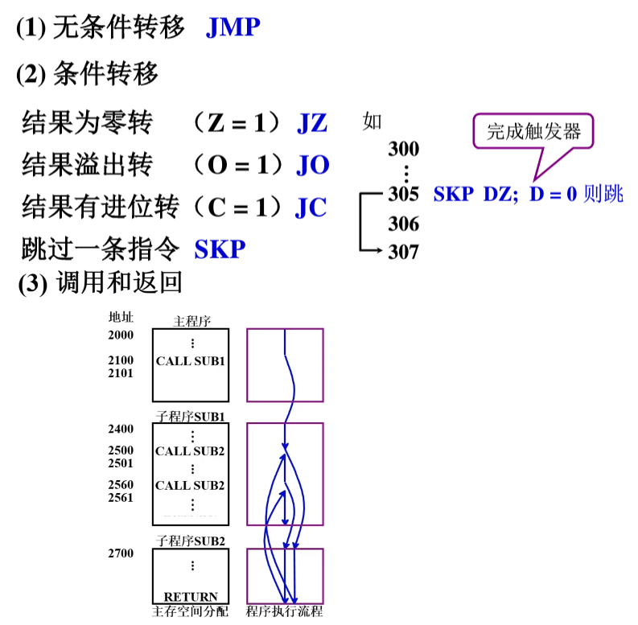

#### 陷阱类指令

- 陷阱（Trap）指意外事故的中断（操作码非法、操作数返回越界、除数为0等）

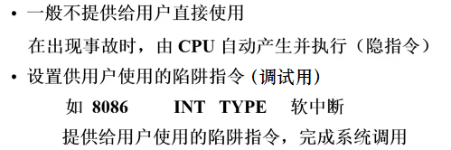

#### 输入输出类指令

- 若IO端口的编址空间是内存空间的一部分，那么就没有输入输出类指令，通过访存指令就可以对外部设备进行输入输出；若IO端口有自己的编址空间，那么就需要单独的输入输出类指令来对外部设备进行访问。

	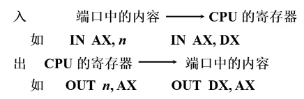

---

## 寻址方式

确定本条指令的操作数地址、下一条要执行指令的地址

### 指令寻址

- 顺序寻址中计数器每次加的值不一定是1。如果指令在内存中是按字节编址，指令字长固定为4字节，那么加的值应该是4；如果指令字长是可变的，那么加的值更加复杂。

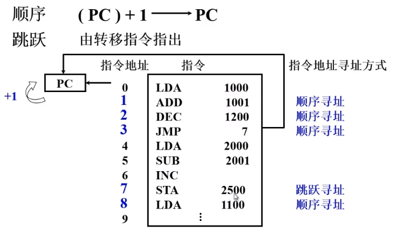

### 数据寻址

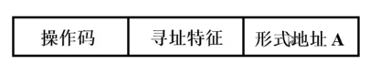

寻址特征：指出采用哪种寻址方式

形式地址A：指令字中的地址，并非操作数在内存中的真实地址

有效地址EA：操作数的真实地址

（以下约定指令字长=存储字长=机器字长）

#### 立即寻址

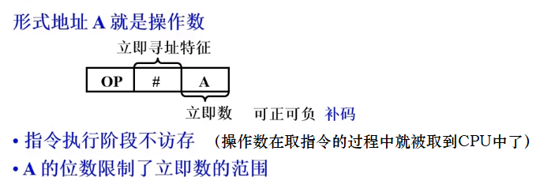

#### 直接寻址

指令中地址码字段给出的地址就是操作数的有效地址。由于这样给出的操作数地址是不能修改的，与程序本身所在的位置无关，所以又叫做绝对寻址方式。这种寻址方式使得内存地址空间受到指令中地址码字段位数的限制。

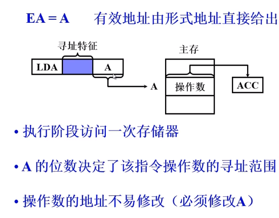

#### 隐含寻址

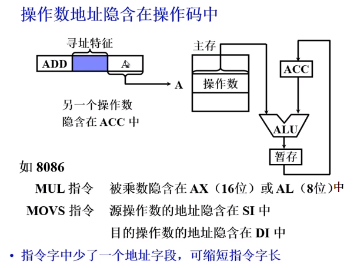

#### 间接寻址

地址码字段给出的地址所在存储空间存放的是操作数的地址。

- 地址码字段可以很短，而真实地址可以很长，因此可扩大寻址范围；
- 地址码字段可以不变，而只修改形式地址所在空间存放的真实地址，从而修改操作数，因此便于编制程序。

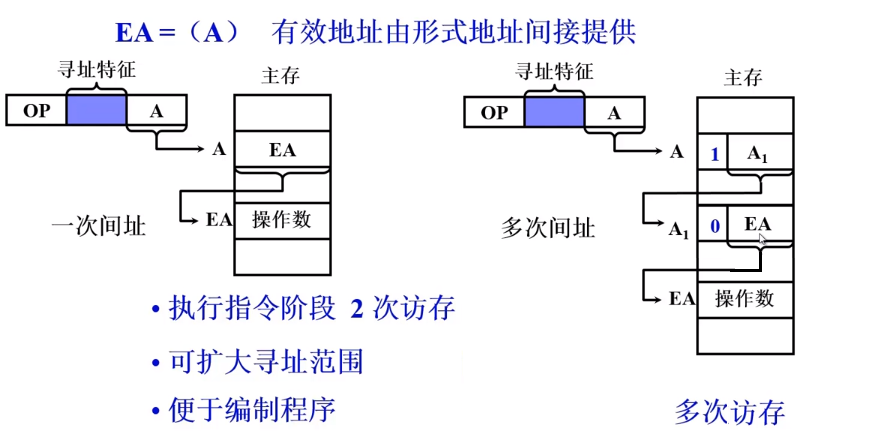

#### 寄存器寻址

操作数保存在寄存器中，地址码字段给出操作数对应的寄存器编号。

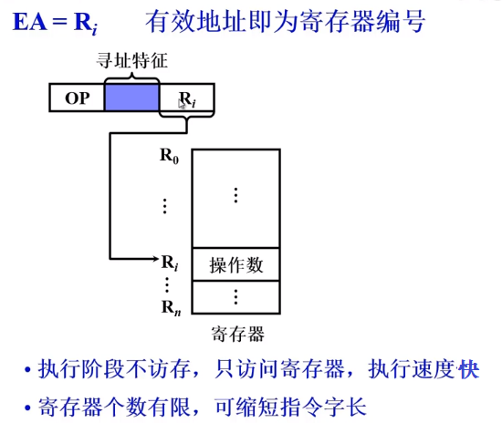

#### 寄存器间接寻址

寄存器中存放操作数在内存中的地址，地址码字段给出该寄存器编号。

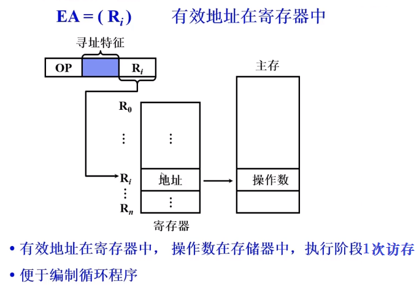

#### 基址寻址

- 采用专用寄存器作为基址寄存器

  基址寄存器中保存基址，地址码字段给出偏移量，基址加上偏移量就是操作数的物理地址。

  - 可扩大寻址范围；
  - 有利于多道程序：通过改变基址，就可以定位到不同程序的起点；
  - 基址由操作系统或管理程序确定，用户无法修改，只能修改形式地址，即在程序执行过程中BR内容不变，A可变。

  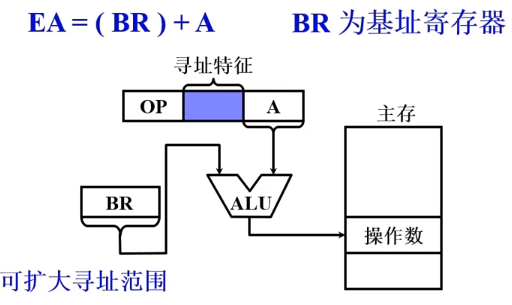

- 采用通用寄存器作为基址寄存器

	基址寄存器不固定，需要在指令中指出。

	- 用户可指定哪个通用寄存器作为基址寄存器；

	- 基址由操作系统或管理程序确定，用户无法修改，只能修改形式地址，即在程序执行过程中BR内容不变，A可变。

		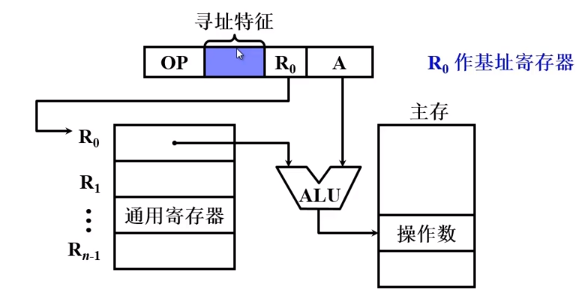

#### 变址寻址

变址寄存器IX的内容（变址值）与形式地址A相加，就形成操作数的有效地址。

- 可扩大寻址范围；

- 用户给定变址寄存器的内容，而无法修改形式地址，即在程序执行过程中IX内容可变，A不可变；

- 在需要频繁修改地址时，无须修改指令，只需修改变址值，因此便于处理数组问题：只需将指令中的形式地址作为基准地址（数组起始地址），而变址寄存器的内容作为修改量（数组下标）即可。

	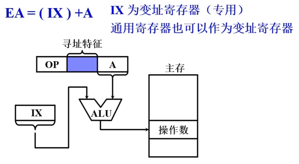

	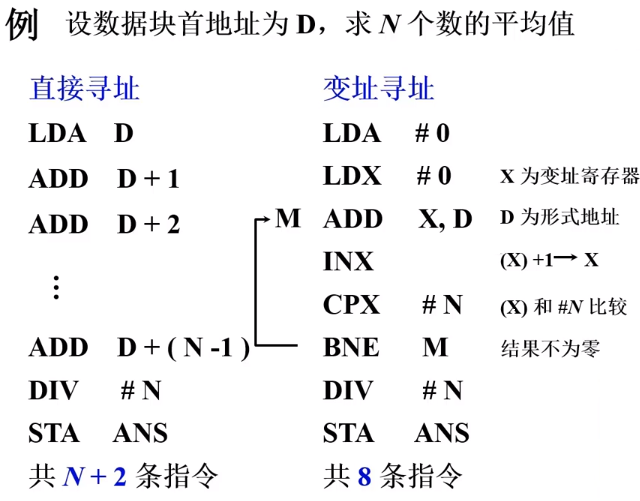

#### 相对寻址

- PC寄存器中保存了当前指令的地址，形式地址为操作数相对当前指令的地址的位移量，两者之和就是操作数的有效地址。

	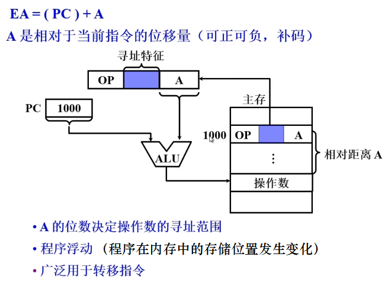

	- 举例1（M，M+1，M+2，M+3是对应指令地址）

		BNE M是将执行跳转到M对应的指令，可以用BNE *-3代替，因为BNE *-3表示将执行跳转到当前指令往前数的第3条指令（M+3-3=M）

		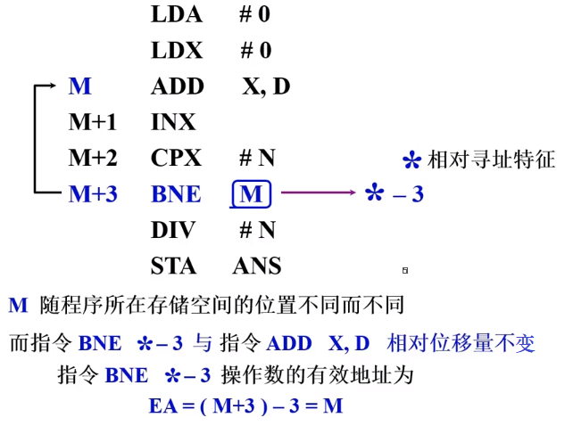

	- 举例2

		按字节寻址时相对寻址的真正偏移量的求取：因为当取出JMP跳转指令后，PC的值就已经移动到下一条指令了，导致还没执行这条跳转指令，PC的值就已经改变，所以需要修改跳转指令中的位移量，使跳转正确。

		

#### 堆栈寻址

- 堆栈特点

	- 分类

		① 硬堆栈：由多个寄存器构成栈顶，栈底还是在内存中

		② 软堆栈：栈顶和栈底都在内存中

	- 先进后出（一个出入口）

- 堆栈寻址

	没有形式地址，所有操作对象都是关于栈顶数据的操作，或者说形式地址就是栈顶地址（编址方式：由栈顶到栈底，地址从小到大变化）。栈顶地址通常由SP指出，当有进栈操作时，SP就会减1，栈顶上升；当有出栈操作时，SP就会加1，栈顶下降。

	

	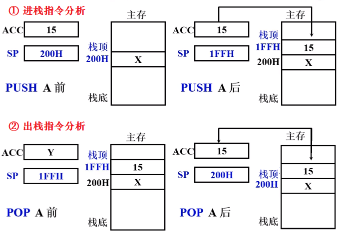

	- SP的修改与主存编址方法有关

		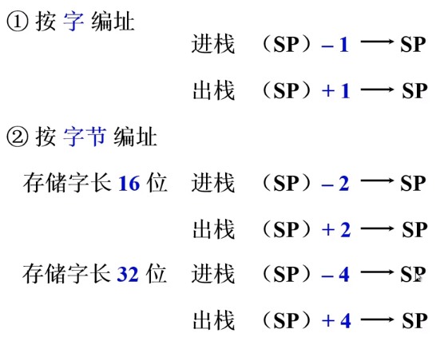

---

## 指令格式举例

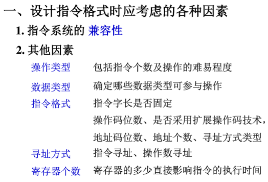

- IBM 360指令格式举例

	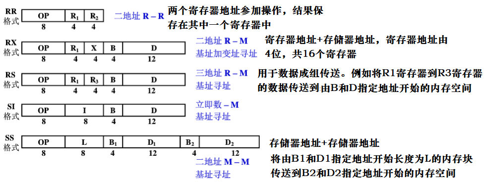

- Intel 8086指令格式举例

	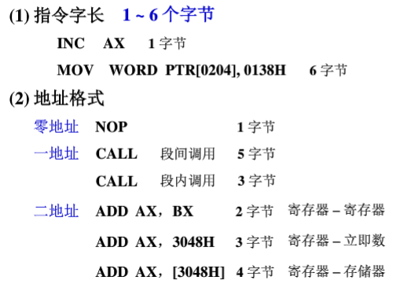

---

## RISC技术

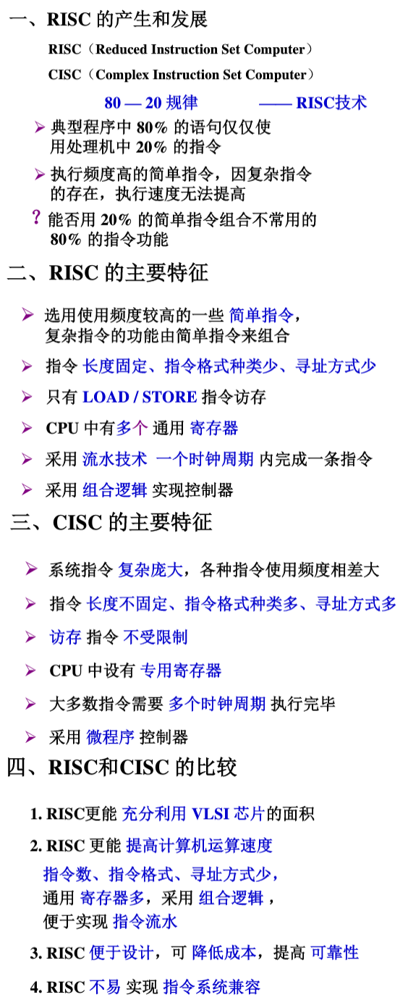