# 计组原理-控制单元

## 控制单元的功能

### 微操作命令分析

取指、间址、析指、执指、响断 => 微指令（微操作命令）

分析控制单元在完成1条指令的4个周期中分别要发出哪些微操作命令：

#### 取指周期

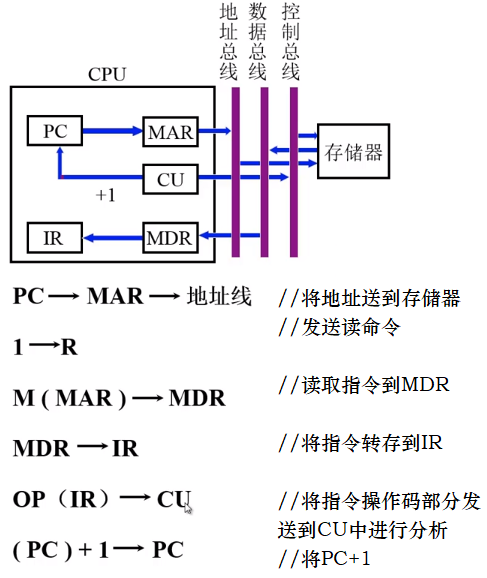

#### 间址周期

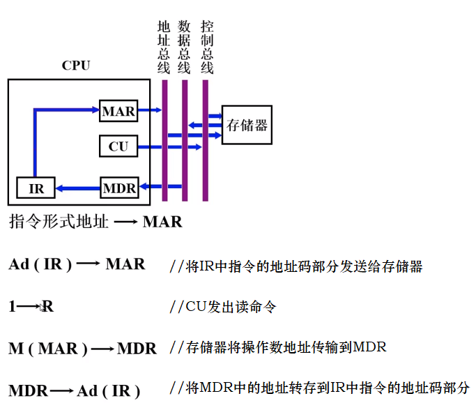

#### 执行周期

1. 非访存指令

	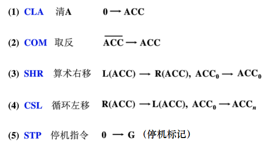

2. 访存指令

	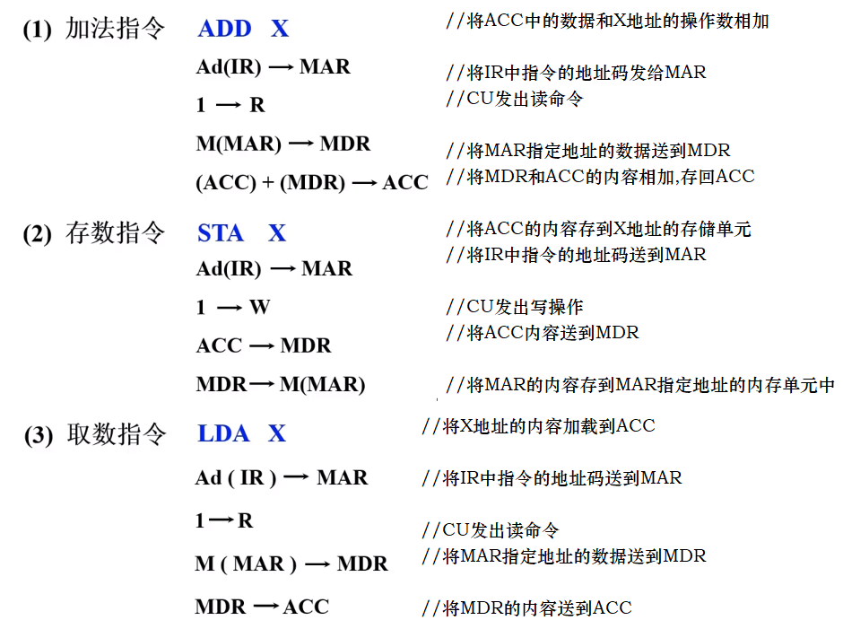

3. 转移指令

	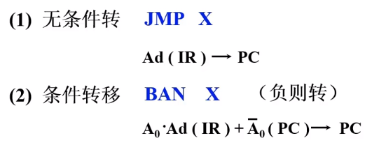

4. 三类指令的指令周期

	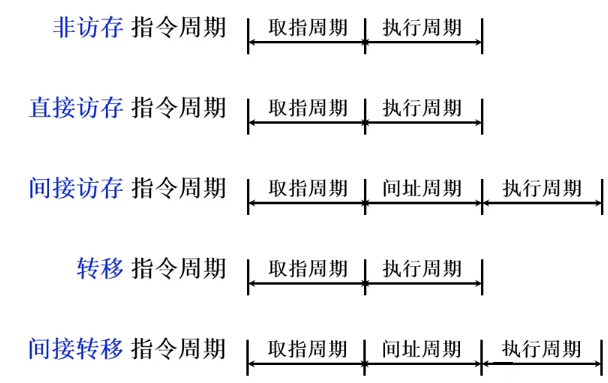

#### 中断周期

保存断点、形成入口地址、关中断

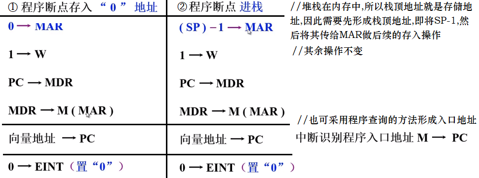

### 控制单元的功能

发出各种控制命令或微指令，控制各个功能部件能够协调正确连续地工作。

#### 控制单元的外特性

即CU与其他部件的信号传输关系

- 指令寄存器：将指令操作码字段发送给CU进行译码分析
- 时钟信号：控制CU按序工作
- 标志：使得指令正确被CU执行，比如跳转指令需要上一条指令运行结果的标志（是否跳转）。
- 控制信号：①外部设备发送给CU的控制信号；②CU发送给外部设备的控制信号；③ CU发送给CPU内部的控制信号

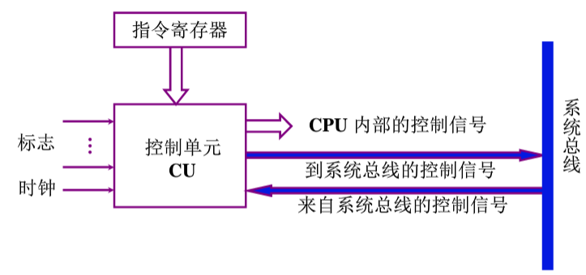

##### 输入信号

这些信号送入CU，由CU统一管理硬件资源

1. 时钟信号

	CU受时钟控制，即CU在时钟信号的控制下在指定的时间点发出相应的微操作命令。一般一个时钟脉冲发出一个操作命令或一组需同时执行的操作命令。

2. 指令寄存器 OP(IR) -> CU

	将指令操作码字段发送给CU进行译码，分析出这条指令需要执行哪些操作来完成，以便对相关的部件发出控制信号。

3. 标志

	CU受标志控制

4. 外来信号

	INTR：中断请求；HRQ：总线请求

##### 输出信号

1. CPU内部的各种控制信号

	控制CPU内部的部件做相应的操作

	 Ri -> Rj

	(PC)+1 -> PC

	ALU：+-与或

2. 送到控制总线的信号

	控制IO、存储器、总线占用等

	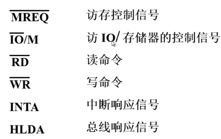

#### 控制信号举例

1. 不采用CPU内部总线的方式（CPU内部的各个部件采用分散连接）

	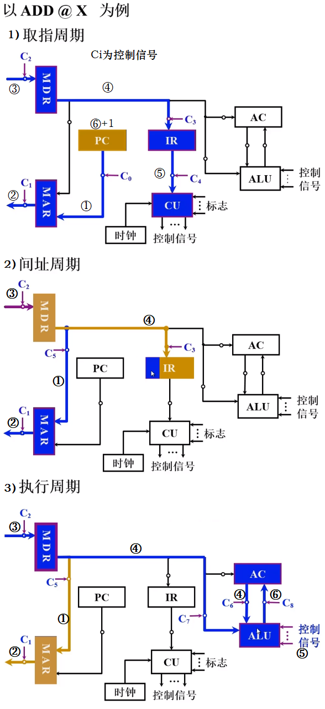

2. 采用CPU内部总线的方式（以ADD @ X为例）

	- 取指周期

		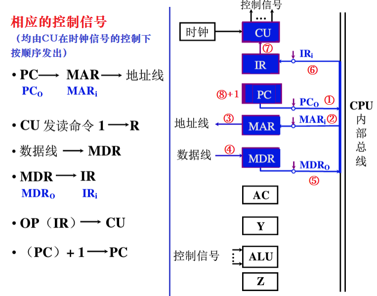

	- 间址周期

		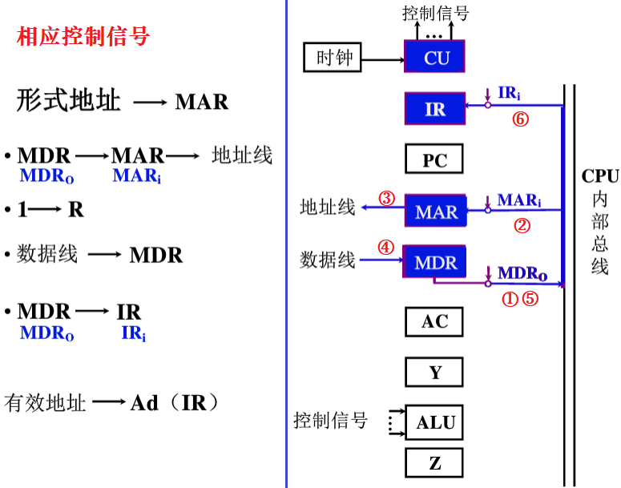

	- 执行周期

		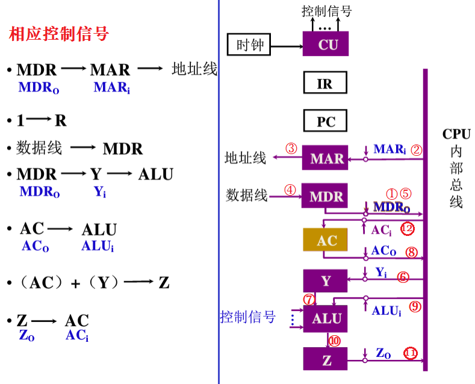

#### 多级时序系统

1. 机器周期

	- 概念

		指所有指令执行过程中的一个基准时间。一个指令周期中的取指周期、间址周期、执行周期和中断周期都是机器周期。

	- 确定机器周期需要考虑的因素

		- 每条指令需要执行哪些步骤
		- 每个步骤需要多少时间

		（将各个步骤划分到不同周期中，使各个周期的时间尽量一致）

	- 基准时间的确定

		- 以完成指令中最复杂的微操作的时间为准

		- 一个指令中最复杂的微操作通常是访存操作，因此以访问一次存储器的时间为基准。如果指令字长=存储字长，那么取指周期=机器周期。

2. 时钟周期（节拍、状态）

	一个机器周期包含多个微操作，而微操作之间是有先后顺序的，因此机器周期内部也需要有多个时钟周期来控制微操作的执行顺序，即将一个机器周期分成若干个时间相等的时间段（时钟周期），并确保各个微操作可以在规定的时间段内完成，从而使微操作之间有相应的先后顺序。

	一个时钟周期可以完成一个微操作或一组并行的微操作，一个微操作也可能需要多个时钟周期来完成。

	时钟周期是控制计算机操作的最小时间单位，用时钟周期控制产生一个或几个（并行）微操作命令。

	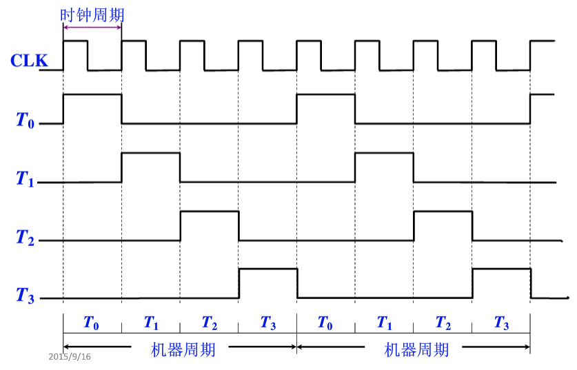

3. 多级时序系统

	由指令周期、机器周期和时钟周期就构成了一个多级时序系统，即一个指令周期包含多个机器周期，一个机器周期包含多个时钟周期。

	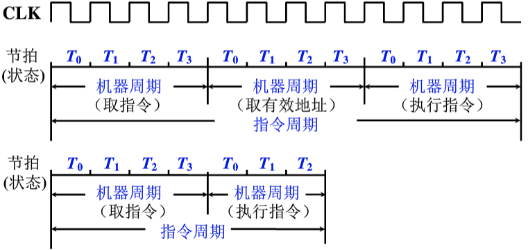

4. 机器速度与机器主频的关系

	主频是指单位时间内时钟周期期的完成数量，即时钟周期的倒数。

	如果两台机器的指令周期所含机器周期数相同，机器周期所含时钟周期数相同，那么两台机器的平均指令执行速度之比等于主频之比，即主频越高的机器，CPU执行速度越快。

	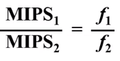

	由此可见，机器速度不仅与主频有关，还与指令周期所含机器周期数和机器周期所含时钟周期数有关，除此之外，机器是否采用指令流水的方式也对机器速度的影响非常大。

#### 时序控制方式

指产生不同微操作命令序列所用的时序控制方式。

1. 同步控制方式

	任一微操作均由统一基准时标的时序信号（定宽定距的时钟）来控制，即规定在指定节拍内完成相应操作。

	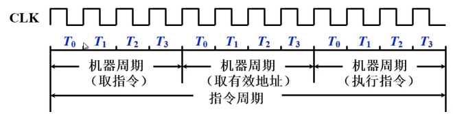

	- 采用定长的机器周期

		即所有机器周期含有的时钟周期数都相同，所以通常以最长的微操作序列或最复杂的微操作作为标准。

		缺点：可能造成浪费。比如如果取值阶段需要4个节拍，而执行阶段比较简单，只需要1个节拍，那么执行阶段还是得走完4个节拍，因此造成浪费。

	- 采用不定长的机器周期

		不同机器周期所含时钟周期数可以相同或不相同

		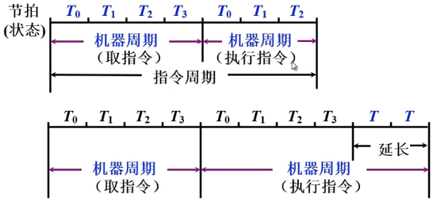

	- 采用中央控制和局部控制相结合的方法

		即每个机器周期相同的部分由中央控制节拍进行控制，延长部分由局部控制节拍进行延长和控制。

		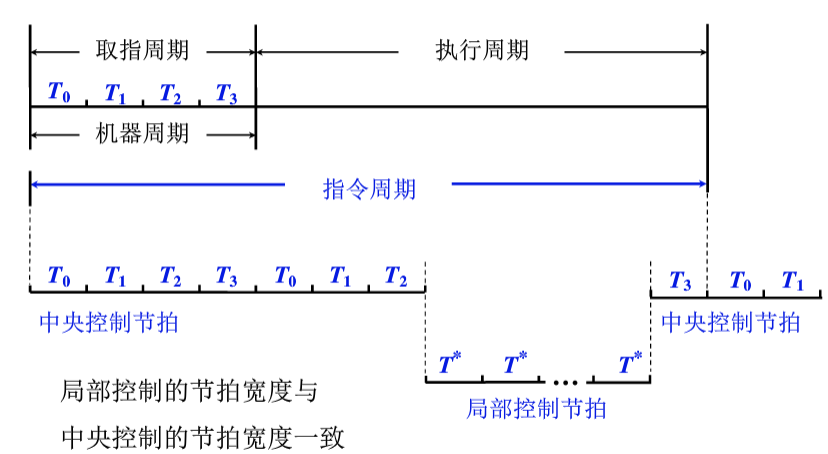

2. 异步控制方式

	没有定宽定距的基准时间（即没有固定的周期节拍和严格的时钟同步），采用应答的方式告诉下一个微操作可以开始了。

3. 联合控制方式

	同步和异步相结合，即将大部分比较简单的微操作用同步的方式进行控制，而个别难以确定完成时间的微操作（比如IO操作）就由异步的方式进行控制。

4. 人工控制方式（一般用于调试）

	- Reset：重置状态
	- 连续和单条指令执行转换开关
	- 符合停机开关

---

## 控制单元的设计

控制单元就是控制各个控制信号在其合适的节拍到来时产生和发出。

### 组合逻辑设计

某个微操作命令是否发出由一系列硬件逻辑组合而成的独立电路决定，这个电路输出为1，就说明该微操作命令需要执行。通常，每一条微操作命令都需要一个单独的硬件电路来控制其生成。

用硬件逻辑组合的方式决定是否需要发出，即微操作命令是否产生是通过硬连的方式决定的，通常每一条微操作命令都需要一个单独的硬件电路来控制其生成。

#### 控制单元框图

1. CU外特性

	节拍发生器：接收机器主频（系统时钟），并产生T0~Tm共m+1个节拍，每个节拍控制一个微操作命令或几个并行微操作命令的发出，即同一时刻只有一个节拍有效；

	IR：将指令的n位操作码字段送入译码器进行译码，产生2^n条信号，一个信号对应一条指令，即同一时刻只有1个信号有效，这个信号就指示了CU当期执行的指令是什么，应该做哪些操作；

	标志：控制一些条件操作（如跳转）；

	C0~Ck：在各种输入信号的共同作用下，产生的一些列控制信号；

	大致过程：在操作码已经被译码后，每个节拍就指定了CU应该发出哪些控制信号Ci，当时钟CLK走到某一个时间点时，某个节拍信号Ti就会生效，CU看到这个节拍信号生效后，就明白自己应该发出与这个节拍信号绑定的哪些操作命令。

	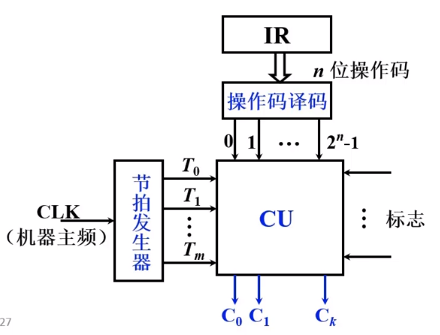

2. 节拍信号

	节拍信号的宽度（高电平长度）就是一个时钟周期

	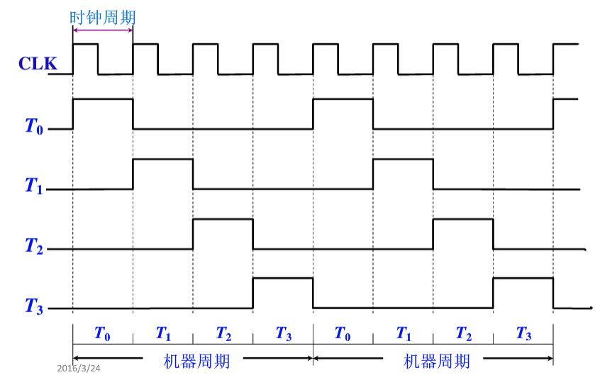

#### 微操作的节拍安排

解决各个微操作到底要分别安排到哪一个节拍上

>一个机器周期应该包含几个节拍与多个因素有关：
>
>1. 该机器周期包含控制信号的个数
>2. 控制信号的复杂程度
>3. 控制信号之间能否并行

假设前提：① 采用同步控制方式；② 一个机器周期有3个节拍（时钟周期）；③ CPU内部结构采用非总线方式

>C0~C12是CU产生的控制信号，ALU的控制信号也是由CU产生，标志位的修改信号也是由CU产生。

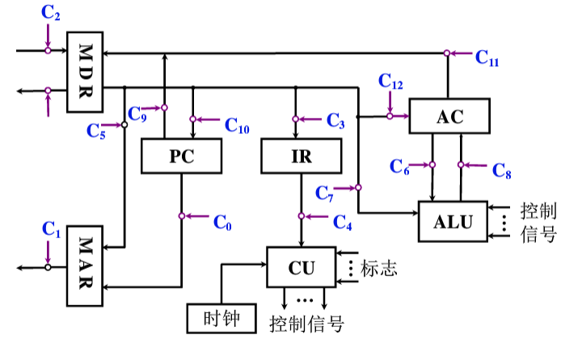

1. 安排微操作时序的原则

	

2. 取指周期微操作的节拍安排

	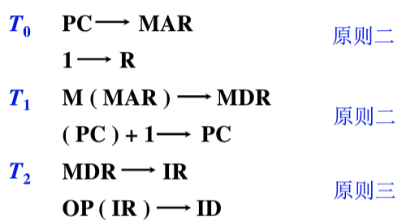

3. 间址周期微操作的节拍安排

	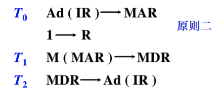

4. 执行周期微操作的节拍安排

	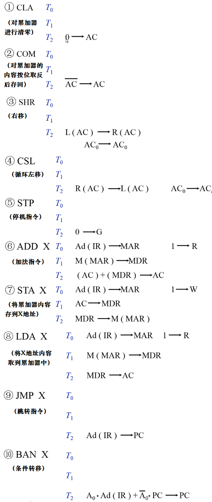

5. 中断周期微操作的节拍安排

	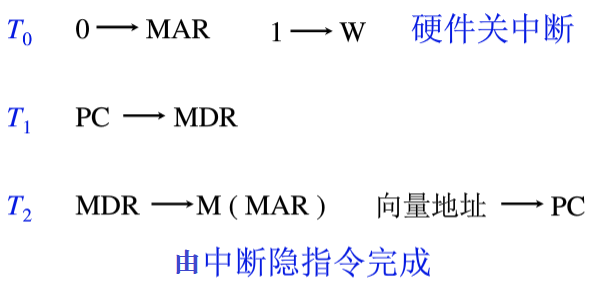

#### 组合逻辑设计步骤

列出微操作命令产生条件的逻辑表达式，然后用硬件实现。

1. 列出操作时间表

	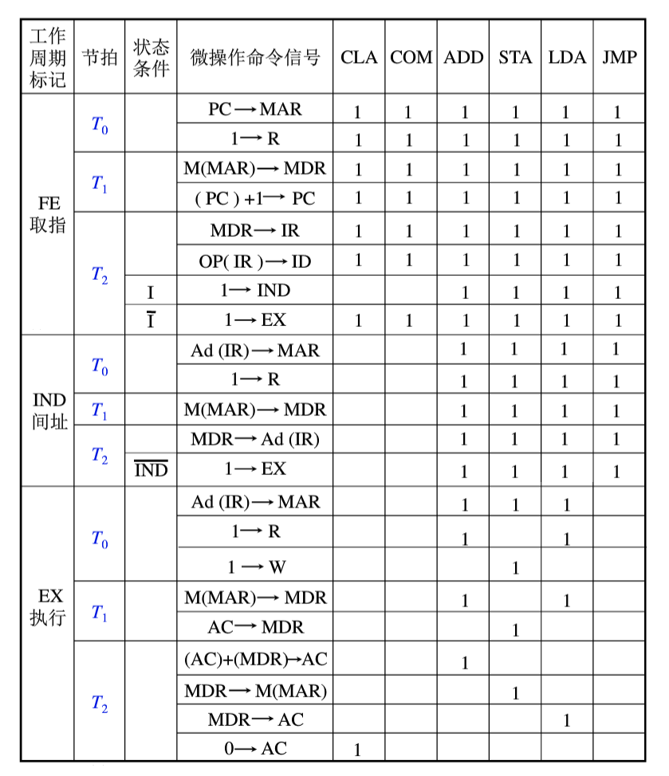

2. 写出微操作命令的逻辑表达式

	该逻辑表达式的意思是：这个微操作命令要生效，首先是要T1节拍信号有效，然后是要取值周期信号或者间址周期信号有效，如果是间址周期，还必须是（ADD、STA、LDA、JMP、BAN）这几个指令信号之一有效，满足这几个条件后，这个命令才会生效。

	其实这就是控制单元CU要干的事，即控制某条微操作命令是否需要发出。

	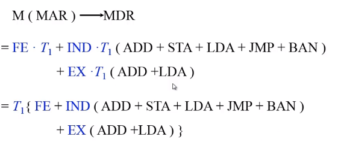

3. 画出逻辑图

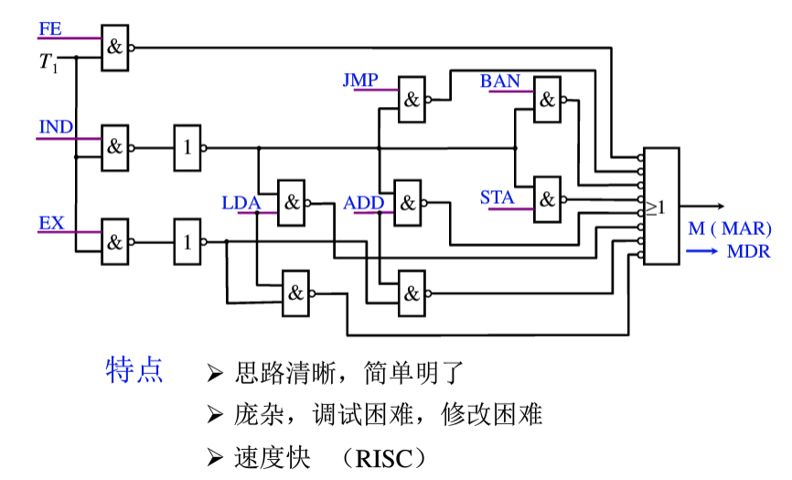

### 微程序设计

#### 什么是微程序

1. 微程序的概念

	一条机器指令由多个微操作命令组成，一个节拍完成其中的一条或多条并行的微操作命令，将一个节拍需要完成的所有微操作命令组合成一个微指令，然后把完成某个机器指令所需的所有微指令组合在一起，就构成了一个微程序。

	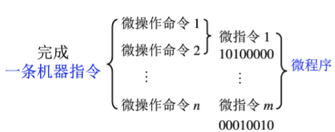

	- 微指令是由一系列01组成的二进制数，每一位01代表一个微操作命令，即如果某位上是1，就代表该位对应的微操作命令需要执行。通过01的不同组合，就可以把不同的微操作命令组合在一起，从而形成新的微指令，进而构成新的机器指令。

	- 微指令的先后顺序决定了微操作命令的先后顺序。
	- 一条机器指令对应一个微程序
	- 微程序存入ROM中，在执行时按顺序一条一条地将微指令取出，然后根据微指令有效信号（即1）的位置发出相应的控制信号。
	- 这种控制单元的执行方式就叫存储逻辑，即把逻辑信号存储在存储器中。

2. 微程序举例

	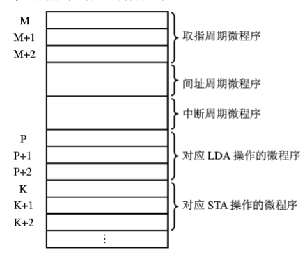

#### 微程序控制单元结构框图

IR寄存器将操作码传给微地址形成部件，形成指令对应微程序在控制存储器CM中的存储首地址，因为同一时间可能传入多个地址，因此需要顺序逻辑电路根据标志以及时钟等因素找出正确的地址，然后发送给CMAR，经过译码后，将地址对应的微指令读出并传给CMDR，该微指令包含当前需要执行的微操作的01组合以及下一条微指令的地址，操作控制部分直接发送到外部作为控制信号，地址部分发送给顺序逻辑电路，以便执行下一个微指令。

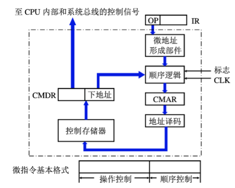

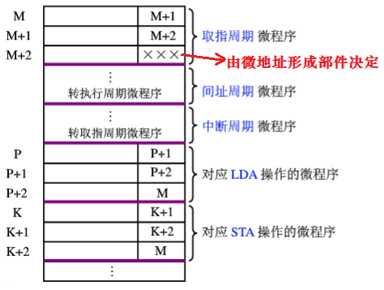

#### 微程序控制单元工作原理

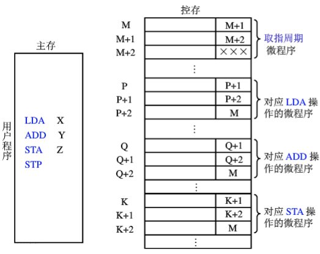

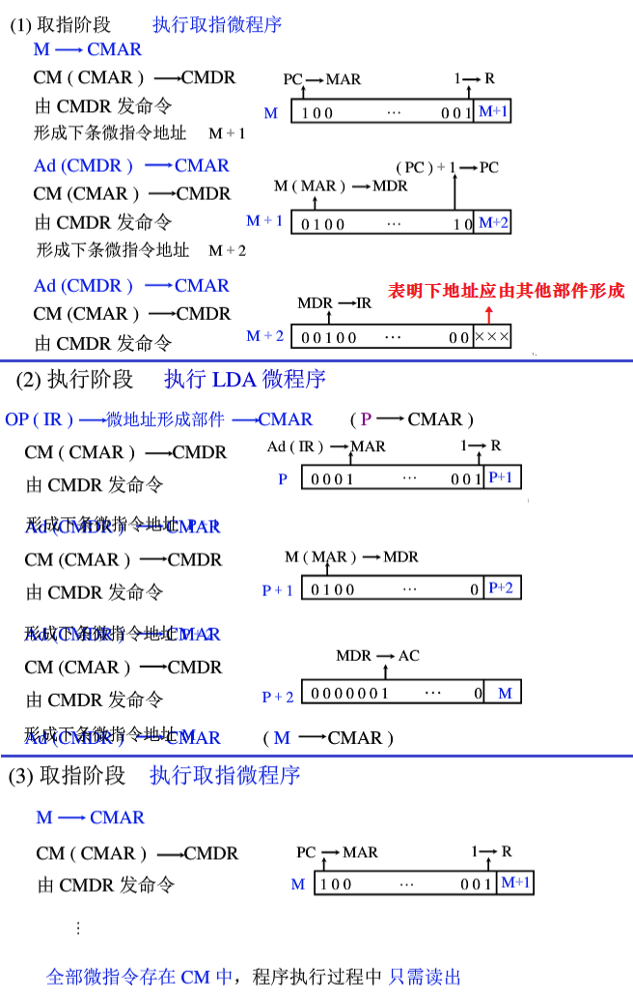

#### 微指令的编码（控制）方式

1. 直接编码（直接控制）方式

	在微指令的操作控制字段中，每一位代表一个微操作命令，值为1就表示该控制信号有效，即有多少个微操作命令，操作控制字段就应该设置为多少位。

	特点：速度最快。

	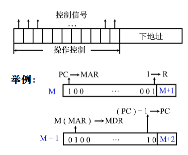

2. 字段直接编码方式（也叫显示编码）

	将微指令的操作控制字段分成若干组，每组经过译码后产生控制信号。

	

	- 每组经过译码后产生一段二进制代码，二进制代码的每一位代表一个微操作命令，但只有其中一位是有效的，即一组只能产生一个微操作命令。
	- 如果每组有n位，那么1组就能产生一个2^n位的二进制代码，代表有2^n个微操作命令。
	- 由于每组只能产生一个有效的微操作命令，所以分在一组中的微操作命令都是互斥的，而每组之间的微操作命令是可以并行执行的。

	特点：缩短了微指令字长，但增加了译码时间，使得微程序执行速度比较慢。

3. 字段间接编码方式（也叫隐式编码）

	每段产生的信号不仅与本段相关，也与其他字段的译码结果有关。

	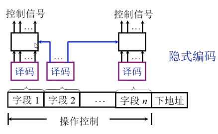

4. 混合编码

	直接编码和字段编码（直接和间接）混合使用，即常用微操作命令用直接编码，不常用微操作命令用字段编码。

#### 微指令序列地址的形成

1. 由微指令的下地址字段给出

	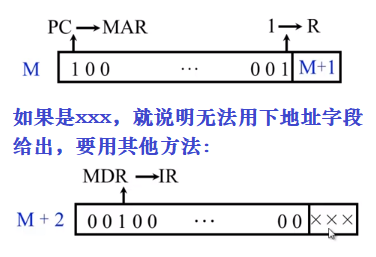

2. 根据机器指令的操作码形成

	微地址形成部件

3. 增量计数器

	微指令之间的地址相邻，使得可以省略下地址字段

	(CMAR)+1->CMAR

4. 分支转移

	按条件给出下条微指令的地址，常用于条件转移指令

	

5. 通过测试网络

	高地址不变，低地址由测试网络变换后生成。

	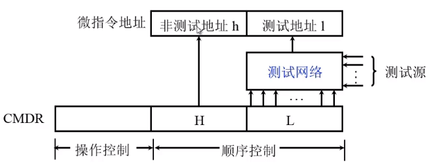

6. 由硬件产生微程序入口地址

	用硬件产生那些特定时期需要执行的微程序的首地址，这些首地址在控制存储器中都是固定的。

	- 机器开机后的第一条微指令地址由专门的硬件产生
	- 中断周期由硬件产生中断周期微程序首地址

7. 后续微指令地址形成方式原理图

	由多个地方产生的地址都要传入多路选择器中，在分支逻辑电路的控制下，选择并输出一个有效的地址。

	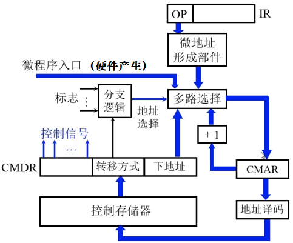

#### 微指令格式

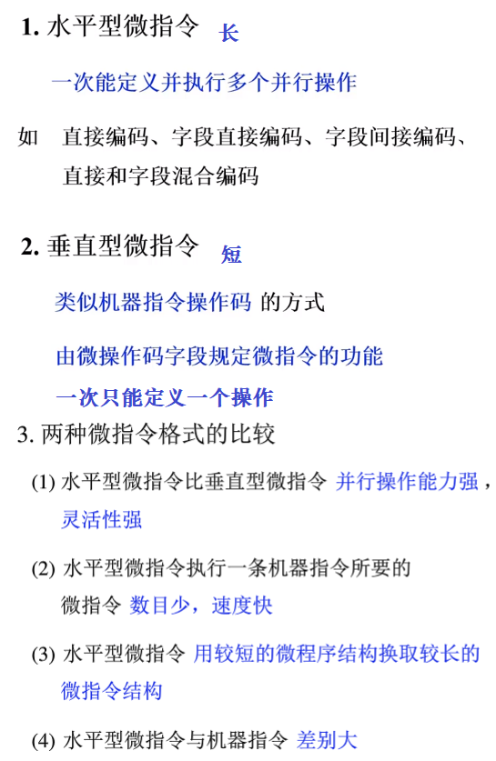

#### 静态微程序设计和动态微程序设计

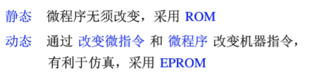

#### 毫微程序设计

1. 毫微程序设计的基本概念

	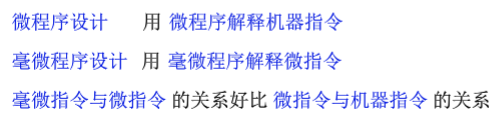

2. 毫微程序控制存储器的基本组成

	从微程序控制存储器中取出某条微指令（垂直型微指令），再通过该微指令的地址码字段从毫微程序控制存储器中取出对应的毫微指令（水平型微指令），然后根据这个毫微指令发出控制信号。

	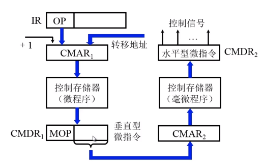

#### 串行微程序控制和并行微程序控制

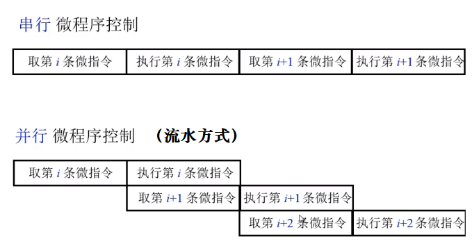

#### 微程序设计举例

假设前提：CPU内部结构采用非总线方式

>**分析：**
>
>如果是取值阶段，那么一共需要以下6个微操作：
>
>T0  PC->MAR  1->R
>
>T1 M(MAR)->MDR  (PC)+1->PC
>
>T2  MDR->IR  OP(IR)->微地址形成部件
>
>将这6个微操作分别分在3个节拍当中，一共可以形成3条微指令。但除此之外，还需要考虑将这3条微指令取出来的微操作：
>
>①采用下地址字段形成后续指令地址：
>
>Ad(CMDR)->CMAR 
>
>② 采用机器指令操作码字段译码形成后续指令地址：
>
>OP(IR)->微地址形成部件->CMAR
>
>因此，还需要两个微操作来形成后续指令的地址，可以将这2个微操作也分别当做2个微指令，所以在上述微指令执行过后还应该加上这2个微指令的其中1个以形成后续指令的地址，让微指令执行下去。

1. 写出对应机器指令的微操作及节拍安排

	- 取值阶段的微操作及节拍安排

		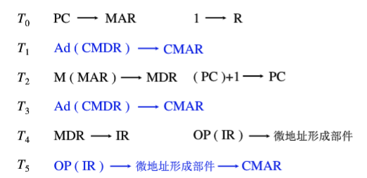

	- 执行阶段的微操作及节拍安排

		假设执行阶段完成后，由执行阶段最后1条微指令的下地址字段指出取值微程序的入口地址M

		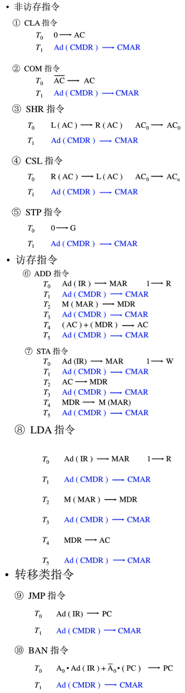

2. 确定微指令格式

	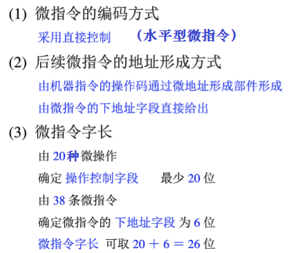

（4）优化微指令字长

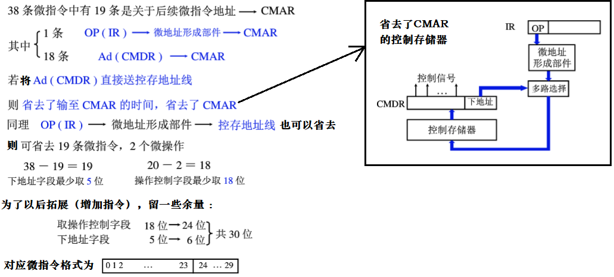

3. 编写微指令码点（即定义微指令操作码字段每一位的微操作）

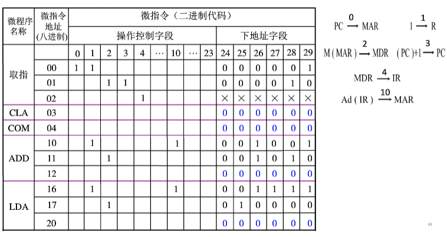

### 组合逻辑CU和微程序CU的比较

1. 组合逻辑控制单元

	将一系列信号（节拍信号、标志信号、周期信号、指令信号（将IR中指令操作码字段经过译码后形成））输入到由众多硬件通过逻辑组合后形成的电路，这个电路由所有微操作命令对应的筛选电路组合而成，只要输入信号的特征符合某个微操作命令，其对应的筛选电路就会输出1，如果不符合就输出0。将所有筛选电路的01输出组合在一起，就形成了微指令，微指令就告诉了CPU应该做哪些操作。

2. 微程序控制单元

	提前把所有需要用到的微指令保存在控制存储器中，然后将机器指令的操作码字段进行译码，通过比对找到与该机器指令对应的所有微指令（即微程序），并在系统时钟的控制下，按序发出这些微指令。

---

## 其他

- 机器指令为什么还要划分为微指令，而微指令还包含多个微操作命令？

	因为机器指令并不是由一个硬件直接并一次性就可以执行完成的，只有通过划分为单硬件单次操作的形式才能更好的控制。

