# 计组原理-I/O系统

## 概述

### I/O系统的发展概况

1. 早期阶段：

	分散连接，CPU 和 I/O设备串行工作，采用程序查询方式

2. 接口模块和DMA阶段：

	总线连接，CPU 和 I/O设备并行工作，分为中断方式和DMA方式

3. 具有通道结构的阶段

4. 具有 I/O 处理机的阶段

发展趋势：数据的输入输出操作逐渐从CPU分离出来，I/O设备的独立性越来越强。

### I/O系统的组成

1. I/O软件

	- I/O指令：CPU指令的一部分，用于控制外部设备进行工作。I/O指令的格式为 |操作码|命令码|设备码| 。

		- 操作码：用于标识该指令是一个I/O指令

		- 命令码：指出要对I/O设备进行的操作

		- 设备码：指出要操作I/O设备的地址

	- 通道指令：通道是一个小型的DMA处理机，能够让I/O设备和主机之间直接进行信息传送。通道指令是该处理机自身拥有的处理指令，指出了数据的首地址、传送字数、操作命令。

		- 通道的执行过程：程序员通过使用广义I/O指令来调用I/O设备，广义I/O指令包含了I/O设备、数据首地址、数据长度和传输方向，操作系统根据广义I/O指令的描述编写一个由通道指令组成的通道程序，然后将通道程序放在内存或通道内部的存储器中，最后启动通道进行工作。

2. I/O硬件：

	- 一般方式：设备 => I/O接口

	- 通道方式：设备 => 设备控制器 => 通道

### I/O设备与主机的联系方式

1. I/O设备编址方式

	- 统一编址

		将I/O设备的地址编写到内存的地址空间中。比如可以将内存地址的高位用于编写I/O设备的地址，这样就可以通过指令地址码的高位来区分这次指令操作的对象是I/O设备，还是内存数据，因此无须专门的I/O指令来区分访问对象，但减少了存储器的最大容量。

	- 独立编址

		I/O设备和存储器分开编址。由于I/O设备码不占用主存空间，故不影响主存容量，但需设I/O专用指令来区分指令地址码部分是指内存地址，还是I/O设备地址。

2. 设备选址

	用设备选择电路对CPU给出的地址和设备中保存的自己的地址进行比较，如果相同，则说明该设备被选中。

3. 数据传送方式

	- 串行：1位1位数据按序进行传输。
	- 并行：多位数据同时进行传输。

4. 联络方式

	不论是串行传送还是并行传送，I/O设备与主机之间必须互相了解彼此当时所处的状态，如是否可以传送、传送是否已结束等。有以下三种联络方式：

	- **立即响应**：只要CPU的I/O指令一到，I/O设备便立即响应，无需特殊联络信号

	- **异步工作采用应答信号**：CPU和I/O设备只有接收到I/O接口的信号后，才开始下一步工作

		> 工作过程：当CPU将数据输出到I/O接口后，接口立即向I/O设备发出一个“Ready”信号，表明I/O设备可以从接口内取数据。I/O设备收到“Ready”信号后，通常便立即从接口取出数据，接着便向接口回发一个“Srtobe”信号，并让接口转告CPU，接口中的数据已被取走，CPU还可继续向此接口送数据。同理，倘若I/O设备需向CPU传送数据，则先由I/O设备向接口送数据，并向接口发“Strobe”信号，表明数据已送出。接口接到联络信号后便通知CPU可以取数，一旦数据被取走，接口便向I/O设备发“Ready”信号，通知I/O设备，数据已被取走，尚可继续传送数据。

		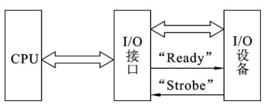

	- **同步工作采用同步时标联络**：通过一个定宽定距的同步时标规定一定时间内CPU或I/O设备必须完成指定操作，因此这种方式要求I/O设备与CPU的工作速度完全同步。

5. I/O 设备与主机的连接方式

	- 辐射式连接（分散连接）：每台设备都配有一套控制线路和一组信号线，不便于设备的增删和移植。
	- 总线连接：通过接口将设备连接到总线上，接口可以传送CPU给I/O设备的指令或I/O设备给CPU的状态信息，也可以完成数据的缓存和格式化（将CPU发送给设备的数据进行缓存并格式化后再输入给设备，反之也行）。这种方式便于设备的增删和移植，只要设备的接口符合标准就可以接入主机。

### I/O设备与主机信息传送的控制方式

#### 程序查询方式

由CPU通过程序不断查询I/O设备是否已做好准备，从而控制I/O设备与主机交换信息。采用这种方式实现主机和I/O设备交换信息，要求I/O接口内设置一个能反映I/O设备是否准备就绪的状态标记，CPU通过对此标记的检测，可得知I/O设备的准备情况。

- 工作过程

	当现行程序需启动某I/O设备工作时，即将此程序流程插入到运行的程序中。CPU启动I/O设备后便开始对I/O设备的状态进行查询。若查得I/O设备未准备就绪，就继续查询；若查得I/O设备准备就绪，就将数据从I/O接口送至CPU，再由CPU送至主存。这样一个字一个字地传送，直至这个数据块的数据全部传送结束，CPU又重新回到原现行程序继续运行。

- 特点
	- 只要一启动I/O设备，CPU便不断查询I/O设备的准备情况，从而终止了原程序的执行。CPU在反复查询的过程中，犹如就地“踏步”。
	- I/O设备准备就绪后，CPU要一个字一个字地从I/O设备取出，经CPU送至主存，此刻CPU也不能执行原程序，可见这种方式使CPU和I/O设备处于串行工作状态，CPU的工作效率不高。
	- I/O设备想要与主存进行信息交换就必须通过CPU。

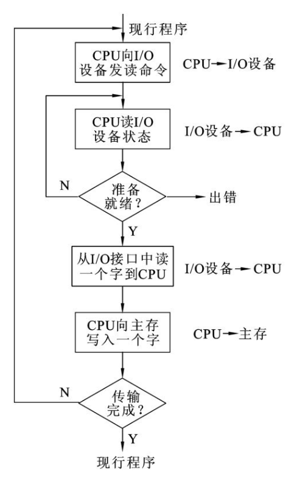

#### 程序中断方式

在I/O设备进行准备的过程中，CPU不进行查询，而是继续自己现行的工作，当I/O设备准备完成并可以进行信息交换时，CPU才暂停现行程序，转而为I/O设备的输入输出进行服务，信息交换完成后继续执行原来的程序。

- 特点

	- 实现了部分并行（在I/O设备准备数据时CPU可执行原程序），没有踏步等待现象。
	- 在中断现行程序时需要保护工作现场，返回程序时需要恢复现场，这些都需要CPU执行额外的工作。

	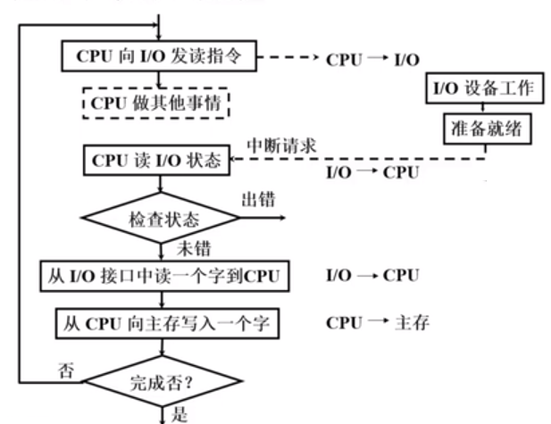

#### DMA方式

前2种方式I/O设备都须通过CPU才能和内存进行信息交换。DMA（直接内存访问）方式使得I/O设备可以和内存直接建立连接，由DMA控制器控制I/O设备和内存进行信息交换，从而使CPU进一步被解放。

- 特点

	- 不会中断现行程序。

	- 采用周期挪用（周期窃取）的方式获取总线占用权：I/O设备和内存进行信息交换必须通过总线（地址总线、数据总线、控制总线），此时CPU就需要把总线控制权让出来，让出来的时间就是一个完整的存取周期。

		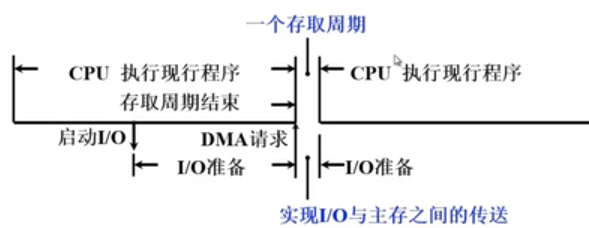

	- DMA控制器占用总线的过程中，CPU无法与内存进行交流，但仍可继续执行程序，因为在DMA占用总线前，CPU通常会把需要用到的指令存于缓存中，因此，DMA和CPU可以并行进行工作。

#### 三种方式的CPU工作效率比较

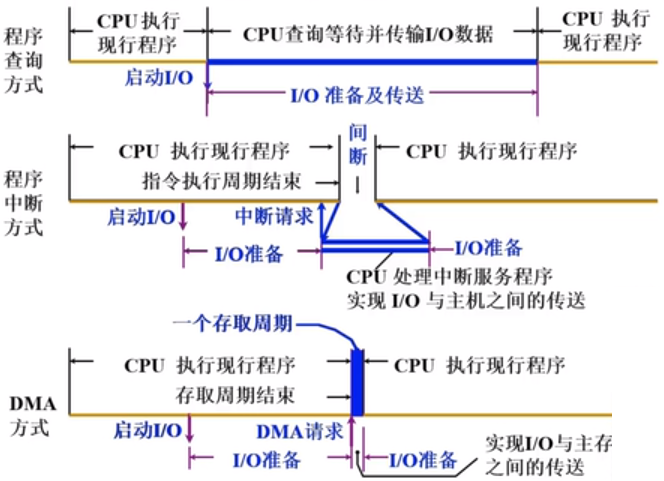

#### 其他方式

通道方式、I/O处理机方式

---

## 外部设备

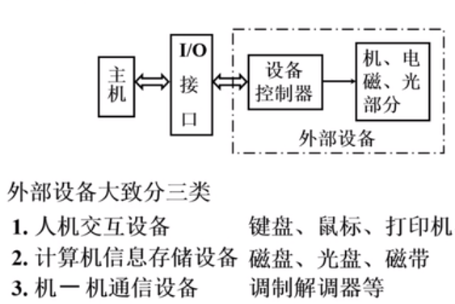

### 输入设备

将人能够识别的信息转换为计算机能够识别的格式

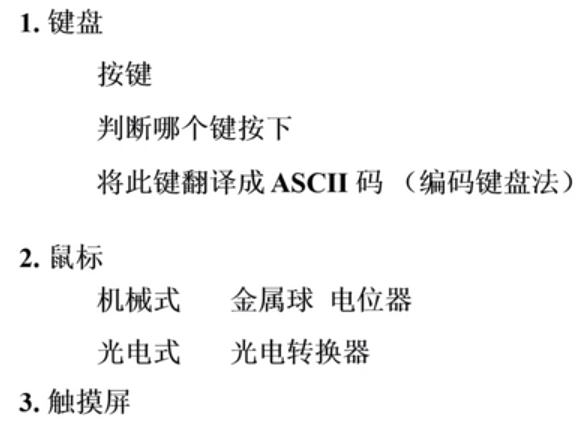

### 输出设备

将二值信息转换为人能够识别的信息

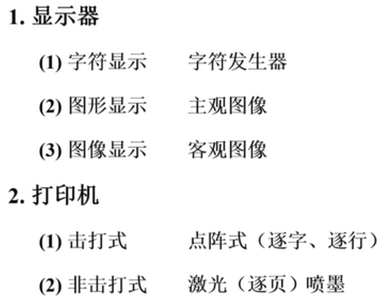

### 其他设备

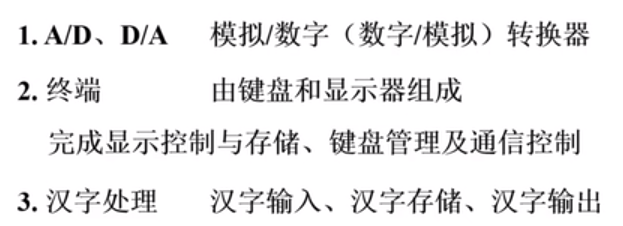

### 多媒体技术

VR、手柄

---

## I/O接口

### 设置接口的原因

- 实现设备的选择
- 实现数据缓冲，达到速度匹配（主机和设备的速度不一致）
- 实现数据串—并格式转换（主机和接口间采用并行方式，设备和接口间可能采用串行或者并行的方式）
- 实现电平转换（主机和设备的电平不一致）
- 传送控制命令
- 反映设备状态（忙、就绪、出错、中断请求）

### 接口功能和组成

1. I/O接口与总线连接的基本电路
	- 设备选择线：单向。主机向各个设备的接口传送这次操作对象的地址，如果某个接口通过比较电路匹配上后，说明该接口对应的设备是这次操作的对象。
	- 数据线：双向。完成主机和设备间数据的输入输出。
	- 命令线：单向。主机向接口发送命令，命令通过接口的缓存和译码后，可以控制设备做相应的操作。
	- 状态线：单向。从接口发送给主机，用于主机了解设备状态。

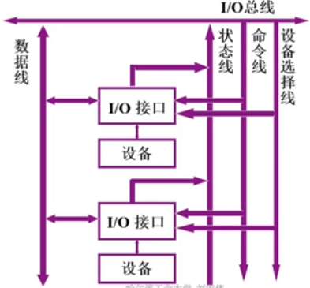

2. I/O接口的基本组成

	- 设备选择电路：实现选址功能
	- 命令寄存器、命令译码器：实现命令缓冲和译码功能
	- 数据缓冲寄存器：实现数据传送功能（串并转换也在该电路实现）
	- 设备状态标记：实现数据传送功能，由一系列触发器构成
		- 完成触发器D：数据是否准备好
		- 工作触发器B：标识设备工作状态
		- 中断请求触发器INTR
		- 屏蔽触发器MASK：用于屏蔽中断请求
	- 控制逻辑电路：使各电路按时序协调工作

	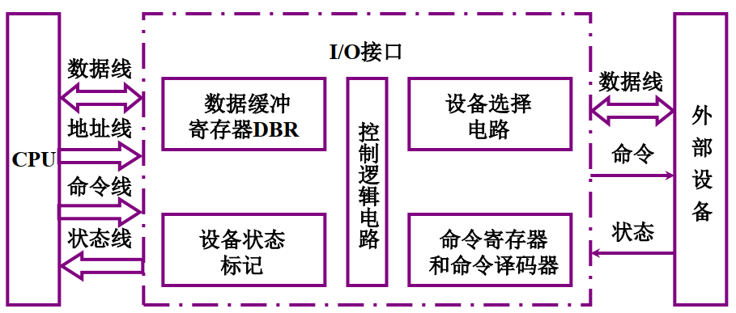

### 接口类型

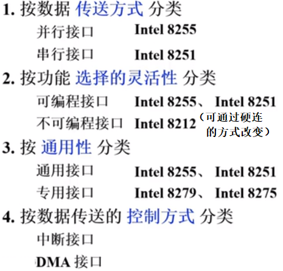

---

## 程序查询方式

### 程序查询方式的流程

1. 查询流程

	测试指令：用于检查设备状态标记；

	转移指令：用于检查设备是否准备好数据交换了；

	传送指令：用于交换数据；

	多设备查询时根据各个设备的优先级轮流进行查询。

	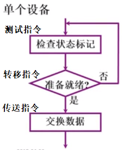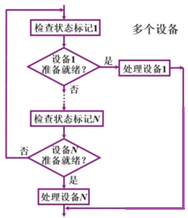

2. 程序编写流程

	- 在开始程序流程前，需要对CPU中用于保存设备信息的寄存器中原有的内容分进行保存，可以将其放在内存或其他空闲寄存器上。
	- 计数器：用于控制传输量（要传输多少数据），设置方式有①设成要传输数据的字数，每传输1个字，减少1个计数值；②设成补码，每传输1个字，增加1个计数值，直到溢出为0。
	- 设置主存地址：用于指定数据传输过程中数据要保存到主存的哪个地址上。

	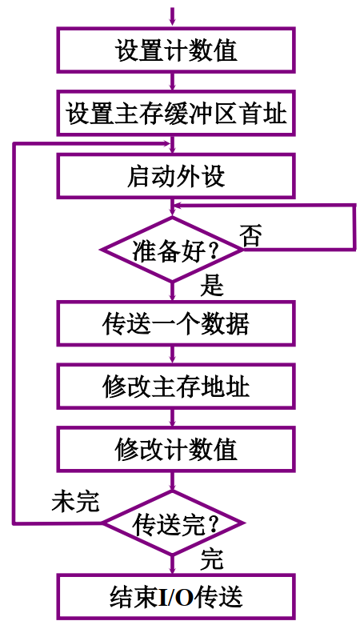

### 程序查询方式的接口电路

以输入为例：

1. 当CPU通过I/O指令启动输入设备时，指令的设备码字段通过地址线送至设备选择电路，若该接口的设备码与地址线上的代码吻合，其输出SEL有效。此时，如果I/O指令的启动命令有效，则与非门的输出也有效，通过与非门将工作触发器B置“1”，表示外设工作开始，将完成触发器D置“0”，表示外设没有准备好；
2. 由B触发器启动设备工作；
3. 输入设备将数据送至数据缓冲寄存器；
4. 由输入设备发出设备工作结束信号，将D置“1”，表示外设准备就绪，将B置“0”，表示外设工作结束；
5. D触发器以“准备就绪”状态通知CPU，表示“数据缓冲器满”；
6. CPU执行输入指令，将数据缓冲寄存器中的数据送至CPU的通用寄存器，再存入主存相关单元。

整个过程由控制电路按照时序产生一系列控制信号控制设备和接口完成相应的工作。

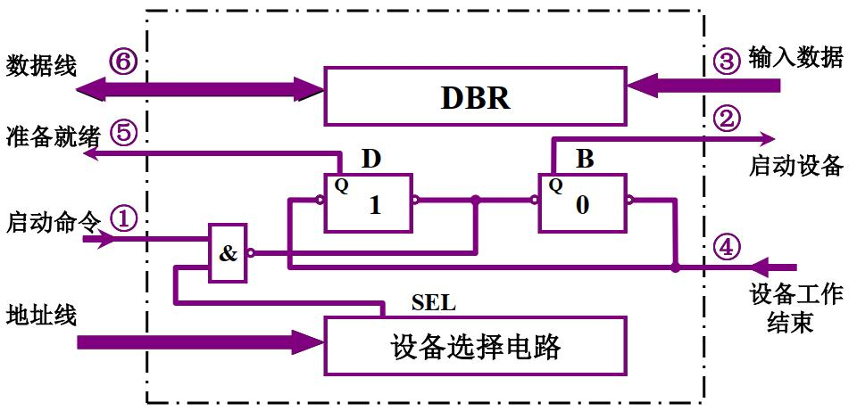

---

## 程序中断方式

### 中断的概念

计算机在执行程序的过程中，当出现异常情况或特殊请求时，计算机停止现行程序的运行，转向对这些异常情况或特殊请求的处理，处理结束后再返回到现行程序的间断处，继续执行原程序，这就是“中断”。

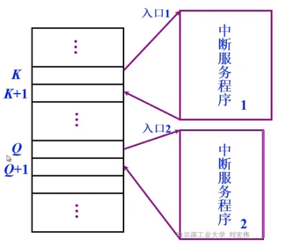

### I/O中断的产生

中断源：产生中断的因素

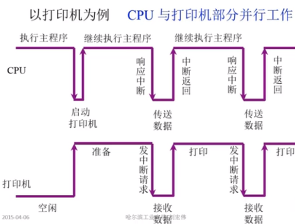

### 程序中断方式的接口电路

#### 中断请求触发器和中断屏蔽触发器的电路组成

- 中断请求触发器：用于产生中断请求

- 中断屏蔽触发器：如果现行程序比中断请求更重要，那么中断屏蔽触发器就会将中断请求触发器给屏蔽掉

- 工作过程：指令周期结束前CPU会发出中断查询信号，如果此时数据准备完成（完成触发器为1）并且没有被屏蔽（MASK为0），那么INTR就会产生中断请求。

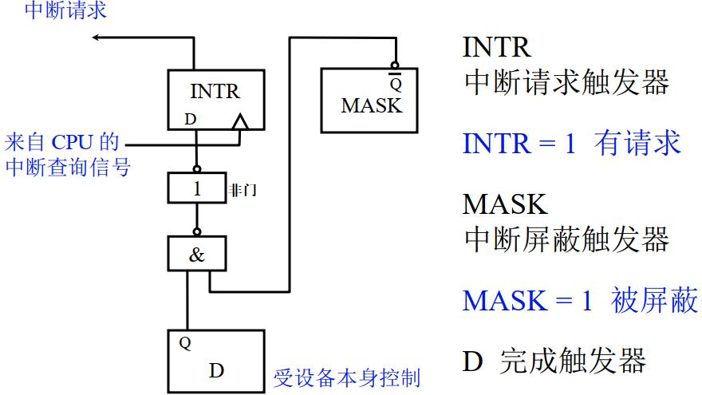

#### 排队器的电路组成

- 排队器：同一时间发送中断请求的设备可能有多个，排队器用于对这些设备的优先级进行排序，使优先级高的设备的中断请求可以被优先响应

- 排队有硬件和软件两种方式，这里采用硬件方式（称为链式排队器）

- 工作过程：该电路中级别最高的中断源是1号，其次是2号、3号、4号。不论是那个中断源（一个或多个）提出中断请求，排队器输出端INTPi′只能有一个高电平。当只有2号中断源发送请求时，比其优先级低的中断源的INTP′只能是低电平，无法发送中断请求，而级别比2号高的1号中断源的INTP′依然是高电平，此时通过上端的与非门就可以保证最后输出的INTP中，只有2号中断源是高电平，被排队选中。

	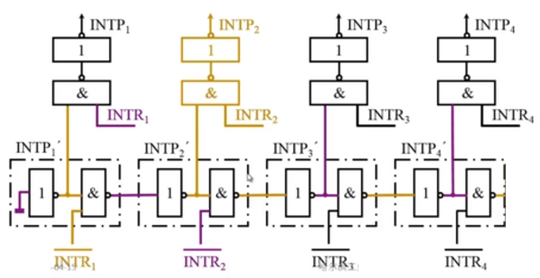

#### 中断向量地址形成部件的电路组成

- 中断向量地址形成部件：用于形成设备对应中断服务程序在内存中的起始地址（入口地址）

- 有两种方法： 硬件向量法和软件查询法。这里采用硬件向量法，利用硬件（即中断向量地址形成部件，可放在CPU，也可放在各个接口中）产生向量地址，再由向量地址找到中断服务程序的入口地址。

- 由向量地址寻找中断服务程序的入口地址通常有两种方法：① 向量地址所在存储单元保存一条无条件跳转指令，CPU响应中断时，只要将向量地址送至PC，执行这条指令，便可转向对应的中断服务程序的入口地址；② 向量地址所在存储单元直接保存中断服务程序的入口地址。

- 工作过程：中断向量地址形成部件将排队器输出转换为向量地址，并通过数据总线将向量地址传送给CPU，CPU再根据向量地址找到中断服务程序的入口地址。

	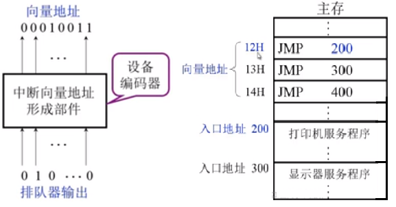

#### 程序中断方式接口电路的基本组成

- CPU响应中断的条件和时间

	- 条件：允许中断触发器EINT = 1（可通过以下方式开关）

		用开中断指令将EINT置 “1”

		用关中断指令将EINT置“ 0” 或硬件自动复位

	- 时间：当D = 1（随机）且 MASK = 0 时在每条指令执行阶段的结束前CPU发中断查询信号（将 INTR 置“1” ）

- I/O接口中断处理过程（以输入为例）
	1. 设备被选中且启动命令有效，命令译码发出命令，将完成触发器置为0，将工作触发器置为1
	2. 设备启动，进行数据准备
	3. 设备将数据输入到DBR中
	4. 设备工作结束，将完成触发器置为1，将工作触发器置为0
	5. MASK没有屏蔽请求，且CPU发送中断查询，INTR则输出1
	6. 启动排队器，并发出中断请求
	7. CPU发出中断响应，启动设备编码器，将排队器的输出转换为向量地址
	8. 向量地址通过数据总线传输给CPU，CPU通过向量地址启动中断服务程序，将DBR中缓存的数据取走

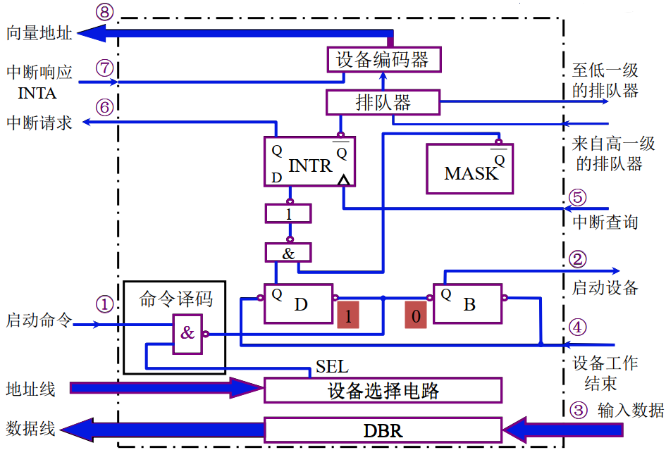

### 中断服务程序

#### 基本流程

 （1）保护现场。一是保存程序断点，由系统通过硬件的中断隐指令自动完成；二是保存通用寄存器和状态寄存器的内容，靠中断服务程序这个软件来完成，在中断服务程序的起始部分安排若干条存数指令，将寄存器的内容存至存储器中保存，或用进栈指令将各寄存器的内容推入堆栈保存。

（2）中断服务（设备服务）。这是中断服务程序的主体部分，对于不同的中断源，其中断服务操作的内容是不同的。

（3）恢复现场。这是中断服务程序的结尾部分，要求在退出服务程序前，将原程序中断时的“现场”恢复到原来的寄存器中。通常可用取数指令或出栈指令，将保存在存储器（或堆栈）中的信息回送到原来的寄存器中。

（4）中断返回。中断服务程序的最后一条指令通常是一条中断返回指令，使其返回到原程序的断点处，以便继续执行原程序。

#### 单重中断和多重中断

- 单重中断：不允许中断现行的终端服务程序

- 多重中断：允许级别更高的中断源中断现行的中断服务程序

从取指令、执行指令到中断周期都属于一条指令的不同解释阶段。

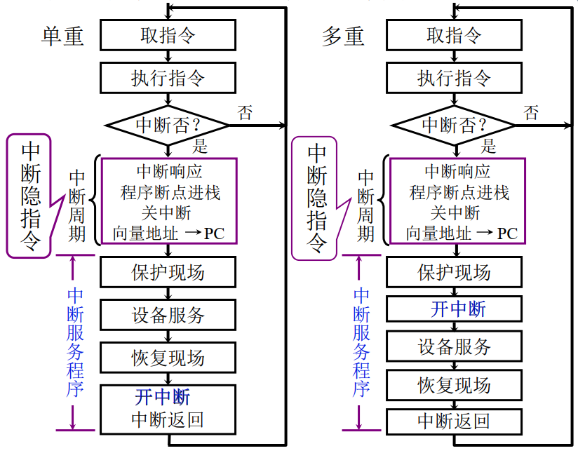

#### 主程序和服务程序抢占 CPU

---

## DMA方式

### DMA方式的特点

#### DMA和程序中断两种方式的数据通路

数据通路：数据在功能部件之间传送的路径

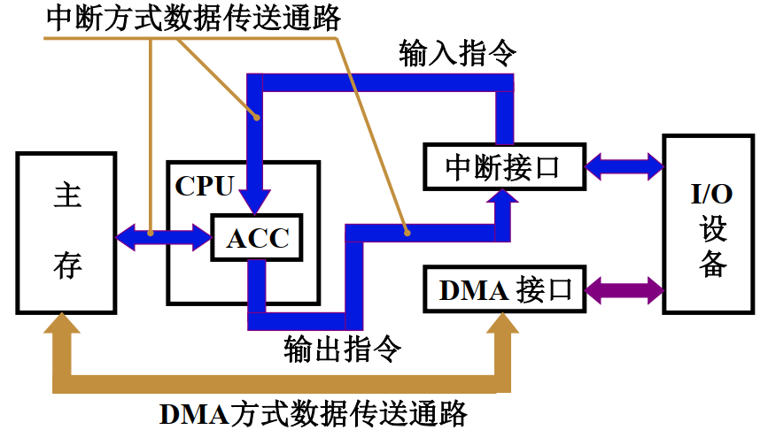

#### DMA与主存交换数据的方式

1. 停止CPU访问主存

	- 当外设要传送一批数据时，由DMA发一个请求信号给CPU，要求CPU放弃对总线的使用权，当DMA控制器获得总线控制权以后，开始进行数据传送。在一批数据传送完毕后，DMA通知CPU可以使用内存，并把总线控制权交还给CPU。在DMA传送过程中，CPU基本处于不工作状态或者说保持状态。

	- 优点：控制简单，适用于数据传输率很高的设备进行成组传送。

	- 缺点：在DMA控制器访内阶段，内存的效能没有充分发挥，很大一部分内存周期是空闲的，因为外设数据传送间隔一般总是大于内存存储周期。

2. 周期挪用（周期窃取）

	- 在这种DMA传送方法中，当I/O设备没有DMA请求时，CPU按程序要求访问内存；一旦I/O设备有DMA请求，则由I/O设备挪用一个或几个内存周期，并在数据传送间隔或数据准备阶段，放弃对内存和总线的使用权。
	- 有三种情况
		- CPU不需要访存，DMA可以挪用内存周期
		- CPU正在访存，DMA不能挪用内存周期
		- CPU与DMA同时请求访存，由DMA获得总线控制器，以防止I/O设备上的数据丢失
	- 优点：较好地发挥了内存和CPU的效率。
	- 缺点：I/O设备每次周期挪用都要经过申请、建立、归还总线控制权的过程，所以传送一个字对内存来说要占用一个周期，但对DMA控制器来说一般需要若干个内存周期。因此，周期挪用的方法适用于I/O设备读写周期大于内存存储周期的情况。

3. DMA与CPU交替访问

	- 一个CPU周期可分为C1和C2两个分周期，其中C1专供CPU访内，C2供DMA控制器访内。这种方式不需要总线使用权的申请、建立和归还过程，总线使用权是通过时序控制的。

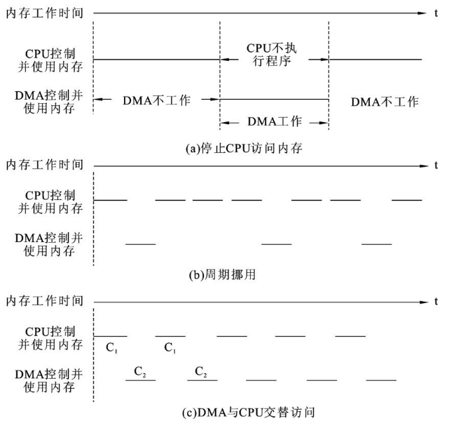

### DMA接口的功能和组成

#### DMA接口功能

1. 向CPU申请DMA传送
2. 处理总线控制权的转交
3. 管理系统总线、控制数据传送
4. 确定数据传送的方向、首地址和长度
5. 修正传送过程中的数据地址和长度（用于确定传送是否结束）
6. DMA传送结束、给出操作完成信号

#### DMA接口组成

AR：地址计数器，要访问的内存地址（由CPU给出）。

WC：字数计数器，保存要传输的数据量（补码形式）。

DAR：设备地址寄存器，用于设备选择电路或保存设备信息。

BR：数据缓冲器，暂存数据。

DMA控制逻辑：①接收设备的请求和向设备发出控制信号；②向CPU发出DMA请求和接收CPU的应答信号。

中断机构：当接收到WC的溢出信号后（数据传完了），向CPU发出中断请求，让CPU处理后续。

地址线：将要访问的内存地址送给主存。

数据线：用于CPU给AR置内存初始地址，也给WC、DAR置值以及用于数据的输入输出。

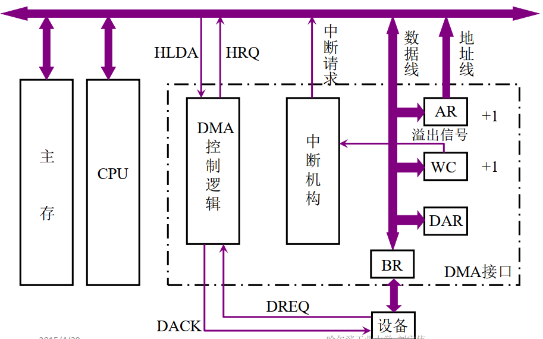

### DMA工作过程

#### 三个阶段介绍

预处理、数据传送、后处理

- 预处理：由CPU执行几条输入输出指令，预置如下信息，在这些工作完成后，CPU继续执行原来的主程序。
	- 通知DMA控制逻辑数据的传输方向（出/入）
	- 设备地址 -> DMA的DAR
	- 主存地址 -> DMA的AR
	- 传送字数 -> DMA的WC
- 数据传送：当外设准备好发送数据时，它发出DMA请求，由DMA控制器向CPU发出总线占用请求。CPU在指令周期执行结束后响应该请求，并使CPU的总线驱动器处于高阻状态，从而与系统总线相脱离，DMA控制器接管总线，并向内存提供地址。在内存和外设每交换一个字后，DMA便对地址计数器和字计数器进行修改，并重新发出请求，直到计数值到达零，DMA操作结束，向CPU发送中断请求。
- 后处理：一旦DMA的中断请求得到响应，CPU停止主程序的执行，转去执行中断服务程序，做一些DMA的结束处理工作：校验送入内存的数据是否正确；决定继续用DMA方式传送下去，还是结束传送；测试在传送过程中是否发生了错误等。

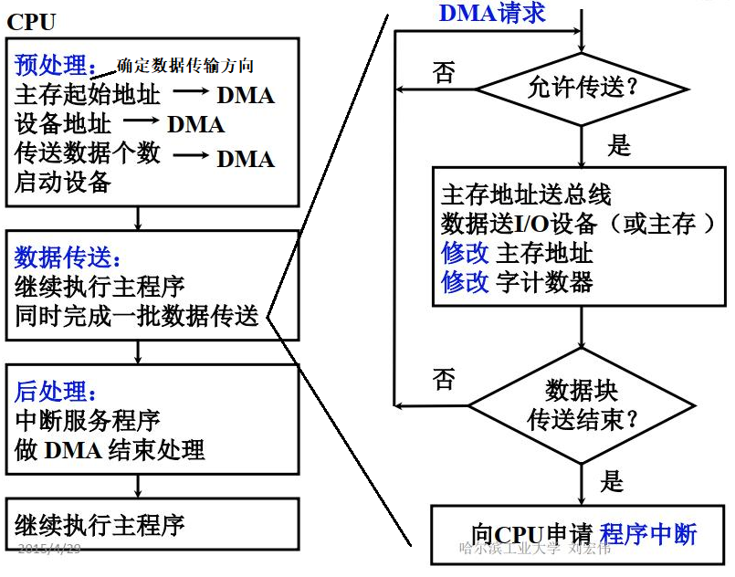

#### 举例说明数据传送过程

- 输入过程
	1. 设备向BR输入数据；
	2. 设备通知DMA控制器，我已经准备好数据了，需要传送；
	3. DMA控制器发送总线占用请求；
	4. CPU应答，并放弃总线控制器；
	5. DMA占用总线，向主存发送地址，使地址总线有效；
	6. DMA通知设备开始传输数据了；
	7. DMA向内存发出写入指令，将数据从BR通过数据线传输给主存，同时修改AR和WC，然后判断是否传输完成。若没有，设备继续将数据放入BR，DMA继续发出占用请求，继续传输数据，直到WC溢出；
	8. WC溢出，向中断机构发出溢出信号，中断机构向CPU发出中断请求。

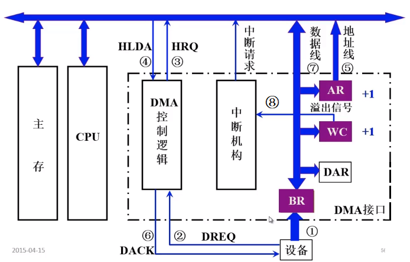

- 输出过程

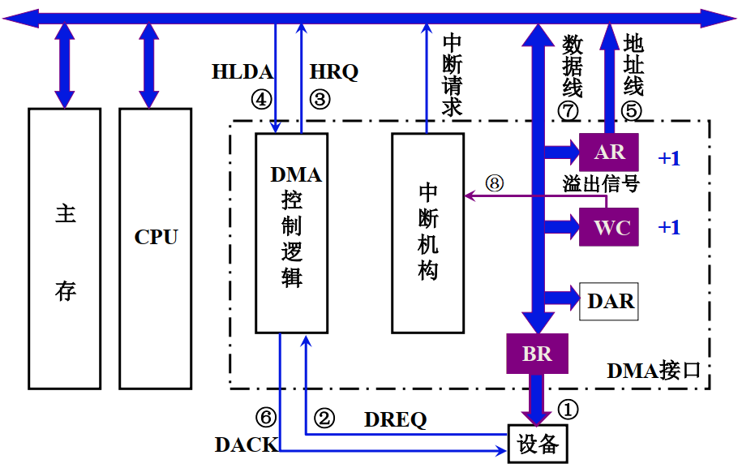

### DMA接口与系统的连接方式

1. 具有公共请求线的DNA请求：CPU链式查询DMA请求，越靠近CPU优先级越高

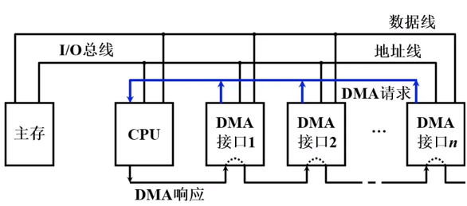

2. 独立的DMA请求：由CPU内的排队器控制各个DMA的优先级

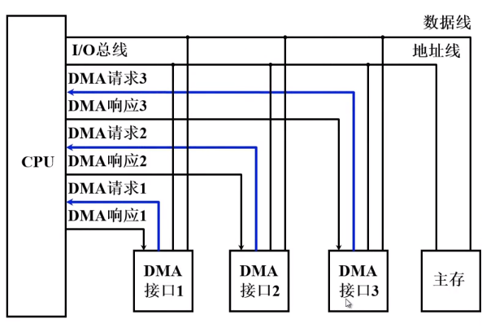

### DMA方式与程序中断方式的比较

① 从数据传送看，程序中断方式靠程序传送，DMA方式靠硬件传送；

② 从CPU响应时间看，程序中断方式是在一条指令执行结束时响应，而DMA方式可在指令周期内的任一存取周期结束时响应；

③ 程序中断方式有处理异常事件的能力，DMA方式没有这种能力；

④ 程序中断方式需要中断现行程序，故需保护现场；DMA方式不中断现行程序，无需保护现场；

⑤ 程序中断方式的中断请求用于传输数据，DMA方式的中断请求用于后处理；

⑥ DMA的优先级比程序中断的优先级高。

### DMA接口类型

#### 选择型

- 一个接口连接多个设备，由CPU预处理时执行的输入输出指令给接口预置的信息（尤其是设备地址寄存器）来决定哪一个设备可以和内存进行数据交换，此时其他设备就无法提出DMA请求。即在整个工作过程中，只能有一个设备进行数据准备，并使用DMA接口来进行数据传送。

- 串行准备，串行传输。

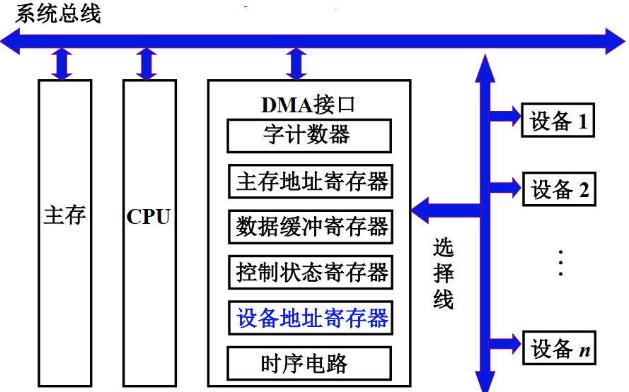

#### 多路型

- 这种DMA接口被称为通道，由多个子通道构成，每个子通道都具有DMA接口的功能，一个子通道可以连接多个设备。如果CPU执行多个输入输出指令，向多个子通道进行设值，那么这些子通道对应的设备会同时进行准备工作，但同一时间只有一个子通道可以占用总线进行数据传输。即在整个工作过程中，可以有多个设备同时进行数据准备，但只有一个的设备可以进行数据传输。

- 并行准备，串行传输。

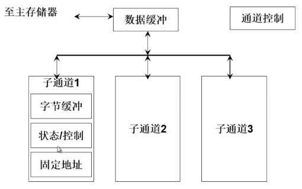

- 多路型DMA接口的工作原理

	假设磁盘、磁带、打印机分别连接到三个不同的子通道上，这三个设备数据准备完成后，向子通道发送DMA请求。在响应时，DMA接口会按照请求的先后顺序来处理请求，如果有两个设备同时进行请求，那么优先级高（速度更快）的设备会被响应。因此三个设备请求响应过程如下：

	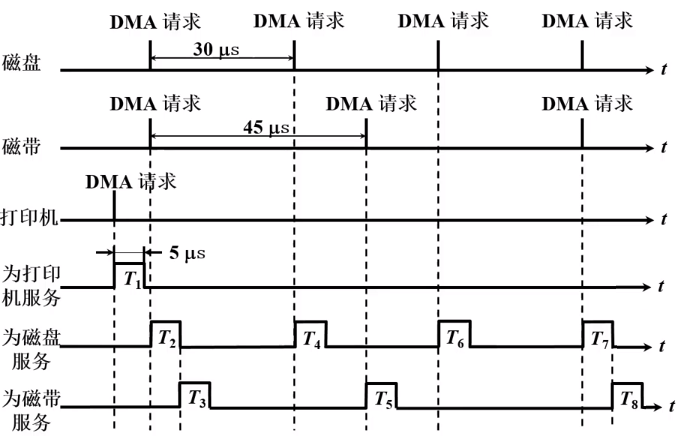