# 计组原理-运算方法

数据表示：指在计算机中能够被硬件直接识别和处理的数据类型，即指令集中包含对这些数据类型进行操作的指令。

CPU中要处理的数均放在寄存器中，寄存器的位数被称为机器字长。

---

## 机器数的表示方法

### 无符号数和有符号数

1. 无符号数

	无符号数是指没有符号位的数，因此寄存器的每一位均可用来存放数值，即机器字长直接反映无符号数的表示范围。

2. 有符号数

	有符号数是指有符号位的数，符号位通常由寄存器的高位表示，即用“0”表示“正”，用“1”表示“负”，这样也叫做符号数字化。

### 机器数与真值

- 把符号“数字化”的数称为机器数，而把带“+”或“-”符号的数称为真值。也就是说，真值是我们日常生活中表示数的方法，机器数是计算机中表示和保存数的方法。

- 机器数在计算机中要保存三部分内容：符号位、数值位、小数点位置。

- 事实上，计算机并不保存小数点位置，而是通过约定默认小数点的位置，即约定小数形式的机器数的小数点在符号位后面，整数形式的机器数的小数点在数值位后面。

	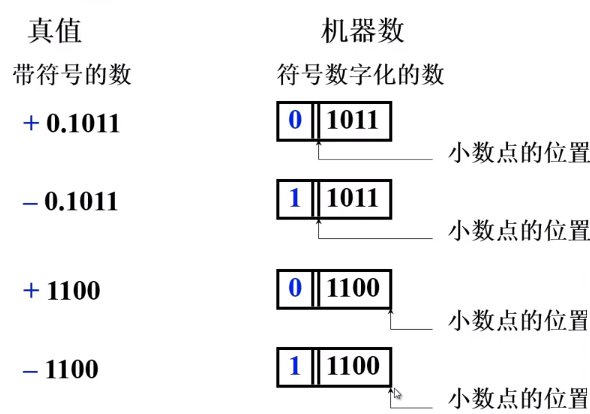

### 原码表示法

计算机中保存机器数的一种方法。

1. 定义
	- 符号位为0表示正数，为1表示负数，数值部分是真值的绝对值，故原码表示又称为带符号的绝对值表示。
	- 为区分整数和小数，约定整数的符号位与数值位之间用逗号隔开；小数的符号位与数值位之间用小数点隔开。这里的逗号和小数点在计算机中并不保存，仅为阅读方便。
	- 将真值转换成原码前，要知道机器字长，因为只有知道机器字长，才能确定符号位在哪里，也才能知道该原码可以表示的真值范围。

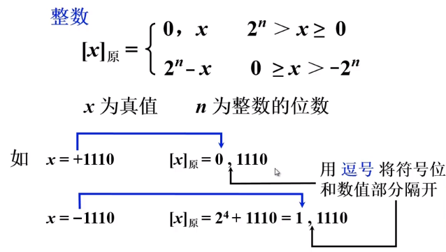

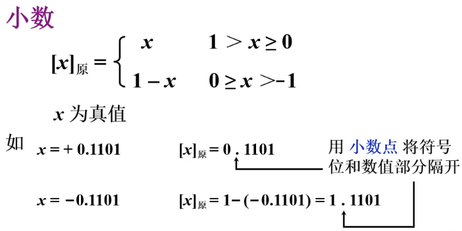

2. 特点
	- 原码中的“零”有两种表示形式，且不相等。
	- 用原码进行加减运算比较麻烦，既需要加法器，也需要减法器。

3. 举例

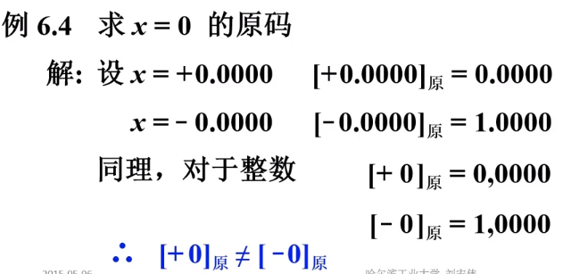

### 补码表示法

#### 补数的概念

时钟显示6点，欲使它指示3点，既可将分针顺时针转9圈，又可将分针逆时针转3圈，结果是一致的，因为时钟的时针转一圈能指示12个小时，当点数超过“12”时，这“12”在时钟里是不被显示而自动丢失的，故15点和3点均显示3点，因此-3和+9对时钟而言其作用是一致的。

在这里，12被称为模，写作mod 12，+9称为-3以12为模的补数，记作-3≡+9（mod 12），或者说，对于模12，-3和+9互为补数。

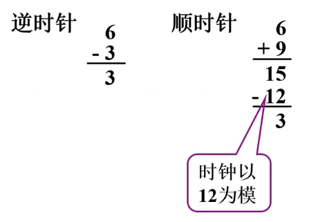

**结论**

- 只要确定了模，就能找到与负数等价的正数（即负数的补数）来代替此负数，即可用加法运算来实现减法运算；
- **某个数的补数=这个数+模数**，而大于模的部分会自动丢失，因此补数 一定不大于模；
- 一个负数可用它的正补数来代替，该正补数等于模加上负数本身；
- 一个正数和一个负数互为补数时，它们绝对值之和即为模数；
-  正数的补数即该正数本身；

#### 补码的定义

- 利用溢出后进位丢失的原理，采用真值的补数来表示该真值对应的机器数，即补码表示；

- 对于整数的真值，转换成补码时，模数为2^(n+1)，n为数值位数，将第n+1位看作符号位，所以该机器数的总位数为n+1；

- 对于小数的真值，转换成补码时，模数为2，小数点前有1位，表示符号位，假设机器字长为8，则有7位用于数值位，超过7位部分的小数会被丢弃。如果模数为4，小数点前有2位，最高位表示符号位；

  >对于模2^4，-1011和+0101的补数均为0101，因此出现一个问题：0101到底表示的是谁的补数？为了解决这个问题，将模数变为2^5，此时-1011的补数为10101，+0101的补数为00101，突然神奇的事情发生了，对于4位数值的真值来说，正数的补数的最高位永远是0，负数的补数的最高位永远是1，因此可以将补数的最高位当做符号位来用，而数值位还是模2^4对应的补数。
  >
  >**原因：不管模数多大，两数之和与两数的补数之和的结果都是一样的。利用这个原理，将模数增大，也不影响计算结果，而且此时补数的高位呈现出特殊现象，可以作为符号位使用，用于区分补数的数值位是表示正数还是负数，此时符号位既表示补码的符号，也作为运算的一部分。也就是说，符号位也是数的一部分，但由于它因真值的正负而呈现出不同的特征，因此也可以作为标识使用。**

- 求负数真值的补码的快捷方式：符号位取1，数值位按位取反后+1（按此方法再计算一遍就是原码）；

- 补码只有一种表示0的方式。

	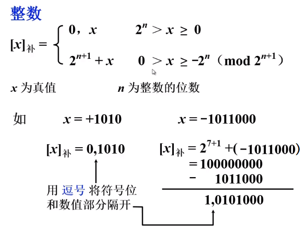

#### 举例

1. 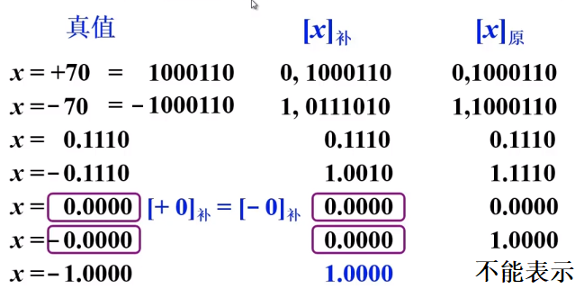

2. 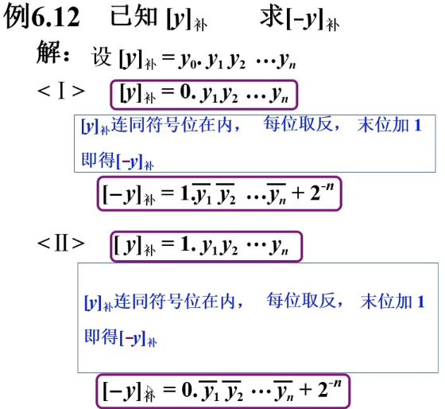

### 反码表示法

反码通常用来作为由原码求补码或者由补码求原码的中间过渡。

1. 反码的定义

	- 将原码数值位按位取反求得（不加1），也可看作是mod 2^(n+1)-1或mod 2-2^(-n)的补码，因此与补码相比，仅在末位差1；
	- 将反码的数值位按位取反就是原码。

	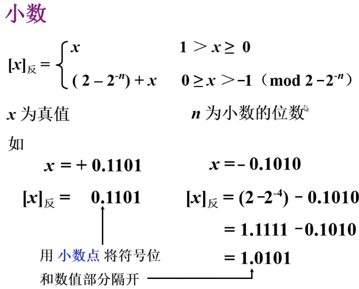

2. 举例

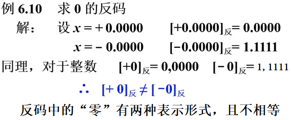

### 三种机器数比较

-  最高位均为符号位，书写时符号位和数值部分用“.”（小数）或“, ”（整数）隔开；
- 当真值为正时，原码 = 补码 = 反码；
- 当真值为负时，符号位均用“1”表示，而数值部分的关系是，补码是原码的“求反加l”，反码是原码的“每位求反”；
- 原码之所以有两种表示0的方式，而补码没有，是因为原码的符号位是根据真值的正负号来决定的导致+0和-0不一样，而补码的符号位是根据真值的数值本身来决定的，因此只有一种表示0的方式；

- 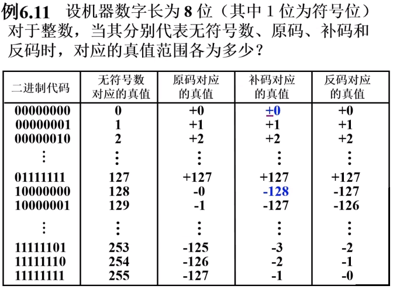

### 移码表示法

移码用于解决补码难以直接判断其真值大小的问题。

1. 移码定义

	- 移码就是在真值上加一个常数2^n，在数轴上移码所表示的范围恰好对应于真值在数轴上的表示范围向轴的正方向移动2n个单元。
	- 同一个真值的移码和补码仅差一个符号位，若将补码的符号位由“0”改为“1”，或从“l”改为“0”，即可得该真值的移码。
	- 在逻辑电路中，只需在符号位加上一个非门就可以将补码和移码进行相互转换。

	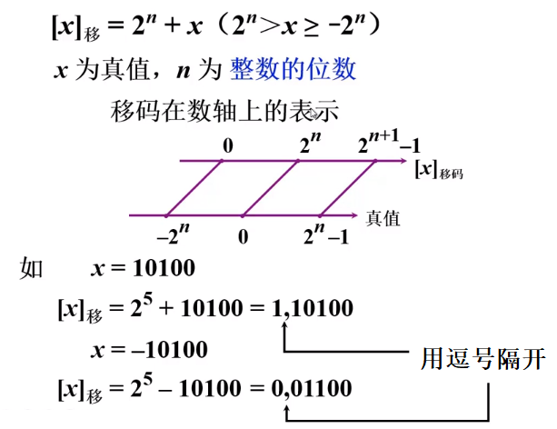

2. 真值、补码、移码的对照表

	

3. 特点

	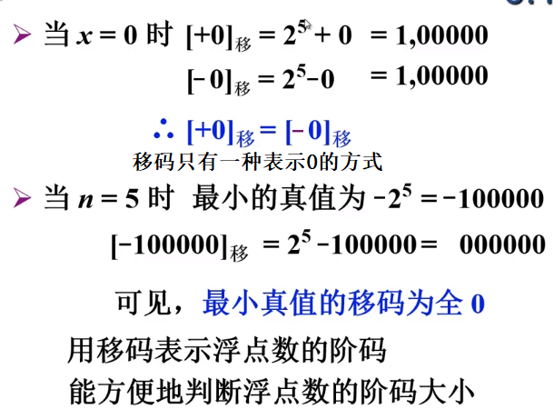

---

## 数的定点表示和浮点表示

### 定点表示

小数点固定在某个位置的数称为定点数，这个位置按约定给出，共有以下两种方式：①小数点位于数符和第一数值位之间，该机器数为纯小数；②小数点位于数值位之后，该机器数为纯整数。

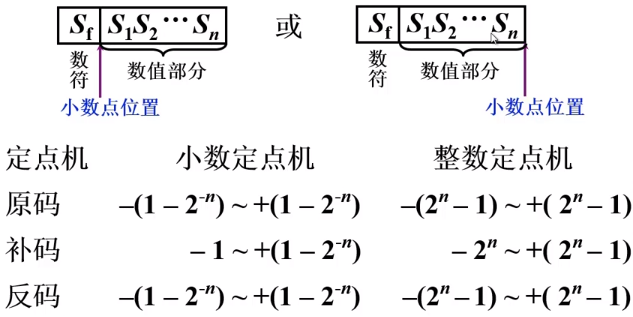

采用定点数的机器称为定点机，其中，采用纯小数的叫小数定点机，采用纯整数的叫整数定点机。数值部分的位数n决定了定点机中数的表示范围。在定点机中，由于小数点的位置固定不变，故当机器处理的数不是纯小数或纯整数时，必须乘上一个比例因子，否则会产生“溢出”。

### 浮点表示

#### 引入浮点数的原因

1. 小数点调整困难

1. 为了表示很大的数，定点机需要很长的机器字长
2. 数据存储单元利用率低

#### 浮点数的表示方法

浮点数即小数点的位置可以浮动的数，与科学计数法相似，通常被表示为

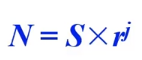

式中，S为尾数（可正可负）, j 为阶码（可正可负）, r是基数（或基值）

- 在计算机中，基数可取2、4、8、16，分别表示阶码每增减1小数点移动1位、2位、3位、4位。
- 在计算机中规定浮点数的尾数用纯小数形式，阶码用纯整数形式。

#### 浮点数的存储形式

浮点数在计算机中也是以机器数的形式进行存储，并在设计计算机时就已经确定了基数的值，因此只需要存储浮点数的尾数部分和阶码部分。

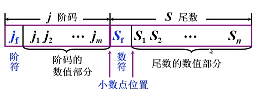

- 阶码是整数，阶符和阶码的位数m合起来反映浮点数的表示范围及小数点的实际位置；

- 尾数是小数，其位数n反映了浮点数的精度，数符代表浮点数的正负。

#### 浮点数的表示范围

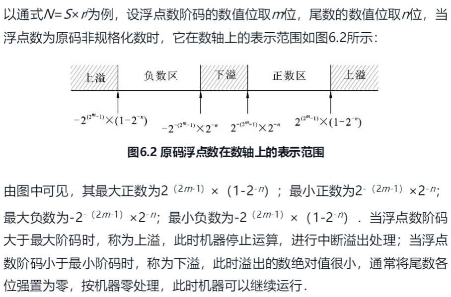

一旦表示浮点数的位数确定后，如何分配阶码和尾数的位数会直接影响浮点数的表示范围和精度。通常对于短实数（总位数为32位），阶码取8位（含阶符l位），尾数取24位（含数符1位）；对于长实数（总位数为64位），阶码取11位（含阶符1位），尾数取53位（含数符l位）；对于临时实数（总位数为80位），阶码取15位（含阶符1位），尾数取65位（含数符1位）。

>浮点数的位数确定后，这个机器能够表示的浮点数的个数也就确定了，而且每个浮点数之间都是离散的，因此计算机对数的表示是用有限的数据表示无限多的实数。

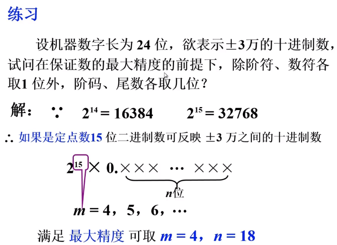

#### 浮点数的规格化

规格化的浮点数精度最高。

##### 规格化数的形式

基数r不同，浮点数的规格化形式不同：

- 基数为2时，尾数数值部分最高位为1的数为规格化数；
- 基数为4时，尾数数值部分最高2位不全为0的数为规格化数；
- 基数为8时，尾数数值部分最高3位不全为0的数为规格化数。

##### 规格化过程

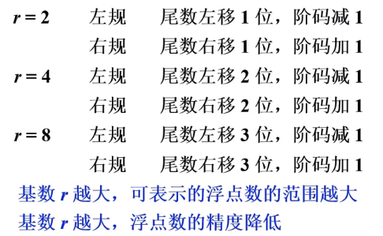

##### 规格化数的表示范围

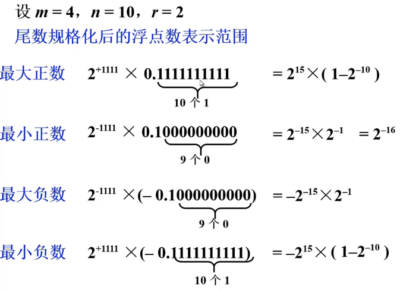

#### 浮点机中机器零的表示

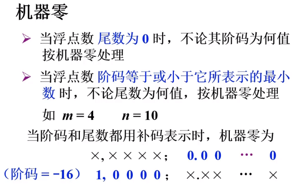

### 定点机和浮点机表示数举例

1. 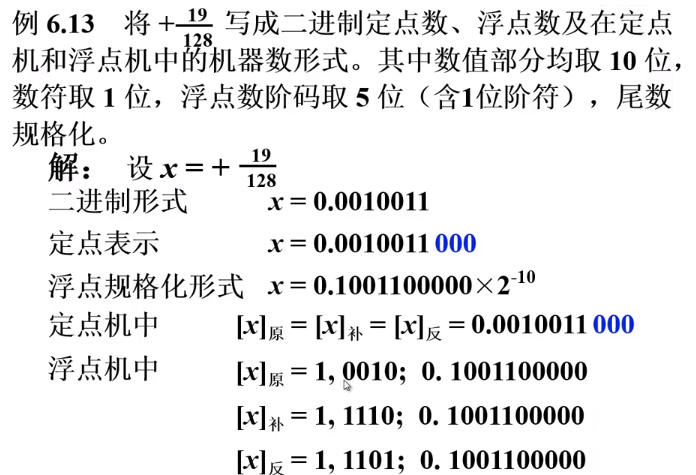

2. 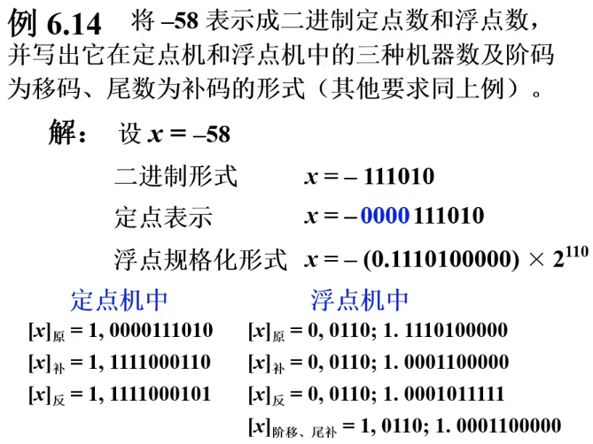

### IEEE 754标准

---

## 定点运算

### 移位运算

#### 移位的意义

- 15m => 1500cm，1500相当于数15相对于小数点左移了两位，并在小数点前面添了两个0。

- 移位运算称为移位操作，与加减运算配合，实现乘除运算。

> - 计算机中小数点的位置是事先约定好的，因此左移或右移说的是机器数相对于小数点作移动，而小数点不动。
> - 对于二进制表示的机器数，左移1位，对应真值变为原来的2倍；右移1位，对应真值变为原来的2分之1。
>
> - 对无符号数的移位称为逻辑移位，对有符号数的移位称为算术移位。

#### 算术移位规则

由于机器字长是固定的，机器数进行移位操作时，左移就会使高位数值丢失，低位部分产生空缺，而右移就会使低位数值丢失，高位部分产生空缺。这些空位需要进行添补，为了保证数据正确，就需要遵循以下添补规则：

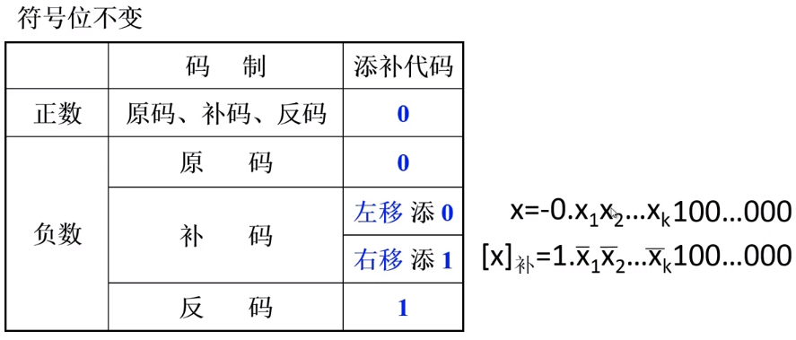

>**分析：**
>
>1. 不论是正数还是负数，移位后其符号位均不变。
>2. 机器数为正时，不论是左移还是右移，添补代码均为0。
>3. 由于负数的原码数值部分与真值相同，故在移位时只要使符号位不变，其空位均添0即可。
>4. 由于负数的反码各位除符号位外与负数的原码正好相反，故移位后所添的代码应与原码相反，即全部添1。
>5. 对于任意负数的补码，由低位向高位找到第一个“1”时，该“1”左边各位均与对应反码相同，该“1”右边各位（包括此“1”）均与对应原码相同。故负数的补码左移时，因空位出现在低位，则添补的代码与原码相同，即添0；右移时因空位出现在高位，则添补的代码应与反码相同，即添1。

#### 算术移位的硬件实现

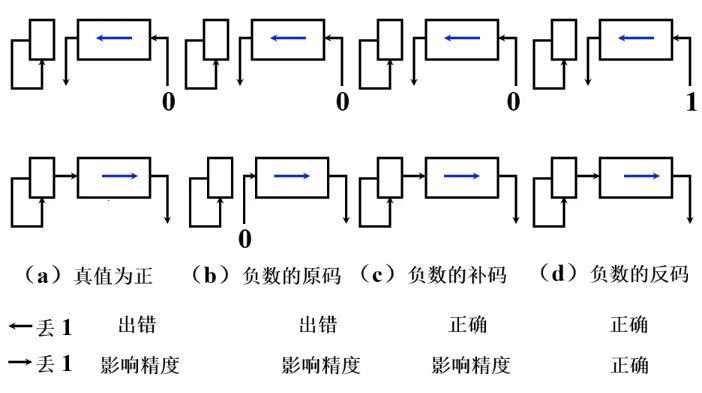

#### 算术移位和逻辑移位的区别

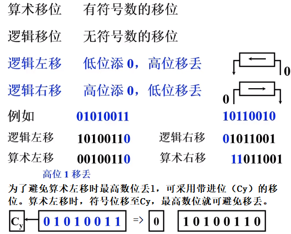

### 加减法运算

#### 补码加减法运算公式

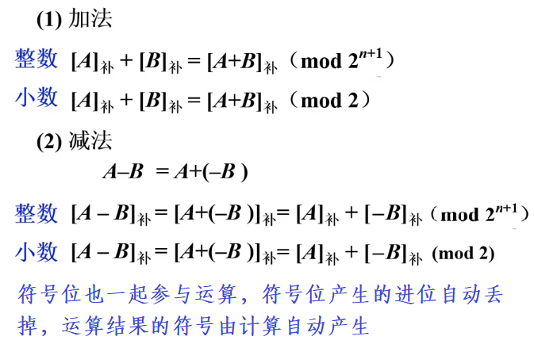

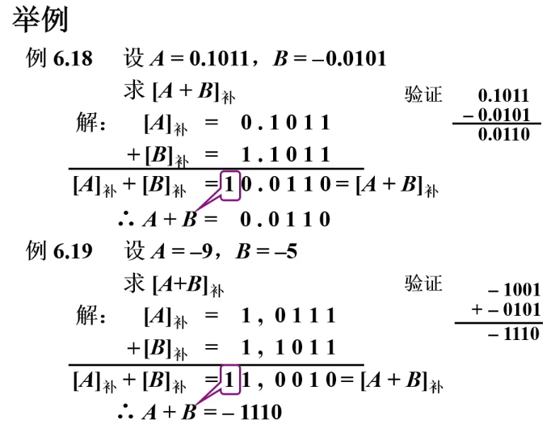

#### 溢出判断

- 1位符号位判断溢出

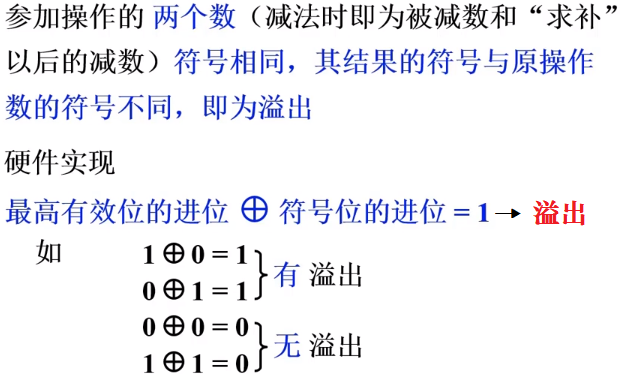

- 2位符号位判断溢出

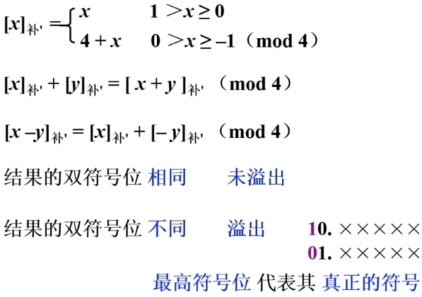

#### 补码加减法的硬件实现

- 寄存器A、X用于存放机器数，其中A存放被加数（或被减数）的补码，X存放加数（或减数）的补码，它们的位数均与加法器相等。

- GA为加法标记，GS为减法标记，GA置1时表示做加法运算，GS置1时表示做减法运算。

- 求补控制逻辑用于减法运算时将寄存器X中的值进行求补。求补过程：加法器和寄存器X之间有一个反相器，用于将寄存器中的值进行求反，求反后将最末位全加器的进位输入置为1，即可得到对应的补码。

- 运算结果溢出时，通过溢出判断电路置“1”溢出标记V。

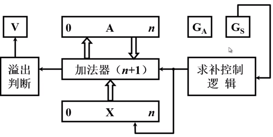

### 乘法运算

#### 笔算乘法分析

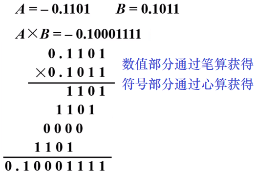

计算机实现乘法需要解决的问题：

- **符号位单独处理**：异或电路。符号位相同为0，不同为1。
- 乘数的某一位决定**是否加被乘数**：移位寄存器。判断乘数末位的值，如果是1，则进行相加，然后将乘数右移，重复判断末位。
- **多个位积进行相加**：移位寄存器+累加器。每次相加时，将位积右移1位与被乘数进行相加。
- 乘积的**位数扩大1倍**：使用两个寄存器保存乘积。

根据问题**改进笔算乘法**：将被乘数左移进行相加，改进为将累加和右移进行相加，原理如下。

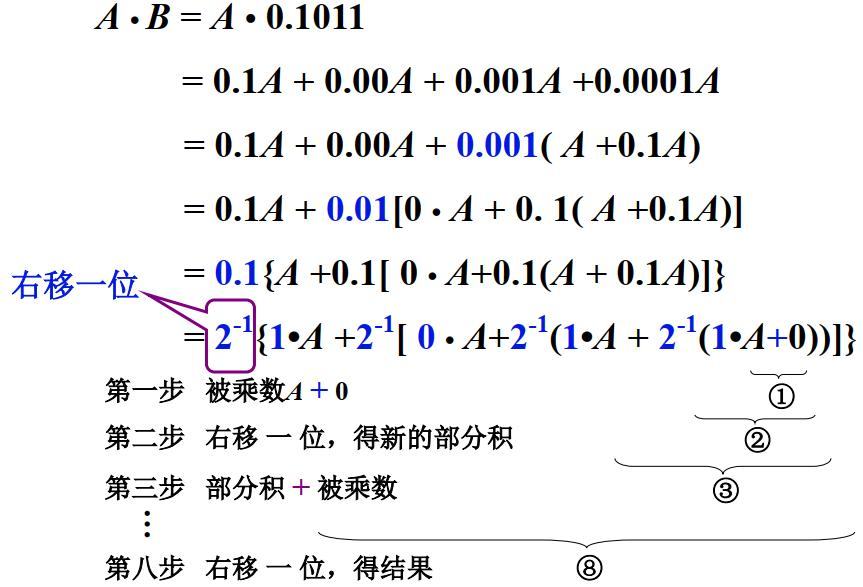

改进后算法的乘法过程：

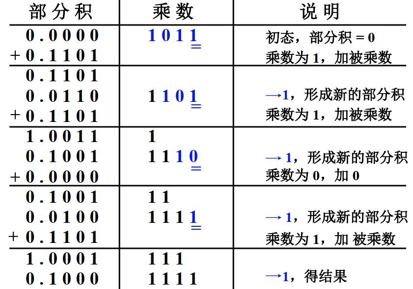

**结论**

1. 乘法运算可用加和移位实现。若数有4位，则需加4次，移4次。
2. 由乘数末位决定部分积是否与被乘数相加，然后右移1位形成新的部分积，同时乘数也右移1位（末位移丢），空出高位存放部分积移丢的低位。
3. 被乘数只与部分积的高位相加。
4. 硬件实现：
	- 3个寄存器：①X保存被乘数；②ACC保存部分积高位；③MQ保存部分积低位和乘数余位（ACC、MQ具有移位功能）
	- 1个全加器：用于将被乘数和部分积高位进行相加

#### 原码乘法

**原码1位乘**

- 运算规则

	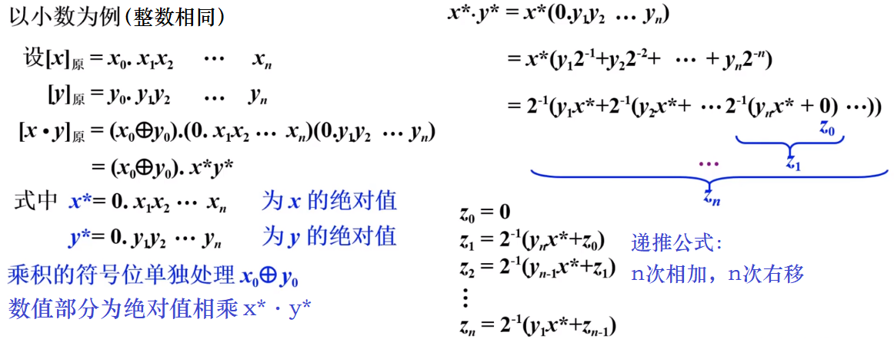

- 举例

	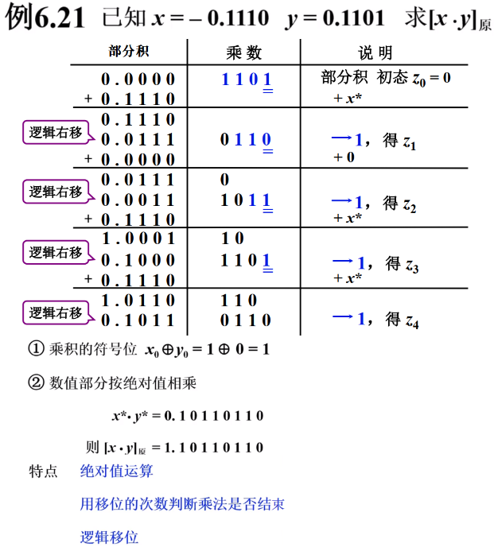

- 硬件实现

	- 寄存器A：存放部分积高位，共有n+1位，最高位用于存放与被乘数相加后的进位，具有右移功能
	- 寄存器Q：存放部分积低位和乘数余位，具有右移功能
	- 寄存器X：存放被乘数，无移位功能
	- 计数器C：用于控制相加和移位的次数
	- S：存放符号位异或后的结果
	- GM：乘法标记
	- 移位和加控制：1次加法1次移位，由乘数最低位控制
		- 当乘数最低位为1时，控制门打开，寄存器X中的被乘数被送到加法器中，和部分积进行相加，然后将部分积和乘数右移1位；
		- 当乘数最低位为0时，直接将0送入加法器和部分积进行相加，然后将部分积和乘数右移1位（或者不进行送值相加，直接进行移位操作）。

	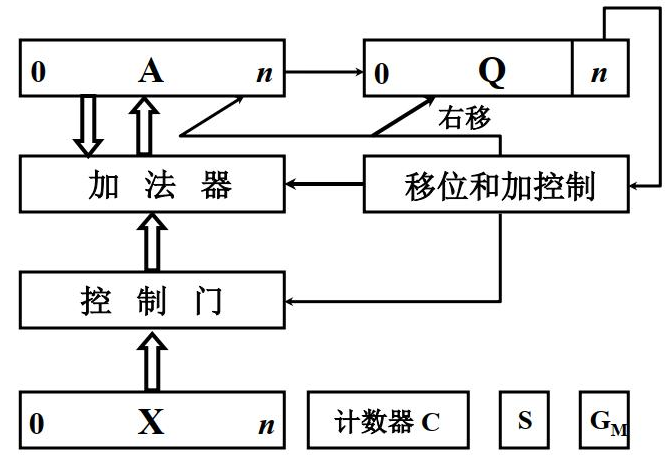

- 控制流程

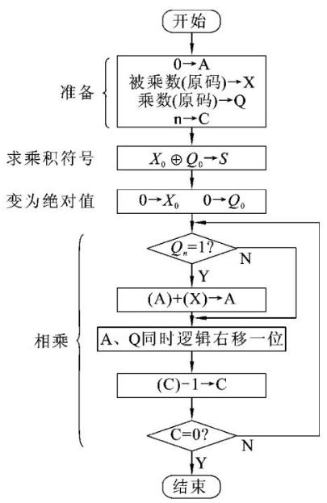

**原码2位乘**

- 符号位和数值部分的运算分开进行：符号位直接通过异或电路求得；数值部分通过移位和加法求得。

	- **用两位乘数的状态来决定新的部分积如何形成**

	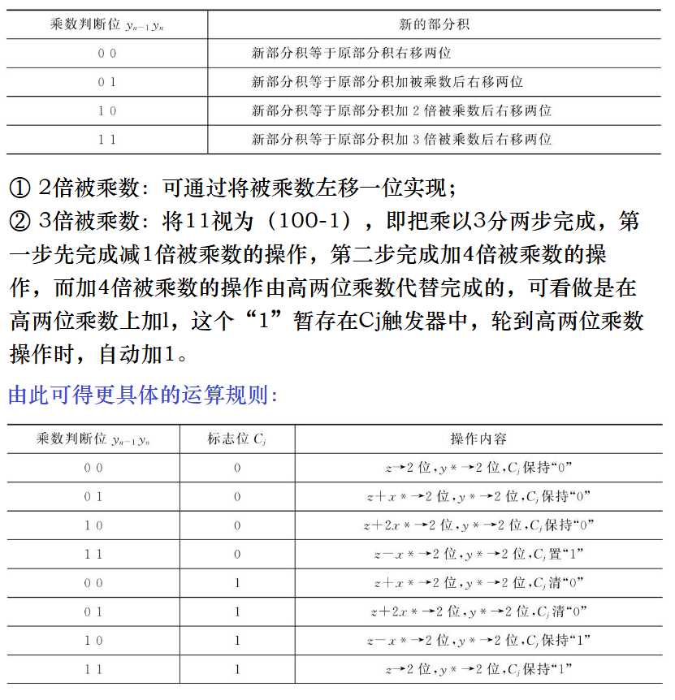

	- -x* 运算采用 +[-x∗]补 实现，因此参与运算的操作数是绝对值的补码，右移操作应按补码右移规则完成
	- 运算时可能要+[2x∗]补 ，使部分积绝对值大于2，为保证正确，对部分积取3位符号位，且以最高位作为真正符号位
	- 为保证每次判断时都有两位乘数，需在乘数最高位前增加2个0（当乘数位数为偶数时）或1个0（当乘数位数为奇数时）

- 举例

	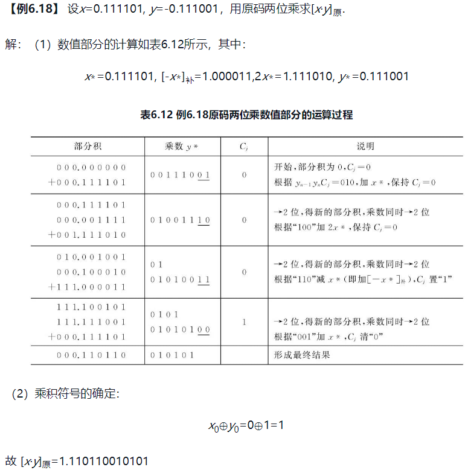

#### 补码乘法

**补码1位乘**

- **校正法**

	- 运算规则

		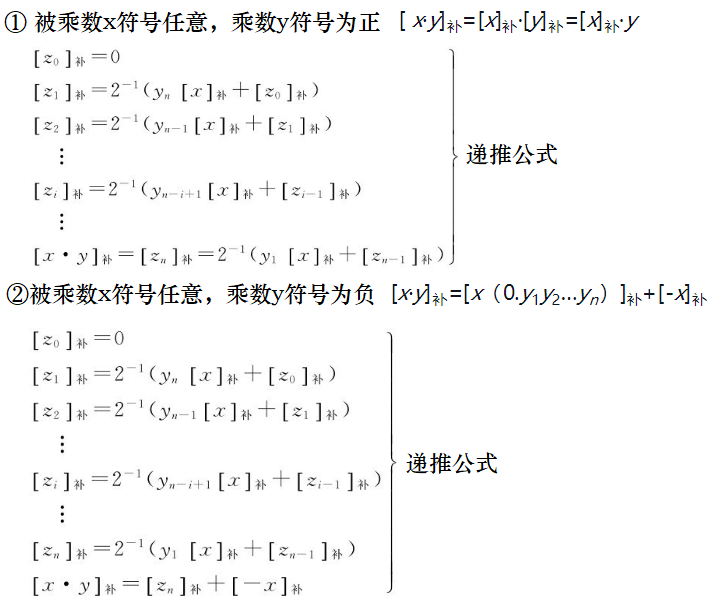

	- 校正法按乘数正负分为两种计算方式：

		- 当乘数为正时，按原码乘法步骤采用补码规则运算；
		- 当乘数为负时，把乘数的补码[y]补去掉符号位，当成一个正数与[x]补相乘，然后加上[-x]补进行校正。

	- 由于运算时可能出现绝对值大于1的情况，故部分积和被乘数取双符号位；被乘数的符号位参与运算，最后形成乘积的符号位；乘数的符号位不参与运算。

	- 举例

		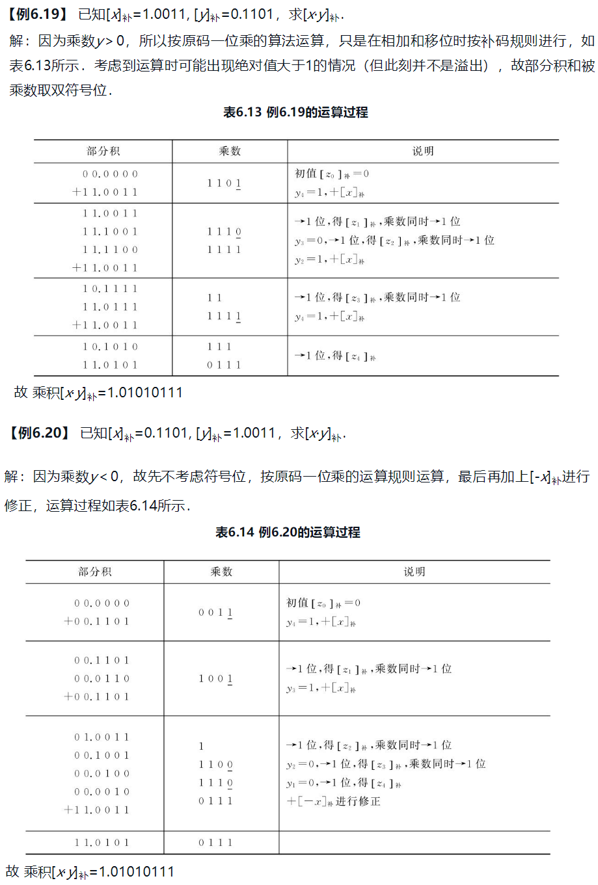

- **比较法**

	- 运算规则

		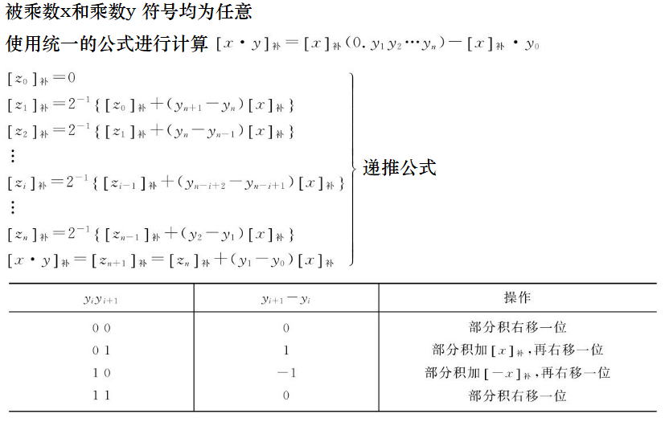

	- yn+1=0，[z0]补=0，每步乘法由（yi+1-yi）（i=1,2, …, n）决定原部分积 +[x]补 或 +[-x]补 或 +0，再右移1位得新的部分积，如此重复n+1步，但第n+1步不进行移位，即得[x·y]补。

	- 部分积和被乘数取双符号位，被乘数和乘数的符号位均参加运算。

	- 举例

		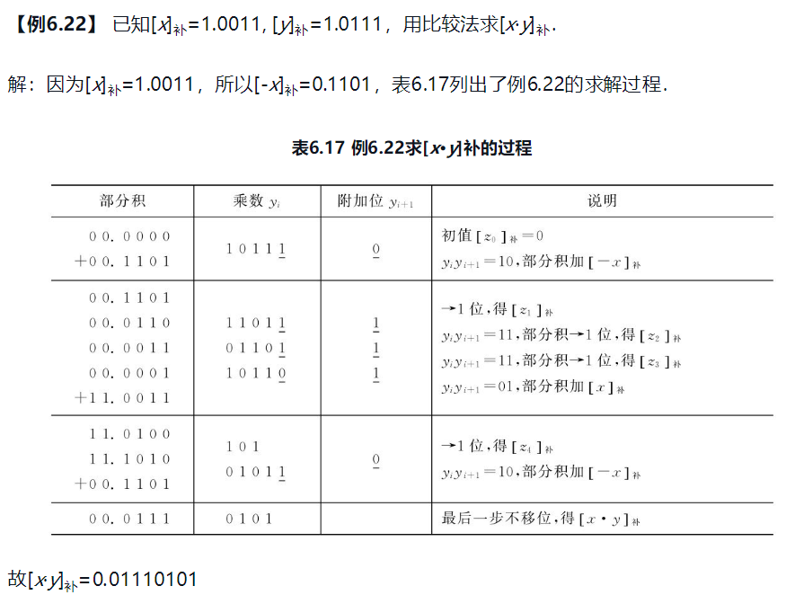

	- 硬件实现和流程图

		- A、X、Q均为n+2位寄存器，其中X存放被乘数的补码（含两位符号位）, Q存放乘数的补码（含最高1位符号位和最末1位附加位），移位和加控制逻辑受Q寄存器末2位乘数控制。当其为01时，A、X内容相加后A、Q右移一位；当其为10时，A、X内容相减后A、Q右移一位．计数器C用于控制逐位相乘的次数，GM为乘法标记。

		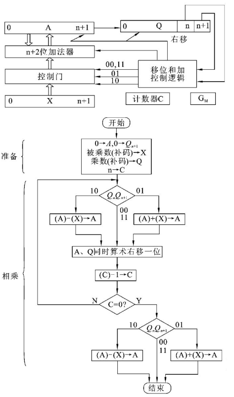

**补码两位乘**

补码两位乘运算规则是根据补码一位乘的规则，把比较yiyi+1的状态应执行的操作和比较yi-1yi的状态应执行的操作合并成一步得出的。

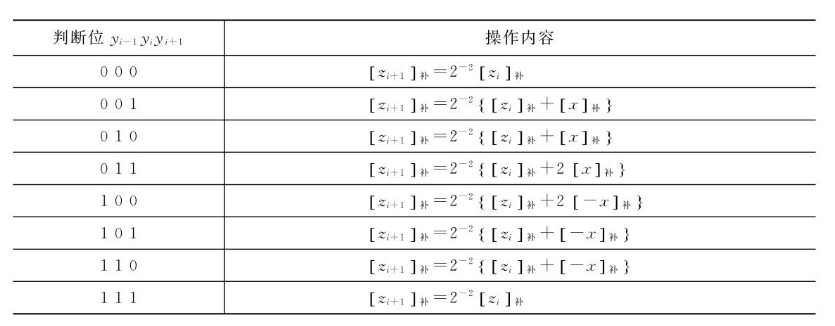

- +2 [x]补和+2 [-x]补都可能因溢出而侵占双符号位，故部分积和被乘数采用3位符号位；乘数每次右移2位并用3位判断，因此取2位符号位。

- 举例

	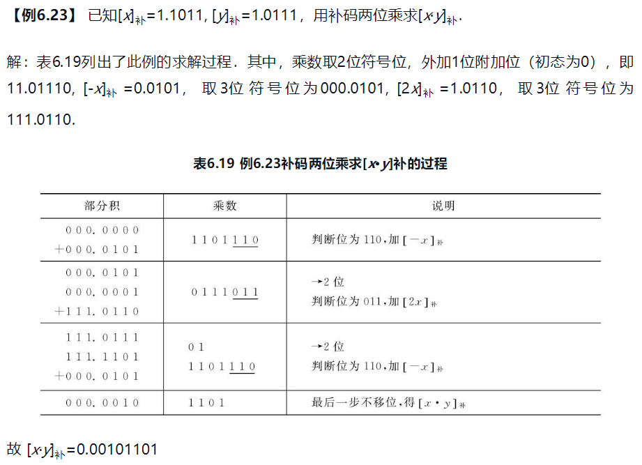

### 除法运算

#### 笔算除法分析

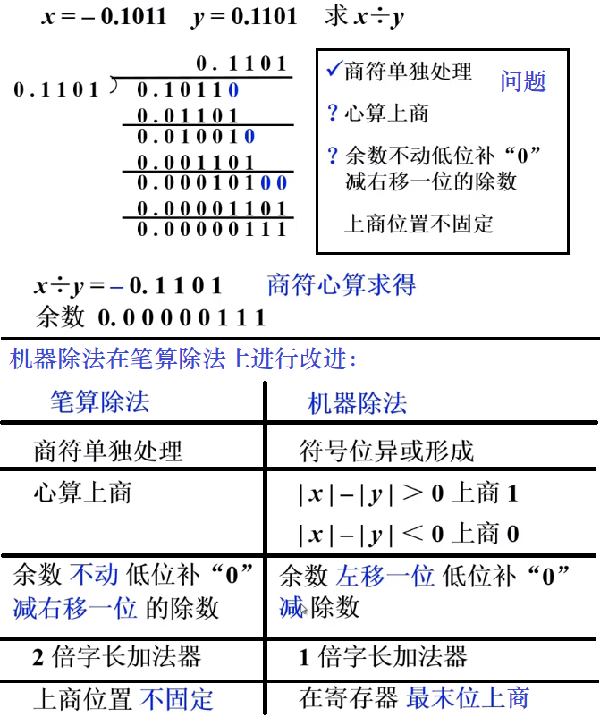

#### 原码除法

1. 基本运算规则

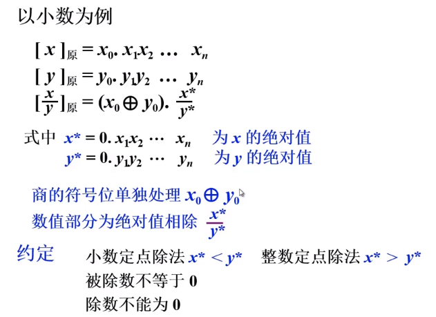

2. 恢复余数法

	当余数为负时，需加上除数，将其恢复成原来的余数。由于商值的确定是通过比较被除数和除数的绝对值大小，即由 x\*-y\* 实现，而计算机内只设加法器，故需将 x\*-y\* 变为 [x∗]补+[-y∗]补 。

	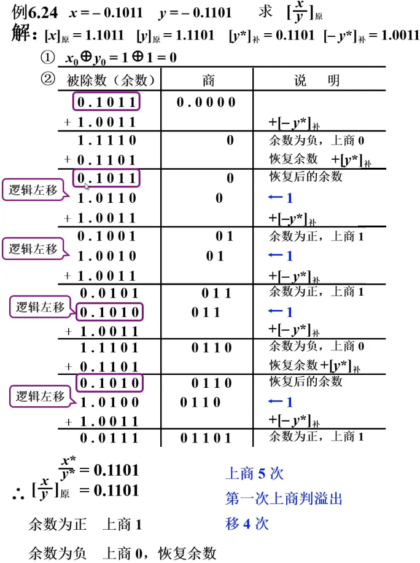

3. 不恢复余数法（加减交替法）

	- 分析

		

	- 举例

		

	- 硬件实现

		

#### 补码除法

**恢复余数法**

（略）

**加减交替法**

1. 运算规则

	

2. 举例

	

3. 硬件实现和控制流程

	补码加减交替法所需的硬件配置与原码加减交替法相似，只是省掉了S触发器，因为补码除法的商符在运算中自动形成。此外，在寄存器中存放的均为补码。

	

---

## 浮点运算

### 浮点加减运算

#### 对阶


#### 尾数求和

将对阶后的两个尾数按定点加（减）运算规则进行运算。

#### 规格化


#### 舍入

在*对阶*和*右规*过程中，可能出现尾数末位丢失引起误差的情况，此时需考虑舍入。

1. “0舍1入”法

	在尾数右移时，被移去的最高数值位为0，则舍去；被移去的最高数值位为1，则在尾数的末位加1。这样做可能使尾数又溢出，此时需再做一次右规。

2. “恒置1”法

	尾数右移时，不论丢掉的最高数值位是“1”或“0”，都使右移后的尾数末位恒置“1”。

#### 溢出判断

在浮点规格化中，当尾数之和（差）出现01.××…×或10.××…×时，并不表示溢出，只有将此数右规后，再根据阶码来判断浮点运算结果是否溢出。

浮点数的溢出与否可由阶码的符号决定，即阶码[j]补=01,××…×为上溢，按出错处理；阶码[j]补=10,××…×为下溢，按机器零处理。


#### 硬件配置和运算流程

浮点运算器主要由两个定点运算部件组成：

- 阶码运算部件，用来完成阶码加、减，以及控制对阶时小阶尾数右移次数和规格化时对阶码的调整；
- 尾数运算部件，用来完成尾数的四则运算以及判断尾数是否已规格化，此外，还需有判断运算结果是否溢出的电路等。


#### 举例

- 

- 

### 浮点乘除运算

- 两个浮点数相乘，乘积的阶码应为相乘两数的阶码之和，乘积的尾数应为相乘两数的尾数之积。

- 两个浮点数相除，商的阶码为被除数的阶码减去除数的阶码，尾数为被除数的尾数除以除数的尾数所得的商。

---

## 算术逻辑单元

### ALU电路


### 快速进位链

#### 并行加法器

每一位运算产生结果的过程都是并行的。


#### 串行进位链


#### 并行进位链

并行进位链也叫做先行进位或跳跃进位。


**1. 单重分组跳跃进位链**


**2. 双重分组跳跃进位链**

双重分组跳跃进位就是将n位全加器分成若干大组，每个大组中又包含若干小组，而每个大组内所包含的各个小组的最高位进位是同时产生的，大组与大组间采用串行进位。因各小组最高位进位是同时形成的，小组内的其他进位也是同时形成的（注意：小组内的其他进位与小组的最高位进位并不是同时产生的），故又有组（小组）内并行、组（小组）间并行之称。


- 进位过程分析

	① 大组内每个小组的最高进位只与外来进位C-1有关

	

	②大组内进位线路

	分别同时接收来自组内输出的本地进位Di和传送条件Ti，同时（并行）产生本组的最高进位。

	

	③ 小组内进位线路

	1）第8小组内同时（并行）产生本组中的低三位进位以及最高进位的本地进位和传送条件。

	2）其他小组内只产生该组的最高进位的本地进位和传送条件，其低三位进位需要等待上一小组最高进位的输入才能进行输出。

	

	④ n=16的第二大组进位完整线路

	a. 第8小组内并行产生本组的低三位进位和最高进位的本地进位和传送条件，其他小组内只产生本组的最高进位的本地进位和传送条件；

	b. 第二重进位链同时接收到来自各组的本地进位和传送条件，并行产生各组的最高进位；

	c. 第5、6、7小组同时接收到上一小组的最高进位，并行产生本组内的低三位进位。

	

	⑤ n=32的双重分组跳跃进位完整线路

	d. 第一大组接收到第二大组产生的最高进位（此时第一大组的第二重进位链已经接收到来自各小组传来的本地进位和传送条件），并行产生第4小组的低三位进位以及各小组的最高进位；

	e. 第1、2、3小组同时接收到上一小组的最高进位，并行产生本组内的低三位进位。

	